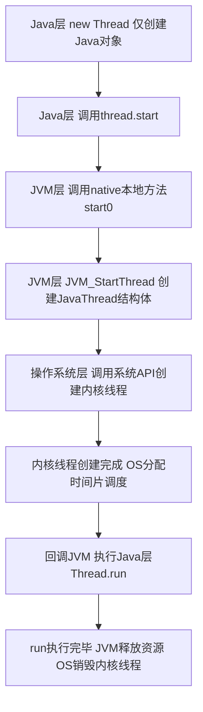
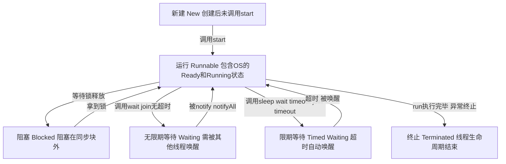
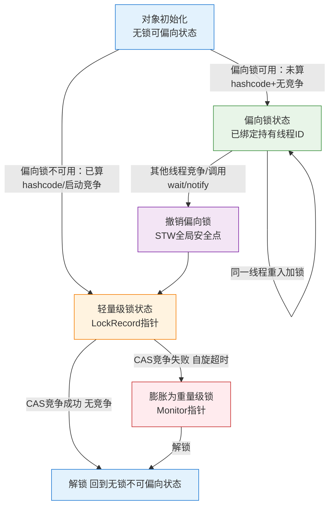

# 《深入理解Java虚拟机》第12章+第13章 超详细学习笔记
> 文档说明：本笔记100%对标周志明《深入理解Java虚拟机（第3版）》原版内容，完整嵌入今日对话所有核心知识点、底层拆解、误区纠正，包含可直接复制到Typora渲染的流程图、代码示例，彻底解决JMM、线程、线程安全、锁优化全链路学习疑问。
## 第一篇 第12章 Java内存模型与线程
### 1.1 前置知识：硬件内存架构与JMM设计根源
#### 1.1.1 CPU缓存与缓存一致性问题
现代计算机CPU的运算速度远高于主内存（物理内存）的读写速度，为了弥补性能差距，CPU引入了**多级高速缓存架构**：
- 每个CPU核心拥有独立的L1、L2高速缓存
- 所有CPU核心共享L3高速缓存
- 缓存与主内存之间以「缓存行（Cache Line，通常64KB）」为单位进行数据传输
**核心问题**：多核CPU同时操作同一个主内存数据时，各自的缓存副本会出现数据不一致，也就是「缓存一致性问题」。CPU通过MESI等缓存一致性协议解决这个问题，而Java内存模型（JMM），本质上就是对硬件缓存一致性协议的**跨平台抽象封装**。
#### 1.1.2 核心误区纠正：JMM工作内存到底是什么？
> 今日对话核心疑问：工作内存不是JVM开辟的连续内存，而是对硬件层的逻辑抽象
| 错误认知                                                     | 底层真相                                                     |
| --------------------------------------------------------- | ------------------------------------------------------------ |
| 工作内存是JVM在堆/栈里分配的一块连续内存，专门用于线程和寄存器之间的读写 | 工作内存是JMM的**逻辑抽象概念**，它对应的是CPU的寄存器、L1/L2/L3高速缓存、写缓冲Store Buffer等硬件存储单元 |
| 工作内存由JVM管理、分配和释放                                | JVM不直接控制工作内存的物理分配，只通过JMM规范约束硬件的读写行为，保证跨平台一致性 |
JMM的核心设计目标：屏蔽不同CPU架构、操作系统的内存访问差异，让Java程序在所有平台下都能达到一致的内存访问效果。
---

### 1.2 Java内存模型（JMM）核心规范
#### 1.2.1 主内存与工作内存的核心定义
JMM规定了所有共享变量（实例字段、静态字段、数组对象元素）都必须存储在**主内存**中，而每个线程拥有自己私有的**工作内存**：
1.  线程不能直接读写主内存的变量，只能操作自己工作内存中变量的副本
2.  线程对变量的所有修改，必须先在工作内存中完成，再同步回主内存
3.  不同线程之间无法直接访问对方的工作内存，变量传递必须通过主内存完成

#### 1.2.2 8种原子内存交互动作与强制规则
JMM定义了8种不可拆分的原子操作，用于完成主内存与工作内存之间的变量交互：

| 操作           | 作用范围 | 核心功能                                                  |
| -------------- | -------- | --------------------------------------------------------- |
| read（读取）   | 主内存   | 把变量从主内存传输到线程的工作内存，为后续load做准备      |
| load（载入）   | 工作内存 | 把read操作从主内存拿到的变量值，放入工作内存的变量副本中  |
| use（使用）    | 工作内存 | 把工作内存中的变量值传递给执行引擎，供字节码指令使用      |
| assign（赋值） | 工作内存 | 把执行引擎返回的结果赋值给工作内存的变量副本              |
| store（存储）  | 工作内存 | 把工作内存中修改后的变量值传输到主内存，为后续write做准备 |
| write（写入）  | 主内存   | 把store操作从工作内存拿到的变量值，写入主内存的对应变量中 |
| lock（锁定）   | 主内存   | 把变量标记为线程独占状态，禁止其他线程访问                |
| unlock（解锁） | 主内存   | 释放变量的独占锁定状态，其他线程可以开始竞争该变量        |

##### JMM强制交互规则（违反则不保证线程安全）
1.  read和load、store和write必须成对出现，不允许单独执行
2.  线程use变量前，必须先完成load操作；assign变量后，必须完成store操作
3.  不允许线程丢弃assign操作，修改后的变量必须最终同步回主内存
4.  不允许线程无原因地把工作内存的数据同步回主内存
5.  新变量只能在主内存中诞生，不允许工作内存直接使用未初始化的变量
6.  一个变量同一时间只能被一个线程执行lock操作，lock可重入（同一线程可多次lock，需对应次数unlock）
7.  lock操作会清空工作内存中该变量的副本，必须重新load最新值
8.  unlock操作前，必须完成该变量的store和write操作，把修改同步回主内存

#### 1.2.3 volatile型变量的特殊规则
volatile是JVM提供的最轻量级同步机制，它具备三大核心特性：**保证可见性、禁止指令重排序、不保证原子性**。

##### 1. 可见性保证
对一个volatile变量的修改，会立刻同步回主内存；对一个volatile变量的读取，会立刻从主内存刷新最新值，保证所有线程都能看到变量的最新值。

##### 2. JMM对volatile的强制特殊规则（今日对话核心拆解）
- **读规则**：对volatile变量的read→load→use操作必须连续执行，禁止中间插入其他操作，保证每次使用前必须从主内存刷新最新值
- **写规则**：对volatile变量的assign→store→write操作必须连续执行，禁止中间插入其他操作，保证每次修改后立刻同步回主内存
- **重排序规则**：指令重排序无法越过volatile变量的内存屏障，保证volatile变量的执行顺序和代码书写顺序完全一致

##### 3. 禁止指令重排序与内存屏障底层实现
JVM通过在volatile操作前后插入4种内存屏障，实现禁止重排序：
| 屏障类型   | 作用                                 | 插入位置           |
| ---------- | ------------------------------------ | ------------------ |
| LoadLoad   | 禁止前面的读操作和后面的读操作重排序 | volatile读操作之后 |
| StoreStore | 禁止前面的写操作和后面的写操作重排序 | volatile写操作之前 |
| LoadStore  | 禁止前面的读操作和后面的写操作重排序 | volatile读操作之后 |
| StoreLoad  | 禁止前面的写操作和后面的读操作重排序 | volatile写操作之后 |

##### 4. 经典误区纠正
volatile**不保证原子性**，比如`volatile int count; count++`操作，本质是「读取-计算-写入」三个操作，多线程并发下依然会出现线程安全问题。

#### 1.2.4 long和double型变量的特殊规则
JVM允许把64位的long和double变量的读写操作，拆分为两次32位的操作执行，这就是「非原子协定」。
- 解决方案：用volatile修饰long/double变量，即可保证其读写操作的原子性
- 注意：目前主流商用JVM都默认把long/double的读写实现为原子操作，无需额外处理

#### 1.2.5 并发编程三大特性
| 特性   | 定义                                                         | Java中的实现手段                                             |
| ------ | ------------------------------------------------------------ | ------------------------------------------------------------ |
| 原子性 | 一个操作不可拆分、不可中断，要么全部执行成功，要么全部不执行 | JMM原生保证8种内存操作的原子性；synchronized、Lock实现更大范围的原子性 |
| 可见性 | 一个线程修改了共享变量的值，其他线程能立刻感知到最新值       | volatile、synchronized、final关键字                          |
| 有序性 | 程序的执行顺序和代码书写顺序一致，禁止指令重排序             | volatile、synchronized关键字                                 |

#### 1.2.6 happens-before先行发生原则
happens-before是JMM定义的**可见性判断规则**：如果操作A先行发生于操作B，那么A的修改对B完全可见，且A的执行顺序在B之前。

##### 8大官方先行发生规则
1.  **程序次序规则**：单线程内，代码书写顺序靠前的操作先行发生于靠后的操作
2.  **管程锁定规则**：对同一个锁，unlock操作先行发生于后面对同一个锁的lock操作
3.  **volatile变量规则**：对volatile变量的写操作，先行发生于后面对这个变量的读操作
4.  **线程启动规则**：Thread.start()方法先行发生于该线程内的所有操作
5.  **线程终止规则**：线程内的所有操作，先行发生于对该线程的终止检测
6.  **线程中断规则**：对线程interrupt()的调用，先行发生于被中断线程检测到中断事件
7.  **对象终结规则**：一个对象的初始化完成，先行发生于它的finalize()方法的开始
8.  **传递性规则**：A先行发生于B，B先行发生于C，则A先行发生于C

---

### 1.3 Java线程底层实现
#### 1.3.1 线程的三种实现模型
| 模型            | 定义                                                         | 优缺点                                                       | HotSpot是否采用                   |
| --------------- | ------------------------------------------------------------ | ------------------------------------------------------------ | --------------------------------- |
| 1:1内核线程模型 | 1个Java线程 = 1个操作系统内核线程（KLT），线程的调度、创建、销毁全由操作系统内核管理 | 优点：稳定可靠，可利用多核CPU并行；缺点：线程操作需要用户态→内核态切换，开销大 | ✅ 采用，HotSpot默认模型           |
| 1:N用户线程模型 | 所有Java线程都由JVM在用户态自己调度，不依赖内核线程          | 优点：无内核态切换，开销极小；缺点：无法利用多核CPU，一个线程阻塞会导致整个进程阻塞 | ❌ 已废弃，早期Classic虚拟机曾使用 |
| M:N混合模型     | 部分Java线程映射到内核线程，部分由JVM自己调度                | 结合前两种模型的优点，实现复杂度极高                         | ❌ 未采用                          |

#### 1.3.2 Java线程创建的完整底层链路（今日对话核心拆解）


##### 核心误区纠正
- `new Thread()`只是创建了一个Java对象，**没有创建任何操作系统线程**
- 只有调用`start()`方法，才会触发底层内核线程的创建
- 直接调用`run()`方法，只是在当前线程执行了一个普通方法，**不会创建新线程**

#### 1.3.3 Java线程调度
Java采用**抢占式调度**：线程的执行时间片由操作系统内核分配，线程无法主动控制自己的执行时间。JVM只能通过`setPriority()`设置线程优先级，无法强制操作系统按优先级调度。

#### 1.3.4 Java线程的6种状态与转换


---

## 第二篇 第13章 线程安全与锁优化
### 2.1 线程安全的官方定义与分级
#### 2.1.1 线程安全的官方定义
当多个线程同时访问一个对象时，无论运行环境如何调度、线程如何交替执行，调用端都不需要任何额外的同步操作，代码就能正确执行，返回符合预期的结果，这个对象就是线程安全的。

#### 2.1.2 Java线程安全的5个等级
##### 1. 不可变
final修饰的不可变对象，天生线程安全，无需任何同步操作。
- 示例：String、枚举类型、final修饰的基本类型包装类、不可变集合

##### 2. 绝对线程安全
无论运行环境、调度方式如何，永远无需额外同步，代码永远正确。**Java中几乎不存在绝对线程安全的类**，即使是Vector、Hashtable也无法满足。

##### 3. 相对线程安全（业务主流）
对象的单个操作是原子安全的，但复合操作需要调用端额外加同步保证。这是我们日常开发中最常见的线程安全等级。
- 示例：Vector、Hashtable、Collections.synchronizedCollection包装的集合

##### 4. 线程兼容
对象本身非线程安全，但调用端可以通过正确的加锁操作，让它在多线程环境下安全运行。
- 示例：ArrayList、HashMap等普通非线程安全集合

##### 5. 线程对立
无论调用端如何加锁，都无法在多线程环境下正确执行，天生存在死锁风险。
- 示例：Thread的suspend()/resume()方法，已被JDK废弃

---

### 2.2 原书核心案例：Vector的相对线程安全拆解
> 今日对话核心疑问：为什么Vector的方法都加了synchronized，多线程下还是会抛出数组越界异常？

#### 2.2.1 问题代码（原书代码清单13-2）
```java
public class VectorTest {
    private static Vector<Integer> vector = new Vector<>();

    public static void main(String[] args) {
        while (true) {
            // 填充数据
            for (int i = 0; i < 10; i++) {
                vector.add(i);
            }

            // 删除线程
            Thread removeThread = new Thread(new Runnable() {
                @Override
                public void run() {
                    for (int i = 0; i < vector.size(); i++) {
                        vector.remove(i);
                    }
                }
            });

            // 打印线程
            Thread printThread = new Thread(new Runnable() {
                @Override
                public void run() {
                    for (int i = 0; i < vector.size(); i++) {
                        System.out.println(vector.get(i));
                    }
                }
            });

            removeThread.start();
            printThread.start();

            // 避免线程过多导致系统假死
            while (Thread.activeCount() > 20);
        }
    }
}
```
##### 运行结果
会抛出`ArrayIndexOutOfBoundsException`数组越界异常。

#### 2.2.2 异常根源拆解
Vector的`size()`、`remove()`、`get()`方法虽然都用`synchronized`修饰，保证了**单个方法的原子性**，但复合操作`for (i < vector.size(); vector.remove(i))`不是原子的：
1.  线程A执行`vector.size()`，拿到size=10，准备执行`remove(9)`，此时锁释放
2.  线程B执行`remove(9)`，把Vector的size改成了9，锁释放
3.  线程A恢复执行`remove(9)`，此时Vector的最大索引是8，直接抛出数组越界异常

两个原子操作之间，锁被释放，Vector的状态被其他线程修改，导致前后上下文不一致。

#### 2.2.3 解决方案（原书代码清单13-3）
扩大锁的范围，把整个复合操作包裹在同一个同步块中，保证复合操作的原子性：
```java
// 删除线程修改为
Thread removeThread = new Thread(new Runnable() {
    @Override
    public void run() {
        synchronized (vector) { // 锁整个Vector对象，循环全程持有锁
            for (int i = 0; i < vector.size(); i++) {
                vector.remove(i);
            }
        }
    }
});

// 打印线程修改为
Thread printThread = new Thread(new Runnable() {
    @Override
    public void run() {
        synchronized (vector) { // 同一个锁对象，保证互斥
            for (int i = 0; i < vector.size(); i++) {
                System.out.println(vector.get(i));
            }
        }
    }
});
```
此时整个循环操作是原子的，中间不会被其他线程打断，彻底解决线程安全问题。

---

### 2.3 线程安全的实现方法
#### 2.3.1 互斥同步（阻塞同步）
互斥同步是最常见的线程安全实现手段：保证共享变量同一时间只能被一个线程访问，其他线程必须阻塞等待锁释放。

##### 一、synchronized关键字（核心重点）
###### 1. synchronized的三种语法形式
| 语法形式                                                 | 默认锁对象                     | 作用范围       |
| -------------------------------------------------------- | ------------------------------ | -------------- |
| 同步代码块：synchronized(锁对象){}                       | 手动指定的锁对象               | 大括号内的代码 |
| 实例同步方法：public synchronized void method(){}        | this（当前对象实例）           | 整个方法体     |
| 静态同步方法：public static synchronized void method(){} | 当前类的Class对象（XXX.class） | 整个方法体     |

###### 2. synchronized底层实现
- **字节码层面**：同步代码块编译后会生成`monitorenter`和`monitorexit`两个字节码指令；同步方法通过方法访问标记`ACC_SYNCHRONIZED`实现，本质也是隐式调用`monitorenter/monitorexit`。
- **底层依赖**：Java对象头的MarkWord + ObjectMonitor监视器对象。

###### 3. ObjectMonitor核心结构（C++实现）
```c++
ObjectMonitor() {
    _owner       = NULL;  // 持有当前锁的线程
    _count       = 0;     // 锁的重入计数器
    _EntryList   = NULL;  // 竞争锁失败的阻塞线程队列
    _WaitSet     = NULL;  // 调用wait()进入等待的线程队列
}
```
- `monitorenter`：线程尝试把`_owner`设为自己，成功则`_count+1`，拿到锁；失败则进入`_EntryList`阻塞。
- `monitorexit`：`_count-1`，当`_count`减到0时，释放`_owner`，唤醒`_EntryList`中的阻塞线程。

###### 4. 核心误区纠正（今日对话全拆解）
1.  **重入计数器和PV操作不是“反的”**
    - PV操作的计数器是「公共资源的剩余数量」，P操作减1是消耗资源，V操作加1是归还资源
    - synchronized的重入计数器是「当前线程的持有次数」，monitorenter加1是增加持有次数，monitorexit减1是减少持有次数
    - 两者的设计目标、计数对象完全不同，不存在“反向设计”的说法

2.  **Spring单例下，锁this和锁class不是同一个锁**
    - `this`是堆中的Bean实例对象，`XXX.class`是方法区中的类元数据对象，是两个完全独立的Java对象
    - 两个对象对应两个完全独立的ObjectMonitor，线程竞争不同的Monitor，**完全不互斥**
    - 混合使用会导致静态共享变量的并发安全问题

3.  **静态方法中不能使用synchronized(this)**
    - `this`代表当前实例对象，静态方法属于类，不依附于任何实例，静态方法中无法获取`this`引用，**直接编译报错**

###### 5. Object.wait()/notify()/notifyAll()设计原理
> 今日对话核心疑问：为什么wait/notify方法要放在顶层父类Object中？

1.  **设计根源**：Java的锁是**对象锁**，等待/唤醒是锁对象的核心能力，所有Java对象都可以作为锁对象，因此所有对象都必须具备等待/唤醒的能力，只能放在顶层父类Object中。
2.  **底层行为**：
    - `obj.wait()`：释放当前持有的`obj`的锁，线程进入`obj`的`_WaitSet`队列，被OS挂起
    - `obj.notify()`：从`_WaitSet`中随机唤醒一个线程，移到`_EntryList`队列，重新竞争锁
    - `obj.notifyAll()`：把`_WaitSet`中所有线程全部移到`_EntryList`队列
3.  **原生缺陷**：一个锁对象只有一个`_WaitSet`等待队列，多业务条件下只能全部唤醒，存在**惊群效应**，浪费CPU资源。

##### 二、ReentrantLock与Condition接口
###### 1. Condition接口的本质（今日对话核心拆解）
Condition是JUC包提供的，用于替代Object的wait/notify机制，**本质是绑定在Lock上的独立等待队列**。
- 一个ReentrantLock可以通过`newCondition()`创建任意多个独立的Condition对象
- 每个Condition对应一个业务条件、一个独立的等待队列，实现**精准唤醒**，彻底解决synchronized的惊群效应问题

| Object方法  | Condition方法 | 功能                                  |
| ----------- | ------------- | ------------------------------------- |
| wait()      | await()       | 释放锁，进入当前Condition的等待队列   |
| notify()    | signal()      | 唤醒当前Condition等待队列中的一个线程 |
| notifyAll() | signalAll()   | 唤醒当前Condition等待队列中的所有线程 |

###### 2. 经典案例：生产者-消费者模型（多Condition精准唤醒）
```java
import java.util.concurrent.locks.Condition;
import java.util.concurrent.locks.ReentrantLock;

public class ProducerConsumer {
    private final ReentrantLock lock = new ReentrantLock();
    // 两个独立的Condition，分别对应两个业务条件
    private final Condition notFull = lock.newCondition();  // 生产者：队列满了等待
    private final Condition notEmpty = lock.newCondition(); // 消费者：队列空了等待

    private final Object[] items = new Object[10];
    private int count;

    // 生产者方法
    public void put(Object obj) throws InterruptedException {
        lock.lock();
        try {
            // 队列满了，生产者等待
            while (count == items.length) {
                notFull.await();
            }
            items[count++] = obj;
            // 只唤醒等待队列非空的消费者，不唤醒生产者，无惊群效应
            notEmpty.signal();
        } finally {
            lock.unlock();
        }
    }

    // 消费者方法
    public Object take() throws InterruptedException {
        lock.lock();
        try {
            // 队列空了，消费者等待
            while (count == 0) {
                notEmpty.await();
            }
            Object obj = items[--count];
            // 只唤醒等待队列不满的生产者，不唤醒消费者
            notFull.signal();
            return obj;
        } finally {
            lock.unlock();
        }
    }
}
```

#### 2.3.2 非阻塞同步（无锁并发）
非阻塞同步的核心思想：先执行操作，如果没有竞争则成功；如果有竞争则重试（自旋），直到成功为止，全程不会让线程阻塞。
- 底层实现：CAS（Compare-and-Swap）比较并交换操作，由Unsafe类提供的native方法实现
- 典型应用：JUC原子类（AtomicInteger、AtomicLong等）、ConcurrentHashMap
- 经典问题：ABA问题，解决方案是使用带版本号的AtomicStampedReference

#### 2.3.3 无同步方案
线程安全不一定必须加锁，只要代码不涉及共享可变状态，就天然线程安全，无需任何同步操作。

##### 1. 可重入代码（纯代码）
> 今日对话核心疑问：业务代码是不是可重入的？怎么判断？

###### 官方定义
可重入代码是指：输入相同的数据，永远返回相同的结果，不依赖全局/堆共享可变状态，不调用非可重入方法。

###### 可重入代码的核心特性
- 是**无锁的线程安全**，是线程安全的子集
- 自带线程安全，不需要任何外部同步机制
- 所有状态都来自方法入参，无成员变量缓存，无副作用

###### 业务代码可重入判断标准
✅ 可重入：
- 无成员变量，所有状态来自请求参数
- 数据库查询结果在线程上下文全量使用、全量销毁，不缓存到本地
- Spring单例无状态Service的绝大多数业务方法

❌ 不可重入：
- 持有共享可变的成员变量
- 依赖数据库锁、分布式锁等外部同步机制实现安全（外部安全≠代码本身可重入）

##### 2. 栈封闭
所有变量都在方法栈帧内，是线程私有的，不会被其他线程访问，天然线程安全。即使变量是堆上的对象，只要它的引用只在当前方法内有效，没有逃逸到其他线程，就是栈封闭的。

##### 3. ThreadLocal线程本地存储
ThreadLocal为每个线程维护一个独立的变量副本，每个线程只能访问自己的副本，不跨线程共享，无需任何同步，天然线程安全。
- 经典应用：Web请求的Thread-per-Request模型，存储请求上下文、用户信息
- 注意事项：使用完必须手动remove()，否则会导致内存泄漏

---

### 2.4 HotSpot锁优化全解
#### 2.4.1 前置知识：对象头MarkWord与锁状态标记
在32位HotSpot虚拟机中，对象头的MarkWord结构如下：

| 锁状态         | 标记位 | 偏向锁标记 | MarkWord存储内容                  |
| -------------- | ------ | ---------- | --------------------------------- |
| 无锁（可偏向） | 01     | 0          | 对象hashcode + 分代年龄           |
| 偏向锁         | 01     | 1          | 持有锁的线程ID + epoch + 分代年龄 |
| 轻量级锁       | 00     | -          | 线程栈中LockRecord的指针          |
| 重量级锁       | 10     | -          | ObjectMonitor监视器的指针         |
| GC标记         | 11     | -          | 垃圾回收的转发指针                |

> 核心：MarkWord是动态变化的，会根据锁的状态复用存储空间，这也是锁升级的底层基础。

#### 2.4.2 锁升级完整流程（1:1对应原书图13-5）


##### 阶段1：偏向锁
偏向锁是为了优化**单线程长期访问、无竞争**的场景，全程无CAS操作，性能几乎和无锁一致。
1.  **加锁流程**：对象第一次被线程访问时，通过CAS把MarkWord中的线程ID改为当前线程ID，标记为偏向锁状态
2.  **重入优化**：同一线程再次加锁时，只需要校验MarkWord中的线程ID是自己的，无需任何CAS操作，直接重入
3.  **撤销流程**：当有其他线程尝试访问该对象时，必须进入**STW全局安全点**，暂停所有用户线程，把对象的MarkWord重置为无锁状态，升级为轻量级锁
4.  **核心限制**：对象一旦调用过`hashCode()`计算过一致性哈希码，就**永久无法进入偏向锁状态**——因为偏向锁状态下，MarkWord的23位被线程ID占用，没有空间存储hashcode。

##### 阶段2：轻量级锁
轻量级锁是为了优化**多线程交替访问、无长时间阻塞**的场景，通过自旋避免用户态到内核态的切换开销。
1.  **加锁流程**：线程在自己的栈帧中创建LockRecord，把对象的MarkWord复制到LockRecord中（Displaced Mark Word），然后通过CAS把对象的MarkWord改为指向LockRecord的指针，成功则拿到锁
2.  **竞争处理**：CAS竞争失败时，线程不会立刻阻塞，而是进入**自适应自旋**，循环重试获取锁
3.  **解锁流程**：通过CAS把Displaced Mark Word写回对象头，成功则解锁完成
4.  **膨胀触发**：自旋超时、自旋次数达到上限、多个线程同时竞争，轻量级锁会直接膨胀为重量级锁。

##### 阶段3：重量级锁
重量级锁是synchronized的兜底实现，依赖操作系统内核的调度，是真正的阻塞同步。
1.  **膨胀流程**：JVM为对象创建ObjectMonitor监视器，把对象的MarkWord改为指向Monitor的指针，标记为重量级锁状态
2.  **竞争处理**：竞争锁失败的线程会进入内核态阻塞，加入Monitor的_EntryList队列，由操作系统调度
3.  **核心特性**：锁升级是**单向不可逆**的，一旦膨胀为重量级锁，就再也无法回到轻量级锁或偏向锁状态，即使后续没有竞争也不会降级。

#### 2.4.3 其他锁优化手段
##### 1. 自旋锁与自适应自旋
- 自旋锁：竞争锁失败时，线程不立刻进入内核态阻塞，而是循环重试获取锁，避免用户态→内核态切换的开销
- 自适应自旋：自旋次数不固定，由前一次自旋结果、锁持有线程的状态动态调整，避免无效自旋浪费CPU

##### 2. 锁消除
JIT编译时，通过逃逸分析检测到代码中的锁不可能存在共享竞争，会自动消除这个锁，避免无意义的加锁解锁开销。
- 示例：方法内局部StringBuffer的append操作，会自动消除锁

##### 3. 锁粗化
JIT检测到代码中连续多次对同一个锁进行加锁解锁，会自动扩大锁的范围，把多次加锁合并为一次，避免频繁加锁解锁的开销。

---

## 附录1：核心知识点速查表
| 知识点             | 核心结论                                            |
| ------------------ | --------------------------------------------------- |
| JMM工作内存        | CPU寄存器+高速缓存的逻辑抽象，不是JVM分配的连续内存 |
| volatile           | 保证可见性、禁止重排序，不保证原子性                |
| synchronized锁对象 | 不同对象对应不同Monitor，只有同一个对象才会互斥     |
| 锁升级             | 无锁→偏向锁→轻量级锁→重量级锁，单向不可逆           |
| 可重入代码         | 无共享可变状态，自带线程安全，无需外部同步          |
| Condition          | 绑定在Lock上的独立等待队列，实现精准唤醒            |

## 附录2：常见误区汇总
1.  ❌ 误区：工作内存是JVM分配的连续内存 → ✅ 真相：是CPU硬件的逻辑抽象
2.  ❌ 误区：synchronized的重入计数器和PV操作是反的 → ✅ 真相：两者计数对象、设计目标完全不同
3.  ❌ 误区：Spring单例下锁this和锁class是同一个锁 → ✅ 真相：是两个独立对象，不互斥
4.  ❌ 误区：volatile能保证原子性 → ✅ 真相：volatile不保证原子性，count++依然有线程安全问题
5.  ❌ 误区：靠数据库锁实现安全的代码是可重入的 → ✅ 真相：可重入代码是自带安全，无需外部同步
6.  ❌ 误区：锁升级可以降级 → ✅ 真相：锁升级单向不可逆，重量级锁无法降级