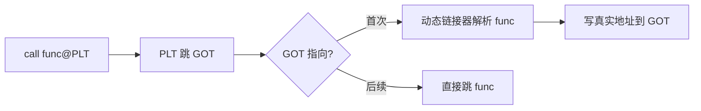

## CSAPP 面试精华速查小册子

> 💡 本册覆盖 CSAPP 第2~12章 + 附录A 全部核心知识点，压缩至最小体积，保留所有面试考点。
> 每节结构：**核心公式/定义 → 对比表 → 面试高频题 → 避坑点**。

---

### 第2章 信息的表示与处理

#### 2.1 核心公式

$$B2T_w(x) = -x_{w-1}\cdot 2^{w-1} + \sum_{i=0}^{w-2}x_i 2^i$$

| 概念 | 32-bit 值 | 说明 |
| --- | --- | --- |
| TMin | -2147483648 | $-TMin = TMin$（不对称） |
| TMax | 2147483647 | |
| UMax | 4294967295 | |

#### 2.2 转换规则

- **类型转换不改变位模式，只改变解释方式**
- `-1 < 0u` → **FALSE**（C 隐式将 signed 转 unsigned）
- 符号扩展：补码 w→w+k 位，符号位复制到高位，数值不变
- 截断：丢弃高位，$B2U_k = B2U_w \bmod 2^k$

#### 2.3 移位

| 类型 | 行为 |
| --- | --- |
| `<<` 左移 | 低位补 0 |
| `>>` 算术右移 | **补符号位**（Java 默认） |
| `>>>` 逻辑右移 | 补 0（Java 特有） |

> Java 移位位数取模：`1 << 32 == 1 << 0`

#### 2.4 整数运算

| 场景 | 结果 |
| --- | --- |
| `TMax + 1` | TMin（正溢出） |
| `TMin - 1` | TMax（负溢出） |
| `-TMin` | TMin |
| `TMin / -1` | TMin |

#### 2.5 IEEE 754 浮点

$$V = (-1)^s \times M \times 2^E$$

| 情况 | exp | M | 用途 |
| --- | --- | --- | --- |
| 规格化 | 非全0非全1 | $1 + f$ | 常规值 |
| 非规格化 | 全0 | $f$ | **渐近下溢**（均匀填充 0~最小规格化之间） |
| 特殊值 | 全1 | frac=0 → ∞; frac≠0 → NaN |

**舍入**：默认 **Round-to-even**（中间值舍入到偶数，消除统计偏差）

**精度陷阱**：
- `float` 超过 $2^{24}$ 的 int 无法精确表示
- 浮点加法不满足结合律，乘法不满足分配律
- **`NaN != NaN`**，用 `isNaN()` 判断

> 面试题：`-Integer.MIN_VALUE` = ? → 自身。`1<<35` 在 32-bit int = ? → `1<<3`。
> 面试题：为什么 `0.1 + 0.2 != 0.3`？→ IEEE 754 二进制无法精确表示 0.1。

---

### 第3章 程序的机器级表示

#### 3.1 寄存器 ABI（x86-64 System V）

| 用途 | 寄存器 | 保存者 |
| --- | --- | --- |
| 参数1~6 | `%rdi, %rsi, %rdx, %rcx, %r8, %r9` | Caller-saved |
| 返回值 | `%rax` | Caller-saved |
| 栈指针 | `%rsp` | — |
| 被调用者保存 | `%rbx, %rbp, %r12~%r15` | **Callee-saved**（使用前 push，返回前 pop） |

#### 3.2 条件码寄存器

由算术/逻辑运算设置，**单一时钟周期内自动更新**：

| 标志 | 含义 | 置位条件（以 addq 为例） |
| --- | --- | --- |
| **CF** | 进位标志（无符号溢出） | 结果超出 $2^w - 1$ |
| **ZF** | 零标志 | 结果为 0 |
| **SF** | 符号标志 | 结果为负（最高位=1） |
| **OF** | 溢出标志（有符号溢出） | 正+正=负 或 负+负=正 |

`testq` / `cmpq`：只改条件码，不写结果。`jxx` 指令基于条件码组合跳转。

#### 3.3 指令要点

| 指令 | 作用 | 关键细节 |
| --- | --- | --- |
| `leaq src, dst` | **加载有效地址** | 不做内存访问，只做地址计算。常用于 `&a[i]` 和算术运算 |
| `movq` | 数据传送 | 寄存器↔寄存器，寄存器↔内存 |
| `call` | 函数调用 | 压入返回地址到栈，%rsp-=8 |
| `ret` | 函数返回 | 栈顶弹出地址跳转，%rsp+=8 |

#### 3.4 栈帧

```
高地址
  [第7+参数]         ← 调用方
  [返回地址]          ← call 压入
  [Callee-saved 寄存器] ← %rbx, %rbp, %r12~r15
  [局部变量]          ← 数组、结构体
  [参数构造区]        ← 寄存器参数溢出
低地址 ← %rsp
```

**硬规则**：`call` 前 `%rsp` 必须是 **16 字节对齐**（SSE/AVX 要求）。

#### 3.5 条件传送（cmov）

| | 条件跳转 `jxx` | 条件传送 `cmov` |
| --- | --- | --- |
| 机制 | 分支预测 + 跳转 | 提前计算两路结果，条件码选择一路 |
| 预测失败惩罚 | ~15-30 cycles | **0** |
| 适用场景 | 分支计算开销大 / 有副作用 | 分支计算轻量 / 不可预测 |

#### 3.6 结构体对齐

1. N 字节类型 → 起始地址为 N 倍数
2. 结构体总大小 = **最大成员大小的倍数**
3. 64-bit CPU 一次读 8 字节，非对齐需 **2 次内存访问**

```c
struct S { char c; long l; };  // 1 + 7(padding) + 8 = 16 字节
```

#### 3.7 缓冲区溢出三大防护

1. **ASLR**：栈基址随机化
2. **NX bit**：栈不可执行
3. **Stack Canary**：金丝雀值（返回地址前插入随机值，返回时校验）

#### 3.8 SSE/AVX 浮点

- SSE：128-bit 寄存器 `%xmm0~%xmm15`
- AVX：256-bit 寄存器 `%ymm0~%ymm15`
- 标量指令（`addss` 操作 1 个 float）vs 打包指令（`addps` 操作 4 个 float 并行）
- 参数传递：`%xmm0~%xmm7` 传浮点参数

> 面试题：`leaq` 为什么能用于乘法？→ 地址计算本质是 `Base + Index*Scale + Offset`，`lea (%rdi,%rsi,4), %rax` 实现 `rax = rdi + rsi*4`。

---

### 第4章 处理器架构

#### 4.1 五大冒险与解决

| 冒险类型 | 定义 | 解决 |
| --- | --- | --- |
| **数据冒险(RAW)** | 下条指令读上条未写回的值 | **转发(Forwarding)**：从流水线寄存器偷结果。load-use 仍需 1 个气泡 |
| **控制冒险** | 跳转后取指方向不确定 | 分支预测（2-bit 饱和计数器+BTB，>95%） |
| **结构冒险** | 多条指令争同一硬件 | 资源复制（独立 L1-I/L1-D，多端口寄存器文件） |

#### 4.2 三种数据依赖

| 依赖 | 示例 | 真/假 | 消除方式 |
| --- | --- | --- | --- |
| **RAW** | `a = b; c = a;` | 真依赖 | ❌无法消除，只能转发 |
| **WAR** | `a = 1; b = a;` 后 `a = 2;` | 假依赖 | ✅ **寄存器重命名** |
| **WAW** | `a = 1; a = 2;` | 假依赖 | ✅ 寄存器重命名 |

> **寄存器重命名**：CPU 将架构寄存器（%rax）映射到更大的物理寄存器池（Haswell 有 168 个整数物理寄存器）。每次写分配新物理寄存器，WAR/WAW 从物理层面消失。

#### 4.3 超标量 + 乱序

- **超标量**：每周期发射多条指令。CPI < 1 即超标量在工作
- **乱序执行**：保留站(RS) + 重排序缓冲(ROB)，不违反 RAW 依赖可重排
- **投机执行**：预测分支方向提前执行。错误时回滚寄存器，但**缓存副作用不回滚**→ Spectre/Meltdown

> 面试题：为什么现代 CPU 明明顺序执行指令却看起来乱序？→ 取指译码有序，执行阶段 ROB 重排，写回/退役阶段恢复顺序。

---

### 第5章 程序性能优化

#### 5.1 关键公式与界限

$$\text{执行时间} = \text{指令数} \times \text{CPI} \times \text{时钟周期}$$

| 界限 | 定义 | 示例 |
| --- | --- | --- |
| **延迟界限** | 串行依赖链的最小 CPE | `acc *= a[i]` → CPE ≥ 5（浮点乘延迟） |
| **吞吐量界限** | 功能单元硬件能力 | 4 个 ALU → 每周期 4 次整数加法 |

**Haswell 关键参数**：

| 操作 | 延迟 | 发射 | 容量 |
| --- | --- | --- | --- |
| 整数加 | 1 | 1 | 4 |
| 整数乘 | 3 | 1 | 1 |
| 浮点乘 | 5 | 1 | 2 |
| 除法 | 3-30 | 3-30 | 1（非流水线化） |

#### 5.2 核心优化手法

| 手法 | 效果 | 核心逻辑 |
| --- | --- | --- |
| **循环不变量外提** | 消除冗余计算 | `strlen(s)` 移出循环 → `int len = strlen(s); for(...)` |
| **循环展开** | 减少控制开销，暴露 ILP | 单次处理 2~8 元素 |
| **多累加器拆分** | 突破延迟界限 | 1 条依赖链拆 4 条 → CPE 从 5.0 降到 1.25 |
| **重结合变换** | 缩短关键路径 | `(a+b)+c` → `a+(b+c)` |
| **消除内存别名** | 寄存器缓存 | 局部变量累积，最后写回 `*dest` |
| **无分支编程** | 消除预测失败 | cmov / 位运算替代 if-else |

```c
// 多累加器核心模式
double acc1, acc2, acc3, acc4;
for (int i = 0; i < n; i+=4) {
    acc1 *= a[i];   // 4 条独立依赖链并行发射
    acc2 *= a[i+1];
    acc3 *= a[i+2];
    acc4 *= a[i+3];
}
```

#### 5.3 编译器优化限制

- **内存别名**：编译器不确定两个指针是否指向同一内存，不敢消除重复读
- **函数副作用**：编译器不敢消除可能有副作用的重复调用
- **as-if-serial 规则**：优化不可改变单线程可见行为

#### 5.4 分支预测性能

公式：`总分支开销 = 分支数 × (1 + 错误率 × 惩罚周期)`

| 场景 | 预测正确率 | 有效惩罚 |
| --- | --- | --- |
| 排序后数组遍历 | >99% | ~1.01x |
| 随机数组条件判断 | ~50% | ~11x |

#### 5.5 SIMD 向量化

- SSE (128-bit, 4 ints), AVX (256-bit, 8 ints), AVX-512 (512-bit, 16 ints)
- JVM SuperWord 优化自动将简单循环编译为 SIMD（要求：边界固定、无分支、基础类型）
- Java Vector API (JDK 16+/22+ 正式版)：手动 SIMD，4-8x 提升

---

### 第6章 存储器层次结构

#### 6.1 存储器金字塔

| 层级 | 延迟 | 容量 | 归属 |
| --- | --- | --- | --- |
| 寄存器 | ~0.3ns | — | CPU 核心 |
| L1 I/D | ~1ns (2-4 cycles) | 32KB+32KB | 核心私有 |
| L2 | ~4ns (10-12 cycles) | 256KB~1MB | 核心私有 |
| L3 | ~40ns (30-40 cycles) | 8~32MB | 多核共享 |
| 主存 | ~200ns (100-300 cycles) | GB 级 | 全局 |

#### 6.2 地址拆分与缓存映射

地址 `[Tag | Index | Block Offset]`，块内偏移 6bit = 64 字节缓存行。

| 映射方式 | 冲突率 | 应用 |
| --- | --- | --- |
| 直接映射 | 高 | 简单场景 |
| **组相联**（E 路） | 低（E 越大越低） | L1/L2=8 路，L3=16~20 路 |
| 全相联 | 最低（成本极高） | TLB 常用 |

#### 6.3 三种不命中

| 类型 | 触发条件 | 能否规避 |
| --- | --- | --- |
| **强制性不命中**（cold） | 第一次访问该块 | 无法 |
| **容量不命中** | 工作集 > 缓存容量 | 缩小工作集 |
| **冲突不命中** | 多地址映射到同一组 | 改变步长/填充 |

#### 6.4 写策略

| 策略 | 行为 | 现代 CPU |
| --- | --- | --- |
| **写回 + 写分配** | 只写缓存设脏位，替换时写回主存 | ✅ **默认** |
| 写直达 | 同时写缓存和主存 | ❌ 性能差 |

> **脏位 (Dirty Bit)**：标记缓存行是否被修改。只有脏行被替换时才写回。

#### 6.5 MESI 一致性协议

| 状态 | 含义 | 总线事件 |
| --- | --- | --- |
| **M** Modified | 本核独有，已修改，与主存不一致 | 写命中 |
| **E** Exclusive | 本核独有，与主存一致 | 读本核未共享数据 |
| **S** Shared | 多核共享，与主存一致 | 读共享数据 |
| **I** Invalid | 失效，需重新加载 | 其它核修改了该行 |

> **伪共享 (False Sharing)**：不同核修改同一缓存行不同变量 → MESI 反复失效 → 性能暴跌 10-100 倍。解法：`@Contended` 或字段填充。

#### 6.6 VIPT（虚拟索引物理标记）

**TLB 和 L1 缓存并行查找**：VA 的 bits[11:6] 在 TLB 翻译完成前就作为 cache set index 使用，因为 VPO = PPO，无需等翻译。这是现代 CPU 实现 L1 延迟仅 2-4 周期的关键硬件设计。

#### 6.7 局部性原理

| 类型 | 定义 | 步长影响 |
| --- | --- | --- |
| **时间局部性** | 刚访问的数据可能再次访问 | — |
| **空间局部性** | 相邻地址可能被访问 | **步长=1 最优**，大步长浪费缓存行 |

> 面试题：为什么行优先遍历比列优先快 3-5x？→ 行优先连续内存访问完全利用 64 字节缓存行。

---

### 第7章 链接

#### 7.1 三种 ELF 文件

| 类型 | 后缀 | 特征 |
| --- | --- | --- |
| 可重定位 | `.o` | 地址未确定，含重定位表 |
| 可执行 | 无后缀 | 已分配虚拟地址，可加载运行 |
| 共享库 | `.so` | 代码段在物理内存中**所有进程共享一份** |

#### 7.2 强弱符号

| | 强符号 | 弱符号 |
| --- | --- | --- |
| **定义** | 函数、已初始化全局变量 | 未初始化全局变量 |
| **规则1** | 同名强符号 → 编译错误 | — |
| **规则2** | 1强 + N弱 → 选强 | — |
| **规则3** | — | N弱同名 → 选占用空间最大的 |

#### 7.3 静态链接顺序（黄金规则）

**引用符号的文件必须放在定义符号的库前面。**

链接器单遍扫描，维护三个集合：
- **E**：待合并文件
- **U**：未解析符号
- **D**：已定义符号

输入文件 `a.o` → 未定义符号入 U；输入库 `lib.a` → 只有 U 中的符号被解析。

#### 7.4 重定位类型（x86-64）

| 类型 | 公式 | 用途 |
| --- | --- | --- |
| `R_X86_64_PC32` | `*refptr = ADDR(sym) + addend - (ADDR(section) + offset)` | `call`/`jmp` |
| `R_X86_64_32` | `*refptr = ADDR(sym) + addend` | 全局变量 `mov` |

> PC32 的 `addend = -4` — 补偿 CPU 执行时 PC 指向下一条指令的 4 字节偏移。

#### 7.5 GOT / PLT 延迟绑定



- **GOT**（`.data` 段，可写）：存最终地址。代码段通过 PC 相对偏移访问
- **PLT**（`.text` 段，只读）：跳转逻辑。首次触发解析，后续零开销
- **PIC（位置无关代码）**：共享库必须 `-fPIC` 编译，保证代码段可加载到任意虚拟地址而无需修改

#### 7.6 运行时加载

```c
void *dlopen("lib.so", RTLD_NOW);       // 加载共享库
void *dlsym(handle, "function_name");    // 解析符号地址
int   dlclose(handle);                    // 卸载
```

#### 7.7 库打桩

| 方式 | 时机 | 原理 |
| --- | --- | --- |
| 编译时 | 编译期 | C 预处理器宏替换 |
| 链接时 | 链接期 | `--wrap` 强符号覆盖 |
| **运行时** | 运行期 | `LD_PRELOAD` 预加载覆盖（最灵活） |

> 面试题：动态链接比静态链接慢在哪里？→ 首次调用 PLT 解析延迟；代码段不能做过程间优化（IPO）。

---

### 第8章 异常控制流

#### 8.1 异常四分类

| 类别 | 触发 | 同步/异步 | 返回行为 | 示例 |
| --- | --- | --- | --- | --- |
| **中断** | 外部设备信号 | 异步 | 下一条指令 | 磁盘/键盘/网卡 |
| **陷阱** | 主动 `syscall` | 同步 | 下一条指令 | `read`, `fork` |
| **故障** | 指令执行错误 | 同步 | 重试当前指令 | **缺页异常**，除零 |
| **终止** | 硬件/指令致命错误 | 同步 | 不返回 | `SIGSEGV` |

#### 8.2 进程四大调用

| 调用 | 行为 | 关键细节 |
| --- | --- | --- |
| `fork()` | 创建子进程 | 子进程返回 0，父进程返回子进程 PID。**COW** 共享物理页。**执行顺序不确定** |
| `execve()` | 替换当前进程映像 | PID 不变。成功**不返回**。重置信号处理函数 |
| `exit()` | 终止进程 | 刷新 stdio 缓冲区，关闭 fd，发 SIGCHLD。**不返回** |
| `waitpid()` | 等待子进程 | `WNOHANG` 非阻塞，`WUNTRACED` 捕获暂停。释放僵尸进程 |

**标准 fork+exec 模式**：
```c
if (fork() == 0) {
    execve("./prog", argv, envp);
    exit(1);  // 仅 execve 失败时执行
}
wait(NULL);
```

#### 8.3 僵尸 vs 孤儿

| | 定义 | 危害 |
| --- | --- | --- |
| **僵尸进程** | 子进程终止，父进程未 `wait` | **泄漏 PID**（进程表条目不被回收） |
| **孤儿进程** | 父进程先终止 | init(PID=1) 收养，自动回收 |

#### 8.4 信号核心

- **生命周期**：产生 → 待处理（Pending）→ 递送 → 处理
- **信号合并**：同类型多个信号在 Pending 位中**只记录 1 次**，多次同信号到达被合并
- **阻塞信号集（mask）**：用 `sigprocmask` 阻塞指定信号。阻塞期间到达的信号保持 Pending，解除阻塞后递送一次

**始终用 `sigaction()`** 而非 `signal()`（后者跨平台行为不一致）。

#### 8.5 异步信号安全函数

| 安全 | 不安全 |
| --- | --- |
| `_exit()`、`read()`、`write()`、`wait()` | `malloc()`、`printf()`、`exit()`、`fprintf()` |

> 信号处理函数只能调安全函数。**`malloc` 可能导致死锁**（可能持有内部锁）。

#### 8.6 两大竞争条件（面试高频）

**① fork + SIGCHLD race**：
```
子进程在父进程 add_job() 之前退出 → SIGCHLD 先执行 delete_job()
→ add_job() 添加的条目永远留在任务列表中 → 僵尸 + 泄漏
```
**解法**：`fork()` 前 `sigprocmask(SIG_BLOCK, SIGCHLD)`，`add_job()` 后再 unblock。

**② pause() race**：
```
if (flag == 0)     // 检查条件
    pause();        // 挂起等待信号
// 信号在检查→挂起之间到达 → flag 已变但 pause 永不返回
```
**解法**：用 **`sigsuspend()`** 代替 `pause()`，原子性 "unblock 信号 + 挂起 + 再 block"。

> 共享标志位必须是 `volatile sig_atomic_t` — 防止编译器缓存寄存器副本。

#### 8.7 setjmp/longjmp

```c
jmp_buf env;
if (setjmp(env) == 0)    // 初次调用返回 0
    longjmp(env, 1);      // 跳回 setjmp 处，此时返回 1
```
**类比 Java**：`try { ... } catch { ... }` — `throw` 类似 `longjmp`。

**限制**：不恢复信号掩码。需要 `sigsetjmp`/`siglongjmp`。

> 面试题：为什么禁止 `printf` 在信号处理函数中？→ `printf` 内部调 `malloc`，`malloc` 持有内部锁，如果主线程正持锁时信号打断，死锁。

---

### 第9章 虚拟内存

#### 9.1 地址翻译

**虚拟地址 = VPN + VPO** → MMU + TLB → **物理地址 = PPN + PPO**

> VPO = PPO（页内偏移不变），只需翻译页号。

#### 9.2 四级页表（x86-64 4KB 页）

```
| 63..48 符号扩展 | L4(9bit) | L3(9bit) | L2(9bit) | L1(9bit) | offset(12bit) |
```

- 每级 512 条目（$2^9$）×4 级 + 12bit 偏移 = 48 位虚拟地址
- 每个 PTE 含：有效位、PPN、R/W/X 权限、U/S 位、脏位、访问位
- **CR3 寄存器**：保存 L4 页表物理基址。进程切换时写 CR3 → **TLB 刷清**

**TLB 命中 (~1 cycle)** → 直接得 PPN
**TLB 未命中 (~200 cycles)** → 四级页表遍历
**缺页异常 (~10ms)** → 磁盘加载 → 返回重试指令

#### 9.3 缺页异常流程

1. CPU 触发 `#PF`（异常 14）
2. 检查 VA 合法性：
   - 无效/prot 违例 → **SIGSEGV**
   - 有效页面磁盘上 → 分配物理页，磁盘加载，更新 PTE
3. 返回重试触发指令

#### 9.4 mmap

```c
void *mmap(void *addr, size_t len, int prot, int flags, int fd, off_t offset);
```

| flags | 行为 | 应用 |
| --- | --- | --- |
| `MAP_PRIVATE` | **写时复制(COW)**，修改不回写文件 | 动态库加载 |
| `MAP_SHARED` | 修改写回文件，其他进程可见 | 共享内存 IPC |
| `MAP_ANONYMOUS` | 无文件映射，零填充 | 大块 malloc (>128KB) |

#### 9.5 Linux 虚拟内存布局

```
低地址
  .text  (r-x)  ← ELF 映射
  .rodata(r--)
  .data  (rw-)
  .bss   (rw-)  ← 不占磁盘空间，运行时零初始化
  堆     (rw-)  ← brk 向上增长 (小块 malloc)
  ↓
  .so 共享库    ← mmap 映射（代码段所有进程共享物理内存）
  ↑
  栈     (rw-)  ← 向下增长
  内核空间      ← 用户态不可访问
高地址
```

#### 9.6 动态内存分配

| 策略 | 分配 | 释放 | 应用 |
| --- | --- | --- | --- |
| 隐式空闲链表 | O(n) | O(1) | 边界标签合并 | 
| 显式空闲链表 | O(m) | O(1) | 双向链表 |
| **分离适配** | ~O(1) | ~O(1) | **glibc ptmalloc2 工业标准** |
| Buddy 系统 | O(log M) | O(log M) | Linux 内核物理页管理 |

**碎片类型**：
- **内部碎片**：已分配块内未使用字节（对齐填充、头部/尾部开销）
- **外部碎片**：总空闲空间够，但无单一连续块满足请求

**边界标签（Boundary Tag）**：每个块头尾都存 size+allocated bit → `free()` 时 O(1) 合并相邻空闲块。

#### 9.7 大页（Huge Pages）

- 标准页 4KB → 64 个 TLB 条目仅覆盖 256KB
- 大页 2MB/1GB → 大幅降低 TLB miss
- JVM：`-XX:+UseLargePages`，Elasticsearch/Cassandra 显著受益

#### 9.8 COW（Copy-on-Write）

`fork()` 后父子共享物理页（PTE 标记只读）。写时触发缺页 → 内核拷贝物理页 → 更新父子 PTE → 标记可写。

> 面试题：`fork()` 后 `execve()` 会触发大量 COW 吗？→ 不会。`execve` 直接替换进程映像，`fork` 后即刻 `exec` 的 "fork+exec" 模式中 COW 几乎不触发（COW 只发生在真正的写操作）。

---

### 第10章 系统级 IO

#### 10.1 三层内核数据结构

```
描述符表（每进程） → 文件表（系统级） → v-node 表（系统级）
  fd: 0~255           refcnt            inode 元数据
  ↓                    offset            ......
  指向文件表条目       ......
```

**引用计数规则**：

| 操作 | refcnt 变化 |
| --- | --- |
| `open()` | =1 |
| `dup2()` / `fork()` | ++ |
| `close()` | --，归零时销毁该文件表条目 |

**文件共享模式**：
- 两次 `open()` 同一文件 → 两个独立文件表条目，独立 offset
- `fork()` → 子进程复制描述符表，父子**共享 offset**
- `dup2(oldfd, newfd)` → newfd 指向 oldfd 的文件表条目，refcnt++（shell `>` 重定向即此原理）

#### 10.2 不足计数（Short Count）

`read()`/`write()` 可能返回小于请求的字节数。磁盘文件仅在 EOF 触发；**socket 每次都可能触发**。

**RIO（Robust I/O）**：
- `rio_readn()`/`rio_writen()`：无缓冲，循环直到 N 字节完成
- `rio_readlineb()`/`rio_readnb()`：**用户态有缓冲**，减少 syscall 次数

#### 10.3 标准 IO 与 Unix IO

| | Unix IO (`read`/`write`) | 标准 IO (`fread`/`fwrite`) |
| --- | --- | --- |
| 缓冲 | 内核态 | **用户态 + 内核态** |
| 缓冲区管理 | 调用方 | 系统自动 |
| 适合场景 | socket/信号安全 | 文件读写 |

**标准 IO 缓冲区模式**：全缓冲（磁盘文件）、行缓冲（终端）、不缓冲（stderr）。

**socket 上不要混用标准 IO**：socket 不支持 `lseek`，`fread`→`fwrite` 切换需要 `fseek`/`fflush`，不可用。解法：用 `fdopen` 打开两个独立的 `FILE*` 流（一个读一个写）。

#### 10.4 元数据与目录

```c
stat(pathname, &buf);     // struct stat: st_mode, st_size, st_ino
S_ISREG(mode);             // 普通文件？
S_ISDIR(mode);             // 目录？
opendir() / readdir() / closedir();  // 遍历目录
```

---

### 第11章 网络编程

#### 11.1 socket API 骨架

```
服务器: socket() → bind() → listen() → accept() → read/write → close()
客户端: socket() → connect() → read/write() → close()
```

- `listen()`：将主动 socket 转为被动监听，**只调用一次**
- `accept()`：返回**新的已连接 fd**，与监听 fd 完全独立
- TCP 三次握手由**内核完成**，在 `accept()` **返回前已结束**

#### 11.2 getaddrinfo

```c
getaddrinfo(host, service, &hints, &result);   // 协议无关，可重入
freeaddrinfo(result);                           // 必须释放
```

CSAPP 封装：`open_clientfd(host, port)` → getaddrinfo + socket + connect 一行完成；`open_listenfd(port)` → getaddrinfo + socket + bind + listen。

#### 11.3 CGI 流程

```c
fork();                      // ① 创建子进程
    setenv("QUERY_STRING");  // ② 设环境变量
    dup2(clientfd, STDOUT);  // ③ 重定向 stdout → socket
    execve("/cgi-bin/prog"); // ④ 执行 CGI 程序，printf 直发客户端
```

#### 11.4 三种并发服务器模型对比

| 模型 | 方案 | 优先级 | 缺点 |
| --- | --- | --- | --- |
| **进程** | `accept → fork` | 高隔离性 | 高开销（`fork`），IPC 复杂，有限~数百 |
| **IO 多路复用** | `epoll` 单线程 | 最高并发~10k+ | 不能利用多核，回调式编程复杂 |
| **线程池** | 预创建线程+队列 | 平衡开销/并发 | 同步复杂性（锁竞争） |

#### 11.5 HTTP 基础

```
请求: GET /path HTTP/1.1\r\nHeaders\r\n\r\n
响应: HTTP/1.1 200 OK\r\nHeaders\r\n\r\nBody
```

状态码：200(OK)、301(永久重定向)、404(未找到)、500(内部错误)。

> 面试题：`select` vs `epoll` 区别？→ select: O(n) 遍历 fd_set，FD_SETSIZE 上限 1024。epoll: O(1) 回调就绪 fd，无上限，支持 ET/LT。

---

### 第12章 并发编程

#### 12.1 并发 vs 并行

| | 并发 | 并行 |
| --- | --- | --- |
| 定义 | 逻辑上同时运行（时间片切换） | 物理上同时运行（多核） |
| 依赖 | 线程/协程 | 多核硬件 |

#### 12.2 五种 IO 模型

| 模型 | 第一阶段（等待数据） | 第二阶段（拷贝数据） |
| --- | --- | --- |
| 阻塞 IO | 阻塞 | 阻塞 |
| 非阻塞 IO | **轮询** | 阻塞 |
| **IO 复用**（select/poll/epoll） | 阻塞（复用调用中） | 阻塞 |
| 信号驱动 IO | 通知（不阻塞） | 阻塞 |
| **异步 IO**（aio/io_uring） | **不阻塞** | **不阻塞（内核完成）** |

#### 12.3 线程 API

| 函数 | 说明 |
| --- | --- |
| `pthread_create` | 创建线程。传函数指针 + 参数 |
| `pthread_join` | 等待线程终止（类似 `waitpid`） |
| `pthread_detach` | 分离线程，终止时自动回收 |
| `pthread_exit` | 终止调用线程 |

**Joinable**（默认）：必须 join 回收资源。Detached：不可 join，终止自动回收。

#### 12.4 线程安全 4 等级（CSAPP 分类法）

| 等级 | 定义 | 示例 |
| --- | --- | --- |
| **不可重入** | 无保护共享状态 | `strtok()`（静态缓冲区） |
| **线程安全** | 内部有锁保护 | `pthread_mutex_lock/unlock` 包装 |
| **可重入** | **不访问任何共享状态** | 纯局部变量、参数传值 |
| **异步信号安全** | 可从信号处理函数调用 | `write()`、`_exit()` |

关系：`可重入 → 线程安全 → 不可重入`，但反过来不成立。

#### 12.5 信号量

```c
sem_init(&s, 0, value);      // 初始化
sem_wait(&s);                // P: value--，若<0 则阻塞
sem_post(&s);                // V: value++，若有等待者唤醒一个
```

| 用法 | 初始值 | 用途 |
| --- | --- | --- |
| **互斥锁**（二进制信号量） | 1 | 保护临界区 |
| **计数信号量** | N | 控制 N 个资源并发访问 |

**生产者-消费者**（有界缓冲区）：
```
生产者: P(empty) → P(mutex) → put → V(mutex) → V(full)
消费者: P(full)  → P(mutex) → get → V(mutex) → V(empty)
```

> 关键：P(empty/full) 必须在 P(mutex) 之前 — 避免死锁。

#### 12.6 三大并发问题

| 问题 | 定义 | 解法 |
| --- | --- | --- |
| **竞态条件** | 多线程并发访问共享数据，结果=调度时序 | 互斥锁 |
| **死锁** | 互相等待对方释放锁 | 固定加锁顺序，`trylock` |
| **活锁** | 线程反复重试但不推进 | 指数退避 |

#### 12.7 死锁四条件（Coffman）

1. **互斥**：资源一次只能分配给一个线程
2. **持有并等待**：持有一个资源的同时等待另一个
3. **不可抢占**：不能强制从线程取走资源
4. **循环等待**：线程和资源之间形成环路

**解法**：**全局加锁顺序** — 所有线程以相同顺序获取锁，打破循环等待。

#### 12.8 Amdahl 定律

$$S_p \le \frac{1}{\alpha + (1-\alpha)/p}$$

$\alpha$ = 串行比例，$p$ = 核心数。$\alpha=0.1$ 时，即使无限核心，最大加速仅 10x。

---

### 附录：面试核心题速查

| 问题 | 一句话答案 |
| --- | --- |
| 为什么排序数据比未排序快？ | 分支预测：排序后 >99% 正确，随机 ~50% 错误→~15 cycles 惩罚 |
| `-Integer.MIN_VALUE` 等于？ | 自身（补码不对称） |
| `NaN` 判断？ | `NaN != NaN`（IEEE 754 规定） |
| `1<<35` 在 32-bit int？ | `1<<3`（取模 32） |
| 为什么 `0.1+0.2 != 0.3`？ | IEEE 754 二进制无法精确表示 0.1 |
| 结构体对齐原因？ | 64-bit CPU 一次读 8 字节对齐块，非对齐需 2 次访问 |
| 为什么要有 TLB？ | 页表在 DRAM，无 TLB 每地址翻译需 4 次内存访问（四级页表） |
| malloc 如何工作？ | 小块 (<128KB) → `brk` 扩展堆；大块 → `mmap` 匿名映射 |
| fork 后子进程复制了什么？ | COW：页表 + 描述符表 → 共享物理页，写时才复制 |
| 死锁四条件？ | 互斥 + 持有并等待 + 不可抢占 + 循环等待 |
| 信号量 vs 条件变量？ | **sem 可累积**（post 不丢失），cond 无计数器（signal 无 waiter 丢失） |
| epoll 为什么比 select 快？ | select O(n) 遍历，epoll O(1) 回调就绪 fd。select 有 1024 上限 |
| 伪共享触发的条件？ | 多核 + 频繁写 + 同一缓存行不同变量 → MESI 反复失效 |
| volatile 的作用？ | 禁止编译器寄存器缓存，强制每次读主存（不保证原子性） |
| 为什么线程池比每请求一线程好？ | 避免线程创建/销毁开销；控制并发数防止资源耗尽 |
| 四级页表遍历几次内存访问？ | TLB miss → 4 次（L4→L3→L2→L1），TLB hit → 0 次额外访问 |

---

### 关联笔记

- [[12 高性能IO框架库 Libevent|Libevent 源码分析（Ch4 事件驱动实践）]]
- [[6-2-1 POSIX同步原语深度剖析|POSIX 同步原语（Ch12 同步机制内核级展开）]]
- [[6-1 高性能服务器框架概述|Reactor/Proactor（Ch11+12 并发服务器架构）]]
- [[第7章 链接|ELF + 链接细节]]
- [[第9章 虚拟内存|虚拟内存全链路 + ELF 到进程运行的完整流程]]
