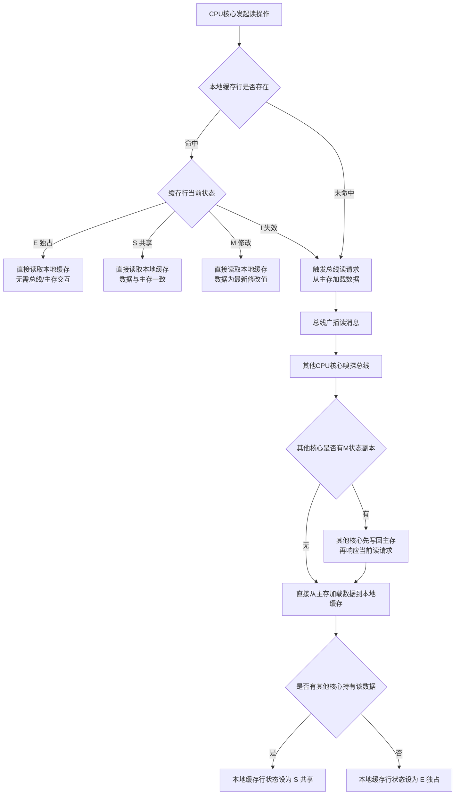

# 第6章 存储器层次结构
## 🧩 顶层核心【对应全书第6章 存储器层次结构 总纲】
### 全章核心本质
- 整个计算机存储器体系，核心规则是「上一层永远是下一层的缓存」，所有层级遵循完全一致的设计逻辑
### 核心主线
- 利用**局部性原理**，通过金字塔式的存储器层次结构，用最低的成本，获得接近最高速存储的访问性能
### 核心价值
- Java程序员通过CPU缓存底层原理，彻底理解代码性能差异的根源、JVM优化逻辑、上层分布式缓存的设计本质，建立从硬件到业务的全链路性能认知
### 统一世界观（全章内容的底层锚点）
- 完整存储器金字塔（从上到下，速度递减、容量递增、成本递减）：
  1. 寄存器（CPU内核，~1ns）
  2. L1缓存（核心私有，~1ns）
  3. L2缓存（核心私有，~4ns）
  4. L3缓存（多核共享，~40ns）
  5. 主存（内存，~200ns）
  6. 本地磁盘（SSD/HDD，微秒级）
  7. 网络存储（分布式缓存/对象存储，毫秒级）
### 后续章节关联
- 与[[第3章 程序的机器级表示|第3章]]（汇编中内存访问指令）、[[第5章：优化程序性能|第5章]]（性能优化与内存界限）、[[第12章 并发|第12章]]（并发与缓存一致性）深度联动
## 🧱 基础层：CPU缓存核心硬件基础【对应 6.1 + 6.4】※※※
### 1. 缓存层级与速度差异（现代x86-64）
| 层级 | 归属                  | 访问延迟             | 典型容量  |
| - | --------------------- | -------------------- | --------- |
| L1   | 核心私有（指令+数据） | ~1ns (1-2周期)       | 32KB+32KB |
| L2   | 核心私有              | ~4ns (4-5周期)       | 256KB-1MB |
| L3   | 多核共享              | ~40ns (10-40周期)    | 8MB-32MB  |
| 主存 | 全局共享              | ~200ns (100-300周期) | GB级      |
### 2. 缓存行（Cache Line）—— 最小操作单元
- 固定大小：现代CPU默认**64字节**
- 核心规则：哪怕只读1字节，CPU也会将整个64字节缓存行加载到缓存
- 缓存行对齐：CPU只能高效访问对齐的内存地址，未对齐会触发两次缓存行加载，性能减半
- **Java关联**：JVM对象默认8字节对齐，可保证对象起始地址落在缓存行边界；`@Contended`通过填充实现缓存行对齐
### 3. 内存地址拆分三要素（缓存寻址的底层根基）
内存地址被CPU硬件拆分为三段：
- **块内偏移（Block Offset）**：6位（2⁶=64字节），定位缓存行内的具体字节
- **组索引（Set Index）**：位数由缓存组数决定，定位映射到哪个缓存组
- **标记位（Tag）**：剩余高位，用于组内匹配确认缓存行是否为目标
### 4. 缓存映射规则
| 类型       | 映射关系            | 优点               | 缺点         | 使用场景                              |
| ---------- | ------------------- | ------------------ | ------------ | ------------------------------------- |
| 直接映射   | 1地址→1组           | 硬件简单，速度快   | 冲突率高     | 早期CPU                               |
| 组相联映射 | 1地址→1组，组内多行 | 冲突率低，成本适中 | 硬件稍复杂   | **现代CPU主流**（L1/L2 8路，L3 16路） |
| 全相联映射 | 1地址→任意行        | 冲突率最低         | 硬件成本极高 | TLB等特殊场景                         |
### 5. 缓存读流程（标准四步）
1. 拆分地址 → 组索引定位缓存组
2. 用Tag匹配组内所有缓存行
3. **命中**：通过块内偏移直接读取数据
4. **不命中**：从主存加载完整缓存行到缓存（可能触发替换），再读取数据
---

## 📐 局部性原理（原书 §6.2-6.3）※※※
### 1. 时间局部性（Temporal Locality）
- **定义**：如果一个内存位置被引用了一次，那么在不久的将来它很可能会被**多次引用**
- 示例：循环中的指令、循环中的求和变量 `sum`
- 硬件利用：缓存将最近访问的数据保留在高速存储中

### 2. 空间局部性（Spatial Locality）
- **定义**：如果一个内存位置被引用了一次，那么不久的将来**邻近的内存位置**很可能也被引用
- 示例：顺序数组遍历、顺序指令执行
- 硬件利用：每次加载完整缓存行（64B），预取相邻地址
- **步长（stride）** 是空间局部性的量化指标：
  - 步长=1（顺序访问）：最优，完全利用缓存行
  - 步长>1：缓存行利用率=64/stride，大步长浪费带宽
  - 步长为N：随机访问 → 缓存基本无效

### 3. 内存山（Memory Mountain）——原书封面图（原书 §6.6.1）※※※
- **定义**：原书最标志性的可视化实验，测量 Intel Core i7 在不同**空间局部性（步长）**和**时间局部性（工作集大小）**组合下的内存读吞吐量
- 实验方法：遍历一个数组，改变两个参数：
  1. **工作集大小（Size）**：从 16KB（全在 L1）→ 64MB（部分在主存），测试各缓存层级边界
  2. **访问步长（Stride）**：从 1（顺序访问）→ 64B+（跨缓存行），测试空间局部性
- **核心发现**（原书 Figure 6.43）：
  - 工作集 < 32KB → L1 命中，吞吐量 ~14,000 MB/s（山脊顶部）
  - 工作集 32KB~256KB → L2 命中，吞吐量 ~10,000 MB/s
  - 工作集 256KB~8MB → L3 命中，吞吐量 ~6,000 MB/s
  - 工作集 > 8MB → 主存命中，吞吐量 ~2,000 MB/s（山脚）
  - **坡度（Slope）**：步长从 1 增加到 32+ → 吞吐量陡降（空间局部性丧失），尤其在小工作集时更明显
- **程序员的启示**：
  1. 尽量让热点数据的工作集 < L3 缓存大小（通常 < 8MB）
  2. 尽量以步长=1 的方式遍历数据（行优先 > 列优先）
  3. 将相关数据打包到连续内存中（结构体 > 分散对象）
- **Java关联**：`ArrayList` 遍历 (步长=1，连续) vs `LinkedList` 遍历 (步长=随机)，前者缓存友好，后者每个节点可能跨缓存行

## ⚙️ 核心层：缓存核心机制【对应 6.4】※※※

### 1. 缓存不命中的三大类型
| 类型         | 别名     | 触发条件                               | 优化方向                   |
| ------------ | -------- | -------------------------------------- | -------------------------- |
| 强制性不命中 | 冷不命中 | 第一次访问该地址                       | 预取（硬件/软件）          |
| 容量不命中   | -        | 工作集 > 缓存容量                      | 缩小工作集，分块处理       |
| 冲突不命中   | -        | 多地址映射到同一组，缓存空闲但仍不命中 | 优化数据结构布局，降低冲突 |

### 2. 缓存替换策略
- 核心目标：淘汰未来最不可能被访问的缓存行
- 主流实现：**LRU（最近最少使用）**，淘汰最久未访问的行
- 硬件落地：现代CPU用近似LRU（时钟算法），降低硬件成本
- **Java关联**：JVM的GC分代回收（年轻代→老年代）本质上也是一种“热点数据保留”的LRU变体

### 3. 硬件预取机制
- 核心逻辑：CPU根据访问模式（如步长固定），自动预取未来可能访问的缓存行
- 最佳模式：步长=1的连续内存访问（预取效率最高）
- 反例：步长>1的随机访问 → 预取失效，甚至导致缓存污染

### 4. 缓存写入策略（核心机制，必懂）

#### 4.1 核心写入方式
- **直写（Write-Through）**：
  - 逻辑：数据同时写入缓存和主存
  - 优点：数据一致性强
  - 缺点：每次写入都访问主存，总线流量大，性能极低
- **回写（Write-Back，现代CPU默认）**：
  - 核心机制：缓存行内置**脏位（Dirty Bit）**，标记是否被修改
  - 逻辑：数据只写入缓存，标记脏位；仅当脏行被替换时，才写回主存
  - 优点：极少访问主存，性能极高
  - 缺点：需处理多核一致性

#### 4.2 写不命中的处理方式
- **写分配（Write-Allocate，现代CPU默认）**：写不命中时，先加载缓存行到缓存，再写入（利用局部性）
- **非写分配（No-Write-Allocate）**：直接写主存，不加载缓存（避免污染）

#### 4.3 现代CPU默认组合
- **回写 + 写分配**，兼顾性能与局部性

### 5. 多核缓存一致性：MESI协议（Java并发的硬件根基）※※※
- **核心本质**：解决多核私有缓存（L1/L2）的数据一致性问题，是Java内存模型（JMM）、`volatile`、`synchronized`的硬件底层根源
- **总线嗅探**：所有核心监听总线，一旦发现其他核心修改了自己缓存中存在的地址，立即将本地缓存行标记为无效（I状态）

#### 缓存行四大状态
| 状态           | 含义                                 | 特点                               |
| -------------- | ------------------------------------ | ---------------------------------- |
| M（Modified）  | 当前核心独有，已被修改，与主存不一致 | 写回主存前，其他核心读取必须等待   |
| E（Exclusive） | 当前核心独有，与主存一致             | 可无缝升级为M                      |
| S（Shared）    | 多个核心共享，与主存一致             | 其他核心可读，修改前需通知所有S变I |
| I（Invalid）   | 已失效                               | 访问触发重新加载                   |

- **Java关联**：
  - **伪共享（False Sharing）**的硬件根源：不同核心修改同一缓存行内的不同变量 → MESI协议反复将行置为I → 频繁重载，性能暴跌
  - `volatile`写操作会触发MESI的“广播”效果，强制其他核心的缓存行变为I
  - 核心原因
- **流程图**

1. **读操作：**



------


2.  **写操作：**

    ```mermaid
    graph TD
        A[CPU核心发起写操作]
        A --> B{本地缓存行状态}
        
        %% 不同状态的写处理
        B -->|M 修改| C[直接修改本地缓存<br/>保持M状态]
        B -->|E 独占| D[修改本地数据<br/>状态由 E → M]
        B -->|S 共享| E[发送总线广播消息<br/>通知所有核心]
        B -->|I 失效| F[先加载数据到本地缓存<br/>重新执行写流程]
        
        %% 总线嗅探与失效
        E --> G[其他核心嗅探总线消息]
        G --> H[其他核心将该缓存行置为 I 失效]
        H --> I[本地缓存行状态由 S → M<br/>完成写入操作]
        
        %% Java 硬件关联
        J[volatile 写操作]
        J --> K[强制触发总线广播]
        K --> G
        I --> L[保证其他核心读取可见性]
        
        M[伪共享场景]
        M --> N[不同核心写同缓存行不同变量]
        N --> E
        H --> O[缓存行反复失效→主存读取→性能暴跌]
    ```

    ------

    ##### 伪共享核心原因：缓存行只能一行一行读取，被耦合了

    ###### 一、硬件铁律：CPU 最小读写单元 = 缓存行（64字节）

    **CPU 根本做不到「只读写一个变量」**

    - 无论你读 1 个 byte、int、long，CPU 都会**一次性加载一整个缓存行（64B）**到 L1/L2 缓存
    - 同理，修改时也只能**整行写回**，无法单独修改其中一个变量
    
    这是硬件物理限制，和 Java 无关，是**所有高级语言的共用底层规则**。
    
    ---
    
    ###### 二、伪共享的本质：同一缓存行 → 全体变量「捆绑连坐」
    你说的**同缓存行、不同变量**，就是典型场景：
    ```
    缓存行（64字节）
    ┌───────────────────────────────────────────────┐
    │ 变量A（volatile） │ 变量B（volatile） │ 其他空位 │
    └───────────────────────────────────────────────┘
    ```
    - 核心1 改 **变量A**
    - 核心2 改 **变量B**
    - 两个变量**毫无业务竞争**，但因为在**同一个缓存行**，被硬件强制绑定
    
    ---
    
    ###### 三、为什么性能暴跌？（MESI 连锁反应）
    完全对应你刚才的流程图：
    1. 核心1 修改变量A → 缓存行变成 **M（修改）**
    2. 总线广播 → 核心2 的该缓存行被强制置为 **I（失效）**
    3. 核心2 想修改变量B → 发现缓存行失效 → **必须重新从主存加载整行**
    4. 核心2 修改完 → 又广播 → 核心1 的缓存行再次失效
    5. **循环往复 → 缓存完全失效 → 全部走主存 → 性能跌 10~100 倍**
    
    
    
    ---
    
    ###### 五、对应到 Java 代码的直观印证
    ```java
    // 两个变量毫无关系，但紧挨存放 → 进入同一缓存行
    public class FalseShareDemo {
        public volatile long a; // 核心1改
        public volatile long b; // 核心2改
    }
    ```
    **结果：并发读写性能极差**
    解决方案：**把它们隔开，占满整个缓存行**（或用 @Contended），让每个变量独占一行。当前文件内容过长，豆包只阅读了前 62%。

---

## 🔮 机制层：局部性原理（所有性能优化的根源）【对应 6.2】※※※

### 核心本质
- 程序性能的90%以上由内存访问的局部性决定；缓存能生效的唯一前提，就是程序具有良好的局部性

### 1. 时间局部性
- 定义：刚访问过的数据，短期内大概率会再次访问
- 优化核心：让重复访问的数据尽量留在缓存中，避免被淘汰
- 典型场景：循环变量、累加器、高频访问的对象字段

### 2. 空间局部性
- 定义：刚访问过的地址附近的数据，短期内大概率也会被访问
- 优化核心：按内存地址连续顺序访问数据（步长=1），完美匹配缓存行预取
- 典型场景：数组顺序遍历、顺序读取文件
- **反例**：矩阵列优先遍历、随机访问链表、步长>1的跳跃访问

### 3. 局部性的核心量化指标
- **工作集**：程序在一段时间内频繁访问的缓存行集合
- **缓存抖动（Thrashing）**：工作集 > 缓存容量 → 频繁替换 → 命中率暴跌 → 性能断崖式下降

### 4. 核心结论
- 计算不耗时，**内存不命中才是程序性能的真正杀手**；所有系统级优化的底层逻辑，都是提升局部性、减少缓存不命中

---

## 🛠️ 落地层：代码性能差异的本质（经典案例）【对应 6.6】※※※

### 核心案例：矩阵乘法循环顺序优化（性能差10-100倍）

```c
// 慢版本：列优先访问，步长 = 列数
for (i=0; i<N; i++)
    for (j=0; j<N; j++)
        for (k=0; k<N; k++)
            c[i][j] += a[i][k] * b[k][j];  // b按列访问，步长=N，缓存行每次都不命中
// 快版本：行优先访问，步长=1
for (i=0; i<N; i++)
    for (k=0; k<N; k++)
        for (j=0; j<N; j++)
            c[i][j] += a[i][k] * b[k][j];  // b按行访问，步长=1，空间局部性完美
```

- **性能差异根源**：慢版本每次访问b[k][j]都跨缓存行（步长N），缓存命中率极低；快版本连续访问，CPU预取生效，命中率接近100%
- **Java关联**：Java二维数组遍历性能完全遵循此规则，`int[][]`按行优先比按列优先快几十倍

---

## 🚀 优化层：缓存友好代码实践【对应 6.5】※※

### 1. 缓存污染
- 定义：一次性、低频访问的数据把高频热点数据挤出缓存，导致热点数据频繁不命中
- 触发场景：频繁随机访问、大批量一次性数据读取、全量遍历大数组

### 2. 核心优化技术
| 技术                         | 原理                                                 | 适用场景                   |
| ---------------------------- | ---------------------------------------------------- | -------------------------- |
| 循环分块（Blocking）         | 将大数据集切分成与缓存大小匹配的小块，工作集放入缓存 | 矩阵乘法、图像处理         |
| 循环交换（Loop Interchange） | 将步长=1的访问放在最内层                             | 多维数组遍历               |
| 循环融合（Loop Fusion）      | 合并多次循环，减少重复访问                           | 相邻循环操作同一数据       |
| 非临时加载指令（NT stores）  | 跳过缓存直接写内存，避免污染                         | 大块内存拷贝（如`memcpy`） |

### 3. 最典型Java场景：伪共享与解决方案

#### 伪共享触发的三个必要条件（缺一不可）
1. **多线程并发**：至少两个线程同时读写不同变量
2. **变量频繁读写**：反复修改/读取（`volatile`会放大效果）
3. **内存相邻**：变量落在同一个64字节缓存行内

#### Java解决方案
- **最优方案**：JDK8+ `@Contended` 注解，JVM自动在变量前后填充缓存行，确保变量独占一个缓存行
  ```java
  @Contended
  volatile long value;
  ```
  - JDK9+需开启 `-XX:-RestrictContended`
- **替代方案**：手动填充7个`long`字段（每个8字节，共56字节，加上变量自身构成64字节）
  ```java
  private long p1, p2, p3, p4, p5, p6, p7; // 填充
  volatile long value;
  ```
- **避坑提醒**：**绝对不要滥用 `@Contended`**，它会让对象体积膨胀数倍，只有确认伪共享是性能瓶颈时才使用

#### 检测伪共享的工具
- Linux `perf stat -e cache-misses` 观察缓存不命中率
- Java `jol`（Java Object Layout）查看对象内存布局
- 微基准测试对比有无填充的性能差异

### 4. Java开发的其他优化实践
- 数组优先用行优先遍历，避免列优先遍历
- 热点数据尽量连续存储（如用`ArrayList`而非`LinkedList`）
- 高频访问的成员变量与低频变量分离，避免伪共享
- 大数组分批处理（分块），避免缓存抖动
- 使用`System.arraycopy`（底层有非临时加载优化）而非手动循环拷贝

---

## 🔗 延伸层：上层系统的复用思想（全链路认知闭环）※※

### 核心结论
- 所有上层缓存系统，100%复刻了CPU缓存的核心设计原则

### 典型落地场景
| 系统           | 缓存对应关系                                                 |
| -------------- | ------------------------------------------------------------ |
| JVM内存模型    | 栈内存 ↔ 寄存器/L1；堆内存 ↔ 主存；TLAB ↔ 本地缓存           |
| JVM GC分代     | 年轻代 ↔ L1/L2（高频访问），老年代 ↔ L3（低频但保留）        |
| MySQL InnoDB   | Buffer Pool ↔ L3缓存；16KB数据页 ↔ 缓存行；LRU淘汰 ↔ 缓存替换 |
| Redis          | 分布式系统的L3缓存，热点key ↔ 时间局部性                     |
| 操作系统页缓存 | 内存 ↔ 磁盘的缓存，LRU+脏页回写 ↔ Write-Back                 |

### 核心思想
- 所有性能优化的底层逻辑，都是**把热点数据放在离计算单元更近、速度更快的存储里**，本质就是CPU缓存设计思想的上层复用

---

## ❌ 避坑层【全章易错点速查】※※※

1. **数据对齐的核心原因是CPU内存访问的硬件规则**，缓存不命中是二次影响，不要混淆
2. **伪共享的根源是MESI协议**，不是缓存行本身（缓存行只是导致相邻的物理原因）
3. **回写性能高的核心是脏位机制**，不仅仅是“少写主存”这么简单
4. **缓存不命中的开销是命中的几百倍**（300+周期 vs 1-40周期），优化核心是减少不命中，而非优化计算
5. **局部性是缓存能生效的唯一前提**，没有良好局部性，再大的缓存也没用
6. **滥用缓存填充（`@Contended`）会导致内存浪费远大于性能收益**，必须先用工具确认瓶颈
7. **缓存不是越大越好**：过大的缓存会增加命中延迟（如L3比L1慢40倍），且多核共享会增加一致性维护成本
8. **步长=2的连续访问性能并不差**：CPU预取能处理一定步长，只有步长超过预取窗口（通常>16字节）才会严重降速

---

## ☕ Java开发者最终认知闭环

### 1. 硬件到软件的统一模型
- CPU缓存是底层硬件的性能天花板，上层所有系统（JVM、数据库、分布式缓存）的优化，都是对它的复刻

### 2. 代码性能的本质
- 你写的Java代码，最终性能的上限，由它的局部性好坏、缓存命中率决定

### 3. JVM优化的底层根源
- JVM的所有性能优化（逃逸分析、栈上分配、循环展开、锁优化、GC分代），底层都是为了提升局部性、减少缓存不命中

### 4. 分布式缓存的本质
- 分布式系统的缓存架构（Redis、Memcached），本质就是把CPU存储器金字塔，放大到了整个集群的维度

### 5. 全链路认知闭环
- **第3章（汇编/栈/寄存器）+ 第5章（性能优化/ILP）+ 第6章（缓存/局部性）** = 理解「代码到底怎么跑起来、怎么跑得快、怎么受内存限制」的完整底层认知体系
- 本章是理解JVM内存模型、并发编程性能、分布式缓存设计的核心硬件基础

---

## 📊 性能对照速查表

| 访问类型          | 延迟（周期） | 延迟（纳秒，假设3GHz） |
| ----------------- | ------------ | ---------------------- |
| 寄存器            | 1            | 0.33ns                 |
| L1命中            | 2-4          | 0.7-1.3ns              |
| L2命中            | 10-12        | 3-4ns                  |
| L3命中            | 30-40        | 10-13ns                |
| 主存（本地）      | 100-300      | 33-100ns               |
| SSD随机读         | -            | ~100,000ns (100μs)     |
| 网络RTT（同机房） | -            | ~500,000ns (0.5ms)     |

**核心结论**：缓存不命中的代价是命中的 **100倍以上**；跨层级访问（如L3→主存）的代价是 **10倍**。

