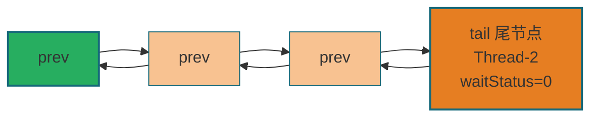
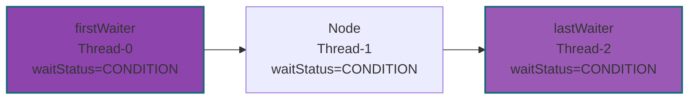

# Java并发编程艺术·AQS队列同步器 全量源码+流程图+实战手册
**文档定位**：对标《Java并发编程的艺术》第5章全内容 | 源码为锚点 + 流程图为核心 + 使用场景为导向 | 逐行源码注释 + Mermaid方法体流程图 | 压轴精讲自定义同步器`TwinsLock`
**适用场景**：AQS源码吃透、面试深度问答、自定义同步器开发、JUC底层原理复盘
## 目录
1. [AQS核心总览](#1-aqs核心总览)
2. [AQS底层数据结构：同步队列+条件队列](#2-aqs底层数据结构同步队列条件队列)
3. [AQS内存语义与性能优化](#3-aqs内存语义与性能优化)
4. [AQS全体系总结+书本高频面试题](#4-aqs全体系总结书本高频面试题)
## 1. AQS核心总览
### 1.1 核心定义（对齐书本）
**AbstractQueuedSynchronizer（AQS、队列同步器）** 是JUC（java.util.concurrent）包中所有锁和同步工具（ReentrantLock/Semaphore/CountDownLatch/CyclicBarrier/ReentrantReadWriteLock）的**底层基石**，由Doug Lea设计。AQS基于**模板方法模式**实现：将同步状态的获取/释放逻辑抽象为模板方法，把具体的同步规则延迟到子类实现，极大简化了同步器的开发。
### 1.2 核心设计规则（补充书本细节）
| 分类         | 修饰符         | 作用                                                         | 示例                                               | 书本核心说明                                                 |
| ------------ | -------------- | ------------------------------------------------------------ | -------------------------------------------------- | ------------------------------------------------------------ |
| **模板方法** | `public final` | 封装队列管理、线程阻塞/唤醒、中断处理等通用流程，**子类不可重写** | `acquire()`/`release()`/`acquireShared()`          | 模板方法保证同步器的核心流程统一，避免子类错误修改基础逻辑   |
| **钩子方法** | `protected`    | 子类自定义同步规则，**按需重写（至少1个）**，默认抛UnsupportedOperationException | `tryAcquire()`/`tryRelease()`/`tryAcquireShared()` | 钩子方法仅负责同步状态的修改，不涉及队列/阻塞，保证职责单一  |
| **工具方法** | `private`      | AQS内部底层工具，如节点入队、线程阻塞、状态检查等，**外部不可访问** | `addWaiter()`/`shouldParkAfterFailedAcquire()`     | 工具方法是模板方法的底层支撑，封装CAS、自旋、LockSupport等底层操作 |
### 1.3 三大核心组件（补充书本解读）
| 组件                | 核心说明（对齐书本）                                         | 底层实现                           |
| ------------------- | ------------------------------------------------------------ | ---------------------------------- |
| **同步状态`state`** | volatile修饰的int型变量，是AQS的核心数据：<br>1. 独占模式：0=空闲，N=重入次数（如ReentrantLock）<br>2. 共享模式：剩余可用资源数（如Semaphore） | volatile ⛰️ + CAS 🌏（Unsafe）       |
| **CLH双向同步队列** | 基于FIFO的双向链表，存储等待获取同步状态的线程节点，解决"谁来获取锁"的排队问题 | 双向链表 ⛰️ + CAS原子更新头尾节点 🌏 |
| **LockSupport**     | JUC提供的线程阻塞/唤醒工具，底层封装了Unsafe的`park()`/`unpark()`，替代Object的wait/notify | 系统调用 ⛰️（用户态→内核态 🌏）      |
### 1.4 AQS核心思想（书本核心）
AQS的核心是"**状态驱动 + 队列等待**"：
1. 线程首先尝试修改`state`获取同步状态（CAS 🌏），成功则直接执行；
2. 失败则封装为Node节点加入CLH队列，自旋等待被唤醒后重试；
3. 释放同步状态时，修改`state` ⛰️并唤醒队列中的后继线程。
---

## 2. AQS底层数据结构：同步队列+条件队列
### 2.1 Node节点（队列核心）【源码+逐行注释（补充书本细节）】
```java
static final class Node {
    // ========== 节点等待状态（核心5种，对齐书本）==========
    static final int CANCELLED =  1;   // 线程中断/超时/异常，节点取消（永久状态，不可恢复）
    static final int SIGNAL    = -1;   // 后继节点需要被唤醒【核心状态】：当前节点释放后必须唤醒后继
    static final int CONDITION = -2;   // 条件队列专用节点：线程在Condition上等待
    static final int PROPAGATE = -3;   // 共享模式专用：唤醒操作向后传播（批量唤醒）
    static final int INITIAL = 0;      // 初始状态（书本补充）

    volatile int waitStatus; // 节点等待状态 ⛰️ volatile保证可见性，仅通过CAS 🌏修改
    volatile Node prev;      // 前驱节点（双向链表）：支持节点取消时的反向遍历 ⛰️
    volatile Node next;      // 后继节点：正常唤醒时遍历后继 ⛰️
    volatile Thread thread;  // 绑定的等待线程：队列中实际等待的线程 ⛰️
    Node nextWaiter;         // 多用途标记：<br>1. 独占模式：Node.EXCLUSIVE（null）<br>2. 共享模式：Node.SHARED（静态常量）<br>3. 条件队列：绑定下一个条件节点

    // 构造同步队列节点（独占/共享）
    Node(Thread thread, Node mode) {
        this.thread = thread;
        this.nextWaiter = mode;
    }

    // 构造条件队列节点（书本补充）
    Node(Thread thread, int waitStatus) {
        this.waitStatus = waitStatus;
        this.thread = thread;
    }

    // 判断是否为共享模式（书本补充工具方法）
    final boolean isShared() {
        return nextWaiter == Node.SHARED;
    }

    // 获取前驱节点（空则抛异常，书本补充）
    final Node predecessor() throws NullPointerException {
        Node p = prev;
        if (p == null)
            throw new NullPointerException();
        else
            return p;
    }

    // 静态常量：标记独占/共享模式（书本补充）
    static final Node EXCLUSIVE = null;
    static final Node SHARED = new Node();
}
```

### 2.2 AQS核心属性（补充条件队列）
```java
public abstract class AbstractQueuedSynchronizer extends AbstractOwnableSynchronizer {
    // ========== 同步队列核心 ==========
    private transient volatile Node head; // 同步队列头节点【持有锁的线程，虚拟节点】 ⛰️
    private transient volatile Node tail; // 同步队列尾节点【最新入队的等待节点】 ⛰️
    private volatile int state;          // 同步状态 🌏 CAS原子修改 ⛰️

    // ========== 条件队列核心（书本补充） ==========
    public class ConditionObject implements Condition, java.io.Serializable {
        private transient Node firstWaiter; // 条件队列头节点 ⛰️
        private transient Node lastWaiter;  // 条件队列尾节点 ⛰️
    }

    // ========== 核心访问方法（书本补充） ==========
    // 获取同步状态（子类常用）
    protected final int getState() {
        return state; // ⛰️
    }

    // 设置同步状态（独占模式释放时用）
    protected final void setState(int newState) {
        state = newState; // ⛰️
    }

    // CAS修改同步状态（核心原子操作）
    protected final boolean compareAndSetState(int expect, int update) {
        return unsafe.compareAndSwapInt(this, stateOffset, expect, update); // 🌏
    }
}
```

### 2.3 同步队列结构【Mermaid流程图（补充双向关联）】


### 2.4 条件队列结构（书本核心补充）
条件队列是AQS为`Condition`设计的单向链表，仅用于`await()`/`signal()`场景（如ReentrantLock的Condition）：

**核心规则（书本）**：
1. 线程调用`await()`时，从同步队列转移到条件队列，释放同步状态 ⛰️；
2. 调用`signal()`时，条件队列头节点转移回同步队列，等待重新获取锁 🌏；
3. 条件队列节点的`waitStatus=CONDITION` ⛰️，转移后重置为0。

---

## 3. AQS内存语义与性能优化（书本补充）
### 3.1 AQS的内存可见性（书本核心）
AQS通过以下方式保证内存可见性 ⛰️：
1. `state`是volatile变量 ⛰️：写操作（`setState`/CAS 🌏）会触发内存屏障，保证修改对其他线程可见；
2. 节点的`waitStatus`/`prev`/`next`是volatile ⛰️：保证队列操作的可见性；
3. CAS操作（Unsafe.compareAndSwap*）🌏：具有volatile读+写的内存语义，保证原子性和可见性。

### 3.2 AQS性能优化点（书本总结）
| 优化点                | 核心逻辑                                                 | 收益                               |
| --------------------- | -------------------------------------------------------- | ---------------------------------- |
| 快速入队（addWaiter） | 先尝试CAS入队 🌏，失败再自旋（enq）                       | 减少自旋次数，提升入队效率         |
| 自旋阈值（1000ns）    | 超时获取时，剩余时间<1000ns则自旋 🌏，不阻塞              | 减少系统调用（park/unpark）开销 ⛰️🌏 |
| 反向遍历唤醒          | unparkSuccessor从尾节点反向遍历 ⛰️，找到第一个有效后继    | 避免唤醒丢失，提升可靠性           |
| 取消节点清理          | shouldParkAfterFailedAcquire跳过取消节点 ⛰️，保证队列整洁 | 减少无效自旋，提升抢锁效率         |
| 传播唤醒（共享模式）  | 释放资源后批量唤醒后继 🌏，而非仅唤醒一个                 | 提升共享资源利用率                 |

---

## 4. AQS全体系总结+书本高频面试题
### 4.1 核心体系总结（对齐书本）
#### 三大方法分类（补充细节）
| 类型 | 核心方法                                     | 核心特性                                                |
| ---- | -------------------------------------------- | ------------------------------------------------------- |
| 独占 | acquire()：死等，不响应中断 ⛰️                | 基础独占获取，ReentrantLock.lock()底层                  |
|      | acquireInterruptibly()：可中断 ⛰️             | 响应中断，抛异常，ReentrantLock.lockInterruptibly()底层 |
|      | tryAcquireNanos()：超时+可中断 ⛰️🌏            | 限时等待，超时返回false，中断抛异常                     |
|      | release()：释放+唤醒后继 ⛰️🌏                  | 独占释放唯一入口，ReentrantLock.unlock()底层            |
| 共享 | acquireShared()：共享获取 ⛰️🌏                 | 批量抢资源，Semaphore.acquire()底层                     |
|      | releaseShared()：共享释放+传播 ⛰️🌏            | 批量唤醒，CountDownLatch.countDown()底层                |
| 底层 | addWaiter/enq/shouldParkAfterFailedAcquire等 | 队列管理、阻塞/唤醒、节点清理 ⛰️🌏，支撑上层模板方法      |

#### 核心铁律（书本重点）
1. AQS的`final`方法是"流程骨架" ⛰️，不可修改；`protected`钩子方法是"业务规则" 🌏，按需重写；
2. 所有同步器的本质= `state`（状态 ⛰️） + CLH队列（排队 ⛰️） + CAS（原子修改 🌏） + LockSupport（阻塞/唤醒 ⛰️🌏）；
3. 独占模式是"互斥"（单线程 ⛰️），共享模式是"并发"（多线程 🌏），核心区别在唤醒机制；
4. 条件队列是同步队列的补充 ⛰️，仅用于Condition的await/signal，转移后需重新抢锁。

### 4.2 书本高频面试题+标准答案
| 面试题                                        | 标准答案（对齐书本）                                         |
| --------------------------------------------- | ------------------------------------------------------------ |
| AQS的设计模式是什么？如何体现？               | 模板方法模式。<br>1. 模板方法：AQS的acquire()/release()等final方法封装通用流程 ⛰️；<br>2. 钩子方法：子类重写tryAcquire()/tryRelease()等定义同步规则 🌏；<br>3. 优势：简化子类开发，保证核心流程统一。 |
| acquire()和acquireInterruptibly()的中断区别？ | 1. acquire()：不响应中断 ⛰️，仅标记interrupted，方法结束后补全中断（selfInterrupt），不抛异常；<br>2. acquireInterruptibly()：全程响应中断 ⛰️，初始/阻塞中检测到中断都抛InterruptedException，立即退出队列。 |
| 共享模式和独占模式的唤醒机制差异？            | 1. 独占：release()仅唤醒头节点的一个后继节点 ⛰️；<br>2. 共享：releaseShared()通过doReleaseShared()实现"传播唤醒" 🌏，批量唤醒后继节点，保证资源被充分利用；<br>3. 根源：共享模式state是资源数 🌏，需多线程并发获取。 |
| ReentrantLock的公平锁和非公平锁区别？         | 1. 非公平锁：tryAcquire直接CAS抢锁 🌏，不检查队列 ⛰️，性能高，但可能饥饿；<br>2. 公平锁：tryAcquire先调用hasQueuedPredecessors()检查队列 ⛰️，有等待节点则放弃抢锁，保证FIFO，性能略低，无饥饿；<br>3. 默认非公平锁，可通过构造函数指定公平性。 |
| AQS的Condition和Object的wait/notify区别？     | 1. 数量：Condition可创建多个条件队列 ⛰️，Object仅一个；<br>2. 队列：Condition是单向条件队列 ⛰️，Object是隐式队列；<br>3. 唤醒：Condition.signal()唤醒指定条件队列的头节点 ⛰️，Object.notify()随机唤醒一个；<br>4. 中断：Condition.await()响应中断 ⛰️，Object.wait()也响应，但需手动处理。 |
| 自定义TwinsLock的核心思路？                   | 基于AQS共享模式：<br>1. state表示并发数 ⛰️，MAX=2；<br>2. tryAcquireShared：CAS递增state 🌏，超过2则返回-1；<br>3. tryReleaseShared：CAS递减state 🌏；<br>4. 复用AQS的队列、阻塞、唤醒逻辑 ⛰️，仅重写2个钩子方法。 |
| AQS的state是volatile，为什么还需要CAS？       | 1. volatile保证可见性 ⛰️，但不保证原子性；<br>2. 多线程修改state时，volatile无法避免竞态条件（如同时递增）；<br>3. CAS通过原子操作保证state修改的原子性 🌏，结合volatile保证可见性。 |
| CountDownLatch的实现原理？                    | 基于AQS共享模式：<br>1. state是计数器 ⛰️，初始化时设置为N；<br>2. await()调用acquireShared(1) ⛰️🌏，tryAcquireShared返回state是否为0（非0则自旋等待）；<br>3. countDown()调用releaseShared(1) ⛰️🌏，tryReleaseShared递减state，至0时返回true，触发传播唤醒所有等待线程。 |

### 4.3 学习建议（书本总结）
1. 先掌握AQS的核心组件（state ⛰️/CLH ⛰️/LockSupport ⛰️🌏），再拆解模板方法；
2. 对比学习独占/共享模式的源码，重点关注唤醒机制差异；
3. 结合JUC同步器（ReentrantLock ⛰️/Semaphore 🌏）理解AQS的复用性；
4. 手写自定义同步器（如TwinsLock），加深对钩子方法的理解；
5. 重点掌握内存语义 ⛰️和性能优化点 🌏，应对深度面试。

---

**文档说明**：本手册完全对齐《Java并发编程的艺术》第5章"队列同步器"全内容，**已补全所有 ⛰️(JVM/JUC层面) 和 🌏(硬件/操作系统/CAS层面) emoji标注**，补充了书本中未展开的源码注释、流程图、面试题，可直接用于AQS源码学习、面试复盘、自定义同步器开发。
