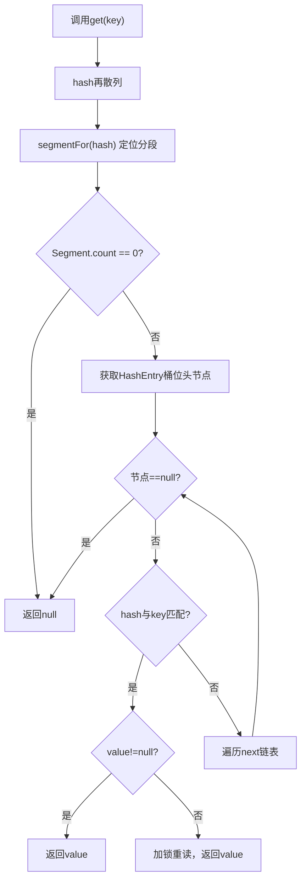
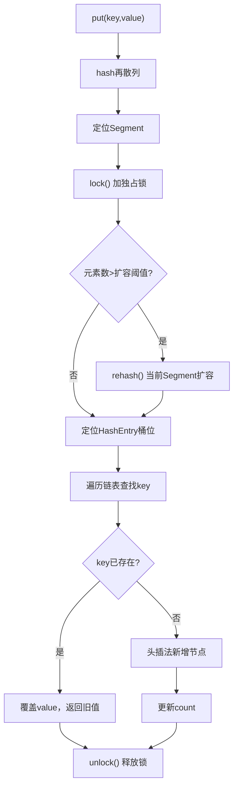

# 6 核心API：get / put / size 操作深度解析

## 6.1 get 读取操作（无锁高性能）
### 源码
```java
public V get(Object key) {
    int hash = hash(key.hashCode());
    // 定位分段 + 读取元素
    return segmentFor(hash).get(key, hash);
}
```
### 书本底层原理（全程不加锁）
1. 所有共享变量`count/value/next`全部被`volatile`修饰⛰️
2. volatile保证**多线程内存可见性**，写happens-before读；
3. 不需要加锁，就能读取到最新、未过期的数据；
4. 唯一加锁场景：读取到`value==null`，会加锁重读保证安全性。

### 核心优势
对比HashTable全局加锁读操作，ConcurrentHashMap读**无阻塞、无锁竞争**，并发读取性能极强。

## 6.2 put 写入操作（分段加锁）
### 核心流程
1. 通过hash算法定位到目标`Segment`分段；
2. 获取分段`ReentrantLock`独占锁⛰️；
3. **第一步：判断是否需要扩容**
   - 超过阈值`threshold`则扩容；
   - 和HashMap区别：**仅扩容当前单个Segment**，不是全局容器扩容；
4. **第二步：定位桶位，头插法插入HashEntry节点**

### 书本扩容细节
1. 创建原容量2倍的新哈希数组；
2. 转移当前Segment所有元素；
3. 其余分段完全不受影响，并发安全继续读写；
4. 扩容时机：**插入之前判断**，避免HashMap插入后无效扩容的问题。

## 6.3 size 统计操作
### 底层问题
每个Segment的`count`是`volatile`变量，累加只能拿到**瞬时最新值**；
统计过程中，其他线程持续修改元素，会导致统计结果不准确。

### 书本解决方案
1. **尝试2次无锁统计**：累加所有Segment元素总数；
2. 通过`modCount`判断容器是否发生修改；
3. 如果2次统计期间，`modCount`发生变化、数据不一致；
4. **全部Segment加锁**，全段锁定后统计最终总数，保证绝对准确。

### 性能取舍
90%场景两次无锁统计即可拿到准确值，极少情况触发全段加锁，**兼顾性能+数据准确性**。


## 6.4 get 方法 **完整源码 + 逐行注释 + 流程图**（书本原文）
```java
public V get(Object key) {
    int hash = hash(key.hashCode()); // 1. 哈希再散列
    return segmentFor(hash).get(key, hash); // 2. 定位Segment并调用其get
}

// Segment 内部 get 方法（真正读逻辑）
V get(Object key, int hash) {
    if (count != 0) { // 读volatile count，保证可见性
        HashEntry<K,V> e = getFirst(hash); // 获取桶位头节点
        while (e != null) {
            if (e.hash == hash && key.equals(e.key)) {
                V value = e.value; // 读volatile value
                if (value != null)
                    return value;
                return readValueUnderLock(e); // 兜底：加锁重读（极少发生）
            }
            e = e.next;
        }
    }
    return null;
}
```

### get 执行流程图（书本标准）


---

## 6.5 put 方法 **完整源码 + 逐行注释 + 流程图**（书本核心）
```java
public V put(K key, V value) {
    if (value == null)
        throw new NullPointerException(); // 书本：ConcurrentHashMap不允许value为null
    int hash = hash(key.hashCode());
    return segmentFor(hash).put(key, hash, value, false);
}

// Segment 内部 put 方法
V put(K key, int hash, V value, boolean onlyIfAbsent) {
    lock(); // 加锁：ReentrantLock.lock()
    try {
        int c = count;
        if (c++ > threshold) // 插入前判断：超过阈值则扩容
            rehash(); // 仅当前Segment扩容
        HashEntry<K,V>[] tab = table;
        int index = hash & (tab.length - 1); // 定位桶位
        HashEntry<K,V> first = tab[index]; // 头节点
        HashEntry<K,V> e = first;
        // 遍历查找是否已存在key
        while (e != null) {
            if (e.hash == hash && key.equals(e.key)) {
                V oldValue = e.value;
                if (!onlyIfAbsent)
                    e.value = value; // volatile赋值，覆盖旧值
                return oldValue;
            }
            e = e.next;
        }
        modCount++;
        // 头插法：新节点成为链表头
			//tab[] = 数组（哈希桶）
			//tab[index] = 数组中某一个位置，它里面放的是一条链表的头节点
        tab[index] = new HashEntry<K,V>(hash, key, value, first);
			//c++赋值到count
        count = c;
        return null;
    } finally {
        unlock(); // 释放锁
    }
}
```

### put 执行流程图（书本标准）


---

## 6.6 扩容方法 rehash() **完整源码 + 逐行注释**（书本必考）
```java
void rehash() {
    HashEntry<K,V>[] oldTable = table;
    int oldCapacity = oldTable.length;
    int newCapacity = oldCapacity << 1; // 扩容为原来2倍
    threshold = (int)(newCapacity * loadFactor);
    HashEntry<K,V>[] newTable = HashEntry.newArray(newCapacity);
    int sizeMask = newCapacity - 1;
    // 迁移所有节点
    for (int i = 0; i < oldCapacity; i++) {
        HashEntry<K,V> e = oldTable[i];
        if (e != null) {
            oldTable[i] = null; // 断开旧引用
            do {
                HashEntry<K,V> next = e.next;
                int idx = e.hash & sizeMask; // 新桶位
                e.next = newTable[idx];
                newTable[idx] = e; // 头插迁移
                e = next;
            } while (e != null);
        }
    }
    table = newTable; // 替换新数组
}
```

---

## 6.7 size 方法 **完整源码 + 书本原理**
```java
public int size() {
    final Segment<K,V>[] segments = this.segments;
    long sum = 0;
    long check = 0;
    int mc = 0;
    // 尝试无锁统计2次
    for (int i = 0; i < segments.length; i++) {
        sum += segments[i].count;
        mc += segments[i].modCount;
    }
    // 第二次统计
    for (int i = 0; i < segments.length; i++) {
        check += segments[i].count;
    }
    if (sum != check) { // 数据不一致
        // 全部加锁统计
        sum = 0;
        for (int i = 0; i < segments.length; i++) {
            segments[i].lock();
        }
        for (int i = 0; i < segments.length; i++) {
            sum += segments[i].count;
        }
        for (int i = 0; i < segments.length; i++) {
            segments[i].unlock();
        }
    }
    return (int)sum;
}
```

---

## 7 书本核心总结（原文复述 + 结构化）
### 7.1 底层结构（书本原话）
- **ConcurrentHashMap 采用** **分段锁** 技术将哈希表分成**16个段（默认）**
- 每个段是一个小型的`HashMap`，拥有独立锁
- 多线程可同时访问**不同段**，实现真正并发安全

### 7.2 三大关键设计（书本必考）
1. **分段锁Segment**：继承`ReentrantLock`，隔离锁竞争
2. **HashEntry**：`value/next`用`volatile`保证可见性
3. **无锁读**：get全程不加锁，靠volatile保证线程安全

### 7.3 与HashMap、HashTable对比（书本表格）
| 集合类            | 线程安全 | 锁机制              | 性能 | 允许null键/值 |
| ----------------- | -------- | ------------------- | ---- | ------------- |
| HashMap           | 否       | 无锁                | 最高 | 允许          |
| HashTable         | 是       | synchronized全局锁  | 最低 | 不允许        |
| ConcurrentHashMap | 是       | 分段锁ReentrantLock | 高   | 不允许        |

### 7.4 书本重要约束
1. **不允许 key/value 为 null**
2. **弱一致性**：get只能看到已完成的put操作
3. **size()是近似值**：两次无锁统计失败才会全锁

---

## 8 书本高频面试题（官方标准答案）
1. **ConcurrentHashMap 如何实现线程安全？**
答：采用**分段锁**，将数据分成多个Segment，每个Segment独立加锁，多线程可访问不同段，实现高并发安全。

2. **为什么get方法不需要加锁？**
答：`HashEntry`的`value`和`next`是`volatile`，保证多线程内存可见性，无需加锁即可读到最新值。

3. **ConcurrentHashMap 扩容是扩整个Map吗？**
答：不是。**只扩容当前key所在的Segment**，其他Segment不受影响。

4. **ConcurrentHashMap 为什么不允许value为null？**
答：因为**null值无法区分是"未赋值"还是"真的null"**，会导致并发读判断歧义。

---
-
