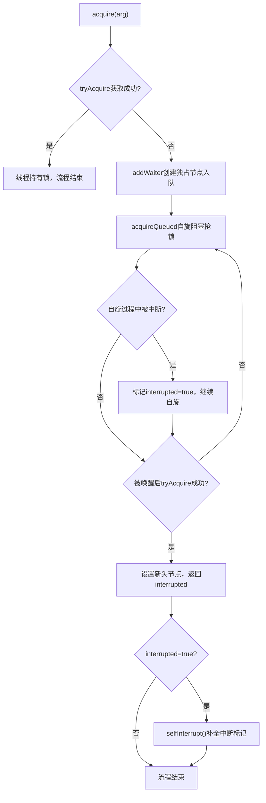
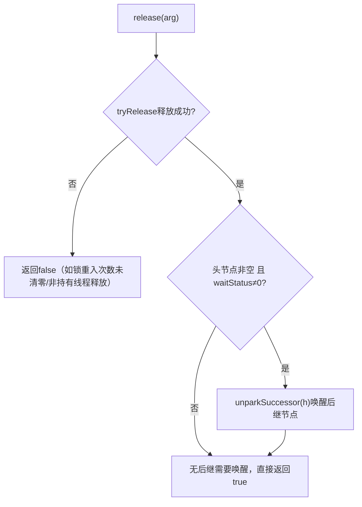
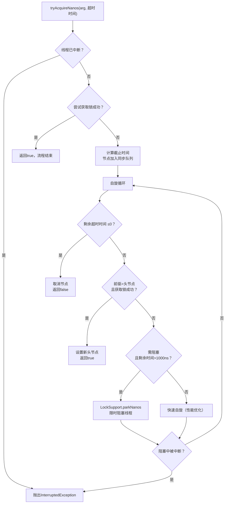

## 3. 独占式同步状态·获取与释放
### 3.1 独占不可中断获取 `acquire(int arg)`【模板方法（补充书本解读）】
#### 源码+逐行注释（对齐书本）
```java
public final void acquire(int arg) {
    // 书本核心逻辑拆解：
    // 1. tryAcquire(arg)：子类自定义尝试获取锁，无阻塞、无队列操作
    // 2. 若失败 → addWaiter(Node.EXCLUSIVE)：封装为独占节点入队 🌏
    // 3. acquireQueued(...)：自旋阻塞，死等锁（不响应中断） ⛰️
    // 4. 若全程被中断 → selfInterrupt()：补全中断标记（仅标记，不抛异常） ⛰️
    if (!tryAcquire(arg) && acquireQueued(addWaiter(Node.EXCLUSIVE), arg)) {
        selfInterrupt(); // 书本重点：中断仅标记，方法结束后补全中断状态 ⛰️
    }
}

// 子类重写钩子：单次尝试获取锁（非阻塞），默认抛异常
protected boolean tryAcquire(int arg) {
    throw new UnsupportedOperationException();
}

// 补全中断标记（书本补充）
static void selfInterrupt() {
    Thread.currentThread().interrupt(); // ⛰️
}
```
#### 执行流程图【补充中断标记细节】

#### 书本核心解读
- `acquire()`是"死等锁"逻辑，**不响应中断** ⛰️：即使线程在阻塞中被中断，也不会退出队列，仅标记中断状态；
- 适用场景：`ReentrantLock.lock()` 底层，要求线程必须获取锁才能执行，不允许中途放弃。

### 3.2 节点入队 `addWaiter()` + `enq()`【底层核心（补充书本CAS解读）】
#### 源码+逐行注释（对齐书本）
```java
private Node addWaiter(Node mode) {
    Node node = new Node(Thread.currentThread(), mode); // 封装当前线程为节点 ⛰️
    Node pred = tail;
    // 快速入队（书本：优化路径，减少自旋）
    if (pred != null) {
        node.prev = pred; // 1. 绑定前驱为当前尾节点 ⛰️
        // 2. CAS原子更新尾节点：保证多线程下仅一个节点入队成功 🌏
        if (compareAndSetTail(pred, node)) {
            pred.next = node; // 3. 前驱的后继指向当前节点，入队完成 ⛰️
            return node;
        }
    }
    enq(node); // 兜底入队：队列未初始化/快速入队失败，自旋CAS入队 🌏
    return node;
}

// 自旋入队（队列初始化+兜底，书本核心）
private Node enq(final Node node) {
    for (;;) { // 无限自旋：保证节点最终一定入队（书本：CAS自旋的"万能兜底"）🌏
        Node t = tail;
        if (t == null) { // 队列未初始化：创建虚拟头节点（书本重点）⛰️
            // CAS创建头节点：空队列的头节点是"虚拟节点"（无线程绑定）🌏
            if (compareAndSetHead(new Node()))
                tail = head; // 头尾节点指向同一虚拟节点 ⛰️
        } else {
            node.prev = t; // ⛰️
            if (compareAndSetTail(t, node)) { // 🌏
                t.next = node; // ⛰️
                return t;
            }
        }
    }
}

// CAS更新尾节点（书本补充底层实现）
private final boolean compareAndSetTail(Node expect, Node update) {
    return unsafe.compareAndSwapObject(this, tailOffset, expect, update); // 🌏
}
```
#### 书本核心解读
- 虚拟头节点：空队列初始化时创建的无线程节点 ⛰️，目的是简化队列操作（前驱为头节点的线程才有资格抢锁）；
- CAS入队：多线程下仅一个线程能成功更新尾节点 🌏，失败的线程自旋重试，保证队列的FIFO特性。

### 3.3 自旋阻塞 `acquireQueued()`【独占核心（补充书本细节）】
#### 源码+逐行注释（对齐书本）
```java
final boolean acquireQueued(final Node node, int arg) {
    boolean failed = true; // 标记是否获取锁失败（异常场景）
    try {
        boolean interrupted = false; // 标记自旋过程中是否被中断 ⛰️
        for (;;) { // 无限自旋：死等锁（书本："自旋+阻塞"结合）🌏
            final Node p = node.predecessor(); // 获取前驱节点 ⛰️
            // 书本核心规则：仅当前驱是头节点，才有资格抢锁（公平性基础）⛰️
            if (p == head && tryAcquire(arg)) {
                setHead(node); // 当前节点变为新头节点（虚拟头节点）⛰️
                p.next = null; // 旧头节点断开引用，便于GC回收 ⛰️
                failed = false; // 获取成功，标记为未失败
                return interrupted; // 返回中断标记 ⛰️
            }
            // 书本核心：两步判断+阻塞
            // 1. shouldParkAfterFailedAcquire：检查前驱状态，判断是否需要阻塞 ⛰️
            // 2. parkAndCheckInterrupt：阻塞线程，返回是否被中断 ⛰️🌏
            if (shouldParkAfterFailedAcquire(p, node) && parkAndCheckInterrupt()) {
                interrupted = true; // 仅标记中断，不退出自旋（核心：不响应中断）⛰️
            }
        }
    } finally {
        if (failed) cancelAcquire(node); // 异常场景：取消节点（书本补充）⛰️
    }
}

// 阻塞线程并检查中断（书本核心）
private final boolean parkAndCheckInterrupt() {
    LockSupport.park(this); // 线程进入WAITING状态（用户态→内核态），释放CPU ⛰️🌏
    // Thread.interrupted()：返回当前中断状态，并清除中断标记 ⛰️
    return Thread.interrupted();
}
```
#### 书本核心解读
- 自旋抢锁规则：只有前驱是头节点的线程才有资格抢锁 ⛰️（保证队列FIFO的公平性）；
- 阻塞时机：不是立即阻塞，而是先检查前驱状态（`shouldParkAfterFailedAcquire`），确保前驱是SIGNAL状态后再阻塞 ⛰️（避免无效唤醒）；
- 异常处理：自旋过程中若抛出异常，执行`cancelAcquire`取消节点 ⛰️，避免队列中残留无效节点。

### 3.4 独占释放 `release(int arg)`【模板方法（补充书本细节）】
#### 源码+逐行注释（对齐书本）
```java
public final boolean release(int arg) {
    // 1. tryRelease(arg)：子类自定义释放锁（必须保证线程安全）🌏
    if (tryRelease(arg)) {
        Node h = head; // ⛰️
        // 书本核心：头节点有效（非空）且状态非0 → 唤醒后继节点 ⛰️
        // 原因：头节点状态为SIGNAL时，说明有后继节点等待唤醒 ⛰️
        if (h != null && h.waitStatus != 0) {
            unparkSuccessor(h); // 唤醒后继节点（核心）⛰️🌏
        }
        return true; // 释放成功
    }
    return false; // 释放失败（如锁未被当前线程持有）
}

// 子类重写钩子：释放同步状态，默认抛异常
protected boolean tryRelease(int arg) {
    throw new UnsupportedOperationException();
}
```
#### 执行流程图【补充释放失败场景】

#### 书本核心解读
- `tryRelease`必须保证原子性 🌏：如ReentrantLock中，释放时需递减重入次数 ⛰️，只有次数为0时才真正释放锁；
- 唤醒规则：仅头节点状态非0时才唤醒后继 ⛰️（避免无意义的唤醒操作，提升性能）。

### 3.5 条件队列→同步队列转移（书本补充核心）
```java
// Condition.await()核心逻辑（书本简化版）
public final void await() throws InterruptedException {
    if (Thread.interrupted()) throw new InterruptedException(); // ⛰️
    Node node = addConditionWaiter(); // 加入条件队列 ⛰️
    int savedState = fullyRelease(node); // 释放全部同步状态 ⛰️🌏
    int interruptMode = 0;
    // 判断是否在同步队列中，不在则阻塞 ⛰️
    while (!isOnSyncQueue(node)) {
        LockSupport.park(this); // 阻塞在条件队列 ⛰️🌏
        if ((interruptMode = checkInterruptWhileWaiting(node)) != 0)
            break;
    }
    // 转移到同步队列后，自旋抢锁 ⛰️
    if (acquireQueued(node, savedState) && interruptMode != THROW_IE)
        interruptMode = REINTERRUPT;
    if (node.nextWaiter != null)
        unlinkCancelledWaiters(); // 清理条件队列的取消节点 ⛰️
    if (interruptMode != 0)
        reportInterruptAfterWait(interruptMode); // 处理中断 ⛰️
}

// Condition.signal()核心逻辑（书本简化版）
public final void signal() {
    if (!isHeldExclusively()) // 检查当前线程是否持有锁 ⛰️
        throw new IllegalMonitorStateException();
    Node first = firstWaiter; // ⛰️
    if (first != null)
        doSignal(first); // 转移条件队列头节点到同步队列 ⛰️🌏
}
```

---

## 4. 独占式进阶·可中断/超时获取
### 4.1 可中断获取 `acquireInterruptibly(int arg)`（书本核心）
#### 源码+逐行注释
```java
public final void acquireInterruptibly(int arg) throws InterruptedException {
    // 书本核心：初始检测中断→直接抛异常（响应中断的第一步）⛰️
    if (Thread.interrupted())
        throw new InterruptedException();
    // 尝试获取锁失败 → 进入可中断的自旋阻塞 ⛰️
    if (!tryAcquire(arg))
        doAcquireInterruptibly(arg);
}

// 可中断的自旋阻塞（书本补充源码）
private void doAcquireInterruptibly(int arg) throws InterruptedException {
    final Node node = addWaiter(Node.EXCLUSIVE); // 🌏
    boolean failed = true;
    try {
        for (;;) {
            final Node p = node.predecessor(); // ⛰️
            if (p == head && tryAcquire(arg)) { // ⛰️
                setHead(node); // ⛰️
                p.next = null; // ⛰️
                failed = false;
                return;
            }
            if (shouldParkAfterFailedAcquire(p, node) && parkAndCheckInterrupt()) {
                // 核心区别：直接抛InterruptedException，退出队列（响应中断）⛰️
                throw new InterruptedException();
            }
        }
    } finally {
        if (failed)
            cancelAcquire(node); // ⛰️
    }
}
```
#### 核心特性（对齐书本）
✅ **全程响应中断** ⛰️：
1. 初始检测：调用方法时若线程已中断，直接抛异常；
2. 阻塞中中断：自旋阻塞时被中断，立即退出队列并抛异常；
✅ 适用场景：`ReentrantLock.lockInterruptibly()` 底层，允许线程在等待锁时响应中断（避免无限阻塞）。

### 4.2 超时可中断获取 `tryAcquireNanos(int arg, long nanosTimeout)`（书本核心）
#### 源码+逐行注释
```java
public final boolean tryAcquireNanos(int arg, long nanosTimeout) throws InterruptedException {
    // 初始中断检测：抛异常（同acquireInterruptibly）⛰️
    if (Thread.interrupted())
        throw new InterruptedException();
    // 逻辑：尝试获取锁 → 成功则返回true；失败则进入超时自旋 ⛰️🌏
    return tryAcquire(arg) || doAcquireNanos(arg, nanosTimeout);
}

// 超时自旋核心（书本补充关键逻辑）
private boolean doAcquireNanos(int arg, long nanosTimeout) throws InterruptedException {
    if (nanosTimeout <= 0L)
        return false; // 超时时间≤0，直接返回失败
    // 计算截止时间（书本重点：系统纳秒数，避免时间漂移）🌏
    final long deadline = System.nanoTime() + nanosTimeout;
    final Node node = addWaiter(Node.EXCLUSIVE); // 🌏
    boolean failed = true;
    try {
        for (;;) {
            final Node p = node.predecessor(); // ⛰️
            // 抢锁成功 → 返回true ⛰️
            if (p == head && tryAcquire(arg)) {
                setHead(node); // ⛰️
                p.next = null; // ⛰️
                failed = false;
                return true;
            }
            // 计算剩余超时时间 🌏
            nanosTimeout = deadline - System.nanoTime();
            if (nanosTimeout <= 0L)
                return false; // 超时→返回false（核心）
            // 书本优化：剩余时间>1000ns才阻塞，否则自旋（减少系统调用开销）🌏
            if (shouldParkAfterFailedAcquire(p, node) && nanosTimeout > SPIN_FOR_TIMEOUT_THRESHOLD)
                LockSupport.parkNanos(this, nanosTimeout); // 限时阻塞 ⛰️🌏
            // 检测中断→抛异常 ⛰️
            if (Thread.interrupted())
                throw new InterruptedException();
        }
    } finally {
        if (failed)
            cancelAcquire(node); // ⛰️
    }
}

// 书本常量：自旋阈值（1000纳秒）
static final long SPIN_FOR_TIMEOUT_THRESHOLD = 1000L; // 🌏
```
#### 执行流程图【补充自旋优化细节】

#### 书本核心解读
- 时间计算：基于`System.nanoTime()` 🌏（而非`System.currentTimeMillis()`），避免系统时间修改导致的超时错误；
-  自旋优化：剩余时间<1000ns时，放弃阻塞直接自旋 🌏（系统调用的开销大于自旋）；
- 超时规则：超时后直接返回false，不会抛异常（中断才抛异常）⛰️。

---
