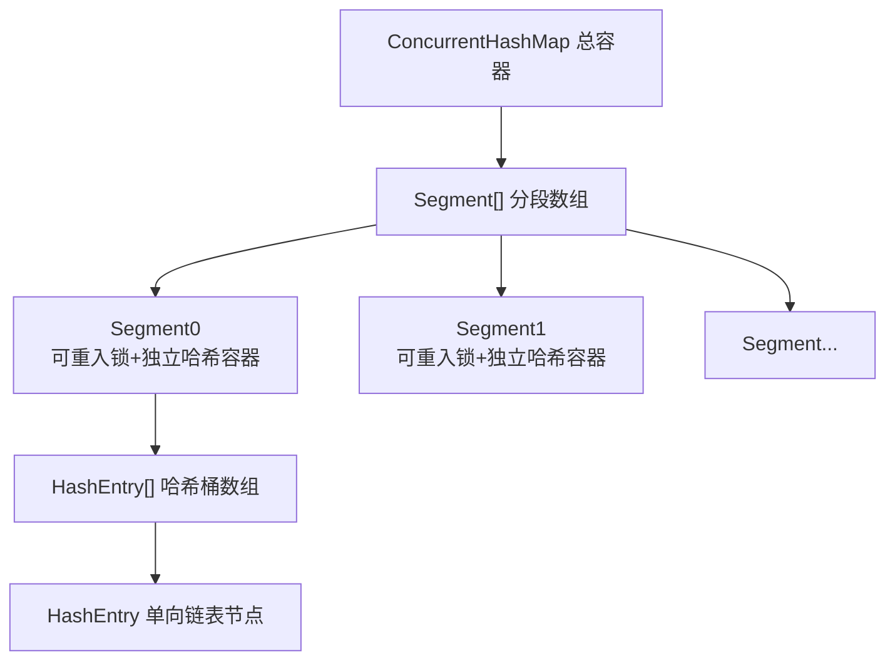
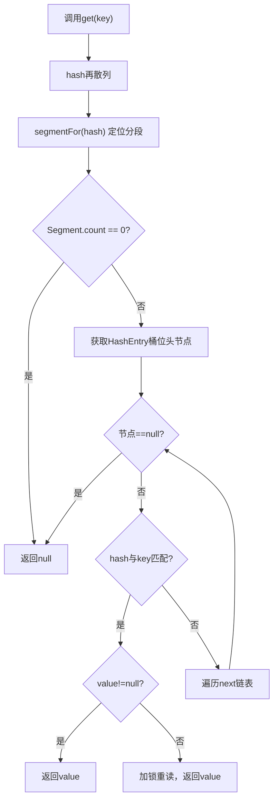
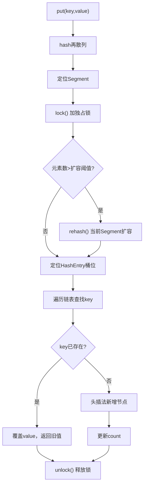

# 第6章 Java并发容器和框架
## 6.1 JDK1.7 `ConcurrentHashMap` 实现原理与使用
## 目录
1. [为什么使用 ConcurrentHashMap](#1-为什么使用-concurrenthashmap)
2. [JDK1.7 底层整体架构结构](#2-jdk17-底层整体架构结构)
3. [核心类成员 & 类图解析](#3-核心类成员--类图解析)
4. [三大初始化完整源码剖析](#4-三大初始化完整源码剖析)
5. [哈希再散列 & Segment 定位原理](#5-哈希再散列--segment-定位原理)
6. [核心API：get / put / size 操作深度解析](#6-核心api-get--put--size-操作深度解析)
7. [书本核心知识点总结](#7-书本核心知识点总结)
# 1 为什么使用 ConcurrentHashMap
在Java并发编程场景下，`HashMap`、`HashTable`都存在致命缺陷，由此诞生**分段锁并发容器ConcurrentHashMap**。
### 1.1 线程不安全的 HashMap
1. **致命问题**
多线程并发执行`put`扩容操作时，会造成`Entry`链表**环形数据结构**，节点`next`永远不为`null`，遍历元素时发生**死循环**，CPU使用率飙升至100%。
2. **底层原因**
JDK1.7 HashMap扩容采用**头插法**，多线程同时转移链表节点，会倒置链表引用、形成环形闭环，无限循环遍历链表。
3. 书本测试代码
```java
final HashMap<String, String> map = new HashMap<>(2);
for (int i = 0; i < 10000; i++) {
    new Thread(() -> {
        map.put(UUID.randomUUID().toString(), "");
    }, "ftf" + i).start();
}
```
### 1.2 效率低下的 HashTable
1. **底层实现**
所有读写方法全部加 `synchronized` 全局独占锁。
2. **性能缺陷**
- 全局只有**一把锁**，所有线程竞争同一把锁；
- 只要一个线程占用锁操作容器，**其余线程无论读/写全部阻塞/轮询**；
- 线程竞争越激烈，并发效率越低，完全丧失并发能力。
### 1.3 ConcurrentHashMap 分段锁核心优势
采用**锁分段技术**：
1. 将整个容器数据拆分多段独立存储；
2. 每一段`Segment`配备**一把独立ReentrantLock锁**⛰️；
3. 线程占用某一段锁时，**其他分段的数据可以被其余线程并发访问**；
4. 极大降低锁竞争粒度，在线程安全前提下，大幅提升并发吞吐量🌏。
---

# 2 JDK1.7 底层整体架构结构
## 2.1 三层层级结构（书本原图还原）


## 2.2 架构核心定义
1. **顶层：`ConcurrentHashMap`**
维护`Segment`分段数组，是容器入口，管控全局参数；
2. **中层：`Segment`**
- 继承`ReentrantLock`⛰️，**本身就是一把独占锁**；
- 每个Segment是一个**独立、隔离的小型HashMap**；
- 互不影响、独立加锁、独立扩容；
3. **底层：`HashEntry`**
键值对存储节点，**单向链表结构**，存储真实key/value数据。

---

# 3 核心类成员 & 类图解析
## 3.1 类结构总览（对标书本图6-1）
1. `ConcurrentHashMap`：继承`AbstractMap`，全局入口容器
2. `Segment<K,V>`：分段锁对象，继承`ReentrantLock`⛰️
3. `HashEntry<K,V>`：最小存储数据节点

## 3.2 核心成员源码+注释
### 3.2.1 HashEntry 存储节点
```java
static final class HashEntry<K,V> {
    // 哈希值
    final int hash;
    // 键不可变
    final K key;
    // volatile保证可见性⛰️
    volatile V value;
    // 后继链表节点
    volatile HashEntry<K,V> next;

    HashEntry(int hash, K key, V value, HashEntry<K,V> next) {
        this.hash = hash;
        this.key = key;
        this.value = value;
        this.next = next;
    }
}
```

### 3.2.2 Segment 分段锁容器
```java
static final class Segment<K,V> extends ReentrantLock implements Serializable {
    // 当前分段元素总数
    transient volatile int count; ⛰️
    // 容器修改次数（新增/删除）
    transient int modCount;
    // 扩容阈值
    transient int threshold;
    // 负载因子
    final float loadFactor;
    // 哈希桶数组
    transient volatile HashEntry<K,V>[] table; ⛰️
}
```

### 3.2.3 ConcurrentHashMap 全局属性
```java
public class ConcurrentHashMap<K,V> extends AbstractMap<K,V> implements Serializable {
    // 分段数组
    final Segment<K,V>[] segments;
    // 分段哈希移位量
    final int segmentShift;
    // 分段哈希掩码
    final int segmentMask;
}
```

---

# 4 三大初始化完整源码剖析
初始化全部围绕3个核心参数：
`initialCapacity`：容器总初始化容量
`loadFactor`：负载因子
`concurrencyLevel`：并发级别（分段数量）

## 4.1 第一步：初始化 Segments 分段数组
> 书本核心规则：`segments`数组长度**必须是2的N次幂**
> 会计算**大于等于concurrencyLevel的最小2次幂**作为数组长度

```java
// 限制最大并发分段数
if (concurrencyLevel > MAX_SEGMENTS)
    concurrencyLevel = MAX_SEGMENTS;

int shift = 0;
int ssize = 1;
// 计算大于等于并发级别的最小2次幂
while (ssize < concurrencyLevel) {
    ++shift;
    ssize <<= 1; 
}
// 计算分段移位、掩码
segmentShift = 32 - shift;
segmentMask = ssize - 1;
// 创建分段数组
this.segments = Segment.newArray(ssize);
```
### 书本关键解读
1. 例如：`concurrencyLevel=14/15/16`，最终`ssize=16`🌏
2. 最大支持并发分段：`65536`，对应移位最大16位
3. 保证后续**按位与**哈希定位算法安全生效

## 4.2 第二步：初始化 segmentShift & segmentMask
1. **segmentShift**
`segmentShift = 32 - shift`
作用：将**hash高几位**提取出来，用于定位Segment分段
默认并发16时，`shift=4`，`segmentShift=28`

2. **segmentMask**
`segmentMask = ssize - 1`
二进制全部为`1`的掩码，和高位hash**按位与**，精准锁定分段下标

## 4.3 第三步：初始化每一个 Segment 分段
```java
// 限制最大容量
if (initialCapacity > MAXIMUM_CAPACITY)
    initialCapacity = MAXIMUM_CAPACITY;

// 均分每个Segment的初始容量
int c = initialCapacity / ssize;
if (c * ssize < initialCapacity)
    c++;

// 取大于等于c的最小2次幂
int cap = 1;
while (cap < c)
    cap <<= 1;

// 遍历初始化所有分段
for (int i = 0; i < this.segments.length; ++i)
    this.segments[i] = new Segment<K,V>(cap, loadFactor);
```
### 书本解读
1. `cap`：每个Segment内部`HashEntry`数组初始化容量
2. 每个Segment独立计算**扩容阈值`threshold = cap * loadFactor`**
3. 分段之间容量、扩容完全隔离，互不干扰

---

# 5 哈希再散列 & Segment 定位原理
## 5.1 再散列 hash 算法
```java
private static int hash(int h) {
    // 高位扰动打散🌏
    h ^= (h << 15) ^ 0xffffcd7d;
    h ^= (h >>> 10);
    h ^= (h << 3);
    h ^= (h >>> 6);
    return h ^ (h >>> 16);
}
```
### 书本核心作用
1. JDK原生`hashCode`低位分布不均匀，容易发生哈希冲突；
2. 通过**多轮高低位扰动**，让32位二进制全部参与哈希运算；
3. 打散原始哈希值，让元素均匀分布在不同Segment、不同桶位；
4. 避免极端情况：所有元素落在同一个分段，分段锁完全失效。

## 5.2 Segment 分段定位算法
```java
final Segment<K,V> segmentFor(int hash) {
    // 右移取高位 + 掩码按位与
    return segments[(hash >>> segmentShift) & segmentMask];
}
```

## 5.3 双层哈希定位区别（书本重中之重）
| 定位目标                  | 运算公式                                | 哈希取值         |
| ------------------------- | --------------------------------------- | ---------------- |
| （高位）定位Segment分段   | `(hash >>> segmentShift) & segmentMask` | 再散列后**高位** |
| （低位）定位HashEntry桶位 | `hash & (tab.length - 1)`               | 再散列后**低位** |

> 核心设计：高低位分离定位，**避免分段+桶位哈希冲突完全一致**，最大化打散元素🌏

### 1. `hash`

- key 的哈希值（32 位 int）
- 已经经过**多次扰动**，高低位都很乱

### 2. `segmentShift`

- 公式：`32 - shift`
- 默认并发 16 → `shift=4` → `segmentShift=28`

### 3. `segmentMask`

- 公式：`ssize - 1`
- 默认分段数 16 → `segmentMask=15` → 二进制 `1111`

### 第一段：`hash >>> segmentShift`

### 作用：**提取哈希值的【高位】**

举例（默认 segmentShift=28）：

```
hash >>> 28
```

意思：

**把 32 位哈希值，向右移动 28 位**

→ 只剩下**最高 4 位**

→ 低位全部扔掉

大白话：

**只拿哈希值最顶上的几位来决定分段！**

### 第二段：` & segmentMask`

### 作用：**保证结果一定是合法的 Segment 下标**

segmentMask 默认 = 15 → 二进制 `1111`

任何数字 `& 1111`

结果一定是：**0 ~ 15**

刚好对应 Segment 数组下标：

```
0、1、2、3 ... 15
```

### 合在一起的完整逻辑

```
(hash >>> segmentShift) & segmentMask
```

**大白话翻译：**

1. 拿哈希值
2. **右移扔掉低位，只留高位**
3. **按位与掩码，保证下标合法**
4. **得到：当前 key 要去的 Segment 编号**


# 6 核心API：get / put / size 操作深度解析

## 6.1 get 读取操作（无锁高性能）
### 源码
```java
public V get(Object key) {
    int hash = hash(key.hashCode());
    // 定位分段 + 读取元素
    return segmentFor(hash).get(key, hash);
}
```
### 书本底层原理（全程不加锁）
1. 所有共享变量`count/value/next`全部被`volatile`修饰⛰️
2. volatile保证**多线程内存可见性**，写happens-before读；
3. 不需要加锁，就能读取到最新、未过期的数据；
4. 唯一加锁场景：读取到`value==null`，会加锁重读保证安全性。

### 核心优势
对比HashTable全局加锁读操作，ConcurrentHashMap读**无阻塞、无锁竞争**，并发读取性能极强。

## 6.2 put 写入操作（分段加锁）
### 核心流程
1. 通过hash算法定位到目标`Segment`分段；
2. 获取分段`ReentrantLock`独占锁⛰️；
3. **第一步：判断是否需要扩容**
   - 超过阈值`threshold`则扩容；
   - 和HashMap区别：**仅扩容当前单个Segment**，不是全局容器扩容；
4. **第二步：定位桶位，头插法插入HashEntry节点**

### 书本扩容细节
1. 创建原容量2倍的新哈希数组；
2. 转移当前Segment所有元素；
3. 其余分段完全不受影响，并发安全继续读写；
4. 扩容时机：**插入之前判断**，避免HashMap插入后无效扩容的问题。

## 6.3 size 统计操作
### 底层问题
每个Segment的`count`是`volatile`变量，累加只能拿到**瞬时最新值**；
统计过程中，其他线程持续修改元素，会导致统计结果不准确。

### 书本解决方案
1. **尝试2次无锁统计**：累加所有Segment元素总数；
2. 通过`modCount`判断容器是否发生修改；
3. 如果2次统计期间，`modCount`发生变化、数据不一致；
4. **全部Segment加锁**，全段锁定后统计最终总数，保证绝对准确。

### 性能取舍
90%场景两次无锁统计即可拿到准确值，极少情况触发全段加锁，**兼顾性能+数据准确性**。


## 6.4 get 方法 **完整源码 + 逐行注释 + 流程图**（书本原文）
```java
public V get(Object key) {
    int hash = hash(key.hashCode()); // 1. 哈希再散列
    return segmentFor(hash).get(key, hash); // 2. 定位Segment并调用其get
}

// Segment 内部 get 方法（真正读逻辑）
V get(Object key, int hash) {
    if (count != 0) { // 读volatile count，保证可见性
        HashEntry<K,V> e = getFirst(hash); // 获取桶位头节点
        while (e != null) {
            if (e.hash == hash && key.equals(e.key)) {
                V value = e.value; // 读volatile value
                if (value != null)
                    return value;
                return readValueUnderLock(e); // 兜底：加锁重读（极少发生）
            }
            e = e.next;
        }
    }
    return null;
}
```

### get 执行流程图（书本标准）


---

## 6.5 put 方法 **完整源码 + 逐行注释 + 流程图**（书本核心）
```java
public V put(K key, V value) {
    if (value == null)
        throw new NullPointerException(); // 书本：ConcurrentHashMap不允许value为null
    int hash = hash(key.hashCode());
    return segmentFor(hash).put(key, hash, value, false);
}

// Segment 内部 put 方法
V put(K key, int hash, V value, boolean onlyIfAbsent) {
    lock(); // 加锁：ReentrantLock.lock()
    try {
        int c = count;
        if (c++ > threshold) // 插入前判断：超过阈值则扩容
            rehash(); // 仅当前Segment扩容
        HashEntry<K,V>[] tab = table;
        int index = hash & (tab.length - 1); // 定位桶位
        HashEntry<K,V> first = tab[index]; // 头节点
        HashEntry<K,V> e = first;
        // 遍历查找是否已存在key
        while (e != null) {
            if (e.hash == hash && key.equals(e.key)) {
                V oldValue = e.value;
                if (!onlyIfAbsent)
                    e.value = value; // volatile赋值，覆盖旧值
                return oldValue;
            }
            e = e.next;
        }
        modCount++;
        // 头插法：新节点成为链表头
		//tab[] = 数组（哈希桶）
		//tab[index] = 数组中某一个位置，它里面放的是一条链表的头节点
        tab[index] = new HashEntry<K,V>(hash, key, value, first);
		//c++赋值到count
        count = c;
        return null;
    } finally {
        unlock(); // 释放锁
    }
}
```

### put 执行流程图（书本标准）


---

## 6.6 扩容方法 rehash() **完整源码 + 逐行注释**（书本必考）
```java
void rehash() {
    HashEntry<K,V>[] oldTable = table;
    int oldCapacity = oldTable.length;
    int newCapacity = oldCapacity << 1; // 扩容为原来2倍
    threshold = (int)(newCapacity * loadFactor);
    HashEntry<K,V>[] newTable = HashEntry.newArray(newCapacity);
    int sizeMask = newCapacity - 1;
    // 迁移所有节点
    for (int i = 0; i < oldCapacity; i++) {
        HashEntry<K,V> e = oldTable[i];
        if (e != null) {
            oldTable[i] = null; // 断开旧引用
            do {
                HashEntry<K,V> next = e.next;
                int idx = e.hash & sizeMask; // 新桶位
                e.next = newTable[idx];
                newTable[idx] = e; // 头插迁移
                e = next;
            } while (e != null);
        }
    }
    table = newTable; // 替换新数组
}
```

---

## 6.7 size 方法 **完整源码 + 书本原理**
```java
public int size() {
    final Segment<K,V>[] segments = this.segments;
    long sum = 0;
    long check = 0;
    int mc = 0;
    // 尝试无锁统计2次
    for (int i = 0; i < segments.length; i++) {
        sum += segments[i].count;
        mc += segments[i].modCount;
    }
    // 第二次统计
    for (int i = 0; i < segments.length; i++) {
        check += segments[i].count;
    }
    if (sum != check) { // 数据不一致
        // 全部加锁统计
        sum = 0;
        for (int i = 0; i < segments.length; i++) {
            segments[i].lock();
        }
        for (int i = 0; i < segments.length; i++) {
            sum += segments[i].count;
        }
        for (int i = 0; i < segments.length; i++) {
            segments[i].unlock();
        }
    }
    return (int)sum;
}
```

---

## 7 书本核心总结（原文复述 + 结构化）
### 7.1 底层结构（书本原话）
- **ConcurrentHashMap 采用** **分段锁** 技术将哈希表分成**16个段（默认）**
- 每个段是一个小型的`HashMap`，拥有独立锁
- 多线程可同时访问**不同段**，实现真正并发安全

### 7.2 三大关键设计（书本必考）
1. **分段锁Segment**：继承`ReentrantLock`，隔离锁竞争
2. **HashEntry**：`value/next`用`volatile`保证可见性
3. **无锁读**：get全程不加锁，靠volatile保证线程安全

### 7.3 与HashMap、HashTable对比（书本表格）
| 集合类            | 线程安全 | 锁机制              | 性能 | 允许null键/值 |
| ----------------- | -------- | ------------------- | ---- | ------------- |
| HashMap           | 否       | 无锁                | 最高 | 允许          |
| HashTable         | 是       | synchronized全局锁  | 最低 | 不允许        |
| ConcurrentHashMap | 是       | 分段锁ReentrantLock | 高   | 不允许        |

### 7.4 书本重要约束
1. **不允许 key/value 为 null**
2. **弱一致性**：get只能看到已完成的put操作
3. **size()是近似值**：两次无锁统计失败才会全锁

---

## 8 书本高频面试题（官方标准答案）
1. **ConcurrentHashMap 如何实现线程安全？**
答：采用**分段锁**，将数据分成多个Segment，每个Segment独立加锁，多线程可访问不同段，实现高并发安全。

2. **为什么get方法不需要加锁？**
答：`HashEntry`的`value`和`next`是`volatile`，保证多线程内存可见性，无需加锁即可读到最新值。

3. **ConcurrentHashMap 扩容是扩整个Map吗？**
答：不是。**只扩容当前key所在的Segment**，其他Segment不受影响。

4. **ConcurrentHashMap 为什么不允许value为null？**
答：因为**null值无法区分是“未赋值”还是“真的null”**，会导致并发读判断歧义。

---

- 