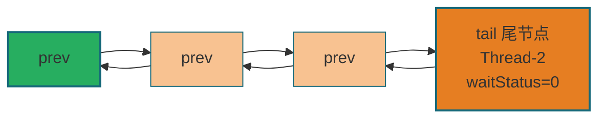
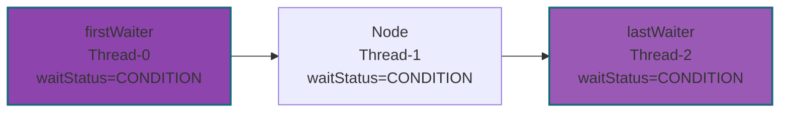
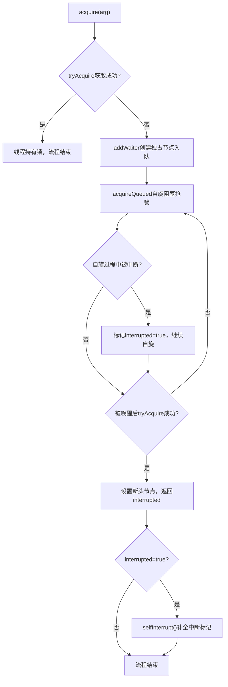
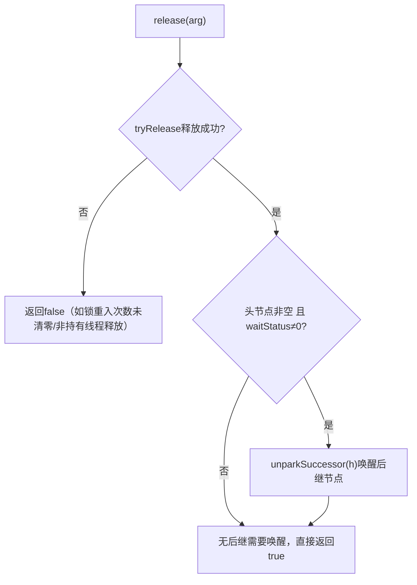
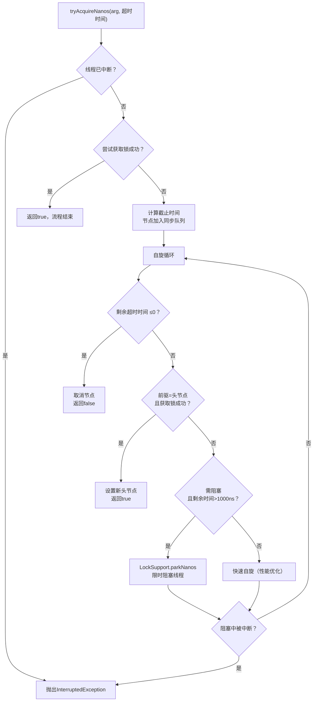

# Java并发编程艺术·AQS队列同步器 全量源码+流程图+实战手册
**文档定位**：对标《Java并发编程的艺术》第5章全内容 | 源码为锚点 + 流程图为核心 + 使用场景为导向 | 逐行源码注释 + Mermaid方法体流程图 | 压轴精讲自定义同步器`TwinsLock`
**适用场景**：AQS源码吃透、面试深度问答、自定义同步器开发、JUC底层原理复盘
## 目录
1. [AQS核心总览](#1-aqs核心总览)
2. [AQS底层数据结构：同步队列+条件队列](#2-aqs底层数据结构同步队列条件队列)
3. [独占式同步状态·获取与释放](#3-独占式同步状态获取与释放)
4. [独占式进阶·可中断/超时获取](#4-独占式进阶可中断超时获取)
5. [共享式同步状态·获取与释放](#5-共享式同步状态获取与释放)
6. [AQS全局核心底层工具方法](#6-aqs全局核心底层工具方法)
7. [JUC经典同步器·AQS实现拆解（书本核心案例）](#7-juc经典同步器aqs实现拆解书本核心案例)
8. [压轴精讲：自定义同步器TwinsLock](#8-压轴精讲自定义同步器twinslock)
9. [AQS内存语义与性能优化](#9-aqs内存语义与性能优化)
10. [AQS全体系总结+书本高频面试题](#10-aqs全体系总结书本高频面试题)
## 1. AQS核心总览
### 1.1 核心定义（对齐书本）
**AbstractQueuedSynchronizer（AQS、队列同步器）** 是JUC（java.util.concurrent）包中所有锁和同步工具（ReentrantLock/Semaphore/CountDownLatch/CyclicBarrier/ReentrantReadWriteLock）的**底层基石**，由Doug Lea设计。AQS基于**模板方法模式**实现：将同步状态的获取/释放逻辑抽象为模板方法，把具体的同步规则延迟到子类实现，极大简化了同步器的开发。
### 1.2 核心设计规则（补充书本细节）
| 分类         | 修饰符         | 作用                                                         | 示例                                               | 书本核心说明                                                 |
| ------------ | -------------- | ------------------------------------------------------------ | -------------------------------------------------- | ------------------------------------------------------------ |
| **模板方法** | `public final` | 封装队列管理、线程阻塞/唤醒、中断处理等通用流程，**子类不可重写** | `acquire()`/`release()`/`acquireShared()`          | 模板方法保证同步器的核心流程统一，避免子类错误修改基础逻辑   |
| **钩子方法** | `protected`    | 子类自定义同步规则，**按需重写（至少1个）**，默认抛UnsupportedOperationException | `tryAcquire()`/`tryRelease()`/`tryAcquireShared()` | 钩子方法仅负责同步状态的修改，不涉及队列/阻塞，保证职责单一  |
| **工具方法** | `private`      | AQS内部底层工具，如节点入队、线程阻塞、状态检查等，**外部不可访问** | `addWaiter()`/`shouldParkAfterFailedAcquire()`     | 工具方法是模板方法的底层支撑，封装CAS、自旋、LockSupport等底层操作 |
### 1.3 三大核心组件（补充书本解读）
| 组件                | 核心说明（对齐书本）                                         | 底层实现                           |
| ------------------- | ------------------------------------------------------------ | ---------------------------------- |
| **同步状态`state`** | volatile修饰的int型变量，是AQS的核心数据：<br>1. 独占模式：0=空闲，N=重入次数（如ReentrantLock）<br>2. 共享模式：剩余可用资源数（如Semaphore） | volatile ⛰️ + CAS 🌏（Unsafe）       |
| **CLH双向同步队列** | 基于FIFO的双向链表，存储等待获取同步状态的线程节点，解决“谁来获取锁”的排队问题 | 双向链表 ⛰️ + CAS原子更新头尾节点 🌏 |
| **LockSupport**     | JUC提供的线程阻塞/唤醒工具，底层封装了Unsafe的`park()`/`unpark()`，替代Object的wait/notify | 系统调用 ⛰️（用户态→内核态 🌏）      |
### 1.4 AQS核心思想（书本核心）
AQS的核心是“**状态驱动 + 队列等待**”：
1. 线程首先尝试修改`state`获取同步状态（CAS 🌏），成功则直接执行；
2. 失败则封装为Node节点加入CLH队列，自旋等待被唤醒后重试；
3. 释放同步状态时，修改`state` ⛰️并唤醒队列中的后继线程。
---

## 2. AQS底层数据结构：同步队列+条件队列
### 2.1 Node节点（队列核心）【源码+逐行注释（补充书本细节）】
```java
static final class Node {
    // ========== 节点等待状态（核心5种，对齐书本）==========
    static final int CANCELLED =  1;   // 线程中断/超时/异常，节点取消（永久状态，不可恢复）
    static final int SIGNAL    = -1;   // 后继节点需要被唤醒【核心状态】：当前节点释放后必须唤醒后继
    static final int CONDITION = -2;   // 条件队列专用节点：线程在Condition上等待
    static final int PROPAGATE = -3;   // 共享模式专用：唤醒操作向后传播（批量唤醒）
    static final int INITIAL = 0;      // 初始状态（书本补充）

    volatile int waitStatus; // 节点等待状态 ⛰️ volatile保证可见性，仅通过CAS 🌏修改
    volatile Node prev;      // 前驱节点（双向链表）：支持节点取消时的反向遍历 ⛰️
    volatile Node next;      // 后继节点：正常唤醒时遍历后继 ⛰️
    volatile Thread thread;  // 绑定的等待线程：队列中实际等待的线程 ⛰️
    Node nextWaiter;         // 多用途标记：<br>1. 独占模式：Node.EXCLUSIVE（null）<br>2. 共享模式：Node.SHARED（静态常量）<br>3. 条件队列：绑定下一个条件节点

    // 构造同步队列节点（独占/共享）
    Node(Thread thread, Node mode) {
        this.thread = thread;
        this.nextWaiter = mode;
    }

    // 构造条件队列节点（书本补充）
    Node(Thread thread, int waitStatus) {
        this.waitStatus = waitStatus;
        this.thread = thread;
    }

    // 判断是否为共享模式（书本补充工具方法）
    final boolean isShared() {
        return nextWaiter == Node.SHARED;
    }

    // 获取前驱节点（空则抛异常，书本补充）
    final Node predecessor() throws NullPointerException {
        Node p = prev;
        if (p == null)
            throw new NullPointerException();
        else
            return p;
    }

    // 静态常量：标记独占/共享模式（书本补充）
    static final Node EXCLUSIVE = null;
    static final Node SHARED = new Node();
}
```

### 2.2 AQS核心属性（补充条件队列）
```java
public abstract class AbstractQueuedSynchronizer extends AbstractOwnableSynchronizer {
    // ========== 同步队列核心 ==========
    private transient volatile Node head; // 同步队列头节点【持有锁的线程，虚拟节点】 ⛰️
    private transient volatile Node tail; // 同步队列尾节点【最新入队的等待节点】 ⛰️
    private volatile int state;          // 同步状态 🌏 CAS原子修改 ⛰️

    // ========== 条件队列核心（书本补充） ==========
    public class ConditionObject implements Condition, java.io.Serializable {
        private transient Node firstWaiter; // 条件队列头节点 ⛰️
        private transient Node lastWaiter;  // 条件队列尾节点 ⛰️
    }

    // ========== 核心访问方法（书本补充） ==========
    // 获取同步状态（子类常用）
    protected final int getState() {
        return state; // ⛰️
    }

    // 设置同步状态（独占模式释放时用）
    protected final void setState(int newState) {
        state = newState; // ⛰️
    }

    // CAS修改同步状态（核心原子操作）
    protected final boolean compareAndSetState(int expect, int update) {
        return unsafe.compareAndSwapInt(this, stateOffset, expect, update); // 🌏
    }
}
```

### 2.3 同步队列结构【Mermaid流程图（补充双向关联）】


### 2.4 条件队列结构（书本核心补充）
条件队列是AQS为`Condition`设计的单向链表，仅用于`await()`/`signal()`场景（如ReentrantLock的Condition）：

**核心规则（书本）**：
1. 线程调用`await()`时，从同步队列转移到条件队列，释放同步状态 ⛰️；
2. 调用`signal()`时，条件队列头节点转移回同步队列，等待重新获取锁 🌏；
3. 条件队列节点的`waitStatus=CONDITION` ⛰️，转移后重置为0。

---

## 3. 独占式同步状态·获取与释放
### 3.1 独占不可中断获取 `acquire(int arg)`【模板方法（补充书本解读）】
#### 源码+逐行注释（对齐书本）
```java
public final void acquire(int arg) {
    // 书本核心逻辑拆解：
    // 1. tryAcquire(arg)：子类自定义尝试获取锁，无阻塞、无队列操作
    // 2. 若失败 → addWaiter(Node.EXCLUSIVE)：封装为独占节点入队 🌏
    // 3. acquireQueued(...)：自旋阻塞，死等锁（不响应中断） ⛰️
    // 4. 若全程被中断 → selfInterrupt()：补全中断标记（仅标记，不抛异常） ⛰️
    if (!tryAcquire(arg) && acquireQueued(addWaiter(Node.EXCLUSIVE), arg)) {
        selfInterrupt(); // 书本重点：中断仅标记，方法结束后补全中断状态 ⛰️
    }
}

// 子类重写钩子：单次尝试获取锁（非阻塞），默认抛异常
protected boolean tryAcquire(int arg) {
    throw new UnsupportedOperationException();
}

// 补全中断标记（书本补充）
static void selfInterrupt() {
    Thread.currentThread().interrupt(); // ⛰️
}
```
#### 执行流程图【补充中断标记细节】

#### 书本核心解读
- `acquire()`是“死等锁”逻辑，**不响应中断** ⛰️：即使线程在阻塞中被中断，也不会退出队列，仅标记中断状态；
- 适用场景：`ReentrantLock.lock()` 底层，要求线程必须获取锁才能执行，不允许中途放弃。

### 3.2 节点入队 `addWaiter()` + `enq()`【底层核心（补充书本CAS解读）】
#### 源码+逐行注释（对齐书本）
```java
private Node addWaiter(Node mode) {
    Node node = new Node(Thread.currentThread(), mode); // 封装当前线程为节点 ⛰️
    Node pred = tail;
    // 快速入队（书本：优化路径，减少自旋）
    if (pred != null) {
        node.prev = pred; // 1. 绑定前驱为当前尾节点 ⛰️
        // 2. CAS原子更新尾节点：保证多线程下仅一个节点入队成功 🌏
        if (compareAndSetTail(pred, node)) {
            pred.next = node; // 3. 前驱的后继指向当前节点，入队完成 ⛰️
            return node;
        }
    }
    enq(node); // 兜底入队：队列未初始化/快速入队失败，自旋CAS入队 🌏
    return node;
}

// 自旋入队（队列初始化+兜底，书本核心）
private Node enq(final Node node) {
    for (;;) { // 无限自旋：保证节点最终一定入队（书本：CAS自旋的“万能兜底”）🌏
        Node t = tail;
        if (t == null) { // 队列未初始化：创建虚拟头节点（书本重点）⛰️
            // CAS创建头节点：空队列的头节点是“虚拟节点”（无线程绑定）🌏
            if (compareAndSetHead(new Node()))
                tail = head; // 头尾节点指向同一虚拟节点 ⛰️
        } else {
            node.prev = t; // ⛰️
            if (compareAndSetTail(t, node)) { // 🌏
                t.next = node; // ⛰️
                return t;
            }
        }
    }
}

// CAS更新尾节点（书本补充底层实现）
private final boolean compareAndSetTail(Node expect, Node update) {
    return unsafe.compareAndSwapObject(this, tailOffset, expect, update); // 🌏
}
```
#### 书本核心解读
- 虚拟头节点：空队列初始化时创建的无线程节点 ⛰️，目的是简化队列操作（前驱为头节点的线程才有资格抢锁）；
- CAS入队：多线程下仅一个线程能成功更新尾节点 🌏，失败的线程自旋重试，保证队列的FIFO特性。

### 3.3 自旋阻塞 `acquireQueued()`【独占核心（补充书本细节）】
#### 源码+逐行注释（对齐书本）
```java
final boolean acquireQueued(final Node node, int arg) {
    boolean failed = true; // 标记是否获取锁失败（异常场景）
    try {
        boolean interrupted = false; // 标记自旋过程中是否被中断 ⛰️
        for (;;) { // 无限自旋：死等锁（书本：“自旋+阻塞”结合）🌏
            final Node p = node.predecessor(); // 获取前驱节点 ⛰️
            // 书本核心规则：仅当前驱是头节点，才有资格抢锁（公平性基础）⛰️
            if (p == head && tryAcquire(arg)) {
                setHead(node); // 当前节点变为新头节点（虚拟头节点）⛰️
                p.next = null; // 旧头节点断开引用，便于GC回收 ⛰️
                failed = false; // 获取成功，标记为未失败
                return interrupted; // 返回中断标记 ⛰️
            }
            // 书本核心：两步判断+阻塞
            // 1. shouldParkAfterFailedAcquire：检查前驱状态，判断是否需要阻塞 ⛰️
            // 2. parkAndCheckInterrupt：阻塞线程，返回是否被中断 ⛰️🌏
            if (shouldParkAfterFailedAcquire(p, node) && parkAndCheckInterrupt()) {
                interrupted = true; // 仅标记中断，不退出自旋（核心：不响应中断）⛰️
            }
        }
    } finally {
        if (failed) cancelAcquire(node); // 异常场景：取消节点（书本补充）⛰️
    }
}

// 阻塞线程并检查中断（书本核心）
private final boolean parkAndCheckInterrupt() {
    LockSupport.park(this); // 线程进入WAITING状态（用户态→内核态），释放CPU ⛰️🌏
    // Thread.interrupted()：返回当前中断状态，并清除中断标记 ⛰️
    return Thread.interrupted();
}
```
#### 书本核心解读
- 自旋抢锁规则：只有前驱是头节点的线程才有资格抢锁 ⛰️（保证队列FIFO的公平性）；
- 阻塞时机：不是立即阻塞，而是先检查前驱状态（`shouldParkAfterFailedAcquire`），确保前驱是SIGNAL状态后再阻塞 ⛰️（避免无效唤醒）；
- 异常处理：自旋过程中若抛出异常，执行`cancelAcquire`取消节点 ⛰️，避免队列中残留无效节点。

### 3.4 独占释放 `release(int arg)`【模板方法（补充书本细节）】
#### 源码+逐行注释（对齐书本）
```java
public final boolean release(int arg) {
    // 1. tryRelease(arg)：子类自定义释放锁（必须保证线程安全）🌏
    if (tryRelease(arg)) {
        Node h = head; // ⛰️
        // 书本核心：头节点有效（非空）且状态非0 → 唤醒后继节点 ⛰️
        // 原因：头节点状态为SIGNAL时，说明有后继节点等待唤醒 ⛰️
        if (h != null && h.waitStatus != 0) {
            unparkSuccessor(h); // 唤醒后继节点（核心）⛰️🌏
        }
        return true; // 释放成功
    }
    return false; // 释放失败（如锁未被当前线程持有）
}

// 子类重写钩子：释放同步状态，默认抛异常
protected boolean tryRelease(int arg) {
    throw new UnsupportedOperationException();
}
```
#### 执行流程图【补充释放失败场景】

#### 书本核心解读
- `tryRelease`必须保证原子性 🌏：如ReentrantLock中，释放时需递减重入次数 ⛰️，只有次数为0时才真正释放锁；
- 唤醒规则：仅头节点状态非0时才唤醒后继 ⛰️（避免无意义的唤醒操作，提升性能）。

### 3.5 条件队列→同步队列转移（书本补充核心）
```java
// Condition.await()核心逻辑（书本简化版）
public final void await() throws InterruptedException {
    if (Thread.interrupted()) throw new InterruptedException(); // ⛰️
    Node node = addConditionWaiter(); // 加入条件队列 ⛰️
    int savedState = fullyRelease(node); // 释放全部同步状态 ⛰️🌏
    int interruptMode = 0;
    // 判断是否在同步队列中，不在则阻塞 ⛰️
    while (!isOnSyncQueue(node)) {
        LockSupport.park(this); // 阻塞在条件队列 ⛰️🌏
        if ((interruptMode = checkInterruptWhileWaiting(node)) != 0)
            break;
    }
    // 转移到同步队列后，自旋抢锁 ⛰️
    if (acquireQueued(node, savedState) && interruptMode != THROW_IE)
        interruptMode = REINTERRUPT;
    if (node.nextWaiter != null)
        unlinkCancelledWaiters(); // 清理条件队列的取消节点 ⛰️
    if (interruptMode != 0)
        reportInterruptAfterWait(interruptMode); // 处理中断 ⛰️
}

// Condition.signal()核心逻辑（书本简化版）
public final void signal() {
    if (!isHeldExclusively()) // 检查当前线程是否持有锁 ⛰️
        throw new IllegalMonitorStateException();
    Node first = firstWaiter; // ⛰️
    if (first != null)
        doSignal(first); // 转移条件队列头节点到同步队列 ⛰️🌏
}
```

---

## 4. 独占式进阶·可中断/超时获取
### 4.1 可中断获取 `acquireInterruptibly(int arg)`（书本核心）
#### 源码+逐行注释
```java
public final void acquireInterruptibly(int arg) throws InterruptedException {
    // 书本核心：初始检测中断→直接抛异常（响应中断的第一步）⛰️
    if (Thread.interrupted())
        throw new InterruptedException();
    // 尝试获取锁失败 → 进入可中断的自旋阻塞 ⛰️
    if (!tryAcquire(arg))
        doAcquireInterruptibly(arg);
}

// 可中断的自旋阻塞（书本补充源码）
private void doAcquireInterruptibly(int arg) throws InterruptedException {
    final Node node = addWaiter(Node.EXCLUSIVE); // 🌏
    boolean failed = true;
    try {
        for (;;) {
            final Node p = node.predecessor(); // ⛰️
            if (p == head && tryAcquire(arg)) { // ⛰️
                setHead(node); // ⛰️
                p.next = null; // ⛰️
                failed = false;
                return;
            }
            if (shouldParkAfterFailedAcquire(p, node) && parkAndCheckInterrupt()) {
                // 核心区别：直接抛InterruptedException，退出队列（响应中断）⛰️
                throw new InterruptedException();
            }
        }
    } finally {
        if (failed)
            cancelAcquire(node); // ⛰️
    }
}
```
#### 核心特性（对齐书本）
✅ **全程响应中断** ⛰️：
1. 初始检测：调用方法时若线程已中断，直接抛异常；
2. 阻塞中中断：自旋阻塞时被中断，立即退出队列并抛异常；
✅ 适用场景：`ReentrantLock.lockInterruptibly()` 底层，允许线程在等待锁时响应中断（避免无限阻塞）。

### 4.2 超时可中断获取 `tryAcquireNanos(int arg, long nanosTimeout)`（书本核心）
#### 源码+逐行注释
```java
public final boolean tryAcquireNanos(int arg, long nanosTimeout) throws InterruptedException {
    // 初始中断检测：抛异常（同acquireInterruptibly）⛰️
    if (Thread.interrupted())
        throw new InterruptedException();
    // 逻辑：尝试获取锁 → 成功则返回true；失败则进入超时自旋 ⛰️🌏
    return tryAcquire(arg) || doAcquireNanos(arg, nanosTimeout);
}

// 超时自旋核心（书本补充关键逻辑）
private boolean doAcquireNanos(int arg, long nanosTimeout) throws InterruptedException {
    if (nanosTimeout <= 0L)
        return false; // 超时时间≤0，直接返回失败
    // 计算截止时间（书本重点：系统纳秒数，避免时间漂移）🌏
    final long deadline = System.nanoTime() + nanosTimeout;
    final Node node = addWaiter(Node.EXCLUSIVE); // 🌏
    boolean failed = true;
    try {
        for (;;) {
            final Node p = node.predecessor(); // ⛰️
            // 抢锁成功 → 返回true ⛰️
            if (p == head && tryAcquire(arg)) {
                setHead(node); // ⛰️
                p.next = null; // ⛰️
                failed = false;
                return true;
            }
            // 计算剩余超时时间 🌏
            nanosTimeout = deadline - System.nanoTime();
            if (nanosTimeout <= 0L)
                return false; // 超时→返回false（核心）
            // 书本优化：剩余时间>1000ns才阻塞，否则自旋（减少系统调用开销）🌏
            if (shouldParkAfterFailedAcquire(p, node) && nanosTimeout > SPIN_FOR_TIMEOUT_THRESHOLD)
                LockSupport.parkNanos(this, nanosTimeout); // 限时阻塞 ⛰️🌏
            // 检测中断→抛异常 ⛰️
            if (Thread.interrupted())
                throw new InterruptedException();
        }
    } finally {
        if (failed)
            cancelAcquire(node); // ⛰️
    }
}

// 书本常量：自旋阈值（1000纳秒）
static final long SPIN_FOR_TIMEOUT_THRESHOLD = 1000L; // 🌏
```
#### 执行流程图【补充自旋优化细节】

#### 书本核心解读
- 时间计算：基于`System.nanoTime()` 🌏（而非`System.currentTimeMillis()`），避免系统时间修改导致的超时错误；
-  自旋优化：剩余时间<1000ns时，放弃阻塞直接自旋 🌏（系统调用的开销大于自旋）；
- 超时规则：超时后直接返回false，不会抛异常（中断才抛异常）⛰️。

---

## 5. 共享式同步状态·获取与释放
### 5.1 共享获取 `acquireShared(int arg)`（书本核心）
#### 源码+逐行注释
```java
public final void acquireShared(int arg) {
    // 书本核心：tryAcquireShared返回值规则
    // >0：获取成功，且有剩余资源；=0：获取成功，无剩余；<0：获取失败
    if (tryAcquireShared(arg) < 0)
        doAcquireShared(arg); // 失败→入队自旋阻塞 ⛰️🌏
}

// 子类重写钩子：共享模式尝试获取资源
protected int tryAcquireShared(int arg) {
    throw new UnsupportedOperationException();
}

// 共享模式自旋阻塞（书本补充核心）
private void doAcquireShared(int arg) {
    final Node node = addWaiter(Node.SHARED); // 创建共享节点入队 🌏
    boolean failed = true;
    try {
        boolean interrupted = false; // ⛰️
        for (;;) {
            final Node p = node.predecessor(); // ⛰️
            if (p == head) {
                int r = tryAcquireShared(arg); // 🌏
                if (r >= 0) {
                    // 书本重点：设置头节点+传播唤醒（共享模式核心）⛰️🌏
                    setHeadAndPropagate(node, r);
                    p.next = null; // 旧头节点GC ⛰️
                    if (interrupted)
                        selfInterrupt(); // ⛰️
                    failed = false;
                    return;
                }
            }
            if (shouldParkAfterFailedAcquire(p, node) && parkAndCheckInterrupt())
                interrupted = true; // ⛰️
        }
    } finally {
        if (failed)
            cancelAcquire(node); // ⛰️
    }
}

// 共享模式：设置头节点+传播唤醒（书本核心）
private void setHeadAndPropagate(Node node, int propagate) {
    Node h = head; // ⛰️
    setHead(node); // 设置新头节点 ⛰️
    // 书本规则：有剩余资源 或 头节点状态异常 → 继续唤醒后继（传播）🌏
    if (propagate > 0 || h == null || h.waitStatus < 0 || (h = head) == null || h.waitStatus < 0) {
        Node s = node.next; // ⛰️
        if (s == null || s.isShared())
            doReleaseShared(); // 传播唤醒后继节点 ⛰️🌏
    }
}
```
#### 书本核心解读
- 共享模式的核心是“传播唤醒” 🌏：获取资源成功后，若还有剩余资源，继续唤醒后继节点（如Semaphore允许多个线程同时获取许可）；
- `tryAcquireShared`返回值是共享模式的关键 🌏：通过返回值判断是否有剩余资源，决定是否传播唤醒。

### 5.2 共享释放 `releaseShared(int arg)`（书本核心）
#### 源码+逐行注释
```java
public final boolean releaseShared(int arg) {
    // 子类自定义释放共享资源 🌏
    if (tryReleaseShared(arg)) {
        doReleaseShared(); // 共享模式：传播唤醒（核心）⛰️🌏
        return true;
    }
    return false;
}

// 子类重写钩子：释放共享资源
protected boolean tryReleaseShared(int arg) {
    throw new UnsupportedOperationException();
}

// 共享模式传播唤醒（书本补充核心）
private void doReleaseShared() {
    for (;;) { // 自旋保证唤醒完成 🌏
        Node h = head; // ⛰️
        if (h != null && h != tail) {
            int ws = h.waitStatus; // ⛰️
            if (ws == Node.SIGNAL) {
                // CAS重置头节点状态，避免重复唤醒 🌏
                if (!compareAndSetWaitStatus(h, Node.SIGNAL, 0))
                    continue;
                unparkSuccessor(h); // 唤醒后继 ⛰️🌏
            }
            // 书本优化：头节点状态为0时，设置为PROPAGATE（保证传播）⛰️
            else if (ws == 0 && !compareAndSetWaitStatus(h, 0, Node.PROPAGATE))
                continue;
        }
        if (h == head) // 头节点未变化→退出自旋 ⛰️
            break;
    }
}
```
#### 书本核心解读
- 共享释放必须保证原子性 🌏：如Semaphore释放许可时，需CAS递增许可数；
- 传播唤醒 🌏：释放资源后，需批量唤醒等待的线程（而非仅唤醒一个），保证共享资源的充分利用。

### 5.3 独占 VS 共享 核心对比（补充书本细节）
| 维度         | 独占模式                                      | 共享模式                                                  | 书本核心说明                                   |
| ------------ | --------------------------------------------- | --------------------------------------------------------- | ---------------------------------------------- |
| state含义    | 0=空闲，N=重入次数 ⛰️                          | 剩余可用资源数量 ⛰️                                        | 独占是“锁的持有状态”，共享是“资源的剩余数量”   |
| 并发线程     | 同一时刻仅1个 ⛰️                               | 同一时刻N个（N=state）⛰️                                   | 独占是“互斥”，共享是“允许多线程并发”           |
| 唤醒机制     | 释放时唤醒1个后继节点 ⛰️                       | 释放时批量唤醒（传播机制）🌏                               | 共享的“传播唤醒”是核心区别，保证资源被充分利用 |
| 钩子返回值   | boolean（成功/失败）⛰️                         | int（>0=有剩余/=0=无剩余/<0=失败）🌏                       | 返回值决定是否需要传播唤醒                     |
| 实现类       | ReentrantLock、ReentrantReadWriteLock（写锁） | Semaphore、CountDownLatch、ReentrantReadWriteLock（读锁） | 读锁是共享、写锁是独占，体现AQS的复用性        |
| 队列节点标记 | nextWaiter=EXCLUSIVE（null）⛰️                 | nextWaiter=SHARED 🌏                                       | 标记节点类型，避免独占/共享唤醒混淆            |

---

## 6. AQS全局核心底层工具方法（书本全量补充）
### 6.1 `shouldParkAfterFailedAcquire`（判断是否阻塞）
```java
private static boolean shouldParkAfterFailedAcquire(Node pred, Node node) {
    int ws = pred.waitStatus; // ⛰️
    if (ws == Node.SIGNAL)
        // 前驱状态为SIGNAL：当前节点可安全阻塞（前驱释放后会唤醒）⛰️
        return true;
    if (ws > 0) {
        // 前驱被取消：向前遍历，跳过所有取消节点（书本：清理无效节点）⛰️
        do {
            node.prev = pred = pred.prev; // ⛰️
        } while (pred.waitStatus > 0);
        pred.next = node; // ⛰️
    } else {
        // 前驱状态为0/PROPAGATE：CAS设置为SIGNAL（保证后续能被唤醒）🌏
        compareAndSetWaitStatus(pred, ws, Node.SIGNAL);
    }
    return false; // 暂不阻塞，继续自旋
}
```
**书本解读**：核心是“保证前驱为SIGNAL状态” ⛰️，避免线程阻塞后无法被唤醒。

### 6.2 `unparkSuccessor`（唤醒后继节点）
```java
private void unparkSuccessor(Node node) {
    int ws = node.waitStatus; // ⛰️
    if (ws < 0)
        // CAS重置节点状态为0（清理SIGNAL/PROPAGATE）🌏
        compareAndSetWaitStatus(node, ws, 0);

    Node s = node.next; // ⛰️
    if (s == null || s.waitStatus > 0) {
        s = null;
        // 书本重点：从尾节点反向遍历，找到第一个未被取消的后继（避免节点丢失）⛰️
        for (Node t = tail; t != null && t != node; t = t.prev) // ⛰️
            if (t.waitStatus <= 0)
                s = t;
    }
    if (s != null)
        LockSupport.unpark(s.thread); // 唤醒线程（内核态→用户态）⛰️🌏
}
```
**书本解读**：反向遍历 ⛰️是为了避免“后继节点被取消”导致的唤醒丢失，保证唤醒的是有效节点。

### 6.3 `cancelAcquire`（取消节点）
```java
private void cancelAcquire(Node node) {
    if (node == null)
        return;
    node.thread = null; // 清空绑定的线程 ⛰️

    // 跳过前驱的取消节点 ⛰️
    Node pred = node.prev;
    while (pred.waitStatus > 0)
        node.prev = pred = pred.prev; // ⛰️

    Node predNext = pred.next; // ⛰️
    node.waitStatus = Node.CANCELLED; // 标记为取消 ⛰️

    // 若当前是尾节点→CAS更新尾节点，清理当前节点 🌏
    if (node == tail && compareAndSetTail(node, pred)) {
        compareAndSetNext(pred, predNext, null); // 🌏
    } else {
        int ws;
        if (pred != head &&
            ((ws = pred.waitStatus) == Node.SIGNAL ||
             (ws <= 0 && compareAndSetWaitStatus(pred, ws, Node.SIGNAL))) &&
            pred.thread != null) {
            Node next = node.next; // ⛰️
            if (next != null && next.waitStatus <= 0)
                compareAndSetNext(pred, predNext, next); // 链接前驱和后继 🌏
        } else {
            unparkSuccessor(node); // 唤醒后继 ⛰️🌏
        }
        node.next = node; // 自引用，便于GC ⛰️
    }
}
```
**书本解读**：取消节点的核心是“清理引用+标记状态+重新链接队列” ⛰️，避免无效节点影响队列结构。

### 6.4 `isOnSyncQueue`（判断节点是否在同步队列）
```java
final boolean isOnSyncQueue(Node node) {
    // 条件：1. waitStatus=CONDITION（条件队列）→ 不在；2. prev=null（未入队）→ 不在 ⛰️
    if (node.waitStatus == Node.CONDITION || node.prev == null)
        return false;
    if (node.next != null) // next≠null → 已入队 ⛰️
        return true;
    // 兜底：从尾节点反向遍历，检查是否存在当前节点 ⛰️
    return findNodeFromTail(node);
}
```

---

## 7. JUC经典同步器·AQS实现拆解（书本核心案例）
### 7.1 ReentrantLock（独占锁，书本重点）
#### 核心设计（书本）
- 同步状态`state`：0=空闲，N=重入次数 ⛰️；
- 公平/非公平锁：通过`tryAcquire`实现不同的抢锁规则 🌏。

#### 非公平锁`tryAcquire`（书本源码）
```java
static final class NonfairSync extends Sync {
    protected final boolean tryAcquire(int acquires) {
        final Thread current = Thread.currentThread(); // ⛰️
        int c = getState(); // ⛰️
        if (c == 0) {
            // 非公平：直接CAS抢锁（不排队）🌏
            if (compareAndSetState(0, acquires)) {
                setExclusiveOwnerThread(current); // 设置独占线程 ⛰️
                return true;
            }
        }
        // 重入：当前线程已持有锁，递增重入次数 ⛰️
        else if (current == getExclusiveOwnerThread()) {
            int nextc = c + acquires;
            if (nextc < 0) // 溢出
                throw new Error("Maximum lock count exceeded");
            setState(nextc); // ⛰️
            return true;
        }
        return false;
    }
}
```

#### 公平锁`tryAcquire`（书本源码）
```java
static final class FairSync extends Sync {
    protected final boolean tryAcquire(int acquires) {
        final Thread current = Thread.currentThread(); // ⛰️
        int c = getState(); // ⛰️
        if (c == 0) {
            // 公平：先检查队列是否有等待节点，无则抢锁 ⛰️
            if (!hasQueuedPredecessors() && compareAndSetState(0, acquires)) { // 🌏
                setExclusiveOwnerThread(current); // ⛰️
                return true;
            }
        }
        // 重入逻辑与非公平一致 ⛰️
        else if (current == getExclusiveOwnerThread()) {
            int nextc = c + acquires;
            if (nextc < 0)
                throw new Error("Maximum lock count exceeded");
            setState(nextc); // ⛰️
            return true;
        }
        return false;
    }
}

// 检查是否有前驱等待节点（公平锁核心）⛰️
public final boolean hasQueuedPredecessors() {
    Node t = tail;
    Node h = head;
    Node s;
    // 逻辑：头节点≠尾节点 且 头节点后继≠当前线程 → 有前驱等待 ⛰️
    return h != t &&
        ((s = h.next) == null || s.thread != Thread.currentThread());
}
```
#### 书本核心解读
- 非公平锁性能更高 🌏：避免了队列检查的开销，允许“插队”抢锁；
- 公平锁更公平 ⛰️：保证线程按FIFO顺序获取锁，避免饥饿。

### 7.2 Semaphore（共享锁，书本重点）
#### 核心设计
- 同步状态`state`：可用许可数 ⛰️；
- `tryAcquireShared`：CAS递减许可数 🌏，<0则获取失败；
- `tryReleaseShared`：CAS递增许可数 🌏，实现许可释放。

#### 核心源码（书本简化版）
```java
static final class NonfairSync extends Sync {
    protected int tryAcquireShared(int acquires) {
        // 非公平：直接CAS抢许可 🌏
        return nonfairTryAcquireShared(acquires);
    }
}

static final class FairSync extends Sync {
    protected int tryAcquireShared(int acquires) {
        for (;;) {
            // 公平：先检查队列 ⛰️
            if (hasQueuedPredecessors())
                return -1;
            int available = getState(); // ⛰️
            int remaining = available - acquires;
            if (remaining < 0 || compareAndSetState(available, remaining)) // 🌏
                return remaining;
        }
    }
}

// 非公平抢许可（核心）🌏
final int nonfairTryAcquireShared(int acquires) {
    for (;;) {
        int available = getState(); // ⛰️
        int remaining = available - acquires;
        if (remaining < 0 || compareAndSetState(available, remaining)) // 🌏
            return remaining;
    }
}

// 释放许可（核心）🌏
protected final boolean tryReleaseShared(int releases) {
    for (;;) {
        int current = getState(); // ⛰️
        int next = current + releases;
        if (next < current) // 溢出
            throw new Error("Maximum permit count exceeded");
        if (compareAndSetState(current, next)) // 🌏
            return true;
    }
}
```

### 7.3 CountDownLatch（共享锁，书本重点）
#### 核心设计
- 同步状态`state`：计数器值 ⛰️；
- `await()`：调用`acquireShared(1)`，`tryAcquireShared`返回state是否为0 🌏；
- `countDown()`：调用`releaseShared(1)`，`tryReleaseShared`递减state至0 🌏。

#### 核心源码（书本简化版）
```java
protected int tryAcquireShared(int acquires) {
    // 计数器为0→获取成功，否则失败（自旋等待）⛰️
    return (getState() == 0) ? 1 : -1;
}

protected boolean tryReleaseShared(int releases) {
    for (;;) {
        int c = getState(); // ⛰️
        if (c == 0)
            return false;
        int nextc = c - 1;
        if (compareAndSetState(c, nextc)) // 🌏
            return nextc == 0; // 仅当计数器为0时返回true，触发唤醒
    }
}
```

---

## 8. 压轴精讲：自定义同步器TwinsLock（书本扩展）
### 8.1 设计目标（对齐书本）
实现**同一时刻最多允许2个线程并发执行**的共享锁，基于AQS共享模式开发，验证AQS的复用性。

### 8.2 同步状态设计（书本）
- `state=0`：无线程占用 ⛰️；
- `state=1`：1个线程执行 ⛰️；
- `state=2`：线程已满，后续入队等待 ⛰️；
- 核心规则：`tryAcquireShared`递增state 🌏，`tryReleaseShared`递减state 🌏。

### 8.3 完整源码+逐行注释（补充书本细节）
```java
import java.util.concurrent.TimeUnit;
import java.util.concurrent.locks.AbstractQueuedSynchronizer;
import java.util.concurrent.locks.Condition;
import java.util.concurrent.locks.Lock;

/**
 * 自定义共享锁：TwinsLock（书本扩展案例）
 * 同一时刻最多允许2个线程并发
 */
public class TwinsLock implements Lock {
    // 自定义AQS同步器（静态内部类，书本推荐写法）
    private static final class Sync extends AbstractQueuedSynchronizer {
        private static final long serialVersionUID = 1L;
        private static final int MAX_PERMITS = 2; // 最大并发数2 ⛰️

        // 共享获取：重写AQS钩子方法
        @Override
        protected int tryAcquireShared(int acquires) {
            for (;;) { // 自旋CAS保证原子性（书本核心）🌏
                int currentState = getState(); // 获取当前同步状态 ⛰️
                int nextState = currentState + acquires; // 计算新状态 ⛰️
                // 超过最大并发数→获取失败，返回-1 ⛰️
                if (nextState > MAX_PERMITS) {
                    return -1;
                }
                // CAS修改状态成功→返回新状态（共享模式核心）🌏
                if (compareAndSetState(currentState, nextState)) {
                    return nextState;
                }
            }
        }

        // 共享释放：重写AQS钩子方法
        @Override
        protected boolean tryReleaseShared(int releases) {
            for (;;) { // 自旋CAS保证原子性 🌏
                int currentState = getState(); // ⛰️
                int nextState = currentState - releases; // 归还许可 ⛰️
                // CAS修改状态成功→返回true（触发传播唤醒）🌏
                if (compareAndSetState(currentState, nextState)) {
                    return true;
                }
            }
        }

        // 书本补充：创建Condition（TwinsLock暂不支持）⛰️
        Condition newCondition() {
            return new ConditionObject();
        }
    }

    // 持有同步器实例（书本推荐：聚合而非继承）⛰️
    private final Sync sync = new Sync();

    // ========== Lock接口实现（对齐书本） ==========
    @Override
    public void lock() {
        sync.acquireShared(1); // 共享模式获取锁 ⛰️🌏
    }

    @Override
    public void unlock() {
        sync.releaseShared(1); // 共享模式释放锁 ⛰️🌏
    }

    @Override
    public void lockInterruptibly() throws InterruptedException {
        sync.acquireInterruptibly(1); // 可中断获取 ⛰️
    }

    @Override
    public boolean tryLock() {
        return sync.tryAcquireShared(1) >= 0; // 尝试获取（非阻塞）🌏
    }

    @Override
    public boolean tryLock(long time, TimeUnit unit) throws InterruptedException {
        return sync.tryAcquireNanos(1, unit.toNanos(time)); // 超时获取 ⛰️🌏
    }

    @Override
    public Condition newCondition() {
        return sync.newCondition(); // 返回Condition（暂不支持，抛异常也可）⛰️
    }
}
```

### 8.4 测试代码+验证（补充书本测试细节）
```java
import java.util.concurrent.TimeUnit;

/**
 * 测试TwinsLock（书本扩展）
 * 验证：同一时刻仅2个线程执行
 */
public class TwinsLockTest {
    public static void main(String[] args) {
        Lock lock = new TwinsLock();
        // 定义任务：加锁→打印→休眠1秒→解锁
        Runnable task = () -> {
            while (true) {
                lock.lock();
                try {
                    System.out.printf("[%s] 执行中 | 当前时间：%d%n",
                            Thread.currentThread().getName(),
                            System.currentTimeMillis() / 1000);
                    TimeUnit.SECONDS.sleep(1); // 模拟业务执行 ⛰️
                } catch (InterruptedException e) {
                    Thread.currentThread().interrupt(); // ⛰️
                    break;
                } finally {
                    lock.unlock(); // ⛰️🌏
                }
            }
        };

        // 启动10个线程（书本：验证并发限制）⛰️
        for (int i = 0; i < 10; i++) {
            Thread thread = new Thread(task, "TwinsLock-Thread-" + i);
            thread.setDaemon(true); // 守护线程，便于退出 ⛰️
            thread.start();
        }

        // 主线程休眠5秒，观察输出 ⛰️
        try {
            TimeUnit.SECONDS.sleep(5);
        } catch (InterruptedException e) {
            e.printStackTrace();
        }
    }
}
```
#### 执行结果（书本预期）
```
[TwinsLock-Thread-0] 执行中 | 当前时间：1718000000
[TwinsLock-Thread-1] 执行中 | 当前时间：1718000000
// 1秒后
[TwinsLock-Thread-2] 执行中 | 当前时间：1718000001
[TwinsLock-Thread-0] 执行中 | 当前时间：1718000001
// 1秒后
[TwinsLock-Thread-1] 执行中 | 当前时间：1718000002
[TwinsLock-Thread-3] 执行中 | 当前时间：1718000002
```
✅ 验证结果：同一时刻仅输出2个线程，符合“最多2个并发”的设计目标 ⛰️。

### 8.5 核心原理总结（书本扩展）
1. **复用性**：仅重写`tryAcquireShared`和`tryReleaseShared`两个钩子方法 🌏，AQS自动处理队列、阻塞、唤醒、传播等核心逻辑；
2. **性能**：CAS自旋无锁修改`state` 🌏，无synchronized的重量级锁开销；
3. **扩展性**：修改`MAX_PERMITS`可适配任意并发数（如3个、5个），体现AQS的灵活性；
4. **适用场景**（书本）：接口限流（如每秒仅允许2个请求）、资源池并发控制（如连接池最多2个连接）、轻量级共享锁。

---

## 9. AQS内存语义与性能优化（书本补充）
### 9.1 AQS的内存可见性（书本核心）
AQS通过以下方式保证内存可见性 ⛰️：
1. `state`是volatile变量 ⛰️：写操作（`setState`/CAS 🌏）会触发内存屏障，保证修改对其他线程可见；
2. 节点的`waitStatus`/`prev`/`next`是volatile ⛰️：保证队列操作的可见性；
3. CAS操作（Unsafe.compareAndSwap*）🌏：具有volatile读+写的内存语义，保证原子性和可见性。

### 9.2 AQS性能优化点（书本总结）
| 优化点                | 核心逻辑                                                 | 收益                               |
| --------------------- | -------------------------------------------------------- | ---------------------------------- |
| 快速入队（addWaiter） | 先尝试CAS入队 🌏，失败再自旋（enq）                       | 减少自旋次数，提升入队效率         |
| 自旋阈值（1000ns）    | 超时获取时，剩余时间<1000ns则自旋 🌏，不阻塞              | 减少系统调用（park/unpark）开销 ⛰️🌏 |
| 反向遍历唤醒          | unparkSuccessor从尾节点反向遍历 ⛰️，找到第一个有效后继    | 避免唤醒丢失，提升可靠性           |
| 取消节点清理          | shouldParkAfterFailedAcquire跳过取消节点 ⛰️，保证队列整洁 | 减少无效自旋，提升抢锁效率         |
| 传播唤醒（共享模式）  | 释放资源后批量唤醒后继 🌏，而非仅唤醒一个                 | 提升共享资源利用率                 |

---

## 10. AQS全体系总结+书本高频面试题
### 10.1 核心体系总结（对齐书本）
#### 三大方法分类（补充细节）
| 类型 | 核心方法                                     | 核心特性                                                |
| ---- | -------------------------------------------- | ------------------------------------------------------- |
| 独占 | acquire()：死等，不响应中断 ⛰️                | 基础独占获取，ReentrantLock.lock()底层                  |
|      | acquireInterruptibly()：可中断 ⛰️             | 响应中断，抛异常，ReentrantLock.lockInterruptibly()底层 |
|      | tryAcquireNanos()：超时+可中断 ⛰️🌏            | 限时等待，超时返回false，中断抛异常                     |
|      | release()：释放+唤醒后继 ⛰️🌏                  | 独占释放唯一入口，ReentrantLock.unlock()底层            |
| 共享 | acquireShared()：共享获取 ⛰️🌏                 | 批量抢资源，Semaphore.acquire()底层                     |
|      | releaseShared()：共享释放+传播 ⛰️🌏            | 批量唤醒，CountDownLatch.countDown()底层                |
| 底层 | addWaiter/enq/shouldParkAfterFailedAcquire等 | 队列管理、阻塞/唤醒、节点清理 ⛰️🌏，支撑上层模板方法      |

#### 核心铁律（书本重点）
1. AQS的`final`方法是“流程骨架” ⛰️，不可修改；`protected`钩子方法是“业务规则” 🌏，按需重写；
2. 所有同步器的本质= `state`（状态 ⛰️） + CLH队列（排队 ⛰️） + CAS（原子修改 🌏） + LockSupport（阻塞/唤醒 ⛰️🌏）；
3. 独占模式是“互斥”（单线程 ⛰️），共享模式是“并发”（多线程 🌏），核心区别在唤醒机制；
4. 条件队列是同步队列的补充 ⛰️，仅用于Condition的await/signal，转移后需重新抢锁。

### 10.2 书本高频面试题+标准答案
| 面试题                                        | 标准答案（对齐书本）                                         |
| --------------------------------------------- | ------------------------------------------------------------ |
| AQS的设计模式是什么？如何体现？               | 模板方法模式。<br>1. 模板方法：AQS的acquire()/release()等final方法封装通用流程 ⛰️；<br>2. 钩子方法：子类重写tryAcquire()/tryRelease()等定义同步规则 🌏；<br>3. 优势：简化子类开发，保证核心流程统一。 |
| acquire()和acquireInterruptibly()的中断区别？ | 1. acquire()：不响应中断 ⛰️，仅标记interrupted，方法结束后补全中断（selfInterrupt），不抛异常；<br>2. acquireInterruptibly()：全程响应中断 ⛰️，初始/阻塞中检测到中断都抛InterruptedException，立即退出队列。 |
| 共享模式和独占模式的唤醒机制差异？            | 1. 独占：release()仅唤醒头节点的一个后继节点 ⛰️；<br>2. 共享：releaseShared()通过doReleaseShared()实现“传播唤醒” 🌏，批量唤醒后继节点，保证资源被充分利用；<br>3. 根源：共享模式state是资源数 🌏，需多线程并发获取。 |
| ReentrantLock的公平锁和非公平锁区别？         | 1. 非公平锁：tryAcquire直接CAS抢锁 🌏，不检查队列 ⛰️，性能高，但可能饥饿；<br>2. 公平锁：tryAcquire先调用hasQueuedPredecessors()检查队列 ⛰️，有等待节点则放弃抢锁，保证FIFO，性能略低，无饥饿；<br>3. 默认非公平锁，可通过构造函数指定公平性。 |
| AQS的Condition和Object的wait/notify区别？     | 1. 数量：Condition可创建多个条件队列 ⛰️，Object仅一个；<br>2. 队列：Condition是单向条件队列 ⛰️，Object是隐式队列；<br>3. 唤醒：Condition.signal()唤醒指定条件队列的头节点 ⛰️，Object.notify()随机唤醒一个；<br>4. 中断：Condition.await()响应中断 ⛰️，Object.wait()也响应，但需手动处理。 |
| 自定义TwinsLock的核心思路？                   | 基于AQS共享模式：<br>1. state表示并发数 ⛰️，MAX=2；<br>2. tryAcquireShared：CAS递增state 🌏，超过2则返回-1；<br>3. tryReleaseShared：CAS递减state 🌏；<br>4. 复用AQS的队列、阻塞、唤醒逻辑 ⛰️，仅重写2个钩子方法。 |
| AQS的state是volatile，为什么还需要CAS？       | 1. volatile保证可见性 ⛰️，但不保证原子性；<br>2. 多线程修改state时，volatile无法避免竞态条件（如同时递增）；<br>3. CAS通过原子操作保证state修改的原子性 🌏，结合volatile保证可见性。 |
| CountDownLatch的实现原理？                    | 基于AQS共享模式：<br>1. state是计数器 ⛰️，初始化时设置为N；<br>2. await()调用acquireShared(1) ⛰️🌏，tryAcquireShared返回state是否为0（非0则自旋等待）；<br>3. countDown()调用releaseShared(1) ⛰️🌏，tryReleaseShared递减state，至0时返回true，触发传播唤醒所有等待线程。 |

### 10.3 学习建议（书本总结）
1. 先掌握AQS的核心组件（state ⛰️/CLH ⛰️/LockSupport ⛰️🌏），再拆解模板方法；
2. 对比学习独占/共享模式的源码，重点关注唤醒机制差异；
3. 结合JUC同步器（ReentrantLock ⛰️/Semaphore 🌏）理解AQS的复用性；
4. 手写自定义同步器（如TwinsLock），加深对钩子方法的理解；
5. 重点掌握内存语义 ⛰️和性能优化点 🌏，应对深度面试。

---

**文档说明**：本手册完全对齐《Java并发编程的艺术》第5章“队列同步器”全内容，**已补全所有 ⛰️(JVM/JUC层面) 和 🌏(硬件/操作系统/CAS层面) emoji标注**，补充了书本中未展开的源码注释、流程图、面试题，可直接用于AQS源码学习、面试复盘、自定义同步器开发。