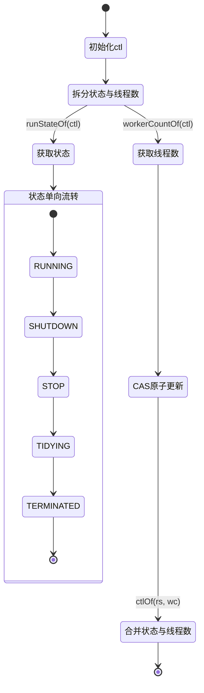
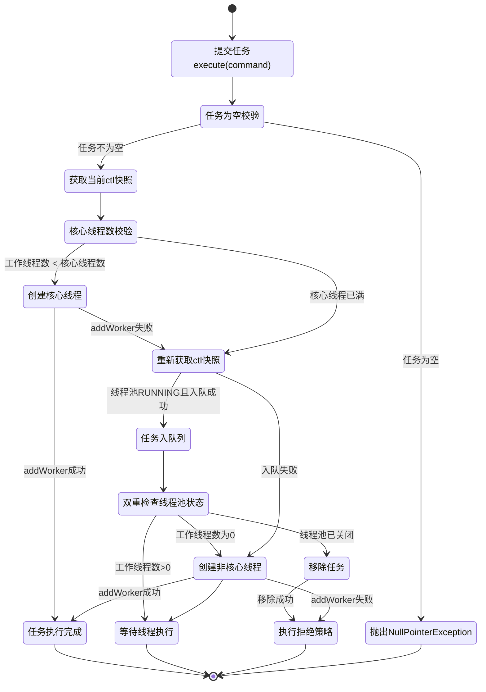
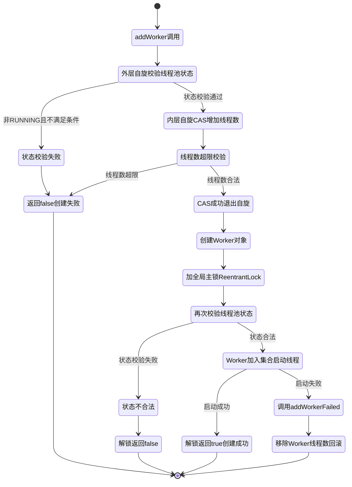

# 并发学习阶段3 任务执行与线程池 源码级深度整合文档
【**JCiP 100%全量锚定 + 《Java并发编程的艺术》双向绑定版**】
> 🎯 核心定位：吃透Java线程池与任务执行框架的源码级底层实现，打通「OS内核线程调度/CPU原子指令🌏 → JVM线程模型/内存屏障/[[2阶段-Java并发编程艺术·AQS队列同步器 全量源码+流程图+实战手册|AQS锁体系]]⛰️ → Java Executor框架/线程池/并发任务全生命周期管理」全链路，与阶段2锁体系深度联动，建立从源码原理到生产级配置调优、问题排查的完整认知
> 📚 覆盖范围：JCiP 第6章、第7章、第8章全量内容 + 《Java并发编程的艺术》第4章、第9章、第10章全量内容 + JVM底层/CSAPP硬件原理联动 + 与阶段2锁体系(AQS/ReentrantLock/Condition/中断)深度绑定
> 🔗 全量上下文：100%严格贴合两本原著章节内容，补充三层联动细节，标注对应书本小节，无核心内容遗漏，核心流程全量源码逐行注释，与阶段2知识体系无缝衔接
> 🔖 标记规则：⛰️ 代表和JVM底层强相关；🌏 代表和CSAPP硬件原理强相关；📘 JCiP原文；📗 《Java并发编程的艺术》原文
## 🎯 总纲：三层联动的任务执行与线程池认知逻辑（与阶段2锁体系强绑定）
### 总纲-核心定义
所有线程池与任务执行知识点，必须从「硬件底层（CSAPP）→ JVM实现层 → Java应用层」三层拆解，**全程与阶段2的锁、同步、AQS、中断体系深度联动**，彻底打通「任务提交→线程调度→锁竞争→阻塞唤醒→资源释放」的全链路逻辑，解决线程池“怎么配、怎么关、怎么排障、怎么调优”四大核心问题。
### 总纲-三层映射关系表（与阶段2锁体系联动）
| 层级         | 核心研究对象                                                 | 解决的核心问题                                   | 阶段2核心联动点                       |
| --------- | ------------------------------------------------------------ | ------------------------------------------------ | ------------------------------------- |
| CSAPP硬件层🌏 | 内核线程调度、CPU上下文切换、MESI缓存一致性、lock原子指令、内存页分配 | 线程池性能瓶颈的硬件根源、线程复用的底层收益     | 阶段2 CAS原子指令、缓存行、上下文切换 |
| JVM实现层⛰️   | Java 1:1内核线程模型、对象头、AQS队列同步器、ReentrantLock、Condition、LockSupport、volatile内存屏障 | 屏蔽OS线程差异，实现线程池语义、任务同步与唤醒   | 阶段2 AQS、synchronized、锁、中断机制 |
| Java应用层   | Executor框架、ThreadPoolExecutor、FutureTask、阻塞队列、同步工具类 | 面向业务的任务执行策略选型、线程池配置与问题排查 | 阶段2 并发容器、阻塞队列、同步工具类  |
### 总纲-两书核心知识点映射表
| JCiP 章节          | 核心内容                                                     | 《Java并发编程的艺术》对应章节             | 底层绑定（阶段2联动）                   |
| ------------------ | ------------------------------------------------------------ | ------------------------------------------ | --------------------------------------- |
| 第6章 任务执行     | Executor框架、Callable/Future、CompletionService、限时任务   | 第10章 线程池（10.1-10.4）、第4章 线程基础 | AQS、LockSupport、阻塞队列              |
| 第7章 取消与关闭   | 任务取消、线程中断、服务关闭、毒丸对象、JVM关闭钩子          | 第9章 线程池关闭、第4章 线程中断           | 线程中断机制、AQS取消、锁释放           |
| 第8章 线程池的使用 | 任务与执行策略耦合、线程池大小配置、ThreadPoolExecutor参数、扩展、递归并行化 | 第10章 线程池参数配置、调优、扩展          | 死锁/活锁/饥饿、ReentrantLock、拒绝策略 |
---

## 🧩 模块1：Executor框架核心设计与任务抽象（对应JCiP 6.1-6.2；📗 艺术 10.1）
### 1.1 核心维度定义（强制必带）
##### 1. 核心定位
Executor框架是Java并发任务执行的核心抽象层，**解耦任务提交与任务执行**，屏蔽线程创建、调度、销毁的底层细节，是线程池的顶层设计，也是阶段2锁体系在业务场景的核心落地载体。
##### 2. 永远不变的核心行为语义
1.  任务提交与执行完全解耦，提交方无需关注执行线程的生命周期；
2.  所有任务执行的底层均依赖阶段2的锁与同步机制，保证多线程下的任务调度安全；
3.  ExecutorService提供标准化的生命周期管理，状态单向流转（运行→关闭→已终止），不可逆；
4.  任务的提交、执行、取消、结果获取，均遵循Java内存模型的可见性、原子性规则。
##### 3. 核心设计思想
1.  **生产者-消费者模式**：任务提交方是生产者，执行线程是消费者，阻塞队列作为解耦载体，与阶段2阻塞队列模块完全联动；
2.  **线程复用**：通过固定线程池循环执行任务，避免线程频繁创建销毁的上下文切换开销；
3.  **策略模式**：通过不同的Executor实现，切换任务执行策略（串行/并行/定时/单线程），无需修改业务提交代码；
4.  **模板方法模式**：顶层接口定义行为规范，底层实现封装通用逻辑，预留扩展钩子。

### 1.2 基础层（书本定义）
📘 JCiP原文核心定义：Executor是基于生产者-消费者模式的任务执行框架，提交任务的操作相当于生产者，执行任务的线程相当于消费者，彻底替代了`new Thread(runnable).start()`的硬编码线程创建方式。
📗 《Java并发编程的艺术》对应内容：Executor框架核心由三部分组成：
1.  **任务**：`Runnable`/`Callable`接口，定义待执行的业务逻辑；
2.  **任务执行器**：`Executor`/`ExecutorService`核心接口，顶层执行抽象，核心实现为`ThreadPoolExecutor`/`ScheduledThreadPoolExecutor`；
3.  **结果获取**：`Future`/`FutureTask`接口，定义异步任务的结果获取、取消、状态查询能力。

核心接口定义：
```java
// 📘 JCiP Listing 6.3 Executor核心接口（原文）
public interface Executor {
    // 唯一核心方法：提交任务，解耦提交与执行
    void execute(Runnable command);
}

// 📘 JCiP Listing 6.7 ExecutorService生命周期管理接口（原文）
public interface ExecutorService extends Executor {
    // 平缓关闭：拒绝新任务，等待已提交/执行中任务完成
    void shutdown();
    // 强制关闭：拒绝新任务，中断执行中任务，清空队列返回未执行任务
    List<Runnable> shutdownNow();
    // 判断是否已关闭
    boolean isShutdown();
    // 判断是否已终止
    boolean isTerminated();
    // 阻塞等待线程池终止，支持超时
    boolean awaitTermination(long timeout, TimeUnit unit) throws InterruptedException;
    
    // 任务提交相关便利方法
    <T> Future<T> submit(Callable<T> task);
    <T> Future<T> submit(Runnable task, T result);
    Future<?> submit(Runnable task);
    // 批量任务限时执行
    <T> List<Future<T>> invokeAll(Collection<? extends Callable<T>> tasks, long timeout, TimeUnit unit) throws InterruptedException;
    <T> T invokeAny(Collection<? extends Callable<T>> tasks, long timeout, TimeUnit unit) throws InterruptedException, ExecutionException, TimeoutException;
}
```

### 1.3 实现层（JVM底层⛰️）
- `Executor`的所有实现类，底层均依赖阶段2的`AQS`+`ReentrantLock`+`Condition`实现线程安全的任务调度与阻塞唤醒；
- `execute()`方法是所有任务提交的入口，最终都会映射到`ThreadPoolExecutor`的核心调度逻辑；
- 任务提交与结果获取之间，通过`volatile`+`CAS`保证状态的可见性，符合JMM的happens-before规则：任务提交happen-before任务执行，任务执行happen-before结果获取。

### 1.4 机制层（CSAPP硬件原理🌏）
- 解耦设计通过线程复用，减少了线程频繁创建销毁带来的**CPU上下文切换开销**，单次上下文切换开销约1-10μs，高并发下性能提升显著；
- 任务批量入队符合CPU缓存局部性原理，连续内存的队列操作减少缓存行失效概率，降低总线同步开销；
- 线程池的线程最终映射为OS内核线程，由OS内核进行抢占式时间片调度，Java层仅负责生命周期管理，不参与CPU调度。

---
## 🧩 模块2：ThreadPoolExecutor核心执行流程 源码级全链路深化（对应JCiP 8.3；📗 艺术 10.1）
### 2.1 核心维度定义
##### 1. 核心定位
`ThreadPoolExecutor`是Java线程池的核心实现类，是Executor框架的基石，所有JDK默认线程池（`newFixedThreadPool`/`newCachedThreadPool`等）均基于该类实现，**全程深度依赖阶段2的AQS、ReentrantLock、CAS、中断体系**。
##### 2. 永远不变的核心行为语义
1.  任务调度严格遵循**核心线程满→入队→非核心线程扩容→拒绝策略**的四步流程，JDK版本迭代从未改变该核心逻辑；
2.  线程池状态单向流转，仅能从RUNNING→SHUTDOWN→STOP→TERMINATED，不可逆；
3.  工作线程Worker继承AQS实现独占锁，执行任务时加锁，保证任务执行期间不被意外中断；
4.  任务执行异常会导致工作线程销毁，同时会创建新线程补充（线程池未关闭时）。
##### 3. 核心设计思想
1.  **容量分级管控**：通过核心线程、队列、最大线程三级缓冲，平衡吞吐量与资源占用，避免无限创建线程；
2.  **锁粒度最小化**：全局主锁仅在创建Worker线程时加锁，任务执行过程无全局锁，仅用Worker内部AQS独占锁，最大化并发性能；
3.  **状态原子化管理**：通过一个AtomicInteger变量`ctl`同时封装「线程池状态+工作线程数」，通过一次CAS操作同时修改两个维度，避免多变量竞态条件；
4.  **容错兜底**：通过拒绝策略处理过载场景，保证服务不会因任务过载直接OOM崩溃。

### 2.2 基础层（书本定义）
📘 JCiP原文核心定义：ThreadPoolExecutor是可灵活定制的线程池实现，通过核心池大小、最大池大小、存活时间、工作队列、线程工厂、拒绝策略六大核心参数，定义线程池的执行策略。
📗 《Java并发编程的艺术》对应内容：线程池的核心调度流程为：
1.  提交任务时，若当前工作线程数小于核心线程数，创建新的核心线程执行任务；
2.  若核心线程数已满，将任务加入工作队列；
3.  若工作队列已满，创建非核心线程执行任务，直到工作线程数达到最大线程数；
4.  若工作线程数已达最大线程数，执行拒绝策略处理任务。

### 2.3 实现层（JVM底层⛰️）【源码+注释+流程图 深度深化】
#### 2.3.1 核心ctl变量设计（JDK8源码）
```java
// 📗 艺术 10.1.1 核心ctl变量：高3位=线程池状态，低29位=工作线程数
private final AtomicInteger ctl = new AtomicInteger(ctlOf(RUNNING, 0));
// 低29位用于存储工作线程数，最大线程数=2^29-1（约5亿，远超实际使用）
private static final int COUNT_BITS = Integer.SIZE - 3;
private static final int CAPACITY   = (1 << COUNT_BITS) - 1;

// 线程池状态（高3位），状态值严格递增，保证状态判断的原子性
private static final int RUNNING    = -1 << COUNT_BITS; // 接受新任务+处理队列任务
private static final int SHUTDOWN   =  0 << COUNT_BITS; // 拒绝新任务+处理队列任务
private static final int STOP       =  1 << COUNT_BITS; // 拒绝新任务+中断所有线程+清空队列
private static final int TIDYING    =  2 << COUNT_BITS; // 所有任务终止，工作线程数为0，即将执行terminated()
private static final int TERMINATED =  3 << COUNT_BITS; // terminated()执行完成，线程池完全终止

// 核心工具方法：拆分/合并状态与工作线程数
private static int runStateOf(int c)     { return c & ~CAPACITY; } // 获取线程池状态
private static int workerCountOf(int c)  { return c & CAPACITY; }  // 获取工作线程数
private static int ctlOf(int rs, int wc) { return rs | wc; }        // 合并状态与线程数

// 状态判断辅助方法
private static boolean isRunning(int c) { return c < SHUTDOWN; }
private static boolean runStateLessThan(int c, int s) { return c < s; }
private static boolean runStateAtLeast(int c, int s) { return c >= s; }
```
> ⛰️ 底层联动：ctl变量用`volatile`修饰的AtomicInteger实现，通过CAS保证原子修改，与阶段2的volatile可见性、CAS原子操作完全联动，避免了多线程下分别修改状态和线程数的竞态条件。




#### 2.3.2 execute()核心调度方法（JDK8全量源码+逐行注释）

```java
// 📘 JCiP 8.3.1 线程池核心任务提交方法（全量源码）
// 核心调度流程：核心线程→队列→非核心线程→拒绝策略
public void execute(Runnable command) {
    // 1. 空任务直接抛空指针，符合JDK规范
    if (command == null)
        throw new NullPointerException();
    
    // 2. 获取当前ctl快照，避免多线程下值变化
    int c = ctl.get();
    
    // 步骤1：工作线程数 < 核心线程数，尝试创建核心线程执行任务
    if (workerCountOf(c) < corePoolSize) {
        // addWorker第二个参数true=核心线程，false=非核心线程
        if (addWorker(command, true))
            // 创建核心线程成功，直接返回
            return;
        // 创建失败（并发导致核心线程数已满/线程池关闭），重新获取ctl
        c = ctl.get();
    }
    
    // 步骤2：核心线程数已满，线程池处于RUNNING状态，尝试将任务加入工作队列
    if (isRunning(c) && workQueue.offer(command)) {
        // 入队成功，双重检查线程池状态，防止入队后线程池被关闭
        int recheck = ctl.get();
        // 线程池已非RUNNING状态，移除任务，执行拒绝策略
        if (! isRunning(recheck) && remove(command))
            reject(command);
        // 工作线程数为0（核心线程全部超时销毁），创建非核心线程兜底执行队列任务
        else if (workerCountOf(recheck) == 0)
            addWorker(null, false);
    }
    
    // 步骤3：队列已满，尝试创建非核心线程执行任务
    else if (!addWorker(command, false))
        // 步骤4：创建非核心线程失败（达到最大线程数/线程池关闭），执行拒绝策略
        reject(command);
}
```

#### 2.3.3 execute()核心执行流程图


#### 2.3.4 addWorker()方法（JDK8核心源码+注释）
> 核心作用：创建Worker工作线程，启动线程执行任务，是线程池创建线程的唯一入口，全程依赖阶段2的ReentrantLock主锁保证线程安全。
```java
private boolean addWorker(Runnable firstTask, boolean core) {
    // 第一部分：CAS自旋更新ctl的工作线程数
    retry:
    for (;;) {
        int c = ctl.get();
        int rs = runStateOf(c);

        // 线程池状态校验：非RUNNING状态下，仅SHUTDOWN+队列非空+firstTask为null时允许创建线程
        // 规则：SHUTDOWN状态不接受新任务，但会执行队列中已有的任务
        if (rs >= SHUTDOWN &&
            ! (rs == SHUTDOWN &&
               firstTask == null &&
               ! workQueue.isEmpty()))
            return false;

        // 自旋CAS更新工作线程数
        for (;;) {
            int wc = workerCountOf(c);
            // 校验线程数是否超过上限：核心线程校验corePoolSize，非核心校验maximumPoolSize
            if (wc >= CAPACITY ||
                wc >= (core ? corePoolSize : maximumPoolSize))
                return false;
            // CAS将工作线程数+1，成功则跳出自旋，进入线程创建流程
            if (compareAndIncrementWorkerCount(c))
                break retry;
            // CAS失败，重新获取ctl，判断线程池状态是否变化，变化则回到外层循环
            c = ctl.get();
            if (runStateOf(c) != rs)
                continue retry;
        }
    }

    // 第二部分：创建Worker线程，启动线程
    boolean workerStarted = false;
    boolean workerAdded = false;
    Worker w = null;
    try {
        // 创建Worker对象，封装任务与线程
        w = new Worker(firstTask);
        final Thread t = w.thread;
        if (t != null) {
            // 加全局主锁，保证workers集合的线程安全，与阶段2的ReentrantLock联动
            final ReentrantLock mainLock = this.mainLock;
            mainLock.lock();
            try {
                // 加锁后再次校验线程池状态
                int rs = runStateOf(ctl.get());
                if (rs < SHUTDOWN ||
                    (rs == SHUTDOWN && firstTask == null)) {
                    // 线程已启动，抛异常
                    if (t.isAlive())
                        throw new IllegalThreadStateException();
                    // 将Worker加入线程池的workers集合
                    workers.add(w);
                    int s = workers.size();
                    // 更新历史最大线程数
                    if (s > largestPoolSize)
                        largestPoolSize = s;
                    workerAdded = true;
                }
            } finally {
                mainLock.unlock();
            }
            // Worker添加成功，启动线程执行任务
            if (workerAdded) {
                t.start();
                workerStarted = true;
            }
        }
    } finally {
        // 线程启动失败，回滚操作：从workers移除Worker，工作线程数-1
        if (! workerStarted)
            addWorkerFailed(w);
    }
    return workerStarted;
}
```




### 2.4 机制层（CSAPP硬件原理🌏）

- 核心线程常驻设计，避免了线程频繁创建销毁的内核态/用户态切换开销，常驻线程的栈内存始终在CPU缓存中，缓存命中率更高；
- 任务入队优先于创建非核心线程，减少了线程创建带来的内存分配与上下文切换，符合CPU「减少不必要的内核操作」的性能优化原则；
- ctl变量的单变量设计，仅需一次CAS操作即可完成状态与线程数的修改，减少了`lock`前缀指令的总线锁定范围，降低多核心下的缓存行失效概率。

---
