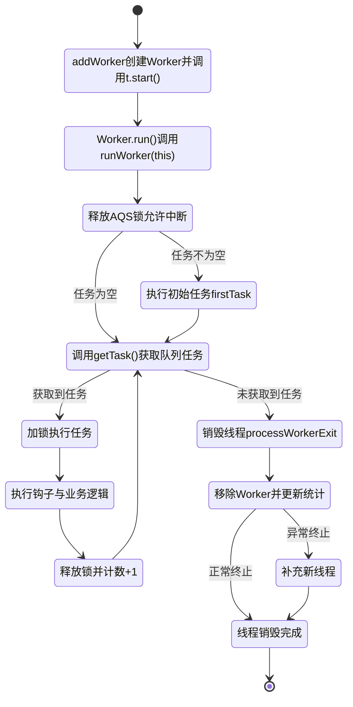
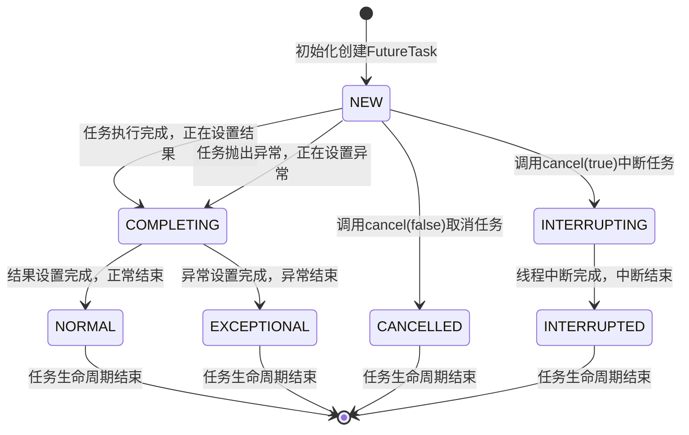

## 🧩 模块3：Worker线程生命周期与线程复用核心原理 源码级深化（对应JCiP 6.2；📗 艺术 10.1）
### 3.1 核心维度定义
##### 1. 核心定位
Worker是线程池的工作线程封装类，是线程复用的核心载体，继承AQS实现独占锁，深度绑定阶段2的AQS、LockSupport、中断机制，负责任务的循环执行、空闲销毁、异常处理全流程。
##### 2. 永远不变的核心行为语义
1.  Worker线程启动后，会进入无限循环，不断从阻塞队列获取任务执行，实现线程复用；
2.  执行任务时必须加Worker独占锁，解锁前不允许被中断，保证任务执行的原子性；
3.  空闲线程会通过`park()`阻塞，超时未获取到任务则自动销毁，非核心线程超时销毁，核心线程默认永久阻塞；
4.  任务执行抛出未捕获异常时，Worker线程会终止，线程池会创建新的Worker补充（未关闭时）。
##### 3. 核心设计思想
1.  **线程复用**：通过无限循环+阻塞队列获取任务，避免线程执行完单个任务就销毁，最大化线程利用率；
2.  **锁隔离**：Worker内部AQS锁与线程池全局主锁分离，任务执行无全局锁竞争，仅在创建/销毁时加全局锁；
3.  **中断精细化管控**：通过AQS的锁状态，实现「仅空闲线程可被中断，执行中线程不允许中断」，避免任务执行中被意外中断导致数据不一致；
4.  **弹性缩容**：通过`keepAliveTime`实现空闲线程的超时销毁，平衡低负载下的资源占用与高负载下的响应速度。

### 3.2 实现层（JVM底层⛰️）【源码+注释+流程图 深度深化】
#### 3.2.1 Worker类核心结构（JDK8全量源码+逐行注释）
```java
// 📘 JCiP 8.3.2 Worker核心类：继承AQS实现独占锁，实现Runnable接口
// ⛰️ 与阶段2的AQS体系完全联动，是线程池锁隔离的核心
private final class Worker
    extends AbstractQueuedSynchronizer
    implements Runnable
{
    private static final long serialVersionUID = 6138294846945017332L;

    // 工作线程，由ThreadFactory创建
    final Thread thread;
    // 初始任务，可为null（创建后从队列获取任务）
    Runnable firstTask;
    // 记录当前线程完成的任务数
    volatile long completedTasks;

    // Worker构造方法
    Worker(Runnable firstTask) {
        // AQS状态初始化为-1，禁止中断，直到runWorker方法执行前
        // 避免线程启动后、执行任务前被中断
        setState(-1);
        this.firstTask = firstTask;
        // 以当前Worker对象为Runnable，创建线程
        this.thread = getThreadFactory().newThread(this);
    }

    // 工作线程启动后的核心入口
    public void run() {
        // 委托给runWorker方法，实现任务循环执行
        runWorker(this);
    }

    // ------------------- AQS独占锁实现 -------------------
    // 锁是否被持有：state!=0 表示已锁定
    protected boolean isHeldExclusively() {
        return getState() != 0;
    }

    // 尝试获取锁：CAS将state从0改为1，不可重入
    protected boolean tryAcquire(int unused) {
        if (compareAndSetState(0, 1)) {
            setExclusiveOwnerThread(Thread.currentThread());
            return true;
        }
        return false;
    }

    // 尝试释放锁：将state置为0
    protected boolean tryRelease(int unused) {
        setExclusiveOwnerThread(null);
        setState(0);
        return true;
    }

    // 加锁
    public void lock()        { acquire(1); }
    // 尝试加锁
    public boolean tryLock()  { return tryAcquire(1); }
    // 解锁
    public void unlock()      { release(1); }
    // 判断是否锁定
    public boolean isLocked() { return isHeldExclusively(); }

    // 中断线程：仅当线程未持有锁时（空闲状态）才能中断
    void interruptIfStarted() {
        Thread t;
        if (getState() >= 0 && (t = thread) != null && !t.isInterrupted()) {
            try {
                t.interrupt();
            } catch (SecurityException ignore) {
            }
        }
    }
}
```
> ⛰️ 底层联动：Worker的AQS实现是不可重入的独占锁，与阶段2的ReentrantLock形成区分，目的是防止任务执行过程中，线程池的核心方法（如shutdown）重入加锁，导致任务执行中被意外中断。

#### 3.2.2 runWorker()核心方法（JDK8全量源码+逐行注释）

> 线程复用的核心实现，Worker线程启动后，会在该方法中无限循环，不断获取任务执行，直到线程被销毁。
```java
// 📘 JCiP 8.3.2 线程复用核心方法
final void runWorker(Worker w) {
    Thread wt = Thread.currentThread();
    Runnable task = w.firstTask;
    w.firstTask = null;
    // 释放AQS锁，将state从-1改为0，允许中断
    w.unlock();
    // 标记任务是否异常终止，true=异常终止，false=正常退出
    boolean completedAbruptly = true;
    try {
        // 【线程复用核心】无限循环，不断获取任务执行
        // 1. 先执行初始任务firstTask，执行完后从队列获取任务
        // 2. getTask()返回null，线程退出循环，进入销毁流程
        while (task != null || (task = getTask()) != null) {
            // 执行任务前加锁，保证任务执行期间不被中断
            w.lock();
            // 线程池状态>=STOP时，必须中断当前线程
            // 状态<STOP时，清除中断标记，保证线程正常执行
            if ((runStateAtLeast(ctl.get(), STOP) ||
                 (Thread.interrupted() &&
                  runStateAtLeast(ctl.get(), STOP))) &&
                !wt.isInterrupted())
                wt.interrupt();
            
            try {
                // 📘 JCiP 8.4 扩展钩子：任务执行前调用，可用于监控、日志、计时
                beforeExecute(wt, task);
                Throwable thrown = null;
                try {
                    // 执行任务的run方法，实现任务逻辑
                    task.run();
                } catch (RuntimeException x) {
                    thrown = x; throw x;
                } catch (Error x) {
                    thrown = x; throw x;
                } catch (Throwable x) {
                    thrown = x; throw new Error(x);
                } finally {
                    // 📘 JCiP 8.4 扩展钩子：任务执行后调用，可用于异常处理、统计、计时
                    afterExecute(task, thrown);
                }
            } finally {
                // 任务执行完毕，置空task，循环获取下一个任务
                task = null;
                // 完成任务数+1
                w.completedTasks++;
                // 释放锁，允许线程被中断
                w.unlock();
            }
        }
        // 循环正常退出，标记为非异常终止
        completedAbruptly = false;
    } finally {
        // 线程退出循环，执行销毁流程
        processWorkerExit(w, completedAbruptly);
    }
}
```

#### 3.2.3 getTask()方法（JDK8全量源码+逐行注释）
> 核心作用：从阻塞队列获取任务，实现空闲线程的阻塞与超时销毁，深度依赖阶段2的阻塞队列、LockSupport、中断机制。
```java
// 📘 JCiP 8.3.1 任务获取与空闲线程销毁核心方法
private Runnable getTask() {
    // 标记上一次poll()是否超时
    boolean timedOut = false;

    // 自旋获取任务
    for (;;) {
        int c = ctl.get();
        int rs = runStateOf(c);

        // 线程池状态校验：
        // 1. STOP状态：直接返回null，销毁线程
        // 2. SHUTDOWN状态+队列为空：直接返回null，销毁线程
        if (rs >= SHUTDOWN && (rs >= STOP || workQueue.isEmpty())) {
            // 工作线程数-1
            decrementWorkerCount();
            return null;
        }

        int wc = workerCountOf(c);

        // 判断是否需要超时控制：
        // 1. allowCoreThreadTimeOut=true：核心线程也支持超时销毁
        // 2. 工作线程数>核心线程数：非核心线程需要超时销毁
        boolean timed = allowCoreThreadTimeOut || wc > corePoolSize;

        // 线程数超过最大线程数 或 超时且队列空，销毁当前线程
        if ((wc > maximumPoolSize || (timed && timedOut))
            && (wc > 1 || workQueue.isEmpty())) {
            if (compareAndDecrementWorkerCount(c))
                return null;
            continue;
        }

        try {
            // 从队列获取任务：
            // 超时控制开启：poll(keepAliveTime)，超时未获取到任务返回null
            // 超时控制关闭：take()，无限阻塞直到获取到任务
            Runnable r = timed ?
                workQueue.poll(keepAliveTime, TimeUnit.NANOSECONDS) :
                workQueue.take();
            // 获取到任务，返回给runWorker执行
            if (r != null)
                return r;
            // 超时未获取到任务，标记timedOut=true，下一轮自旋销毁线程
            timedOut = true;
        } catch (InterruptedException retry) {
            // 线程被中断，重置超时标记，重新自旋
            timedOut = false;
        }
    }
}
```

#### 3.2.4 Worker线程全生命周期流程图


### 3.3 机制层（CSAPP硬件原理🌏）
- 线程复用通过无限循环实现，避免了线程创建销毁带来的栈内存分配/回收、内核线程创建/销毁的开销，单次线程创建的开销是任务执行开销的上千倍，高并发下收益极大；
- 空闲线程通过`park()`阻塞，释放CPU资源，OS会将阻塞线程从CPU调度队列移除，仅当队列有任务时通过`unpark()`唤醒，减少CPU空转；
- Worker的不可重入锁设计，避免了任务执行过程中的中断带来的CPU上下文切换，保证任务执行的缓存局部性，提升CPU缓存命中率。

---
## 🧩 模块4：FutureTask与异步任务全生命周期 源码级深化（对应JCiP 6.3；📗 艺术 4.4）
### 4.1 核心维度定义
##### 1. 核心定位
`FutureTask`是`Future`接口的核心实现类，封装了异步任务的执行、结果获取、取消、状态管理全流程，深度依赖阶段2的LockSupport、CAS、AQS队列，是Java异步编程的基础。
##### 2. 永远不变的核心行为语义
1.  任务状态单向流转：NEW→COMPLETING→NORMAL/EXCEPTIONAL/CANCELLED/INTERRUPTED，不可逆；
2.  `get()`方法会阻塞当前线程，直到任务完成/取消/超时，支持响应中断；
3.  任务只能执行一次，`run()`方法执行后，再次调用不会重复执行；
4.  任务取消后，无法再次执行，`get()`会抛出`CancellationException`；
5.  任务执行结果的发布，符合JMM的happens-before规则，执行线程的写入对get()线程立即可见。
##### 3. 核心设计思想
1.  **状态机驱动**：通过volatile修饰的state变量，用单个int值标记任务全生命周期，CAS保证状态修改的原子性；
2.  **无锁阻塞唤醒**：通过Treiber栈（无锁单向链表）存储等待线程，通过LockSupport.park/unpark实现线程的阻塞与唤醒，避免内核态锁开销；
3.  **异常封装**：将任务执行的所有异常封装为`ExecutionException`，在get()时抛出，保证异步任务的异常能被调用方感知；
4.  **任务可取消**：支持通过中断取消执行中的任务，与阶段2的线程中断机制完全联动。

### 4.2 实现层（JVM底层⛰️）【源码+注释+流程图 深度深化】
#### 4.2.1 FutureTask核心状态与结构（JDK8全量源码+逐行注释）
```java
// 📘 JCiP Listing 6.11 FutureTask核心实现类
// 实现RunnableFuture接口，同时实现Runnable与Future接口，可被线程池执行
public class FutureTask<V> implements RunnableFuture<V> {
    // 任务状态核心变量，volatile修饰保证多线程可见性
    private volatile int state;
    // 任务状态枚举，严格按顺序递增，保证状态判断的原子性
    private static final int NEW          = 0; // 初始状态：任务未执行
    private static final int COMPLETING   = 1; // 瞬时状态：任务执行完成，正在设置结果/异常
    private static final int NORMAL       = 2; // 最终状态：任务正常执行完成
    private static final int EXCEPTIONAL  = 3; // 最终状态：任务执行抛出异常
    private static final int CANCELLED    = 4; // 最终状态：任务被取消（未中断）
    private static final int INTERRUPTING = 5; // 瞬时状态：正在中断执行任务的线程
    private static final int INTERRUPTED  = 6; // 最终状态：任务被中断取消

    // 待执行的任务，执行完成后置null
    private Callable<V> callable;
    // 任务执行结果/异常，get()时返回，非volatile，由state状态保证可见性
    private Object outcome;
    // 执行任务的线程，run()执行期间CAS设置
    private volatile Thread runner;
    // 等待get()结果的线程栈，Treiber无锁栈，单向链表结构
    private volatile WaitNode waiters;

    // 静态内部类：等待线程节点
    static final class WaitNode {
        volatile Thread thread;
        volatile WaitNode next;
        WaitNode() { thread = Thread.currentThread(); }
    }

    // Unsafe工具类，用于CAS操作，与阶段2的CAS体系联动
    private static final sun.misc.Unsafe UNSAFE;
    private static final long stateOffset;
    private static final long runnerOffset;
    private static final long waitersOffset;
    static {
        try {
            UNSAFE = sun.misc.Unsafe.getUnsafe();
            Class<?> k = FutureTask.class;
            stateOffset = UNSAFE.objectFieldOffset
                (k.getDeclaredField("state"));
            runnerOffset = UNSAFE.objectFieldOffset
                (k.getDeclaredField("runner"));
            waitersOffset = UNSAFE.objectFieldOffset
                (k.getDeclaredField("waiters"));
        } catch (Exception e) {
            throw new Error(e);
        }
    }

    // 构造方法：封装Callable任务
    public FutureTask(Callable<V> callable) {
        if (callable == null)
            throw new NullPointerException();
        this.callable = callable;
        this.state = NEW; // 初始化为NEW状态
    }

    // 构造方法：封装Runnable任务，指定返回结果
    public FutureTask(Runnable runnable, V result) {
        this.callable = Executors.callable(runnable, result);
        this.state = NEW; // 初始化为NEW状态
    }
}
```

#### 4.2.2 run()核心执行方法（JDK8全量源码+逐行注释）
```java
// 📘 JCiP 6.3 任务执行核心方法，线程池Worker线程调用
public void run() {
    // 1. 状态不是NEW，说明任务已执行/取消，直接返回
    // 2. CAS设置runner为当前线程，失败说明有其他线程正在执行，直接返回
    if (state != NEW ||
        !UNSAFE.compareAndSwapObject(this, runnerOffset,
                                     null, Thread.currentThread()))
        return;
    
    try {
        Callable<V> c = callable;
        // 再次校验状态为NEW，避免执行过程中被取消
        if (c != null && state == NEW) {
            V result;
            boolean ran;
            try {
                // 执行任务的call()方法，获取结果
                result = c.call();
                ran = true;
            } catch (Throwable ex) {
                // 任务执行抛出异常，设置异常结果
                result = null;
                ran = false;
                setException(ex);
            }
            // 任务正常执行完成，设置结果
            if (ran)
                set(result);
        }
    } finally {
        // 执行完成，runner置null
        runner = null;
        // 处理任务执行过程中被中断的场景
        int s = state;
        if (s >= INTERRUPTING)
            // 等待中断操作完成
            handlePossibleCancellationInterrupt(s);
    }
}

// 设置正常执行结果
protected void set(V v) {
    // CAS将状态从NEW改为COMPLETING瞬时状态
    if (UNSAFE.compareAndSwapInt(this, stateOffset, NEW, COMPLETING)) {
        outcome = v;
        // 设置最终状态为NORMAL，volatile写，保证结果对其他线程可见
        UNSAFE.putOrderedInt(this, stateOffset, NORMAL);
        // 唤醒所有等待get()结果的线程
        finishCompletion();
    }
}

// 设置异常结果
protected void setException(Throwable t) {
    // CAS将状态从NEW改为COMPLETING瞬时状态
    if (UNSAFE.compareAndSwapInt(this, stateOffset, NEW, COMPLETING)) {
        outcome = t;
        // 设置最终状态为EXCEPTIONAL
        UNSAFE.putOrderedInt(this, stateOffset, EXCEPTIONAL);
        // 唤醒所有等待线程
        finishCompletion();
    }
}
```

#### 4.2.3 get()与cancel()核心方法（JDK8核心源码+注释）
```java
// 📘 JCiP Listing 6.4 阻塞获取任务结果，响应中断
public V get() throws InterruptedException, ExecutionException {
    int s = state;
    // 任务未完成，进入等待队列阻塞
    if (s <= COMPLETING)
        s = awaitDone(false, 0L);
    // 任务完成，解析结果/异常
    return report(s);
}

// 限时阻塞获取结果，超时抛出TimeoutException
public V get(long timeout, TimeUnit unit)
    throws InterruptedException, ExecutionException, TimeoutException {
    if (unit == null)
        throw new NullPointerException();
    int s = state;
    // 任务未完成，限时等待，超时抛出异常
    if (s <= COMPLETING &&
        (s = awaitDone(true, unit.toNanos(timeout))) <= COMPLETING)
        throw new TimeoutException();
    return report(s);
}

// 等待任务完成核心方法
private int awaitDone(boolean timed, long nanos)
    throws InterruptedException {
    final long deadline = timed ? System.nanoTime() + nanos : 0L;
    WaitNode q = null;
    boolean queued = false;
    // 自旋等待
    for (;;) {
        // 线程被中断，移除等待节点，抛出中断异常
        if (Thread.interrupted()) {
            removeWaiter(q);
            throw new InterruptedException();
        }

        int s = state;
        // 任务已完成/取消，直接返回状态
        if (s > COMPLETING) {
            if (q != null)
                q.thread = null;
            return s;
        }
        // 任务处于COMPLETING瞬时状态，让出CPU，自旋等待
        else if (s == COMPLETING)
            Thread.yield();
        // 等待节点未创建，创建节点
        else if (q == null)
            q = new WaitNode();
        // 节点未入队，CAS将节点加入等待栈头部
        else if (!queued)
            queued = UNSAFE.compareAndSwapObject(this, waitersOffset,
                                                 q.next = waiters, q);
        // 限时等待
        else if (timed) {
            nanos = deadline - System.nanoTime();
            // 超时，移除节点，返回当前状态
            if (nanos <= 0L) {
                removeWaiter(q);
                return state;
            }
            // 限时阻塞当前线程
            LockSupport.parkNanos(this, nanos);
        }
        // 无限阻塞当前线程
        else
            LockSupport.park(this);
    }
}

// 📘 JCiP 6.3.1 任务取消方法
public boolean cancel(boolean mayInterruptIfRunning) {
    // 仅当任务处于NEW状态时，才能取消
    if (!(state == NEW &&
          UNSAFE.compareAndSwapInt(this, stateOffset, NEW,
              mayInterruptIfRunning ? INTERRUPTING : CANCELLED)))
        return false;
    
    try {
        // mayInterruptIfRunning=true，中断执行任务的线程
        if (mayInterruptIfRunning) {
            try {
                Thread t = runner;
                if (t != null)
                    t.interrupt();
            } finally {
                // 设置最终状态为INTERRUPTED
                UNSAFE.putOrderedInt(this, stateOffset, INTERRUPTED);
            }
        }
    } finally {
        // 唤醒所有等待线程
        finishCompletion();
    }
    return true;
}

// 解析任务结果/异常
private V report(int s) throws ExecutionException {
    Object x = outcome;
    // 正常完成，返回结果
    if (s == NORMAL)
        return (V)x;
    // 任务被取消，抛出CancellationException
    if (s >= CANCELLED)
        throw new CancellationException();
    // 任务执行异常，抛出封装的ExecutionException
    throw new ExecutionException((Throwable)x);
}

// 任务完成后，唤醒所有等待的线程，清空等待栈
private void finishCompletion() {
    for (WaitNode q; (q = waiters) != null;) {
        // CAS清空等待栈
        if (UNSAFE.compareAndSwapObject(this, waitersOffset, q, null)) {
            // 遍历等待栈，唤醒所有线程
            for (;;) {
                Thread t = q.thread;
                if (t != null) {
                    q.thread = null;
                    LockSupport.unpark(t);
                }
                WaitNode next = q.next;
                if (next == null)
                    break;
                q.next = null;
                q = next;
            }
            break;
        }
    }
    // 📘 JCiP 8.4 扩展钩子：任务完成后调用
    done();
    // 执行完成，callable置null，释放内存
    callable = null;
}
```

#### 4.2.4 FutureTask全生命周期状态流转图


### 4.3 机制层（CSAPP硬件原理🌏）
- 状态机的volatile变量修改，通过MESI缓存一致性协议保证多核心下的可见性，无锁实现状态的多线程同步；
- 等待线程采用Treiber无锁栈设计，通过CAS实现入队/出队，避免了内核态锁的上下文切换开销，高并发下性能优于有锁队列；
- `park/unpark`通过OS内核的信号量实现，精准唤醒指定线程，避免了`notifyAll()`带来的惊群效应，减少CPU上下文切换开销。

---
