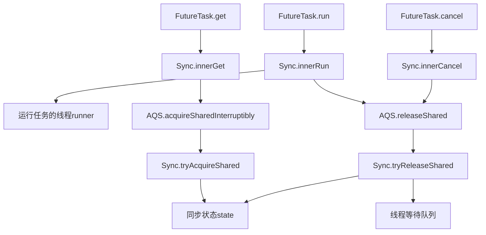
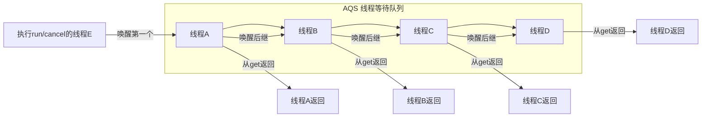

## ⛰️ 五、FutureTask 源码级详解
### 💥 重中之重：三大核心维度定义
#### 1. 核心定位
FutureTask是**JUC异步任务体系的核心载体**，是连接`Runnable`/`Callable`任务定义与`Future`异步结果获取的唯一桥梁，是Executor框架实现异步任务提交、结果获取、任务取消能力的核心底层实现，也是AQS共享模式的经典应用案例。

#### 2. 永远不变的核心行为语义
无论JDK版本如何迭代，FutureTask的核心行为承诺永远固定：
1.  **不可逆的状态机语义**：任务生命周期分为「未启动→已启动→已完成（正常/异常/取消）」，状态只能单向流转，一旦进入终态永远无法回退，任务永远不会被重复执行；
2.  **get()阻塞语义**：任务未进入终态时，调用`get()`的线程会无限阻塞（或超时阻塞）；任务进入终态后，会立即返回执行结果或抛出对应异常，多线程并发调用`get()`也不会出现竞态问题；
3.  **cancel()取消语义**：只有未启动的任务可以被成功取消；已启动的任务可通过`mayInterruptIfRunning`参数决定是否中断执行线程；已进入终态的任务取消永远返回false；
4.  **一次执行、结果共享语义**：同一个FutureTask的`run()`方法只会被执行一次，执行结果会被缓存，所有调用`get()`的线程都会拿到完全一致的结果/异常；
5.  **异常传递语义**：任务执行过程中抛出的异常，会被封装到`ExecutionException`中，在调用`get()`时抛出给调用线程，不会直接导致执行线程崩溃。

#### 3. 核心设计思想
1.  **复合优于继承思想**：通过内部私有`Sync`类继承AQS，将所有同步逻辑委托给内部类实现，对外只暴露`Future`和`Runnable`接口，避免了继承AQS带来的接口污染，符合复合优于继承的设计原则；
2.  **状态机管控思想**：通过原子化的`state`状态变量管控任务的整个生命周期，所有操作都基于状态机校验，保证任务执行、结果获取、取消操作的线程安全；
3.  **AQS共享模式思想**：基于AQS的共享模式实现多线程并发等待同一个任务结果的能力，任务完成后通过级联唤醒机制唤醒所有等待线程，完美适配多线程等待同一个异步任务结果的场景；
4.  **模板方法模式思想**：基于AQS的模板方法设计，只需实现`tryAcquireShared`和`tryReleaseShared`两个核心方法，即可复用AQS提供的线程阻塞、唤醒、等待队列管理的全部能力，大幅简化了同步逻辑的开发。

### 一、FutureTask 核心设计原则（书中原文）
> 基于**复合优于继承**的原则，FutureTask声明了一个内部私有的继承于AQS的子类`Sync`，对FutureTask所有公有方法的调用都会委托给这个内部子类。
> AQS作为模板方法模式的基础类，提供给Sync实现`tryAcquireShared(int)`和`tryReleaseShared(int)`两个方法，Sync通过这两个方法来检查和更新同步状态。

### 二、100% 匹配书本图10-15 的正确流程图

### 三、核心方法完整执行流程（逐字对应书中步骤）
#### 1. `FutureTask.get()` 执行流程（书中原文）
1.  `FutureTask.get()` 委托给 `Sync.innerGet()`
2.  `Sync.innerGet()` 调用 `AQS.acquireSharedInterruptibly(0)`
3.  **AQS模板方法回调** `Sync.tryAcquireShared(0)`，判断是否可以获取同步状态
    - 成功条件：`state == RAN`（正常完成）**或** `state == CANCELLED`（已取消），且 `runner != null`
4.  如果获取成功，`get()` 立即返回结果或抛出异常
5.  如果获取失败，当前线程进入 **AQS线程等待队列** 阻塞
6.  当其他线程执行 `run()` 或 `cancel()` 触发 `releaseShared()` 后，等待线程被唤醒，再次执行 `tryAcquireShared()`
7.  成功后离开队列，唤醒后继线程（级联唤醒），最终从 `get()` 返回

#### 2. `FutureTask.run()` 执行流程（书中原文）
1.  `FutureTask.run()` 委托给 `Sync.innerRun()`
2.  `Sync.innerRun()` 执行构造函数中传入的 `Callable.call()` 任务
3.  以原子方式 `CAS` 更新 AQS 同步状态：`compareAndSetState(NEW, RAN)`
4.  如果原子更新成功，将 `Callable.call()` 的返回值赋值给 `result` 变量
5.  将运行任务的线程 `runner` 置为 `null`
6.  调用 `AQS.releaseShared(0)`
7.  **AQS模板方法回调** `Sync.tryReleaseShared(0)`，返回 `true`
8.  `AQS.releaseShared()` 唤醒**线程等待队列中的第一个线程**
9.  调用钩子方法 `FutureTask.done()`

#### 3. `FutureTask.cancel()` 执行流程
1.  `FutureTask.cancel(boolean mayInterruptIfRunning)` 委托给 `Sync.innerCancel()`
2.  原子 `CAS` 更新同步状态为 `CANCELLED`
3.  如果 `mayInterruptIfRunning` 为 `true`，则中断 `runner` 线程
4.  将 `runner` 置为 `null`
5.  调用 `AQS.releaseShared(0)`
6.  唤醒线程等待队列中的第一个线程，触发级联唤醒
7.  调用钩子方法 `FutureTask.done()`

### 四、级联唤醒机制（对应书中图10-16）

**书中原文描述**：
当线程E执行`run()`方法时，会唤醒队列中的第一个线程A。线程A被唤醒后，首先把自己从队列中删除，然后唤醒它的后继线程B，最后线程A从`get()`方法返回。线程B、C和D重复A线程的处理流程。最终，在队列中等待的所有线程都被级联唤醒并从`get()`方法返回。

### 五、AQS 共享模式与 FutureTask 的关系
FutureTask 使用的是 AQS 的**共享模式**，而不是独占模式：
- 多个线程可以同时等待同一个 FutureTask 的结果
- 当任务完成时，所有等待的线程都会被级联唤醒
- 这就是为什么多个线程调用同一个 `FutureTask.get()` 都能正确返回结果的原因

### 六、一句话终极总结
FutureTask 是**AQS共享模式的经典实现**：内部持有一个继承自AQS的Sync内部类，所有对外方法全部委托给Sync；AQS作为模板方法，提供`acquireSharedInterruptibly`和`releaseShared`两个模板方法，回调Sync实现的`tryAcquireShared`和`tryReleaseShared`来控制同步状态和线程阻塞唤醒，最终实现了异步任务的生命周期管控、多线程结果共享、安全取消的全流程能力。

---

## 🌏 六、本章总结与生产规范
### 💥 重中之重：三大核心维度定义
#### 1. 核心定位
本章节的生产规范是**Executor框架从理论学习到生产落地的核心准则**，是基于《Java并发编程的艺术》理论、结合阿里Java开发手册、线上高并发场景踩坑经验总结的落地标准，核心目标是规避线程池使用带来的OOM、线程泄漏、服务崩溃等线上故障。

#### 2. 永远不变的生产级核心准则
无论业务场景如何变化，线程池生产使用的核心准则永远固定：
1.  **可控性优先准则**：生产环境必须保证线程池的并发数、任务队列长度是可控的，绝对禁止使用无界队列、无界最大线程数的线程池；
2.  **可观测性准则**：线程池必须设置自定义线程工厂，指定有业务含义的线程名，必须暴露线程池的监控指标，便于问题排查和性能监控；
3.  **异常处理准则**：所有提交到线程池的任务，必须做好异常捕获处理，避免任务异常丢失、线程池线程频繁销毁重建；
4.  **资源隔离准则**：不同核心级别的业务，必须使用独立的线程池，避免非核心业务异常耗尽线程池，导致核心业务不可用。

#### 3. 核心设计思想
1.  **风险前置思想**：通过有界队列、合理的线程数范围，将高并发下的OOM风险在参数设置阶段就提前规避，而不是等到线上故障再处理；
2.  **故障隔离思想**：通过线程池隔离，实现不同业务之间的故障隔离，避免单点故障扩散到整个服务；
3.  **可运维思想**：通过线程名、监控指标暴露，让线程池的运行状态可观测、可排查、可告警，符合生产环境的可运维要求。

### 本章总结（书中原文）
本章介绍了 Executor 框架的整体结构和成员组件。希望读者阅读本章之后，能够对 Executor 框架有一个比较深入的理解，同时也希望本章内容有助于读者更熟练地使用 Executor 框架。

### 生产使用建议（结合阿里规约）
1.  **禁止使用 Executors 创建线程池**
    - Fixed/Single：无界队列 → ⛰️JVM OOM
    - Cached/Scheduled：无界线程 → ⛰️JVM OOM
2.  **手动创建 ThreadPoolExecutor**
    - 指定有界队列，队列长度必须根据业务压测结果设置，避免无限堆积；
    - 指定合理的核心线程数和最大线程数，核心线程数建议根据任务类型（CPU密集型/IO密集型）设置；
    - 指定自定义线程工厂，设置带业务标识的线程名，便于问题排查；
    - 指定合理的拒绝策略，生产环境建议使用自定义拒绝策略，做好降级、告警处理；
3.  **异步任务结果处理**
    - 使用 `FutureTask` 接收异步任务结果，必须使用带超时时间的`get(long timeout, TimeUnit unit)`方法，避免线程无限阻塞；
    - 必须处理任务取消、执行异常、超时异常等各类异常场景，避免异常丢失导致业务问题无法排查；
4.  **定时任务选型**
    - 单机简单定时：使用 `ScheduledThreadPoolExecutor`，必须做好异常捕获，避免周期任务终止；
    - 分布式定时：使用 XXL-Job、Quartz 等专业分布式调度框架，避免单机故障导致定时任务失效。
