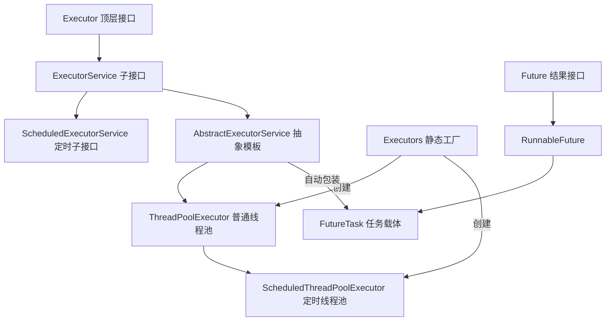
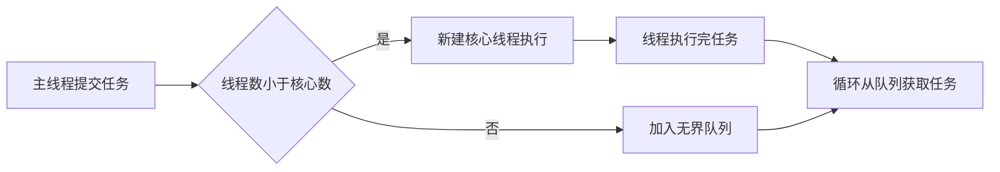
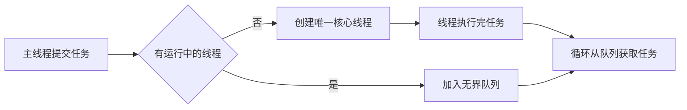
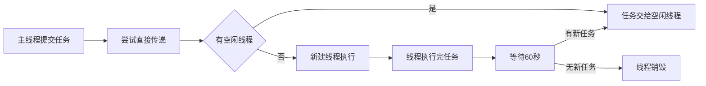
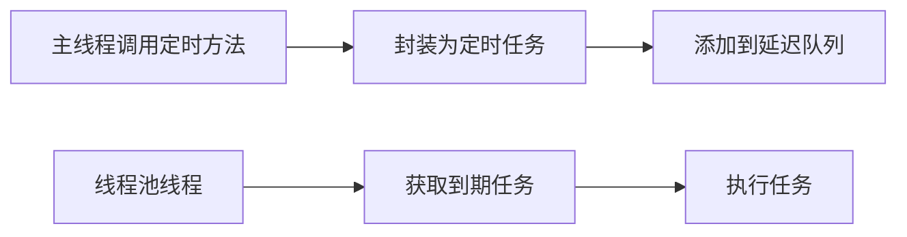
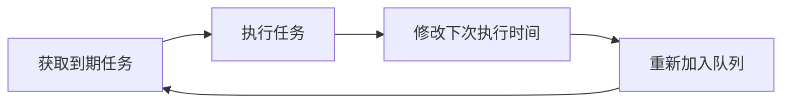
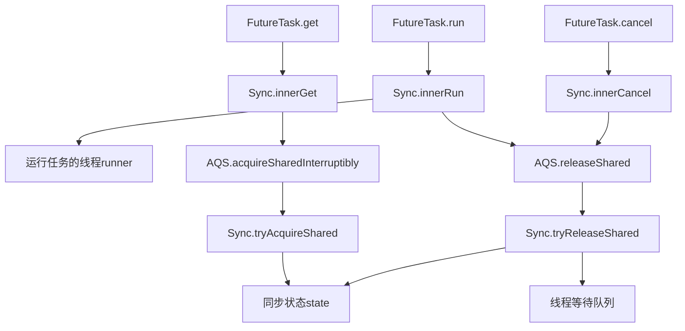
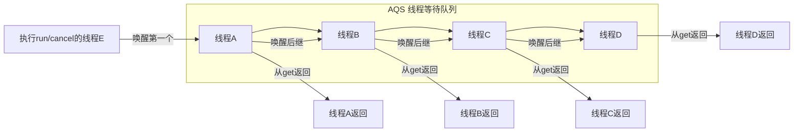

# 🌏 JUC Executor 框架与 FutureTask 完整详解
**严格参考《Java并发编程的艺术》第10章全部内容 + JDK8 源码 + ⛰️JVM底层原理**
## 🌏 一、Executor 框架总览
### 💥 重中之重：三大核心维度定义
#### 1. 核心定位
Executor框架是**JUC并发体系的核心任务调度基础设施**，是Java语言层面标准化的[[3阶段-任务执行与线程池 源码级深度整合文档|线程池]]与异步任务管理方案，也是JDK官方推荐的、替代手动`new Thread`管理线程的唯一标准实现。它向上屏蔽了线程生命周期的底层管理细节，向下统一了任务提交、调度、执行、结果获取的全流程标准，是整个Java后端并发编程的基石。
#### 2. 永远不变的核心行为语义
无论JDK版本如何迭代优化，Executor框架的核心行为承诺永远固定，不会发生任何变更：
1.  **任务提交与执行解耦**：提交任务的线程（生产者）无需关心任务何时、被哪个线程执行，只需通过标准接口提交任务；
2.  **统一的生命周期管理**：所有线程池实现都遵循`ExecutorService`定义的生命周期规则（运行中→关闭中→已终止），`shutdown()`/`shutdownNow()`/`awaitTermination()`的行为语义完全统一；
3.  **异步结果标准化**：所有带返回值的任务提交，都会通过`submit()`方法返回`Future`接口实现，统一了异步结果的获取、取消、异常处理标准；
4.  **任务执行的原子性**：一个合法的`Runnable/Callable`任务，只会被线程池中的一个工作线程执行一次，不会出现并发重复执行的情况。
#### 3. 核心设计思想
1.  **解耦思想**：将「任务定义」「任务提交」「任务执行」三者彻底拆分，符合面向对象的单一职责原则；
2.  **池化思想**：通过线程复用规避线程频繁创建、销毁带来的内核态/用户态切换开销，提升高并发场景下的任务执行效率；
3.  **生产者-消费者模式**：提交任务的业务线程是生产者，线程池中的工作线程是消费者，工作队列是两者的缓冲桥梁，是整个框架的底层并发模型；
4.  **模板方法模式**：通过`AbstractExecutorService`抽象类封装了任务提交、结果包装、异常处理的通用逻辑，子类只需实现最核心的`execute()`任务调度逻辑，大幅降低了自定义线程池的开发成本；
5.  **开闭原则**：基于`Executor`→`ExecutorService`的接口分层，可自由扩展自定义线程池实现，无需修改原有框架代码，比如定时线程池、优先级线程池等扩展实现。
### 1. 框架整体层级结构

### 2. 核心组件汇总对比
| 组件                        | 核心作用           | 底层实现                                                    | 核心特点                 |
| ------------------------ | ------------------ | ----------------------------------------------------------- | ------------------------ |
| FixedThreadPool             | 固定线程数执行任务 | ThreadPoolExecutor                                          | 线程固定，无界队列       |
| SingleThreadExecutor        | 严格串行执行任务   | FinalizableDelegatedExecutorService(包装ThreadPoolExecutor) | 单线程，不可篡改         |
| CachedThreadPool            | 动态伸缩执行短任务 | ThreadPoolExecutor                                          | 无核心线程，无界最大线程 |
| ScheduledThreadPoolExecutor | 延迟/周期定时任务  | ScheduledThreadPoolExecutor                                 | 基于DelayQueue           |
| FutureTask                  | 异步任务结果载体   | 内部Sync类继承AQS                                           | 同时实现Runnable和Future |
---

## ⛰️ 二、四大标准线程池源码级详解
### 1. FixedThreadPool（固定线程数线程池）
#### 💥 重中之重：三大核心维度定义
##### 1. 核心定位
FixedThreadPool是JUC提供的**固定并发数的定长线程池实现**，是Executor框架最基础的线程池方案，专门用于负载稳定、并发数可控的长期任务执行场景，是控制服务并发上限、避免线程无限膨胀的基础实现。

##### 2. 永远不变的核心行为语义
无论JDK版本如何迭代，FixedThreadPool的核心行为承诺永远固定：
1.  **线程数永远固定**：核心线程数=最大线程数，线程池的最大并发数永远等于创建时指定的`nThreads`，永远不会扩容创建额外线程；
2.  **核心线程永久常驻**：`keepAliveTime=0`，核心线程即使空闲也不会被回收，会一直循环从队列中获取任务执行；
3.  **永远不会拒绝任务**：使用无界`LinkedBlockingQueue`，任务永远可以成功入队，永远不会触发拒绝策略；
4.  **任务执行顺序不保证**：多个工作线程并发从队列中获取任务，无法保证任务提交顺序与执行顺序一致；
5.  **预热机制固定**：只有当任务提交时，才会逐步创建核心线程，直到达到指定的`nThreads`，完成线程池预热。

##### 3. 核心设计思想
1.  **并发可控思想**：通过固定线程数严格限制服务的最大并发量，避免高并发下线程无限创建导致的CPU耗尽、内存溢出问题；
2.  **稳定优先思想**：用常驻核心线程避免线程创建销毁的开销，用无界队列做流量削峰，保证在突发流量下任务不会丢失，优先保证任务的可执行性；
3.  **CPU密集型适配思想**：固定线程数的设计，完美适配CPU密集型任务——这类任务CPU占用率高，并发数等于CPU核心数时效率最高，无需额外线程。

#### 1.1 源码定义（书中原文）
```java
public static ExecutorService newFixedThreadPool(int nThreads) {
    return new ThreadPoolExecutor(
        nThreads,
        nThreads,
        0L,
        TimeUnit.MILLISECONDS,
        new LinkedBlockingQueue<Runnable>()
    );
}
```

#### 1.2 核心参数
| 参数            | 值                  | 含义                                     |
| --------------- | ------------------- | ---------------------------------------- |
| corePoolSize    | nThreads            | 核心线程数                               |
| maximumPoolSize | nThreads            | 最大线程数 = 核心线程数                  |
| keepAliveTime   | 0L                  | 非核心线程空闲存活时间                   |
| 工作队列        | LinkedBlockingQueue | 无界阻塞队列（容量 `Integer.MAX_VALUE`） |

#### 1.3 execute 执行流程图（对应书中图10-4）


#### 1.4 运行机制（书中原文步骤）
1.  如果当前运行的线程数少于 `corePoolSize`，则创建新线程来执行任务。
2.  在线程池完成预热之后（运行线程数等于 `corePoolSize`），将所有新任务加入无界 `LinkedBlockingQueue`。
3.  线程执行完当前任务后，会在无限循环中反复从队列获取任务来执行。

#### 1.5 无界队列带来的4个核心影响（书中重点）
1.  线程数永远不会超过 `corePoolSize`，因此 `maximumPoolSize` 是无效参数。
2.  永远不会创建非核心线程，因此 `keepAliveTime` 是无效参数。
3.  永远不会触发拒绝策略，任务会无限堆积在队列中。
4.  高并发下任务无限堆积会导致⛰️JVM内存飙升，最终引发 OOM。

#### 1.6 适用场景
- 负载稳定、并发数可控的长期任务
- CPU 密集型任务（处理大文件，大图像等）
- 对任务执行顺序无要求的场景

---

### 2. SingleThreadExecutor（单线程线程池）
#### 💥 重中之重：三大核心维度定义
##### 1. 核心定位
SingleThreadExecutor是JUC提供的**严格串行执行任务的单线程池实现**，专门用于需要保证任务执行顺序、不允许并发执行的场景，通过包装器保证单线程语义不可篡改，是替代单线程串行执行任务的标准方案。

##### 2. 永远不变的核心行为语义
无论JDK版本如何迭代，SingleThreadExecutor的核心行为承诺永远固定：
1.  **严格串行执行**：永远只有一个工作线程执行任务，任务的提交顺序=执行顺序，绝对不会出现并发执行的情况；
2.  **单线程语义不可篡改**：通过包装器屏蔽了底层线程池的参数修改接口，外部永远无法修改核心线程数、最大线程数，单线程执行的语义永远不会被破坏；
3.  **自动资源兜底释放**：当线程池对象被GC回收时，会自动调用`shutdown()`关闭底层线程池，避免线程泄漏；
4.  **异常容错机制**：如果唯一的工作线程因任务异常终止，线程池会自动创建一个新的工作线程，保证后续任务可以继续执行，不会像单线程一样因异常导致整个执行链路中断；
5.  **永远不会拒绝任务**：同FixedThreadPool，使用无界队列，任务永远可以成功入队。

##### 3. 核心设计思想
1.  **不可变设计思想**：通过委托模式+包装器，只暴露标准`ExecutorService`接口，屏蔽所有可修改线程池参数的方法，保证单线程语义的不可篡改性，符合不可变对象的设计原则；
2.  **串行一致性思想**：通过单线程执行，保证所有任务的执行顺序与提交顺序完全一致，提供强串行一致性保证；
3.  **安全兜底思想**：通过`finalize()`方法实现GC时的自动关闭，作为开发者忘记手动关闭线程池的兜底安全网，避免资源泄漏。

#### 2.1 源码定义（书中原文）
```java
public static ExecutorService newSingleThreadExecutor() {
    return new FinalizableDelegatedExecutorService(
        new ThreadPoolExecutor(
            1,
            1,
            0L,
            TimeUnit.MILLISECONDS,
            new LinkedBlockingQueue<Runnable>()
        )
    );
}
```

#### 2.2 核心参数
与 `newFixedThreadPool(1)` 完全一致，但**多了一层 `FinalizableDelegatedExecutorService` 包装**，这是两者的本质区别。

##### 1. 🔒 保证「单线程语义不可篡改」
这是它最重要的作用。
- `newFixedThreadPool(1)` 返回的是**原生 `ThreadPoolExecutor`**，你可以强转后修改它：
  ```java
  ExecutorService exec = Executors.newFixedThreadPool(1);
  // 危险！可以强转修改线程数，单线程语义被破坏
  ((ThreadPoolExecutor) exec).setCorePoolSize(10);
  ```
- `newSingleThreadExecutor()` 返回的是 `FinalizableDelegatedExecutorService`，它**只暴露 `ExecutorService` 接口**，并且内部是**委托模式**，你无法强转获取底层的 `ThreadPoolExecutor`：
  ```java
  ExecutorService exec = Executors.newSingleThreadExecutor();
  // 编译报错或运行时异常，无法强转修改
  // ((ThreadPoolExecutor) exec).setCorePoolSize(10);
  ```
> 这就是书中说的「SingleThreadExecutor 的单线程语义永远保证，不可篡改」的底层实现原理。

##### 2. 🧹 自动资源管理：GC 时自动 `shutdown()`
注意 `FinalizableDelegatedExecutorService` 中的 `finalize()` 方法：
```java
protected void finalize() {
    super.shutdown();
}
```
- 当这个包装类对象被**垃圾回收器回收**时，会自动调用 `shutdown()` 方法关闭底层线程池。
- 这是一个**安全网**，防止开发者忘记手动调用 `shutdown()` 导致线程池资源泄漏。
> 虽然 `finalize()` 方法现在已不推荐作为主要资源管理手段（Java 9+ 推荐使用 `try-with-resources`），但在 JDK 早期设计中，这是一种兜底的资源释放机制。

#### 2.3 execute 执行流程图（对应书中图10-5）


#### 2.4 与 `newFixedThreadPool(1)` 的本质区别
| 特性             | SingleThreadExecutor                | newFixedThreadPool(1)                   |
| ---------------- | ----------------------------------- | --------------------------------------- |
| 返回类型         | FinalizableDelegatedExecutorService | ThreadPoolExecutor                      |
| 能否强转修改参数 | ❌ 不能，只暴露 ExecutorService 接口 | ✅ 可以强转后调用 setCorePoolSize 等方法 |
| 单线程语义       | 永远保证                            | 可被修改                                |
| 资源释放         | 自动调用shutdown                    | 需手动调用                              |
| 底层队列         | LinkedBlockingQueue                 | LinkedBlockingQueue                     |
| 核心线程数       | 1                                   | 1                                       |
| 最大线程数       | 1                                   | 1                                       |

#### 2.5 适用场景
- 需要严格保证任务执行顺序的场景
- 不允许并发执行的任务
- 轻量级的串行任务调度场景

---

### 3. CachedThreadPool（可缓存线程池）
#### 💥 重中之重：三大核心维度定义
##### 1. 核心定位
CachedThreadPool是JUC提供的**动态弹性伸缩的线程池实现**，专门用于处理大量、短时间、轻量级的异步任务，以及突发流量场景，通过无核心线程+空闲线程自动回收的设计，实现低负载时零资源占用、高负载时自动扩容的弹性能力。

##### 2. 永远不变的核心行为语义
无论JDK版本如何迭代，CachedThreadPool的核心行为承诺永远固定：
1.  **零核心线程，全量弹性伸缩**：核心线程数为0，所有线程都是非核心线程，任务执行完后空闲60秒会被自动回收，低负载时不会占用任何线程资源；
2.  **任务直接传递，不做缓存**：使用`SynchronousQueue`同步队列，队列不存储任何任务，每个任务提交必须找到一个空闲线程配对，否则立即创建新线程执行；
3.  **无限扩容能力**：最大线程数为`Integer.MAX_VALUE`，理论上可以无限创建新线程处理任务，永远不会拒绝任务；
4.  **线程复用机制**：空闲线程会在60秒内等待新任务，期间有新任务提交会直接复用，无需创建新线程；
5.  **突发流量适配**：任务提交速度超过线程处理速度时，会自动创建新线程，保证任务被立即执行，不会出现排队等待。

##### 3. 核心设计思想
1.  **弹性伸缩思想**：通过0核心线程+无界最大线程+超时回收的设计，实现线程数随任务量动态变化，做到“忙时扩容、闲时缩容”，最大化资源利用率；
2.  **零等待思想**：通过`SynchronousQueue`同步队列实现任务的直接传递，任务提交后无需排队，直接交给线程执行，最小化任务执行延迟；
3.  **短任务适配思想**：60秒的空闲回收时间，完美适配大量短任务场景——短任务执行快，线程可以快速复用，避免频繁创建销毁；任务结束后线程自动回收，不会长期占用资源。

#### 3.1 源码定义（书中原文）
```java
public static ExecutorService newCachedThreadPool() {
    return new ThreadPoolExecutor(
        0,
        Integer.MAX_VALUE,
        60L,
        TimeUnit.SECONDS,
        new SynchronousQueue<Runnable>()
    );
}
```

#### 3.2 核心参数
| 参数            | 值                | 含义             |
| --------------- | ----------------- | ---------------- |
| corePoolSize    | 0                 | 无核心线程       |
| maximumPoolSize | Integer.MAX_VALUE | 最大线程数无界   |
| keepAliveTime   | 60s               | 空闲线程存活60秒 |
| 工作队列        | SynchronousQueue  | 无容量同步队列   |

#### 3.3 execute 执行流程图（对应书中图10-6、10-7）


#### 3.4 运行机制（书中原文步骤）
1.  首先执行 `SynchronousQueue.offer(task)`。如果当前有空闲线程正在执行 `poll(60s)`，则主线程与空闲线程配对成功，任务交给空闲线程执行。
2.  如果没有空闲线程，`offer` 操作失败，此时会创建一个新线程执行任务。
3.  新线程执行完任务后，会执行 `poll(60s)` 等待新任务。如果60秒内没有新任务，该线程会被终止。

#### 3.5 核心特性与坑点
- **动态伸缩**：没有核心线程，线程数随任务量动态变化，空闲60秒自动销毁，低负载时不占用资源。
- **无界线程风险**：`maximumPoolSize` 无界，高并发下会无限创建线程，导致 CPU 100% 和⛰️JVM OOM。
- **SynchronousQueue 特性**：没有容量，每个插入操作必须等待另一个线程的移除操作，任务直接传递给线程，不存储在队列中，完全符合🌏CSAPP中「同步消息传递」的并发模型。

#### 3.6 适用场景
- 大量、短时间、轻量级的异步任务
- 突发流量的处理
- IO 密集型短任务
- 低延迟要求的任务执行场景

---

### 4. ScheduledThreadPoolExecutor（定时线程池）
#### 💥 重中之重：三大核心维度定义
##### 1. 核心定位
ScheduledThreadPoolExecutor是JUC提供的**单机延迟/周期任务调度标准实现**，是JDK官方推荐的、替代老旧`Timer`类的定时任务方案，基于线程池实现多线程并发调度，解决了Timer单线程、异常崩溃、时间精度低的核心缺陷。

##### 2. 永远不变的核心行为语义
无论JDK版本如何迭代，ScheduledThreadPoolExecutor的核心行为承诺永远固定：
1.  **延迟执行语义**：可以指定任务在给定延迟时间后执行，延迟时间基于相对时间，不受系统时钟修改的影响；
2.  **周期执行语义**：支持固定速率`scheduleAtFixedRate`和固定延迟`scheduleWithFixedDelay`两种周期调度模式，语义永远固定；
3.  **多线程并发调度**：基于核心线程池实现多线程执行定时任务，单个任务执行缓慢不会阻塞其他定时任务的调度；
4.  **异常隔离语义**：单个任务执行抛出异常，只会终止该任务的调度，不会影响线程池和其他定时任务的执行；
5.  **任务排序语义**：基于`DelayQueue`实现任务排序，永远先执行到期时间早的任务；到期时间相同的任务，先提交的先执行；
6.  **任务取消语义**：已提交的定时任务可以通过返回的`ScheduledFuture`取消，取消后的任务永远不会被调度执行。

##### 3. 核心设计思想
1.  **优先级调度思想**：基于`PriorityQueue`实现延迟任务的优先级排序，保证到期时间最早的任务最先被执行，实现精准的延迟调度；
2.  **周期任务闭环思想**：周期任务执行完成后，自动修改下次执行时间并重新放入延迟队列，形成“执行-更新时间-重新入队”的闭环，实现无限周期调度；
3.  **故障隔离思想**：通过多线程池设计，实现任务之间的故障隔离，单个任务异常不会导致整个调度系统崩溃，解决了Timer的致命缺陷；
4.  **模板方法复用思想**：继承`ThreadPoolExecutor`复用线程池的核心能力，只扩展定时调度相关的任务封装、入队、获取逻辑，最大化代码复用，符合开闭原则。

#### 4.1 继承关系
```
Executor
  ↑
ExecutorService
  ↑
ScheduledExecutorService
  ↑
ThreadPoolExecutor
  ↑
ScheduledThreadPoolExecutor
```

#### 4.2 任务传递示意图（对应书中图10-8）


#### 4.3 ScheduledFutureTask 结构（书中原文）
定时任务被封装为 `ScheduledFutureTask`，包含3个核心成员变量：
1.  `long time`：任务将要被执行的绝对时间（纳秒）
2.  `long sequenceNumber`：任务被添加到线程池的序号，用于区分同时到期的任务
3.  `long period`：任务执行的间隔周期（0表示非周期任务）

#### 4.4 周期任务执行步骤（对应书中图10-9）


#### 4.5 DelayQueue 核心实现（书中原文）
`DelayQueue` 封装了一个 `PriorityQueue`，对任务进行排序：
- 首先按 `time` 排序，时间早的任务先执行
- 如果两个任务的 `time` 相同，则按 `sequenceNumber` 排序，先提交的任务先执行

#### 4.6 与 Timer 的对比（书中原文）
| 特性     | Timer                      | ScheduledThreadPoolExecutor  |
| -------- | -------------------------- | ---------------------------- |
| 线程数   | 单线程                     | 多线程                       |
| 异常影响 | 一个任务异常，所有任务终止 | 单个任务异常，不影响其他任务 |
| 时间精度 | 依赖系统绝对时间           | 基于相对时间                 |
| 并发能力 | 无并发                     | 支持多线程并发               |
| 底层队列 | 自定义最小堆               | DelayQueue                   |
| 任务取消 | 支持                       | 支持                         |

#### 4.7 底层原理关联
延迟调度底层依赖⛰️JVM的 `LockSupport.parkNanos()` 原语，最终委托操作系统的定时调度能力，和🌏CSAPP中「进程/线程的休眠与唤醒」机制完全对齐。

#### 4.8 适用场景
- 单机简单的延迟任务
- 单机简单的周期任务
- 不适合分布式、海量定时任务

---

## 🌏 三、核心工作队列对比详解
### 💥 重中之重：三大核心维度定义
#### 1. 核心定位
工作队列（阻塞队列）是**线程池执行流程的核心载体**，是连接任务提交线程与工作线程的桥梁，决定了任务的排队、调度、缓存策略，是线程池核心参数中除了线程数之外，最影响线程池行为特性的核心组件。

#### 2. 永远不变的核心行为语义
无论JDK版本如何迭代，JUC中阻塞队列的核心行为承诺永远固定：
1.  **线程安全语义**：所有阻塞队列的入队、出队操作都是线程安全的，多线程并发操作不会出现数据竞争问题；
2.  **阻塞语义**：当队列满时，入队操作会阻塞调用线程；当队列为空时，出队操作会阻塞调用线程，这是阻塞队列的核心定义；
3.  **不可变容量语义**：队列的容量在创建时确定，有界队列的容量永远不会变化，无界队列的容量上限永远是`Integer.MAX_VALUE`；
4.  **可见性语义**：一个线程入队的任务，对后续出队的线程立即可见，符合JMM的happens-before规则。

#### 3. 核心设计思想
1.  **生产者-消费者解耦思想**：通过队列作为缓冲，解耦任务提交的生产者线程与任务执行的消费者线程，两者无需直接交互，实现异步化执行；
2.  **流量削峰思想**：通过队列缓存突发提交的任务，避免线程无限创建，平滑任务执行的流量波动，保护系统稳定性；
3.  **调度策略适配思想**：通过不同的队列实现，适配不同的任务调度策略——无界队列保证任务不丢失、同步队列实现零延迟执行、优先级队列实现任务优先级调度、延迟队列实现定时调度。

### 核心工作队列全维度对比
| 队列类型     | 实现类                | 容量              | 线程池使用场景                        | 核心特性                      | 阻塞机制            |
| ------------ | --------------------- | ----------------- | ------------------------------------- | ----------------------------- | ------------------- |
| 无界链表队列 | LinkedBlockingQueue   | Integer.MAX_VALUE | FixedThreadPool, SingleThreadExecutor | 基于链表，读写分离双锁        | put/take 阻塞       |
| 同步队列     | SynchronousQueue      | 0                 | CachedThreadPool                      | 无容量，必须配对传递          | offer/poll 阻塞配对 |
| 延迟队列     | DelayQueue            | Integer.MAX_VALUE | ScheduledThreadPoolExecutor           | 基于PriorityQueue，按时间排序 | take 阻塞等待到期   |
| 数组有界队列 | ArrayBlockingQueue    | 固定值            | 自定义线程池                          | 基于数组，单锁                | put/take 阻塞       |
| 优先级队列   | PriorityBlockingQueue | Integer.MAX_VALUE | 自定义优先级线程池                    | 基于二叉堆，按优先级排序      | put/take 阻塞       |

---

## ⛰️ 四、四大线程池终极对比
### 💥 重中之重：三大核心维度定义
#### 1. 核心定位
四大标准线程池是JUC基于`ThreadPoolExecutor`封装的、覆盖主流场景的标准化线程池实现，是学习线程池的核心范本，也是理解线程池参数组合如何影响行为特性的最佳案例。

#### 2. 永远不变的核心分类语义
无论JDK版本如何迭代，四大线程池的分类定位永远固定：
1.  **FixedThreadPool**：定长并发控制类线程池，核心是稳定、可控的并发数；
2.  **SingleThreadExecutor**：串行执行类线程池，核心是严格的执行顺序保证；
3.  **CachedThreadPool**：弹性动态类线程池，核心是低延迟、弹性伸缩；
4.  **ScheduledThreadPoolExecutor**：定时调度类线程池，核心是延迟/周期任务调度。

#### 3. 核心设计思想
通过**核心线程数、最大线程数、工作队列**三个核心参数的不同组合，实现适配不同场景的线程池行为，本质是「并发控制、任务缓冲、资源占用」三者之间的权衡：
- FixedThreadPool：牺牲弹性，换取并发可控性；
- SingleThreadExecutor：牺牲并发能力，换取串行执行顺序；
- CachedThreadPool：牺牲稳定性，换取极致的低延迟和弹性；
- ScheduledThreadPoolExecutor：牺牲通用调度能力，换取定时调度的精准性。

### 四大线程池全维度终极对比表
| 对比维度       | FixedThreadPool     | SingleThreadExecutor                | CachedThreadPool     | ScheduledThreadPoolExecutor |
| -------------- | ------------------- | ----------------------------------- | -------------------- | --------------------------- |
| 核心线程数     | n                   | 1                                   | 0                    | n                           |
| 最大线程数     | n                   | 1                                   | Integer.MAX_VALUE    | Integer.MAX_VALUE           |
| keepAliveTime  | 0L                  | 0L                                  | 60s                  | 0L                          |
| 工作队列       | LinkedBlockingQueue | LinkedBlockingQueue                 | SynchronousQueue     | DelayQueue                  |
| 队列容量       | Integer.MAX_VALUE   | Integer.MAX_VALUE                   | 0                    | Integer.MAX_VALUE           |
| 线程动态伸缩   | 不支持              | 不支持                              | 支持                 | 不支持                      |
| 任务堆积风险   | 较高                | 高                                  | 低                   | 高                          |
| 线程爆炸风险   | 低                  | 低                                  | 高                   | 低                          |
| 拒绝策略触发   | 永不触发            | 永不触发                            | 永不触发             | 永不触发                    |
| 任务执行顺序   | 不保证              | 严格保证                            | 不保证               | 按时间保证                  |
| 底层实现类     | ThreadPoolExecutor  | FinalizableDelegatedExecutorService | ThreadPoolExecutor   | ScheduledThreadPoolExecutor |
| 能否修改线程数 | 可以                | 不可以                              | 可以                 | 可以                        |
| 适用场景       | 稳定负载、CPU密集   | 顺序执行任务                        | 短任务、突发流量     | 单机定时任务                |
| 生产可用性     | 不推荐（无界队列）  | 不推荐（无界队列）                  | 绝对禁止（无界线程） | 单机场景可用                |

---

## ⛰️ 五、FutureTask 源码级详解
### 💥 重中之重：三大核心维度定义
#### 1. 核心定位
FutureTask是**JUC异步任务体系的核心载体**，是连接`Runnable`/`Callable`任务定义与`Future`异步结果获取的唯一桥梁，是Executor框架实现异步任务提交、结果获取、任务取消能力的核心底层实现，也是AQS共享模式的经典应用案例。

#### 2. 永远不变的核心行为语义
无论JDK版本如何迭代，FutureTask的核心行为承诺永远固定：
1.  **不可逆的状态机语义**：任务生命周期分为「未启动→已启动→已完成（正常/异常/取消）」，状态只能单向流转，一旦进入终态永远无法回退，任务永远不会被重复执行；
2.  **get()阻塞语义**：任务未进入终态时，调用`get()`的线程会无限阻塞（或超时阻塞）；任务进入终态后，会立即返回执行结果或抛出对应异常，多线程并发调用`get()`也不会出现竞态问题；
3.  **cancel()取消语义**：只有未启动的任务可以被成功取消；已启动的任务可通过`mayInterruptIfRunning`参数决定是否中断执行线程；已进入终态的任务取消永远返回false；
4.  **一次执行、结果共享语义**：同一个FutureTask的`run()`方法只会被执行一次，执行结果会被缓存，所有调用`get()`的线程都会拿到完全一致的结果/异常；
5.  **异常传递语义**：任务执行过程中抛出的异常，会被封装到`ExecutionException`中，在调用`get()`时抛出给调用线程，不会直接导致执行线程崩溃。

#### 3. 核心设计思想
1.  **复合优于继承思想**：通过内部私有`Sync`类继承AQS，将所有同步逻辑委托给内部类实现，对外只暴露`Future`和`Runnable`接口，避免了继承AQS带来的接口污染，符合复合优于继承的设计原则；
2.  **状态机管控思想**：通过原子化的`state`状态变量管控任务的整个生命周期，所有操作都基于状态机校验，保证任务执行、结果获取、取消操作的线程安全；
3.  **AQS共享模式思想**：基于AQS的共享模式实现多线程并发等待同一个任务结果的能力，任务完成后通过级联唤醒机制唤醒所有等待线程，完美适配多线程等待同一个异步任务结果的场景；
4.  **模板方法模式思想**：基于AQS的模板方法设计，只需实现`tryAcquireShared`和`tryReleaseShared`两个核心方法，即可复用AQS提供的线程阻塞、唤醒、等待队列管理的全部能力，大幅简化了同步逻辑的开发。

### 一、FutureTask 核心设计原则（书中原文）
> 基于**复合优于继承**的原则，FutureTask声明了一个内部私有的继承于AQS的子类`Sync`，对FutureTask所有公有方法的调用都会委托给这个内部子类。
> AQS作为模板方法模式的基础类，提供给Sync实现`tryAcquireShared(int)`和`tryReleaseShared(int)`两个方法，Sync通过这两个方法来检查和更新同步状态。

### 二、100% 匹配书本图10-15 的正确流程图


### 三、核心方法完整执行流程（逐字对应书中步骤）
#### 1. `FutureTask.get()` 执行流程（书中原文）
1.  `FutureTask.get()` 委托给 `Sync.innerGet()`
2.  `Sync.innerGet()` 调用 `AQS.acquireSharedInterruptibly(0)`
3.  **AQS模板方法回调** `Sync.tryAcquireShared(0)`，判断是否可以获取同步状态
    - 成功条件：`state == RAN`（正常完成）**或** `state == CANCELLED`（已取消），且 `runner != null`
4.  如果获取成功，`get()` 立即返回结果或抛出异常
5.  如果获取失败，当前线程进入 **AQS线程等待队列** 阻塞
6.  当其他线程执行 `run()` 或 `cancel()` 触发 `releaseShared()` 后，等待线程被唤醒，再次执行 `tryAcquireShared()`
7.  成功后离开队列，唤醒后继线程（级联唤醒），最终从 `get()` 返回

#### 2. `FutureTask.run()` 执行流程（书中原文）
1.  `FutureTask.run()` 委托给 `Sync.innerRun()`
2.  `Sync.innerRun()` 执行构造函数中传入的 `Callable.call()` 任务
3.  以原子方式 `CAS` 更新 AQS 同步状态：`compareAndSetState(NEW, RAN)`
4.  如果原子更新成功，将 `Callable.call()` 的返回值赋值给 `result` 变量
5.  将运行任务的线程 `runner` 置为 `null`
6.  调用 `AQS.releaseShared(0)`
7.  **AQS模板方法回调** `Sync.tryReleaseShared(0)`，返回 `true`
8.  `AQS.releaseShared()` 唤醒**线程等待队列中的第一个线程**
9.  调用钩子方法 `FutureTask.done()`

#### 3. `FutureTask.cancel()` 执行流程
1.  `FutureTask.cancel(boolean mayInterruptIfRunning)` 委托给 `Sync.innerCancel()`
2.  原子 `CAS` 更新同步状态为 `CANCELLED`
3.  如果 `mayInterruptIfRunning` 为 `true`，则中断 `runner` 线程
4.  将 `runner` 置为 `null`
5.  调用 `AQS.releaseShared(0)`
6.  唤醒线程等待队列中的第一个线程，触发级联唤醒
7.  调用钩子方法 `FutureTask.done()`

### 四、级联唤醒机制（对应书中图10-16）


**书中原文描述**：
当线程E执行`run()`方法时，会唤醒队列中的第一个线程A。线程A被唤醒后，首先把自己从队列中删除，然后唤醒它的后继线程B，最后线程A从`get()`方法返回。线程B、C和D重复A线程的处理流程。最终，在队列中等待的所有线程都被级联唤醒并从`get()`方法返回。

### 五、AQS 共享模式与 FutureTask 的关系
FutureTask 使用的是 AQS 的**共享模式**，而不是独占模式：
- 多个线程可以同时等待同一个 FutureTask 的结果
- 当任务完成时，所有等待的线程都会被级联唤醒
- 这就是为什么多个线程调用同一个 `FutureTask.get()` 都能正确返回结果的原因

### 六、一句话终极总结
FutureTask 是**AQS共享模式的经典实现**：内部持有一个继承自AQS的Sync内部类，所有对外方法全部委托给Sync；AQS作为模板方法，提供`acquireSharedInterruptibly`和`releaseShared`两个模板方法，回调Sync实现的`tryAcquireShared`和`tryReleaseShared`来控制同步状态和线程阻塞唤醒，最终实现了异步任务的生命周期管控、多线程结果共享、安全取消的全流程能力。

---

## 🌏 六、本章总结与生产规范
### 💥 重中之重：三大核心维度定义
#### 1. 核心定位
本章节的生产规范是**Executor框架从理论学习到生产落地的核心准则**，是基于《Java并发编程的艺术》理论、结合阿里Java开发手册、线上高并发场景踩坑经验总结的落地标准，核心目标是规避线程池使用带来的OOM、线程泄漏、服务崩溃等线上故障。

#### 2. 永远不变的生产级核心准则
无论业务场景如何变化，线程池生产使用的核心准则永远固定：
1.  **可控性优先准则**：生产环境必须保证线程池的并发数、任务队列长度是可控的，绝对禁止使用无界队列、无界最大线程数的线程池；
2.  **可观测性准则**：线程池必须设置自定义线程工厂，指定有业务含义的线程名，必须暴露线程池的监控指标，便于问题排查和性能监控；
3.  **异常处理准则**：所有提交到线程池的任务，必须做好异常捕获处理，避免任务异常丢失、线程池线程频繁销毁重建；
4.  **资源隔离准则**：不同核心级别的业务，必须使用独立的线程池，避免非核心业务异常耗尽线程池，导致核心业务不可用。

#### 3. 核心设计思想
1.  **风险前置思想**：通过有界队列、合理的线程数范围，将高并发下的OOM风险在参数设置阶段就提前规避，而不是等到线上故障再处理；
2.  **故障隔离思想**：通过线程池隔离，实现不同业务之间的故障隔离，避免单点故障扩散到整个服务；
3.  **可运维思想**：通过线程名、监控指标暴露，让线程池的运行状态可观测、可排查、可告警，符合生产环境的可运维要求。

### 本章总结（书中原文）
本章介绍了 Executor 框架的整体结构和成员组件。希望读者阅读本章之后，能够对 Executor 框架有一个比较深入的理解，同时也希望本章内容有助于读者更熟练地使用 Executor 框架。

### 生产使用建议（结合阿里规约）
1.  **禁止使用 Executors 创建线程池**
    - Fixed/Single：无界队列 → ⛰️JVM OOM
    - Cached/Scheduled：无界线程 → ⛰️JVM OOM
2.  **手动创建 ThreadPoolExecutor**
    - 指定有界队列，队列长度必须根据业务压测结果设置，避免无限堆积；
    - 指定合理的核心线程数和最大线程数，核心线程数建议根据任务类型（CPU密集型/IO密集型）设置；
    - 指定自定义线程工厂，设置带业务标识的线程名，便于问题排查；
    - 指定合理的拒绝策略，生产环境建议使用自定义拒绝策略，做好降级、告警处理；
3.  **异步任务结果处理**
    - 使用 `FutureTask` 接收异步任务结果，必须使用带超时时间的`get(long timeout, TimeUnit unit)`方法，避免线程无限阻塞；
    - 必须处理任务取消、执行异常、超时异常等各类异常场景，避免异常丢失导致业务问题无法排查；
4.  **定时任务选型**
    - 单机简单定时：使用 `ScheduledThreadPoolExecutor`，必须做好异常捕获，避免周期任务终止；
    - 分布式定时：使用 XXL-Job、Quartz 等专业分布式调度框架，避免单机故障导致定时任务失效。