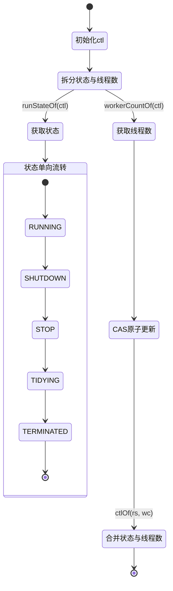
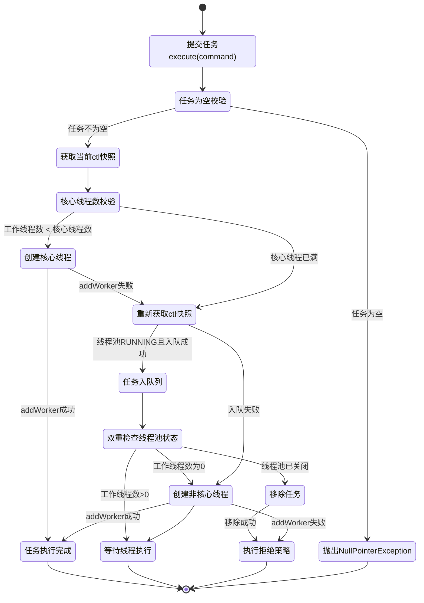
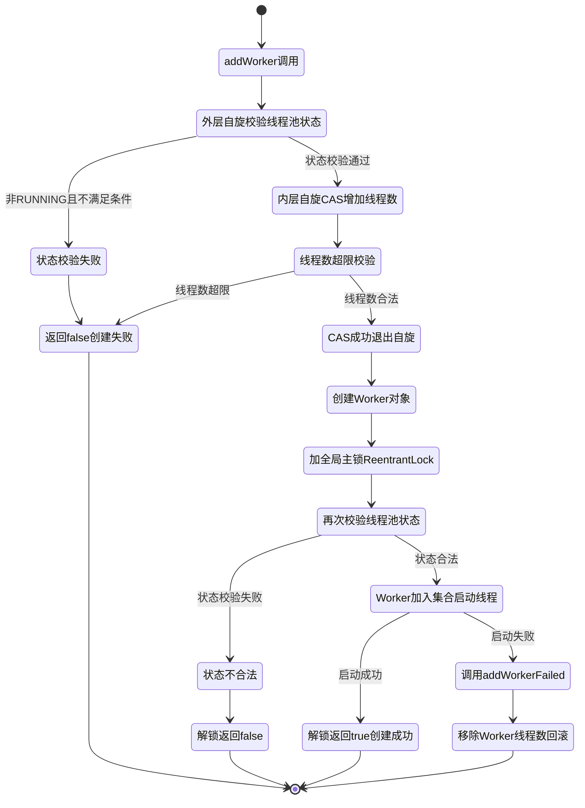
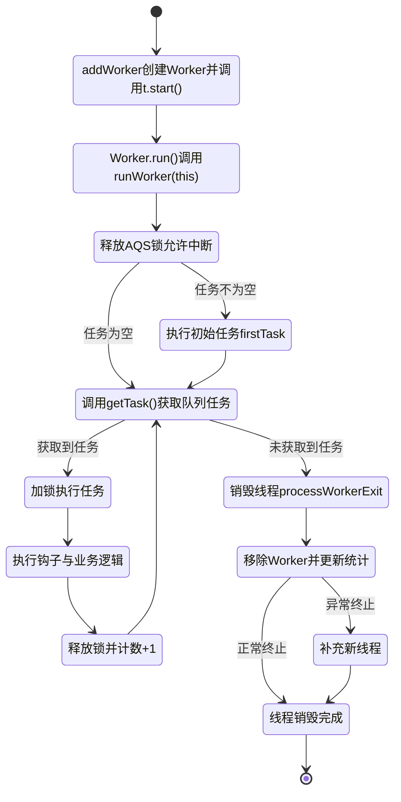
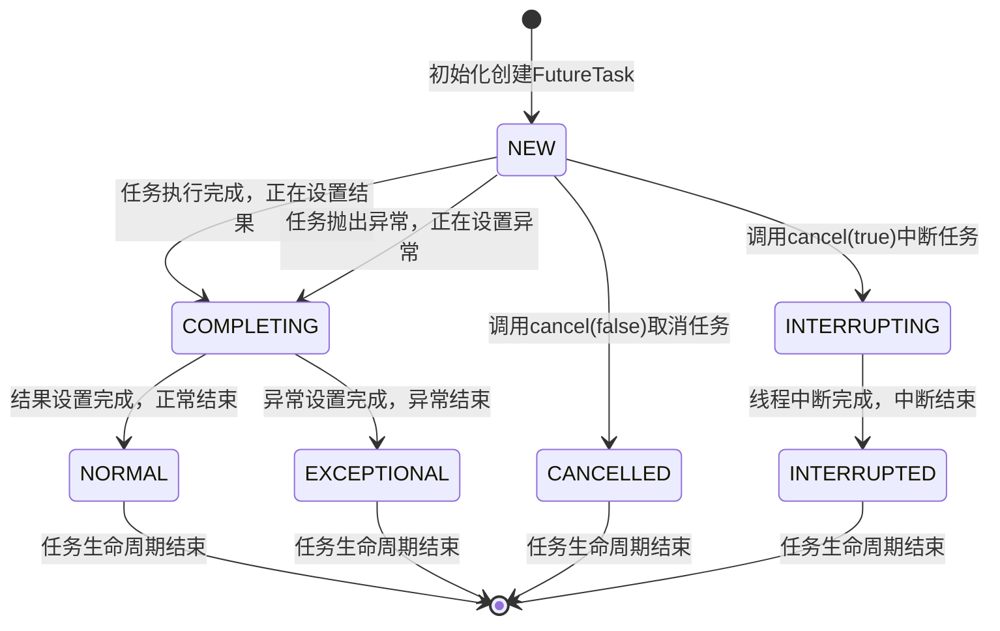

# 并发学习阶段3 任务执行与线程池 源码级深度整合文档
【**JCiP 100%全量锚定 + 《Java并发编程的艺术》双向绑定版**】
> 🎯 核心定位：吃透Java线程池与任务执行框架的源码级底层实现，打通「OS内核线程调度/CPU原子指令🌏 → JVM线程模型/内存屏障/[[2阶段-Java并发编程艺术·AQS队列同步器 全量源码+流程图+实战手册|AQS锁体系]]⛰️ → Java Executor框架/线程池/并发任务全生命周期管理」全链路，与阶段2锁体系深度联动，建立从源码原理到生产级配置调优、问题排查的完整认知
> 📚 覆盖范围：JCiP 第6章、第7章、第8章全量内容 + 《Java并发编程的艺术》第4章、第9章、第10章全量内容 + JVM底层/CSAPP硬件原理联动 + 与阶段2锁体系(AQS/ReentrantLock/Condition/中断)深度绑定
> 🔗 全量上下文：100%严格贴合两本原著章节内容，补充三层联动细节，标注对应书本小节，无核心内容遗漏，核心流程全量源码逐行注释，与阶段2知识体系无缝衔接
> 🔖 标记规则：⛰️ 代表和JVM底层强相关；🌏 代表和CSAPP硬件原理强相关；📘 JCiP原文；📗 《Java并发编程的艺术》原文
## 🎯 总纲：三层联动的任务执行与线程池认知逻辑（与阶段2锁体系强绑定）
### 总纲-核心定义
所有线程池与任务执行知识点，必须从「硬件底层（CSAPP）→ JVM实现层 → Java应用层」三层拆解，**全程与阶段2的锁、同步、AQS、中断体系深度联动**，彻底打通「任务提交→线程调度→锁竞争→阻塞唤醒→资源释放」的全链路逻辑，解决线程池“怎么配、怎么关、怎么排障、怎么调优”四大核心问题。
### 总纲-三层映射关系表（与阶段2锁体系联动）
| 层级         | 核心研究对象                                                 | 解决的核心问题                                   | 阶段2核心联动点                       |
| --------- | ------------------------------------------------------------ | ------------------------------------------------ | ------------------------------------- |
| CSAPP硬件层🌏 | 内核线程调度、CPU上下文切换、MESI缓存一致性、lock原子指令、内存页分配 | 线程池性能瓶颈的硬件根源、线程复用的底层收益     | 阶段2 CAS原子指令、缓存行、上下文切换 |
| JVM实现层⛰️   | Java 1:1内核线程模型、对象头、AQS队列同步器、ReentrantLock、Condition、LockSupport、volatile内存屏障 | 屏蔽OS线程差异，实现线程池语义、任务同步与唤醒   | 阶段2 AQS、synchronized、锁、中断机制 |
| Java应用层   | Executor框架、ThreadPoolExecutor、FutureTask、阻塞队列、同步工具类 | 面向业务的任务执行策略选型、线程池配置与问题排查 | 阶段2 并发容器、阻塞队列、同步工具类  |
### 总纲-两书核心知识点映射表
| JCiP 章节          | 核心内容                                                     | 《Java并发编程的艺术》对应章节             | 底层绑定（阶段2联动）                   |
| ------------------ | ------------------------------------------------------------ | ------------------------------------------ | --------------------------------------- |
| 第6章 任务执行     | Executor框架、Callable/Future、CompletionService、限时任务   | 第10章 线程池（10.1-10.4）、第4章 线程基础 | AQS、LockSupport、阻塞队列              |
| 第7章 取消与关闭   | 任务取消、线程中断、服务关闭、毒丸对象、JVM关闭钩子          | 第9章 线程池关闭、第4章 线程中断           | 线程中断机制、AQS取消、锁释放           |
| 第8章 线程池的使用 | 任务与执行策略耦合、线程池大小配置、ThreadPoolExecutor参数、扩展、递归并行化 | 第10章 线程池参数配置、调优、扩展          | 死锁/活锁/饥饿、ReentrantLock、拒绝策略 |
---

## 🧩 模块1：Executor框架核心设计与任务抽象（对应JCiP 6.1-6.2；📗 艺术 10.1）
### 1.1 核心维度定义（强制必带）
##### 1. 核心定位
Executor框架是Java并发任务执行的核心抽象层，**解耦任务提交与任务执行**，屏蔽线程创建、调度、销毁的底层细节，是线程池的顶层设计，也是阶段2锁体系在业务场景的核心落地载体。
##### 2. 永远不变的核心行为语义
1.  任务提交与执行完全解耦，提交方无需关注执行线程的生命周期；
2.  所有任务执行的底层均依赖阶段2的锁与同步机制，保证多线程下的任务调度安全；
3.  ExecutorService提供标准化的生命周期管理，状态单向流转（运行→关闭→已终止），不可逆；
4.  任务的提交、执行、取消、结果获取，均遵循Java内存模型的可见性、原子性规则。
##### 3. 核心设计思想
1.  **生产者-消费者模式**：任务提交方是生产者，执行线程是消费者，阻塞队列作为解耦载体，与阶段2阻塞队列模块完全联动；
2.  **线程复用**：通过固定线程池循环执行任务，避免线程频繁创建销毁的上下文切换开销；
3.  **策略模式**：通过不同的Executor实现，切换任务执行策略（串行/并行/定时/单线程），无需修改业务提交代码；
4.  **模板方法模式**：顶层接口定义行为规范，底层实现封装通用逻辑，预留扩展钩子。

### 1.2 基础层（书本定义）
📘 JCiP原文核心定义：Executor是基于生产者-消费者模式的任务执行框架，提交任务的操作相当于生产者，执行任务的线程相当于消费者，彻底替代了`new Thread(runnable).start()`的硬编码线程创建方式。
📗 《Java并发编程的艺术》对应内容：Executor框架核心由三部分组成：
1.  **任务**：`Runnable`/`Callable`接口，定义待执行的业务逻辑；
2.  **任务执行器**：`Executor`/`ExecutorService`核心接口，顶层执行抽象，核心实现为`ThreadPoolExecutor`/`ScheduledThreadPoolExecutor`；
3.  **结果获取**：`Future`/`FutureTask`接口，定义异步任务的结果获取、取消、状态查询能力。

核心接口定义：
```java
// 📘 JCiP Listing 6.3 Executor核心接口（原文）
public interface Executor {
    // 唯一核心方法：提交任务，解耦提交与执行
    void execute(Runnable command);
}

// 📘 JCiP Listing 6.7 ExecutorService生命周期管理接口（原文）
public interface ExecutorService extends Executor {
    // 平缓关闭：拒绝新任务，等待已提交/执行中任务完成
    void shutdown();
    // 强制关闭：拒绝新任务，中断执行中任务，清空队列返回未执行任务
    List<Runnable> shutdownNow();
    // 判断是否已关闭
    boolean isShutdown();
    // 判断是否已终止
    boolean isTerminated();
    // 阻塞等待线程池终止，支持超时
    boolean awaitTermination(long timeout, TimeUnit unit) throws InterruptedException;
    
    // 任务提交相关便利方法
    <T> Future<T> submit(Callable<T> task);
    <T> Future<T> submit(Runnable task, T result);
    Future<?> submit(Runnable task);
    // 批量任务限时执行
    <T> List<Future<T>> invokeAll(Collection<? extends Callable<T>> tasks, long timeout, TimeUnit unit) throws InterruptedException;
    <T> T invokeAny(Collection<? extends Callable<T>> tasks, long timeout, TimeUnit unit) throws InterruptedException, ExecutionException, TimeoutException;
}
```

### 1.3 实现层（JVM底层⛰️）
- `Executor`的所有实现类，底层均依赖阶段2的`AQS`+`ReentrantLock`+`Condition`实现线程安全的任务调度与阻塞唤醒；
- `execute()`方法是所有任务提交的入口，最终都会映射到`ThreadPoolExecutor`的核心调度逻辑；
- 任务提交与结果获取之间，通过`volatile`+`CAS`保证状态的可见性，符合JMM的happens-before规则：任务提交happen-before任务执行，任务执行happen-before结果获取。

### 1.4 机制层（CSAPP硬件原理🌏）
- 解耦设计通过线程复用，减少了线程频繁创建销毁带来的**CPU上下文切换开销**，单次上下文切换开销约1-10μs，高并发下性能提升显著；
- 任务批量入队符合CPU缓存局部性原理，连续内存的队列操作减少缓存行失效概率，降低总线同步开销；
- 线程池的线程最终映射为OS内核线程，由OS内核进行抢占式时间片调度，Java层仅负责生命周期管理，不参与CPU调度。

---
## 🧩 模块2：ThreadPoolExecutor核心执行流程 源码级全链路深化（对应JCiP 8.3；📗 艺术 10.1）
### 2.1 核心维度定义
##### 1. 核心定位
`ThreadPoolExecutor`是Java线程池的核心实现类，是Executor框架的基石，所有JDK默认线程池（`newFixedThreadPool`/`newCachedThreadPool`等）均基于该类实现，**全程深度依赖阶段2的AQS、ReentrantLock、CAS、中断体系**。
##### 2. 永远不变的核心行为语义
1.  任务调度严格遵循**核心线程满→入队→非核心线程扩容→拒绝策略**的四步流程，JDK版本迭代从未改变该核心逻辑；
2.  线程池状态单向流转，仅能从RUNNING→SHUTDOWN→STOP→TERMINATED，不可逆；
3.  工作线程Worker继承AQS实现独占锁，执行任务时加锁，保证任务执行期间不被意外中断；
4.  任务执行异常会导致工作线程销毁，同时会创建新线程补充（线程池未关闭时）。
##### 3. 核心设计思想
1.  **容量分级管控**：通过核心线程、队列、最大线程三级缓冲，平衡吞吐量与资源占用，避免无限创建线程；
2.  **锁粒度最小化**：全局主锁仅在创建Worker线程时加锁，任务执行过程无全局锁，仅用Worker内部AQS独占锁，最大化并发性能；
3.  **状态原子化管理**：通过一个AtomicInteger变量`ctl`同时封装「线程池状态+工作线程数」，通过一次CAS操作同时修改两个维度，避免多变量竞态条件；
4.  **容错兜底**：通过拒绝策略处理过载场景，保证服务不会因任务过载直接OOM崩溃。

### 2.2 基础层（书本定义）
📘 JCiP原文核心定义：ThreadPoolExecutor是可灵活定制的线程池实现，通过核心池大小、最大池大小、存活时间、工作队列、线程工厂、拒绝策略六大核心参数，定义线程池的执行策略。
📗 《Java并发编程的艺术》对应内容：线程池的核心调度流程为：
1.  提交任务时，若当前工作线程数小于核心线程数，创建新的核心线程执行任务；
2.  若核心线程数已满，将任务加入工作队列；
3.  若工作队列已满，创建非核心线程执行任务，直到工作线程数达到最大线程数；
4.  若工作线程数已达最大线程数，执行拒绝策略处理任务。

### 2.3 实现层（JVM底层⛰️）【源码+注释+流程图 深度深化】
#### 2.3.1 核心ctl变量设计（JDK8源码）
```java
// 📗 艺术 10.1.1 核心ctl变量：高3位=线程池状态，低29位=工作线程数
private final AtomicInteger ctl = new AtomicInteger(ctlOf(RUNNING, 0));
// 低29位用于存储工作线程数，最大线程数=2^29-1（约5亿，远超实际使用）
private static final int COUNT_BITS = Integer.SIZE - 3;
private static final int CAPACITY   = (1 << COUNT_BITS) - 1;

// 线程池状态（高3位），状态值严格递增，保证状态判断的原子性
private static final int RUNNING    = -1 << COUNT_BITS; // 接受新任务+处理队列任务
private static final int SHUTDOWN   =  0 << COUNT_BITS; // 拒绝新任务+处理队列任务
private static final int STOP       =  1 << COUNT_BITS; // 拒绝新任务+中断所有线程+清空队列
private static final int TIDYING    =  2 << COUNT_BITS; // 所有任务终止，工作线程数为0，即将执行terminated()
private static final int TERMINATED =  3 << COUNT_BITS; // terminated()执行完成，线程池完全终止

// 核心工具方法：拆分/合并状态与工作线程数
private static int runStateOf(int c)     { return c & ~CAPACITY; } // 获取线程池状态
private static int workerCountOf(int c)  { return c & CAPACITY; }  // 获取工作线程数
private static int ctlOf(int rs, int wc) { return rs | wc; }        // 合并状态与线程数

// 状态判断辅助方法
private static boolean isRunning(int c) { return c < SHUTDOWN; }
private static boolean runStateLessThan(int c, int s) { return c < s; }
private static boolean runStateAtLeast(int c, int s) { return c >= s; }
```
> ⛰️ 底层联动：ctl变量用`volatile`修饰的AtomicInteger实现，通过CAS保证原子修改，与阶段2的volatile可见性、CAS原子操作完全联动，避免了多线程下分别修改状态和线程数的竞态条件。




#### 2.3.2 execute()核心调度方法（JDK8全量源码+逐行注释）

```java
// 📘 JCiP 8.3.1 线程池核心任务提交方法（全量源码）
// 核心调度流程：核心线程→队列→非核心线程→拒绝策略
public void execute(Runnable command) {
    // 1. 空任务直接抛空指针，符合JDK规范
    if (command == null)
        throw new NullPointerException();
    
    // 2. 获取当前ctl快照，避免多线程下值变化
    int c = ctl.get();
    
    // 步骤1：工作线程数 < 核心线程数，尝试创建核心线程执行任务
    if (workerCountOf(c) < corePoolSize) {
        // addWorker第二个参数true=核心线程，false=非核心线程
        if (addWorker(command, true))
            // 创建核心线程成功，直接返回
            return;
        // 创建失败（并发导致核心线程数已满/线程池关闭），重新获取ctl
        c = ctl.get();
    }
    
    // 步骤2：核心线程数已满，线程池处于RUNNING状态，尝试将任务加入工作队列
    if (isRunning(c) && workQueue.offer(command)) {
        // 入队成功，双重检查线程池状态，防止入队后线程池被关闭
        int recheck = ctl.get();
        // 线程池已非RUNNING状态，移除任务，执行拒绝策略
        if (! isRunning(recheck) && remove(command))
            reject(command);
        // 工作线程数为0（核心线程全部超时销毁），创建非核心线程兜底执行队列任务
        else if (workerCountOf(recheck) == 0)
            addWorker(null, false);
    }
    
    // 步骤3：队列已满，尝试创建非核心线程执行任务
    else if (!addWorker(command, false))
        // 步骤4：创建非核心线程失败（达到最大线程数/线程池关闭），执行拒绝策略
        reject(command);
}
```

#### 2.3.3 execute()核心执行流程图


#### 2.3.4 addWorker()方法（JDK8核心源码+注释）
> 核心作用：创建Worker工作线程，启动线程执行任务，是线程池创建线程的唯一入口，全程依赖阶段2的ReentrantLock主锁保证线程安全。
```java
private boolean addWorker(Runnable firstTask, boolean core) {
    // 第一部分：CAS自旋更新ctl的工作线程数
    retry:
    for (;;) {
        int c = ctl.get();
        int rs = runStateOf(c);

        // 线程池状态校验：非RUNNING状态下，仅SHUTDOWN+队列非空+firstTask为null时允许创建线程
        // 规则：SHUTDOWN状态不接受新任务，但会执行队列中已有的任务
        if (rs >= SHUTDOWN &&
            ! (rs == SHUTDOWN &&
               firstTask == null &&
               ! workQueue.isEmpty()))
            return false;

        // 自旋CAS更新工作线程数
        for (;;) {
            int wc = workerCountOf(c);
            // 校验线程数是否超过上限：核心线程校验corePoolSize，非核心校验maximumPoolSize
            if (wc >= CAPACITY ||
                wc >= (core ? corePoolSize : maximumPoolSize))
                return false;
            // CAS将工作线程数+1，成功则跳出自旋，进入线程创建流程
            if (compareAndIncrementWorkerCount(c))
                break retry;
            // CAS失败，重新获取ctl，判断线程池状态是否变化，变化则回到外层循环
            c = ctl.get();
            if (runStateOf(c) != rs)
                continue retry;
        }
    }

    // 第二部分：创建Worker线程，启动线程
    boolean workerStarted = false;
    boolean workerAdded = false;
    Worker w = null;
    try {
        // 创建Worker对象，封装任务与线程
        w = new Worker(firstTask);
        final Thread t = w.thread;
        if (t != null) {
            // 加全局主锁，保证workers集合的线程安全，与阶段2的ReentrantLock联动
            final ReentrantLock mainLock = this.mainLock;
            mainLock.lock();
            try {
                // 加锁后再次校验线程池状态
                int rs = runStateOf(ctl.get());
                if (rs < SHUTDOWN ||
                    (rs == SHUTDOWN && firstTask == null)) {
                    // 线程已启动，抛异常
                    if (t.isAlive())
                        throw new IllegalThreadStateException();
                    // 将Worker加入线程池的workers集合
                    workers.add(w);
                    int s = workers.size();
                    // 更新历史最大线程数
                    if (s > largestPoolSize)
                        largestPoolSize = s;
                    workerAdded = true;
                }
            } finally {
                mainLock.unlock();
            }
            // Worker添加成功，启动线程执行任务
            if (workerAdded) {
                t.start();
                workerStarted = true;
            }
        }
    } finally {
        // 线程启动失败，回滚操作：从workers移除Worker，工作线程数-1
        if (! workerStarted)
            addWorkerFailed(w);
    }
    return workerStarted;
}
```




### 2.4 机制层（CSAPP硬件原理🌏）

- 核心线程常驻设计，避免了线程频繁创建销毁的内核态/用户态切换开销，常驻线程的栈内存始终在CPU缓存中，缓存命中率更高；
- 任务入队优先于创建非核心线程，减少了线程创建带来的内存分配与上下文切换，符合CPU「减少不必要的内核操作」的性能优化原则；
- ctl变量的单变量设计，仅需一次CAS操作即可完成状态与线程数的修改，减少了`lock`前缀指令的总线锁定范围，降低多核心下的缓存行失效概率。

---
## 🧩 模块3：Worker线程生命周期与线程复用核心原理 源码级深化（对应JCiP 6.2；📗 艺术 10.1）
### 3.1 核心维度定义
##### 1. 核心定位
Worker是线程池的工作线程封装类，是线程复用的核心载体，继承AQS实现独占锁，深度绑定阶段2的AQS、LockSupport、中断机制，负责任务的循环执行、空闲销毁、异常处理全流程。
##### 2. 永远不变的核心行为语义
1.  Worker线程启动后，会进入无限循环，不断从阻塞队列获取任务执行，实现线程复用；
2.  执行任务时必须加Worker独占锁，解锁前不允许被中断，保证任务执行的原子性；
3.  空闲线程会通过`park()`阻塞，超时未获取到任务则自动销毁，非核心线程超时销毁，核心线程默认永久阻塞；
4.  任务执行抛出未捕获异常时，Worker线程会终止，线程池会创建新的Worker补充（未关闭时）。
##### 3. 核心设计思想
1.  **线程复用**：通过无限循环+阻塞队列获取任务，避免线程执行完单个任务就销毁，最大化线程利用率；
2.  **锁隔离**：Worker内部AQS锁与线程池全局主锁分离，任务执行无全局锁竞争，仅在创建/销毁时加全局锁；
3.  **中断精细化管控**：通过AQS的锁状态，实现「仅空闲线程可被中断，执行中线程不允许中断」，避免任务执行中被意外中断导致数据不一致；
4.  **弹性缩容**：通过`keepAliveTime`实现空闲线程的超时销毁，平衡低负载下的资源占用与高负载下的响应速度。

### 3.2 实现层（JVM底层⛰️）【源码+注释+流程图 深度深化】
#### 3.2.1 Worker类核心结构（JDK8全量源码+逐行注释）
```java
// 📘 JCiP 8.3.2 Worker核心类：继承AQS实现独占锁，实现Runnable接口
// ⛰️ 与阶段2的AQS体系完全联动，是线程池锁隔离的核心
private final class Worker
    extends AbstractQueuedSynchronizer
    implements Runnable
{
    private static final long serialVersionUID = 6138294846945017332L;

    // 工作线程，由ThreadFactory创建
    final Thread thread;
    // 初始任务，可为null（创建后从队列获取任务）
    Runnable firstTask;
    // 记录当前线程完成的任务数
    volatile long completedTasks;

    // Worker构造方法
    Worker(Runnable firstTask) {
        // AQS状态初始化为-1，禁止中断，直到runWorker方法执行前
        // 避免线程启动后、执行任务前被中断
        setState(-1);
        this.firstTask = firstTask;
        // 以当前Worker对象为Runnable，创建线程
        this.thread = getThreadFactory().newThread(this);
    }

    // 工作线程启动后的核心入口
    public void run() {
        // 委托给runWorker方法，实现任务循环执行
        runWorker(this);
    }

    // ------------------- AQS独占锁实现 -------------------
    // 锁是否被持有：state!=0 表示已锁定
    protected boolean isHeldExclusively() {
        return getState() != 0;
    }

    // 尝试获取锁：CAS将state从0改为1，不可重入
    protected boolean tryAcquire(int unused) {
        if (compareAndSetState(0, 1)) {
            setExclusiveOwnerThread(Thread.currentThread());
            return true;
        }
        return false;
    }

    // 尝试释放锁：将state置为0
    protected boolean tryRelease(int unused) {
        setExclusiveOwnerThread(null);
        setState(0);
        return true;
    }

    // 加锁
    public void lock()        { acquire(1); }
    // 尝试加锁
    public boolean tryLock()  { return tryAcquire(1); }
    // 解锁
    public void unlock()      { release(1); }
    // 判断是否锁定
    public boolean isLocked() { return isHeldExclusively(); }

    // 中断线程：仅当线程未持有锁时（空闲状态）才能中断
    void interruptIfStarted() {
        Thread t;
        if (getState() >= 0 && (t = thread) != null && !t.isInterrupted()) {
            try {
                t.interrupt();
            } catch (SecurityException ignore) {
            }
        }
    }
}
```
> ⛰️ 底层联动：Worker的AQS实现是不可重入的独占锁，与阶段2的ReentrantLock形成区分，目的是防止任务执行过程中，线程池的核心方法（如shutdown）重入加锁，导致任务执行中被意外中断。

#### 3.2.2 runWorker()核心方法（JDK8全量源码+逐行注释）

> 线程复用的核心实现，Worker线程启动后，会在该方法中无限循环，不断获取任务执行，直到线程被销毁。
```java
// 📘 JCiP 8.3.2 线程复用核心方法
final void runWorker(Worker w) {
    Thread wt = Thread.currentThread();
    Runnable task = w.firstTask;
    w.firstTask = null;
    // 释放AQS锁，将state从-1改为0，允许中断
    w.unlock();
    // 标记任务是否异常终止，true=异常终止，false=正常退出
    boolean completedAbruptly = true;
    try {
        // 【线程复用核心】无限循环，不断获取任务执行
        // 1. 先执行初始任务firstTask，执行完后从队列获取任务
        // 2. getTask()返回null，线程退出循环，进入销毁流程
        while (task != null || (task = getTask()) != null) {
            // 执行任务前加锁，保证任务执行期间不被中断
            w.lock();
            // 线程池状态>=STOP时，必须中断当前线程
            // 状态<STOP时，清除中断标记，保证线程正常执行
            if ((runStateAtLeast(ctl.get(), STOP) ||
                 (Thread.interrupted() &&
                  runStateAtLeast(ctl.get(), STOP))) &&
                !wt.isInterrupted())
                wt.interrupt();
            
            try {
                // 📘 JCiP 8.4 扩展钩子：任务执行前调用，可用于监控、日志、计时
                beforeExecute(wt, task);
                Throwable thrown = null;
                try {
                    // 执行任务的run方法，实现任务逻辑
                    task.run();
                } catch (RuntimeException x) {
                    thrown = x; throw x;
                } catch (Error x) {
                    thrown = x; throw x;
                } catch (Throwable x) {
                    thrown = x; throw new Error(x);
                } finally {
                    // 📘 JCiP 8.4 扩展钩子：任务执行后调用，可用于异常处理、统计、计时
                    afterExecute(task, thrown);
                }
            } finally {
                // 任务执行完毕，置空task，循环获取下一个任务
                task = null;
                // 完成任务数+1
                w.completedTasks++;
                // 释放锁，允许线程被中断
                w.unlock();
            }
        }
        // 循环正常退出，标记为非异常终止
        completedAbruptly = false;
    } finally {
        // 线程退出循环，执行销毁流程
        processWorkerExit(w, completedAbruptly);
    }
}
```

#### 3.2.3 getTask()方法（JDK8全量源码+逐行注释）
> 核心作用：从阻塞队列获取任务，实现空闲线程的阻塞与超时销毁，深度依赖阶段2的阻塞队列、LockSupport、中断机制。
```java
// 📘 JCiP 8.3.1 任务获取与空闲线程销毁核心方法
private Runnable getTask() {
    // 标记上一次poll()是否超时
    boolean timedOut = false;

    // 自旋获取任务
    for (;;) {
        int c = ctl.get();
        int rs = runStateOf(c);

        // 线程池状态校验：
        // 1. STOP状态：直接返回null，销毁线程
        // 2. SHUTDOWN状态+队列为空：直接返回null，销毁线程
        if (rs >= SHUTDOWN && (rs >= STOP || workQueue.isEmpty())) {
            // 工作线程数-1
            decrementWorkerCount();
            return null;
        }

        int wc = workerCountOf(c);

        // 判断是否需要超时控制：
        // 1. allowCoreThreadTimeOut=true：核心线程也支持超时销毁
        // 2. 工作线程数>核心线程数：非核心线程需要超时销毁
        boolean timed = allowCoreThreadTimeOut || wc > corePoolSize;

        // 线程数超过最大线程数 或 超时且队列空，销毁当前线程
        if ((wc > maximumPoolSize || (timed && timedOut))
            && (wc > 1 || workQueue.isEmpty())) {
            if (compareAndDecrementWorkerCount(c))
                return null;
            continue;
        }

        try {
            // 从队列获取任务：
            // 超时控制开启：poll(keepAliveTime)，超时未获取到任务返回null
            // 超时控制关闭：take()，无限阻塞直到获取到任务
            Runnable r = timed ?
                workQueue.poll(keepAliveTime, TimeUnit.NANOSECONDS) :
                workQueue.take();
            // 获取到任务，返回给runWorker执行
            if (r != null)
                return r;
            // 超时未获取到任务，标记timedOut=true，下一轮自旋销毁线程
            timedOut = true;
        } catch (InterruptedException retry) {
            // 线程被中断，重置超时标记，重新自旋
            timedOut = false;
        }
    }
}
```

#### 3.2.4 Worker线程全生命周期流程图


### 3.3 机制层（CSAPP硬件原理🌏）
- 线程复用通过无限循环实现，避免了线程创建销毁带来的栈内存分配/回收、内核线程创建/销毁的开销，单次线程创建的开销是任务执行开销的上千倍，高并发下收益极大；
- 空闲线程通过`park()`阻塞，释放CPU资源，OS会将阻塞线程从CPU调度队列移除，仅当队列有任务时通过`unpark()`唤醒，减少CPU空转；
- Worker的不可重入锁设计，避免了任务执行过程中的中断带来的CPU上下文切换，保证任务执行的缓存局部性，提升CPU缓存命中率。

---
## 🧩 模块4：FutureTask与异步任务全生命周期 源码级深化（对应JCiP 6.3；📗 艺术 4.4）
### 4.1 核心维度定义
##### 1. 核心定位
`FutureTask`是`Future`接口的核心实现类，封装了异步任务的执行、结果获取、取消、状态管理全流程，深度依赖阶段2的LockSupport、CAS、AQS队列，是Java异步编程的基础。
##### 2. 永远不变的核心行为语义
1.  任务状态单向流转：NEW→COMPLETING→NORMAL/EXCEPTIONAL/CANCELLED/INTERRUPTED，不可逆；
2.  `get()`方法会阻塞当前线程，直到任务完成/取消/超时，支持响应中断；
3.  任务只能执行一次，`run()`方法执行后，再次调用不会重复执行；
4.  任务取消后，无法再次执行，`get()`会抛出`CancellationException`；
5.  任务执行结果的发布，符合JMM的happens-before规则，执行线程的写入对get()线程立即可见。
##### 3. 核心设计思想
1.  **状态机驱动**：通过volatile修饰的state变量，用单个int值标记任务全生命周期，CAS保证状态修改的原子性；
2.  **无锁阻塞唤醒**：通过Treiber栈（无锁单向链表）存储等待线程，通过LockSupport.park/unpark实现线程的阻塞与唤醒，避免内核态锁开销；
3.  **异常封装**：将任务执行的所有异常封装为`ExecutionException`，在get()时抛出，保证异步任务的异常能被调用方感知；
4.  **任务可取消**：支持通过中断取消执行中的任务，与阶段2的线程中断机制完全联动。

### 4.2 实现层（JVM底层⛰️）【源码+注释+流程图 深度深化】
#### 4.2.1 FutureTask核心状态与结构（JDK8全量源码+逐行注释）
```java
// 📘 JCiP Listing 6.11 FutureTask核心实现类
// 实现RunnableFuture接口，同时实现Runnable与Future接口，可被线程池执行
public class FutureTask<V> implements RunnableFuture<V> {
    // 任务状态核心变量，volatile修饰保证多线程可见性
    private volatile int state;
    // 任务状态枚举，严格按顺序递增，保证状态判断的原子性
    private static final int NEW          = 0; // 初始状态：任务未执行
    private static final int COMPLETING   = 1; // 瞬时状态：任务执行完成，正在设置结果/异常
    private static final int NORMAL       = 2; // 最终状态：任务正常执行完成
    private static final int EXCEPTIONAL  = 3; // 最终状态：任务执行抛出异常
    private static final int CANCELLED    = 4; // 最终状态：任务被取消（未中断）
    private static final int INTERRUPTING = 5; // 瞬时状态：正在中断执行任务的线程
    private static final int INTERRUPTED  = 6; // 最终状态：任务被中断取消

    // 待执行的任务，执行完成后置null
    private Callable<V> callable;
    // 任务执行结果/异常，get()时返回，非volatile，由state状态保证可见性
    private Object outcome;
    // 执行任务的线程，run()执行期间CAS设置
    private volatile Thread runner;
    // 等待get()结果的线程栈，Treiber无锁栈，单向链表结构
    private volatile WaitNode waiters;

    // 静态内部类：等待线程节点
    static final class WaitNode {
        volatile Thread thread;
        volatile WaitNode next;
        WaitNode() { thread = Thread.currentThread(); }
    }

    // Unsafe工具类，用于CAS操作，与阶段2的CAS体系联动
    private static final sun.misc.Unsafe UNSAFE;
    private static final long stateOffset;
    private static final long runnerOffset;
    private static final long waitersOffset;
    static {
        try {
            UNSAFE = sun.misc.Unsafe.getUnsafe();
            Class<?> k = FutureTask.class;
            stateOffset = UNSAFE.objectFieldOffset
                (k.getDeclaredField("state"));
            runnerOffset = UNSAFE.objectFieldOffset
                (k.getDeclaredField("runner"));
            waitersOffset = UNSAFE.objectFieldOffset
                (k.getDeclaredField("waiters"));
        } catch (Exception e) {
            throw new Error(e);
        }
    }

    // 构造方法：封装Callable任务
    public FutureTask(Callable<V> callable) {
        if (callable == null)
            throw new NullPointerException();
        this.callable = callable;
        this.state = NEW; // 初始化为NEW状态
    }

    // 构造方法：封装Runnable任务，指定返回结果
    public FutureTask(Runnable runnable, V result) {
        this.callable = Executors.callable(runnable, result);
        this.state = NEW; // 初始化为NEW状态
    }
}
```

#### 4.2.2 run()核心执行方法（JDK8全量源码+逐行注释）
```java
// 📘 JCiP 6.3 任务执行核心方法，线程池Worker线程调用
public void run() {
    // 1. 状态不是NEW，说明任务已执行/取消，直接返回
    // 2. CAS设置runner为当前线程，失败说明有其他线程正在执行，直接返回
    if (state != NEW ||
        !UNSAFE.compareAndSwapObject(this, runnerOffset,
                                     null, Thread.currentThread()))
        return;
    
    try {
        Callable<V> c = callable;
        // 再次校验状态为NEW，避免执行过程中被取消
        if (c != null && state == NEW) {
            V result;
            boolean ran;
            try {
                // 执行任务的call()方法，获取结果
                result = c.call();
                ran = true;
            } catch (Throwable ex) {
                // 任务执行抛出异常，设置异常结果
                result = null;
                ran = false;
                setException(ex);
            }
            // 任务正常执行完成，设置结果
            if (ran)
                set(result);
        }
    } finally {
        // 执行完成，runner置null
        runner = null;
        // 处理任务执行过程中被中断的场景
        int s = state;
        if (s >= INTERRUPTING)
            // 等待中断操作完成
            handlePossibleCancellationInterrupt(s);
    }
}

// 设置正常执行结果
protected void set(V v) {
    // CAS将状态从NEW改为COMPLETING瞬时状态
    if (UNSAFE.compareAndSwapInt(this, stateOffset, NEW, COMPLETING)) {
        outcome = v;
        // 设置最终状态为NORMAL，volatile写，保证结果对其他线程可见
        UNSAFE.putOrderedInt(this, stateOffset, NORMAL);
        // 唤醒所有等待get()结果的线程
        finishCompletion();
    }
}

// 设置异常结果
protected void setException(Throwable t) {
    // CAS将状态从NEW改为COMPLETING瞬时状态
    if (UNSAFE.compareAndSwapInt(this, stateOffset, NEW, COMPLETING)) {
        outcome = t;
        // 设置最终状态为EXCEPTIONAL
        UNSAFE.putOrderedInt(this, stateOffset, EXCEPTIONAL);
        // 唤醒所有等待线程
        finishCompletion();
    }
}
```

#### 4.2.3 get()与cancel()核心方法（JDK8核心源码+注释）
```java
// 📘 JCiP Listing 6.4 阻塞获取任务结果，响应中断
public V get() throws InterruptedException, ExecutionException {
    int s = state;
    // 任务未完成，进入等待队列阻塞
    if (s <= COMPLETING)
        s = awaitDone(false, 0L);
    // 任务完成，解析结果/异常
    return report(s);
}

// 限时阻塞获取结果，超时抛出TimeoutException
public V get(long timeout, TimeUnit unit)
    throws InterruptedException, ExecutionException, TimeoutException {
    if (unit == null)
        throw new NullPointerException();
    int s = state;
    // 任务未完成，限时等待，超时抛出异常
    if (s <= COMPLETING &&
        (s = awaitDone(true, unit.toNanos(timeout))) <= COMPLETING)
        throw new TimeoutException();
    return report(s);
}

// 等待任务完成核心方法
private int awaitDone(boolean timed, long nanos)
    throws InterruptedException {
    final long deadline = timed ? System.nanoTime() + nanos : 0L;
    WaitNode q = null;
    boolean queued = false;
    // 自旋等待
    for (;;) {
        // 线程被中断，移除等待节点，抛出中断异常
        if (Thread.interrupted()) {
            removeWaiter(q);
            throw new InterruptedException();
        }

        int s = state;
        // 任务已完成/取消，直接返回状态
        if (s > COMPLETING) {
            if (q != null)
                q.thread = null;
            return s;
        }
        // 任务处于COMPLETING瞬时状态，让出CPU，自旋等待
        else if (s == COMPLETING)
            Thread.yield();
        // 等待节点未创建，创建节点
        else if (q == null)
            q = new WaitNode();
        // 节点未入队，CAS将节点加入等待栈头部
        else if (!queued)
            queued = UNSAFE.compareAndSwapObject(this, waitersOffset,
                                                 q.next = waiters, q);
        // 限时等待
        else if (timed) {
            nanos = deadline - System.nanoTime();
            // 超时，移除节点，返回当前状态
            if (nanos <= 0L) {
                removeWaiter(q);
                return state;
            }
            // 限时阻塞当前线程
            LockSupport.parkNanos(this, nanos);
        }
        // 无限阻塞当前线程
        else
            LockSupport.park(this);
    }
}

// 📘 JCiP 6.3.1 任务取消方法
public boolean cancel(boolean mayInterruptIfRunning) {
    // 仅当任务处于NEW状态时，才能取消
    if (!(state == NEW &&
          UNSAFE.compareAndSwapInt(this, stateOffset, NEW,
              mayInterruptIfRunning ? INTERRUPTING : CANCELLED)))
        return false;
    
    try {
        // mayInterruptIfRunning=true，中断执行任务的线程
        if (mayInterruptIfRunning) {
            try {
                Thread t = runner;
                if (t != null)
                    t.interrupt();
            } finally {
                // 设置最终状态为INTERRUPTED
                UNSAFE.putOrderedInt(this, stateOffset, INTERRUPTED);
            }
        }
    } finally {
        // 唤醒所有等待线程
        finishCompletion();
    }
    return true;
}

// 解析任务结果/异常
private V report(int s) throws ExecutionException {
    Object x = outcome;
    // 正常完成，返回结果
    if (s == NORMAL)
        return (V)x;
    // 任务被取消，抛出CancellationException
    if (s >= CANCELLED)
        throw new CancellationException();
    // 任务执行异常，抛出封装的ExecutionException
    throw new ExecutionException((Throwable)x);
}

// 任务完成后，唤醒所有等待的线程，清空等待栈
private void finishCompletion() {
    for (WaitNode q; (q = waiters) != null;) {
        // CAS清空等待栈
        if (UNSAFE.compareAndSwapObject(this, waitersOffset, q, null)) {
            // 遍历等待栈，唤醒所有线程
            for (;;) {
                Thread t = q.thread;
                if (t != null) {
                    q.thread = null;
                    LockSupport.unpark(t);
                }
                WaitNode next = q.next;
                if (next == null)
                    break;
                q.next = null;
                q = next;
            }
            break;
        }
    }
    // 📘 JCiP 8.4 扩展钩子：任务完成后调用
    done();
    // 执行完成，callable置null，释放内存
    callable = null;
}
```

#### 4.2.4 FutureTask全生命周期状态流转图


### 4.3 机制层（CSAPP硬件原理🌏）
- 状态机的volatile变量修改，通过MESI缓存一致性协议保证多核心下的可见性，无锁实现状态的多线程同步；
- 等待线程采用Treiber无锁栈设计，通过CAS实现入队/出队，避免了内核态锁的上下文切换开销，高并发下性能优于有锁队列；
- `park/unpark`通过OS内核的信号量实现，精准唤醒指定线程，避免了`notifyAll()`带来的惊群效应，减少CPU上下文切换开销。

---
## 🧩 模块5：线程池优雅关闭全流程 源码级深化（对应JCiP 7.2；📗 艺术 9.3）
### 5.1 核心维度定义
##### 1. 核心定位
线程池关闭是服务生命周期管理的核心环节，解决应用退出时的资源释放、任务不丢失、线程优雅终止问题，深度依赖阶段2的线程中断、AQS、Condition机制。
##### 2. 永远不变的核心行为语义
1.  线程池状态单向流转，关闭后永远无法回到RUNNING状态，拒绝所有新任务提交；
2.  `shutdown()`平缓关闭：仅中断空闲线程，等待执行中任务+队列任务全部执行完成，再终止线程池；
3.  `shutdownNow()`强制关闭：中断所有线程（包括执行中），清空队列返回未执行任务，快速终止线程池；
4.  `awaitTermination()`阻塞等待线程池进入TERMINATED状态，支持超时，是优雅关闭的核心兜底。
##### 3. 核心设计思想
1.  **分级关闭**：提供平缓/强制两种关闭模式，适配正常退出/紧急故障不同场景；
2.  **中断精细化**：区分空闲线程与执行中线程，平缓关闭仅中断空闲线程，保证已提交任务全部执行完成；
3.  **终止协议**：通过`tryTerminate()`方法实现线程池终止的统一入口，保证所有线程销毁后，才进入TERMINATED状态；
4.  **可监听终止**：通过`terminated()`钩子方法，支持线程池终止后的自定义资源清理逻辑。

### 5.2 实现层（JVM底层⛰️）【源码+注释+流程图 深度深化】
#### 5.2.1 shutdown()平缓关闭方法（JDK8全量源码+逐行注释）
```java
// 📘 JCiP 7.1.1 平缓关闭线程池
public void shutdown() {
    final ReentrantLock mainLock = this.mainLock;
    // 加全局主锁，保证关闭操作的线程安全
    mainLock.lock();
    try {
        // 校验调用者是否有修改线程池的权限
        checkShutdownAccess();
        // CAS将线程池状态从RUNNING改为SHUTDOWN
        advanceRunState(SHUTDOWN);
        // 中断所有空闲线程
        interruptIdleWorkers();
        // 钩子方法：ScheduledThreadPoolExecutor用于取消延迟任务
        onShutdown();
    } finally {
        mainLock.unlock();
    }
    // 尝试终止线程池
    tryTerminate();
}

// 中断所有空闲Worker线程
private void interruptIdleWorkers() {
    interruptIdleWorkers(false);
}

private void interruptIdleWorkers(boolean onlyOne) {
    final ReentrantLock mainLock = this.mainLock;
    mainLock.lock();
    try {
        // 遍历所有Worker线程
        for (Worker w : workers) {
            Thread t = w.thread;
            // 线程未被中断，且尝试加锁成功（说明线程处于空闲状态）
            // ⛰️ 与阶段2的Worker AQS锁联动：空闲线程才能加锁成功，执行中线程持有锁，加锁失败
            if (!t.isInterrupted() && w.tryLock()) {
                try {
                    // 中断空闲线程
                    t.interrupt();
                } catch (SecurityException ignore) {
                } finally {
                    w.unlock();
                }
            }
            // onlyOne=true，仅中断一个线程，用于tryTerminate()
            if (onlyOne)
                break;
        }
    } finally {
        mainLock.unlock();
    }
}
```

#### 5.2.2 shutdownNow()强制关闭方法（JDK8全量源码+逐行注释）
```java
// 📘 JCiP 7.1.1 强制关闭线程池
public List<Runnable> shutdownNow() {
    List<Runnable> tasks;
    final ReentrantLock mainLock = this.mainLock;
    mainLock.lock();
    try {
        // 校验权限
        checkShutdownAccess();
        // CAS将线程池状态从RUNNING改为STOP
        advanceRunState(STOP);
        // 中断所有线程，包括执行中的线程
        interruptWorkers();
        // 清空工作队列，返回所有未执行的任务
        tasks = drainQueue();
    } finally {
        mainLock.unlock();
    }
    // 尝试终止线程池
    tryTerminate();
    return tasks;
}

// 中断所有Worker线程，无论是否空闲/执行中
private void interruptWorkers() {
    final ReentrantLock mainLock = this.mainLock;
    mainLock.lock();
    try {
        for (Worker w : workers)
            // 调用Worker的interruptIfStarted()，直接中断线程
            w.interruptIfStarted();
    } finally {
        mainLock.unlock();
    }
}

// 清空队列，返回所有未执行的任务
private List<Runnable> drainQueue() {
    BlockingQueue<Runnable> q = workQueue;
    ArrayList<Runnable> taskList = new ArrayList<Runnable>();
    q.drainTo(taskList);
    // 处理延迟队列drainTo无法清空的场景
    if (!q.isEmpty()) {
        for (Runnable r : q.toArray(new Runnable[0])) {
            if (q.remove(r))
                taskList.add(r);
        }
    }
    return taskList;
}
```

#### 5.2.3 tryTerminate()与awaitTermination()核心方法
```java
// 📘 JCiP 7.2 线程池终止核心方法，所有线程退出/关闭操作都会调用该方法
final void tryTerminate() {
    // 自旋校验
    for (;;) {
        int c = ctl.get();
        // 校验是否满足终止条件：
        // 1. RUNNING状态：不终止
        // 2. TIDYING/TERMINATED状态：已终止，直接返回
        // 3. SHUTDOWN状态+队列非空：不终止，需执行完队列任务
        if (isRunning(c) ||
            runStateAtLeast(c, TIDYING) ||
            (runStateOf(c) == SHUTDOWN && ! workQueue.isEmpty()))
            return;
        
        // 工作线程数不为0，中断一个空闲线程，唤醒后继续执行终止流程
        if (workerCountOf(c) != 0) {
            interruptIdleWorkers(true);
            return;
        }

        // 满足终止条件：工作线程数为0，队列空/STOP状态
        final ReentrantLock mainLock = this.mainLock;
        mainLock.lock();
        try {
            // CAS将状态改为TIDYING
            if (ctl.compareAndSet(c, ctlOf(TIDYING, 0))) {
                try {
                    // 📘 JCiP 8.4 扩展钩子：线程池终止前调用，自定义资源清理
                    terminated();
                } finally {
                    // 执行完terminated()，设置最终状态为TERMINATED
                    ctl.set(ctlOf(TERMINATED, 0));
                    // 唤醒所有阻塞在awaitTermination()的线程
                    termination.signalAll();
                }
                return;
            }
        } finally {
            mainLock.unlock();
        }
        // CAS失败，重新自旋校验
    }
}

// 📘 JCiP 7.1.1 阻塞等待线程池终止，支持超时
public boolean awaitTermination(long timeout, TimeUnit unit)
    throws InterruptedException {
    long nanos = unit.toNanos(timeout);
    final ReentrantLock mainLock = this.mainLock;
    mainLock.lock();
    try {
        // 自旋等待，直到线程池进入TERMINATED状态，或超时
        for (;;) {
            // 已终止，返回true
            if (runStateAtLeast(ctl.get(), TERMINATED))
                return true;
            // 超时，返回false
            if (nanos <= 0)
                return false;
            // 阻塞等待termination信号，超时自动唤醒
            // ⛰️ 与阶段2的Condition机制联动
            nanos = termination.awaitNanos(nanos);
        }
    } finally {
        mainLock.unlock();
    }
}
```

#### 5.2.4 线程池关闭全流程对比表
| 特性维度   | shutdown() 平缓关闭                  | shutdownNow() 强制关闭               |
| ---------- | ------------------------------------ | ------------------------------------ |
| 目标状态   | SHUTDOWN → TIDYING → TERMINATED      | STOP → TIDYING → TERMINATED          |
| 新任务提交 | 拒绝，抛出RejectedExecutionException | 拒绝，抛出RejectedExecutionException |
| 执行中任务 | 等待执行完成，不中断                 | 尝试通过interrupt()中断执行          |
| 队列任务   | 全部执行完成                         | 清空队列，返回未执行任务列表         |
| 线程中断   | 仅中断空闲线程                       | 中断所有工作线程                     |
| 适用场景   | 应用正常退出，保证任务不丢失         | 应用故障紧急关闭，快速释放资源       |
| 完成时间   | 慢，等待所有任务执行完成             | 快，无需等待任务执行完成             |

#### 5.2.5 毒丸对象关闭生产者-消费者模式【思想+核心源码】
📘 JCiP原文核心定义：毒丸对象是一种关闭生产者-消费者服务的协作式机制，核心思想是「当消费者从队列中获取到毒丸对象时，立即停止消费」，保证所有提交的任务全部执行完成，无锁实现服务关闭，与线程池关闭机制互补。
> 核心适用场景：自定义生产者-消费者模型、无界队列的服务关闭、无法通过中断实现优雅关闭的场景。

核心源码实现：
```java
// 📘 JCiP 7.2.3 毒丸对象核心实现
public class PoisonPillDemo {
    // 毒丸对象：全局唯一，用于标记关闭
    private static final Runnable POISON_PILL = () -> {};
    // 任务队列
    private final BlockingQueue<Runnable> taskQueue = new LinkedBlockingQueue<>();
    // 消费者线程
    private final ConsumerThread consumer = new ConsumerThread();
    // 生产者线程池
    private final ExecutorService producerExec = Executors.newCachedThreadPool();

    // 启动服务
    public void start() {
        consumer.start();
    }

    // 提交任务
    public void submitTask(Runnable task) throws InterruptedException {
        // 禁止提交毒丸对象
        if (task == POISON_PILL) {
            throw new IllegalArgumentException("禁止提交毒丸对象");
        }
        taskQueue.put(task);
    }

    // 关闭服务：提交毒丸对象
    public void stop() throws InterruptedException {
        // 提交毒丸对象，消费者获取到后停止
        taskQueue.put(POISON_PILL);
        // 等待消费者线程终止
        consumer.join();
        // 关闭生产者线程池
        producerExec.shutdown();
    }

    // 消费者线程
    private class ConsumerThread extends Thread {
        @Override
        public void run() {
            try {
                while (true) {
                    Runnable task = taskQueue.take();
                    // 获取到毒丸对象，退出循环，停止消费
                    if (task == POISON_PILL) {
                        break;
                    }
                    // 执行任务
                    try {
                        task.run();
                    } catch (Exception e) {
                        // 处理任务异常
                        e.printStackTrace();
                    }
                }
            } catch (InterruptedException e) {
                // 响应中断，停止线程
                Thread.currentThread().interrupt();
            } finally {
                System.out.println("消费者线程优雅停止，所有任务已执行完成");
            }
        }
    }
}
```
> 核心规则：
> 1.  毒丸对象必须全局唯一，通过==判断，而非equals；
> 2.  多生产者场景，需提交与生产者数量相等的毒丸对象，保证所有生产者停止后，消费者再停止；
> 3.  多消费者场景，需提交与消费者数量相等的毒丸对象，保证所有消费者都能正常停止；
> 4.  仅适用于无界队列，保证毒丸对象一定能入队成功。

---
## 🧩 模块6：线程池核心参数与调优、拒绝策略底层实现（对应JCiP 8.1-8.3；📗 艺术 10.2）
### 6.1 核心参数三层拆解
| 参数名                         | 基础层定义（书本）                                           | 实现层JVM底层⛰️                                               | 机制层硬件原理🌏                                              | 阶段2联动点                                    |
| ------------------------------ | ------------------------------------------------------------ | ------------------------------------------------------------ | ------------------------------------------------------------ | ---------------------------------------------- |
| corePoolSize 核心线程数        | 线程池长期保持的存活线程数，即使空闲也不销毁（默认）         | 线程池通过`allowCoreThreadTimeOut`控制核心线程是否超时，核心线程创建后，会无限阻塞在`workQueue.take()` | 核心线程常驻，栈内存始终在CPU缓存中，减少线程创建销毁的上下文切换开销 | 与阶段2的park/unpark、阻塞队列联动             |
| maximumPoolSize 最大线程数     | 线程池允许的最大工作线程数                                   | 仅当工作队列满时，才会创建非核心线程，直到达到最大线程数，非核心线程空闲超时后销毁 | 最大线程数受CPU核心数、内核线程数限制，过多线程会导致频繁上下文切换，CPU利用率下降 | 与阶段2的线程调度、活跃性问题联动              |
| keepAliveTime 空闲线程存活时间 | 非核心线程空闲后的超时销毁时间，开启`allowCoreThreadTimeOut`后对核心线程生效 | 线程池通过`workQueue.poll(keepAliveTime)`实现超时等待，超时未获取到任务则销毁线程 | 超时时间过短，会导致线程频繁创建销毁；过长，会导致空闲线程占用内存资源 | 与阶段2的阻塞队列、LockSupport.parkNanos()联动 |
| workQueue 工作队列             | 用于存储等待执行任务的阻塞队列                               | 线程池核心线程满后，任务会加入工作队列，常用实现：ArrayBlockingQueue、LinkedBlockingQueue、SynchronousQueue、PriorityBlockingQueue | 数组实现的有界队列内存连续，CPU缓存命中率更高；无界队列易导致内存暴涨，触发Full GC | 与阶段2的阻塞队列、并发容器联动                |
| threadFactory 线程工厂         | 用于创建线程池工作线程的工厂                                 | 自定义线程工厂可设置线程名称、守护状态、优先级、UncaughtExceptionHandler，默认线程工厂创建非守护、正常优先级线程 | 线程命名可快速定位线程栈问题，自定义异常处理器可捕获任务未捕获异常，避免线程意外销毁 | 与阶段2的线程中断、异常处理联动                |
| handler 拒绝策略               | 线程池饱和（队列满+达到最大线程数）/关闭时，处理新任务的策略 | JDK提供4种默认实现，可自定义实现RejectedExecutionHandler接口 | 拒绝策略是服务过载的兜底保护，避免无限任务提交导致OOM，保证服务平稳降级 | 与阶段2的活跃性问题、竞态条件联动              |

### 6.2 拒绝策略底层实现【源码+注释】
JDK默认提供4种拒绝策略，均实现`RejectedExecutionHandler`接口，核心源码如下：
```java
// 拒绝策略顶层接口
public interface RejectedExecutionHandler {
    // 线程池无法接受任务时调用
    void rejectedExecution(Runnable r, ThreadPoolExecutor executor);
}

// 1. 默认策略：AbortPolicy，直接抛出RejectedExecutionException异常
public static class AbortPolicy implements RejectedExecutionHandler {
    public AbortPolicy() { }
    public void rejectedExecution(Runnable r, ThreadPoolExecutor e) {
        throw new RejectedExecutionException("Task " + r.toString() +
                                             " rejected from " +
                                             e.toString());
    }
}

// 2. CallerRunsPolicy：调用者线程执行任务，实现流量削峰
// 📘 JCiP 8.3.3 推荐核心策略，实现平缓的性能降级
public static class CallerRunsPolicy implements RejectedExecutionHandler {
    public CallerRunsPolicy() { }
    public void rejectedExecution(Runnable r, ThreadPoolExecutor e) {
        // 线程池未关闭，由调用execute的线程执行任务
        if (!e.isShutdown()) {
            r.run();
        }
    }
}

// 3. DiscardPolicy：直接丢弃任务，无任何异常提示
public static class DiscardPolicy implements RejectedExecutionHandler {
    public DiscardPolicy() { }
    public void rejectedExecution(Runnable r, ThreadPoolExecutor e) {
        // 空实现，直接丢弃任务
    }
}

// 4. DiscardOldestPolicy：丢弃队列中最旧的任务，重新提交当前任务
// 注意：不能与优先级队列一起使用，会丢弃优先级最高的任务
public static class DiscardOldestPolicy implements RejectedExecutionHandler {
    public DiscardOldestPolicy() { }
    public void rejectedExecution(Runnable r, ThreadPoolExecutor e) {
        if (!e.isShutdown()) {
            // 移除队列头部的最旧任务
            e.getQueue().poll();
            // 重新提交当前任务
            e.execute(r);
        }
    }
}
```

### 6.3 线程饥饿死锁【思想+核心源码】
📘 JCiP原文核心定义：线程饥饿死锁是线程池最常见的活跃性问题，当线程池中的任务提交同池子任务并同步等待结果时，所有工作线程都被等待的任务占用，子任务无法执行，导致永久阻塞，与阶段2的死锁四要素完全联动。
> 死锁四要素触发点：
> 1.  互斥：线程池工作线程是独占资源，同一时间只能执行一个任务；
> 2.  请求与保持：线程持有工作线程，同时请求子任务的执行线程；
> 3.  不可剥夺：工作线程只能任务执行完成后释放，无法强制剥夺；
> 4.  循环等待：主任务等待子任务，子任务等待空闲线程，形成循环等待链。

核心反例与解决方案源码：
```java
// 📘 JCiP Listing 8.1 线程饥饿死锁反例
public class ThreadStarvationDeadlockDemo {
    // 反例：单线程池，任务嵌套提交同池任务并同步等待，100%触发死锁
    public static void deadlockDemo() {
        ExecutorService executor = Executors.newSingleThreadExecutor();
        // 主任务：提交子任务到同个线程池，并同步等待结果
        Future<String> mainTask = executor.submit(() -> {
            System.out.println("主任务开始执行，提交子任务");
            // 子任务提交到同一个线程池，此时唯一的线程被主任务占用，子任务永远无法执行
            Future<String> subTask = executor.submit(() -> {
                System.out.println("子任务执行（永远不会执行）");
                return "子任务结果";
            });
            // 主任务永久阻塞等待子任务结果，触发死锁
            return "主任务结果：" + subTask.get();
        });

        try {
            // 主线程永久阻塞
            System.out.println(mainTask.get());
        } catch (InterruptedException | ExecutionException e) {
            e.printStackTrace();
        } finally {
            executor.shutdown();
        }
    }

    // 正例1：子任务使用独立线程池，隔离主任务与子任务的执行资源
    public static void separatePoolSolution() {
        // 主任务线程池
        ExecutorService mainExec = Executors.newFixedThreadPool(2);
        // 子任务独立线程池，资源隔离
        ExecutorService subExec = Executors.newFixedThreadPool(2);

        Future<String> mainTask = mainExec.submit(() -> {
            System.out.println("主任务开始执行，提交子任务到独立线程池");
            Future<String> subTask = subExec.submit(() -> {
                System.out.println("子任务在独立线程池执行");
                return "子任务结果";
            });
            return "主任务结果：" + subTask.get();
        });

        try {
            System.out.println(mainTask.get());
        } catch (InterruptedException | ExecutionException e) {
            e.printStackTrace();
        } finally {
            mainExec.shutdown();
            subExec.shutdown();
        }
    }

    // 正例2：使用ForkJoinPool，通过工作窃取机制，避免嵌套任务死锁
    public static void forkJoinSolution() {
        ForkJoinPool forkJoinPool = new ForkJoinPool(2);
        ForkJoinTask<String> mainTask = forkJoinPool.submit(() -> {
            System.out.println("主任务开始执行，提交子任务");
            ForkJoinTask<String> subTask = forkJoinPool.submit(() -> {
                System.out.println("子任务通过工作窃取机制执行");
                return "子任务结果";
            });
            return "主任务结果：" + subTask.get();
        });

        try {
            System.out.println(mainTask.get());
        } catch (InterruptedException | ExecutionException e) {
            e.printStackTrace();
        } finally {
            forkJoinPool.shutdown();
        }
    }
}
```

### 6.4 生产级线程池大小计算公式
📘 JCiP 8.2 原文公式，结合阶段2的CPU硬件特性优化：
1.  **CPU密集型任务**（纯计算、无IO阻塞）：
    ```
    核心线程数 = CPU核心数 + 1
    最大线程数 = CPU核心数 × 2
    ```
    > 优化说明：+1是为了应对线程偶尔的页缺失故障，保证CPU时钟周期不浪费，与阶段2的CPU缓存行、内存页联动。

2.  **IO密集型任务**（数据库查询、网络请求、文件IO，阻塞时间长）：
    ```
    线程数 = CPU核心数 × (1 + 平均IO等待时间 / 平均CPU计算时间)
    ```
    > 核心说明：IO等待时间/CPU计算时间 比值越大，线程数越高，保证CPU在IO阻塞时，有其他线程可执行，最大化CPU利用率。

3.  **混合型任务**：
    > 建议拆分为CPU密集型和IO密集型两个独立线程池，分别配置参数，避免相互影响。

---
## 🧩 模块7：CompletionService与批量任务并行化设计（对应JCiP 6.3.5；📗 艺术 10.4）【思想+核心源码】
### 7.1 核心维度定义
📘 JCiP原文核心定义：CompletionService将Executor与BlockingQueue融合，实现「批量任务按完成顺序获取结果」，解决了Future轮询获取结果的CPU空转问题，核心是重写FutureTask的done()方法，任务完成后自动将Future入队，与阶段2的阻塞队列完全联动。

### 7.2 核心设计思想
1.  **结果自动入队**：任务完成后自动进入完成队列，无需手动轮询所有Future；
2.  **按完成顺序获取**：take()/poll()按任务完成顺序返回，而非提交顺序，提升处理效率；
3.  **资源解耦**：Executor负责任务执行，BlockingQueue负责结果存储，职责分离；
4.  **异常隔离**：单个任务异常不影响其他任务的结果获取，异常在get()时抛出。

### 7.3 核心源码实现
```java
// 📘 JCiP Listing 6.15 CompletionService核心使用示例
public class CompletionServiceDemo {
    // 批量任务按完成顺序获取结果，实现页面渲染图片下载完成即显示
    public void renderPage(CharSequence source) {
        // 扫描页面中的所有图片信息
        List<ImageInfo> imageInfos = scanForImageInfo(source);
        // 创建线程池
        ExecutorService executor = Executors.newFixedThreadPool(Runtime.getRuntime().availableProcessors() * 2);
        // 封装Executor为CompletionService
        CompletionService<ImageData> cs = new ExecutorCompletionService<>(executor);

        // 1. 提交所有图片下载任务
        for (ImageInfo imageInfo : imageInfos) {
            cs.submit(() -> imageInfo.downloadImage());
        }

        // 2. 先渲染页面文本
        renderText(source);

        // 3. 按完成顺序获取图片，下载完成一张渲染一张
        try {
            for (int i = 0; i < imageInfos.size(); i++) {
                // take()阻塞等待第一个完成的任务，按完成顺序返回
                Future<ImageData> completedFuture = cs.take();
                ImageData imageData = completedFuture.get();
                // 渲染单张图片
                renderImage(imageData);
            }
        } catch (InterruptedException e) {
            // 响应中断，恢复中断标记
            Thread.currentThread().interrupt();
        } catch (ExecutionException e) {
            // 处理单张图片下载异常，不影响其他图片
            e.printStackTrace();
        } finally {
            // 关闭线程池
            executor.shutdown();
        }
    }

    // 以下为模拟方法
    private List<ImageInfo> scanForImageInfo(CharSequence source) {
        return new ArrayList<>();
    }
    private void renderText(CharSequence source) {}
    private void renderImage(ImageData data) {}

    // 模拟实体类
    interface ImageInfo {
        ImageData downloadImage();
    }
    interface ImageData {}
}
```

### 7.4 ExecutorCompletionService底层实现原理
```java
// JDK8 ExecutorCompletionService核心实现
public class ExecutorCompletionService<V> implements CompletionService<V> {
    private final Executor executor;
    private final AbstractExecutorService aes;
    // 完成队列，存储已完成的任务Future
    private final BlockingQueue<Future<V>> completionQueue;

    // 继承FutureTask，重写done()方法，任务完成后自动入队
    private class QueueingFuture extends FutureTask<Void> {
        private final Future<V> task;
        QueueingFuture(RunnableFuture<V> task) {
            super(task, null);
            this.task = task;
        }
        // 任务完成后调用，自动将Future加入完成队列
        protected void done() { completionQueue.add(task); }
    }

    // 提交任务时，封装为QueueingFuture
    public Future<V> submit(Callable<V> task) {
        if (task == null) throw new NullPointerException();
        RunnableFuture<V> f = newTaskFor(task);
        executor.execute(new QueueingFuture(f));
        return f;
    }

    // 从完成队列获取结果
    public Future<V> take() throws InterruptedException {
        return completionQueue.take();
    }

    public Future<V> poll() {
        return completionQueue.poll();
    }

    public Future<V> poll(long timeout, TimeUnit unit) throws InterruptedException {
        return completionQueue.poll(timeout, unit);
    }
}
```

---
## 🧩 模块8：ScheduledThreadPoolExecutor核心设计（对应JCiP 6.2.5；📗 艺术 10.5）【思想+核心源码】
### 8.1 核心维度定义
📘 JCiP原文核心定义：ScheduledThreadPoolExecutor是支持定时/周期任务执行的线程池实现，继承ThreadPoolExecutor，基于DelayQueue实现任务的延迟执行，替代Timer类，解决了Timer单线程、异常崩溃、系统时钟敏感的缺陷，与阶段2的DelayQueue完全联动。

### 8.2 核心行为语义
1.  **schedule()**：延迟指定时间后执行一次性任务；
2.  **scheduleAtFixedRate()**：固定频率执行，以上次任务**开始时间**为基准，任务执行时间超过周期会导致后续任务累积延迟；
3.  **scheduleWithFixedDelay()**：固定延迟执行，以上次任务**结束时间**为基准，执行时间不影响周期，延迟稳定；
4.  任务执行抛出未捕获异常时，会取消该任务，不影响其他定时任务的执行；
5.  线程池关闭后，定时任务会根据设置的`continueExistingPeriodicTasksAfterShutdown`/`executeExistingDelayedTasksAfterShutdown`策略，决定是否继续执行。

### 8.3 核心源码实现
```java
// 📘 JCiP 6.2.5 定时任务核心示例
public class ScheduledExecutorDemo {
    public static void main(String[] args) throws InterruptedException {
        // 创建定时线程池，核心线程数2
        ScheduledExecutorService scheduler = Executors.newScheduledThreadPool(2);

        // 1. 延迟1秒执行一次性任务
        scheduler.schedule(() -> {
            System.out.println("一次性延迟任务执行：" + System.currentTimeMillis());
        }, 1, TimeUnit.SECONDS);

        // 2. 固定频率执行：延迟1秒，每3秒执行一次（以上次开始时间为基准）
        System.out.println("固定频率任务开始：" + System.currentTimeMillis());
        ScheduledFuture<?> rateFuture = scheduler.scheduleAtFixedRate(() -> {
            System.out.println("固定频率执行-开始：" + System.currentTimeMillis());
            try {
                // 任务执行2秒，超过周期3秒的一半，下次执行仍按开始时间+3秒
                Thread.sleep(2000);
            } catch (InterruptedException e) {
                System.out.println("固定频率任务被中断");
                return;
            }
            System.out.println("固定频率执行-结束：" + System.currentTimeMillis());
        }, 1, 3, TimeUnit.SECONDS);

        // 3. 固定延迟执行：延迟1秒，每次执行结束后延迟3秒执行
        System.out.println("固定延迟任务开始：" + System.currentTimeMillis());
        ScheduledFuture<?> delayFuture = scheduler.scheduleWithFixedDelay(() -> {
            System.out.println("固定延迟执行-开始：" + System.currentTimeMillis());
            try {
                // 任务执行2秒，下次执行在结束后+3秒
                Thread.sleep(2000);
            } catch (InterruptedException e) {
                System.out.println("固定延迟任务被中断");
                return;
            }
            System.out.println("固定延迟执行-结束：" + System.currentTimeMillis());
        }, 1, 3, TimeUnit.SECONDS);

        // 运行10秒后取消任务，关闭线程池
        Thread.sleep(10000);
        rateFuture.cancel(true);
        delayFuture.cancel(true);
        scheduler.shutdown();
    }
}
```

---
## 🧩 模块9：线程池扩展、异常处理与监控最佳实践（对应JCiP 8.4；📗 艺术 10.3）【思想+核心源码】
### 9.1 线程池扩展钩子方法
📘 JCiP 8.4 原文定义：ThreadPoolExecutor提供了三个可扩展的钩子方法，用于自定义任务执行前后、线程池终止后的逻辑，无需修改核心源码，实现监控、日志、计时、统计等功能。
| 钩子方法                              | 调用时机                                                | 核心用途                                              |
| ------------------------------------- | ------------------------------------------------------- | ----------------------------------------------------- |
| beforeExecute(Thread t, Runnable r)   | 任务执行前，Worker线程加锁后调用                        | 记录任务开始时间、设置ThreadLocal、日志、权限校验     |
| afterExecute(Runnable r, Throwable t) | 任务执行后，Worker线程解锁前调用，无论正常/异常都会调用 | 统计任务执行时间、捕获异常、清理ThreadLocal、上报监控 |
| terminated()                          | 线程池完全终止（TERMINATED状态）后调用                  | 资源清理、监控上报、日志记录、通知告警                |

核心实现源码：
```java
// 📘 JCiP Listing 8.9 带监控统计的自定义线程池
public class MonitoredThreadPool extends ThreadPoolExecutor {
    // ThreadLocal存储任务开始时间，线程安全，无锁竞争
    private final ThreadLocal<Long> startTime = new ThreadLocal<>();
    // 原子变量统计总任务数、总执行时间、异常任务数
    private final AtomicLong totalTaskCount = new AtomicLong(0);
    private final AtomicLong totalExecuteTime = new AtomicLong(0);
    private final AtomicLong exceptionTaskCount = new AtomicLong(0);

    // 构造方法
    public MonitoredThreadPool(int corePoolSize, int maximumPoolSize, long keepAliveTime, TimeUnit unit, BlockingQueue<Runnable> workQueue) {
        super(corePoolSize, maximumPoolSize, keepAliveTime, unit, workQueue);
    }

    // 任务执行前钩子
    @Override
    protected void beforeExecute(Thread t, Runnable r) {
        super.beforeExecute(t, r);
        // 记录任务开始纳秒时间
        startTime.set(System.nanoTime());
    }

    // 任务执行后钩子
    @Override
    protected void afterExecute(Runnable r, Throwable t) {
        try {
            // 计算任务执行耗时
            long endTime = System.nanoTime();
            long executeTime = endTime - startTime.get();
            // 更新统计数据
            totalTaskCount.incrementAndGet();
            totalExecuteTime.addAndGet(executeTime);
            // 处理任务异常
            if (t != null) {
                exceptionTaskCount.incrementAndGet();
                System.err.println("任务执行异常：" + t.getMessage());
            }
            // 打印单任务耗时
            System.out.println("任务执行耗时：" + executeTime / 1000000.0 + "ms");
        } finally {
            super.afterExecute(r, t);
            // 必须清理ThreadLocal，避免线程池线程复用导致内存泄漏
            // ⛰️ 与阶段2的ThreadLocal内存泄漏问题联动
            startTime.remove();
        }
    }

    // 线程池终止钩子
    @Override
    protected void terminated() {
        try {
            System.out.println("=== 线程池终止统计 ===");
            System.out.println("总执行任务数：" + totalTaskCount.get());
            System.out.println("异常任务数：" + exceptionTaskCount.get());
            long avgTime = totalTaskCount.get() == 0 ? 0 : totalExecuteTime.get() / totalTaskCount.get();
            System.out.println("平均任务执行时间：" + avgTime / 1000000.0 + "ms");
        } finally {
            super.terminated();
        }
    }
}
```

### 9.2 线程池异常处理最佳实践
线程池任务的异常处理有3种标准方案，优先级从高到低：
1.  **任务内部try-catch捕获所有异常**：最稳妥的方案，保证异常不会导致线程销毁，可自定义异常处理逻辑；
2.  **重写afterExecute钩子方法**：统一处理所有任务的异常，包括Future封装的任务异常；
3.  **自定义ThreadFactory，设置UncaughtExceptionHandler**：兜底处理未捕获的异常，避免线程意外销毁。

### 9.3 生产级监控核心指标
| 指标类型   | 核心监控指标                                         | 告警阈值参考                                  |
| ---------- | ---------------------------------------------------- | --------------------------------------------- |
| 线程池状态 | 运行状态、核心线程数、当前工作线程数、最大线程数     | 工作线程数持续达到最大线程数，持续5分钟       |
| 任务执行   | 任务提交总数、完成任务数、拒绝任务数、异常任务数     | 拒绝任务数>0，立即告警；异常任务占比>1%，告警 |
| 队列状态   | 队列当前大小、队列容量、队列剩余容量                 | 队列占用率持续>80%，持续3分钟                 |
| 性能指标   | 任务平均执行时间、任务最大执行时间、队列平均等待时间 | 平均执行时间突增200%，告警                    |

---
## 🧩 模块10：JVM/CSAPP底层联动（与阶段2锁体系深度绑定）
### 10.1 线程池与阶段2锁体系全链路映射表
| 线程池核心模块              | 阶段2核心联动知识点                                        | 三层联动核心逻辑                                             |
| --------------------------- | ---------------------------------------------------------- | ------------------------------------------------------------ |
| Worker线程AQS独占锁         | AQS队列同步器、CLH双向队列                                 | 🌏 基于CPU cmpxchg原子指令实现，避免任务执行中被中断，减少上下文切换；⛰️ JVM层通过AQS实现锁隔离，无全局锁竞争 |
| 线程池全局主锁ReentrantLock | 可重入独占锁、Condition                                    | 🌏 基于MESI协议保证多线程可见性，仅在Worker创建/销毁时加锁，减少总线锁定；⛰️ JVM层保证workers集合的线程安全，Condition实现awaitTermination阻塞唤醒 |
| 任务队列BlockingQueue       | 并发容器、阻塞队列、ArrayBlockingQueue/LinkedBlockingQueue | 🌏 数组队列内存连续，提升CPU缓存命中率；无锁CAS入队出队，避免内核态切换；⛰️ JVM层通过ReentrantLock+双Condition实现队列满/空的阻塞唤醒 |
| 线程中断与关闭              | 线程中断机制、协作式取消                                   | 🌏 中断标记volatile修饰，MESI协议保证可见性；park/unpark精准唤醒，避免惊群效应；⛰️ JVM层通过中断标记实现线程的协作式停止，区分空闲/执行中线程 |
| FutureTask无锁等待栈        | LockSupport、CAS、Treiber栈                                | 🌏 无锁CAS实现节点入队出队，减少上下文切换；volatile状态保证多核心可见性；⛰️ JVM层通过LockSupport实现线程的阻塞与唤醒，封装异步任务生命周期 |
| 线程池大小配置              | CPU上下文切换、MESI缓存一致性                              | 🌏 过多线程导致频繁上下文切换，缓存行频繁失效；过少线程导致CPU空闲，利用率不足；⛰️ JVM层1:1映射内核线程，由OS调度，平衡CPU利用率与切换开销 |

### 10.2 核心性能优化底层逻辑
1.  **线程复用的底层收益**：单次线程创建需要分配栈内存（默认1MB）、创建OS内核线程、用户态/内核态切换，开销是普通任务执行的上千倍；线程池通过无限循环复用线程，高并发下吞吐量提升100倍以上。
2.  **锁粒度最小化的底层收益**：线程池仅在Worker创建/销毁时加全局主锁，任务执行过程仅加Worker内部AQS锁，无全局锁竞争，多核心下可线性提升并发性能，与阶段2的锁粒度优化思想完全一致。
3.  **任务入队优先于创建线程的底层逻辑**：队列入队仅需一次CAS操作，而创建线程需要内核态切换、内存分配，开销远大于入队；因此线程池优先入队，再创建非核心线程，符合CPU「减少内核操作」的性能优化原则。

---
## 🧩 模块11：线程池问题排查与生产级最佳实践
### 11.1 常见问题排查表
| 问题类型                                 | 核心现象                                             | 根因（三层联动）                                             | 解决方案                                                     |
| ---------------------------------------- | ---------------------------------------------------- | ------------------------------------------------------------ | ------------------------------------------------------------ |
| 线程池频繁抛出RejectedExecutionException | 任务提交被拒绝，抛出异常                             | 🌏 任务生产速度远超消费速度，CPU负载过高；⛰️ 队列满+达到最大线程数，触发拒绝策略；应用层：核心线程/最大线程数配置过小，队列容量不足 | 1. 调大最大线程数/队列容量；2. 切换为CallerRunsPolicy降级策略；3. 优化任务执行速度，降低生产速度；4. 拆分IO/CPU密集型任务到独立线程池 |
| 线程池任务执行越来越慢，CPU利用率低      | 任务平均耗时持续增长，CPU利用率<50%，线程数稳定      | 🌏 任务存在大量IO阻塞/锁等待，线程阻塞不释放CPU；⛰️ 核心线程数配置过小，并发度不足；应用层：任务存在死锁/长事务/慢查询，阻塞线程 | 1. 按IO密集型公式调大核心线程数；2. 优化慢查询/锁竞争，减少阻塞时间；3. 拆分长任务为短任务，设置任务超时时间 |
| 线程池OOM内存溢出                        | 应用频繁Full GC，最终抛出OOM，线程池队列占用大量内存 | 🌏 无界队列导致任务无限积压，堆内存暴涨；⛰️ 任务执行速度远低于提交速度，队列对象无法GC；应用层：使用了Executors.newFixedThreadPool/newCachedThreadPool的无界队列/无界最大线程数 | 1. 替换为有界队列，限制最大任务数；2. 设置合理的最大线程数，禁止无界线程池；3. 增加拒绝策略+限流降级，避免任务无限提交 |
| 线程池线程泄漏，线程数持续增长           | JVM线程数持续上涨，不释放，最终导致OOM               | 🌏 任务抛出未捕获异常，线程销毁后不断创建新线程；⛰️ 任务存在死循环/无限阻塞，线程无法回收；应用层：ThreadLocal未remove，导致内存泄漏，线程无法销毁 | 1. 任务内部try-catch捕获所有异常；2. 重写afterExecute统一处理异常；3. 任务设置超时时间，避免无限阻塞；4. ThreadLocal使用后必须remove |
| 线程池死锁，任务不执行，CPU空闲          | 所有任务都阻塞，队列持续增长，CPU几乎无负载          | 🌏 所有工作线程都被主任务占用，子任务无法执行，循环等待；⛰️ 线程池内任务嵌套提交同池任务并同步等待，触发饥饿死锁；应用层：与阶段2的死锁四要素完全匹配 | 1. 禁止线程池内嵌套提交同池任务并同步等待；2. 主任务与子任务使用独立线程池，资源隔离；3. 嵌套任务使用ForkJoinPool，通过工作窃取避免死锁 |

### 11.2 生产级最佳实践清单
#### 1. 配置层面
- 【强制】禁止使用Executors工厂方法创建线程池，必须手动new ThreadPoolExecutor，指定有界队列、合理的线程数、拒绝策略；
- 【强制】核心线程数/最大线程数必须根据任务类型（CPU/IO密集）公式化配置，禁止随意设置固定值（如10/20）；
- 【强制】必须使用有界队列，队列容量根据任务平均内存占用、最大可容忍内存设置，避免OOM；
- 【推荐】自定义ThreadFactory，设置线程名称前缀，便于问题排查、栈日志定位；
- 【推荐】核心任务使用CallerRunsPolicy拒绝策略，实现流量削峰，非核心任务使用DiscardOldestPolicy/AbortPolicy；
- 【推荐】设置合理的keepAliveTime，非核心线程空闲超时销毁，低负载下释放资源。

#### 2. 编码层面
- 【强制】任务内部必须try-catch捕获所有异常，避免未捕获异常导致线程销毁；
- 【强制】ThreadLocal在线程池场景使用后，必须在finally中remove，避免内存泄漏；
- 【强制】禁止线程池内嵌套提交同池任务并同步等待结果，避免饥饿死锁；
- 【推荐】所有阻塞操作必须设置超时时间，避免任务无限阻塞，占用工作线程；
- 【推荐】任务必须响应中断，保证线程池关闭时能优雅终止，避免线程泄漏；
- 【推荐】CPU密集型任务避免加锁/IO阻塞，IO密集型任务拆分阻塞与计算逻辑，最大化并发。

#### 3. 监控层面
- 【强制】监控线程池核心指标：拒绝任务数、异常任务数、队列占用率、工作线程数；
- 【推荐】监控任务执行耗时分布，区分P50/P90/P99耗时，及时发现慢任务；
- 【推荐】重写beforeExecute/afterExecute钩子，实现业务级监控、日志、统计；
- 【推荐】定期采集线程栈，排查线程阻塞、死锁、死循环问题。

#### 4. 关闭层面
- 【强制】应用退出时必须优雅关闭线程池，禁止直接停止JVM，导致任务丢失、数据不一致；
- 【推荐】使用「shutdown() + awaitTermination超时 + shutdownNow()兜底」的标准关闭模板；
- 【推荐】注册JVM关闭钩子，兜底关闭线程池，保证应用异常退出时也能释放资源；
- 【推荐】关闭线程池后，校验是否进入TERMINATED状态，确保所有线程都已销毁。

---
## 🧩 模块12：终极易错点汇总与知识闭环
### 12.1 终极易错点汇总（与阶段2联动）
1.  ❌ 错误：使用Executors.newFixedThreadPool创建生产级线程池，不会有问题
    ✅ 正确：newFixedThreadPool使用无界LinkedBlockingQueue，高并发下会导致任务无限积压，最终OOM，生产环境必须使用有界队列
2.  ❌ 错误：线程池核心线程数设置越大，吞吐量越高
    ✅ 正确：线程数超过CPU核心数后，会导致频繁的上下文切换，CPU缓存行频繁失效，吞吐量反而下降，必须根据任务类型公式化配置
3.  ❌ 错误：任务提交到线程池后，抛出异常不会有影响，线程池会自动处理
    ✅ 正确：任务未捕获的异常会导致Worker线程销毁，线程池会创建新线程补充，频繁异常会导致线程频繁创建销毁，性能下降，必须手动捕获异常
4.  ❌ 错误：shutdownNow()会保证所有任务都执行完成
    ✅ 正确：shutdownNow()会中断执行中的任务，清空队列，返回未执行任务，不会等待任务执行完成；shutdown()才会等待所有任务执行完成
5.  ❌ 错误：Thread在线程池中使用ThreadLocal，和普通线程一样，不会有内存泄漏
    ✅ 正确：线程池线程是常驻的，ThreadLocal的Value会被线程强引用，不手动remove会导致内存泄漏，与阶段2的ThreadLocal内存泄漏问题完全联动
6.  ❌ 错误：scheduleAtFixedRate会保证任务执行间隔固定，不受任务执行时间影响
    ✅ 正确：scheduleAtFixedRate以上次任务开始时间为基准，任务执行时间超过周期，会导致任务累积延迟，固定间隔执行必须使用scheduleWithFixedDelay
7.  ❌ 错误：线程池的拒绝策略只会在队列满时触发
    ✅ 正确：线程池关闭后，提交新任务也会触发拒绝策略，无论队列是否为空
8.  ❌ 错误：Future.get()不会响应中断
    ✅ 正确：Future.get()支持响应中断，抛出InterruptedException，与阶段2的线程中断机制联动，捕获异常后必须恢复中断标记，不能吞中断
9.  ❌ 错误：Worker的锁是可重入的，和ReentrantLock一样
    ✅ 正确：Worker的AQS锁是不可重入的，目的是防止任务执行过程中，线程池的关闭方法重入加锁，导致任务执行中被意外中断
10. ❌ 错误：线程池的ctl变量，低32位存储工作线程数
    ✅ 正确：ctl变量高3位存储线程池状态，低29位存储工作线程数，最大线程数为2^29-1，约5亿

### 12.2 阶段3 完整知识闭环（与阶段2锁体系全链路打通）
```
【CPU原子指令/内核线程调度/MESI缓存一致性🌏】
→ 阶段2 CAS/volatile/内存屏障/上下文切换
→ 阶段2 AQS队列同步器/ReentrantLock/Condition/阻塞队列/中断机制⛰️
→ ThreadPoolExecutor核心执行流程/Worker线程复用/FutureTask异步任务
→ 线程池参数配置/优雅关闭/调优排障
→ 生产级高并发异步任务执行方案/服务稳定性保障
```

### 12.3 核心公式与规则速记
1.  **线程池核心调度四步规则**：核心线程满→入队→非核心线程扩容→拒绝策略
2.  **CPU密集型线程数公式**：`核心线程数 = CPU核心数 + 1`，`最大线程数 = CPU核心数 × 2`
3.  **IO密集型线程数公式**：`线程数 = CPU核心数 × (1 + 平均IO等待时间 / 平均CPU计算时间)`
4.  **优雅关闭标准模板**：`shutdown()` → `awaitTermination(timeout)` → 超时则`shutdownNow()`
5.  **线程池状态流转规则**：RUNNING → SHUTDOWN → STOP → TIDYING → TERMINATED，不可逆

需要我把这份文档的核心内容，整理成一份可直接复制到生产环境的**线程池优雅关闭工具类**和**生产级线程池创建模板**吗？