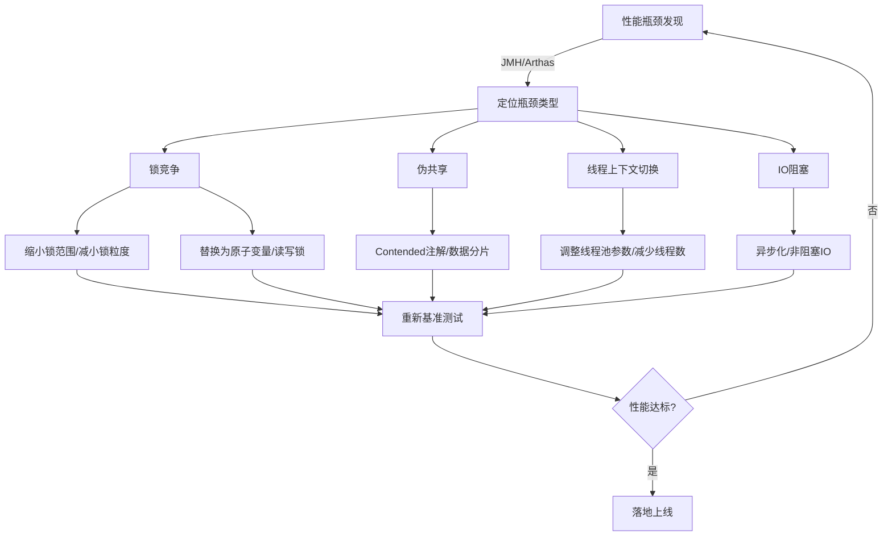

# 4-2 性能与可伸缩性优化

## 🎯 三大核心维度定义

### 核心定位
性能（响应时间/吞吐量）与可伸缩性（增加资源时吞吐量的提升能力）是并发程序的核心评价指标，Amdahl 定律量化了并行化的性能上限，而减少锁竞争是提升可伸缩性的核心手段。

### 核心行为语义
1. Amdahl 定律：`加速比 = 1 / ( (1 - 并行化比例) + 并行化比例 / 处理器数量 )`，并行化比例越低，多核提升效果越差🌏。
2. 线程开销的核心来源：上下文切换（CPU 寄存器/程序计数器保存恢复）、内存同步（锁/volatile 的内存屏障）、线程创建/销毁（JVM 的 Thread 对象分配/GC）⛰️。
3. 减少锁竞争的 5 大策略（JCiP 11.4）：缩小锁范围、减小锁粒度、使用非阻塞同步、使用读写锁、避免热点域。

### 核心设计思想
1. 性能优化需「量化先行」：通过基准测试（JMH）测量瓶颈，而非主观推断。
2. 可伸缩性优化的核心是「减少共享可变状态」：无状态设计 > 有状态分片 > 全局共享锁。
3. 异步化（如 CompletableFuture）是提升吞吐量的关键，将阻塞 IO 转为非阻塞，释放线程资源。

---

## 1. 基础层（书本定义）

📘 JCiP 11.1 原文核心定义：性能是指程序的响应时间、吞吐量或资源利用率；可伸缩性是指当增加计算资源（如 CPU 核心、内存）时，程序性能能够相应提升的能力。

📘 JCiP 11.2 原文：Amdahl 定律揭示了并行程序的性能上限，即使无限增加处理器数量，加速比也受限于程序的串行部分。

📘 JCiP 11.4 原文：减少锁竞争的策略：①缩小锁范围（锁粗化的反向操作，仅在必要时加锁）；②减小锁粒度（如 ConcurrentHashMap 的分段锁）；③使用非阻塞同步（原子变量）；④使用读写锁（ReadWriteLock，读多写少时提升并发）；⑤避免热点域（如将计数器分片为多个独立计数器）。

📗 《Java 并发编程的艺术》11.1-11.5 原文：性能测试的核心指标（吞吐量、响应时间、延迟）；异步任务池的设计（核心线程数、最大线程数、队列的选择）；线程池的拒绝策略与资源隔离。

---

## 2. 实现层（JVM 底层⛰️）

⛰️ JVM 锁优化：
- 锁消除：JIT 编译器通过逃逸分析，发现锁对象仅在当前线程使用（无逃逸），则消除锁（如 `StringBuffer.append()` 在单线程下的锁消除）。
- 锁粗化：JIT 将多次连续的加锁/解锁合并为一次（如循环内的 synchronized），减少锁操作开销。
- 偏向锁/轻量级锁/重量级锁升级：偏向锁减少无竞争时的开销（Mark Word 标记线程 ID），轻量级锁通过 CAS 自旋避免内核态切换，重量级锁依赖 OS 互斥量（mutex）。

⛰️ JVM 线程池底层：`ThreadPoolExecutor` 的核心线程由 `Worker` 类封装，Worker 持有 `AQS` 的独占锁，任务队列基于 `BlockingQueue`（如 `ArrayBlockingQueue` 基于 ReentrantLock）。

⛰️ JMH（Java Microbenchmark Harness）底层：JVM 预热（JIT 编译）、避免死代码消除、精准计时（基于 `System.nanoTime()`），保证基准测试的准确性。

---

## 3. 机制层（CSAPP 硬件原理🌏）

🌏 Amdahl 定律的硬件本质：CPU 核心的并行度受限于串行指令流，即使多核，串行部分仍会成为瓶颈（如全局锁的临界区）。

🌏 锁竞争的硬件代价：
- 伪共享（False Sharing）：多个线程修改的变量落在同一 CPU 缓存行（64 字节），导致 MESI 协议触发缓存失效（Cache Miss），CPU 需从主存加载数据，性能下降 10~100 倍。
- CAS 自旋的 CPU 开销：CAS 是 `cmpxchg` 指令（带 lock 前缀），自旋时占用 CPU 核心，无竞争时高效，高竞争时导致 CPU 100% 且吞吐量下降。

🌏 上下文切换的硬件代价：CPU 需保存当前线程的寄存器（通用寄存器、程序计数器 PC）、MMU 页表，切换到目标线程的上下文，一次切换约消耗 1~10 微秒，高频切换会吞噬 CPU 资源。

---

## 4. 核心代码示例

```java
// 📘 JCiP Listing 11.4 缩小锁范围（正确示例）
public class NarrowLockScope {
    private final Object lock = new Object();
    private Map<String, String> cache = new HashMap<>();

    // 反例：锁覆盖整个方法，包含非临界区（日志、IO）
    public String badGet(String key) {
        synchronized (lock) {
            System.out.println("Getting key: " + key); // 非临界区
            if (cache.containsKey(key)) {
                return cache.get(key);
            }
            // 模拟IO（非临界区）
            String value = loadFromDB(key);
            cache.put(key, value);
            return value;
        }
    }

    // 正例：仅锁临界区（cache操作）
    public String goodGet(String key) {
        System.out.println("Getting key: " + key); // 移出锁外
        String value;
        synchronized (lock) {
            if (cache.containsKey(key)) {
                value = cache.get(key);
            } else {
                value = null; // 仅在锁内判断，IO移出锁外
            }
        }
        if (value == null) {
            value = loadFromDB(key); // IO操作移出锁外
            synchronized (lock) {
                cache.put(key, value); // 二次检查加锁（避免重复加载）
            }
        }
        return value;
    }

    private String loadFromDB(String key) {
        // 模拟DB查询
        try {
            Thread.sleep(10);
        } catch (InterruptedException e) {
            Thread.currentThread().interrupt();
        }
        return "value-" + key;
    }
}

// 📗 《Java并发编程的艺术》11.3 线程池优化示例（核心参数调优）
public class ThreadPoolOptimization {
    // 核心参数计算：CPU密集型（核心数+1），IO密集型（核心数*2）
    private static final int CPU_CORES = Runtime.getRuntime().availableProcessors();
    // IO密集型任务池（如HTTP请求、DB操作）
    private static final ExecutorService IO_INTENSIVE_POOL = new ThreadPoolExecutor(
            CPU_CORES * 2, // 核心线程数
            CPU_CORES * 4, // 最大线程数
            60L, TimeUnit.SECONDS, // 空闲线程存活时间
            new LinkedBlockingQueue<>(1000), // 有界队列（避免OOM）
            new ThreadFactory() { // 自定义线程工厂（命名+优先级）
                private final AtomicInteger count = new AtomicInteger(0);
                @Override
                public Thread newThread(Runnable r) {
                    Thread t = new Thread(r);
                    t.setName("io-pool-thread-" + count.incrementAndGet());
                    t.setPriority(Thread.NORM_PRIORITY);
                    return t;
                }
            },
            new ThreadPoolExecutor.CallerRunsPolicy() // 拒绝策略（调用方执行，避免任务丢失）
    );

    // 伪共享解决：@Contended注解（JVM 8+），将变量放到独立缓存行
    @Contended
    private static class ShardedCounter {
        private final AtomicLong[] counters;
        private final int shards;

        public ShardedCounter(int shards) {
            this.shards = shards;
            this.counters = new AtomicLong[shards];
            for (int i = 0; i < shards; i++) {
                counters[i] = new AtomicLong(0);
            }
        }

        public void increment() {
            int index = Thread.currentThread().hashCode() % shards;
            counters[index].incrementAndGet();
        }

        public long getTotal() {
            long total = 0;
            for (AtomicLong counter : counters) {
                total += counter.get();
            }
            return total;
        }
    }
}

// JMH基准测试示例（量化性能）
import org.openjdk.jmh.annotations.*;
import java.util.concurrent.TimeUnit;

@BenchmarkMode(Mode.Throughput) // 吞吐量模式
@OutputTimeUnit(TimeUnit.SECONDS)
@Warmup(iterations = 3, time = 1) // 预热3轮，每轮1秒
@Measurement(iterations = 5, time = 1) // 测量5轮，每轮1秒
@Fork(1) // 1个进程
@State(Scope.Benchmark)
public class LockPerformanceBenchmark {
    private final NarrowLockScope narrowLock = new NarrowLockScope();
    private final ThreadPoolOptimization.ShardedCounter shardedCounter = 
        new ThreadPoolOptimization.ShardedCounter(Runtime.getRuntime().availableProcessors());

    @Benchmark
    public String testNarrowLock() {
        return narrowLock.goodGet("test-key");
    }

    @Benchmark
    public void testShardedCounter() {
        shardedCounter.increment();
    }
}
```

---

## 5. 性能调优核心流程图



---
