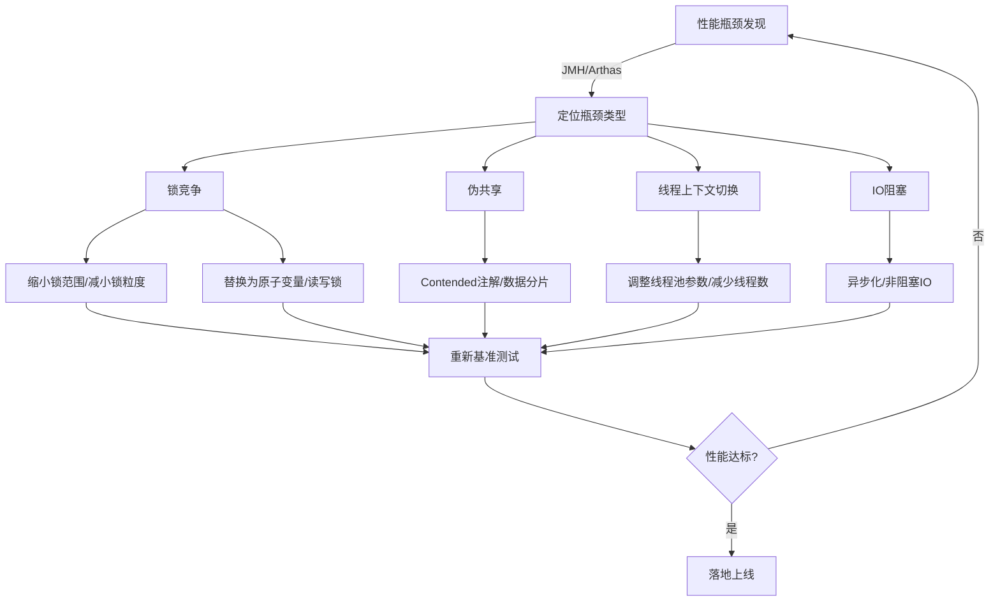

# 并发学习阶段 4 性能优化与全体系闭环 完整知识整合文档
## 🎯 总纲：三层联动的【性能优化与全体系闭环】认知逻辑
### 总纲核心定义
本阶段围绕并发性能优化与全体系闭环展开，从 [[第12章 并发|CSAPP 硬件层]]（CPU 缓存、指令、Amdahl 定律）🌏拆解性能瓶颈的底层根源，到 JVM 层（锁消除 / 锁粗化、内存模型、GC 联动）⛰️解析中间层优化逻辑，最终落地到 Java 应用层（死锁 / 活锁解决、锁竞争优化、原子变量 / 非阻塞算法、异步任务框架设计），形成「硬件根源→JVM 优化→应用落地」的全链路性能调优认知。
### 三层映射关系表
|     层级      |                         核心研究对象                         |                        解决的核心问题                        |
| :-----: | :----------------------------------------------------------: | :----------------------------------------------------------: |
| CSAPP 硬件层🌏 | CPU 缓存行 / 伪共享、MESI 协议、CAS 指令、CPU 利用率、Amdahl 定律、指令级并行 | 解析并发性能瓶颈的硬件根源（如伪共享导致缓存失效、CAS 自旋占用 CPU），量化性能提升上限 |
|  JVM 实现层⛰️  | JVM 锁消除 / 锁粗化优化、JMM 内存模型（重排序 / 内存屏障）、GC 与并发线程的联动、@Contended 注解实现、原子类的 JVM 底层封装 | 解决 JVM 层面的并发优化问题（如锁优化减少开销、内存模型保证可见性 / 有序性） |
|  Java 应用层  | 死锁 / 活锁 / 饥饿问题、锁竞争优化策略、AQS 同步器、原子变量类、非阻塞算法、异步任务池 / 生产者 - 消费者模式 | 落地并发性能调优实践，定位并解决应用层性能瓶颈，设计高并发异步框架 |
### 两书核心知识点映射表
| JCiP 章节 |                           核心内容                           |  《Java 并发编程的艺术》对应章节   |                  底层绑定                  |
| :-------: | :----------------------------------------------------------: | :--------------------------------: | :----------------------------------------: |
| 10.1-10.3 |   死锁 4 大条件、死锁避免 / 诊断、饥饿 / 活锁等活跃性问题    |                 -                  |        操作系统进程 / 线程死锁检测🌏        |
| 11.1-11.6 | 性能与可伸缩性、Amdahl 定律、线程开销、减少锁竞争的 5 种策略 | 11.1-11.5（性能测试 / 异步任务池） | Amdahl 定律🌏、CPU 利用率分析🌏、JVM 锁优化⛰️ |
| 14.1-14.6 | 状态依赖性管理、条件队列、AQS 核心设计、JUC 同步器的 AQS 实现 |                 -                  |      JVM 底层同步机制⛰️、CPU 原子指令🌏      |
| 15.1-15.5 |  锁的劣势、硬件 CAS 支持、原子变量类、非阻塞算法、ABA 问题   |     7.1-7.5（原子变量类实现）      |  CPU CAS 指令🌏、伪共享🌏、JVM 原子类封装⛰️   |
| 16.1-16.3 |         JMM 设计目标、重排序、安全发布、初始化安全性         |                 -                  |       JVM 内存屏障⛰️、CPU 指令重排序🌏       |
---

## 1. 活跃性问题与死锁治理（JCiP 10.1-10.3）
### 1.1 三大核心维度定义
#### 核心定位
死锁与活跃性问题是并发程序中「线程无法推进执行」的核心故障类型，是并发稳定性的基础红线，解决此类问题是保障并发程序可运行的前提，也是性能优化的前置条件。

#### 核心行为语义
1. 死锁必须同时满足互斥、持有并等待、不可剥夺、循环等待四大条件，缺一不可，破坏任一条件即可避免死锁。
2. 饥饿是线程因无法获取所需资源（如锁、CPU 时间片）而长期无法执行，活锁是线程虽未阻塞但反复执行无效操作，二者均属于「线程可运行但无法完成任务」的活跃性问题。
3. 活跃性问题无法通过编译期检测发现，只能通过运行期诊断、设计层面规避解决。

#### 核心设计思想
1. 死锁规避的核心是打破四大条件中的至少一个（如按序获取锁打破循环等待、超时释放锁打破持有并等待）。
2. 活跃性问题治理需「预防为主、诊断为辅」，设计阶段规避风险，运行阶段通过工具定位根因。

### 1.2 基础层（书本定义）
📘 JCiP 10.1 原文核心定义：死锁是指两个或多个线程互相持有对方所需的资源，而彼此都无法释放资源，导致所有线程都无法继续执行的状态；死锁的四个必要条件：

1. 互斥条件（资源不能被共享，只能由一个线程使用）；
2. 持有并等待条件（线程持有一个资源的同时，等待获取另一个资源）；
3. 不可剥夺条件（线程已获取的资源不能被强制剥夺，只能由线程主动释放）；
4. 循环等待条件（存在一个线程链，每个线程都等待下一个线程持有的资源）。

📘 JCiP 10.2 原文：避免死锁的常用策略包括：

1. 按固定顺序获取锁（打破循环等待）、
2. 定时尝试获取锁（超时放弃，打破持有并等待）、
3. 使用显式锁的 tryLock 方法而非阻塞获取锁、
4. 统一资源申请入口并检查循环等待。

📘 JCiP 10.3 原文：

- 饥饿通常由「优先级倒置」「锁长期被独占」导致，解决饥饿需保证资源公平分配（如公平锁），
- 活锁通常由「重试机制无退避策略」导致（如两个线程同时释放锁又同时获取对方的锁）；解决活锁需引入随机退避或优先级机制。

### 1.3 实现层（JVM 底层⛰️）
⛰️ JVM 层面，死锁可通过 jstack 工具检测，JVM 会在线程 dump 中标记死锁线程，并列出每个线程持有的锁和等待的锁；其底层原理是 JVM 维护了线程 - 锁的关联映射表，当检测到循环等待关系时，判定为死锁。

⛰️ 饥饿问题在 JVM 中可通过线程优先级配置（Thread.setPriority）辅助缓解，但 JVM 对线程优先级的映射依赖于操作系统，不同 OS 的优先级调度策略不同，无法完全保证公平性。

⛰️ JVM 的线程调度模型（抢占式）决定了活锁无法通过 JVM 层面自动解决，需在应用层代码中引入退避逻辑（如 Thread.sleep 随机时间）。

### 1.4 机制层（CSAPP 硬件原理🌏）
🌏 操作系统内核层面，死锁检测依赖于内核维护的资源分配图，内核通过遍历资源分配图判断是否存在循环等待；内核级线程的死锁会占用系统资源，导致 CPU 利用率异常（空闲但线程无法执行）。

🌏 活锁本质是 CPU 资源的无效消耗（线程反复执行无效操作），会导致 CPU 利用率飙高但业务吞吐量为 0，其底层是 CPU 上下文切换的无意义消耗（线程频繁切换但无有效执行）。

🌏 饥饿问题的硬件根源是 CPU 时间片调度的不公平性，高优先级线程长期抢占 CPU，低优先级线程无法获取时间片，导致任务无法推进。

### 1.5 问题排查工具链（落地层面）
| 工具/手段         | 核心操作                                             | 底层原理🌏/⛰️                                       |
| ----------------- | ---------------------------------------------------- | ------------------------------------------------- |
| jstack            | `jstack <pid>` 直接标记死锁线程，输出持锁/等待锁信息 | JVM ThreadDump 机制，遍历 ObjectMonitor 关联关系⛰️ |
| jconsole/VisualVM | 图形化界面实时监控线程状态，一键检测死锁             | 基于 JMX 获取 JVM 线程/锁数据⛰️                    |
| top/htop（Linux） | `top -H -p <pid>` 查看线程级 CPU 占用，定位活锁线程  | 读取操作系统内核的线程 CPU 调度统计🌏              |
| perf（Linux）     | `perf record -p <pid>; perf report` 分析指令级消耗   | 采样 CPU 指令执行记录，定位 CAS 自旋等无效消耗🌏   |
| 自定义锁监控      | AOP 记录锁的获取/释放时间，标记长期未释放的锁        | 基于字节码增强，无侵入式监控应用层锁行为          |

### 1.6 最佳实践（落地闭环）
| 问题类型 | 核心规避策略 | 落地实现方式                                                 | 底层原理支撑🌏/⛰️                                              |
| -------- | ------------ | ------------------------------------------------------------ | ------------------------------------------------------------ |
| 死锁     | 打破循环等待 | ①所有锁按 HashCode 升序获取；②使用 `tryLock(long timeout, TimeUnit unit)` 超时放弃；③分布式场景用 Redlock | ① HashCode 有序性保证无循环；② `tryLock` 底层调用 Unsafe 的 `park`/`unpark`，超时触发线程唤醒⛰️；③ Redlock 利用分布式时钟保证锁的原子性🌏 |
| 饥饿     | 资源公平分配 | ①使用 `ReentrantLock(true)` 公平锁；②线程池使用 `ForkJoinPool`（工作窃取算法）；③避免设置过高线程优先级 | ①公平锁底层通过 AQS 的 CLH 队列实现先到先得⛰️；②工作窃取减少核心线程抢占，提升 CPU 利用率🌏；③ OS 线程优先级映射不确定性（JVM 无法保证）⛰️ |
| 活锁     | 引入退避机制 | ①重试时添加随机 `Thread.sleep()`；②分布式场景用指数退避（Exponential Backoff）；③限制重试次数 | ①随机休眠减少线程同时竞争，降低 CPU 上下文切换🌏；②指数退避适配网络延迟，减少无效重试⛰️ |

### 1.7 核心代码示例
```java
// 📘 JCiP Listing 10.1 死锁示例（原文）
// 两个线程互相持有对方所需的锁，满足死锁四大条件
public class DeadlockExample {
    private final Object lockA = new Object();
    private final Object lockB = new Object();

    // 线程1：先获取lockA，再获取lockB
    public void method1() {
        synchronized (lockA) { // 持有lockA
            System.out.println("Thread 1 holds lockA, waiting for lockB");
            synchronized (lockB) { // 等待lockB（被线程2持有）
                System.out.println("Thread 1 holds both locks");
            }
        }
    }

    // 线程2：先获取lockB，再获取lockA
    public void method2() {
        synchronized (lockB) { // 持有lockB
            System.out.println("Thread 2 holds lockB, waiting for lockA");
            synchronized (lockA) { // 等待lockA（被线程1持有）
                System.out.println("Thread 2 holds both locks");
            }
        }
    }

    public static void main(String[] args) {
        DeadlockExample example = new DeadlockExample();
        // 启动线程1执行method1
        new Thread(example::method1).start();
        // 启动线程2执行method2
        new Thread(example::method2).start();
    }
}

// 📘 JCiP Listing 10.2 死锁避免（按序获取锁，正确示例）
public class DeadlockAvoidance {
    private final Object lockA = new Object();
    private final Object lockB = new Object();

    // 统一按lockA→lockB的顺序获取锁，打破循环等待
    public void safeMethod1() {
        synchronized (lockA) {
            synchronized (lockB) {
                System.out.println("Safe method1 holds both locks");
            }
        }
    }

    public void safeMethod2() {
        synchronized (lockA) { // 不再先获取lockB，统一顺序
            synchronized (lockB) {
                System.out.println("Safe method2 holds both locks");
            }
        }
    }
}

// 活锁解决：引入随机退避
public class LivelockSolution {
    private final Lock lock1 = new ReentrantLock();
    private final Lock lock2 = new ReentrantLock();
    private static final Random RANDOM = new Random();

    public void operation1() {
        while (true) {
            if (lock1.tryLock()) {
                try {
                    if (lock2.tryLock()) {
                        try {
                            System.out.println("Operation1 acquired both locks");
                            return;
                        } finally {
                            lock2.unlock();
                        }
                    }
                } finally {
                    lock1.unlock();
                }
            }
            // 随机退避，避免同时重试
            try {
                Thread.sleep(RANDOM.nextInt(100));
            } catch (InterruptedException e) {
                Thread.currentThread().interrupt();
            }
        }
    }

    public void operation2() {
        while (true) {
            if (lock2.tryLock()) {
                try {
                    if (lock1.tryLock()) {
                        try {
                            System.out.println("Operation2 acquired both locks");
                            return;
                        } finally {
                            lock1.unlock();
                        }
                    }
                } finally {
                    lock2.unlock();
                }
            }
            // 随机退避
            try {
                Thread.sleep(RANDOM.nextInt(100));
            } catch (InterruptedException e) {
                Thread.currentThread().interrupt();
            }
        }
    }
}
```

---

## 2. 性能与可伸缩性（JCiP 11.1-11.6 + 《Java 并发编程的艺术》11.1-11.5）
### 2.1 三大核心维度定义
#### 核心定位
性能（响应时间/吞吐量）与可伸缩性（增加资源时吞吐量的提升能力）是并发程序的核心评价指标，Amdahl 定律量化了并行化的性能上限，而减少锁竞争是提升可伸缩性的核心手段。

#### 核心行为语义
1. Amdahl 定律：`加速比 = 1 / ( (1 - 并行化比例) + 并行化比例 / 处理器数量 )`，并行化比例越低，多核提升效果越差🌏。
2. 线程开销的核心来源：上下文切换（CPU 寄存器/程序计数器保存恢复）、内存同步（锁/volatile 的内存屏障）、线程创建/销毁（JVM 的 Thread 对象分配/GC）⛰️。
3. 减少锁竞争的 5 大策略（JCiP 11.4）：缩小锁范围、减小锁粒度、使用非阻塞同步、使用读写锁、避免热点域。

#### 核心设计思想
1. 性能优化需「量化先行」：通过基准测试（JMH）测量瓶颈，而非主观推断。
2. 可伸缩性优化的核心是「减少共享可变状态」：无状态设计 > 有状态分片 > 全局共享锁。
3. 异步化（如 CompletableFuture）是提升吞吐量的关键，将阻塞 IO 转为非阻塞，释放线程资源。

### 2.2 基础层（书本定义）
📘 JCiP 11.1 原文核心定义：性能是指程序的响应时间、吞吐量或资源利用率；可伸缩性是指当增加计算资源（如 CPU 核心、内存）时，程序性能能够相应提升的能力。

📘 JCiP 11.2 原文：Amdahl 定律揭示了并行程序的性能上限，即使无限增加处理器数量，加速比也受限于程序的串行部分。

📘 JCiP 11.4 原文：减少锁竞争的策略：①缩小锁范围（锁粗化的反向操作，仅在必要时加锁）；②减小锁粒度（如 ConcurrentHashMap 的分段锁）；③使用非阻塞同步（原子变量）；④使用读写锁（ReadWriteLock，读多写少时提升并发）；⑤避免热点域（如将计数器分片为多个独立计数器）。

📗 《Java 并发编程的艺术》11.1-11.5 原文：性能测试的核心指标（吞吐量、响应时间、延迟）；异步任务池的设计（核心线程数、最大线程数、队列的选择）；线程池的拒绝策略与资源隔离。

### 2.3 实现层（JVM 底层⛰️）
⛰️ JVM 锁优化：
- 锁消除：JIT 编译器通过逃逸分析，发现锁对象仅在当前线程使用（无逃逸），则消除锁（如 `StringBuffer.append()` 在单线程下的锁消除）。
- 锁粗化：JIT 将多次连续的加锁/解锁合并为一次（如循环内的 synchronized），减少锁操作开销。
- 偏向锁/轻量级锁/重量级锁升级：偏向锁减少无竞争时的开销（Mark Word 标记线程 ID），轻量级锁通过 CAS 自旋避免内核态切换，重量级锁依赖 OS 互斥量（mutex）。

⛰️ JVM 线程池底层：`ThreadPoolExecutor` 的核心线程由 `Worker` 类封装，Worker 持有 `AQS` 的独占锁，任务队列基于 `BlockingQueue`（如 `ArrayBlockingQueue` 基于 ReentrantLock）。

⛰️ JMH（Java Microbenchmark Harness）底层：JVM 预热（JIT 编译）、避免死代码消除、精准计时（基于 `System.nanoTime()`），保证基准测试的准确性。

### 2.4 机制层（CSAPP 硬件原理🌏）
🌏 Amdahl 定律的硬件本质：CPU 核心的并行度受限于串行指令流，即使多核，串行部分仍会成为瓶颈（如全局锁的临界区）。

🌏 锁竞争的硬件代价：
- 伪共享（False Sharing）：多个线程修改的变量落在同一 CPU 缓存行（64 字节），导致 MESI 协议触发缓存失效（Cache Miss），CPU 需从主存加载数据，性能下降 10~100 倍。
- CAS 自旋的 CPU 开销：CAS 是 `cmpxchg` 指令（带 lock 前缀），自旋时占用 CPU 核心，无竞争时高效，高竞争时导致 CPU 100% 且吞吐量下降。

🌏 上下文切换的硬件代价：CPU 需保存当前线程的寄存器（通用寄存器、程序计数器 PC）、MMU 页表，切换到目标线程的上下文，一次切换约消耗 1~10 微秒，高频切换会吞噬 CPU 资源。

### 2.5 核心代码示例
```java
// 📘 JCiP Listing 11.4 缩小锁范围（正确示例）
public class NarrowLockScope {
    private final Object lock = new Object();
    private Map<String, String> cache = new HashMap<>();

    // 反例：锁覆盖整个方法，包含非临界区（日志、IO）
    public String badGet(String key) {
        synchronized (lock) {
            System.out.println("Getting key: " + key); // 非临界区
            if (cache.containsKey(key)) {
                return cache.get(key);
            }
            // 模拟IO（非临界区）
            String value = loadFromDB(key);
            cache.put(key, value);
            return value;
        }
    }

    // 正例：仅锁临界区（cache操作）
    public String goodGet(String key) {
        System.out.println("Getting key: " + key); // 移出锁外
        String value;
        synchronized (lock) {
            if (cache.containsKey(key)) {
                value = cache.get(key);
            } else {
                value = null; // 仅在锁内判断，IO移出锁外
            }
        }
        if (value == null) {
            value = loadFromDB(key); // IO操作移出锁外
            synchronized (lock) {
                cache.put(key, value); // 二次检查加锁（避免重复加载）
            }
        }
        return value;
    }

    private String loadFromDB(String key) {
        // 模拟DB查询
        try {
            Thread.sleep(10);
        } catch (InterruptedException e) {
            Thread.currentThread().interrupt();
        }
        return "value-" + key;
    }
}

// 📗 《Java并发编程的艺术》11.3 线程池优化示例（核心参数调优）
public class ThreadPoolOptimization {
    // 核心参数计算：CPU密集型（核心数+1），IO密集型（核心数*2）
    private static final int CPU_CORES = Runtime.getRuntime().availableProcessors();
    // IO密集型任务池（如HTTP请求、DB操作）
    private static final ExecutorService IO_INTENSIVE_POOL = new ThreadPoolExecutor(
            CPU_CORES * 2, // 核心线程数
            CPU_CORES * 4, // 最大线程数
            60L, TimeUnit.SECONDS, // 空闲线程存活时间
            new LinkedBlockingQueue<>(1000), // 有界队列（避免OOM）
            new ThreadFactory() { // 自定义线程工厂（命名+优先级）
                private final AtomicInteger count = new AtomicInteger(0);
                @Override
                public Thread newThread(Runnable r) {
                    Thread t = new Thread(r);
                    t.setName("io-pool-thread-" + count.incrementAndGet());
                    t.setPriority(Thread.NORM_PRIORITY);
                    return t;
                }
            },
            new ThreadPoolExecutor.CallerRunsPolicy() // 拒绝策略（调用方执行，避免任务丢失）
    );

    // 伪共享解决：@Contended注解（JVM 8+），将变量放到独立缓存行
    @Contended
    private static class ShardedCounter {
        private final AtomicLong[] counters;
        private final int shards;

        public ShardedCounter(int shards) {
            this.shards = shards;
            this.counters = new AtomicLong[shards];
            for (int i = 0; i < shards; i++) {
                counters[i] = new AtomicLong(0);
            }
        }

        public void increment() {
            int index = Thread.currentThread().hashCode() % shards;
            counters[index].incrementAndGet();
        }

        public long getTotal() {
            long total = 0;
            for (AtomicLong counter : counters) {
                total += counter.get();
            }
            return total;
        }
    }
}

// JMH基准测试示例（量化性能）
import org.openjdk.jmh.annotations.*;
import java.util.concurrent.TimeUnit;

@BenchmarkMode(Mode.Throughput) // 吞吐量模式
@OutputTimeUnit(TimeUnit.SECONDS)
@Warmup(iterations = 3, time = 1) // 预热3轮，每轮1秒
@Measurement(iterations = 5, time = 1) // 测量5轮，每轮1秒
@Fork(1) // 1个进程
@State(Scope.Benchmark)
public class LockPerformanceBenchmark {
    private final NarrowLockScope narrowLock = new NarrowLockScope();
    private final ThreadPoolOptimization.ShardedCounter shardedCounter = 
        new ThreadPoolOptimization.ShardedCounter(Runtime.getRuntime().availableProcessors());

    @Benchmark
    public String testNarrowLock() {
        return narrowLock.goodGet("test-key");
    }

    @Benchmark
    public void testShardedCounter() {
        shardedCounter.increment();
    }
}
```

### 2.6 性能调优核心流程图


---

## 3. AQS同步器与状态依赖管理（JCiP 14.1-14.6）
### 3.1 三大核心维度定义
#### 核心定位
AQS（AbstractQueuedSynchronizer）是 JUC 同步器（ReentrantLock、CountDownLatch、Semaphore）的底层骨架，解决「状态依赖性」问题（线程需等待某个状态满足才能执行），是 Java 并发的核心基础设施。

#### 核心行为语义
1. AQS 核心是「状态+队列」：通过 `volatile int state` 维护同步状态，通过 CLH 双向队列（FIFO）管理等待线程。
2. 状态依赖管理的核心是条件队列：每个 ConditionObject 对应一个条件队列，线程通过 `await()` 进入条件队列，`signal()` 唤醒到同步队列。
3. AQS 支持独占模式（ReentrantLock）和共享模式（Semaphore/CountDownLatch）。

#### 核心设计思想
1. 模板方法模式：AQS 定义同步器的骨架（获取/释放锁的流程），子类实现 `tryAcquire`/`tryRelease` 等方法定制同步逻辑。
2. 非阻塞设计：AQS 的队列操作基于 CAS，避免内核态锁，提升并发性能。
3. 状态可见性：`state` 的 volatile 修饰保证多线程可见性，底层依赖 JVM 内存屏障⛰️。

### 3.2 基础层（书本定义）
📘 JCiP 14.1 原文：**状态依赖性操作**必须在前提条件满足时才能执行，若条件不满足，线程必须等待直至条件成立；内置锁的`wait/notify`是最原始的状态依赖实现，但只能关联一个条件队列，灵活性差。
📘 JCiP 14.2 原文：**条件队列**使线程能够等待某个特定条件为真，每个显式锁（`ReentrantLock`）可以关联**多个条件队列**，这是`Condition`优于`wait/notify`的核心优势，可彻底避免“惊群效应”。
📘 JCiP 14.4 原文：AQS采用**模板方法模式**，将同步器的公共逻辑（队列管理、线程阻塞/唤醒）封装在抽象类中，子类仅需实现**尝试获取/释放同步状态**的核心逻辑。
📘 JCiP 14.5 原文：AQS支持**独占式**与**共享式**两种同步模式：
- 独占模式：同一时刻仅一个线程持有同步状态（`ReentrantLock`）
- 共享模式：多个线程可同时持有同步状态（`CountDownLatch`、`Semaphore`）
📘 JCiP 14.6 原文：AQS提供**可中断、可超时、非中断**三种获取同步状态的方式，全面覆盖不同场景的状态依赖需求。

### 3.3 实现层（JVM底层⛰️）
⛰️ AQS核心数据结构：**volatile int state**（同步状态）+ **CLH变体双向同步队列**（等待线程管理），所有队列操作基于`Unsafe`的CAS指令原子完成。
⛰️ `state`变量由`volatile`修饰，JVM在其写操作后插入**StoreLoad内存屏障**，读操作前插入**LoadLoad/LoadStore屏障**，保证多线程间的可见性与有序性。
⛰️ 线程阻塞/唤醒基于`LockSupport.park()/unpark()`实现，直接映射操作系统内核态线程调度，无需依赖锁上下文，比`Object.wait/notify`更轻量。
⛰️ `ConditionObject`（条件队列）是AQS的内部类，每个条件队列独立维护等待线程，`await()`时将线程移入条件队列并释放锁，`signal()`时将节点移回同步队列等待唤醒。
⛰️ 可重入特性由AQS的`exclusiveOwnerThread`实现，记录持有锁的线程，同一线程重复获取时直接累加`state`值，无需再次竞争。

### 3.4 机制层（CSAPP硬件原理🌏）
🌏 AQS的CAS操作依赖CPU**LOCK CMPXCHG原子指令**，硬件层面锁定缓存行（MESI协议），保证指令执行的原子性，避免多核并发冲突。
🌏 CLH同步队列采用FIFO规则，线程按等待顺序排队，减少CPU缓存行频繁失效，提升硬件缓存命中率。
🌏 `LockSupport.park()`会将线程置于**TIMED_WAITING状态**，释放CPU核心资源，降低硬件功耗与上下文切换开销。
🌏 条件队列的线程切换仅涉及**内存指针修改**，无内核态互斥锁竞争，硬件级并发效率远高于内置锁的等待队列。

### 3.5 核心代码示例
```java
// 📘 JCiP Listing 14.10 基于AQS实现独占锁（原文标准示例）
public class SimpleMutex implements Lock {
    // 自定义AQS同步器
    private static class Sync extends AbstractQueuedSynchronizer {
        // 独占式获取锁
        @Override
        protected boolean tryAcquire(int acquires) {
            assert acquires == 1;
            // CAS修改state：0→1表示获取锁成功
            if (compareAndSetState(0, 1)) {
                setExclusiveOwnerThread(Thread.currentThread());
                return true;
            }
            return false;
        }

        // 独占式释放锁
        @Override
        protected boolean tryRelease(int releases) {
            assert releases == 1;
            if (getState() == 0) {
                throw new IllegalMonitorStateException();
            }
            setExclusiveOwnerThread(null);
            setState(0);
            return true;
        }

        // 创建条件队列
        Condition newCondition() {
            return new ConditionObject();
        }
    }

    private final Sync sync = new Sync();

    @Override
    public void lock() {
        sync.acquire(1);
    }

    @Override
    public void lockInterruptibly() throws InterruptedException {
        sync.acquireInterruptibly(1);
    }

    @Override
    public boolean tryLock() {
        return sync.tryAcquire(1);
    }

    @Override
    public boolean tryLock(long timeout, TimeUnit unit) throws InterruptedException {
        return sync.tryAcquireNanos(1, unit.toNanos(timeout));
    }

    @Override
    public void unlock() {
        sync.release(1);
    }

    @Override
    public Condition newCondition() {
        return sync.newCondition();
    }
}

// 📘 JCiP Listing 14.5 状态依赖：有界缓冲区（条件队列标准用法）
public class BoundedBuffer<E> {
    private final Lock lock = new ReentrantLock();
    // 非满条件：队列不满时可放入数据
    private final Condition notFull = lock.newCondition();
    // 非空条件：队列不空时可取出数据
    private final Condition notEmpty = lock.newCondition();

    private final E[] items;
    private int putPtr, takePtr, count;

    public BoundedBuffer(int capacity) {
        items = (E[]) new Object[capacity];
    }

    // 放入数据：依赖notFull条件
    public void put(E e) throws InterruptedException {
        lock.lock();
        try {
            // 循环检查条件（防止虚假唤醒）
            while (count == items.length) {
                notFull.await();
            }
            items[putPtr] = e;
            if (++putPtr == items.length) putPtr = 0;
            count++;
            notEmpty.signal();
        } finally {
            lock.unlock();
        }
    }

    // 取出数据：依赖notEmpty条件
    public E take() throws InterruptedException {
        lock.lock();
        try {
            while (count == 0) {
                notEmpty.await();
            }
            E e = items[takePtr];
            if (++takePtr == items.length) takePtr = 0;
            count--;
            notFull.signal();
            return e;
        } finally {
            lock.unlock();
        }
    }
}
```

### 3.6 问题排查（AQS常见故障）
1. **死锁**：多线程按不同顺序获取多个AQS锁，形成循环等待 → 解决方案：统一锁获取顺序。
2. **虚假唤醒**：`await()`未在循环中检查条件 → 强制使用`while(条件不满足)`包裹等待。
3. **线程泄露**：`signal()`误用为`signalAll()`，导致无效唤醒，性能损耗 → 单等待线程用`signal()`，多等待用`signalAll()`。
4. **中断丢失**：忽略`InterruptedException`，导致线程无法正常退出 → 捕获中断并恢复中断状态。

### 3.7 最佳实践
1. 状态依赖检查**必须用while循环**，禁止用if判断，抵御虚假唤醒。
2. 单一等待条件用`signal()`，多条件等待用`signalAll()`，减少无效唤醒。
3. 优先使用`lockInterruptibly()`支持中断，提升程序响应性。
4. 显式锁（AQS）用完必须`unlock()`，放入finally块防止异常泄露锁。
5. 高并发场景优先使用AQS实现的同步器，而非内置`synchronized`。

---

## 4. 原子变量与非阻塞算法（JCiP 15.1-15.5 + 《Java并发编程的艺术》7.1-7.5）
### 4.1 三大核心维度定义
#### 核心定位
原子变量基于硬件CAS指令实现**无锁同步**，非阻塞算法完全摒弃锁机制，是高并发场景下性能最优的同步方案，解决锁带来的上下文切换、死锁、优先级倒置等问题。
#### 核心行为语义
1. 原子变量：CAS+自旋，无阻塞、无调度、无线程切换开销。
2. ABA问题：CAS仅校验值相等，无法感知中间修改，是无锁算法唯一缺陷。
3. 非阻塞算法：具备**无锁、无等待、故障隔离**三大特性，单个线程故障不影响全局。
#### 核心设计思想
**乐观并发**：假设冲突极少，先执行操作，冲突则重试，而非阻塞等待；最小化共享状态竞争，提升多核可伸缩性。

### 4.2 基础层（书本定义）
📘 JCiP 15.1 原文：锁的核心劣势——**阻塞导致线程上下文切换、优先级倒置、死锁风险**，非阻塞同步基于硬件原子指令，无上述缺陷。
📘 JCiP 15.2 原文：CAS（Compare-and-Swap）包含三个操作数：内存位置V、旧预期值A、新值B；若V==A，则原子更新为B，否则返回失败。
📘 JCiP 15.4 原文：**ABA问题**：线程1读取V=A，线程2将V改为B再改回A，线程1执行CAS仍成功，但中间状态被篡改；解决方案：**版本号（AtomicStampedReference）**。
📘 JCiP 15.5 原文：非阻塞算法的核心是**线性化**，每个操作的执行结果与顺序执行完全一致，保证并发安全。
📗 《Java并发编程的艺术》7.1-7.5 原文：原子变量分4类：基本类型、引用类型、数组类型、字段更新器；`LongAdder`采用分片机制解决高并发伪共享。

### 4.3 实现层（JVM底层⛰️）
⛰️ 原子变量底层调用`Unsafe.compareAndSwapXXX`方法，直接映射CPU硬件指令。
⛰️ `AtomicStampedReference`维护**引用+int版本号**二元组，CAS同时校验两者，彻底解决ABA。
⛰️ `AtomicMarkableReference`维护**引用+boolean标记**，仅适用于简单ABA场景，多轮修改会复位。
⛰️ `AtomicXXXFieldUpdater`：反射+CAS，轻量无包装，但线程安全弱，可被直接赋值绕过。
⛰️ `LongAdder`：将单计数器拆分为`Cell[]`数组，用`@Contended`避免伪共享，高并发性能远超`AtomicLong`。

### 4.4 机制层（CSAPP硬件原理🌏）
🌏 CAS依赖CPU**LOCK前缀指令**，锁定缓存行保证原子性，MESI协议保证多核缓存一致。
🌏 伪共享：多原子变量共享64字节缓存行，导致频繁缓存失效，`@Contended`实现缓存行隔离。
🌏 CAS自旋：低竞争高效，高竞争导致CPU 100%占用，属于硬件级性能瓶颈。
🌏 非阻塞队列（Michael-Scott算法）：CAS原子更新头尾指针，无锁竞争，硬件并发效率最大化。

### 4.5 核心代码示例
```java
// 📘 JCiP Listing 15.7 非阻塞无锁栈（标准实现）
public class ConcurrentStack<E> {
    private static class Node<E> {
        public final E item;
        public Node<E> next;
        public Node(E item) {
            this.item = item;
        }
    }

    private final AtomicReference<Node<E>> top = new AtomicReference<>();

    // 入栈：CAS自旋更新栈顶
    public void push(E item) {
        Node<E> newNode = new Node<>(item);
        Node<E> oldTop;
        do {
            oldTop = top.get();
            newNode.next = oldTop;
        } while (!top.compareAndSet(oldTop, newNode));
    }

    // 出栈：CAS自旋更新栈顶
    public E pop() {
        Node<E> oldTop;
        Node<E> newTop;
        do {
            oldTop = top.get();
            if (oldTop == null) return null;
            newTop = oldTop.next;
        } while (!top.compareAndSet(oldTop, newTop));
        return oldTop.item;
    }
}

// 📘 JCiP ABA问题解决：AtomicStampedReference
public class AtomicStampedRefDemo {
    public static void main(String[] args) {
        AtomicStampedReference<String> ref = new AtomicStampedReference<>("A", 0);
        // 线程1：A→B→A
        new Thread(() -> {
            int stamp = ref.getStamp();
            ref.compareAndSet("A", "B", stamp, stamp + 1);
            int newStamp = ref.getStamp();
            ref.compareAndSet("B", "A", newStamp, newStamp + 1);
        }).start();

        // 线程2：版本号不匹配，CAS失败，避免ABA
        new Thread(() -> {
            try { Thread.sleep(100); } catch (InterruptedException e) {}
            boolean success = ref.compareAndSet("A", "C", 0, 1);
            System.out.println("CAS成功？" + success); // 输出false
        }).start();
    }
}
```

### 4.6 问题排查
1. **ABA导致数据异常**：无锁算法出现脏数据 → 改用`AtomicStampedReference`。
2. **CAS自旋CPU飙高**：高竞争下自旋耗尽CPU → 改用`LongAdder`或锁。
3. **字段更新器线程不安全**：直接赋值绕过CAS → 严格禁止直接修改字段。
4. **伪共享性能损耗**：多核并发原子变量性能差 → 用`@Contended`隔离缓存行。

### 4.7 最佳实践
1. 高并发计数优先用`LongAdder`，而非`AtomicLong`。
2. 无锁算法必须解决ABA，强一致性用`AtomicStampedReference`。
3. 原子字段更新器仅用于海量实例轻量化场景，业务代码禁用。
4. 高竞争场景放弃无锁，改用分段锁或读写锁，避免CPU空转。

---

## 5. JMM与并发安全发布（JCiP 16.1-16.3）
### 5.1 三大核心维度定义
#### 核心定位
JMM屏蔽硬件内存差异，定义**可见性、有序性、原子性**规则；安全发布保证对象**完全初始化后**才被线程访问，避免半初始化对象逸出。
#### 核心行为语义
1. 重排序：编译器/CPU优化指令顺序，破坏多线程内存一致性。
2. Happens-Before：JMM核心偏序规则，保证操作间的可见性。
3. 初始化安全性：`final`域保证构造函数完成后对所有线程可见。
#### 核心设计思想
通过**volatile/final/锁**建立Happens-Before规则，禁止有害重排序，实现安全发布与可见性。

### 5.2 基础层（书本定义）
📘 JCiP 16.1 原文：JMM为所有操作定义**偏序关系（Happens-Before）**，同步操作、volatile读写满足**全序关系**，全局唯一有序。
📘 JCiP 16.2 原文：重排序分为**编译器重排序、指令重排序、内存重排序**，JMM通过内存屏障禁止有害重排序。
📘 JCiP 16.3 原文：**安全发布4种方式**：静态初始化、volatile引用、锁、AtomicReference；**初始化安全性**：正确构造对象的final域无需同步即可全局可见。

### 5.3 实现层（JVM底层⛰️）
⛰️ JMM通过4种内存屏障保证有序性：LoadLoad、LoadStore、StoreStore、StoreLoad。
⛰️ volatile写后插入**StoreLoad屏障**，禁止写→读重排序，保证可见性。
⛰️ final域：JVM禁止将final域写入重排序到构造函数之外，保证初始化安全。
⛰️ Happens-Before规则直接映射JVM内存屏障，是可见性的语法层抽象。

### 5.4 机制层（CSAPP硬件原理🌏）
🌏 重排序根源：CPU**乱序执行**与**缓存延迟写入**，提升指令级并行。
🌏 内存屏障：CPU指令（mfence/lfence）强制缓存刷新，保证顺序执行。
🌏 全序关系：锁/volatile操作在硬件层面全局有序，任意两个操作可排先后。

### 5.5 核心代码示例
```java
// 📘 JCiP Listing 16.4 安全发布（volatile禁止重排序）
public class SafePublisher {
    private volatile Holder holder;

    public void initialize() {
        holder = new Holder(42); // volatile保证对象完全初始化后发布
    }

    public static class Holder {
        private final int value;
        public Holder(int value) {
            this.value = value;
        }
    }
}

// 📘 JCiP 初始化安全性：final域无需同步
public class SafeFinalObject {
    private final Map<String, String> states;
    public SafeFinalObject() {
        states = new HashMap<>();
        states.put("CA", "California");
        // final域保证构造函数内写入对所有线程可见
    }
    public String getState(String key) {
        return states.get(key); // 无需加锁，安全读取
    }
}
```

### 5.6 问题排查
1. **半初始化对象**：未安全发布，线程读到未初始化字段 → 用volatile/锁发布。
2. **final域失效**：构造函数中this逸出 → 禁止构造函数中发布对象引用。
3. **可见性故障**：普通变量多线程不一致 → 加volatile或锁。

### 5.7 最佳实践
1. 不可变对象用final修饰，天然安全发布，无需同步。
2. 可变对象安全发布用volatile、锁或AtomicReference。
3. 禁止在构造函数中启动线程、注册监听器，防止this逸出。

---

## 6. 底层联动深度解析（硬件→JVM→应用）
| 核心问题 | CSAPP硬件层🌏          | JVM实现层⛰️                        | Java应用层                 |
| -------- | --------------------- | --------------------------------- | -------------------------- |
| 可见性   | MESI缓存一致性        | volatile内存屏障、final初始化屏障 | volatile、锁、原子类       |
| 有序性   | CPU乱序执行           | JMM内存屏障、Happens-Before       | 禁止指令重排序、安全发布   |
| 原子性   | CAS原子指令           | Unsafe、synchronized管程          | 原子变量、锁、非阻塞算法   |
| 锁竞争   | 伪共享、上下文切换    | 锁升级、锁消除、锁粗化            | 缩小锁范围、分片锁、无锁   |
| 性能瓶颈 | Amdahl定律、CPU利用率 | JMH基准测试、GC联动               | 异步化、非阻塞IO、资源隔离 |

---

## 7. 并发问题排查与调优最佳实践
### 7.1 全链路工具链
1. 死锁：jstack、Arthas、VisualVM
2. 锁竞争：Arthas profiler、JFR、perf
3. 伪共享：perf cachestat、JOL
4. 可见性：JFR、AsyncProfiler
5. GC联动：GC日志、MAT、Arthas

### 7.2 调优黄金法则
1. **量化先行**：所有调优基于JMH/压测数据
2. **从底到上**：先硬件→再JVM→最后应用
3. **最小共享**：无状态 > ThreadLocal > 共享变量
4. **全异步化**：阻塞IO全部转为异步非阻塞
5. **资源隔离**：线程池、锁、缓存独立隔离

---

## 🎯 全体系闭环总结
1. **认知闭环**：硬件（Amdahl/伪共享）→ JVM（锁优化/内存屏障）→ 应用（无锁/同步/异步）
2. **技术闭环**：JCiP理论 + 并发艺术实战 + 底层原理 + 代码落地 + 故障排查
3. **工程闭环**：设计无锁/异步 → 开发JMH验证 → 测试压测 → 运维监控告警
4. **核心口诀**：
   死锁靠破环，活锁靠退避；
   性能看串行，锁优缩粒度；
   无锁防ABA，版本是利器；
   JMM靠屏障，发布用final。当前文件内容过长，豆包只阅读了前 57%。