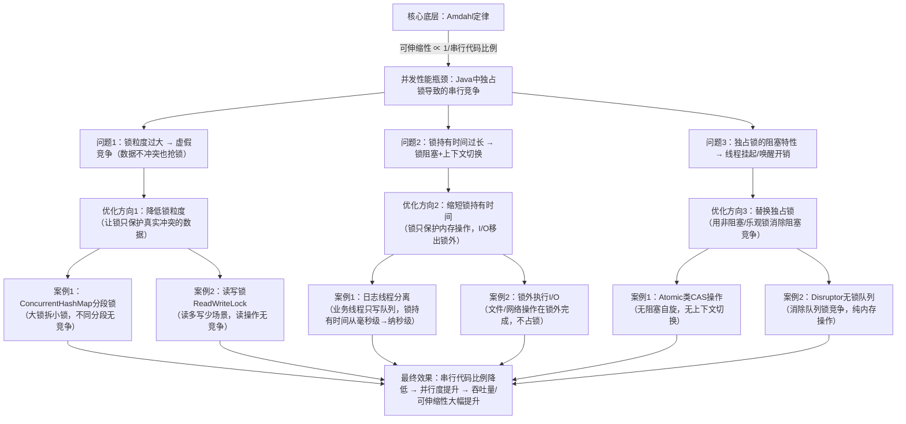

# 并发性能优化全景图
先给你一张完整的逻辑闭环图，把Amdahl定律、锁竞争、分段锁、日志线程分离这些知识点全部串起来：

## 一、底层逻辑：所有优化的起点（Amdahl定律）
你之前书里小结提到的Amdahl定律，是所有并发性能优化的底层依据：
> 程序的可伸缩性，取决于**必须串行执行的代码比例**。串行代码越少，能并行的部分就越多，加CPU才能真正提升性能。
而Java并发中，串行代码的最大来源，就是**独占锁的竞争**——所有抢同一把锁的线程，都会被强制串行执行，哪怕数据本身没有冲突。
## 二、三大瓶颈拆解（对应你之前纠结的问题）
### 瓶颈1：锁粒度过大 → 虚假竞争
这就是你之前问的「锁竞争频率高于数据竞争频率」的本质：
- 例子：`synchronized HashMap`的单锁保护整个Map，线程A访问key=X、线程B访问key=Y，数据完全不冲突，却要抢同一把锁，这就是**虚假竞争**。
- 问题：锁保护的范围，比数据真实冲突的范围大太多，引入了不必要的串行。
### 瓶颈2：锁持有时间过长 → 锁阻塞+上下文切换
这就是你说的「流锁伴随上下文切换，产生性能延迟」的本质：
- 例子：业务线程写日志时，锁保护着磁盘I/O操作，线程被阻塞时还占着锁，其他线程只能干等；锁持有时间越长，竞争概率越高，触发的上下文切换（线程挂起/唤醒）就越多，开销越大。
- 问题：锁保护了慢操作，导致锁长期被占用，竞争从“概率事件”变成“必然事件”。
### 瓶颈3：独占锁的阻塞特性 → 线程调度开销
- 抢不到锁的线程，会被操作系统从CPU上挂起、放入等待队列，被唤醒时还要重新调度，这个过程就是**上下文切换**，属于内核态的高开销操作，频繁切换会把CPU资源浪费在调度上，而不是业务逻辑上。
---

## 三、三大优化方向（串起你学过的所有案例）
### 方向1：降低锁粒度（解决虚假竞争）
核心逻辑：让锁的粒度和数据冲突的粒度对齐，数据不冲突的操作，不用抢同一把锁。
- 对应案例：`ConcurrentHashMap`的分段锁（旧版）/桶级锁（新版），把保护整个Map的大锁，拆成保护单个分段/桶的小锁，只有访问同一个分段的key才会竞争，彻底消除虚假竞争。
- 大白话类比：把“所有人抢一把水桶”，改成“每个人抢自己分段的水桶”，数据不冲突的人不用挤在一起。

### 方向2：缩短锁持有时间（解决长竞争+阻塞）
核心逻辑：锁只保护最快的内存操作，把慢的I/O、阻塞操作移出锁的范围，锁持有时间越短，竞争概率越低，上下文切换越少。
- 对应案例：日志线程分离，业务线程把日志消息扔到队列（锁只保护队列`put`，纳秒级完成），锁立刻释放，不用等磁盘I/O；专门的日志线程处理I/O，几乎没人抢锁。
- 大白话类比：把“拿着水桶跑着去河边打水”，改成“把水装到筐里就放下，专门的人去打水”，你不用占着水桶，也不用等打水。

### 方向3：替换独占锁（消除阻塞竞争）
核心逻辑：用非阻塞的方式实现同步，避免线程被挂起，比如CAS乐观锁，抢不到锁就重试，不触发操作系统调度，上下文切换开销几乎为0。
- 对应案例：`AtomicInteger`的CAS操作、Disruptor无锁队列，都是用“乐观重试”替代“阻塞等待”，彻底消除独占锁的阻塞开销。

---

## 四、最终闭环：所有优化的本质
你会发现，不管是分段锁、日志线程分离，还是CAS无锁化，所有优化的核心目标只有一个：
**降低串行代码的比例，让锁竞争只发生在真实冲突的场景，且竞争时间尽可能短**。

这完全贴合Amdahl定律：串行代码比例越低，可伸缩性越强，线程越多，吞吐量提升越明显。

---

