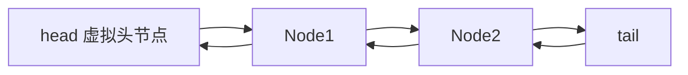
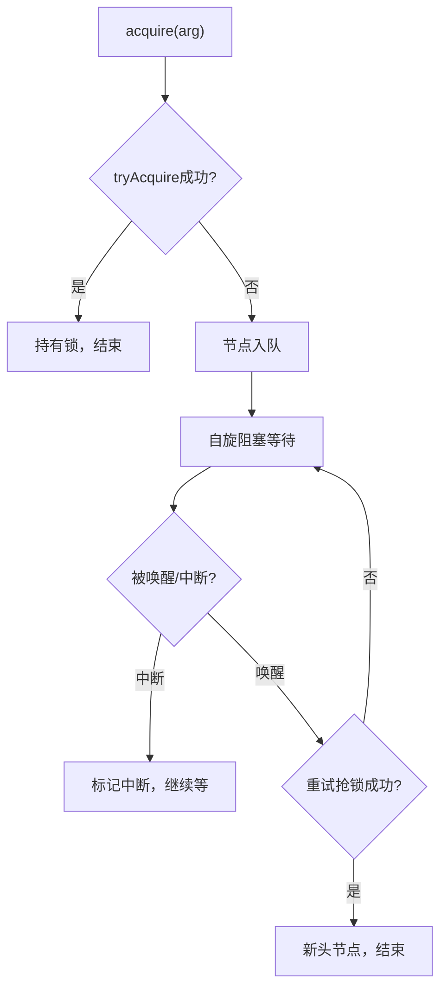
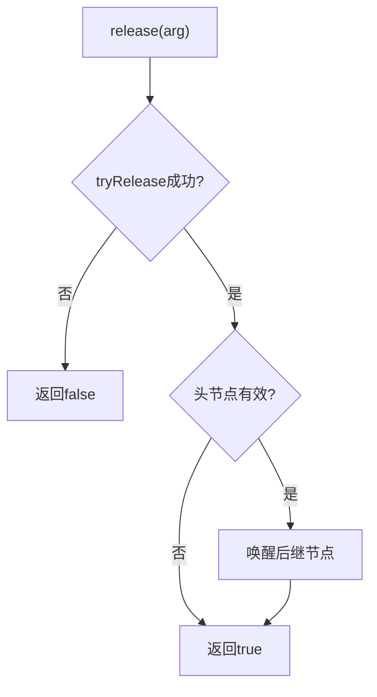
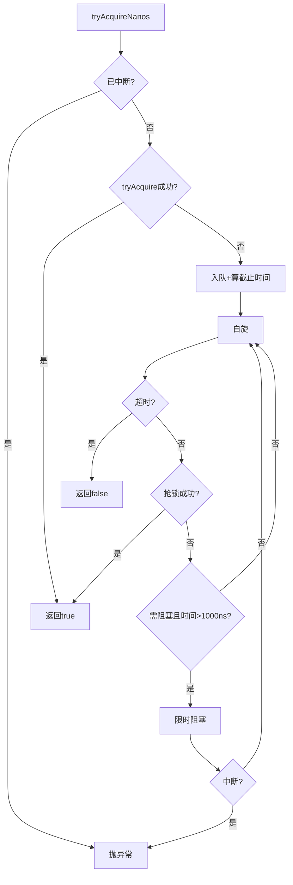

# Java并发编程艺术·AQS队列同步器（思想+极简源码流程版）
**定位**：架构思想为主 + 极简源码流程 + 兼容流程图 + 核心注释 | 对标书本第5章 | 重点精讲TwinsLock
## 目录
1. AQS核心总览（设计思想）
2. 底层结构：同步队列+Node（核心数据思想）
3. 独占式：获取/释放（核心流程）
4. 独占进阶：可中断/超时（变体流程）
5. 共享式：获取/释放（并发思想）
6. 底层公共方法（支撑逻辑）
7. 压轴：自定义同步器TwinsLock（实战思想）
8. 总结（体系思想）
# AQS 架构师精简版
## 一、核心定位
AQS（AbstractQueuedSynchronizer）是 JUC 所有同步工具（ReentrantLock/Semaphore/CountDownLatch 等）的**底层骨架**，核心解决“多线程竞争有限同步资源”的架构问题：
- 统一管理同步状态、等待队列、线程阻塞/唤醒；
- 通过模板方法模式，抽象通用流程，让子类仅需实现同步规则，无需关注底层队列/阻塞逻辑。
## 二、核心设计模式：模板方法
| 层级                  | 架构职责                                    | 设计目的                       |
| --------------------- | ------------------------------------------- | ------------------------------ |
| 模板方法（final）     | 封装队列管理、阻塞/唤醒、中断处理等通用流程 | 保证核心流程统一，避免子类出错 |
| 钩子方法（protected） | 子类自定义同步状态的获取/释放规则           | 按需定制同步规则，职责单一     |
| 工具方法（private）   | 底层 CAS/自旋/队列操作                      | 屏蔽底层细节，支撑模板方法     |
## 三、核心架构组件（职责化设计）
| 组件              | 架构职责                           | 核心设计选型                                   |
| ----------------- | ---------------------------------- | ---------------------------------------------- |
| 同步状态（state） | 核心数据载体：表征“锁/资源”的状态  | volatile + CAS（保证并发安全）                 |
| CLH 双向队列      | 管理等待线程，解决“排队抢资源”问题 | 双向链表（支持反向遍历清理）+ CAS 原子更新头尾 |
| LockSupport       | 线程阻塞/唤醒的底层工具            | 封装内核态/用户态切换，替代 Object.wait/notify |
## 四、核心流程（架构级）
### 1. 通用核心逻辑
```
线程抢资源 → 修改state（CAS）→ 成功则执行 → 失败则入队自旋 → 释放资源时唤醒后继
```
### 2. 两大核心模式
| 模式     | 核心特征（架构级）               | 典型应用                 |
| -------- | -------------------------------- | ------------------------ |
| 独占模式 | 单线程持有，state 表征重入次数   | ReentrantLock            |
| 共享模式 | 多线程并发，state 表征剩余资源数 | Semaphore/CountDownLatch |
#### 关键差异（架构视角）
- 独占：释放时仅唤醒**一个**后继节点，保证互斥；
- 共享：释放时**批量传播唤醒**，充分利用共享资源。
## 五、关键架构设计决策
1. **状态与队列分离**：state 仅管状态，队列仅管等待，职责解耦；
2. **虚拟头节点**：简化队列操作（仅前驱为头节点的线程可抢锁），避免空指针/边界处理；
3. **条件队列与同步队列分离**：Condition 专属单向链表，与同步队列解耦，适配 await/signal 场景；
4. **自旋+阻塞结合**：短时间自旋减少系统调用，超时/自旋失败则阻塞，平衡性能与资源占用；
5. **中断仅标记不抛异常（默认）**：保证队列流程不被中断打乱，适配“死等锁”场景。
## 六、架构价值
1. **复用性**：JUC 所有同步器基于 AQS 实现，仅需重写少量钩子方法；
2. **扩展性**：通过钩子方法支持公平/非公平锁、独占/共享模式等定制化规则；
3. **高性能**：CAS 自旋+按需阻塞，减少内核态切换开销，适配高并发场景。
## 七、核心总结（架构师视角）
AQS 本质是“**状态驱动的队列等待模型**”：
- 以 state 为核心驱动力，通过 CAS 保证状态原子性；
- 以 CLH 队列为等待载体，保证线程排队的公平性；
- 以模板方法为架构骨架，保证同步器的通用性与扩展性；
- 以 LockSupport 为底层支撑，保证线程阻塞/唤醒的高效性。
整个设计围绕“**极简核心+分层扩展**”：核心流程（模板方法）固化，同步规则（钩子方法）开放，底层细节（工具方法）屏蔽，是并发编程中“开闭原则”的经典实践。
---

------


# 1. AQS核心总览（设计思想）

## 核心思想
AQS = **模板方法骨架** + **state状态驱动** + **CLH队列等待**
- 父类定流程（acquire/release），子类定规则（tryAcquire/tryRelease）
- 用`state`表示锁/资源，用**CAS 🌏**原子修改
- 抢不到锁就进入**CLH队列 ⛰️**，阻塞等待唤醒

## 三层方法（思想核心）
1. **模板方法（final）**：统一流程，不可重写 → acquire/release
2. **钩子方法（protected）**：子类实现抢锁/释放规则 → tryAcquire/tryRelease
3. **底层方法**：队列、CAS、阻塞、唤醒 → addWaiter/unpark

---

# 2. 底层结构：同步队列+Node（数据思想）
## 设计思想
- **Node**：封装等待线程 + 等待状态 + 双向链接
- **CLH双向队列**：FIFO排队，头节点是持有锁的线程
- **state**：volatile ⛰️ 保证可见性，CAS 🌏 保证原子性

## 极简Node源码（核心）
```java
static final class Node {
    static final int CANCELLED = 1;  // 取消
    static final int SIGNAL    = -1; // 后继需唤醒
    static final int CONDITION = -2; // 条件队列
    static final int PROPAGATE = -3; // 共享传播

    volatile int waitStatus; // ⛰️
    volatile Node prev, next; // ⛰️ 双向链表
    volatile Thread thread;  // ⛰️
    static final Node EXCLUSIVE = null; // 独占标记
    static final Node SHARED = new Node(); // 共享标记
}
```

## AQS核心属性
```java
public abstract class AbstractQueuedSynchronizer {
    private transient volatile Node head, tail; // ⛰️ 队列头尾
    private volatile int state; // ⛰️ 同步状态
}
```

## 队列结构（兼容流程图）


---

# 3. 独占式：获取/释放（核心流程）
## 3.1 独占获取 acquire(int arg)
### 设计思想
1. 先**tryAcquire**抢一次（子类规则）
2. 抢不到 → **入队** → **自旋阻塞**
3. **不响应中断**，只标记状态

### 极简源码
```java
public final void acquire(int arg) {
    if (!tryAcquire(arg) && acquireQueued(addWaiter(Node.EXCLUSIVE), arg))
        selfInterrupt(); // ⛰️ 补中断
}
protected boolean tryAcquire(int arg) { throw new UnsupportedOperationException(); }
```

### 执行流程图（100%兼容）


## 3.2 独占释放 release(int arg)
### 设计思想
1. **tryRelease**释放state
2. 成功则**唤醒后继节点**

### 极简源码
```java
public final boolean release(int arg) {
    if (tryRelease(arg)) {
        Node h = head;
        if (h != null && h.waitStatus != 0)
            unparkSuccessor(h); // ⛰️🌏 唤醒后继
        return true;
    }
    return false;
}
```

### 流程图（兼容）


---

# 4. 独占进阶：可中断/超时（变体思想）
## 4.1 可中断 acquireInterruptibly
### 思想
- **全程响应中断**，一中断就抛异常退出队列

### 极简源码
```java
public final void acquireInterruptibly(int arg) throws InterruptedException {
    if (Thread.interrupted()) throw new InterruptedException();
    if (!tryAcquire(arg)) doAcquireInterruptibly(arg);
}
```

## 4.2 超时获取 tryAcquireNanos
### 思想
- **限时抢锁**，超时返回false，中断抛异常
- 剩余时间<1000ns**自旋优化 🌏**，不阻塞

### 极简源码
```java
public final boolean tryAcquireNanos(int arg, long nanosTimeout) throws InterruptedException {
    if (Thread.interrupted()) throw new InterruptedException();
    return tryAcquire(arg) || doAcquireNanos(arg, nanosTimeout);
}
```

### 流程图（兼容）


---

# 5. 共享式：获取/释放（并发思想）
## 设计思想
- **多线程并发持有**，state表示剩余资源数
- 唤醒**向后传播 🌏**，批量唤醒队列节点
- 钩子返回int：>0有剩余、=0无剩余、<0失败

## 5.1 共享获取 acquireShared
### 极简源码
```java
public final void acquireShared(int arg) {
    if (tryAcquireShared(arg) < 0)
        doAcquireShared(arg); // ⛰️🌏 入队等待
}
```

## 5.2 共享释放 releaseShared
### 极简源码
```java
public final boolean releaseShared(int arg) {
    if (tryReleaseShared(arg)) {
        doReleaseShared(); // 🌏 传播唤醒
        return true;
    }
    return false;
}
```

## 独占 VS 共享（思想对比）
| 维度  | 独占          | 共享                     |
| ----- | ------------- | ------------------------ |
| state | 0空闲/1占用 ⛰️ | 剩余资源数 ⛰️             |
| 并发  | 单线程        | 多线程                   |
| 唤醒  | 唤醒1个 ⛰️     | 传播唤醒 🌏               |
| 场景  | ReentrantLock | Semaphore/CountDownLatch |

---

# 6. 底层公共方法（支撑思想）
只保留**4个核心方法**，不讲冗余细节：
1. **addWaiter**：节点入队 🌏
2. **acquireQueued**：独占自旋阻塞 ⛰️
3. **shouldParkAfterFailedAcquire**：判断是否阻塞 ⛰️
4. **unparkSuccessor**：唤醒后继 ⛰️🌏

---

# 7. 压轴：自定义同步器TwinsLock（实战思想）
## 设计思想（书本核心）
- **最多2个线程并发**的共享锁
- 只重写**tryAcquireShared/tryReleaseShared**
- 完全复用AQS队列、阻塞、唤醒逻辑

## 同步状态规则
- state=0：空闲
- state=1：1个线程执行
- state=2：满员，后续排队

## 极简完整源码（核心）
```java
public class TwinsLock implements Lock {
    private static final class Sync extends AbstractQueuedSynchronizer {
        private static final int MAX = 2;

        // 共享获取：CAS+1，≤2成功
        @Override
        protected int tryAcquireShared(int acquires) {
            for (;;) {
                int s = getState();
                if (s >= MAX) return -1;
                if (compareAndSetState(s, s + acquires)) return s + acquires;
            }
        }

        // 共享释放：CAS-1
        @Override
        protected boolean tryReleaseShared(int releases) {
            for (;;) {
                int s = getState();
                if (compareAndSetState(s, s - releases)) return true;
            }
        }
    }

    private final Sync sync = new Sync();

    @Override public void lock() { sync.acquireShared(1); }
    @Override public void unlock() { sync.releaseShared(1); }
    // 其他方法省略
}
```

## 核心思想总结
1. **极简开发**：只写2个钩子，不用管队列/阻塞
2. **高性能**：CAS 🌏 无锁竞争，无重量级开销
3. **通用限流**：改MAX即可实现N线程并发控制

---

# 8. 总结（体系思想）
## AQS终极思想
1. **模板定流程，钩子定规则**
2. **state驱动状态，队列管理等待**
3. **CAS保证原子，volatile保证可见**
4. **独占保证互斥，共享保证并发**

## 核心流程一句话
- 抢锁 → CAS改state → 成功执行 → 失败入队阻塞
- 释放 → 改state → 唤醒后继 → 后继重试抢锁

## 面试核心（思想版）
- AQS用**模板方法**实现统一流程
- **独占/共享**是两大核心模式
- **TwinsLock**是共享模式的最佳实践
- **CAS+CLH队列**是AQS高性能的根源当前文件内容过长，豆包只阅读了前 51%。