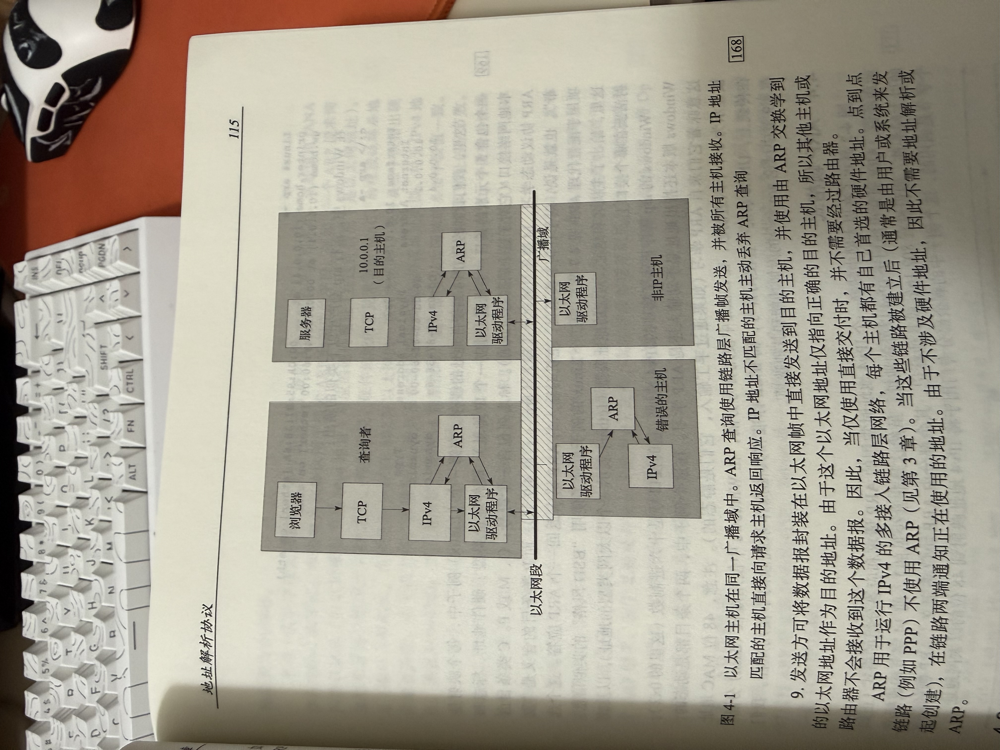
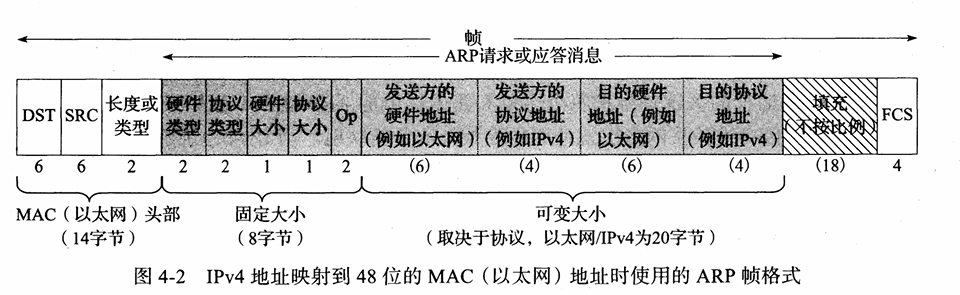

arp:地址解码协议 ARP仅用于IPv4, IPv6使用邻居发现协议,它被合并人ICMPv61. 

1. 基础定位

- 仅用于 **IPv4**，IPv6 已整合入 ICMPv6「邻居发现协议」，不再使用独立 ARP。
- 核心作用：解决「**IP 地址（逻辑 / 可修改）→ MAC 地址（物理 / 固化）**」的跨层映射问题，让上层 IP 数据报能在链路层正确投递。

2. 背景与必要性

- MAC 地址：设备出厂固化，永久不变，用于链路层硬件寻址；
- IP 地址：用户 / 管理员分配，可动态变更（如移动设备切换网络），用于网络层逻辑寻址；
- 不同层地址由不同机构分配，ARP 是两者的映射桥梁，允许多种网络协议栈在同一硬件链路上共存。

3. 以太网场景工作机制

- 同一广播域内，主机通过**广播发送 ARP 请求**，查询目标 IP 对应的 MAC 地址；
- 仅目标 IP 匹配的主机会单播返回 ARP 响应，其他主机直接丢弃不匹配的请求；
- 获得 MAC 地址后，后续 IP 数据报将以该 MAC 为目的地址直接发送，无需重复走 ARP 流程。

4. 关键边界与特殊场景

- 点对点链路（如 PPP）不使用 ARP：链路建立时已获知对方地址，无需地址解析；
- 仅在同一子网内生效，跨网段通信时，ARP 仅需解析网关的 MAC 地址，后续数据由网关转发。





地址解析是发现两个地址之间的映射关系的过程。对于使用IPv4的TCP/IP协议族,这 是由运行的ARP来实现的o ARP是一个通用的协议,从这个意义上来看,它被设计为支持 多种地址之间的映射。实际上, ARP几乎总是用于32位IPv4地址和以太网的48位MAC 地址之间的映射。这

 



---
### ARP 帧格式
#### 1. 核心作用
ARP 是 IPv4 专用的「地址翻译官」，负责把**IP地址（逻辑地址）**翻译成**MAC地址（物理地址）**，让局域网里的设备能找到对方、把数据发过去。

#### 2. 整体结构（按传输顺序从左到右）
从以太网帧头到帧尾，一共 5 个部分，核心是中间的 ARP 信息，其他都是以太网的固定格式：
- 以太网头部：告诉网卡「这包发给谁、谁发的、是什么类型的包」
- ARP 控制信息：定义这次是「请求别人的MAC」还是「回复自己的MAC」
- 地址解析数据：包含「发送方的MAC/IP」和「目标的MAC/IP」
- 填充字节：补够以太网最小帧长（64字节），避免被当成无效包丢弃
- 帧尾校验：检测数据传输中有没有出错

---
### 中文易懂版 ARP 帧结构示意图
```
┌─────────────────────────────────────────────────────────────────────────────┐
│                             ARP 数据帧（从左到右传输）                      │
├─────────────────┬───────────────────┬───────────────────┬─────────┬───────┤
│   以太网头部     │   ARP 控制信息    │   地址解析数据    │  填充字节 │  CRC校验 │
│ （14 字节）     │   （8 字节）      │  （20 字节）      │  （0~18B）│  4 字节 │
├─────────────────┼───────────────────┼───────────────────┼─────────┤       │
│ 目标MAC | 源MAC │ 类型标识 | 操作码 │ 发送方地址 | 目标地址 │ 补齐帧长 │ 防出错 │
│  6B+6B  |  2B   │  4B     | 2B    │  MAC/IP    | MAC/IP  │         │       │
└─────────────────┴───────────────────┴───────────────────┴─────────┴───────┘
```

---
### 关键细节
- **操作码**：ARP 的「动作指令」，`1` 代表「我要找某个IP的MAC地址（请求）」，`2` 代表「我就是你要找的MAC地址（应答）」
- **目标MAC**：ARP 请求时填 `0`（不知道对方地址，所以广播发送给所有人），ARP 应答时填目标地址（单播回复给请求方）
- **重复信息**：以太网头部和 ARP 数据里都有「发送方MAC」，这是为了让网卡和 ARP 协议都能快速识别发送方，不用额外解析

---
### 举个例子：ARP 请求包里的地址信息
- 发送方MAC：我的网卡地址（比如 `AA:BB:CC:DD:EE:FF`）
- 发送方IP：我的IP（比如 `192.168.1.100`）
- 目标MAC：全0（不知道对方地址，广播发送）
- 目标IP：我要找的IP（比如 `192.168.1.1`）

目标主机收到后，会把自己的MAC填到「目标MAC」里，互换「发送方/目标地址」，把操作码改成 `2`，再发回来，就是 ARP 应答包了。


