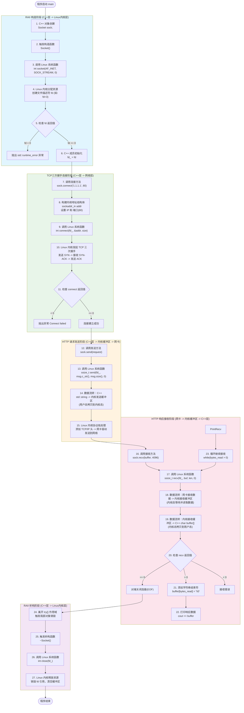

# 创建RAII socket类 发请求

## 流程

```mermaid
flowchart TD
    Start([程序启动 main]) --> CreateSock["1. C++ 对象创建\nSocket sock;"]
    
    subgraph RAII_Construct["RAII 构造阶段 (C++层 -> Linux内核层)"]
        CreateSock --> SysSocket["2. 触发构造函数\nSocket()"]
        SysSocket --> LinuxSocket["3. 调用 Linux 系统函数\nint socket(AF_INET, SOCK_STREAM, 0)"]
        LinuxSocket --> KernelAlloc["4. Linux 内核分配资源\n创建文件描述符 fd (如: fd=3)"]
        KernelAlloc --> CheckFd{5. 检查 fd 返回值}
        CheckFd --> |fd < 0| ThrowError["抛出 std::runtime_error 异常"]
        CheckFd --> |fd >= 0| InitMember["6. C++ 成员初始化\nfd_ = fd"]
    end

    InitMember --> CallConnect["7. 调用连接方法\nsock.connect('1.1.1.1', 80)"]
    
    subgraph Connect_Phase["TCP三次握手连接阶段 (C++层 -> 网络层)"]
        CallConnect --> ParseAddr["8. 构建内核地址结构体\nsockaddr_in addr\n设置 IP 和 端口(80)"]
        ParseAddr --> SysConnect["9. 调用 Linux 系统函数\nint connect(fd_, &addr, size)"]
        SysConnect --> TCPHandshake["10. Linux 内核发起 TCP 三次握手\n发送 SYN -> 接收 SYN-ACK -> 发送 ACK"]
        TCPHandshake --> CheckConnect{11. 检查 connect 返回值}
        CheckConnect --> |< 0| ThrowConnError["抛出异常 Connect failed"]
        CheckConnect --> |== 0| ConnectSuccess["连接建立成功"]
    end

    ConnectSuccess --> CallSend["12. 调用发送方法\nsock.send(request)"]
    
    subgraph Send_Phase["HTTP 请求发送阶段 (C++层 -> 内核缓冲区 -> 网卡)"]
        CallSend --> SysSend["13. 调用 Linux 系统函数\nssize_t send(fd_, msg.c_str(), msg.size(), 0)"]
        SysSend --> KernelBuffer["14. 数据流转：C++ std::string -> 内核发送缓冲区\n(用户态拷贝到内核态)"]
        KernelBuffer --> NICSend["15. Linux 内核协议栈处理\n添加 TCP/IP 头 -> 网卡驱动发送到网络"]
    end

    NICSend --> CallRecv["16. 调用接收方法\nsock.recv(buffer, 4096)"]
    
    subgraph Recv_Phase["HTTP 响应接收阶段 (网卡 -> 内核缓冲区 -> C++层)"]
        CallRecv --> SysRecv["17. 调用 Linux 系统函数\nssize_t recv(fd_, buf, len, 0)"]
        SysRecv --> WaitData["18. 数据流转：网卡接收数据 -> 内核接收缓冲区\n(内核态等待并读取数据)"]
        WaitData --> KernelCopy["19. 数据流转：内核接收缓冲区 -> C++ char buffer[]\n(内核态拷贝到用户态)"]
        KernelCopy --> CheckRecv{20. 检查 recv 返回值}
        CheckRecv --> |> 0| AppendNull["21. 添加字符串结束符\nbuffer[bytes_read] = '\\0'"]
        AppendNull --> PrintData["22. 打印响应数据\ncout << buffer"]
        PrintRecv --> LoopRecv["23. 循环继续接收\nwhile(bytes_read > 0)"]
        LoopRecv --> SysRecv
        CheckRecv --> |== 0| PeerClosed["对端关闭连接(EOF)"]
        CheckRecv --> |< 0| RecvError["接收错误"]
    end

    PeerClosed --> ExitScope["24. 离开 try{} 作用域\n触发局部对象销毁"]
    
    subgraph RAII_Destruct["RAII 析构阶段 (C++层 -> Linux内核层)"]
        ExitScope --> SysDestruct["25. 触发析构函数\n~Socket()"]
        SysDestruct --> LinuxClose["26. 调用 Linux 系统函数\nint close(fd_)"]
        LinuxClose --> KernelFree["27. Linux 内核释放资源\n销毁 fd 引用，清空缓冲区"]
    end
    
    KernelFree --> End([程序结束])

    style RAII_Construct fill:#e1f5fe
    style Connect_Phase fill:#e8f5e9
    style Send_Phase fill:#fff3e0
    style Recv_Phase fill:#fce4ec
    style RAII_Destruct fill:#f3e5f5

```

