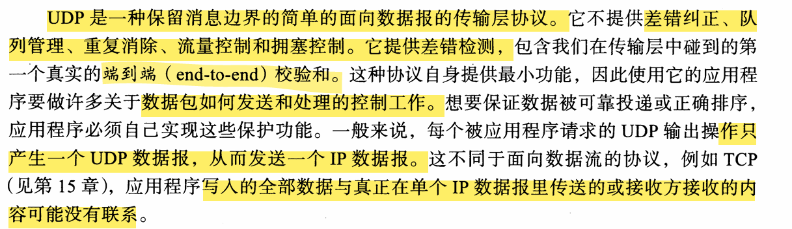
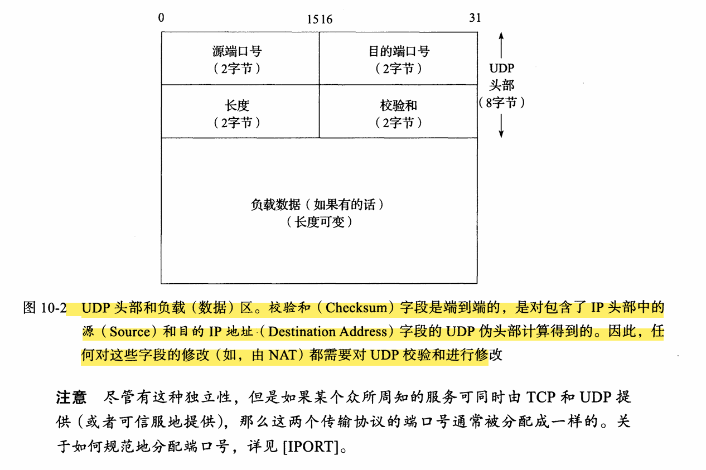
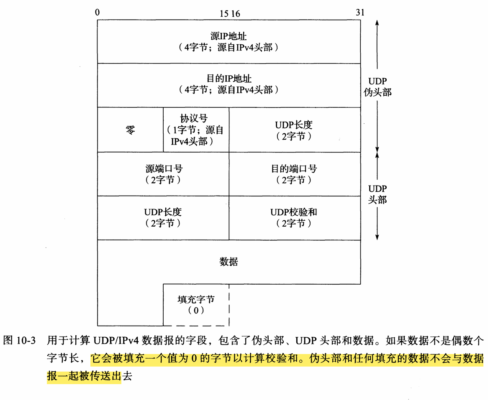

# UDP的前置知识

## UDP的特性
### 1. 保留消息边界 + 面向数据报
- **UDP是数据报协议**：你应用层调用1次`sendto()`，内核就生成**1个完整UDP数据包**；接收端1次`recvfrom()`，必须完整收1个包，**不会拆分、合并**。]
  >UDP 传输层绝不拆分，超大包只能靠【网络层 IP 分片】
- **TCP是字节流协议**：无消息边界，多次发送的数据会被内核缓冲、合并，或拆分成小包，接收端读到的是连续字节流，不知道原始发包边界。
- 实践对应：你的UDP Echo程序，发多少收多少，天然边界清晰，不用手动加分隔符。
### 2. 不提供：差错纠正、队列管理、重复消除、流量控制、拥塞控制；仅提供**差错检测（端到端校验和）**
- 差错**检测≠纠正**：UDP只通过校验和查数据是否损坏，**发现错误直接丢包，不会重传修复**；TCP会重传纠错。
- 无流量/拥塞控制：UDP不管对方接收能力、网络拥堵，发多少扔多少，容易丢包、网络拥塞；TCP靠滑动窗口、拥塞算法限速。
- 无重复/乱序处理：UDP包可能乱序、重复到达，内核不处理，**全部交给应用层自己处理**。
- 实践对应：你手动计算UDP校验和的任务，就是验证UDP仅有的差错检测能力。
### 3. 端到端（end‑to‑end）校验和
- IP头部校验和是**逐跳校验**（只查当前路由节点，到下一跳就重新计算）；
- UDP校验和是**全程端到端校验**：从发送主机→接收主机全程校验，包含**伪首部（源/目的IP）**，可防范IP地址欺骗，是传输层第一个端到端校验。
  **IP头部**
  ```
  源主机[IP头:TTL=128,校验和=A]								
      ↓(TTL-1→127,重算→B)
  路由1
      ↓(TTL-1→126,重算→C)
  路由2
      ↓
  目标主机（校验C）
  范围：仅IP头部｜每跳必重算
  ```
  **UDP**
  ```
  源主机[伪首部+UDP+数据→算出校验和X]
      ↓(路由1/2不修改X)
  路由1 → 路由2
      ↓
  目标主机（校验X）
  范围：绑定IP+UDP+数据｜全程1次计算
  ```
### 4. 应用层必须自己实现可靠传输逻辑
UDP内核完全不管可靠投递、包排序，**丢包、乱序、超时、重复**全部需要你在C++代码里手动实现：
- 比如游戏、DNS、QUIC协议，都在应用层自己做序号、ACK、重传、超时机制。
- 实践对应：你后续做UDP可靠传输，就要自己写序号、超时重传逻辑。
### 5. 1次应用层输出 = 1个UDP数据报 = 1个IP数据报
- UDP：`sendto()` 1次调用 → 内核封装1个UDP包 → 生成1个IP包发送，**严格一一对应**。
- TCP：应用层`send()`和IP包无对应关系，内核会合并、拆分数据。
- 实践对应：你测试**IP分片**时，发送超过MTU的UDP包，内核会把1个UDP包拆成多个IP分片。
### 6. TCP面向数据流：应用层数据与IP包无对应关系
TCP内核有缓冲区、滑动窗口：
- 你1次`send()`的大数据，会被拆成多个IP包；
- 你多次`send()`的小数据，会被内核合并成1个IP包；
- 接收端只能读到连续字节，**完全不知道原始发包边界**，必须应用层手动加分隔符（如换行、长度头）。
## 什么是广播组播单播
### 前置基础：3种IP传输模式
1. **单播**：一对一（你 ↔ 单个服务器），TCP/UDP都支持，日常上网用的就是它
2. **广播**：一对**整个局域网所有主机**
3. **组播**：一对**指定的一组主机**（加入同一个组）
**只有UDP能做广播/组播，TCP完全做不了**，原因：
- UDP：**无连接、无状态、无握手、无ACK**，开销极低，发出去不用管谁收、收没收到，天然适合一对多
- TCP：**面向点对点连接**，必须三次握手、维护序列号/ACK、重传，一对多无法建立连接，直接不支持
### 1. 广播（Broadcast）
- 地址：`255.255.255.255`（有限广播），发给**当前局域网内全部设备**
- 规则：**路由器默认不转发广播包**（防止全网广播风暴瘫痪网络）
- 用途：局域网设备发现、DHCP自动获取IP、内网游戏联机
### 2. 组播（Multicast）
- 地址：`224.0.0.0 ~ 239.255.255.255` 段IP
- 规则：**路由器支持跨网段转发**，只有**提前加入组播组**的设备才接收
- 用途：视频直播、视频会议、游戏多玩家同步、监控流推送
- 单播：一对一，TCP/UDP都行
- 广播：一对全网段，仅UDP，不跨路由
- 组播：一对一组设备，仅UDP，可跨路由
- TCP只能点对点，天生无法一对多
# UDP头部

**IP 负责找主机**：IP 只定位到这台电脑，不管里面哪个服务
**协议字段分流**：IP 头部有协议号，内核把包丢给对应协议（TCP/UDP）
**端口只在本协议内唯一**
- TCP 的 80 端口、UDP 的 80 端口，**完全是两套东西，不冲突**\
  `192.168.1.1:80(TCP)`：跑网页服务
  `192.168.1.1:80(UDP)`：跑视频流服务
  两个服务器**IP、端口完全一样**，仅协议不同，可同时运行，不会抢占端口。
# UDP校验和
它由初始的发送方计算得到,由最终的目的方校验。它在传送中不会被修改除非它通过一个NAT
### **NAT是什么:**
```
1. NAT 会修改 IP 包的【源IP地址】（内网IP → 公网IP）
2. UDP校验和计算包含伪首部，伪首部里有源IP							
3. 源IP一变 → 伪首部数据改变 → UDP校验和必须重新计算、修改-----------如何修改?--------------->内网主机 → IP包[源IP:192.168.x.x | UDP校验和:旧值]
4. 普通路由只改TTL、不改IP，UDP校验和全程不变；只有NAT会破坏端到端校验和						【NAT网关】
																				 1. 修改IP头：源IP → 公网IP
																				 2. 重算IP头部校验和（必做）
																				 3. 识别UDP协议 → 发现伪首部里源IP变了
																				 4. 网关**直接重算UDP校验和**，写入UDP头部
																				        ↓
																				公网 → 目标主机
```
### UDP具体的校验内容图解:

**伪首部如何做到发送端接收端一致:**
 ```
 发送端：从自己要发的真实 IP 头里，提取字段拼伪首部算校验和 → 伪首部不发送
 接收端：从收到的真实 IP 头里，按同样位置提取同样字段，原地复刻一模一样的伪首部
 两端伪首部完全相同 → 校验和比对正确
 ```
#### 可能违反分层协议了吗
##### 「违反分层」到底是什么？
正常网络分层规则：
- **传输层 (UDP)** 不该读取 / 依赖 **网络层 (IP)** 的字段（源 IP、目的 IP）
- 但 UDP 校验和的**伪首部，直接扒 IP 头部的源 / 目的 IP** → 传输层越界读取网络层数据，就是**违反分层**
  > 属于协议设计的妥协：为了校验 IP 地址、防欺骗，打破了严格分层
#### **UDP校验核心步骤**
| 步骤   | 规则                      | 用途                          |
| ------ | ------------------------- | ----------------------------- |
| 1 拼接 | 伪首部 + UDP 头部 + 数据  | 伪首部 = 虚拟 IP 信息，防欺骗 |
| 2 对齐 | 奇数长度补 1 字节 0       | 保证 16 位分组计算            |
| 3 求和 | 16 位反码加法（进位回卷） | 互联网标准算法                |
| 4 取反 | 最终结果取反              | 得到校验和                    |
| 5 特性 | 全程不修改，仅收发端计算  | 端到端校验                    |
#### **IP/UDP校验差异**
| 维度     | IP 头部校验和            | UDP 校验和             |
| -------- | ------------------------ | ---------------------- |
| 校验范围 | 仅 IP 头部               | 伪首部 + UDP 头 + 数据 |
| 计算次数 | **逐跳重算（TTL 修改）** | **仅收发端各算 1 次**  |
| 核心作用 | 防 IP 头损坏             | 防数据篡改 + IP 欺骗   |
| 跨 NAT   | 自动重算                 | 需重算（IP 改变）      |
| 层级     | 网络层                   | 传输层端到端           |
#### 校验和的差错
UDP 校验和里，**UDP 长度被算 2 次**，防长度被篡改
校验和有个坑：算出来刚好 = 0x0000，必须写成全 1（0xFFFF），因为 0 被用作「关闭校验」的开关(牟定的一个规则,防止接收端取消校验)
接收端：
- 0 → 不校验
- 非 0 → 正常比对
校验出错：**默默丢包，不发任何报错**（和 IP 头部校验出错行为一样）
```
┌─────────────────────────────────────────────────────────┐
│ UDP 校验和 发送端→接收端完整逻辑流程 │
└─────────────────────────────────────────────────────────┘
│
▼
┌─────────────────────────────────┐
│ 【发送端】 │
└─────────────┬─────────────────┘
▼
┌─────────────────────────────────┐
│ 1. 拼接计算结构：伪首部 + UDP 头 + 数据 │
│ ✦ UDP 长度在伪首部、UDP 头出现 2 次│
└─────────────┬─────────────────┘
▼
┌─────────────────────────────────┐
│ 2. 数据长度为奇数？ │
│ ┌───────┐ ┌───────────┐ │
│ │ 是 │───补 0 填充字节 (仅计算用)│
│ └───┬───┘ └─────┬─────┘ │
│ │ │ │
└──────┼──────────────────┘ │
▼ │
┌─────────────────────────────────┐│
│ 3. 计算 16 位反码和互联网校验和 ││
└─────────────┬─────────────────┘│
▼ │
┌─────────────────────────────────┐
│ 4. 算出校验和 = 0x0000？ │
│ ┌───────┐ ┌───────────┐ │
│ │ 是 │───强制存入 0xFFFF │ │
│ └───┬───┘ └─────┬─────┘ │
│ │ │ │
└──────┼──────────────────┘ │
▼ │
┌─────────────────────────────────┐
│ 5. 校验和写入 UDP 头部，丢弃伪首部 / 填充字节，发送 │
└─────────────┬─────────────────┘
▼
┌─────────────────────────────────┐
│ 【接收端】 │
└─────────────┬─────────────────┘
▼
┌─────────────────────────────────┐
│ 6. 读取 UDP 头部校验和字段 │
│ ✦ 校验和 = 0x0000 → 发送端关闭校验和，跳过校验 │
└─────────────┬─────────────────┘
▼
┌─────────────────────────────────┐
│ 7. 正常校验：从 IP 头部复刻伪首部 │
│ （扒取源 IP / 目的 IP / 协议号 / UDP 长度）│
└─────────────┬─────────────────┘
▼
┌─────────────────────────────────┐
│ 8. 重算校验和比对，自动忽略填充 0 字节 │
└─────────────┬─────────────────┘
▼
┌─────────────────────────────────┐
│ 9. 校验失败？ │
│ ┌─────────┐ ┌─────────────┐ │
│ │ 是 │───静默丢弃包，更新统计计数，无 ICMP 差错报文 │
│ └───┬─────┘ └───────┬─────┘ │
│ │ │ │
│ │ 校验成功→上交应用层 │
└──────┴──────────────────┘ │
┌─────────────────────────────────────────────────────────┐
│ 核心规则速查 │
│ 1. UDP 长度：伪首部、UDP 头部各 1 次，计算时出现 2 次 │
│ 2. 校验和 0 值规则：发送端算 0 存 0xFFFF；接收端 0 = 关闭校验和 │
│ 3. 填充字节：奇数数据补 0，仅计算用，不传输 │
│ 4. 错误处理：校验失败静默丢包，无 ICMP 报错 │
│ 5. 规范要求：原始可选，现代网络强制开启校验和 │
└─────────────────────────────────────────────────────────┘
```
# socket编程接口中用于UDP数据报的系统级调用
```c++
#include <sys/types.h>
#include <sys/socket.h>
ssize_ t recvfrom( int sockfd, void* buf, size t len, int fags, struct sockaddr*src_addr, socklen_t* addrlen);
ssize t sendto( int sockfd, const voidt buf, size t len, int flags, const struct sockaddr* dest_addr, socklen_t addrlen ) ;
```
| 对比项       | recvfrom                                                     | sendto                                                       |
| :----------- | :----------------------------------------------------------- | :----------------------------------------------------------- |
| 所需头文件   | `<sys/types.h>`<br>`<sys/socket.h>`                          | 与左侧一致                                                   |
| 函数原型     | `ssize_t recvfrom(int sockfd, void* buf, size_t len, int flags, struct sockaddr* src_addr, socklen_t* addrlen);` | `ssize_t sendto(int sockfd, const void* buf, size_t len, int flags, const struct sockaddr* dest_addr, socklen_t addrlen);` |
| 核心功能     | 从 UDP 套接字**接收数据**，同时获取**发送端地址**            | 向 UDP 套接字**发送数据**，显式指定**接收端地址**            |
| 关键参数     | 1. `sockfd`：UDP 套接字<br>2. `buf/len`：接收缓冲区及大小<br>3. `flags`：读写标志<br>4. `src_addr`：输出，保存发送方地址<br>5. `addrlen`：地址长度（输入输出） | 1. `sockfd`：UDP 套接字<br>2. `buf/len`：发送数据及长度<br>3. `flags`：读写标志<br>4. `dest_addr`：输入，指定接收方地址<br>5. `addrlen`：地址长度 |
| 返回值       | 成功：读取字节数；失败：`-1`                                 | 成功：发送字节数；失败：`-1`                                 |
| 通用特性     | `flags`、返回值规则 与 `send/recv` 完全相同                  | 与左侧一致                                                   |
| TCP 兼容用法 | 面向连接(TCP)时，`src_addr=NULL, addrlen=NULL`，忽略对端地址 | 面向连接(TCP)时，`dest_addr=NULL, addrlen=NULL`，忽略对端地址 |
| UDP 底层逻辑 | UDP 无连接，每次收包必须获取发送方地址，用于回包             | UDP 无连接，每次发包必须手动指定目标地址                     |
## `recvfrom/sendto` 的 `flags` 参数、返回值，与 `send/recv` 完全相同
- `send/recv`：**TCP 专用读写函数**（面向连接）
- `sendto/recvfrom`：**UDP 专用读写函数**（无连接）
- 4 个函数都属于 POSIX 套接字读写接口，**内核底层共用一套控制逻辑**
### `flags` 参数（行为控制标志位）
通用可选标志（4 个函数全部支持，逻辑完全一致）：
- `MSG_PEEK`：偷看缓冲区数据，不把数据从内核缓冲区移除
- `MSG_OOB`：读取/发送 TCP 带外紧急数据
- `MSG_WAITALL`：阻塞等待完整长度数据再返回
> 本质：**标志位是读写行为开关，和协议无关**，TCP/UDP 通用
### 返回值规则（完全一致）
- 正数：成功读写的**字节数**
- `0`：
  - TCP：对端正常关闭连接
  - UDP：收到**空数据报**
- `-1`：调用出错，系统置位 `errno`
---

## `recvfrom/sendto` 也可用于 TCP（面向连接）socket，末尾两个地址参数传 `NULL`
### 核心原理：TCP 与 UDP 地址逻辑差异
- **UDP（无连接）**：每次收发都必须显式指定对方地址，因为每次通信的客户端可以不一样
- **TCP（面向连接）**：三次握手后，**内核永久记住了对端的 IP+端口（socket 地址）**，全程固定，无需每次手动指定

### 用法规则
- `sendto` 发 TCP 数据：`dest_addr = NULL`、`addrlen = NULL` → 等价于 `send()`
- `recvfrom` 收 TCP 数据：`src_addr = NULL`、`addrlen = NULL` → 等价于 `recv()`
> 禁止行为：TCP 下给 `dest_addr` 传其他地址，会直接报错（TCP 只能和已连接的对端通信）

### 本质总结
- `send/recv` 只是 `sendto/recvfrom` 的**TCP 简化版**
- `sendto/recvfrom` 是**通用版读写函数**，同时兼容 TCP、UDP
- POSIX 设计意图：一套接口适配两种传输层协议，统一编程范式
