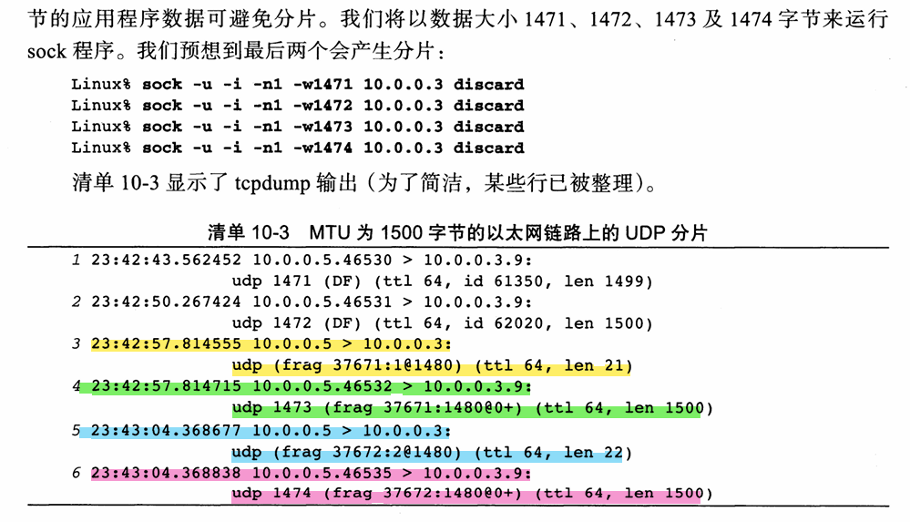
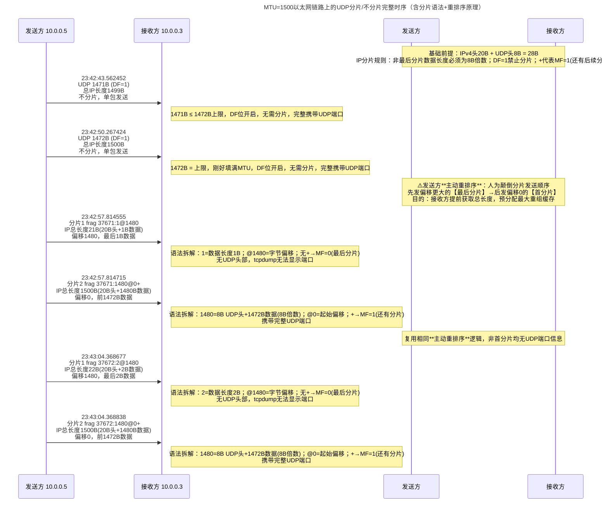
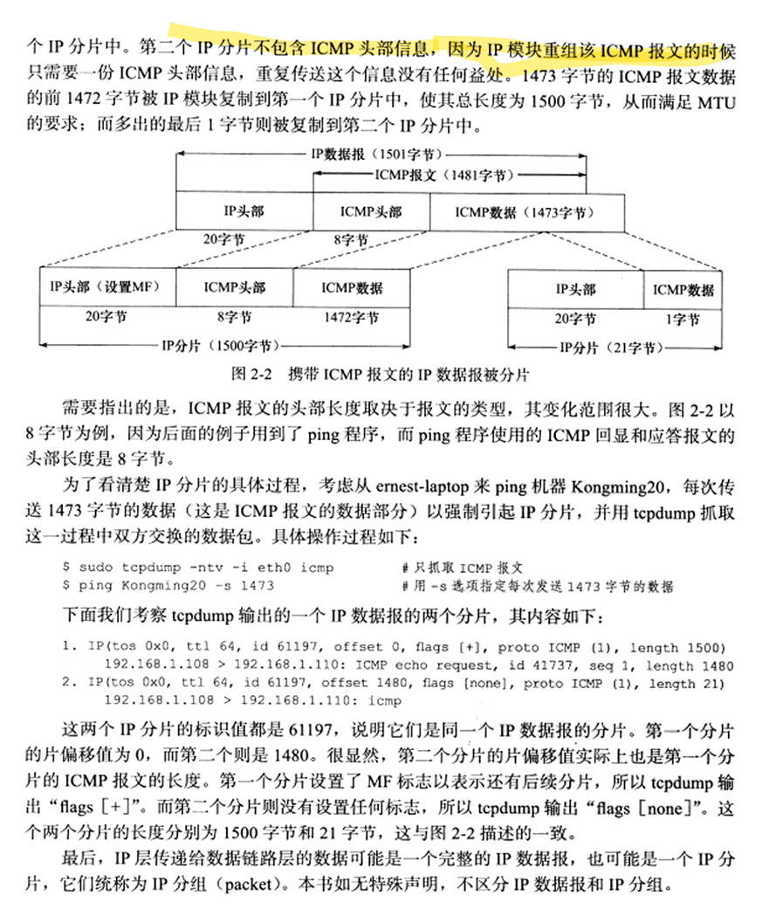
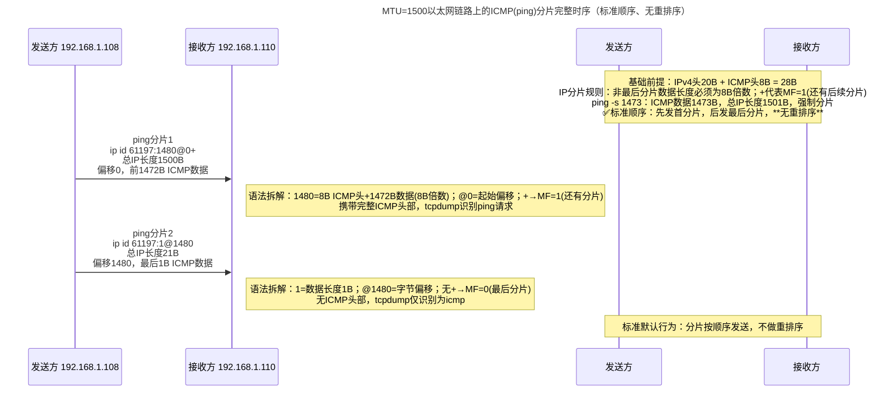
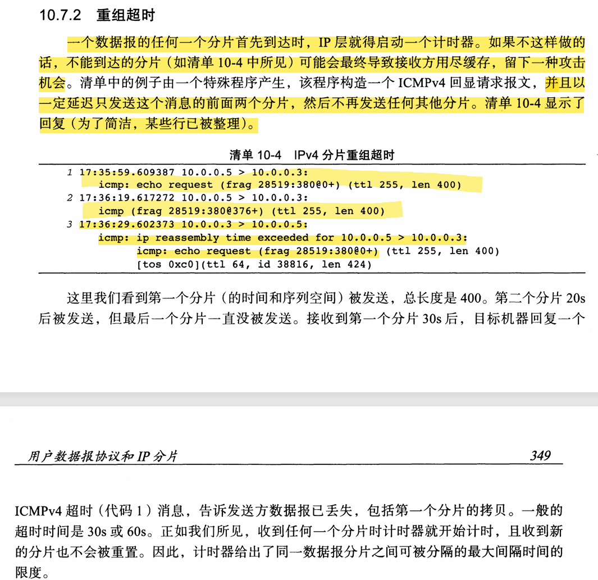
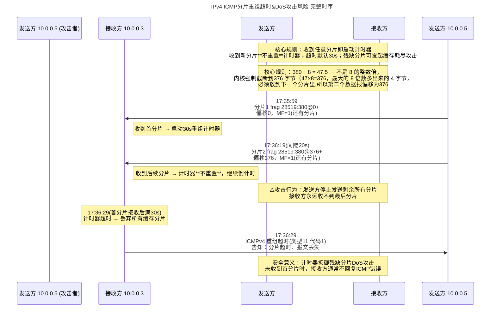

------------------+
| 生成IP数据报              |
+-------------+-------------+
              |
              v
+-------------+-------------+
| 对比 接口MTU & 数据报大小 |
+-------+-------------------+
        |
+-------+-------+         +-------------------------+
| ≤MTU  | 直接发送 |         | >MTU 执行分片           |
+-------+---------+         +------------+------------+
                                       |
                        +-------------+-------------+
                        | IPv4         | IPv6         |
                        | 源主机/路由  | 仅源主机     |
                        | 均可分片     | 路由不分片   |
                        | 分片可再分片 | 禁止二次分片 |
                        +-------------+-------------+
                                       |
                                       v
                        +-------------+-------------+
                        | 分片独立路由(可走不同路径) |
                        +-------------+-------------+
                                       |
                                       v
+---------------------------+          +---------------------------+
| 路由器：不执行重组        	|		   |	 所有分片到达目的主机   |
+-------------+-------------+          +-------------+-------------+
              |                                      |
              |                                      v
              |                        +-------------+-------------+
              +------------------------>| 目的主机重组IP数据报      |
                                        +---------------------------+
                                        重组核心原因：
                                        1. 减轻路由器转发负担
                                        2. 分片路径不同，路由无法集齐所有分片
```


## UDP分片实战(重排序):






## ICMPv4分片实战(未重排序)



层次结构:

```c++
# 原始完整IP报文（总长度1501字节）
┌─────────────────────────────────────────────────────────────┐
│ IPv4头部(20B)                                              │
├─────────────────────────────────────────────────────────────┤
│ ICMP报文(1481B)                                            │
│   ├─ ICMP头部(8B)  (ping回显请求)                           │
│   └─ ICMP数据(1473B)  (ping -s 1473指定的负载)              │
└─────────────────────────────────────────────────────────────┘

# 分片1（MTU=1500B，MF=1 还有后续分片）【先发】
┌─────────────────────────────────────────────────────────────┐
│ IPv4头部(20B) 【设置MF标志位】                              │
├─────────────────────────────────────────────────────────────┤
│ ICMP头部(8B) + ICMP数据前1472B （1480B，8B对齐）           │
└─────────────────────────────────────────────────────────────┘

# 分片2（最后分片，MF=0）【后发】
┌─────────────────────────────┐
│ IPv4头部(20B)              │
├─────────────────────────────┤
│ ICMP数据剩余1B              │
└─────────────────────────────┘
```




| 案例                     | 发送顺序                  | 行为类型                         |
| ------------------------ | ------------------------- | -------------------------------- |
| UDP 分片（前面的）       | 先发最后分片 → 后发首分片 | **主动重排序（特殊优化实现）**   |
| ICMP ping 分片（本案例） | 先发首分片 → 后发最后分片 | **标准默认顺序（常规系统行为）** |

## ICMPv4超时重传实战

 [ICMPv4](阶段2-0 前置知识.md#ICMPv4 前置知识整理) 是什么?





