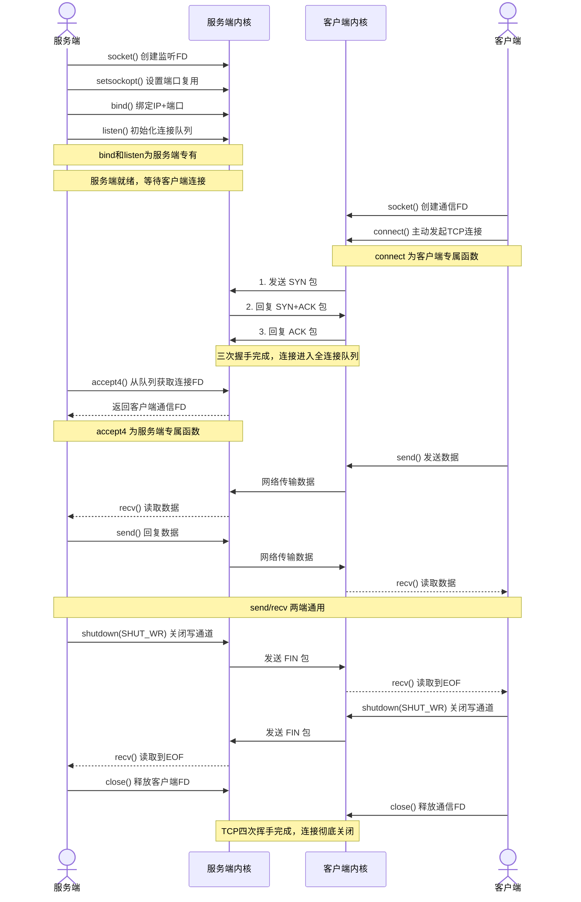

# 总体流程图

#  传输数据如何转换?
## 字节序问题:由于可能每台主机服务器采用的端序不一样
我们统一需要讲自己的端序转变为网络端序(大端序),然后再由各个接收方转变为自己主机的端序
以下是一些转换函数
```c++
#include <netinet/in.h>
//host to network long 长整型的主机字节序列
unsigned long int htonl ( unsigned long int hostlong ) ;
//host to network short short类型的主机字节序列(可能是端口)
unsigned short int htons ( unsigned short int hostshort ) ;
unsigned long int ntohl( unsigned long int netlong );
unsigned short int ntohs ( unsigned short int netshort ) ;
```
| `ntohs`     | network to host **short**   | 端口号：网络序 → 主机序（16位）          |
| ----- | --------------------------- | ---------------------------------------- |
| `ntohl`     | network to host **long**    | IP地址：网络序 → 主机序（32位）          |
| `htons`     | host to network **short**   | 端口号：主机序 → 网络序（16位）          |
| `htonl`     | host to network **long**    | IP地址：主机序 → 网络序（32位）          |
| `inet_ntop` | network to **presentation** | 二进制 IP → 可读字符串（支持 IPv4/IPv6） |
| `inet_pton` | **presentation** to network | 可读字符串 → 二进制 IP                   |
# 连接如何连
## 地址如何解析
### 协议族与地址族对应关系
> 宏 `PF_*`（协议族）与 `AF_*`（地址族）值完全一致，可混用
>
> `socket()` 传参用 `PF_*`
>
> 地址结构体 `sa_family` 用 `AF`
| 协议族   | 地址族   | 描述              |
| -------- | -------- | ----------------- |
| PF_UNIX  | AF_UNIX  | UNIX 本地域协议族 |
| PF_INET  | AF_INET  | TCP/IPv4 协议族   |
| PF_INET6 | AF_INET6 | TCP/IPv6 协议族   |
### 各协议族地址值含义&长度
| 协议族   | 地址值含义和长度                                             |
| -------- | ------------------------------------------------------------ |
| PF_UNIX  | 文件的路径名，长度可达 108 字节                              |
| PF_INET  | 16 bit 端口号 + 32 bit IPv4 地址，共 6 字节                  |
| PF_INET6 | 16 bit 端口号 + 32 bit 流标识 + 128 bit IPv6 地址 + 32 bit 范围ID，共 26 字节 |
#### 1. 基础通用地址结构体 `sockaddr`
```c
#include <bits/socket.h>
struct sockaddr
{
    sa_family_t sa_family;    // 地址族类型
    char sa_data[14];         // 存放socket地址值
};
```
#### 2. 扩展通用地址结构体 `sockaddr_storage`
> 解决 `sockaddr` 的 `sa_data[14]` 长度不足问题，支持内存对齐
```c
#include <bits/socket.h>
struct sockaddr_storage
{
    sa_family_t sa_family;                          // 地址族类型
    unsigned long int __ss_align;                   // 用于内存对齐
    char __ss_padding[128-sizeof(__ss_align)];      // 足够大的地址值存储空间
};
```
---

------

前面两个了解即可,下面的才是现代写法

#### 3. 本地协议栈

```c++
    // 服务端：调用 bind() 将 Socket 绑定到 /tmp/sock，并在该路径上 listen() 等待连接。
    // 客户端：调用 connect() 指向 /tmp/sock，与服务端建立双向数据通道。
    // 常见应用如本地的 MySQL (/tmp/mysql.sock)、Docker
    // 守护进程等，都使用这种方式避免网络开销，实现极速的本地数据交换。
    // unix本地域协议族使用如下专用socket地址结构体
    sockaddr_un sun_addr;
    // 地址族 UNIX 域协议族
    sun_addr.sun_family = AF_UNIX;
    // 注入地址
    strcpy(sun_addr.sun_path, "/tmp/sock");
```

#### 4. IPV4

```c++
// ipv4专用socket地址结构体
    sockaddr_in sockaddr_in;
    // 现代注入地址
    auto inet_pton1 = inet_pton(AF_INET, "127.0.0.1", &sockaddr_in.sin_addr.s_addr);
    if (inet_pton1 < 0) {
        return;
    }
    //古法注入地址
    sockaddr_in.sin_addr.s_addr = inet_addr("127.0.0.1");
    // 地址族 TCP/IPv4 协议族
    sockaddr_in.sin_family = AF_INET;
    // 端口号 要用网络字节序标识
    sockaddr_in.sin_port = htons(9000);

```

#### 5.IPV6

```c++
    // ipv6专用socket地址结构体
    sockaddr_in6 sockaddr_in6;
    // 注入 IPv6 回环地址 ::1
    inet_pton(AF_INET6, "::1", &sockaddr_in6.sin6_addr);
    // 地址族 TCP/IPv6 协议族
    sockaddr_in6.sin6_family = AF_INET6;
    // 端口号 要用网络字节序标识
    sockaddr_in6.sin6_port = htons(9000);
    // 流信息
    sockaddr_in6.sin6_flowinfo = 0;
```

### IP地址如何转换

IP地址有两种表示形式：
1. **人可读形式**：字符串（IPv4：`192.168.1.1`；IPv6：`2001::1`）
2. **机器可用形式**：**网络字节序（大端序）二进制整数**（网络传输必须统一大端序）
下面函数就是完成这两种格式的互相转换，分为**老旧IPv4专用函数**、**现代通用函数（IPv4+IPv6）** 两类。

---

#### 一、老旧函数（仅支持IPv4，Linux已不推荐，存在安全/线程坑）
头文件：`<arpa/inet.h>`
##### 1. `in_addr_t inet_addr(const char* strptr);`
- 功能：**点分十进制字符串 → 网络字节序整数**
- 参数：`strptr` 是IPv4字符串（如`"192.168.1.1"`）
- 返回值：成功返回**网络序**的32位整数；失败返回`INADDR_NONE`
- 缺点：
  1. 无法识别空地址、非法地址
  2. 不能处理`255.255.255.255`（该值和失败返回值冲突）
  3. 仅支持IPv4

##### 2. `int inet_aton(const char* cp, struct in_addr* inp);`
- 功能：和`inet_addr`一致，**字符串 → 网络序整数**，结果存入`in_addr`结构体
- 参数：
  - `cp`：IPv4字符串
  - `inp`：输出参数，保存转换后的网络序二进制值
- 返回值：成功返回`1`，失败返回`0`
- 优点：比`inet_addr`更安全，支持全范围IPv4地址

##### 3. `char* inet_ntoa(struct in_addr in);`
- 功能：**网络序整数（in_addr） → 点分十进制字符串**
- 致命坑：**不可重入、非线程安全**
  函数内部用**静态全局缓冲区**存储结果，多次调用会直接覆盖上一次结果！
- 书中示例代码运行结果解析：
```c
char* szValue1 = inet_ntoa("1.2.3.4");
char* szValue2 = inet_ntoa("10.194.71.60");
printf("address 1: %s\n", szValue1);
printf("address 2: %s\n", szValue2);
```
输出：
```
address1: 10.194.71.60
address2: 10.194.71.60
```
原因：`szValue1`和`szValue2`指向**同一块静态内存**，第二次调用直接覆盖了第一次的结果。

---

#### 二、现代函数（支持IPv4+IPv6，线程安全，强烈推荐）
头文件：`<arpa/inet.h>`
##### 1. `int inet_pton(int af, const char* src, void* dst);`
- 功能：**字符串IP → 网络序二进制整数**（支持IPv4/IPv6）
- 参数：
  1. `af`：地址族，`AF_INET`(IPv4) / `AF_INET6`(IPv6)
  2. `src`：输入的IP字符串
  3. `dst`：输出缓冲区，IPv4存`struct in_addr`，IPv6存`struct in6_addr`
- 返回值：成功返回`1`；格式错误返回`0`；失败返回`-1`并设置`errno`

##### 2. `const char* inet_ntop(int af, const void* src, char* dst, socklen_t cnt);`
- 功能：**网络序二进制整数 → 可读字符串IP**（支持IPv4/IPv6，反向转换）
- 参数：
  1. `af`：地址族 `AF_INET` / `AF_INET6`
  2. `src`：输入的网络序二进制IP
  3. `dst`：输出缓冲区，存放字符串
  4. `cnt`：缓冲区大小（用宏指定）
- 缓冲区大小宏（`<netinet/in.h>`）：
  - `INET_ADDRSTRLEN 16`：IPv4字符串最大长度（含结尾`\0`）
  - `INET6_ADDRSTRLEN 46`：IPv6字符串最大长度
- 返回值：成功返回`dst`指针；失败返回`NULL`并设置`errno`
- 优点：**线程安全**，缓冲区由用户提供，不会出现覆盖问题

---

#### 三、函数对比&使用总结表
| 函数        | 支持IP版本 | 线程安全 | 推荐度   | 核心用途      |
| ----------- | ---------- | -------- | -------- | ------------- |
| `inet_addr` | 仅IPv4     | 安全     | ❌ 废弃   | 老旧代码兼容  |
| `inet_aton` | 仅IPv4     | 安全     | ⚠️ 不推荐 | IPv4专用      |
| `inet_ntoa` | 仅IPv4     | ❌ 不安全 | ❌ 严禁用 | 老旧代码兼容  |
| `inet_pton` | IPv4+IPv6  | ✅ 安全   | ✅ 首选   | 字符串→网络序 |
| `inet_ntop` | IPv4+IPv6  | ✅ 安全   | ✅ 首选   | 网络序→字符串 |

#### 四、核心避坑&使用建议
1. 绝对不要用`inet_ntoa`，多线程环境会直接出现数据错乱；
2. 新项目**只使用`inet_pton/inet_ntop`**，同时兼容IPv4/IPv6，安全无坑；
3. 转换后得到的二进制IP**默认就是网络字节序（大端）**，可直接填入`sockaddr_in`结构体用于网络传输，无需再调用`htonl`转换。


## 连接如何创建

### 函数原型


```cpp
int socket(int domain, int type, int protocol);

// 现代标准写法 可以直接穿相与的值
int fd = socket(AF_INET, SOCK_STREAM | SOCK_NONBLOCK | SOCK_CLOEXEC, 0);
```

- `domain`：协议族 `PF_INET/PF_INET6/PF_UNIX`

- `type`：服务类型

- `protocol`：永远传 `0`（默认协议）

  type是什么?

- `SOCK_STREAM`: TCP用的代表流服务

- `SOCK_DGRAM`: UDP用的代表数据报

- ------

  `SOCK_NONBLOCK`：直接创建**非阻塞 socket**

- `SOCK_CLOEXEC`：fork 子进程自动关闭该 fd，防止文件描述符泄露

### 返回值解释: 

fd返回一个文件描述符

## 连接如何命名/绑定

```cpp
int bind(int sockfd, const struct sockaddr* my_addr, socklen_t addrlen);
```

- 功能：**给 socket 绑定地址 / 端口（命名 socket）**
- 服务器必须 bind（固定端口让客户端连接）
- 客户端一般不 bind，由系统自动分配随机端口

### 返回值解释:

0: 成功

-1: 失败 并设置error:

**`EACCES` 权限拒绝**

- 0~1023 是**特权端口**，普通用户不能绑定，必须加 `sudo`
- 现代新增：SELinux / 防火墙拦截也会报这个错误

**`EADDRINUSE` 地址已被占用**

- 端口被其他进程占用
- 最常见：服务重启时，端口处于 `TIME_WAIT` 状态，书本只提了这个

### 现代如何绑定

```c++
int opt = 1;
// opt 是功能开关变量：
// opt = 1  → 开启端口复用功能
// opt = 0  → 关闭端口复用功能 / 那这两行设置完全无效，等于没写，重启服务依然会报 端口被占用。
// setsockopt 要求传入指针，因此必须定义变量，不能直接传数字

// 允许快速复用处于 TIME_WAIT 的端口，服务重启秒启动 解决 TIME_WAIT 端口占用
setsockopt(fd, SOL_SOCKET, SO_REUSEADDR, &opt, sizeof(opt));
// 高性能多进程同端口 允许多进程 / 多线程同时绑定同一个端口，用于高并发负载均衡
setsockopt(fd, SOL_SOCKET, SO_REUSEPORT, &opt, sizeof(opt));

bind(fd, (struct sockaddr*)&addr, sizeof(addr));
```

## 连接如何监听

```c++
int listen(int sockfd, int backlog);
```

参数说明:

sockfd:调用socket函数返回的文件描述符

backlog:

1. backlog **只控制全连接队列(ESTABLISHED，等待accept)**
2. 半连接队列(SYN_RCVD)独立，由内核参数 tcp_max_syn_backlog 控制，与backlog无关
3. 现代内核：backlog无+1
4. 真实backlog = min(你传入的值, 与内核文件的/proc/sys/net/core/somaxconn)取小值

------

#### ① 半连接队列（SYN_RCVD）

- 三次握手第二步：收到客户端 SYN、发了服务端 SYN+ACK，**还没收客户端 ACK**
- 大小：`tcp_max_syn_backlog`（现代默认 1024/4096）
- **不受 backlog 影响**

#### ② 全连接队列（ESTABLISHED）

- 三次握手**完全完成**，连接就绪，**等待服务端调用 `accept()` 取走**
- 大小：`backlog`（现代内核不再 +1，传多少就是多少）
- 队列满 → 新连接直接拒绝，客户端报 `连接被拒绝`

## 连接如何接受

```c++
int accept(int sockfd, struct sockaddr *addr, socklen_t *addrlen);
```

>`accept` 只负责**从全连接队列取出连接文件描述符**，不做任何连接健康检查，不关心客户端是否断开。

客户端直接断网掉线

- 内核 TCP 保活未触发前，连接仍在**全连接队列**
- `accept` 正常返回，连接状态依然显示 `ESTABLISHED`

客户端退出（发送 FIN 包）

- 内核收到 FIN，连接变为 `CLOSE_WAIT`，依然留在全连接队列
- `accept` 照常取出连接，**完全不检查连接死活**

#### 现代如何连接

传统 `accept` 有两个问题：

- 返回的 fd 默认**阻塞 IO**
- 默认不设置 `CLOEXEC`（子进程会继承 fd，造成泄露）

需要手动 `fcntl` 二次设置

```c++
// 1. 传统 accept 获取客户端连接（默认：阻塞 + 无CLOEXEC）
int client_fd = accept(listen_fd, NULL, NULL);

// 2. 修复缺陷1：设置为 非阻塞 IO / 对这个 fd 调用 read/recv，如果客户端没发数据，进程会直接卡死等待，高性能服务器绝对不能用阻塞模式
// 后果：单线程服务器一卡，所有客户端都等待，服务直接雪崩
int flags = fcntl(client_fd, F_GETFL, 0);
fcntl(client_fd, F_SETFL, flags | O_NONBLOCK);

// 3. 修复缺陷2：开启 CLOEXEC（子进程自动关闭fd）
//传统 accept 不开启，子进程会继承父进程所有客户端连接 fd
//后果：服务器运行越久，fd 泄露越多，最终报错 Too many open files 崩溃
flags = fcntl(client_fd, F_GETFD, 0);
fcntl(client_fd, F_SETFD, flags | FD_CLOEXEC);
```

现代用 `accept4` 原子一步到位：

```cpp
// 现代推荐用法，原子设置 非阻塞 + 子进程自动关闭fd
int accept4(int sockfd, struct sockaddr *addr, socklen_t *addrlen, int flags);

// flags 直接用
flags = SOCK_NONBLOCK | SOCK_CLOEXEC;
```

**和 `socket()` 的现代用法完全配套**，高性能网络编程统一使用 `accept4`。

## 连接如何发起

```c++
int connect(int sockfd, const struct sockaddr *serv_addr, socklen_t addrlen);
```

**返回参数:**

0 成功 一旦成功建立连接，sockfd就唯一地标识了这个连接，客户端就可以通过读写sockfd来与服务器通信。

-1并设置errno

`ECONNREFUSED`，目标端口不存在，连接被拒绝。
`ETIMEDOUT`，连接超时。

## 连接如何关闭

### 通用连接关闭

```c++
//通用连接关闭
int close(int fd);
```

只做一件事：**文件描述符引用计数 -1**

只有引用计数 = 0 时，才真正断开 TCP 连接

`fork()` 子进程会继承 fd → 引用计数 + 1

→ 必须**父子进程都调用 close**，连接才会真正关闭

一旦真正关闭：**读、写全部禁用**，同时发送 FIN 包四次挥手

缺点:

- 不能**半关闭**（无法只关写、不关读）
- 多进程场景容易因引用计数导致连接关不掉

------
### TCP的连接关闭

```c++
//shutdown：TCP 连接层面关闭（网络专用，现代高频用）
#include <sys/socket.h>
int shutdown(int sockfd, int howto);
```

howto的三个用法

| 选项        | 作用（现代规则不变）                               |
| :---------- | :------------------------------------------------- |
| `SHUT_RD`   | 关闭**读**：丢弃接收缓冲区，不能再读数据           |
| `SHUT_WR`   | 关闭**写**（半关闭）：发送 FIN，还能继续收对方数据 |
| `SHUT_RDWR` | 同时关闭读写，等价强制断开                         |

#### 最大特性（现代高性能服务器必用）

> **`shutdown` 直接操作 TCP 内核连接，不受 fd 引用计数影响！**
>
> 哪怕子进程还持有 fd，调用 `shutdown` 会直接断开连接。

#### 现代如何关闭:

1. ##### 简单粗暴：直接 `close`

客户端 / 简单服务器，直接 `close(fd)` 即可。

##### 2. 优雅关闭（半关闭，标准 TCP 规范）

1. 调用 `shutdown(fd, SHUT_WR)` → 我方不再发数据，发 FIN
2. 继续 `read` 读取对方剩余数据
3. 对方关闭后，最后调用 `close(fd)` 释放 fd

##### 3. 多进程场景

- 想**断开 TCP 连接**：用 `shutdown`
- 只想**释放文件描述符**：用 `close`

