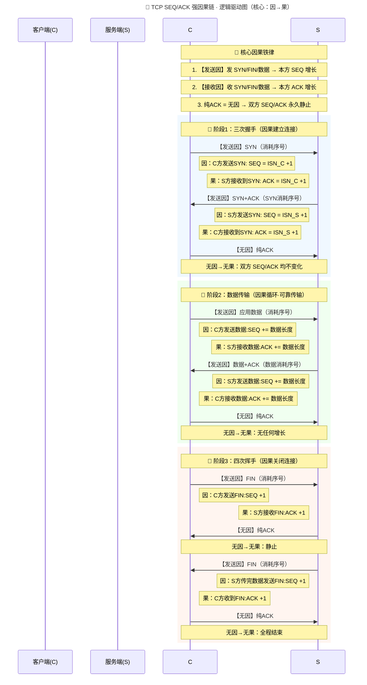

![[md_pict/image-20260525225321684.png]]	
## 一、TCP连接唯一标识
每个TCP头部都包含源端口号与目的端口号。这两个端口值，结合IP头部内的源IP地址、目的IP地址，可**唯一标识一条TCP连接**。
在TCP相关技术文献中，IP地址与端口号的组合有时被称作**端点**或[[2-3 linux下的socket函数|套接字]]。”套接字”这一术语最早出自RFC0793文档，最终被沿用为伯克利体系网络通信编程接口的名称（如今常称”伯克利套接字”）。
一对套接字/端点构成的**四元组**（客户端IP、客户端端口、服务端IP、服务端端口），可精准锁定一条TCP连接。在第13章讲解TCP服务端如何和多个客户端通信时，该特性会尤为关键。
## 二、序列号与确认号
### 序列号（Sequence Number）
序列号字段用于标识：在TCP发送端流向接收端的字节流中，当前报文段承载数据的**第一个字节**对应的序号。
对于两个应用间单向传输的字节流，TCP会为**每一个字节单独分配序列号**。序列号是32位无符号整数，数值达到 $2^{32}-1$ 后会回绕归零。
### 确认号（ACK Number）
由于传输的每个字节都被编号，**确认号字段**（简称ACK号/ACK字段）的值，是发送确认报文的一方**期望接收的下一个字节的序列号**，即上一个成功接收字节的序列号加1。
该字段仅当ACK标志位置位时生效；除[[3-2 TCP的连接建立与终止|连接建立、关闭]]报文外，绝大多数TCP报文段都会启用该标志位。
发送确认报文无额外开销，因为32位确认号与ACK标志位，均为TCP头部固定字段。
### 他们如何推进的?
TCP 全双工 = **两条互相独立的单向字节流**，每条流都有一套计数器：
- `SND.NXT`：**我方发送流的下一个序号**（报文 `Seq`）
  👉 变化条件：我方发送 
  SYN / FIN / 应用数据
  （消耗序号）；发纯 ACK 不变。
- `RCV.NXT`：**我方接收流的下一个期望序号**（报文 `ACK`）
  👉 变化条件：我方收到对方的 
  SYN / FIN / 应用数据
  ；收纯 ACK 不变。
`ACK` 标志位本身**永远不消耗序号**，它只是 “回执”，和我方发送流无关。
一条报文里可以同时携带 `Seq`、`ACK`、SYN/FIN、数据，字段互相独立，各自遵循规则。
### 他们如何串联整个tcp通讯过程?

## 三、SYN报文与初始序列号ISN
建立新连接时，客户端发往服务端的首个报文段会将**SYN标志位**置1，这类报文段称为SYN报文段（SYN包）。
此时序列号字段的值为**初始序列号（ISN）**，通常随机生成，不使用0或1（出于安全考量）。
- SYN标志位本身占用1个序列号；
- 该方向第一个应用数据字节，序列号为 `ISN+1`；
- SYN、FIN、应用数据字节需可靠重传；ACK报文不占用序列号，无需重传。
  ------
### 什么叫做SYN本身占用一个序列号?
  流程图对比:
  A流程图:SYN不占用一个序列号加1
  ```mermaid
  sequenceDiagram
      participant 客户端
      participant 服务端
      Note over 客户端,服务端: 方案A：SYN不占用序列号（错误）
      客户端->>服务端: SYN 报文 SEQ=1000（无数据）
      服务端->>客户端: ACK=1000（确认无数据）
      客户端->>服务端: 第一个数据报文 SEQ=1000
      Note right of 服务端: ❌ 严重冲突：<br/>无法区分SEQ=1000是SYN信号还是数据
  ```
---

------

  B流程图:SYN占用一个序列号加1

  ```mermaid
  sequenceDiagram
      participant 客户端
      participant 服务端
      Note over 客户端,服务端: 方案B：SYN占用1个序列号（TCP标准）
      客户端->>服务端: SYN 报文 SEQ=1000（占用1个序号）
      服务端->>客户端: ACK=1001（确认SYN）
      客户端->>服务端: 第一个数据报文 SEQ=1001
      Note right of 服务端: ✅ 序号连续无冲突<br/>完美区分控制信号与应用数据
  ```

  

  1. ------

     物理结构：`SYN/FIN` 属于 TCP 头部**独立标志位**，和序列号字段位置互不干扰。
  2. 逻辑规则：TCP 使用一套序列号体系，统一管理字节流与关键控制事件。
  3. 编号约定：`SYN`、`FIN` 是需可靠传输的控制信号，**等效占用 1 个虚拟字节**，因此会消耗 1 个序列号，对应确认号需 `SEQ + 1`。
  4. 补充：纯 ACK 报文不占用序列号，丢失无需重传。

## 四、累积确认与SACK选择性确认
TCP可被定义为**采用累积确认机制的[[4-1 流量控制以及滑动窗口|滑动窗口]]协议**。
确认号标识：接收方**按序完整收到的最大字节序号+1**。

传统ACK仅支持累积确认，无法告知对端乱序接收的数据；现代TCP引入**SACK选择性确认选项**，配合选择重传发送端，可大幅提升传输性能。
第14章将讲解TCP利用**重复确认报文**实现[[4-2 拥塞控制|拥塞控制]]、差错控制。

## 五、头部长度字段
- 字段本身：**4位**
- 计量单位：**32位字（4字节/字）**
- 计算规则：4位最大值15 × 4字节 = **60字节（TCP头部最大长度）**
- 无选项时：固定为 **20字节**

该字段必须存在，因为TCP选项长度可变。

## 六、8个TCP标志位
多个标志位可同时置1：
1. **CWR**：拥塞窗口缩减，发送方主动降速
2. **ECE**：显式拥塞通知回显，收到拥塞通知
3. **URG**：紧急标志，紧急指针生效（极少使用）
4. **ACK**：确认标志，连接建立后永久生效
5. **PSH**：推送标志，立即交付数据至应用层（实现不完善）
6. **RST**：复位标志，强制异常断开连接
7. **SYN**：同步标志，用于发起TCP连接
8. **FIN**：结束标志，告知对端发送方数据发送完毕

## 七、窗口大小（流量控制）
窗口大小字段为16位，表示**从确认号开始，接收方愿意接收的字节总数**，最大65535字节。
高速网络可通过**窗口缩放选项**扩大窗口，提升传输性能。

## 八、校验和、紧急指针、选项
### TCP校验和
校验范围包含TCP头部、数据、IP伪首部；算法与IP/ICMP/UDP互联网校验和一致，发送方计算、接收方校验。

### 紧急指针
仅URG置位时生效，为正偏移量；与本段序列号相加，得到**紧急数据最后一个字节的序号**。

### 常用选项（MSS为主）
- **MSS最大报文段长度**：SYN阶段协商，告知对端可接收的最大报文数据长度
- 其他：SACK、时间戳、窗口缩放

## 九、TCP报文数据部分

> 这部分最多40字节,因为 头部长度 =4位= 最多16-1 = 15个四字节 = 60字节-20字节固定头部=40字节

TCP报文的数据段为**可选**：
1. 连接建立/断开：仅头部无数据
2. 纯ACK报文：仅确认，无数据
3. 窗口更新：告知窗口大小变更，无数据
4. 部分超时场景，发送空数据报文

示意图:
![[md_pict/image-20260526143715184.png]]

## 基础对齐类选项

### kind=0：选项表结束

标记 TCP 选项列表结束。

### kind=1：空操作 (NOP)

无实际功能，用于将 TCP 选项整体填充为**4 字节整数倍**，实现字节对齐。

## 核心功能类选项

### kind=2：最大报文段长度 MSS

1. 协商时机：TCP 连接初始化（SYN 同步报文）
2. 计算规则：`MSS = MTU - 40字节`（扣除 20 字节 TCP 头部 + 20 字节 IP 头部）
3. 以太网典型值：MTU=1500 → MSS=1460，避免 [[2-2 IP分片|IP分片]]

### kind=3：窗口扩大因子

1. 背景：TCP 头部窗口仅 16 位，最大 65535 字节，吞吐量受限
2. 计算公式：**实际接收窗口 = 头部窗口值 × 2^M**（M 为扩大因子，取值 0~14）
3. 生效规则：**仅在 SYN 报文协商，连接建立后因子固定不变**
4. 内核开关：`/proc/sys/net/ipv4/tcp_window_scaling`

### kind=4：选择性确认 SACK（协商开关）

1. 作用：连接初始化时，协商是否启用 SACK 功能
2. 优化点：传统 TCP 会重传所有未确认报文；SACK 仅重传丢失报文，提升传输性能
3. 内核开关：`/proc/sys/net/ipv4/tcp_sack`

### kind=5：SACK 实际工作选项

1. 功能：向发送端上报**已缓存的不连续接收数据块**，精准定位丢失数据
2. 数据格式：单个数据块占 8 字节（左沿 = 块起始序号，右沿 = 块末尾下一个序号）
3. 容量限制：TCP 选项区最多容纳 4 个不连续数据块

### kind=8：时间戳选项

1. 功能：精准计算通信双方 RTT（往返时间），优化 TCP 流量控制策略
2. 内核开关：`/proc/sys/net/ipv4/tcp_timestamps`