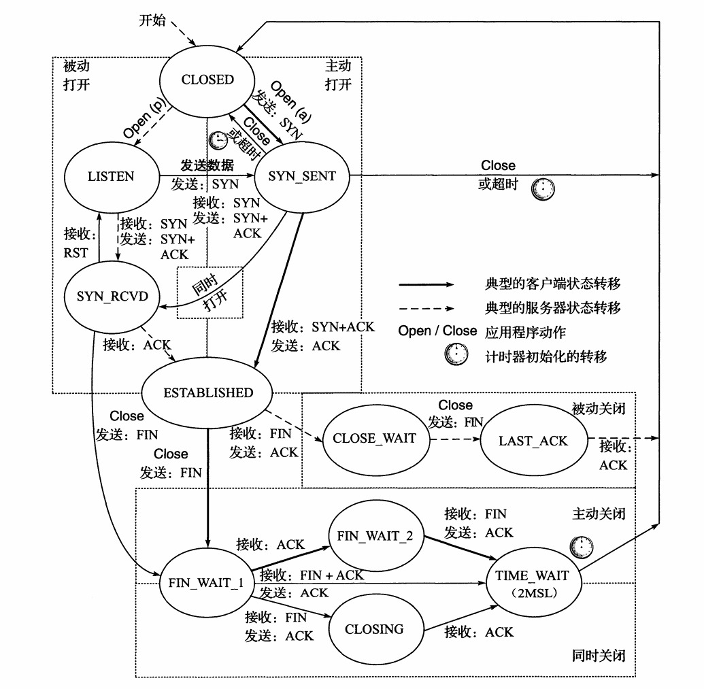
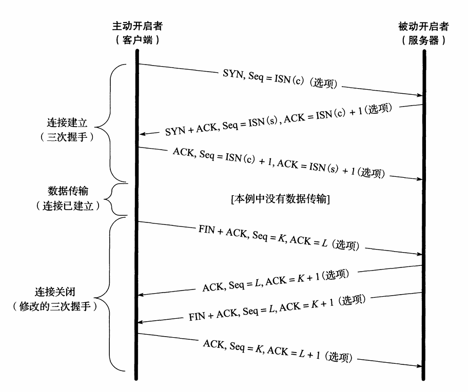
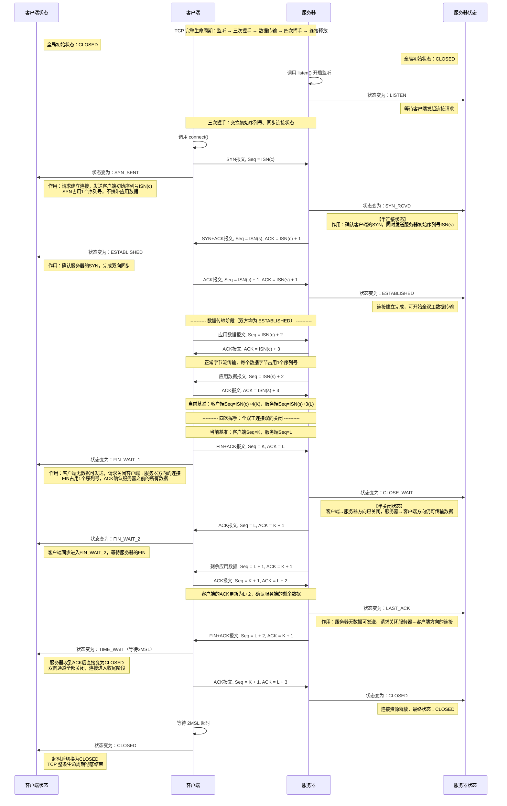
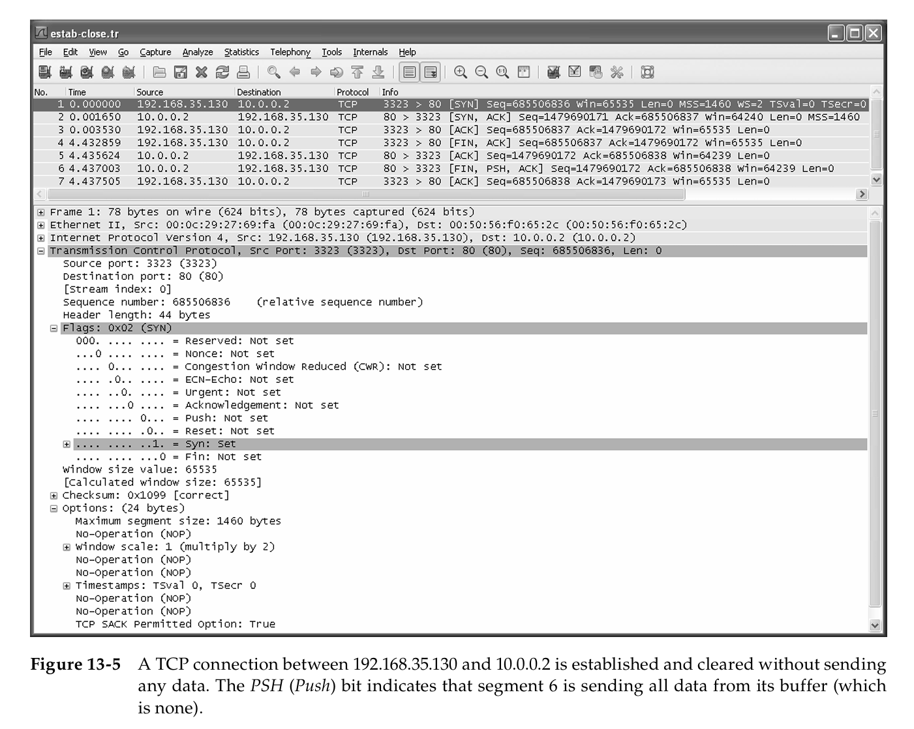
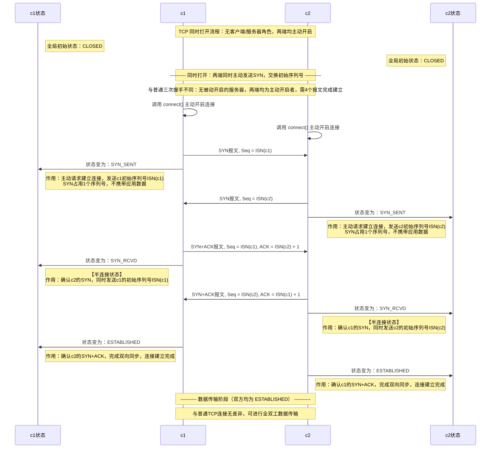
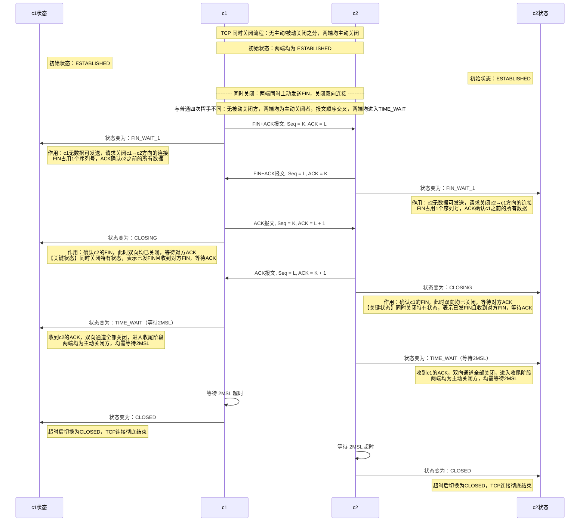

## 正常的TCP建立与终止
### 状态图变化总览

注:
#### **同时打开模式**（极罕见）
没有传统服务端，两边都是主动发起方：
- 两边都不调用 `listen`，两边都调用 `connect`
- 两边都先发 SYN，都进入 SYN_SENT（主动半连接）
- 两个 SYN 报文在网络中 “擦肩而过”，两边发的时候都不知道对方也在连自己
- 两边都收到了对方的纯 SYN（不是正常的 SYN+ACK），于是两边都切换到 SYN_RCVD（被动半连接）
- 两边都回复 SYN+ACK，最终两边都收到对方的确认，同时进入 ESTABLISHED
全程 4 个报文，两边都先后经历了两种半连接状态，这就是图里「同时打开」箭头的含义 —— 从主动半连接 SYN_SENT 直接跳转到被动半连接 SYN_RCVD。
#### LISTEN状态主动发SYN切换成SYN_SENT
>一个已经进入 LISTEN 状态的监听 socket，被应用层主动调用 connect 发起连接，内核发送 SYN 后，状态从 LISTEN 切换到 SYN_SENT
- 先对一个 socket 执行 `bind + listen`，让它进入 **LISTEN** 状态，正常等待客户端连接；
- 紧接着，应用层**不对这个 socket 做 accept，反而直接调用 `connect`**，让它主动向另一个地址发起连接；
- 内核收到这个主动打开指令后，会发送 SYN 报文，同时把 socket 状态从 LISTEN 切换到 **SYN_SENT**。
  从应用层视角：`connect` 是合法的系统调用，`listen` 也是合法的系统调用，两者先后作用在同一个 socket 上，语法上完全成立；
  - 从内核视角：必须给这个组合定义明确的状态跳转规则，不能直接崩溃或报错。
  所以这条路径是**理论完备性的产物**，不是为了实际工程设计的。
#### FIN_WAIT_1的三条分支
分支 1：**收到纯 ACK → 进入 FIN_WAIT_2（最常见的标准路径）**
- **客户端视角**：只收到了对自己 FIN 的确认，没有收到服务端的 FIN
- **服务端对应状态**：处于 **CLOSE_WAIT**
- **完整时序**：
  1. 客户端发 FIN → 服务端收到，立刻回 ACK → 服务端进入 CLOSE_WAIT
  2. 服务端应用层还没调用 close，还有剩余数据要发送，暂时不发自己的 FIN
  3. 客户端收到这个纯 ACK，确认对方已知晓自己的关闭请求，进入 FIN_WAIT_2 继续等待
- **后续**：等服务端数据发完、调用 close 发出 FIN 后，客户端再回 ACK，进入 TIME_WAIT
分支 2：**收到 FIN+ACK → 直接进入 TIME_WAIT（快速关闭路径）**
- **客户端视角**：一个报文里同时携带了「对我 FIN 的确认」和「服务端自己的关闭请求」
- **服务端对应状态**：从 **CLOSE_WAIT 瞬间切换到 LAST_ACK**，两个动作合并为一个报文
- **完整时序**：
  1. 客户端发 FIN → 服务端收到
  2. 服务端应用层刚好也立刻调用了 close，内核把「回 ACK」和「发自己的 FIN」两件事打包到同一个报文里发出
  3. 客户端一次性收到两个信号，回复一个 ACK 后直接进入 TIME_WAIT，跳过 FIN_WAIT_2 中间态
- **本质**：服务端关闭得足够快，把两步合并成一步，相当于把标准四次挥手压缩成了三次。
分支 3：**收到纯 FIN → 进入 CLOSING（同时关闭，极罕见）**
- **客户端视角**：只收到了服务端的 FIN，没有携带对自己 FIN 的确认
- **服务端对应状态**：**服务端不再是被动关闭方**，它也同时主动调用了 close，此时也处于 **FIN_WAIT_1**
- **完整时序**：
  1. 两边几乎同时调用 `close()`，各自向对方发 FIN，各自都进入 FIN_WAIT_1
  2. 两个 FIN 报文在网络中擦肩而过 —— 两边发 FIN 的时候，都还没收到对方的 FIN
  3. 客户端收到服务端的纯 FIN：里面没有对自己 FIN 的 ACK，因为服务端发的时候还没收到客户端的 FIN
  4. **客户端先回复一个 ACK（确认服务端的 FIN），进入 CLOSING；服务端同理也回 ACK，也进入 CLOSING**
  5. 两边随后各自收到对方对自己 FIN 的 ACK，确认自己的关闭请求已被响应，同时进入 TIME_WAIT
#### TIME_WAIT状态的必要性
**目的 1：可靠完成关闭流程的原理**
- 若主动关闭方发出的、**用于确认对端 FIN 的 ACK 报文在传输中丢失**，对端会超时重传 FIN 报文；主动关闭方停留在 TIME_WAIT 阶段时，可正常接收重传的 FIN 并补发对应 ACK，完成闭环确认。
- 若主动关闭方直接进入 CLOSED 状态，系统将不再识别原连接的重传 FIN，**会以 RST 报文作出响应，对端会判定连接出现异常，无法正常完成关闭流程。**
**目的 2：规避旧报文干扰的原理**
- Linux TCP 协议栈限制：同一个端口不支持并发多次打开。如果不存在 TIME_WAIT 等待阶段，应用程序可以立刻使用和已关闭连接完全一致的「源 IP + 源端口 + 目的 IP + 目的端口」四元组新建连接，这类新连接被称为原连接的**化身（incarnation）**；
- 网络中延迟抵达的、归属旧连接的数据报文，会被新连接接收，引发数据错乱。
**2MSL 时长的设计依据**
- TCP 双向传输链路都可能出现报文延迟滞留的情况，2 倍 MSL 的等待时长，可以保证两个传输方向上所有未被接收、滞后滞留的旧 TCP 报文，都会在 MSL 时限内被网络中转设备丢弃。
- 等待满 2MSL 后再建立相同四元组的新连接，就可以完全规避旧连接残留报文的干扰。
**TIME_WAIT 带来的端口占用约束与复现实验**
处于 TIME_WAIT 状态的连接会持续占用对应端口资源，应用若想重启并复用该端口，必须等待 2MSL 超时结束，否则会触发端口绑定失败。
可通过 Linux 的 nc（网络连接工具）复现该现象，操作过程与现象如下：
1. 执行命令 `nc -p 12345 192.168.1.108 80`，指定客户端以固定 12345 端口和目标 Web 服务建立 TCP 连接；
2. 按下 `Ctrl+C` 终止客户端进程，客户端作为主动关闭方进入 TIME_WAIT 状态；
3. 立即执行完全相同的 nc 命令尝试重建连接，系统返回报错 `nc: bind failed: Address already in use`，端口绑定失败；
4. 执行 `netstat -nat` 查看连接状态，可观测到 `192.168.1.108:12345` 条目状态为 TIME_WAIT，端口资源仍被占用。
---

------

**建立过程图示:**



### 时序图

| 状态                    | 所属阶段    | 核心作用                              |
| ----------------------- | ----------- | ------------------------------------- |
| LISTEN                  | 监听阶段    | 服务端就绪，被动等待连接              |
| SYN_SENT                | 建连阶段    | 客户端已发出连接请求                  |
| SYN_RCVD                | 建连阶段    | 服务端收到 SYN，**半连接**            |
| ESTABLISHED             | 传输阶段    | 连接完全就绪，全双工收发数据          |
| FIN_WAIT_1 / FIN_WAIT_2 | 断连阶段    | 主动关闭方的过渡状态                  |
| CLOSE_WAIT              | 断连阶段    | 被动关闭方，**半关闭**                |
| LAST_ACK                | 断连阶段    | 被动关闭方等待最终确认                |
| TIME_WAIT               | 收尾阶段    | 主动关闭方等待 2MSL，兜底网络残留报文 |
| CLOSED                  | 初始 / 结束 | 无任何 TCP 连接资源                   |



### 例子

了解TCP连接的建立与释放流程后，我们来看具体的报文级交互细节。我们通过Windows上的Telnet客户端，向IPv4地址为`10.0.0.2`的本地Web服务器发起TCP连接：

```cmd
C:\> telnet 10.0.0.2 80
Welcome to Microsoft Telnet Client
Escape Character is 'CTRL+]'
... wait about 4.4 seconds ...
Microsoft Telnet> quit
```

`telnet`命令会向`10.0.0.2`的80端口（HTTP/Web服务的知名端口）发起TCP连接。当Telnet客户端连接到非23端口（Telnet协议的知名端口[RFC0854]）时，不会执行Telnet应用层协议，仅将用户输入的字节复制到TCP连接中，同时将从TCP连接收到的字节输出到终端。Web服务器收到连接请求后，会等待客户端发送网页请求；本示例中我们未发送任何请求，因此服务器不会返回数据。这一场景非常适合我们的分析需求，因为我们只需关注连接建立和终止过程中的报文交互。图13-5展示了该命令产生的报文段的Wireshark抓包结果。



从抓包结果可见：
客户端首先发送一个SYN报文，其中包含初始序列号（ISN）`685506836`，窗口通告值为`65535`，报文还包含多个TCP选项（详见第13.3节）。
第二个报文段是服务器的SYN报文，同时也是对客户端SYN的确认报文：服务器的初始序列号为`1479690171`，确认号为`685506837`（比客户端的ISN大1），表明服务器已成功接收客户端的SYN。该报文还包含窗口通告值，表明服务器最多可接收`64240`字节的数据。
第三次握手由第三个报文段完成，其确认号为`1479690172`。注意：确认号是**累计确认**的，始终表示确认方期望收到的下一个字节的序列号（而非最后收到的字节的序列号）。

约4.4秒的停顿后，用户通过`quit`命令关闭连接，客户端TCP层随即发送FIN报文（第4个报文段），其序列号为`685506837`，服务器在第5个报文段中对该FIN进行确认（确认号为`685506838`）。随后，服务器发送自身的FIN报文（序列号为`1479690172`），该报文还会再次对客户端的FIN进行冗余确认。注意，此时PSH（推送）标志位被置为1，这对连接关闭无实际影响，但通常表示服务器没有更多数据需要发送。最后一个报文段包含确认号`1479690173`，对服务器的FIN进行确认。

## 同时打开连接

### 差异点

| 维度                | 同时打开                                                     | 普通三次握手                                                 |
| ------------------- | ------------------------------------------------------------ | ------------------------------------------------------------ |
| 角色                | 无客户端 / 服务器之分，两端均为主动开启者                    | 客户端主动开启，服务器被动开启                               |
| 报文数              | 4 个（比普通多 1 个）                                        | 3 个                                                         |
| 状态变化            | 两端均经历 `CLOSED → SYN_SENT → SYN_RCVD → ESTABLISHED`      | 客户端：`CLOSED → SYN_SENT → ESTABLISHED`服务器：`LISTEN → SYN_RCVD → ESTABLISHED` |
| 为什么多 1 个报文？ | 两端同时主动发送 SYN，因此两端都需要回复 SYN+ACK，形成交叉的 4 报文交互 | 仅客户端主动发 SYN，服务器回复 1 个 SYN+ACK，客户端再回复 1 个 ACK，共 3 个报文 |
| 发生概率            | 极低，需两端同时向对方的固定端口发起主动连接                 | 常规场景，客户端向服务器的被动端口发起连接                   |

### 时序图



## 同时关闭连接

### 差异点

| 维度             | 同时关闭                                                     | 普通四次挥手                                                 |
| ---------------- | ------------------------------------------------------------ | ------------------------------------------------------------ |
| 角色             | 无主动 / 被动关闭之分，两端均为主动关闭者                    | 客户端主动关闭，服务器被动关闭                               |
| 报文数           | 4 个（与普通相同，但顺序交叉）                               | 4 个（顺序线性）                                             |
| 状态变化         | 两端均经历 `ESTABLISHED → FIN_WAIT_1 → CLOSING → TIME_WAIT → CLOSED` | 主动关闭方：`ESTABLISHED → FIN_WAIT_1 → FIN_WAIT_2 → TIME_WAIT → CLOSED`被动关闭方：`ESTABLISHED → CLOSE_WAIT → LAST_ACK → CLOSED` |
| 为什么顺序交叉？ | 两端同时主动发送 FIN，形成交叉传输的 FIN 报文，随后两端再交叉回复 ACK | 客户端先发 FIN，服务器回复 ACK，服务器再发 FIN，客户端回复 ACK，顺序线性 |
| 关键差异点       | 1. 两端均进入`CLOSING`状态（普通流程无此状态）2. 两端均需等待 2MSL，进入`TIME_WAIT`状态 | 1. 无`CLOSING`状态2. 仅主动关闭方进入`TIME_WAIT`，被动关闭方收到 ACK 后直接变为`CLOSED` |
| 发生概率         | 极低，需两端同时发起关闭操作                                 | 常规场景，客户端或服务器发起关闭                             |

### 时序图



-
