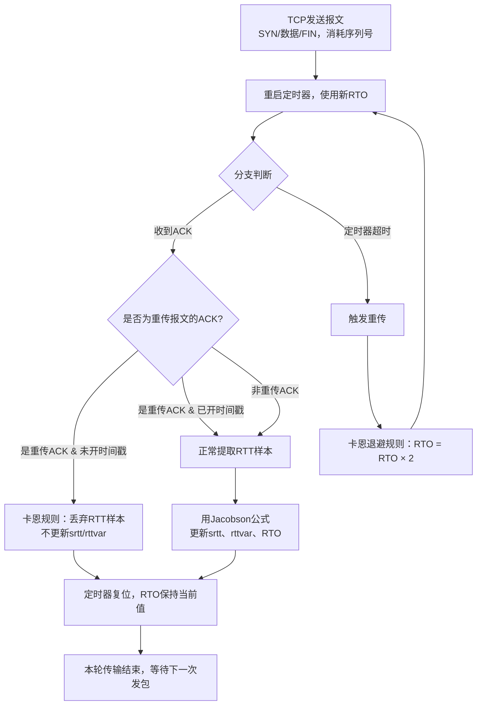
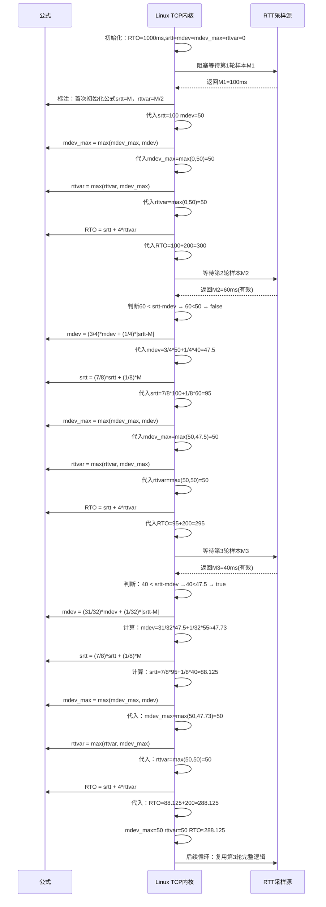
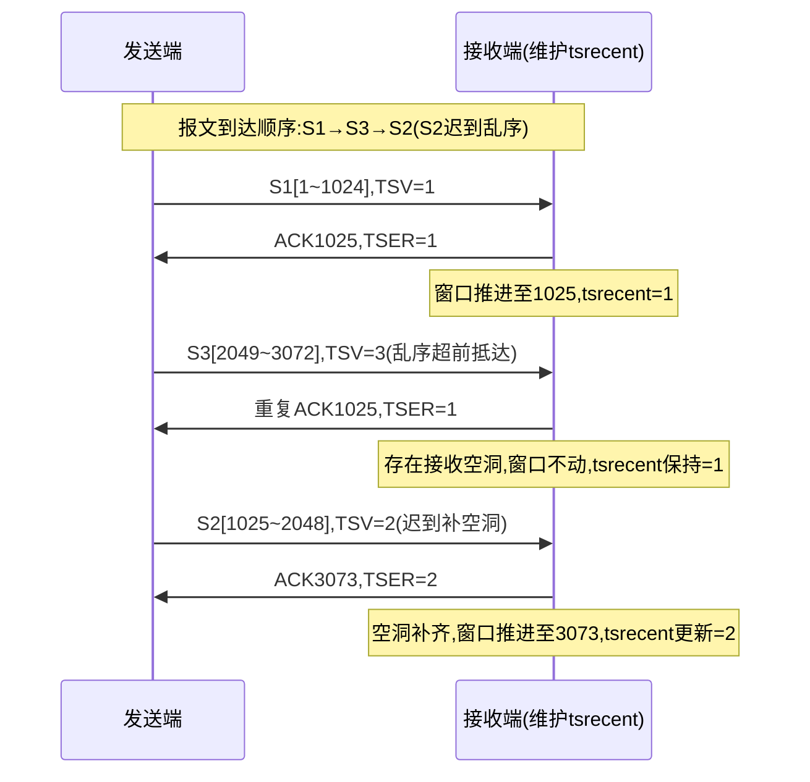
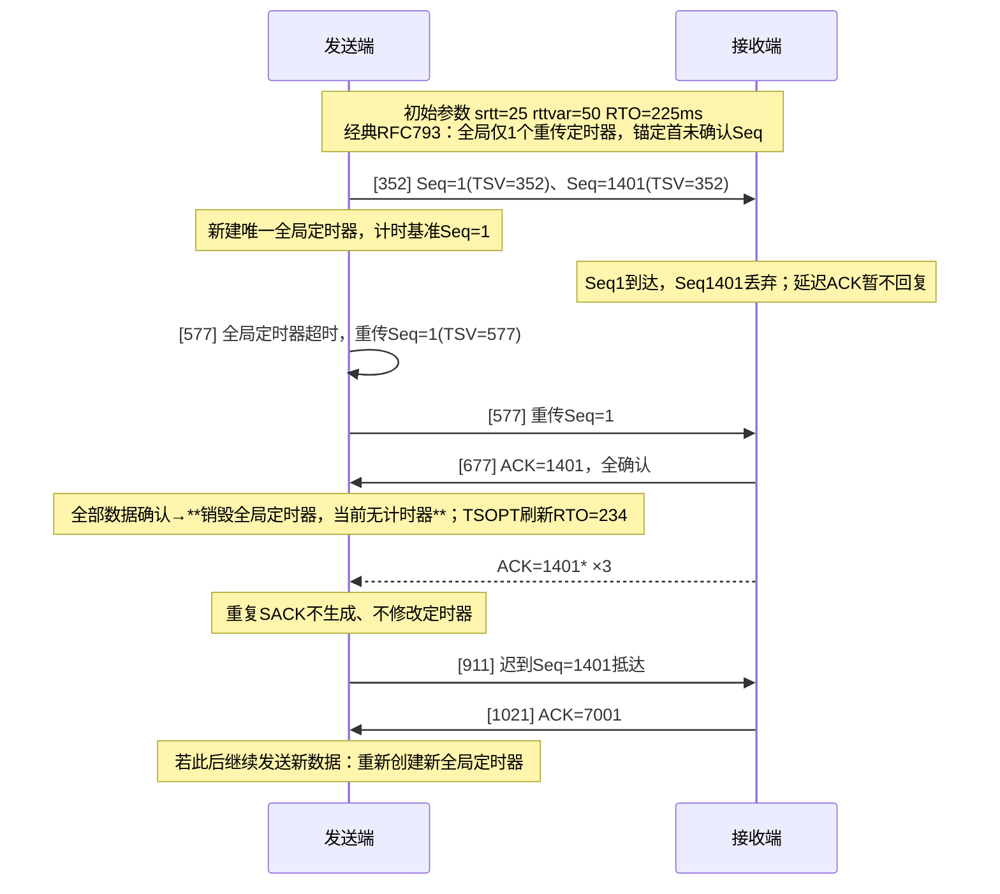

> RTO 重传超时时间 Retransmission Timeout, RTO
> RTT 基于连接的往返时间 Round-Trip Time, RTT
## 简单超时与重传示例
### 例子:
此处使用的MAC地址`00:00:1a:1b:1c:1d`仅为局域网中未被使用的地址，无特殊含义。从执行初始命令到连接超时，大约经过了3.2分钟。由于没有主机响应，所有产生的报文段均来自客户端。清单13-1展示了连接建立超时过程中的Wireshark抓包结果（文本模式的报文摘要）：
| No.  | Time      | Source         | Destination    | Protocol | Info               |
| - | ------ | -------------- | -------------- | -------- | ------------------ |
| 1    | 0.000000  | 192.168.10.144 | 192.168.10.180 | TCP      | 32787 > http [SYN] |
| 2    | 2.997928  | 192.168.10.144 | 192.168.10.180 | TCP      | 32787 > http [SYN] |
| 3    | 8.997962  | 192.168.10.144 | 192.168.10.180 | TCP      | 32787 > http [SYN] |
| 4    | 20.997942 | 192.168.10.144 | 192.168.10.180 | TCP      | 32787 > http [SYN] |
| 5    | 44.997936 | 192.168.10.144 | 192.168.10.180 | TCP      | 32787 > http [SYN] |
| 6    | 92.997937 | 192.168.10.144 | 192.168.10.180 | TCP      | 32787 > http [SYN] |
主要看重连时间间隔:**第二个报文在第一个报文发送3秒后发出**，第三个在第二个报文发送**6秒后发出**，第四个在第三个报文发送**12秒后**发出，以此类推。这种行为称为**指数退避（exponential backoff）**，与以太网CSMA/CD介质访问控制协议中的退避机制类似（详见第3章），但两者存在差异：TCP的退避时间是确定性的（始终为前一次的两倍），而以太网中是最大退避时间加倍，实际退避时间随机选择。
### 核心参数说明:
- RFC 1122：R1/R2 允许使用 **重传次数 或 等待时长** 两种计量方式；
- Linux 实现：统一固定为 **重传次数**，弱化时长概念；
- 本质：次数是固定配置，时长由「RTO + 指数退避」动态决定。
- 部分系统支持配置初始SYN报文的重试次数，通常默认值较小（如5次）。在Linux系统中：
#### R1/R2具体行为边界:
| 阈值名称 | 定位                                         | 到达阈值后核心行为                                           | SYN 报文（连接建立阶段）规范                   | 普通数据报文（数据传输阶段）规范 |
| -------- | -------------------------------------------- | ------------------------------------------------------------ | ---------------------------------------------- | -------------------------------- |
| R1       | 前置干预阈值（中间预警点，非连接终止点）     | 不关闭连接；向 IP 层发送负向路由建议，触发 IP 重新探测、评估、切换路由 | 至少重传 3 次                                  | 无固定强制标准，由操作系统自定义 |
| R2       | 最终放弃阈值（连接终止临界点，**R2 ＞ R1**） | 停止重传，主动关闭 TCP 连接，向上层应用上报连接异常          | 总等待时长至少 100 秒，且下限收紧为至少 3 分钟 | 无统一强制时长，由操作系统自定义 |
| 阈值 | 到达后动作         | 连接状态 | 跨层行为                  |
| ---- | ------------------ | -------- | ------------------------- |
| R1   | 触发 IP 重新选路   | 保持连接 | TCP → IP 发送路由负向建议 |
| R2   | 停止重传、关闭连接 | 断开连接 | 向上层应用报错            |
#### 操作系统的实现:
| 协议标准       | 含义         | 对应 Linux 参数                  | 默认值       | 对应 Windows 参数         | 默认值 | 触发动作            |
| -------------- | ------------ | -------------------------------- | ------------ | ------------------------- | ------ | ------------------- |
| R1（数据报文） | 路由干预阈值 | tcp_retries1                     | 3            | 无公开可配项              | -      | IP 重选路，连接保留 |
| R2（数据报文） | 连接放弃阈值 | tcp_retries2                     | 15           | TcpMaxDataRetransmissions | 5      | 断开 TCP 连接       |
| R1（SYN 报文） | 路由干预阈值 | 内嵌逻辑，无独立参数             | ≥3 次        | 内嵌逻辑                  | -      | IP 重选路           |
| R2（SYN 报文） | 建连放弃阈值 | tcp_syn_retries / synack_retries | 5（≈3 分钟） | 内嵌逻辑                  | -      | 终止连接尝试        |
- `net.ipv4.tcp_syn_retries`：系统配置变量，定义主动打开连接时重发SYN报文的最大次数。
- `net.ipv4.tcp_synack_retries`：对应变量，定**义响应对端**主动打开请求时重发SYN+ACK报文的最大次数。
  也可通过Linux特有的`TCP_SYNCNT`套接字选项，针对单个连接设置重试次数，默认值为5次，与本示例一致。这些重传之间的指数退避机制，是TCP拥塞控制的一部分，后续讨论卡恩算法（Karn's algorithm，详见第16章）时会详细说明。
## 基于RTT的RTO设置
> 当前 Linux、Windows、BSD 等所有主流操作系统，统一采用 **Jacobson 标准算法 + 卡恩(Karn)算法 + 时钟边界约束 + 时间戳优化** 组合方案，完全替代早期 RFC 0793 经典算法。
> 下面按「**算法对比 → 核心公式 → 初始规则 → 卡恩算法 → 全流程流程图 → 场景汇总表**」逐层拆解。
---

### 一、新旧算法核心对比表
| 对比项     | 早期经典算法（RFC 0793）                | 现行主流标准算法（Jacobson / RFC 6298）             |
| ---------- | --------------------------------------- | --------------------------------------------------- |
| 计算依据   | 仅平滑平均时延 `SRTT`                   | 平滑平均时延 `srtt` + 时延波动偏差 `rttvar`         |
| 核心公式   | $\text{RTO} = \text{SRTT} \times \beta$ | $\text{RTO} = \text{srtt} + 4 \times \text{rttvar}$ |
| 抗波动能力 | 弱，RTT 抖动大时易误重传                | 强，可适配无线网络、路由切换等复杂网络              |
| 实现开销   | 低                                      | 中等，权重取 2 的负幂，可用移位运算优化             |
| 配套机制   | 无专门重传歧义处理                      | 搭配卡恩算法、时钟粒度、时间戳完善工程问题          |

---

### 二、Jacobson 核心计算公式（主流算法主体）
### 1. 基础变量说明
| 变量            | 含义                              | 固定取值                  |
| --------------- | --------------------------------- | ------------------------- |
| $M$             | 单次 RTT 采样样本（实测往返时间） | 动态实测值                |
| $\text{srtt}$   | 平滑平均往返时延（EWMA 加权均值） | 动态迭代更新              |
| $\text{rttvar}$ | 时延平均偏差（表征 RTT 抖动幅度） | 动态迭代更新              |
| $g$             | 均值更新权重                      | $g = \dfrac{1}{8}$        |
| $h$             | 偏差更新权重                      | $h = \dfrac{1}{4}$        |
| $G$             | 系统时钟粒度（计时最小单位）      | Linux=1ms，传统系统=500ms |

> 设计细节：$g、h$ 取 2 的负幂，计算机可通过**移位运算**替代乘除，提升执行效率。

### 2. RTT 均值 & 偏差迭代公式（两种等价写法）

#### 写法1：标准原始形式

$$
\begin{align}
\text{srtt} &\leftarrow (1-g) \cdot \text{srtt} + g \cdot M \\
\text{rttvar} &\leftarrow (1-h) \cdot \text{rttvar} + h \cdot |M - \text{srtt}|
\end{align}
$$

#### 写法2：工程简化形式（减少运算，系统常用）
引入误差项 $\text{Err} = M - \text{srtt}$
$$
\begin{align}
\text{Err} &= M - \text{srtt} \\
\text{srtt} &\leftarrow \text{srtt} + g \cdot \text{Err} \\
\text{rttvar} &\leftarrow \text{rttvar} + h \cdot (|\text{Err}| - \text{rttvar})
\end{align}
$$

### 3. 最终 RTO 计算公式（含时钟粒度 + 强制边界）
RFC 6298 强制约束：**RTO 最小 1000ms（1秒）**，同时结合时钟粒度 $G$：
$$
\text{RTO} = \max\big(\text{srtt} + \max(G,\ 4 \cdot \text{rttvar}),\ 1000\big)
$$
- 系数 $4$：由早期 $2$ 迭代而来，成为行业标准；
- 可选上限：RTO 可配置上限，但规范要求上限不得低于 60s。

---

### 三、参数初始值规则（连接建立阶段）
连接刚建立时无任何 RTT 样本，采用固定初始值，表格+公式结合：

| 阶段                            | 规则 & 公式                                                  |
| ------------------------------- | ------------------------------------------------------------ |
| 连接初始（无RTT样本）           | 初始 $\text{RTO} = 1000\ \text{ms}$ <br> 若首次 SYN 报文超时，临时改为 $\text{RTO}=3000\ \text{ms}$ |
| 收到**第一个有效 RTT 样本 $M$** | $$\begin{align}\text{srtt} &\leftarrow M \\ \text{rttvar} &\leftarrow \dfrac{M}{2}\end{align}$$<br />(协议强制规定) |


---

### 四、卡恩算法（Karn's Algorithm）：解决重传歧义 + 指数退避
Jacobson 算法负责**计算 RTO 数值**，卡恩算法负责**规范重传场景下的采样与超时策略**，分为两大核心部分，是主流 TCP 必选配套规则。

#### 1. 第一部分：解决「重传歧义」（RTT 采样约束）
- 场景：报文超时 → 重传 → 收到 ACK
- 规则：**该 ACK 对应的 RTT 样本作废，不更新 $\boldsymbol{\text{srtt}}$ 和 $\boldsymbol{\text{rttvar}}$**
- 目的：无法区分 ACK 应答的是「首次发送」还是「重传报文」，避免错误样本污染时延估算。
- 例外：启用 **TCP 时间戳选项** 后，报文与 ACK 精准一一对应，歧义消失，此规则失效。

#### 2. 第二部分：二进制指数退避（超时后 RTO 倍增）
- 规则：每发生一次重传超时，当前 $\text{RTO}$ **翻倍**；
- 恢复条件：收到**未经过重传**的报文对应的 ACK 时，退避终止，RTO 回归 Jacobson 算法计算值；
- 作用：网络持续丢包时，主动拉长超时时间，降低重传频率，缓解网络压力。

---

### 五、完整执行流程图（Mermaid）
覆盖「正常传输、超时重传、指数退避、重传歧义、时间戳」全场景，采用标准流程图：



---

### 六、典型场景行为汇总表（速查）
| 运行场景                                | RTT采样动作                        | RTO 变化规则                    | 依赖算法              |
| --------------------------------------- | ---------------------------------- | ------------------------------- | --------------------- |
| 连接初始化（无样本）                    | 无采样                             | 初始RTO=1s；SYN超时则临时改为3s | RFC 6298 初始规则     |
| 首次收到有效RTT样本                     | 执行初始化公式：srtt=M，rttvar=M/2 | 按 Jacobson 公式计算新 RTO      | Jacobson 算法         |
| 正常传输（无重传，收到ACK）             | 正常采样，迭代更新 srtt/rttvar     | 动态更新 RTO                    | Jacobson 算法         |
| 报文超时重传，收到对应ACK（未开时间戳） | 丢弃本次RTT样本，不更新参数        | RTO 维持退避后的值              | 卡恩算法(歧义规则)    |
| 连续多次超时重传                        | 不采样                             | 每次超时 RTO 翻倍（指数退避）   | 卡恩算法(退避规则)    |
| 启用TCP时间戳 + 重传后收到ACK           | 正常采样（无歧义）                 | 正常更新 RTO                    | 时间戳优化 + Jacobson |

---

### 七、整体逻辑闭环总结
1. **基础计时**：发包启动定时器，超时阈值由 Jacobson 算法基于「平均时延+时延抖动」动态算出；
2. **正常链路**：收到 ACK → 采样 RTT → 迭代更新时延参数，RTO 自适应网络变化；
3. **链路丢包**：定时器超时 → 重传 + RTO 翻倍（指数退避），减少网络冲击；
4. **重传歧义**：无时间戳时，重传报文的 ACK 不参与 RTT 计算，避免参数失真；
5. **精准优化**：开启 TCP 时间戳，彻底解决重传歧义，全场景正常采样。

这套组合是目前工业界 TCP 超时重传的**标准实现范式**。

## Linux的实现

Linux TCP 的 RTO 估计算法，是对 **RFC 6298 标准 Jacobson 算法的工程级优化实现**，专为 Linux 1ms 细粒度时钟、默认开启 TCP 时间戳（TSOPT）的高频采样场景设计，解决了标准算法在该场景下的两个核心缺陷：
1.  高频采样导致偏差估计值（`rttvar`）被过度压低，易引发不必要的误重传；
2.  RTT 显著下降时，偏差估计值反而增大，导致 RTO 异常升高、传输效率下降。

---

### 一、设计背景：标准算法的适配缺陷
| 场景特性                                | 标准RFC 6298的适配问题                                       | 影响                                                         |
| --------------------------------------- | ------------------------------------------------------------ | ------------------------------------------------------------ |
| 1ms细粒度时钟+TCP时间戳高频采样         | 大量密集RTT样本会因大数定律，将实时偏差估计（`rttvar`）压至极低（接近0） | 直接用该值计算RTO，会导致超时阈值过小，频繁误判丢包、触发不必要重传 |
| RTT显著下降（如网络路由优化、负载降低） | 偏差项权重固定为`1/4`，样本低于`srtt`时仍会增大`rttvar`，导致RTO异常升高 | 实际网络变快，但TCP超时阈值反而被拉高，传输效率下降          |

---

### 二、核心变量体系（分层约束设计）
Linux 打破了标准算法“单层偏差变量”的结构，采用三层变量体系实现兜底防护，各变量的定义与约束如下：

| 变量名     | 定义                              | 更新规则                                                     | 强制约束                    | 核心作用                                          |
| ---------- | --------------------------------- | ------------------------------------------------------------ | --------------------------- | ------------------------------------------------- |
| `srtt`     | 平滑RTT估计值（指数加权移动平均） | 标准EWMA迭代：<br>`srtt = (7/8)*srtt + (1/8)*M`（`M`为RTT样本） | 无额外硬约束                | 反映RTT的平均水平，作为RTO计算的基础项            |
| `mdev`     | 实时RTT平均偏差估计值             | 含条件权重的偏差迭代：<br>正常场景：`mdev = (3/4)*mdev + (1/4)*|srtt-M|`<br>RTT下降场景：`mdev = (31/32)*mdev + (1/32)*|srtt-M|` | 无直接硬约束                | 反映RTT的实时波动情况，为`mdev_max`提供输入       |
| `mdev_max` | 数据窗口内`mdev`的历史最大值      | 每次更新`mdev`后，取`max(mdev_max, mdev)`                    | 强制下限：`mdev_max ≥ 50ms` | 记录近期RTT的最大波动，为`rttvar`提供兜底约束     |
| `rttvar`   | 最终用于RTO计算的偏差估计值       | 每个数据窗口边界更新，取`max(当前rttvar, mdev_max)`；每个窗口仅允许降低一次 | 强制等于或大于`mdev_max`    | 作为RTO计算的偏差项，确保超时阈值留有足够安全余量 |

---

### 三、关键改造与算法逻辑
#### 1. 核心改造点1：`mdev_max`兜底约束（解决偏差低估问题）
- 逻辑：不再直接用实时`mdev`参与RTO计算，而是用窗口内的历史最大值`mdev_max`作为`rttvar`的下限，且强制不低于50ms；
- 推导效果：结合`RTO = srtt + 4*rttvar`，Linux的RTO被强制约束为**不低于200ms**；
- 目的：避免瞬时平稳的RTT样本导致偏差估计被过度压低，减少误重传。

#### 2. 核心改造点2：条件权重调整（解决RTT下降时RTO异常升高）

##### 标准算法的问题（无分支判断）

无论新样本 M 偏高还是偏低，都使用固定权重：

\(mdev = \frac{3}{4}mdev + \frac{1}{4}|M - srtt|\)

当 \(M \ll srtt\)（时延大幅下降）时：

\(|M-srtt|\) 会变得很大 → 正常权重会把 `mdev` 明显拉高

→ 进而 `rttvar` 被拉高 → 最终 \(\boldsymbol{RTO = srtt + 4\cdot rttvar}\) 异常变大。

- 触发条件：新的RTT样本`M < srtt - mdev`（即样本低于预期RTT范围的下限，说明RTT显著下降）；
- 权重调整：偏差项的权重从标准的`1/4`降低为`1/32`（降低8倍），大幅减小RTT下降对`mdev`的影响；
- 完整逻辑（原文实现）：
  ```c
  if (m < (srtt - mdev))
      mdev = (31/32) * mdev + (1/32) * |srtt - m|;
  else
      mdev = (3/4) * mdev + (1/4) * |srtt - m|;
  ```

#### 3. 额外约束：RTO上下限与窗口级更新

- 上限约束：RTO不超过`TCP_RTO_MAX`（默认值为120秒）；
- 稳定性约束：`rttvar`每个数据窗口仅允许降低一次，避免频繁波动导致的RTO震荡。

---

### 四、与标准RFC 6298算法的对比
| 对比维度         | RFC 6298 标准Jacobson算法                            | Linux改造版算法                                              |
| ---------------- | ---------------------------------------------------- | ------------------------------------------------------------ |
| 变量体系         | 单层变量：`srtt` + `rttvar`，`rttvar`直接参与RTO计算 | 三层变量：`srtt` + `mdev`（实时偏差） + `mdev_max`（窗口最大偏差） + `rttvar`（受约束的最终偏差） |
| `rttvar`更新逻辑 | 随每个RTT样本实时迭代，无历史峰值约束                | 每个数据窗口边界更新，强制不低于`mdev_max`，且每个窗口仅允许降低一次 |
| 偏差项权重       | 固定权重：偏差项权重恒为`1/4`                        | 条件权重：RTT样本低于预期下限时，偏差项权重降低为`1/32`（8倍） |
| RTO下限约束      | 依赖RTO本身的配置下限（标准建议1s）                  | 由`mdev_max ≥50ms`强制推导，`RTO ≥ 200ms`                    |
| 采样场景适配     | 适配粗粒度时钟（500ms）+ 低频率RTT采样               | 适配1ms细粒度时钟 + TCP时间戳高频RTT采样                     |
| RTT下降处理      | 无特殊处理，偏差权重固定，易导致RTO异常升高          | 条件降低偏差权重，抑制RTO在RTT下降时的不合理上升             |
| 偏差低估防护     | 无防护，高频采样易导致`rttvar`被压至接近0            | 窗口内最大偏差兜底，避免偏差估计被过度压低                   |

---

| 变量名     | 定义                              | 更新规则                                                     | 强制约束                    | 核心作用                                          |
| ---------- | --------------------------------- | ------------------------------------------------------------ | --------------------------- | ------------------------------------------------- |
| `srtt`     | 平滑RTT估计值（指数加权移动平均） | 标准EWMA迭代： `srtt = (7/8)*srtt + (1/8)*M`（`M`为RTT样本） | 无额外硬约束                | 反映RTT的平均水平，作为RTO计算的基础项            |
| `mdev`     | 实时RTT平均偏差估计值             | 含条件权重的偏差迭代： 正常场景：`mdev = (3/4)*mdev + (1/4)*|srtt-M|` RTT下降场景：`mdev = (31/32)*mdev + (1/32)*|srtt-M|` | 无直接硬约束                | 反映RTT的实时波动情况，为`mdev_max`提供输入       |
| `mdev_max` | 数据窗口内`mdev`的历史最大值      | 每次更新`mdev`后，取`max(mdev_max, mdev)`                    | 强制下限：`mdev_max ≥ 50ms` | 记录近期RTT的最大波动，为`rttvar`提供兜底约束     |
| `rttvar`   | 最终用于RTO计算的偏差估计值       | 每个数据窗口边界更新，取`max(当前rttvar, mdev_max)`；每个窗口仅允许降低一次 | 强制等于或大于`mdev_max`    | 作为RTO计算的偏差项，确保超时阈值留有足够安全余量 |

> mdev ---> mdev_max ---> rttvar 他们同根同源

### 五、完整执行流程图（Mermaid）



---

### 六、基于图14-2的示例流程（数值验证）
对应原文中Linux 2.6与FreeBSD 5.4的TCP连接启动过程，变量变化如下：

| 阶段       | RTT样本M(ms)        | srtt(ms) | mdev(ms) | mdev_max(ms)  | rttvar(ms) | RTO(ms)     | 关键说明                                                 |
| ---------- | ------------------- | -------- | -------- | ------------- | ---------- | ----------- | -------------------------------------------------------- |
| 初始化     | 16（SYN-ACK）       | 16       | 8        | max(8,50)=50  | 50         | 16+4*50=216 | 首次样本初始化，`rttvar`受`mdev_max`约束，而非实时`mdev` |
| 第二次采样 | 96（首个数据段ACK） | 26       | 26       | max(50,26)=50 | 50         | 26+4*50=226 | 样本高于预期下限，标准权重更新`mdev`，`mdev_max`不变     |
| 第三次采样 | 54                  | 29       | 26       | 50            | 50         | 229         | 样本低于预期下限，低权重更新`mdev`，避免`rttvar`被拉高   |
| 第四次采样 | 123                 | 41       | 26       | 50            | 50         | 241         | 正常更新，`rttvar`始终不低于`mdev_max`                   |
| 第五次采样 | 110                 | 49       | 26       | 50            | 50         | 249         | 正常更新，`RTO`受`200ms`下限约束                         |

---

### 七、设计目的与效果总结
1.  核心目标：在保留Jacobson算法核心逻辑的基础上，解决标准算法在细粒度时钟+高频采样场景下的偏差低估和RTT下降时的RTO异常问题，提升TCP在现代网络下的稳定性与效率。
2.  实际效果：根据原文引用的[RKS07]研究，Linux的RTO估计算法在280万条TCP流的评估中，收敛速度快、调优性强，是被研究算法中最有效的实现之一；通过`mdev_max`兜底和条件权重调整，有效减少了误重传和不必要的RTO升高。
3.  额外说明：200ms的RTO下限会对数据中心低延迟网络造成影响（TCP incast问题），需通过内核配置调整，不建议在公网使用极低RTO。

## RTT估算器行为分析和往返时延测量(RTTM)在丢包、报文乱序场景下的鲁棒性

### RTT估算器行为分析

> 基于原书高斯仿真实验 + TSOPT乱序/重传原文，整合译文、原理解析、演算、时序图、对比表格、扩展知识点
> RTT Estimator Behaviors：RFC6298标准 VS Linux TCP自研实现

#### 1.1 原文中文翻译
正如前文所述，TCP的RTO超时配置、RTT往返时延估计算法经过大量工程迭代与创新优化。图14-3在一套人工合成数据集上对比主流两套估计算法：**RFC6298标准算法、Linux内核定制算法**。为方便对照，本仿真去掉RFC6298规定的RTO最小值1s约束；现实中绝大多数商用TCP实现均未遵守该强制规范。

仿真数据集共200个RTT采样：
- 前100样本：正态分布 $\boldsymbol{N(200,50)}$（均值200ms，标准差50）
- 后100样本：正态分布 $\boldsymbol{N(50,50)}$（均值骤降到50ms，链路突然变快，负数采样全部取正值）
`+`符号代表单次实测RTT采样点；第100号样本后RTT断崖下跌。
实验结论：**Linux算法在第100个样本后可快速下调RTO；RFC标准算法需要额外20个样本才能完成同等幅度RTO回落**。

单独观察Linux的`rttvar`曲线：数值整体平稳波动。根源是Linux对`mdev_max`设置**50ms硬下限**，连带`rttvar ≥50ms`，最终等效约束 $\boldsymbol{RTO=srtt+4\times rttvar ≥200ms}$，规避无意义虚假重传；代价是丢包场景下定时器触发偏慢、小幅降低传输性能。
RFC原生算法存在缺陷：在78、191采样点极易出现RTT异常暴涨、RTO虚高，诱发不必要虚假重传。

#### 1.2 核心公式汇总表
| 计算项                | RFC6298标准公式                                              | Linux内核定制公式                                            |
| --------------------- | ------------------------------------------------------------ | ------------------------------------------------------------ |
| 平滑RTT(srtt)         | $\mathrm{srtt}=\frac78\mathrm{srtt}+\frac18M$                | $\mathrm{srtt}=\frac78\mathrm{srtt}+\frac18M$（和标准完全一致） |
| 瞬时偏差(mdev/rttvar) | $\mathrm{rttvar}=\frac34\mathrm{rttvar}+\frac14|\mathrm{srtt}-M|$（固定权重） | 分支判定：$\boldsymbol{M<srtt-mdev}$<br>✅成立(链路骤降):$\mathrm{mdev}=\frac{31}{32}\mathrm{mdev}+\frac1{32}|\mathrm{srtt}-M|$<br>❌不成立(正常/变慢):$\mathrm{mdev}=\frac34\mathrm{mdev}+\frac14|\mathrm{srtt}-M|$ |
| 历史最大偏差          | 无                                                           | $\boldsymbol{mdev_{max}=max(mdev_{max},mdev)}$，最低锁定50ms |
| 最终偏差rttvar        | rttvar直接等于计算结果                                       | $\boldsymbol{rttvar=max(rttvar,mdev_{max})}$                 |
| RTO计算公式           | $\mathrm{RTO}=max(\mathrm{srtt}+4\mathrm{rttvar},1000ms)$    | $\mathrm{RTO}=\mathrm{srtt}+4\times\mathrm{rttvar}$，天然下限200ms |

#### 1.3 Linux三层变量链路解析（同根同源）

```
单次RTT采样M → mdev(实时瞬时偏差) → mdev_max(历史最大偏差,≥50ms) → rttvar(最终偏差因子) → RTO
```
1. **mdev**：单次采样算出的实时抖动，区分双权重，解决链路突降导致mdev暴涨问题；
2. **mdev_max**：保存全生命周期最大mdev，下限50ms，Linux独有保护项；
3. **rttvar**：取历史最大值，杜绝rttvar被极小mdev拉低，防止RTO过小乱重传。

#### 1.4 三轮采样数值演算（M1=100ms，M2=60ms，M3=40ms）
| 采样轮次     | 实测M | 判定条件$M<srtt-mdev$                  | mdev计算                 | srtt   | mdev_max         | rttvar        | RTO=srtt+4*rttvar |
| ------------ | ----- | -------------------------------------- | ------------------------ | ------ | ---------------- | ------------- | ----------------- |
| 初始化M1=100 | 100ms | 首次初始化：$\boldsymbol{mdev=M/2=50}$ | 50.00                    | 100.00 | max(0,50)=50     | max(0,50)=50  | 300ms             |
| M2=60        | 60ms  | $60<100-50=50$ → false                 | 3/4*50+1/4*40=47.50      | 95.00  | max(50,47.5)=50  | max(50,50)=50 | 295ms             |
| M3=40        | 40ms  | $40<95-47.5=47.5$ → true               | 31/32*47.5+1/32*55≈47.73 | 88.125 | max(50,47.73)=50 | max(50,50)=50 | 288.125ms         |

#### 1.5 两种算法优缺点对比
| 项目         | RFC6298标准                                                  | Linux TCP                                         |
| ------------ | ------------------------------------------------------------ | ------------------------------------------------- |
| 链路突降场景 | RTT骤降→$|srtt-M|$暴涨→rttvar暴涨→RTO反常变大，链路变快但超时变迟钝 | 低权重抑制mdev暴涨，RTO平稳快速下降，贴合真实链路 |
| 下限保护     | 强制RTO≥1000ms，保守过度                                     | 由mdev_max=50ms约束RTO≥200ms，平衡灵敏度与稳定性  |
| 乱序抗干扰   | 易偏小触发频繁虚假重传                                       | rttvar被历史最大值锚定，RTO偏大，减少误重传       |
| 迭代收敛速度 | RTT突变收敛慢（原书需要20个样本）                            | 突变场景收敛极快（原书第100样本立刻生效）         |

#### 1.6 补充：Linux权重设计意图
- 正常权重`3/4、1/4`：快速跟随日常网络小幅抖动；
- 骤降权重`31/32、1/32`：96.9%保留历史mdev，新样本仅占3.1%权重，**避免链路突然提速瞬间拉高mdev**，根治标准算法顽疾。

### TSOPT时间戳选项：乱序/丢包场景鲁棒性
> TSOPT：TCP Timestamp Option(RFC1323)，TCP时间戳选项，细分TSV(发送时间戳)、TSER(ACK回显时间戳)、tsrecent(接收端缓存有效时间戳)

#### 2.1 原文全量译文
已验证：无丢包环境下，无论接收端是否开启延迟ACK，TSOPT均可正常测算RTT；同时在**报文乱序、重传补空洞**两类场景同样稳定运行。

#### ① 乱序报文场景
接收端收到乱序报文（大多前置报文丢失）时，立即回复ACK用于快速重传。**该ACK的TSER回显时间戳，取自【上一个真正推动接收窗口前移的有序报文的TSV】，而非当前乱序抵达的报文**。
若误用乱序包时间戳，发送端RTT被异常拉高、RTO同步变大；链路乱序时该设计为正向收益：RTO变大→重传变保守，优先判定为乱序而非丢包，规避虚假重传。

#### ② 重传补洞场景
重传报文抵达、补齐接收缓冲区空缺时，接收窗口大幅前移；ACK的TSER依旧选用**上一轮推动窗口的报文TSV**。
如果选用老旧报文TSV，时间差甚至超过单个RTO，会造成RTT测算严重虚高、数据失真。

#### 原书案例前置说明
三段报文，单段1024字节：
- S1：1~1024，TSV=1
- S2：1025~2048，TSV=2
- S3：2049~3072，TSV=3
**到达时序：S1→S3→S2（S3超前、S2迟到乱序）**

#### 图注&后续正文翻译
报文乱序时，ACK回显时间戳 = **推动接收窗口前进的报文TSV**，≠物理最晚到达、≠序号最大的报文。乱序阶段RTT测算偏高、RTO抬升，降低发送端重传激进度。

三次ACK明细：
1. ACK1025：确认S1有序抵达，TSER=1（S1.TSV），tsrecent=1；
2. 重复ACK1025：收到乱序S3，无窗口推进，沿用tsrecent=1，TSER依旧=1；
3. ACK3073：迟到S2补齐空洞，窗口从1025→3073，tsrecent更新为S2.TSV=2，TSER=2（**不用更早抵达、序号更大的S3.TSV=3**）。

设计收益：乱序环境RTT被高估→RTO变大→发送端放缓重传，大幅降低乱序误判丢包带来的无效重传。

综上：TSOPT可以在延迟、丢包、乱序共存的复杂链路完成精准RTT采样；时间戳时钟约束：
1. 时钟计数间隔≥59ns，避免32位TSV在IP报文最大生存时间(255s)内数值绕回溢出；
2. 任意合理RTT周期内，时钟至少完成一次跳变，保证可采集往返时延。
满足时钟约束后，依靠采样RTO驱动重传定时器。

#### 2.2 TSOPT报文字段定义表
| 字段        | 长度  | 含义                                     |
| ----------- | ----- | ---------------------------------------- |
| TSval(TSV)  | 32bit | 发送端发包时填入本机时钟戳               |
| TSecr(TSER) | 32bit | ACK携带、回显接收端tsrecent缓存的有效TSV |
> 接收端变量：`tsrecent`，仅在**报文推动接收窗口前移**时，才更新为当前报文TSV。

#### 2.3 原书乱序案例Mermaid时序图


#### 2.4 三次ACK明细表格
| ACK序号     | 触发原因       | TSER取值 | 取值来源                                   |
| ----------- | -------------- | -------- | ------------------------------------------ |
| ACK1025     | S1有序抵达     | 1        | S1，首次推进窗口，tsrecent=1               |
| 重复ACK1025 | S3乱序到达     | 1        | tsrecent不变，仍为S1                       |
| ACK3073     | S2迟到补齐空洞 | 2        | S2，本次唯一推动窗口的报文，tsrecent更新=2 |

> 关键：**S3到达更早、序号更大，但无法推进窗口，永远不会被填入TSER**，这是TSOPT抗乱序的核心设计。

#### 2.5 设计目的扩展解析
1. **乱序时故意高估RTT**：ACK携带旧时间戳，RTT=当前时钟-老旧TSV，时延偏大→RTO抬升→重传变保守；
2. **丢包场景精准采样**：重传补洞后用最新有效窗口报文TSV，规避Karn算法重传无法采样的短板；
3. **天然兼容延迟ACK**：TSER绑定窗口推进时机，自动包含接收端延迟ACK等待时长。

#### 2.6 扩展：TSOPT VS 传统Karn算法
| 方案        | 重传报文                              | 乱序报文                     | 采样粒度                    |
| ----------- | ------------------------------------- | ---------------------------- | --------------------------- |
| Karn算法    | 重传后禁用本次RTT采样，无法测重传链路 | 乱序干扰大，极易采样失真     | 一个RTT窗口仅1次采样        |
| TSOPT时间戳 | 依靠TSV区分原始/重传报文，全场景可用  | 规则绑定窗口推进，天然抗乱序 | 几乎每个ACK均可采样，细粒度 |

#### 2.7 TCP时钟硬性约束清单
1. 最小滴答间隔：≥59ns，规避32bit在255s内溢出；
2. 最大滴答间隔：单次RTT内至少跳变1次，保证能测出RTT；
3. 时钟数值线性递增，必须和真实物理时间正比例。

## 基于定时器的重传机制
### 一、核心机制原理
#### 1.1 重传定时器基础规则
1. TCP依据RTT动态计算RTO，**每条TCP连接同一时刻仅维持1个重传定时器**。
2. 发送新报文：关闭旧定时器、新建定时器、记录当前待计时报文序号。
3. 收到有效ACK（推动接收窗口）：立刻取消当前重传定时器。
4. 链路无丢包场景：**定时器全程不会超时、不会触发重传。**

#### 1.2 设计思路补充（原书Note）
通用OS定时器设计偏向「创建→等待超时→执行回调」；
TCP定时器特征：**高频创建、重置、撤销，链路健康永不超时**，和传统定时器使用模式相反。

#### 1.3 定时器超时后的两大处理逻辑
定时器在RTO时限内未收到ACK → 触发**超时重传**，TCP判定网络异常，从两个维度降速限流：
1. **拥塞控制**：依照拥塞算法收缩发送窗口（第16章）；
2. **RTO指数退避（Karn算法）**：同一报文重复超时重传时，RTO倍数放大。
$$RTO=\gamma \times RTO$$
- 常态$\gamma=1$；每次重传失败$\gamma$依次：$2\rightarrow4\rightarrow8\rightarrow\dots$指数翻倍；
- Linux上限约束：$\boldsymbol{TCP\_RTO\_MAX=120s}$；
- 收到该报文有效ACK后，$\gamma$重置为1。

### 二、14.4.1 实战案例：报文1401连续丢包两次（图14-5）
#### 2.1 场景概述
- 发送报文：`Seq=1`、`Seq=1401`；人为丢弃`Seq=1401`；
- 接收端收到Seq1，启用延迟ACK，暂不回复确认；
- 发包时钟352，等待**219ms后RTO超时**，发送端重传`Seq=1(TSV=577)`；
- 重传报文抵达，接收端回复`ACK:1401`，窗口前进，TSOPT更新RTT参数：
  $\boldsymbol{srtt=34ms，rttvar=50ms，RTO=234ms}$。

#### 2.2 案例时序图


##### 定时器什么时候建立和销毁呢?

| 连接状态                   | 定时器行为                   |
| -------------------------- | ---------------------------- |
| 所有报文全被 ACK、窗口走完 | 销毁定时器，无定时器         |
| 新发未确认数据             | 销毁旧 (如有)→新建全局定时器 |
| 部分 ACK、仍残留未确认数据 | 保留原有定时器不变           |

#### 2.3 ACK分类与TSOPT采样规则

| ACK类型 | 标识          | 能否推进窗口 | 是否更新srtt/RTO        |
| ------- | ------------- | ------------ | ----------------------- |
| 有效ACK | 普通ACK       | ✅ 窗口前移   | ✅ 读取TSER，刷新RTT     |
| 重复ACK | 带*、附带SACK | ❌ 窗口不动   | ❌ 丢弃TSER，不做RTT采样 |

> 本案例：3条`ACK:1401*`为重复SACK确认，不参与RTO计算；
> 末尾`ACK:7001`（1401迟到落地）推动窗口，再次更新RTO=243ms。

#### 2.4 关键时间线
- 时钟 352：连发 Seq1、Seq1401，**仅启动 1 个全局定时器，锚定 Seq1**；
- 时钟 577（间隔 219ms）：全局定时器超时，重传锚点报文 Seq1；
- 时钟 677：收到 ACK1401，全确认两段数据，销毁定时器，刷新 RTO=234；
- 时钟 911：迟到报文 1401 抵达；
- 时钟 1021：ACK7001 返回，再次更新 RTO=243。

### 三、机制定位与优缺点
#### 3.1 定位
**重传定时器 = TCP兜底故障恢复方案**，是最后一重丢包补救手段。
#### 3.2 短板
RTO普遍设置为实测RTT的2倍以上，超时重传等待时间过长，容易造成链路带宽闲置、利用率下降。
#### 3.3 优化方案引出
TCP配套**快速重传(Fast Retransmit)**：依靠重复ACK触发重传，**无需等待定时器超时**，性能远优于超时重传（14.5小节）。

### 四、术语汇总表
| 英文名词                   | 中文释义                                    |
| -------------------------- | ------------------------------------------- |
| Timer-Based Retransmission | 定时器驱动超时重传                          |
| Multiplicative backoff     | RTO指数退避                                 |
| Karn's Algorithm           | Karn算法（重传RTO退避+重传禁用原生RTT采样） |
| Duplicate ACK              | 重复ACK/冗余确认                            |
| Fast Retransmit            | 快速重传                                    |
| SACK                       | 选择性确认                                  |
| TSOPT                      | TCP时间戳选项，用于精准RTT采样              |

### 五、核心公式汇总
1. 指数退避：$\boldsymbol{RTO=\gamma \cdot RTO}$，$\gamma$超时翻倍、ACK归零；
2. Linux标准RTO：$\boldsymbol{RTO=srtt+4\times rttvar}$。