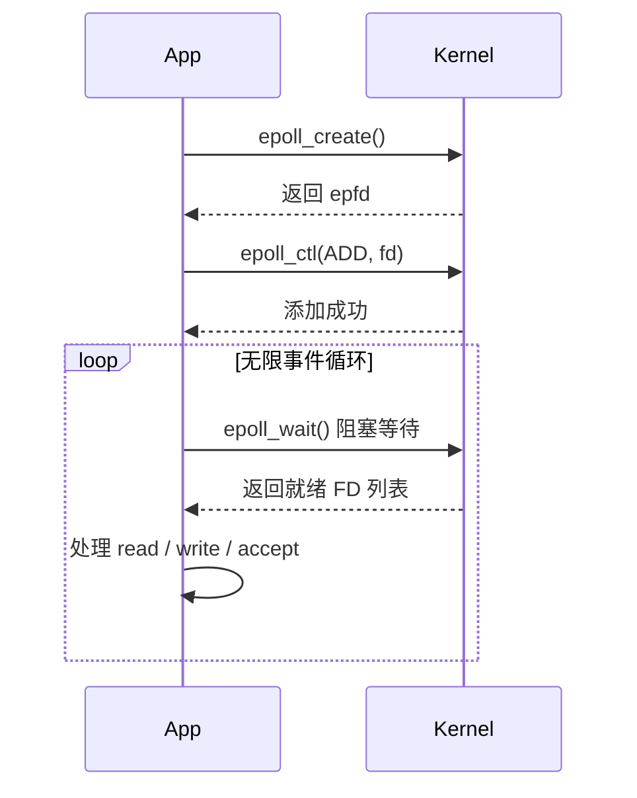
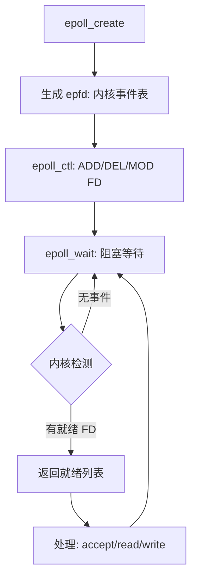

# epoll 核心流程详解（学习笔记）
适用场景：Linux 高性能 IO 多路复用，Netty、Redis、Nginx、游戏服务器、网关底层核心技术。
## 1. 一句话定位
**epoll 是 Linux 下效率最高的 IO 多路复用方案**
- 只返回**就绪 FD**
- 时间复杂度 **O(1)**
- 支持百万并发连接
标准三步骤：
`epoll_create()` → `epoll_ctl()` → `epoll_wait()`
## 2. 核心 API 功能表格
| API              | 作用                             | 关键参数                        | 理解类比                    |
| ---------------- | -------------------------------- | ------------------------------- | --------------------------- |
| `epoll_create()` | 创建一个 epoll 实例              | 返回 `epfd`（epoll 文件描述符） | 创建一个**监听盒子**        |
| `epoll_ctl()`    | 向 epoll 中**添加/删除/修改** FD | `EPOLL_CTL_ADD` / `DEL` / `MOD` | 往盒子里**放/拿/改** socket |
| `epoll_wait()`   | 阻塞等待**就绪事件**             | 返回就绪 FD 列表                | 等待盒子里有“就绪”的 socket |
---

## 3. 完整流程（文字 + 时序 + 流程图）

### 3.1 文字流程
1. **创建 epoll 实例**
   `int epfd = epoll_create(1);`
   内核创建一个事件管理器，返回其 ID（epfd）。

2. **添加需要监听的 socket**
   `epoll_ctl(epfd, EPOLL_CTL_ADD, listen_fd, &ev);`
   告诉内核：帮我监听这个 FD 的读/写事件。

3. **循环等待事件就绪**
   `nfds = epoll_wait(epfd, events, MAX_EVENTS, -1);`
   阻塞等待，内核只返回**已经就绪**的 FD。

4. **处理就绪事件**
   遍历就绪列表，accept 新连接 或 read/write 数据。

---

### 3.2 时序图（Mermaid）


---

### 3.3 架构流程图（Mermaid）


---

## 4. 每一步详细解释

### ① epoll_create
```c
int epfd = epoll_create(1);
```
- 创建**epoll 实例**
- 返回 `epfd`（本质是一个文件描述符）
- 作用：后续所有操作都靠这个 `epfd` 标识

**对应 Netty：Selector**

---

### ② epoll_ctl（操作事件表）
```c
epoll_ctl(epfd, EPOLL_CTL_ADD, fd, &event);
```
三种操作：
- `EPOLL_CTL_ADD`：添加 FD
- `EPOLL_CTL_DEL`：删除 FD
- `EPOLL_CTL_MOD`：修改监听事件

常见事件：
- `EPOLLIN`：读事件（有数据来了）
- `EPOLLOUT`：写事件（可发送数据）
- `EPOLLET`：边缘触发（高性能模式）

---

### ③ epoll_wait（等待就绪）
```c
int nfds = epoll_wait(epfd, events, MAX, timeout);
```
- 阻塞等待
- 内核**只返回就绪 FD**
- 不需要遍历所有 FD → O(1)

---

## 5. 极简可运行代码示例
```c
// 1. 创建
int epfd = epoll_create(1);

// 2. 添加监听
struct epoll_event ev;
ev.events = EPOLLIN;
ev.data.fd = listen_fd;
epoll_ctl(epfd, EPOLL_CTL_ADD, listen_fd, &ev);

// 3. 循环等待
struct epoll_event events[1024];
while (1) {
    int nfds = epoll_wait(epfd, events, 1024, -1);

    for (int i = 0; i < nfds; i++) {
        int fd = events[i].data.fd;
        if (fd == listen_fd) {
            accept(); // 新连接
        } else {
            read();   // 客户端数据
        }
    }
}
```

---

## 6. 关键结论（必须记住）
1. **epfd = Selector**
2. epoll 三步：**create → ctl → wait**
3. 只返回**就绪 FD**，O(1) 效率
4. 是 Netty / 游戏服务器 / 网关的底层基石
5. 主从 Reactor 就是用 **多个 epfd** 实现分离监听

---


- **epoll 水平触发(LT) vs 边缘触发(ET) 笔记**
- **主从 Reactor 模型笔记（Netty 版 + C++ 版）**
- **epoll 与 Selector、EventLoop 对应关系笔记**

