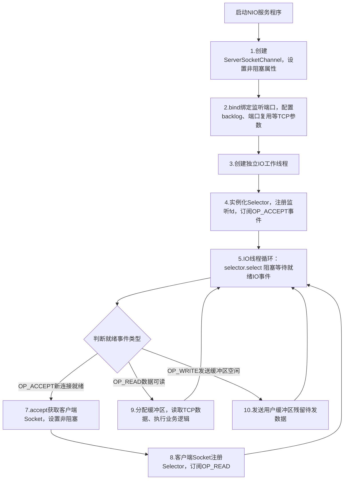

# 4种I/O前置知识
[[A Netty的演进]]
> 内容来源：《Netty权威指南》第二章，统一本书术语释义，与其他书籍定义冲突时以本文为准
### 1. 异步非阻塞I/O（NIO与AIO概念区分）
1. **JDK1.4 原生NIO**
    早期JDK1.4~1.5_u10版本底层依托`select/poll`实现；**JDK1.5 update10 + Linux Kernel2.6** 底层替换为`epoll`优化性能，但**API无改动、IO模型不变**。
    严格遵循UNIX IO模型：**JDK NIO是【同步非阻塞+IO多路复用】，不属于真正异步IO**；因上层使用体感近似异步，行业习惯性称作异步非阻塞I/O，本书沿用该俗称。
2. **JDK1.7 NIO2.0(AIO)**
    Java首个标准**真正异步I/O**，内核完成IO后主动回调应用程序，操作全程不阻塞用户线程，官方命名AIO。
### 2. 多路复用器 Selector
市面通用翻译为「选择器」，本书统一译作**多路复用器**：
- 底层对应Linux `epfd`（epoll创建的多路复用实例），是Java NIO多路复用的核心载体；
- 工作逻辑：批量注册多个Socket Channel，内核IO就绪后仅返回就绪Channel集合，避免全量遍历FD；
- Netty映射：`Selector = epfd`，`EventLoop = OS线程 + Selector(epfd) + 任务队列`。
### 3. 伪异步I/O
1. **来源**：工程实践衍生概念，无官方标准命名；用于优化原生BIO「1连接独占1线程」的资源浪费问题。
2. **底层本质**：**底层仍是同步阻塞BIO**，通过**线程池做任务缓冲区**隔离IO线程与业务线程：连接接入后封装Task丢入线程池执行业务，IO线程快速释放，规避业务阻塞通信线程。
3. **局限**：内核层面无任何非阻塞能力，并发上限受线程池容量约束。
## 四种I/O模型功能特性对比
### BIO/伪异步/NIO/AIO全维度对比
| 对比维度          | 同步阻塞I/O（BIO）            | 伪异步I/O                      | 非阻塞I/O（NIO·多路复用）   | 异步I/O（AIO）                        |
| :---------- | :---------------------------- | :----------------------------- | :-------------------------- | :------------------------------------ |
| 客户端:IO线程配比 | 1:1（一个连接独占一条IO线程） | M:N（M客户端、N工作线程，M>N） | M:1（单IO线程监听海量连接） | M:0（无主动轮询IO线程，内核被动回调） |
| 底层IO阻塞属性    | 阻塞IO                        | 阻塞IO                         | 非阻塞IO                    | 非阻塞IO                              |
| 同步/异步归类     | 同步IO                        | 同步IO                         | 同步IO（IO多路复用）        | 异步IO                                |
| API上手难度       | 简单                          | 简单                           | 非常复杂                    | 复杂                                  |
| 线上调试难度      | 简单                          | 简单                           | 复杂                        | 复杂                                  |
| 运行可靠性        | 非常差                        | 较差                           | 高                          | 高                                    |
| 服务吞吐性能      | 低                            | 中等                           | 高                          | 高                                    |
### 和cpp的映射关系
| 核心概念           | 内核级实现                       | C++ 映射                            | Java 映射                                |
| -------------- | --------------------------- | --------------------------------- | -------------------------------------- |
| **同步阻塞 IO**    | read/write 系统调用阻塞线程         | 原生 recv/send 阻塞调用                 | JDK BIO 流                              |
| **IO 多路复用**    | select/poll/epoll 内核机制      | epoll_create/epoll_ctl/epoll_wait | JDK NIO Selector                       |
| **非阻塞 IO**     | 设置 O_NONBLOCK 文件描述符         | fcntl 设置 O_NONBLOCK               | SocketChannel.configureBlocking(false) |
| **异步 IO**      | Linux io_uring/Windows IOCP | liburing/Boost.Asio               | JDK AIO（NIO.2）                         |
| **Reactor 模式** | 事件循环 + 就绪通知 + 回调处理          | muduo/ACE/Boost.Asio              | Netty EventLoop                        |
### 业务选型指导
1. **低并发、少量客户端对接**：优先BIO/伪异步I/O，开发成本最低、调试简单；
2. **海量长连接、高并发网关/游戏服务**：优先NIO+Netty，吞吐与资源利用率最优；
3. **全异步IO密集型场景**：选用AIO，Java业务落地场景较少。
# 前置netty基本概念
## Netty 核心名词速查
你只需要记住这5个和**线程/IO模型**相关的名词，其他不用管：
1. **Selector**
   Java NIO 多路复用器，**非阻塞IO的核心**
   → 对应C++：`epoll` (Linux) / `WSAPoll` (Windows)
2. **Reactor模型** : 
   **Reactor 不是类，不是方法，是【事件驱动架构模式】**
   它 = **IO 多路复用 (Selector/epoll) + 事件分发 + 业务处理器 (Handler)**
   Netty的底层设计模式：**单线程/多线程 监听IO事件 + 分发处理**（你最终要实现的C++模型）
3. **EventLoop**
  Netty的核心线程，**一个包含NIO的selector实现及其他功能的线程 = 一个EventLoop**，负责：处理IO事件、执行任务、轮询通道。
    → 对应C++：**IO线程 + 任务队列**
4. **EventLoopGroup**
   一组EventLoop（线程池），分两种：
   - `BossGroup`：专门接收客户端新连接（对应C++ `accept` 线程）
   - `WorkerGroup`：专门处理连接的读写（对应C++ 工作IO线程）
5. **Channel**
   Netty对TCP连接的封装，一个客户端连接 = 一个Channel
   → 对应C++：`int sockfd`（套接字）
6. **ChannelHandler**
   **业务逻辑的最终执行者**，Reactor 模型的「处理器」
   负责：读数据、写数据、编解码、业务处理
   → 对应 C++：**IO 事件回调函数**
7.   **Pipeline**
   **ChannelHandler 的执行链条**
   一个 Channel 绑定一个 Pipeline，数据按顺序流经多个 Handler
   → 对应 C++：**回调函数链表 / 责任链**
   | Reactor 模型角色     |核心职责                            			| Java NIO 原生实现 | Netty 实现                              | Linux 底层系统调用 / 标识             |
   | :------------------- | :---------------------------------- | --------------------------------------- | ------------------------------------- | ------------------------------------- |
   | **Reactor 调度器**   | ooooooooooooooooo轮询 FD、检测 IO 事件就绪、分发事件 | **Selector**                     | **EventLoop**(内置 Selector + 线程循环) | `epoll_create``epoll_ctl``epoll_wait` |
   | **Acceptor 接收器**  | 绑定端口、监听并接受客户端新连接    | **ServerSocketChannel**          | **BossGroup + NioServerSocketChannel**  | `socket``bind``listen``accept`        |
   | **Channel 连接载体** | TCP 连接封装、数据读写的唯一通道    | ServerSocketChannel<br />SocketChannel | NioServerSocketChannel<br />NioSocketChannel | `socket_fd`(文件描述符)               |
   | **Pipeline 责任链**  | 管理 Handler 执行顺序、事件流转     | 无原生实现                       | **DefaultChannelPipeline**              | 纯逻辑封装（无系统调用）              |
   | **Handler 处理器**   | 执行业务逻辑、数据读写、编解码处理  | 自定义回调逻辑                   | **WorkerGroup + ChannelHandler**        | `read``recv``write``send` |
## 第一步：C++ 阻塞式多线程 Echo 服务器（你的基准代码）
### 1. 核心原理（你抓包学过的TCP）
1. 主线程：`socket() → bind() → listen() → accept()`
2. **每来一个客户端连接，创建一个新线程**
3. 子线程：`recv()` 阻塞等待数据 → 原样`send()`回显（Echo）
4. 客户端断开：关闭套接字，销毁线程

### 2. 极简可运行代码（blocking_echo_server.cpp）
```cpp
#include <iostream>
#include <thread>
#include <winsock2.h>
#pragma comment(lib, "ws2_32.lib")

#define PORT 9000

// 子线程：处理单个客户端连接（阻塞式）
void clientHandler(SOCKET client_fd) {
    char buffer[1024] = {0};
    while (true) {
        // 阻塞等待客户端数据
        int len = recv(client_fd, buffer, sizeof(buffer), 0);
        if (len <= 0) break;
        // Echo：原样发回
        send(client_fd, buffer, len, 0);
    }
    closesocket(client_fd);
}

int main() {
    // 1. TCP 初始化
    WSADATA wsa;
    WSAStartup(MAKEWORD(2, 2), &wsa);
    SOCKET server_fd = socket(AF_INET, SOCK_STREAM, 0);

    // 2. bind + listen
    sockaddr_in addr{AF_INET, htons(PORT), INADDR_ANY};
    bind(server_fd, (sockaddr*)&addr, sizeof(addr));
    listen(server_fd, 5);

    // 3. 主线程循环accept（阻塞）
    while (true) {
        SOCKET client_fd = accept(server_fd, NULL, NULL);
        // 关键：每一个连接 = 新建一个线程
        std::thread(clientHandler, client_fd).detach();
    }

    closesocket(server_fd);
    WSACleanup();
    return 0;
}
```

### 3. 致命缺陷（Netty要解决的问题）
1. **线程爆炸**：1万个客户端 = 1万个线程，内存/CPU崩溃
2. **阻塞浪费**：线程大部分时间在`recv()`阻塞，闲置
3. **无法高并发**：传统C++阻塞服务器的天花板

---

## 第二步：Netty EventLoop 模型核心（只讲设计思想）
### 1. 一句话总结
**Netty = 少量固定线程（EventLoop） + 多路复用（epoll/Selector）**
一个线程**同时管理成千上万个连接**，不阻塞、不浪费资源。

### 2. 工作流程（对标你的TCP实验）
1. **Boss EventLoopGroup**（1个线程）
   只做一件事：`accept()` 接收新TCP连接，分配给Worker线程
2. **Worker EventLoopGroup**（N个线程，默认CPU核心数×2）
   每个Worker线程（EventLoop）：
   - 持有一个`Selector`（C++ epoll）
   - 同时监听**几百/几千个Channel（连接）**的读写事件
   - 有事件就处理，没事件就休眠，**CPU利用率拉满**
3. **绑定关系**
   一个客户端连接（Channel）**终身只绑定一个EventLoop线程**
   → 无并发安全问题，无需加锁

### 4. 核心优势（对比阻塞多线程）
1. 线程数固定，不随客户端数量增加
2. 非阻塞IO，线程100%高效利用
3. 内置任务队列，支持定时/异步任务

---

## 第三步：硬核双模型对比
| 维度        | C++ 阻塞式多线程服务器 | Netty EventLoop 模型              |
| :---------- | :--------------------- | :-------------------------------- |
| 线程模型    | 一连接一线程           | 固定线程池，一线程管理多连接      |
| IO 方式     | 阻塞IO（blocking）     | 非阻塞IO + 多路复用               |
| 多路复用器  | 无                     | Selector（C++ epoll）             |
| 并发能力    | 低（线程上限）         | 极高（百万连接）                  |
| 资源占用    | 高（线程栈/切换开销）  | 极低                              |
| 核心组件    | 主线程+工作线程        | EventLoopGroup/EventLoop/Selector |
| 你的C++落地 | 入门简单               | 最终目标：Reactor/EventLoop       |

---

## 和CPP的关系对比

| Netty 组件          | Linux C++ 底层等价物            | **核心对应关系 + 功能**                       |
| ------------------- | ------------------------------- | --------------------------------------------- |
| **Selector**        | **epoll_create () 返回的 epfd** | **epfd = Selector**  内核创建的事件监听管理器 |
| **Channel**         | **socket fd (文件描述符)**      | 网络连接的抽象，就是一个 FD                   |
| ServerSocketChannel | listen_fd (监听 FD)             | 服务端专用，负责 `accept` 新连接              |
| SocketChannel       | conn_fd (连接 FD)               | 客户端专用，负责 `read/write` 数据            |
| Channel#register    | **epoll_ctl(ADD)**              | 将 FD 注册到 epfd（Selector）中               |
| Selector#select()   | **epoll_wait()**                | 阻塞等待，只返回**就绪 FD**                   |
| **EventLoop**       | **线程 + epfd + 任务队列**      | 承载 Selector 的运行单元，负责事件循环        |
| EventLoopGroup      | 线程池 + 多个 epfd              | 主从 Reactor 的线程组                         |
| 主从 Reactor 模型   | 主 epfd + 从 epfd 组            | 主：监听连接；从：处理读写                    |

**Selector = epfd，Channel = fd，EventLoop = 线程 + epoll，select = epoll_wait**

------

工程落地铁律（你写 C++ 代码必遵守）

1. **1 个 EventLoop = 1 个线程 + 1 个 epfd**
2. 服务端监听 FD（listen_fd）→ 绑定**主 EventLoop**
3. 客户端连接 FD（conn_fd）→ 绑定**从 EventLoop**
4. 全程无锁、高性能，游戏服务器 / 安全网关标准写法

## 核心问题：如果我在C++里实现EventLoop，需要哪些组件？

（为 **D27 Reactor** 完美铺垫，直接抄进笔记）
结合Netty思想 + C++ Socket原生API，**必须5大组件**：

1. **IO 多路复用器**
   Linux: `epoll` / Windows: `WSAPoll` → 替代Java Selector
2. **事件循环线程（EventLoop）**
   一个`std::thread` + 无限循环 → 负责轮询IO事件
3. **事件队列 / 任务队列**
   存储待处理的读写事件、异步任务
4. **通道（Channel）封装**
   封装`sockfd`、读写回调、事件状态 → 替代Netty Channel
5. **线程池（EventLoopGroup）**
   管理多个EventLoop，实现连接负载均衡

#  NIO如何起服务器的

## 一、NIO服务端开发10步流程图


## 二、分步知识点扩展（Java NIO ↔ C++原生API映射 + BIO对比 + EventLoop设计启发，直接录入md笔记）
> 锚定基准：`blocking_echo_server.cpp`是**BIO阻塞一连接一线程**实现，本流程是NIO非阻塞+多路复用，是Netty EventLoop底层原型，每一步为C++自研Reactor拆组件。

### 步骤1：创建ServerSocketChannel，配置非阻塞
1. #### **Java NIO接口**

  `ServerSocketChannel.open(); channel.configureBlocking(false);`
2. #### **C++跨平台等价实现**
```cpp
// Linux
int listen_fd = socket(AF_INET,SOCK_STREAM,0);
fcntl(listen_fd,F_SETFL,O_NONBLOCK);
// Windows(Winsock)
SOCKET listen_fd = socket(AF_INET,SOCK_STREAM,0);
u_long opt = 1; ioctlsocket(listen_fd,FIONBIO,&opt);
```
3. #### **参数说明**

   一、跨平台通用：socket() 套接字创建函数

   | 参数                               | 含义                               | 协议/系统对应                            |
   | ---------------------------------- | ---------------------------------- | ---------------------------------------- |
   | AF_INET                            | Address Family：使用 IPv4 地址协议 | TCP/IP 网络通信标准                      |
   | SOCK_STREAM                        | Socket 类型：流式套接字            | TCP 协议专属（对应你抓包的 TCP 连接）    |
   | 0                                  | 自动选择协议：TCP 对应 IPPROTO_TCP | 填 0 系统自动匹配，无需手动指定          |
   | 返回值 int listen_fd（Linux）      | Linux 下文件描述符（小整数）       | 代表套接字的唯一 ID，一切操作的凭证      |
   | 返回值 SOCKET listen_fd（Windows） | Windows 下 Winsock 套接字句柄      | 代表套接字的唯一系统标识，所有操作的凭证 |

   二、Linux 专属：fcntl() 非阻塞模式设置函数

   | 参数       | 含义                           | 系统/协议对应                                      |
   | ---------- | ------------------------------ | -------------------------------------------------- |
   | listen_fd  | 目标套接字文件描述符           | 必须是 socket() 返回的有效 Linux 套接字 ID         |
   | F_SETFL    | 操作命令：Set File Status Flag | Linux 系统调用，用于设置文件状态标志               |
   | O_NONBLOCK | 状态标志：Open Non-blocking    | 开启套接字非阻塞 IO 模式，epoll 多路复用前置条件   |
   | 返回值 int | 函数执行结果                   | 成功返回 0，失败返回 -1，可通过 errno 获取错误原因 |

   三、Windows 专属：ioctlsocket() 非阻塞模式设置函数

   | 参数           | 含义                               | 系统/协议对应                                                |
   | -------------- | ---------------------------------- | ------------------------------------------------------------ |
   | listen_fd      | 目标 Winsock 套接字句柄            | 必须是 socket() 返回的有效 Windows 套接字标识                |
   | FIONBIO        | 操作命令：File I/O Non-Blocking IO | Windows Winsock 专属，控制非阻塞模式开关                     |
   | &opt           | 参数指针：指向非阻塞开关值的地址   | 必须传入 u_long 类型变量的指针，定义 IO 行为                 |
   | u_long opt = 1 | 非阻塞开关值：1 为开启，0 为关闭   | Windows 固定无符号长整型，控制非阻塞模式启停                 |
   | 返回值 int     | 函数执行结果                       | 成功返回 0，失败返回 SOCKET_ERROR，可通过 WSAGetLastError() 查错 |

3. #### **核心知识点**
- **阻塞fd**：`accept/recv`无数据时线程挂起休眠；
- **非阻塞fd**：无数据立刻返回错误码，绝不阻塞当前线程，是多路复用IO的前置硬性条件。
- BIO缺陷溯源：你之前阻塞Echo全是阻塞fd，新连接必开新线程；NIO全链路fd非阻塞，单线程托管海量连接。
- EventLoop启发：自研C++事件循环时，**所有套接字fd必须初始化统一置为非阻塞**。

### 步骤2：绑定监听，配置TCP参数(backlog)
1. **Java**：`channel.bind(addr, backlog)`
2. **C++**：`bind()+listen(listen_fd, backlog)`

#### **知识点**

backlog：TCP内核**全连接队列长度**，存放完成三次握手、未被用户`accept`的连接（对应你抓包三次握手P1~P3）；队列打满后新SYN报文直接丢弃。

配套TCP配置：`SO_REUSEADDR`端口复用、`TCP_NODELAY`关闭Nagle算法，是Windows/Linux协议栈差异高频坑（你双系统实验重点观测项）。

#### 如何设置

```c++
// Linux + Windows 通用
int opt = 1;
// 1. 端口复用
setsockopt(fd, SOL_SOCKET, SO_REUSEADDR, (char*)&opt, sizeof(opt));
// 2. 关闭Nagle算法，实时传输
setsockopt(fd, IPPROTO_TCP, TCP_NODELAY, (char*)&opt, sizeof(opt));
```

##### 1. backlog（`listen()` 函数参数）
| 参数       | 含义                                   | 核心原理（对应你的三次握手抓包）                             |
| ---------- | -------------------------------------- | ------------------------------------------------------------ |
| `backlog`  | TCP 内核 **全连接队列最大长度**        | 存放**已完成三次握手（P1-P3）**、但应用程序还没调用 `accept()` 取走的客户端连接 |
| 队列满行为 | 新客户端 SYN 报文直接被内核丢弃        | 客户端会触发超时重传，表现为「连接失败/连接卡顿」            |
| 典型取值   | 通用服务端：`128` / 游戏高并发：`1024` | 不能填太小，否则并发连接上来直接丢包                         |

---

##### 2. SO_REUSEADDR（端口复用，`setsockopt` 设置）
| 参数           | 含义                               | 核心原理（对应你的四次挥手抓包）                             |
| -------------- | ---------------------------------- | ------------------------------------------------------------ |
| `SO_REUSEADDR` | 允许**端口快速复用**               | 解决 TCP **TIME_WAIT** 状态（连接关闭后等待 2MSL）占用端口的问题 |
| 解决场景       | 服务端重启后，提示「端口已被占用」 | 没有这个选项，服务端异常退出后，要等几十秒才能重新绑定同一个端口 |
| 双平台差异     | Linux/Windows 都支持，行为略有不同 | 你的实验**必须开启**，否则重启服务端会频繁报错               |

---

##### 3. TCP_NODELAY（关闭 Nagle 算法，`setsockopt` 设置）
| 参数          | 含义                                 | 核心原理（对应你的 TCP 数据传输抓包）                        |
| ------------- | ------------------------------------ | ------------------------------------------------------------ |
| `TCP_NODELAY` | 关闭 Nagle 粘包优化算法              | **Nagle 算法**：内核会缓存小数据包，凑够一定大小再发送，减少网络包数量 |
| 开启效果      | 数据**立即发送**，无延迟             | 游戏/实时通信必备（你做游戏服务器必须开）                    |
| 关闭效果      | 小数据会延迟发送，产生「网络延迟感」 | 默认开启，会导致客户端操作响应慢                             |

1. **backlog**：控制能排队等待被处理的新连接数量
2. **SO_REUSEADDR**：让服务端能快速重启，不被 TIME_WAIT 卡住端口
3. **TCP_NODELAY**：关闭内核延迟发包，实现实时数据传输（游戏服务器必开）

### 步骤3：创建独立I/O线程轮询Selector
1. **Java**：单独new Thread承载循环select逻辑
2. **C++**：`std::thread io_thread(&event_loop_func)`，线程内部无限循环epoll_wait
3. **知识点**
- BIO：主线程阻塞在listen_fd的accept，每接入一个连接就创建新子线程；NIO：**单个IO线程同时管理监听fd+数千业务客户端fd，线程总数固定，不随客户端数量上涨**。
- Netty映射：这个IO线程 = **EventLoop线程本体**，Netty的Worker EventLoop就是对该线程的封装。
- EventLoop启发：C++ EventLoop底层就是一个常驻循环IO线程。

### 步骤4：创建Selector，注册ServerSocketChannel、监听OP_ACCEPT
1. **Java**：`Selector.open(); key = channel.register(sel, SelectionKey.OP_ACCEPT)`
2. **C++**：
```cpp
int epfd = epoll_create(1);
epoll_ctl(epfd,EPOLL_CTL_ADD,listen_fd,EPOLLIN);
```
`epollfd=Selector`、`EPOLLIN=OP_ACCEPT`
3. **知识点**
- Selector/epoll是**内核态多路复用器**：用户态把fd+关注事件注册进内核，内核在TCP报文就绪后主动标记fd，避免用户循环遍历全部fd（O(N)→事件驱动O(1)）。
- OP_ACCEPT仅listen_fd独有：内核完成三次握手、新连接进入全连接队列后，触发就绪事件。

### 步骤5：I/O线程循环执行selector.select()轮询就绪Channel
1. **Java**：`selector.select()`永久阻塞，任意事件就绪后唤醒，`selectedKeys()`取出就绪fd集合
2. **C++**：`epoll_wait(epfd, evs, max_cnt, -1)`，-1代表永久阻塞
3. **知识点**
- select()/epoll_wait()空闲时让出CPU，无IO事件线程休眠，低空闲损耗，是NIO高性能核心。
- EventLoop核心骨架：`while(true){ epoll_wait → 遍历就绪事件 → 分发处理 }`，Netty EventLoop的run()方法就是这套循环。

### 步骤6：就绪为OP_ACCEPT，调用accept接收新连接
1. **Java**：`SocketChannel client = serverChannel.accept();`
2. **C++**：`int client_fd = accept(listen_fd,nullptr,nullptr);`
3. **知识点**
- accept返回的新客户端fd**默认是阻塞属性**，必须执行步骤7改成非阻塞；
- BIO：accept成功直接spawn新线程；NIO：accept拿到fd仅做注册，不新建任何线程。

### 步骤7：新接入SocketChannel设置非阻塞、配置TCP参数
1. **Java**：`client.configureBlocking(false);`
2. **C++**：同步骤1，fcntl/ioctlsocket设置O_NONBLOCK
3. **致命知识点**
> 若客户端fd保留阻塞，后续`recv`无数据时阻塞整个IO线程，**整台服务器卡死**，是非阻塞编程高频踩坑点。

### 步骤8：客户端Socket注册Selector，监听OP_READ
1. **Java**：`client.register(sel,SelectionKey.OP_READ)`
2. **C++**：`epoll_ctl(epfd,EPOLL_CTL_ADD,client_fd,EPOLLIN)`，`EPOLLIN=OP_READ`
3. **知识点**
- OP_READ触发时机：TCP内核接收缓冲区收到应用报文、对端发送FIN挥手（对应你抓包P7 FIN包）；
- 绑定规则：一个客户端fd终身绑定当前Selector/IO线程 → Netty规则：**一个Channel固定绑定一个EventLoop**，天然规避多线程竞态、无需加锁。

### 步骤9：OP_READ就绪，ByteBuffer读取数据包
1. **Java**：分配ByteBuffer→channel.read(buffer)
2. **C++**：预分配`std::vector<char> buf`，非阻塞`recv(client_fd,buf.data(),buf.size(),0)`
3. **知识点**
- 非阻塞recv返回值：
  ① len>0：读到有效业务数据；② len=0：对端关闭连接(FIN)；③ len<0：`EAGAIN/EWOULDBLOCK`缓冲区空，无数据。
- ByteBuffer = C++用户态应用缓冲区，用于解决TCP**粘包/拆包**（TCP流式协议无报文边界），Netty ByteBuf就是ByteBuffer的优化封装。

### 步骤10：OP_WRITE就绪，继续发送残留数据
1. **Java**：OP_WRITE=内核TCP发送缓冲区剩余空间，继续发送积压数据
2. **C++**：`EPOLLOUT`事件，非阻塞send发送剩余数据
3. **知识点**
- 内核发送缓冲区满载时，非阻塞send返回EAGAIN，不能循环死发；剩余数据存入用户缓冲区，注册EPOLLOUT，等内核缓冲区空闲自动触发写事件续发。
- BIO阻塞send：缓冲区满直接卡死线程；NIO靠OP_WRITE实现**异步发送**，Netty的Channel发送队列本质就是这套用户缓冲区。

## 三、提炼：自研C++ EventLoop必备5组件
| 组件序号 | C++实现组件                           | 对应NIO/Netty原型          |
| -------- | ------------------------------------- | -------------------------- |
| 1        | 多路复用实例(epoll/WSAPoll)           | Java Selector              |
| 2        | 常驻IO循环线程(std::thread)           | EventLoop运行载体          |
| 3        | Channel封装类(存储fd+读写缓冲区+回调) | SocketChannel              |
| 4        | 事件管理器(管理fd注册/删除)           | register()逻辑封装         |
| 5        | 任务队列(Netty扩展，NIO原生无)        | 处理异步非IO任务、定时任务 |

## 四、BIO阻塞Echo VS NIO模型对比表格（笔记用）
| 对比项     | 阻塞多线程BIO(你的blocking_echo.cpp) | 本套NIO非阻塞多路复用            |
| ---------- | ------------------------------------ | -------------------------------- |
| 线程策略   | 1连接=1新线程，连接越多线程越多      | 固定IO线程数，单线程托管数千连接 |
| 套接字属性 | 全阻塞fd                             | 全非阻塞fd                       |
| 阻塞位置   | 线程阻塞在单个fd recv/accept         | 线程仅阻塞在epoll_wait/select    |
| 资源开销   | 高(线程栈、上下文切换)               | 极低，线程数量固定               |
| 后续落地   | 已完成编码                           | 下一步：C++手写极简EventLoop原型 |

# Netty具体实现

简单的源码分析:

```java
import io.netty.bootstrap.ServerBootstrap;
import io.netty.channel.ChannelFuture;
import io.netty.channel.ChannelInitializer;
import io.netty.channel.ChannelOption;
import io.netty.channel.EventLoopGroup;
import io.netty.channel.nio.NioEventLoopGroup;
import io.netty.channel.socket.SocketChannel;
import io.netty.channel.socket.nio.NioServerSocketChannel;


public class TimeServer {

    public void bind(int port) throws Exception {
        // 配置服务端的NIO线程组
        EventLoopGroup bossGroup = new NioEventLoopGroup();    //负责监听
        EventLoopGroup workerGroup = new NioEventLoopGroup();   //负责处理
        try {
            ServerBootstrap b = new ServerBootstrap();
            b.group(bossGroup, workerGroup)
                    .channel(NioServerSocketChannel.class)
                    .option(ChannelOption.SO_BACKLOG, 1024)
                    .childHandler(new ChildChannelHandler());
            // 绑定端口，同步等待成功
            ChannelFuture f = b.bind(port).sync();

            // 等待服务端监听端口关闭
            f.channel().closeFuture().sync();
        } finally {
            // 优雅退出，释放线程池资源
            bossGroup.shutdownGracefully();
            workerGroup.shutdownGracefully();
        }
    }

    private class ChildChannelHandler extends ChannelInitializer<SocketChannel> {
        @Override
        protected void initChannel(SocketChannel arg0) throws Exception {
            arg0.pipeline().addLast(new TimeServerHandler());
        }

    }

    /**
     * @param args
     * @throws Exception
     */
    public static void main(String[] args) throws Exception {
        int port = 8080;
        if (args != null && args.length > 0) {
            try {
                port = Integer.valueOf(args[0]);
            } catch (NumberFormatException e) {
                // 采用默认值
            }
        }
        new TimeServer().bind(port);
    }
}
```

