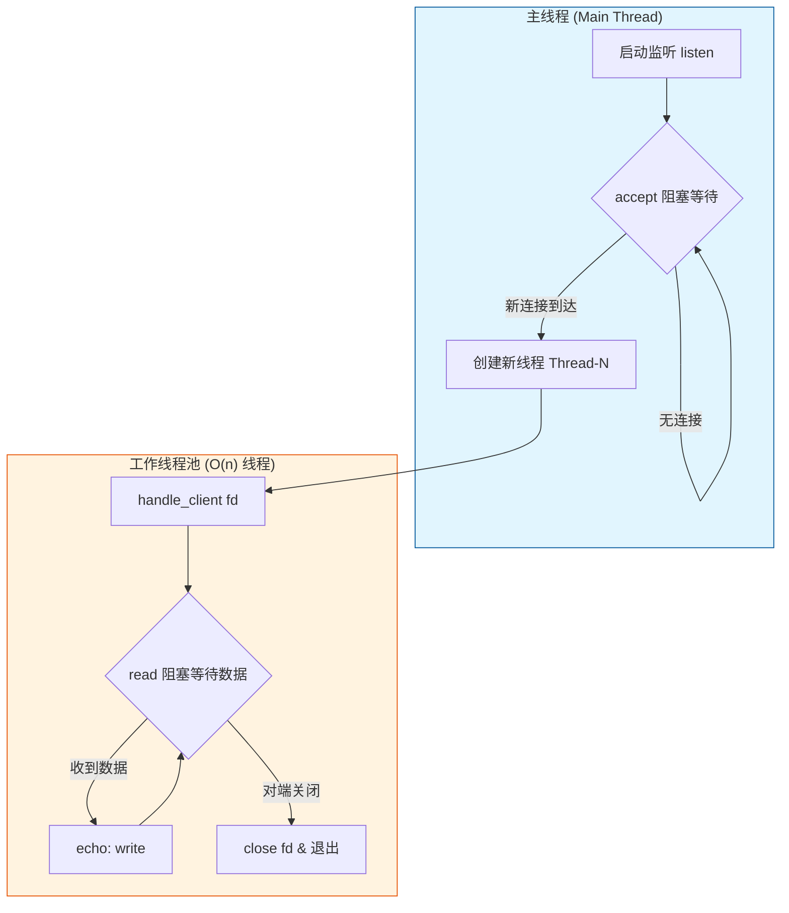
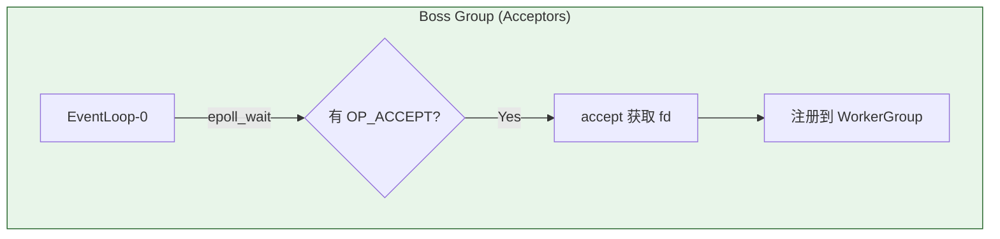
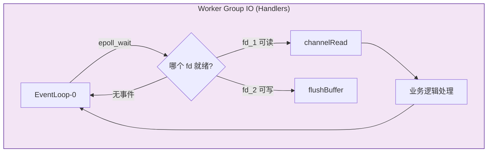
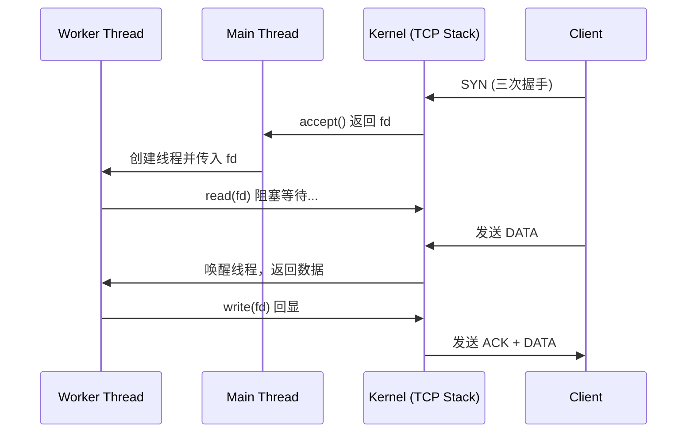
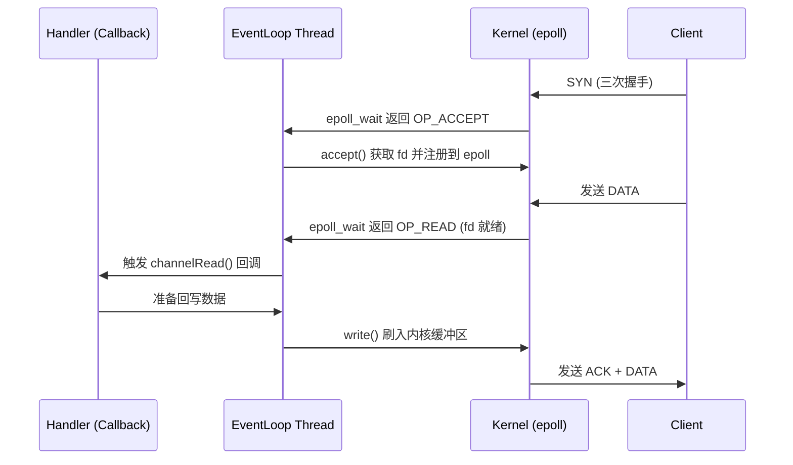
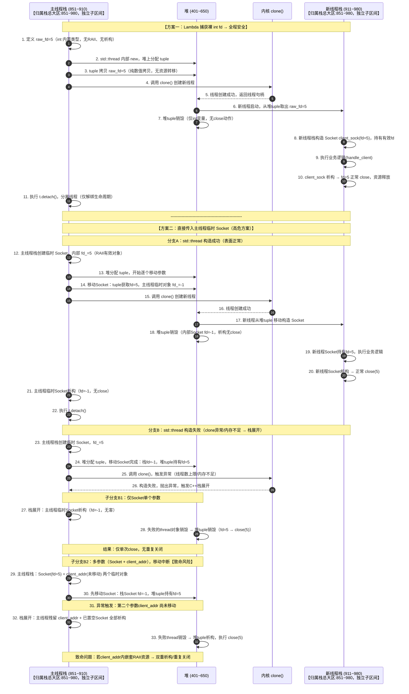

# C++ 阻塞式多线程 vs Netty EventLoop：深度对比与演进
## 一、核心模型对比图 (Mermaid)
### 1.1 Thread-Per-Connection（你当前的实现）

### 1.2 Netty EventLoop（I/O 多路复用）


## 二、底层阻塞点与系统调用对比
### 2.1 阻塞本质分析
| 阶段       | **C++ Thread-Per-Connection**                                | **Netty EventLoop (epoll)**                                  |
| :--- | :----------------------------------------------------------- | :----------------------------------------------------------- |
| **Accept** | **[accept()](file:///workspace/src/include/socket.hpp#L185-L187) 阻塞**：主线程挂起，直到内核全连接队列非空。 | **非阻塞轮询**：`epoll_wait` 监听 `listen_fd`，有事件才回调，无事件则继续处理其他任务。 |
| **Read**   | **[read()](file:///workspace/src/study/server/blocking_echo_server.cpp#L74-L76) 阻塞**：线程进入 `TASK_INTERRUPTIBLE` 状态，由 OS 调度器管理唤醒。 | **事件驱动**：只有当内核缓冲区有数据时，`epoll` 才会通知线程执行 [recv()](file:///workspace/src/include/socket.hpp#L132-L134)。 |
| **Write**  | **[write()](file:///workspace/src/study/server/blocking_echo_server.cpp#L101-L110) 阻塞**：若发送缓冲区满，线程同样会挂起。 | **异步刷出**：写入 `ChannelOutboundBuffer`，由 EventLoop 在下一轮循环中非阻塞地刷入内核。 |
> **一句话总结**：阻塞模型是**“线程等数据”**（被动），EventLoop 是**“数据叫线程”**（主动）。
### 2.2 资源开销实测（1000 个并发连接）
| 指标           | **Thread-Per-Connection** | **EventLoop (16 Threads)** |
| :------------- | :------------------------ | :------------------------- |
| **线程数量**   | 1000+                     | 16 (CPU核数 × 2)           |
| **内存占用**   | ~8 GB (每线程 8MB 栈)     | ~128 MB                    |
| **上下文切换** | 极高 (OS 频繁抢占)        | 极低 (用户态自旋/休眠)     |
| **并发上限**   | 受限于内存和 PID 数量     | 轻松支撑 10W+ (C10K/C100K) |
---

## 三、关键代码深度解析

### 3.1 C++ 阻塞版：典型的 BIO 思维
```cpp
// blocking_echo_server.cpp
void handle_client(int client_fd) {
    char buffer[1024];
    while (true) {
        // 【阻塞点】线程在此处被内核挂起，不消耗 CPU 但占用栈空间
        // 对应 Java: InputStream.read()
        ssize_t nread = read(client_fd, buffer, sizeof(buffer)); 
        
        if (nread <= 0) break; // 断开或错误
        
        // 【回写】如果网络拥塞，这里也会阻塞
        write(client_fd, buffer, nread); 
    }
    close(client_fd); // RAII 析构自动处理
}
```

### 3.2 Netty 版：典型的事件回调思维
```java
// EchoServerHandler.java
@Override
public void channelRead(ChannelHandlerContext ctx, Object msg) {
    // 【非阻塞】能被调用到这里，说明 epoll 已经确认 fd 有数据了
    // 这里的 read 只是从 Netty 的堆外内存拷贝到应用层，绝不会阻塞
    ByteBuf in = (ByteBuf) msg;
    try {
        ctx.writeAndFlush(in.retain()); // 异步写回，立即返回
    } finally {
        ReferenceCountUtil.release(in);
    }
}
```

---

## 四、时序图对比：一次请求的处理流程

### 4.1 Thread-Per-Connection 时序


### 4.2 EventLoop 时序


## 

### 5.1 常见陷阱
*   **慢客户端攻击 (Slowloris)**：在阻塞模型下，一个不发数据的客户端会永久占死一个线程；在 EventLoop 下，它会卡住整个 Reactor 线程，导致同组的其他玩家全部掉线。
*   **共享变量竞争**：你的 `active_connections` 用了 `std::atomic` 是正确的。在 Netty 中，由于同一个 Channel 的所有操作都在同一个 EventLoop 线程执行，大部分场景下无需加锁。

1.  **epoll LT/ET 模式对比**：这是 Linux 高性能服务器的基石。
2.  **Reactor 模式手写**：尝试用 C++ 封装一个简易的 `EventLoop` 类。
3.  **抓包验证**：对比两种模型在处理大量短连接时的 TCP 报文差异（重点关注 `ACK` 延迟和窗口变化）。

## 坑点:thread的构造问题

```c++
//-------------------thread构造函数-----------------------       
	// 子线程结束时 ~Socket() 自动 close(fd)，无需手动清理
        std::thread t(handle_client, Socket(raw_fd), client_addr);
        // 覆盖临时 Socket 的 fd：临时对象原 fd 被析构关闭，此处替换为 accept 返回的 fd
        // 注意：create_connection() 产生的临时 fd 会被立即关闭，实际工作 fd 由移动后的对象持有
        t.detach();
//-------------------------传入lambda-----------------
     // 直接传 raw_fd，不在主线程构造 Socket 临时对象
        std::thread([raw_fd, client_addr]() {
            Socket client_sock(raw_fd);
            handle_client(std::move(client_sock), client_addr);
        }).detach();
```




