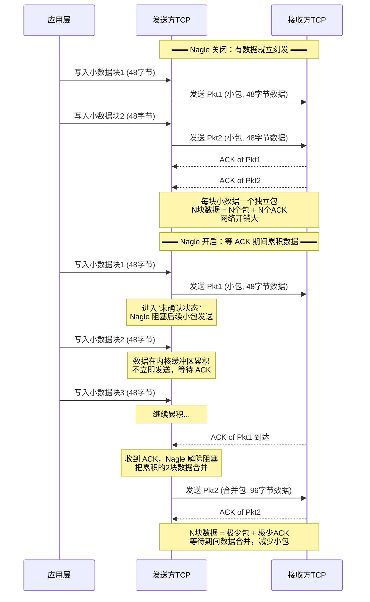
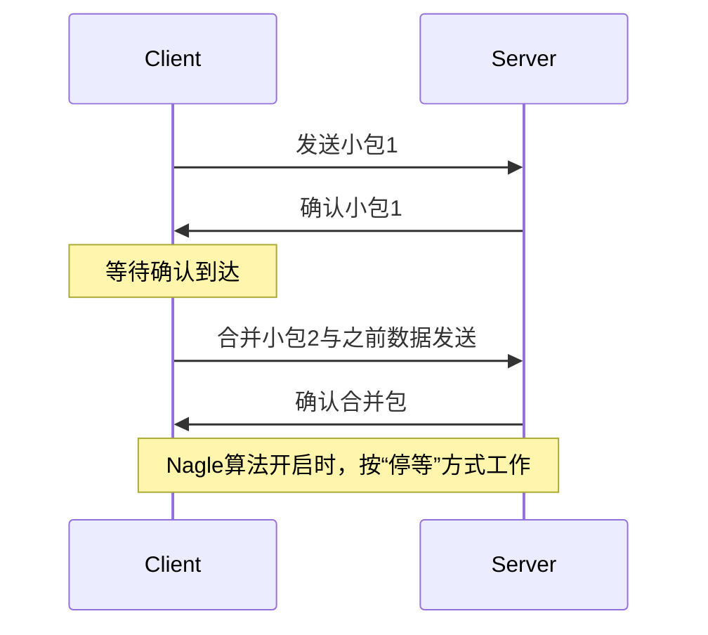
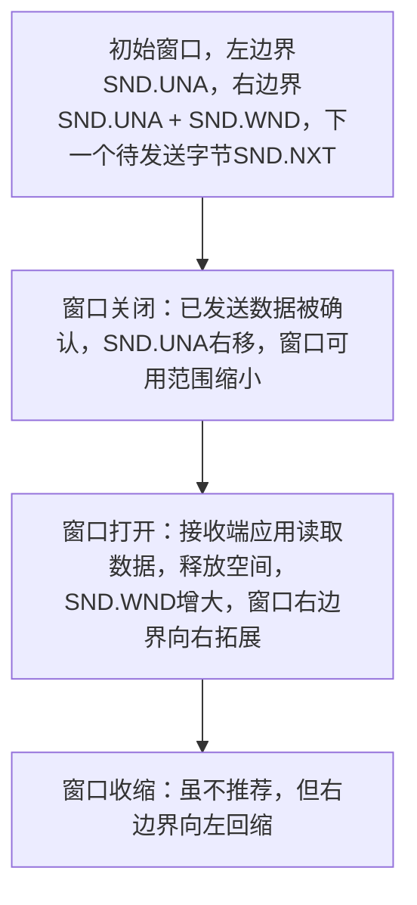
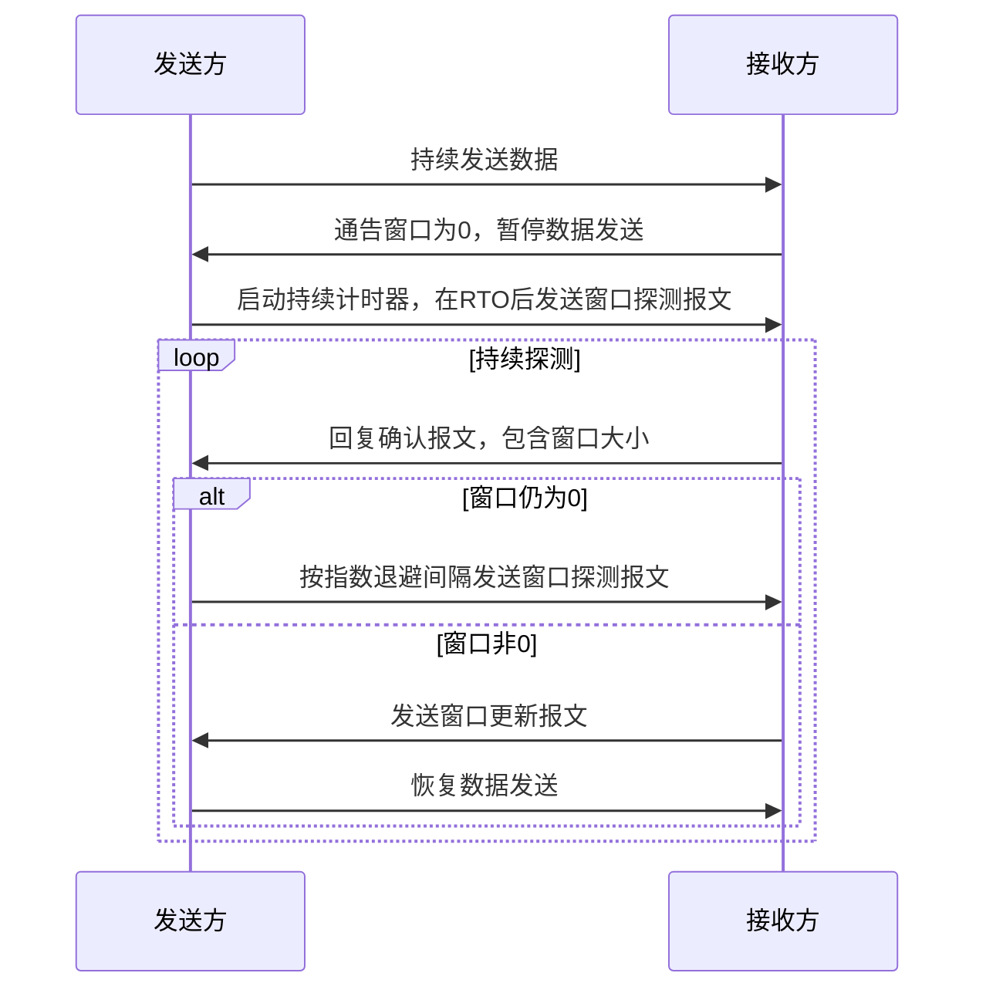
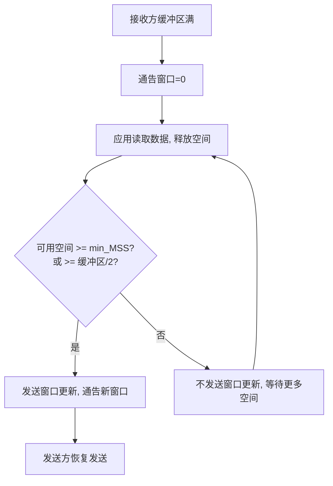

## Nagle 算法
### 核心定义
Nagle 算法是由约翰·内格提出，在 RFC0896 中描述的用于解决广域网中小包网络开销大、易加剧拥塞及降低带宽利用效率问题的方案。其规则为：当 TCP 连接存在未被确认的小数据段（小于 SMSS 的段）时，不能发送新的小数据段，而是将小数据量累积起来，待确认到达后合并成一个段发送，强制 TCP 进入 “停等” 行为。
例如:
在使用 IPv4 时，单次按键会生成约 88 字节的 TCP/IPv4 数据包（以示例中的加密和认证方式计算）：20 字节的 IP 首部、20 字节的 TCP 首部（假设无选项），以及 48 字节的数据。这类小数据包（称为 **小包**）的网络开销非常大
### 对比表格
| 维度               | Nagle 算法关闭                       | Nagle 算法开启                  |
| 
---

| 数据包数量         | 多（如 SSH 连接中 19 个）            | 少（如 SSH 连接中 11 个）       |
| 数据包大小         | 多数为小包（如仅含 48 字节用户数据） | 大包，数据被合并                |
| “请求 - 响应” 时序 | 交织进行，较混乱                     | 严格按 “同步节奏”，间隔约为 RTT |
| 交互总耗时         | 短（如 0.58 秒）                     | 长（如 0.80 秒）                |
| 连接忙碌状态       | 双向都较忙碌                         | 同一时间只有一个方向忙碌        |

### ACK/RTT速度如何影响nagle算法的有效性

结合「小包累积 + 停等」模型，分 3 种典型网络场景，配时序理解。

约定：`SMSS=1460`，小于该值一律判定为**小段数据**；应用持续产生小块数据。

#### 场景 1：低延迟网络（局域网 / 本地回环，RTT 极小，ACK 秒回）

1. 应用产出第 1 个小包 → TCP 发出，进入「未确认状态」；
2. 因为 RTT 极低，**ACK 瞬间返回**；
3. 未确认队列清空，Nagle 解除阻塞；
4. 应用累积的后续小块数据，被合并后立刻发送；
5. 循环往复：ACK 快速抵达 → 快速放行 → 数据持续吞吐。

**结论**：ACK 几乎无延迟，Nagle 的停等约束被无限弱化，整体发送速度逼近应用写数据的极限。

#### 场景 2：普通广域网（公网，中等 RTT，ACK 正常延迟）

1. 第一个小包发出 → 等待 ACK；
2. ACK 需要跨网络传输，间隔数百毫秒才到达；
3. 等待期间，应用新产生的小数据全部在内核缓冲区**累积**；
4. ACK 到达 → 一次性把所有累积数据打包发送；
5. 再次进入等待下一轮 ACK 的状态。

**结论**：发包被切分成「发送 → 等待 ACK」的周期循环，**一个 RTT 对应一轮发包**。

RTT 越大（ACK 越慢），单轮周期越长，整体吞吐越低。

#### 场景 3：高延迟网络（跨洋链路 / 卫星网络，RTT 极大，ACK 很慢）

1. 小包发出后，ACK 迟迟不到；
2. Nagle 长期阻塞新发小包，数据不断在内核堆积；
3. 直到漫长等待后 ACK 抵达，才批量发送累积数据；

**结论**：ACK 延迟拉满，发包间隔被大幅拉长，整体发送速度显著下降。

### 图解




### 补充说明
- **历史背景**：为解决广域网中小包传输带来的网络拥塞及带宽利用问题而提出。
- **底层原理**：🛜 基于 TCP 协议，通过控制数据包发送规则，减少小包数量，提高网络效率。
- **坑点**：⚠️ 开启 Nagle 算法会增加延迟，不适用于对延迟敏感的应用场景。
- **关联点**：🛜 与 TCP 协议的其他机制（如延迟确认）紧密相关，共同影响网络性能。

**使用场景**：适用于对带宽利用率要求高、对延迟不太敏感的场景，如文件传输等。在广域网环境下，能有效减少小包数量，降低网络拥塞。
**设计理念**：通过 “停等” 行为和数据累积合并，减少小包数量，以提高网络传输效率，是一种在带宽与延迟间权衡的设计。
**关联点**：与延迟确认机制联动，共同影响 TCP 网络性能。 

## 流量控制与窗口管理


### 1. 核心定义
 - **可变滑动窗口**：TCP 利用可变滑动窗口实现流量控制，通信双方通过报文段相互传递序号（Sequence Number）、确认号（ACK Number）以及窗口大小（代表接收方可用缓冲区空间）等数据流信息 。
 - **窗口大小字段**：位于TCP头部，是一个16位字段，用于表示接收缓冲区中剩余的空闲空间大小（单位为字节），理论最大值为65535字节，借助窗口缩放（Window Scale）选项可支持更大窗口值。
 - **滑动窗口**：TCP连接两端各自维护一套发送窗口与接收窗口结构，以字节为粒度对数据的收发进行管控。发送窗口依据接收方通告窗口、已发送未确认数据量等确定可发送数据量；接收窗口用于确保准确接收数据，防止重复与越界数据。
### 2. 对比表格
| 维度     | 发送窗口                                                     | 接收窗口                                                     |
| -------- | ------------------------------------------------------------ | ------------------------------------------------------------ |
| 作用     | 精确管控数据发送量，确保发送速率匹配接收方处理能力           | 保证数据准确无误接收，防止重复和无效数据进入                 |
| 窗口移动 | 左边界随着接收方对数据的确认而向右移动；右边界依据接收方通告窗口大小变化而伸缩 | 左边界在收到紧贴当前左边界的连续数据时向前推进；右边界由接收方通告的窗口大小决定 |
| 数据处理 | 需明确区分已发送但尚未收到确认的数据，以及当前可以立即发送的数据 | 对于序号小于窗口左边界的字节判定为重复数据丢弃；超出窗口右边界的字节判定为越界数据丢弃；仅接收并缓存落在窗口范围内的字节 |
### 3. 图解（发送窗口移动）

#### 发送窗口:

#### ![[md_pict/image-20260612200829852.png]]接收窗口:

![[md_pict/image-20260612200900931.png]]



### 4. 源码+注释
```cpp
// 模拟TCP发送窗口计算
#include <iostream>
// 定义发送窗口相关变量
int SND_UNA = 2; // 窗口左边界
int SND_WND = 6; // 接收方通告窗口尺寸
int SND_NXT = 4; // 下一个待发送字节序号
int main() {
    // 计算可用窗口
    int availableWindow = SND_UNA + SND_WND - SND_NXT; 
    std::cout << "可用窗口大小: " << availableWindow << " 字节" << std::endl;
    return 0;
}

// Nagle 算法决策逻辑模拟
bool nagle_should_send(int pending_data_len, int mss, bool unacked_data, bool nagle_enabled) {
    if (!nagle_enabled) return true;          // Nagle 关闭，直接发送
    if (!unacked_data) return true;           // 无未确认数据，可发送
    if (pending_data_len >= mss) return true; // 累积到全尺寸段，可发送
    return false;                              // 否则等待：累积或 ACK 到达
}
```
// 此代码通过模拟TCP发送窗口相关变量，计算出当前可用窗口大小，体现发送窗口管理的核心逻辑。
### 5. 补充说明
 - TCP连接具备**双向性**，数据在任一方向传输都会触发**对端回复ACK和窗口通告**。除连接建立阶段的报文段外，其他报文段均包含有效的序号、确认号和窗口大小字段。
 - 应用程序处理数据的能力会对窗口大小产生影响。**在性能欠佳的系统或应用程序忙于其他任务时，数据可能在被TCP确认后仍滞留在队列中等待应用读取，致使接收缓冲区剩余空间减少，窗口大小字段值随之减小，极端情况下会发送窗口大小为0的通告。**
 - 接收窗口通过明确的左右边界机制保障数据准确接收，依赖TCP的累计确认机制推进确认号，同时借助选择性确认（SACK）选项可对窗口内非连续报文段单独确认 。

## 零窗口与TCP持续计时器
### 1. 核心定义
 - **零窗口**：当**接收方通告的窗口大小变为0**时，发送方必须即刻停止数据传输，直至窗口恢复为非零状态。
 - **持续计时器**：发送方为防止因窗口更新报文丢失导致的死锁情况，设置持续计时器，定期对接收方的窗口大小是否增加进行探测。
	1. 发送方正常发送数据
    2. 接收方缓冲区满，通告 win=0
    3. 发送方停止发送，启动坚持定时器
    4. 接收方应用层读取数据，缓冲区腾出空间，发送 win>0 的 ACK
    5. 【关键】如果这个 ACK 丢失了，发送方会永远等待
    6. 坚持定时器到期 → 发送 1 字节探测包 → 接收方回复当前窗口
    7. 发送方收到非零窗口 → 恢复发送
### 2. 对比表格
| 维度     | 重传计时器                                         | 持续计时器                                                   |
| -------- | -------------------------------------------------- | ------------------------------------------------------------ |
| 作用     | 负责对可能丢失的数据报文进行重传，确保数据可靠传输 | 在零窗口状态下，探测接收方窗口是否恢复可接收数据状态，避免死锁 |
| 超时处理 | 触发对丢失数据报文的重传操作                       | 促使发送方发送窗口探测报文，以获取接收方窗口信息             |
| 是否放弃 | 在一定重传次数后可能放弃重传                       | 始终不会停止发送窗口探测报文，持续尝试获取窗口状态           |
### 3. 图解（零窗口与窗口探测流程）

### 4. 源码+注释（略，无核心代码逻辑）
### 5. 补充说明
 - 窗口更新报文通常为纯确认报文，不携带数据，TCP无法保证其可靠传输，因此可能出现因报文丢失导致的死锁。持续计时器按照RFC1122建议，首次探测在一个RTO后进行，后续采用指数退避间隔。
 - 窗口探测报文携带1字节数据，目的是确保即使报文丢失，TCP也会对其重传，从而消除因窗口更新报文丢失造成的潜在死锁。

## 糊涂窗口综合征（Silly Window Syndrome, SWS）
### 1. 核心定义
 - **糊涂窗口综合征**：基于窗口的流量控制机制中，**TCP连接出现交换小段数据而非全尺寸报文段的情况，导致传输开销大幅增加，传输效率严重低下。**
 - **Nagle算法**：发送方为避免发送小段数据而采用的一种机制，通过控制数据发送时机来规避SWS。
### 2. 对比表格

**作为接收方时：不会通告过小的窗口**
RFC1122规定的接收算法是：除非窗口可以增大，否则不发送通告比当前窗口更大的报文段；

1.  窗口增大的条件为：增加量为一个完整的**MSS（最大报文段长度）**

2.  增加量为接收方缓冲区空间的一半，取两者中的较小值。

    > 该规则会在两种场景下触发：应用程序从网络读取数据后，接收缓冲区空间变得可用；TCP响应窗口探测报文时。

**作为发送方时：不会发送小段数据，由Nagle算法控制发送时机**
    发送方会避免发送小段数据，除非满足以下任一条件：
    a.  可以发送一个全尺寸（发送MSS字节）的报文段；
    b.  TCP可以发送至少**对端在此连接上曾通告过的最大窗口大小的一半**的数据；
    c.  TCP必须发送所有待发数据，且满足以下任一条件：（i）没有待确认的ACK（即无未确认数据）；（ii）此连接上已禁用Nagle算法。

| 维度     | 接收方避免SWS                                                | 发送方避免SWS                                                |
| -------- | ------------------------------------------------------------ | ------------------------------------------------------------ |
| 规则     | 遵循RFC1122规定，除非窗口增大满足一个完整的MSS或接收方缓冲区空间一半（取较小值），否则不发送比当前更大窗口的通告 | 依据Nagle算法，需满足发送一个全尺寸（MSS字节）报文段、发送至少对端曾通告最大窗口一半的数据量、无待确认ACK或禁用Nagle算法等条件之一才发送数据 |
| 触发场景 | 应用程序从网络读取数据使接收缓冲区有可用空间，或TCP响应窗口探测报文时 | 每次有数据待发送时，依据Nagle算法判断是否满足发送条件        |
| 目的     | 防止通告过小窗口，避免接收方引发SWS                          | 防止发送小段数据，避免发送方引发SWS                          |
### 3. 图解




### 4. 源码+注释（略，无核心代码逻辑）
### 5. 补充说明

- 内核实现不同例如:
  FreeBSD实现的接收方侧SWS避免机制区分了**“何时发送窗口更新”和“如何响应窗口探测”**：虽然它遵循RFC1122的规则，仅当至少可以通告总接收缓冲区的一半（或一个MSS）时才发送窗口更新，但在**响应窗口探测报文**时，只要窗口大小至少为一个MSS，或至少可以通告总接收缓冲区大小的四分之一，就会通告更大的窗口

 - SWS可由TCP连接的任意一端引发，接收方可能通告过小窗口，发送方可能发送小段数据。为避免该问题，TCP在收发两端都制定了专门规则。
 - 发送方通过Nagle算法避免发送小段数据，其中条件(b)用于应对通告极小窗口的主机场景，且发送方需跟踪对端曾通告的最大窗口大小。
 - 在示例中，展示了SWS避免机制的实际运作过程，包括发送方和接收方如何遵循相应规则，以及持续计时器在其中的作用。接收方避免SWS机制区分了发送窗口更新和响应窗口探测时的不同规则。 