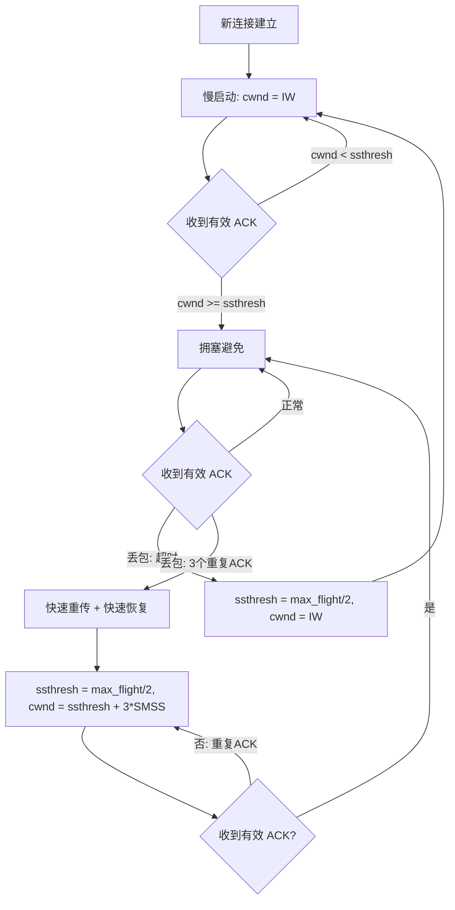
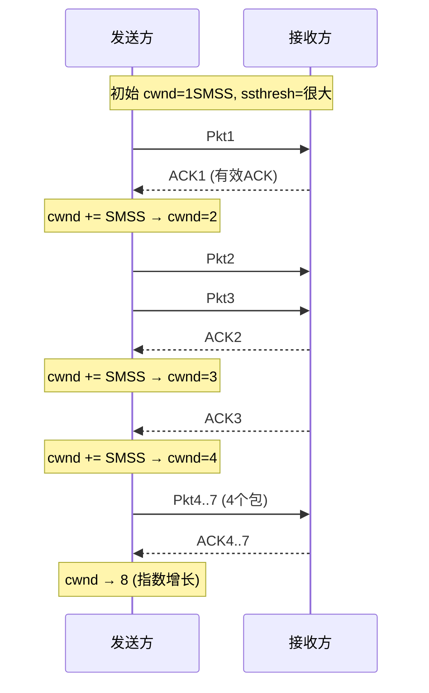
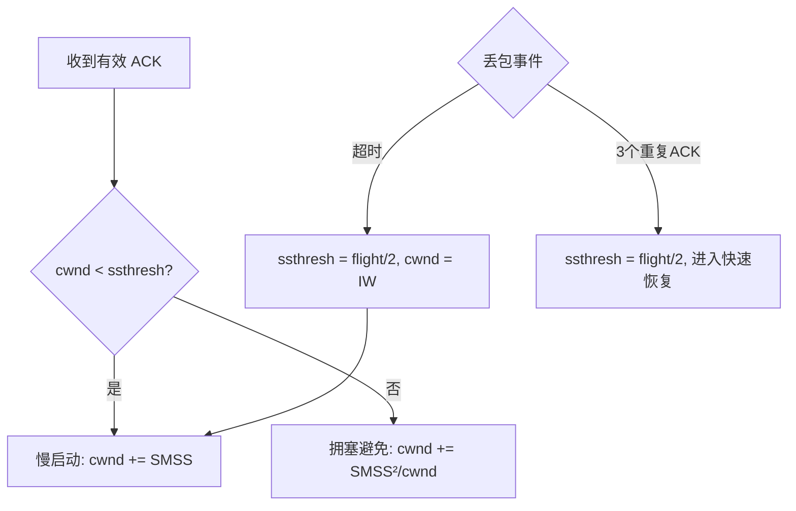
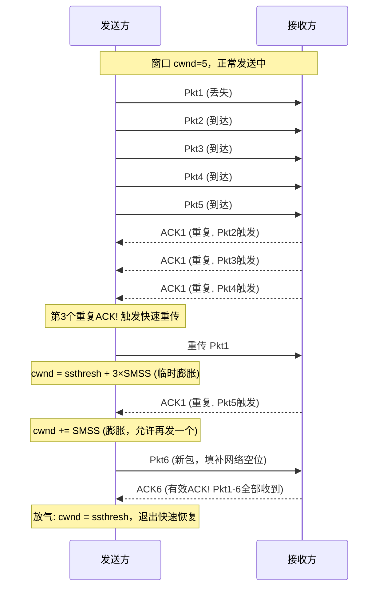

difficulty :  深入
source : "TCP/IP详解"
### 关键字解释
#### `cwnd`（拥塞窗口，Congestion Window）
**一句话**：发送方自己维护的、限制“已发送但未确认”数据量的上限。
**它解决什么问题**：在 TCP 刚建立连接时，发送方完全不知道网络能承受多少数据。如果一上来就按接收方通告的窗口大小全速发送，可能在中间路由器处引发大量丢包，拖垮其他连接。`cwnd` 的存在让发送方从极低速率开始，逐步探测网络容量上限。
**为什么需要它，而不是直接用接收方的通告窗口**：接收方通告的窗口只反映**对端机器的接收缓冲区大小**，不反映**中间网络的承载能力**。两台机器之间可能有十个路由器，每个都有缓冲队列。接收方说“我能收 64KB”，但中间路由器的缓冲只有 4KB——如果你真发 64KB，路由器会丢包。`cwnd` 就是用来探测这“中间网络”的容量的。
#### `ssthresh`（慢启动阈值，Slow Start Threshold）
**一句话**：记住“上一次拥塞发生时，安全的窗口大小是多少”。
**它解决什么问题**：当 `cwnd` 增长到某个值后，网络开始丢包。TCP 需要记住这个值——“到这里是安全的，超过它就要小心”。`ssthresh` 就是这个记忆。它让 TCP 在慢启动（指数增长）和拥塞避免（线性增长）之间有一个切换边界。
**为什么叫“慢启动阈值”**：因为 `cwnd < ssthresh` 时跑慢启动（指数增长），`cwnd >= ssthresh` 时切换到拥塞避免（线性增长）。阈值就是那个“该减速了”的分界线。
#### `IW`（初始窗口，Initial Window）
**一句话**：TCP 连接刚开始时，`cwnd` 的初始值。
**它解决什么问题**：如果你从 1 个 SMSS 开始，每次 HTTP 请求都要先经历几轮 RTT 的慢启动才能发出足够数据。这对短连接（如网页请求）来说太慢了。`IW` 的引入允许 TCP 一开始就能发几个包，而不是只能发 1 个。
**演进历史**：最初的 TCP（Tahoe）`IW = 1 SMSS`。RFC 3390 把它放宽到约 4KB，RFC 5681 继承并细化了这个规则。你现在看到的 IW 取值公式就是 RFC 5681 定义的——根据 SMSS 大小分档，上限 4 个段，大约 4~8 KB。
#### `SMSS`（发送方最大段大小，Sender Maximum Segment Size）
**一句话**：TCP 能在一个包的数据部分放入的最大字节数。
**它解决什么问题**：`cwnd` 是字节级的窗口，但增长操作是以“段”为单位的——每收到一个 ACK，`cwnd` 增加约 1 SMSS。所以 `SMSS` 是拥塞控制的**计量单位**。它通常等于接收方通告的 MSS 和路径 MTU 减去首部长度的较小值。
```c++
以太网帧结构 (最大 1518 字节, 标准 MTU=1500)
┌──────────┬──────────┬──────┬──────────────────┬──────┐
│ 目标MAC  │  源MAC   │ 类型  │     IP 数据报     │ CRC  │
│  6 字节  │  6 字节  │ 2 字节│    (最大 1500 字节) │4 字节│
└──────────┴──────────┴──────┴──────────────────┴──────┘
                            │
                            │  ← MTU = 1500 字节（以太网帧数据部分的上限）
                            │
                ┌───────────┴───────────┐
                │     IP 数据报          │
                │  ┌────────┬─────────┐ │
                │  │ IP 头  │ TCP 段  │ │
                │  │20 字节 │         │ │
                │  └────────┴────┬────┘ │
                │                │      │
                └────────────────┼──────┘
                                 │
                                 │ ← MSS = 1500 - 20(IP) - 20(TCP) = 1460 字节
                                 │    (TCP 数据部分的上限)
                                 │
                    ┌────────────┴────────────┐
                    │     TCP 段               │
                    │  ┌────────┬───────────┐ │
                    │  │ TCP 头 │  TCP 数据  │ │
                    │  │20 字节 │ 最大 1460  │ │
                    │  └────────┴───────────┘ │
                    └─────────────────────────┘
                                 │
                                 │ ← TCP 数据的最大字节数 = MSS
                                 │    你的 SMSS 通常等于这个值
                                 │
                        ┌────────┴────────┐
                        │   应用层数据     │
                        │   最大 1460 字节  │
                        └─────────────────┘
```
### 16.2 经典算法
#### 核心定义
TCP 拥塞控制的**两个核心算法**——慢启动与拥塞避免——共同解决一个问题：**如何在不知道网络可用容量的情况下，既尽快利用带宽，又不压垮网络。** TCP 通过 ACK 的接收来“驱动”或“计时”发送行为，遵循**数据包守恒原则**：每个 ACK 到达意味着一个包已离开网络，因此可以注入一个新包，保持网络中在途数据包数量恒定。
#### 数据包守恒与 ACK 时钟
**核心机制**：TCP 在稳定状态下依赖**ACK 时钟（ACK Clock）**——ACK 的到达节奏直接反映了数据包通过瓶颈链路的节奏，发送方按此节奏发送新包，就能维持网络中恒定的数据包数量，既不堆积也不空闲。
**工作原理**（见图 16-1）：
```
发送方                           接收方
  Ps ────────────────────────────► Pr
  数据包经瓶颈链路后间隔被拉开
                                   │
  As ◄──────────────────────────── Ar
        ACK 以相同间隔返回
        ACK 到达就是"发射信号"
```
这个过程中有两个“漏斗”——上方承载数据包（从发送方到接收方，瓶颈链路决定了数据包之间的最小间隔），下方承载 ACK（从接收方返回发送方，间隔与数据包一一对应）。**ACK 到达的时刻恰好就是网络准备好接收下一个数据包的时刻**。当上述条件满足时，系统称为**自计时（Self-Clocking）**，无需额外的计时器来协调发送节奏。
需要注意的是，此处描述的漏斗模型并非实体会消失的“一次性通道”，而是 TCP 连接全生命周期中持续存在的**稳态运行机制**——只要数据在流动，上方漏斗的数据包和下方漏斗的 ACK 就会持续形成闭环的反馈循环，这是“自计时”概念的核心：ACK 的节奏驱动着下一个数据包的发送，而数据包的到达又驱动着下一个 ACK 的生成。
这两个核心算法（慢启动与拥塞避免）最早于 1988 年在 Jacobson 的经典论文 [J88] 中被阐述，几年后 Jacobson 又对拥塞避免算法做了更新 [J90]。**它们不会同时运行**——TCP 在任一时刻只执行其中一种，但会在两者之间来回切换。
#### 图解：拥塞控制状态机

### 16.2.1 慢启动
#### 核心定义
**慢启动**：TCP 以指数速率探测网络可用带宽的初始阶段。通过每收到一个有效 ACK 就将 `cwnd` 增加 1 SMSS，实现窗口大小随 RTT 翻倍增长，直到触及 `ssthresh` 阈值或发生丢包。
#### 触发时机
1. **新 TCP 连接建立时**
2. **因重传超时（RTO）检测到丢包后**
3. **发送方空闲较长时间后**（此时 `cwnd` 被设为“重启窗口（RW）”，RW 的推荐值为 `min(IW, cwnd)`）
#### 初始窗口（IW）
| SMSS 大小               | IW 值    | 段数上限      |
| :------------------- | :------- | :------------ |
| SMSS > 2190 字节        | 2 × SMSS | 不超过 2 个段 |
| 2190 ≥ SMSS > 1095 字节 | 3 × SMSS | 不超过 3 个段 |
| 其他情况（SMSS ≤ 1095） | 4 × SMSS | 不超过 4 个段 |
在早期实现中 `IW = 1 SMSS`，RFC5681 允许将其设为更大的值以加速启动。
#### 增长规则
> **每收到一个有效 ACK，`cwnd` 增加 `min(N, SMSS)`**，其中 N 是该 ACK 新确认的字节数。
这意味着在无延迟 ACK 的场景中，每个 RTT 内 `cwnd` 翻倍——先发 1 个包，收 ACK 后 `cwnd` 增至 2，再收两个 ACK 后增至 4，以此类推。经过 k 轮 RTT 后，`W = 2^k`，要达到窗口 W 需要的 RTT 次数为 `k = log₂W`。
> **注意**：RFC5681 推荐的**适当字节计数（ABC）**机制（RFC3465）可用于防止“ACK 拆分攻击”——攻击者发送大量小 ACK 诱使 TCP 以超出正常的速率发送数据。Linux 中通过 `net.ipv4.tcp.abc` 控制（默认禁用）；新版 Windows 中默认开启。
#### 图解

---

### 16.2.2 拥塞避免

#### 核心定义

**拥塞避免**：TCP 在 `cwnd >= ssthresh` 后启动的稳定运行阶段，通过**每 RTT 将 `cwnd` 增加约 1 SMSS** 的线性增长方式，缓慢探测额外可用带宽，避免因突发流量导致大量连接同时丢包。

#### 增长规则

对于每个收到的有效 ACK，`cwnd` 按如下公式更新：

> **`cwnd += SMSS × SMSS / cwnd`**

**数学分析**：若当前 `cwnd = k × SMSS`（即窗口容纳 k 个段），收到一个 ACK 后 `cwnd` 变为 `(k + 1/k) × SMSS`，仅增加了 `1/k` 个段。随着 `cwnd` 变大，每个 ACK 带来的增量越来越小，这正是“线性增长”的数学实质——窗口越大，增长越谨慎。

| 对比维度      | 慢启动                   | 拥塞避免                             |
| :------------ | :----------------------- | :----------------------------------- |
| 增长速率      | 指数增长（每 RTT 翻倍）  | 近似线性增长（每 RTT 增加约 1 SMSS） |
| 增长规则      | `cwnd += SMSS`（每 ACK） | `cwnd += SMSS²/cwnd`（每 ACK）       |
| 别名          | —                        | 加法增长（Additive Increase）        |
| 设计目的      | 快速探测可用带宽         | 缓慢探测额外容量，避免激进           |
| 延迟 ACK 影响 | 依然指数，但慢一些       | 依然近似线性，但慢一些               |

---

### 16.2.3 慢启动与拥塞避免的切换

#### 核心定义

TCP 通过 **`ssthresh`（慢启动阈值）** 决定使用哪种算法：`cwnd < ssthresh` 时运行慢启动，`cwnd > ssthresh` 时运行拥塞避免。`ssthresh` 的核心作用是**记住上一轮“最佳”操作窗口的估计值**，在拥塞发生时将速率回退到这个安全水平。

#### `ssthresh` 的更新规则

当重传发生（超时或快速重传）时：

> **`ssthresh = max(flight_size / 2, 2 × SMSS)`**

这实际上就是**乘法减小（Multiplicative Decrease）**——将最优窗口估计值减半，但不得低于 2 SMSS。flight_size 指的是触发重传时网络中仍在传输、尚未被确认的数据量。

#### 算法切换逻辑



---

### 16.2.4 Tahoe、Reno 与快速恢复

#### 核心定义

两个以美国博彩业城市命名的早期 TCP 版本，核心区别在于丢包后的恢复策略：**Tahoe 丢包后直接重启慢启动，Reno 引入了快速恢复机制，避免因快速重传触发不必要的慢启动。**

#### 什么是**快速重传**和**快速恢复**?

##### ① 快速重传是什么？

TCP 发了一堆包，中间某个丢了。接收方收到**乱序**的包时，会重复 ACK 最后一个收到的有序字节。

```
发送方: 发 [1][2][3][4][5]
接收方: 收了 1  丢了 2  收了 3  收了 4
         ACK:   2    2     2    2
                 ^    ^     ^    ^
                 └──── 重复 ACK（3次） 
```

发送方收到 **3 个相同的重复 ACK** → 不等超时定时器→立刻重传 → 这叫**快速重传**（Fast Retransmit）。

##### ② 快速恢复是什么？

Tahoe 被快速重传触发后，`cwnd=1`，重新慢启动，白费了。

Reno 的改进：快速重传触发后不归零，而是：

```
ssthresh = flight_size / 2   // 限速牌砍半
cwnd = ssthresh + 3 × SMSS   // 暂借 3 个段继续发

// 每收一个重复 ACK → 临时膨胀 1 个段
// 直到收到"新 ACK" → 放气回 ssthresh
```

这叫**快速恢复**（Fast Recovery）。**核心思想：重复 ACK 说明对端还在收包，网络没断，只是丢了一个。**

#### 历史背景

这两个算法于 20 世纪 80 年代末随加州大学伯克利分校的 BSD UNIX 系统被引入，从此开启了以美国城市命名 TCP 版本的传统。

#### 对比表格

| 维度                | Tahoe (4.2BSD)               | Reno (4.3BSD)                                                |
| :------------------ | :--------------------------- | :----------------------------------------------------------- |
| 快速重传后的 `cwnd` | 重置为 1 SMSS;和超时一视同仁 | 设为 `ssthresh + 3 × SMSS`,<br />但是超时的时候和Tahoe算法相同:<br />超时:        cwnd = 1                  → 从头慢启动（慢） 快速重传:    cwnd = ssthresh + 3×MSS  → 从半山腰继续（快） |
| 恢复策略            | 重新进入慢启动               | 进入快速恢复，每重复 ACK 临时膨胀 `cwnd` 加上 1 SMSS         |
| 超时后行为          | 慢启动                       | 慢启动（与 Tahoe 相同）                                      |
| 大 BDP 路径性能     | ❌ 严重浪费带宽               | ✅ 速率降至约一半，无需重新慢启动                             |
| 数据包守恒利用      | ❌ 未利用                     | ✅ 每个重复 ACK 意味着一个包已离开，可注入新包                |

#### 源码

```cpp
// Tahoe 丢包处理：直接回退到慢启动
if (timeout || fast_retransmit_triggered) {
    ssthresh = max(flight_size / 2, 2 * SMSS);
    cwnd = 1 * SMSS;                     // 强制回到初始值
    // 随后进入慢启动：cwnd 指数增长直到 ssthresh
}

// Reno 丢包处理：快速重传触发时走快速恢复，不进入慢启动
if (fast_retransmit_triggered) {         // 仅 3 dup ACK 触发
    ssthresh = max(flight_size / 2, 2 * SMSS);
    cwnd = ssthresh + 3 * SMSS;          // 减半后临时膨胀 3 个 SMSS
    while (dup_ack_received) {
        cwnd += SMSS;                    // 每收重复 ACK，临时膨胀
    }
    cwnd = ssthresh;                     // 有效 ACK 到，"放气"退出恢复
}
// 超时仍走慢启动，与 Tahoe 一致
```

---

### 16.2.5 标准 TCP

#### 核心定义

RFC5681 规定了**标准 TCP 的基准行为**，融合了慢启动、拥塞避免、快速重传和快速恢复四个核心算法。规范不强制使用特定实现，但要求任何 TCP 实现不得比此标准更激进。

#### 标准 TCP 完整操作流程

**正常传输阶段**：`cwnd` 的更新取决于其与 `ssthresh` 的关系——

- 若 `cwnd < ssthresh`：`cwnd += SMSS`（慢启动）
- 若 `cwnd > ssthresh`：`cwnd += SMSS × SMSS / cwnd`（拥塞避免）

**快速重传与快速恢复**（收到第三个重复 ACK 触发）：

1. 将 `ssthresh` 更新为 `max(flight_size / 2, 2 × SMSS)`
2. 执行快速重传，将 `cwnd` 设为 `ssthresh + 3 × SMSS`
3. 每收到一个重复 ACK，临时将 `cwnd` 增加 1个SMSS
4. 当收到有效 ACK 时，将 `cwnd` 重置回 `ssthresh`

步骤 2 和步骤 3 共同构成**快速恢复**：步骤 2 先执行**乘法减小**（`cwnd` 减半），然后临时膨胀 3 个 SMSS；步骤 3 继续膨胀让发送方可发送更多包；步骤 4 中有效 ACK 到达后膨胀被移除（称为**“放气”**），TCP 退出恢复阶段。
看流程图得知;ack的回复表面一个包的准确到达,包1丢包2包3到都会回复ack=1,不存在超时.



**慢启动的触发场景**：

| 场景                     | `cwnd` 初始值                    |
| :----------------------- | :------------------------------- |
| 新连接建立               | IW（初始窗口，见 16.2.1 节公式） |
| 超时重传                 | IW                               |
| 空闲后重启               | RW = min(IW, cwnd)               |
| 其他怀疑 `cwnd` 不准确时 | IW                               |

#### 补充说明

- **为什么需要标准 TCP**：不同 TCP 实现的激进程度不一致会导致带宽分配不公平。RFC5681 通过规定“最大允许的激进程度”为所有 TCP 实现设立了统一的基准行为界限，任何实现不得比它更激进，但可以更保守

- **怎么来的**：慢启动和拥塞避免诞生于 1988 年 Jacobson 论文 [J88]，Tahoe (4.2BSD) 首次实现 → Reno (4.3BSD) 增加快速恢复 → RFC5681 标准化，后续 NewReno、CUBIC、BBR 都是在此基础上的改进

- ⚠️ `ssthresh` 初始值通常设得很大（至少等于 `awnd`），以保证 TCP 从慢启动开始。`ssthresh` 的值会随时间变化，保存着 TCP 对最优窗口大小的最低估计——它只在重传发生时被更新，在正常传输期间维持不变，这就是为什么 `cwnd` 可以一路从慢启动冲到 `ssthresh` 以上并进入拥塞避免阶段

- ⚠️ 无线网络场景下，丢包未必由拥塞引起，但标准 TCP 仍将其视为拥塞信号而减小 `cwnd`，这会导致无线网络中的 TCP 性能大幅下降——这也是后续许多优化算法的研究动机

- 🔗 `ssthresh` 的计算公式 `max(flight_size/2, 2*SMSS)` 与你此前在第 13 份任务中实现的 RTO 计算（RFC6298）有着相同的设计哲学：用平滑的数学方法而非硬编码常量来应对多变的网络条件

- 🔗 快速恢复期间每收到一个重复 ACK 就膨胀 `cwnd` 的逻辑，直接利用了**数据包守恒原则**（16.2 节开头所述）：每个重复 ACK 意味着一个包已离开网络，接收端空出了一个缓冲区位置，因此可以安全地注入一个新包而不加剧拥塞