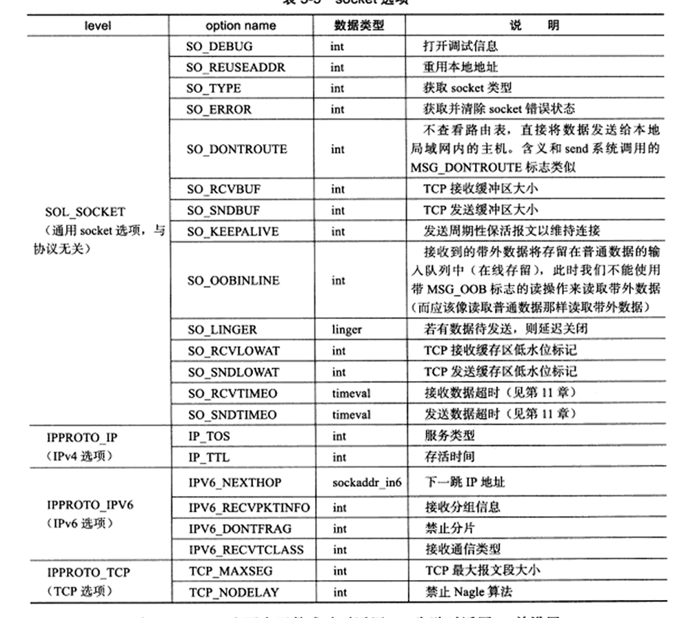
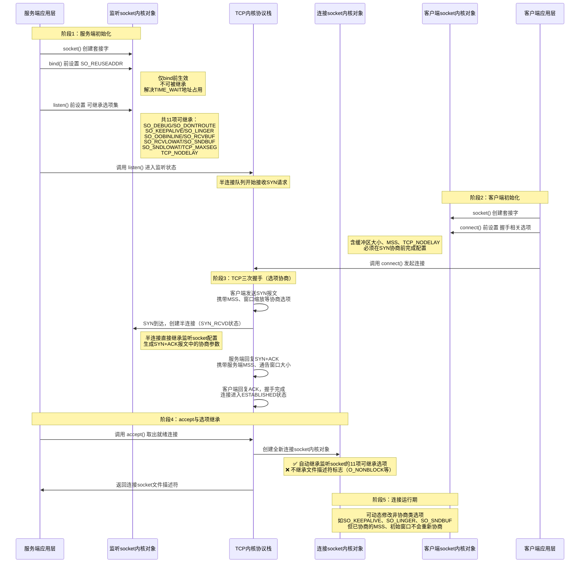
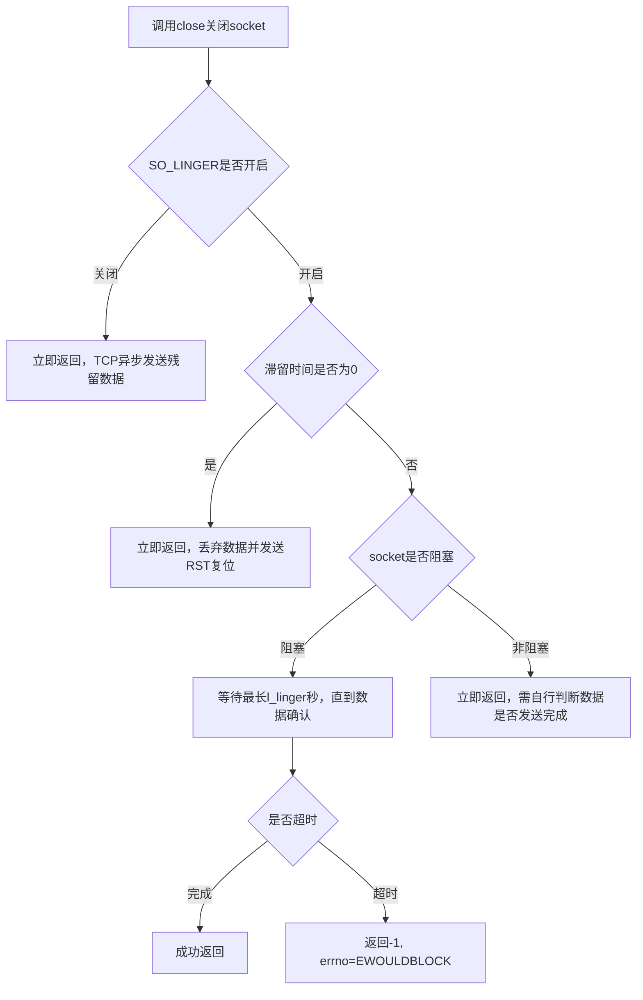

## socket选项
复习一下状态机: [[3-2 TCP的连接建立与终止]] 
### socket选项概述
#### 核心定义
socket选项是专门用于读取、设置socket文件描述符属性的系统调用，区别于控制通用文件描述符的`fcntl`。🐧
**函数原型**：
```cpp
#include <sys/socket.h>
int getsockopt(int sockfd, int level, int option_name, 
               void* option_value, socklen_t* restrict option_len);
int setsockopt(int sockfd, int level, int option_name, 
               const void* option_value, socklen_t option_len);
```
**参数说明**：
- `sockfd`：目标socket文件描述符
- `level`：指定协议层级，决定选项所属的协议栈模块
- `option_name`：具体选项的名称
- `option_value`：选项的值，不同选项对应不同数据类型
- `option_len`：选项值的长度，`getsockopt`中为传入传出参数
**返回值**：成功返回`0`，失败返回`-1`并设置`errno`。
#### 选项层级分类表
| level层级      | 选项类型             | 代表选项                                          |
| ------------ | ---------------- | --------------------------------------------- |
| SOL_SOCKET   | 通用socket选项（协议无关） | SO_REUSEADDR、SO_RCVBUF、SO_LINGER、SO_KEEPALIVE |
| IPPROTO_IP   | IPv4协议选项         | IP_TOS（服务类型）、IP_TTL（存活时间）                     |
| IPPROTO_IPV6 | IPv6协议选项         | IPV6_NEXTHOP、IPV6_DONTFRAG                    |
| IPPROTO_TCP  | TCP协议选项          | TCP_MAXSEG、TCP_NODELAY                        |
#### 详细表格

#### 设置时机与继承时序图

| 选项名称     | 所属层级    | 强制设置时机                      | accept 是否继承 | 生效阶段                       | 核心功能                               |
| ------------ | ----------- | --------------------------------- | --------------- | ------------------------------ | -------------------------------------- |
| SO_REUSEADDR | SOL_SOCKET  | bind () 之前                      | ❌ 不继承        | 地址绑定时                     | 重用 TIME_WAIT 状态的本地地址端口      |
| SO_DEBUG     | SOL_SOCKET  | listen/connect 前                 | ✅ 继承          | 全生命周期                     | 开启 socket 内核调试信息               |
| SO_DONTROUTE | SOL_SOCKET  | listen/connect 前                 | ✅ 继承          | 数据发送时                     | 跳过路由表，直接向本地网段主机发送     |
| SO_TYPE      | SOL_SOCKET  | 任意时机，只读                    | ❌ 不继承        | 全生命周期                     | 获取 socket 类型（SOCK_STREAM/UDP 等） |
| SO_ERROR     | SOL_SOCKET  | 任意时机，只读                    | ❌ 不继承        | 全生命周期                     | 获取并清除 socket 异步错误码           |
| SO_KEEPALIVE | SOL_SOCKET  | listen/connect 前最佳，运行期可改 | ✅ 继承          | 连接空闲期                     | 周期性发送保活报文，检测半开连接       |
| SO_OOBINLINE | SOL_SOCKET  | listen/connect 前                 | ✅ 继承          | 数据接收时                     | 将带外数据并入普通数据输入队列         |
| SO_LINGER    | SOL_SOCKET  | listen/connect 前最佳，运行期可改 | ✅ 继承          | 连接关闭时                     | 控制 close () 的滞留与残留数据处理     |
| SO_RCVBUF    | SOL_SOCKET  | listen/connect 前（影响窗口协商） | ✅ 继承          | 全生命周期，握手期决定初始窗口 | TCP 接收缓冲区大小，直接决定通告窗口   |
| SO_SNDBUF    | SOL_SOCKET  | listen/connect 前                 | ✅ 继承          | 全生命周期                     | TCP 发送缓冲区大小                     |
| SO_RCVLOWAT  | SOL_SOCKET  | listen/connect 前                 | ✅ 继承          | IO 复用事件触发时              | 接收缓冲区可读低水位标记               |
| SO_SNDLOWAT  | SOL_SOCKET  | listen/connect 前                 | ✅ 继承          | IO 复用事件触发时              | 发送缓冲区可写低水位标记               |
| SO_RCVTIMEO  | SOL_SOCKET  | 任意时机                          | ❌ 不继承        | 接收阻塞时                     | 阻塞接收的超时时间                     |
| SO_SNDTIMEO  | SOL_SOCKET  | 任意时机                          | ❌ 不继承        | 发送阻塞时                     | 阻塞发送的超时时间                     |
| IP_TOS       | IPPROTO_IP  | 任意时机                          | ❌ 不继承        | 数据发送时                     | IP 服务类型（DSCP / 优先级）           |
| IP_TTL       | IPPROTO_IP  | 任意时机                          | ❌ 不继承        | 数据发送时                     | IP 报文存活跳数                        |
| TCP_MAXSEG   | IPPROTO_TCP | 必须在 listen/connect 前          | ✅ 继承          | 握手协商阶段                   | TCP 最大报文段长度 MSS                 |
| TCP_NODELAY  | IPPROTO_TCP | listen/connect 前最佳，运行期可改 | ✅ 继承          | 数据发送时                     | 禁用 Nagle 算法，降低小包延迟          |
#### 补充说明
1. **为什么需要继承机制** 🛜
   TCP 部分核心选项（如 MSS、窗口大小）必须通过 SYN/SYN+ACK 报文完成协商，而服务端半连接在`accept`返回前就已完成两次握手，应用层无法介入。Linux 通过「监听 socket 配置→半连接继承→连接 socket 继承」的传递机制，确保握手阶段就能使用用户自定义参数。
2. **机制演进逻辑**
   早期 BSD Socket 规范中，`accept`仅继承 socket 基础属性；后续为支持 TCP 选项协商，逐步扩充了 11 项可继承选项。文件描述符级标志（如`O_NONBLOCK`）在 Linux 实现中始终不继承，这是与部分 BSD 系统的核心差异🐧。
3. **关联与坑点**
   - 🛜 `TCP_MAXSEG`、`SO_RCVBUF`直接参与三次握手窗口协商，错过设置时机只能重建连接才能生效
   - 🐧 非继承类选项（如`SO_RCVTIMEO`、`IP_TTL`）必须在`accept`返回后，单独对连接 socket 设置
   - ⚠️ 高频坑点：`fcntl`设置的非阻塞、异步 IO 等文件描述符标志，**不会被 accept 继承**，必须针对每个连接 socket 单独配置
#### 补充说明
1. **为什么需要**：`fcntl`仅能控制通用文件描述符属性，无法覆盖网络协议栈特有的行为（地址重用、缓冲区大小、TCP算法开关等），因此需要专用的分层级socket选项接口。
2. **怎么来的**：源自BSD Socket规范，随TCP/IP协议栈演进而不断扩充选项，形成了从通用socket层到具体协议层的分级配置体系。
3. **关联点**：
   - 🐧 属于Linux系统调用，直接操作内核socket对象的属性
   - 🛜 深度作用于TCP/IP协议栈行为，影响连接建立、数据传输、连接关闭全流程
   - 🔗 后续IO复用、高性能服务器调优等章节会高频依赖核心socket选项
   - ⚠️ 坑点：需在三次握手前生效的选项（如TCP_MAXSEG），服务端必须在`listen`前配置监听socket，客户端必须在`connect`前配置；`accept`返回的连接socket会自动继承监听socket的对应选项。
---

### 1.1 SO_REUSEADDR 选项
#### 核心定义
允许重用处于**TIME_WAIT状态**的连接所占用的本地地址与端口，是解决服务端重启时地址被占用问题的标准方案。🛜

内核态替代方案：修改`/proc/sys/net/ipv4/tcp_tw_recycle`参数，可让TCP连接跳过TIME_WAIT状态直接回收，但NAT场景下存在兼容性问题。🐧

#### 核心源码
```cpp
int sock = socket(PF_INET, SOCK_STREAM, 0);
int reuse = 1;
// 必须在bind()之前设置，否则不生效
setsockopt(sock, SOL_SOCKET, SO_REUSEADDR, &reuse, sizeof(reuse));

struct sockaddr_in addr;
// ... 地址初始化
bind(sock, (struct sockaddr*)&addr, sizeof(addr));
```
// 选项值为int类型，非0表示开启；仅对处于TIME_WAIT状态的端口生效，全新端口不受影响。

#### 补充说明
1. **为什么需要**：TCP主动关闭端会进入2MSL时长的TIME_WAIT状态，持续占用端口，导致服务端重启时`bind`失败；该选项是用户态最通用、最安全的解决方案。
2. **怎么来的**：伴随TCP TIME_WAIT状态的设计产生，为满足服务端快速重启的工程需求而引入，现已成为所有后端服务的标准配置项。
3. **关联点**：
   - 🛜 强依赖TCP状态机中的TIME_WAIT状态与端口四元组校验逻辑
   - 🐧 内核参数`tcp_tw_recycle`是内核态替代方案，但生产环境不推荐开启
   - 🔗 后续高性能服务器章节会作为必选初始化配置
   - ⚠️ 坑点：必须在`bind()`调用前设置，绑定完成后设置无效；仅允许复用端口，不允许完全相同的四元组重复建立连接。

> 思维导图位置：【SO_REUSEADDR】

---

### 1.2 SO_RCVBUF 与 SO_SNDBUF 选项
#### 核心定义
- **SO_RCVBUF**：配置TCP接收缓冲区的大小
- **SO_SNDBUF**：配置TCP发送缓冲区的大小

**内核处理规则**：
1. 应用设置的值会被内核**自动加倍**，用于预留内核簿记开销
2. 存在硬性最小值限制：接收缓冲区最小256字节，发送缓冲区最小2048字节
3. 全局内核参数`/proc/sys/net/ipv4/tcp_rmem`、`tcp_wmem`可调整全局缓冲区范围，突破单socket最小值限制。🐧

#### 生效数值对比表
| 配置项     | 用户设置值 | 内核实际生效值 | 触发规则         |
| ---------- | ---------- | -------------- | ---------------- |
| 接收缓冲区 | 50字节     | 256字节        | 触发最小值下限   |
| 发送缓冲区 | 2000字节   | 4000字节       | 触发自动加倍逻辑 |

#### 缓冲区与滑动窗口联动流程


#### 核心源码（发送缓冲区设置与验证）
```cpp
int sendbuf = atoi(argv[3]);
// 设置发送缓冲区大小
setsockopt(sock, SOL_SOCKET, SO_SNDBUF, &sendbuf, sizeof(sendbuf));

// 读取验证实际生效值
socklen_t len = sizeof(sendbuf);
getsockopt(sock, SOL_SOCKET, SO_SNDBUF, &sendbuf, &len);
printf("实际生效发送缓冲区: %d\n", sendbuf);
```
// 设置后立即读取可验证内核的加倍与最小值逻辑；需在连接建立前配置才会影响三次握手的窗口协商。

#### 补充说明
1. **为什么需要**：TCP缓冲区是滑动窗口的物理载体，直接决定连接的吞吐量上限；不同业务场景（大文件传输、低延迟交互）需要匹配不同的缓冲区配置。
2. **怎么来的**：从TCP流量控制机制衍生而来，早期系统采用固定缓冲区大小，后续开放用户态配置接口，同时内核保留最小值以保障协议栈基础可用性。
3. **关联点**：
   - 🛜 直接决定TCP通告窗口大小，是流量控制与吞吐量的核心影响因素
   - 🌏 属于内核空间内存分配，对应操作系统IO缓冲区机制
   - 🔗 第16章会详细讲解`tcp_rmem`/`tcp_wmem`内核参数调优
   - ⚠️ 坑点：设置值不会直接生效，内核会自动翻倍且有下限；缓冲区过小会导致零窗口通告，阻塞对端发送。

> 思维导图位置：【SO_RCVBUF与SO_SNDBUF】

---

### 1.3 SO_RCVLOWAT 与 SO_SNDLOWAT 选项
#### 核心定义
TCP缓冲区的**低水位标记**，是IO复用系统判断socket可读/可写事件的触发阈值。
- **SO_RCVLOWAT**：接收缓冲区中可读数据量 ≥ 该值时，IO复用通知应用程序可读
- **SO_SNDLOWAT**：发送缓冲区中空闲空间 ≥ 该值时，IO复用通知应用程序可写

默认值：两者均为**1字节**。

#### 对比表
| 选项        | 作用对象   | 触发条件        | 默认值 | 关联事件   |
| ----------- | ---------- | --------------- | ------ | ---------- |
| SO_RCVLOWAT | 接收缓冲区 | 可读数据 ≥ 阈值 | 1字节  | 读事件触发 |
| SO_SNDLOWAT | 发送缓冲区 | 空闲空间 ≥ 阈值 | 1字节  | 写事件触发 |

#### 补充说明
1. **为什么需要**：避免频繁的小数据事件通知，减少系统调用与上下文切换开销；业务可根据报文大小调整阈值，实现批量读写提升性能。
2. **怎么来的**：伴随IO复用机制（select/poll/epoll）演进而产生，为优化事件通知粒度而引入的配置项。
3. **关联点**：
   - 🔗 第9章IO复用系统调用的事件触发逻辑依赖该阈值
   - 🐧 属于内核socket事件检测的核心参数
   - ⚠️ 坑点：默认1字节会导致高并发下频繁触发小数据事件，可适当调大以降低系统开销。

> 思维导图位置：【SO_RCVLOWAT与SO_SNDLOWAT】

---

### 1.4 SO_LINGER 选项
#### 核心定义
控制`close()`系统调用关闭TCP连接时的行为，核心是**残留数据的处理策略**与**调用返回时机**。🛜

**配置结构体**：
```cpp
struct linger {
    int l_onoff;   // 选项开关：0=关闭，非0=开启
    int l_linger;  // 滞留时间，单位：秒
};
```

#### 三种关闭行为对比表
| 配置组合                            | close返回时机      | 残留数据处理                   | 连接终止方式              | 适用场景                         |
| ----------------------------------- | ------------------ | ------------------------------ | ------------------------- | -------------------------------- |
| l_onoff=0（默认）                   | 立即返回           | TCP内核异步发送完残留数据      | 正常四次挥手              | 绝大多数常规业务场景             |
| l_onoff≠0, l_linger=0               | 立即返回           | 直接丢弃缓冲区残留数据         | 发送RST复位报文，异常终止 | 需要强制快速断开的异常场景       |
| l_onoff≠0, l_linger>0（阻塞socket） | 最长等待l_linger秒 | 等待数据发送完成并收到对端确认 | 正常四次挥手              | 需要确保数据可靠送达再关闭的场景 |

#### 关闭行为流程图


#### 补充说明
1. **为什么需要**：默认`close`的"立即返回、异步发送"语义无法满足两类极端需求：一是需要强制快速断开的异常场景，二是需要确保数据可靠送达再关闭的强一致场景。
2. **怎么来的**：为弥补默认关闭语义的模糊性而设计，提供可控的连接关闭语义，是TCP连接生命周期管理的重要配置。
3. **关联点**：
   - 🛜 直接影响TCP连接关闭的状态机流转与报文交互
   - 🐧 与`close`系统调用的内核实现深度绑定
   - ⚠️ 坑点：非阻塞socket下`l_linger>0`时`close`仍会立即返回，不会阻塞等待；`l_linger=0`发送RST会跳过TIME_WAIT，可能引发历史报文错乱问题。

