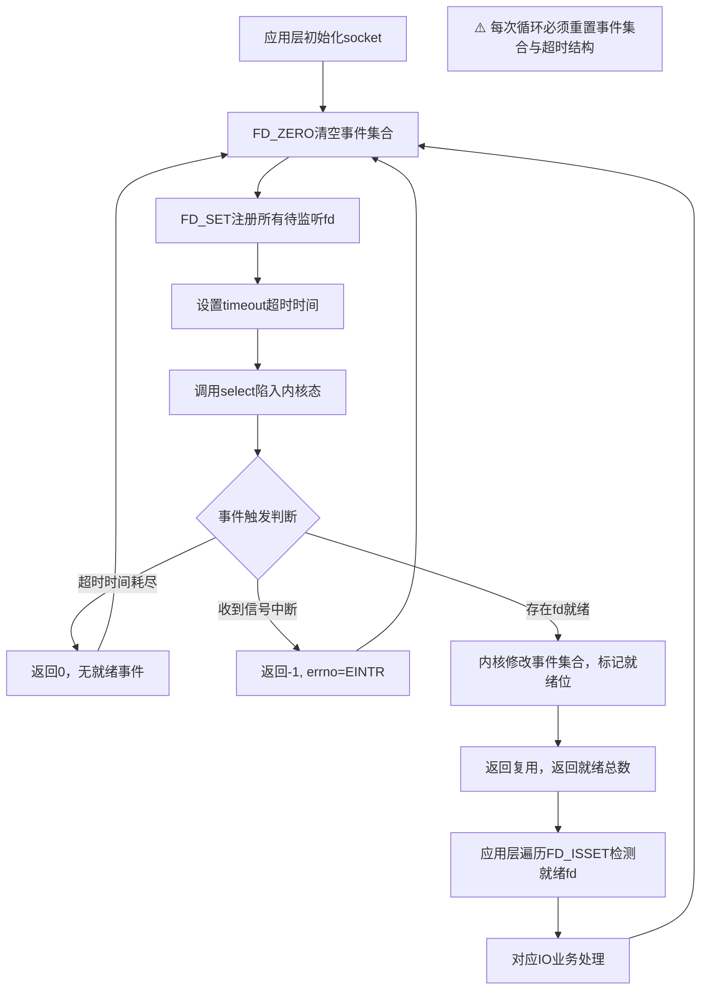
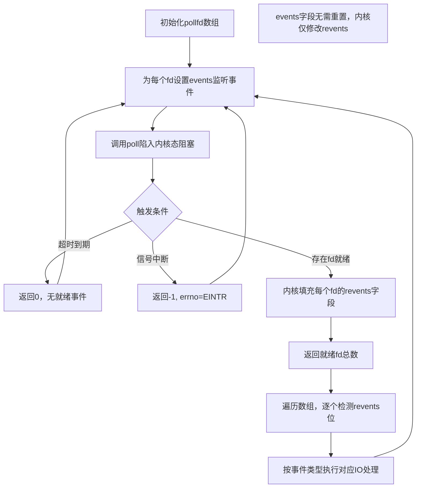

## I/O复用
### 0 I/O复用概述
#### 核心定义
I/O复用是让单执行流**同时监听多个文件描述符**的技术，是高性能网络程序的核心基础。其本质是用一个阻塞点等待多路IO事件，事件就绪后逐个处理，避免了多进程/线程模型的上下文切换开销。
> 关键特性：I/O复用本身是**阻塞的**；多个描述符同时就绪时默认串行处理，若要实现真正的并行并发，必须结合多进程或多线程。🌏
#### 典型适用场景
- 客户端同时处理多个socket（如非阻塞connect技术）
- 客户端同时处理用户输入与网络连接（如聊天室程序）
- TCP服务器同时处理监听socket与连接socket（最主流使用场景）
- 服务器同时处理TCP与UDP请求（如回射服务器）
- 服务器同时监听多个端口、承载多种服务（如xinetd超级服务器）
### 1 select系统调用
#### 1.1 核心API
##### 核心定义
`select`是POSIX标准定义的最早I/O复用系统调用，在指定超时时间内，监听文件描述符上的**可读、可写、异常**三类事件。🐧
**函数原型**：
```cpp
#include <sys/select.h>
int select(int nfds, fd_set* readfds, fd_set* writefds,
           fd_set* exceptfds, struct timeval* timeout);
```
##### 参数详解表
| 参数          | 类型                | 核心说明                                                           |
| ----------- | ----------------- | -------------------------------------------------------------- |
| `nfds`      | int               | 监听的文件描述符总数，必须设为所有监听fd的**最大值 + 1**（fd从0开始计数，内核遍历0~nfds-1的所有位）   |
| `readfds`   | `fd_set*`         | 可读事件集合，调用时传入待监听fd，返回时内核修改标记就绪fd                                |
| `writefds`  | `fd_set*`         | 可写事件集合，值-结果参数，调用前后内容会被内核修改                                     |
| `exceptfds` | `fd_set*`         | 异常事件集合（如TCP带外数据），值-结果参数                                        |
| `timeout`   | `struct timeval*` | 超时控制：`NULL`=永久阻塞；`tv_sec=0 && tv_usec=0`=立即返回（非阻塞轮询）；非0=等待指定时长 |
##### fd_set 数据结构
`fd_set`是select的核心载体，本质是**位图数组**，每一位对应一个文件描述符。总容量由`FD_SETSIZE`（默认1024）硬限制，直接决定了select单轮可监听的fd上限。
**底层结构简化定义**：
```cpp
typedef long int __fd_mask;
#define __NFDBITS (8 * sizeof(__fd_mask))
typedef struct {
    __fd_mask fds_bits[__FD_SETSIZE / __NFDBITS];
} fd_set;
```
// 按位存储，一个long对应__NFDBITS个fd，数组总长度覆盖1024个描述符
**操作宏集**：

| 宏函数                            | 功能                   | 使用阶段            |
| --------------------------------- | ---------------------- | ------------------- |
| `FD_ZERO(fd_set *fdset)`          | 清空集合所有位         | 初始化/每次循环重置 |
| `FD_SET(int fd, fd_set *fdset)`   | 注册fd到集合，开启监听 | 调用select前        |
| `FD_CLR(int fd, fd_set *fdset)`   | 从集合移除fd，取消监听 | 动态调整监听集      |
| `FD_ISSET(int fd, fd_set *fdset)` | 检测fd是否处于就绪状态 | select返回后        |
##### 返回值规则
- 成功：返回三类事件中**就绪文件描述符的总数量**
- 超时无就绪：返回 `0`
- 失败：返回 `-1` 并设置`errno`；被信号中断时返回-1，`errno = EINTR`
⚠️ 核心注意：三个事件集合均为**值-结果参数**，内核会在返回时覆盖修改集合内容，因此**每次循环调用select前必须重置所有集合**；同理timeout结构体也会被内核修改，固定超时需每次重新赋值。
#### select就绪的条件
##### 一、socket可读的4种触发场景
1. 接收缓冲区数据量 ≥ 接收低水位标记`SO_RCVLOWAT`，无阻塞读能获取大于0字节的数据
2. 通信对端关闭连接，对该socket执行读操作会返回0（EOF）
3. 监听socket收到新的客户端连接请求
4. socket存在未处理错误，可通过`getsockopt`读取并清除错误
##### 二、socket可写的4种触发场景
1. 发送缓冲区空闲空间 ≥ 发送低水位标记`SO_SNDLOWAT`，无阻塞写能成功写入数据
2. socket写端已关闭，后续写操作会触发`SIGPIPE`信号
3. 非阻塞`connect`完成（连接成功或超时失败）
4. socket存在未处理错误，可通过`getsockopt`处理清除错误
##### 三、select可识别的异常场景
仅**socket接收到TCP带外（OOB）数据**这一种情况。
##### 核心规律补充
低水位标记是普通读写就绪的判断阈值；未处理错误会同时让socket被标记为可读+可写；带外数据是唯一会触发异常事件的情况。
#### select执行流程图解

#### 核心使用源码示例
```cpp
#include <sys/select.h>
#include <errno.h>
#include <unistd.h>
int main() {
    int listen_fd = create_listen_socket(); // 创建监听socket
    int max_fd = listen_fd;
    fd_set read_fds;
    while (1) {
        // ⚠️ 必须每次循环重置，内核会覆盖修改集合
        FD_ZERO(&read_fds);
        FD_SET(listen_fd, &read_fds);
        struct timeval tv;
        tv.tv_sec = 5;
        tv.tv_usec = 0;
        int ret = select(max_fd + 1, &read_fds, NULL, NULL, &tv);
        if (ret < 0) {
            if (errno == EINTR) continue; // 信号中断属于正常情况，重试
            perror("select failed");
            break;
        }
        if (ret == 0) {
            printf("select timeout\n");
            continue;
        }
        // 遍历检测就绪fd
        if (FD_ISSET(listen_fd, &read_fds)) {
            int conn_fd = accept(listen_fd, NULL, NULL);
            // 新连接加入监听集合，更新max_fd
            FD_SET(conn_fd, &read_fds);
            max_fd = conn_fd > max_fd ? conn_fd : max_fd;
        }
    }
    return 0;
}
```
// nfds传max_fd+1是内核遍历的边界要求，少传会导致高编号fd无法被监听
// 异常事件集合不传则传NULL，表示不监听对应类型事件
#### 补充说明
1. **为什么需要select（I/O复用）**
   早期网络编程采用「阻塞IO + 每连接一进程/线程」模型，高并发下进程创建、调度、上下文切换开销急剧上升，系统吞吐量极低。I/O复用用单执行流统一管理所有连接，仅在事件真正就绪时才触发处理，大幅降低了系统开销，是C10K问题出现前的核心解决方案。🌏
2. **怎么来的**
   IO模型演进路径：阻塞IO → 非阻塞IO忙轮询 → select统一事件监听。select诞生于BSD 4.2，是首个标准化的I/O复用接口，采用位图+全量轮询的简单实现，具备极佳的POSIX兼容性。后续为解决select的1024上限、O(n)轮询开销、重复拷贝等缺陷，逐步演进出现poll、epoll等更高效的方案。🐧
3. **关联点与坑点**
   - 🐧 内核态全量遍历所有监听fd，时间复杂度O(n)，连接数越高性能衰减越明显
   - 🌏 属于同步IO模型，事件就绪后仍需用户态主动执行read/write完成数据拷贝
   - 🔗 后续poll、epoll章节会详细对比三者的实现差异、性能边界与适用场景
   - ⚠️ 高频坑点：
     1. 忘记每次循环重置fd集合与timeout结构，导致后续调用监听范围异常、超时时间不准
     2. `FD_SETSIZE`默认1024的硬限制，无法支撑高并发场景
     3. 内核与用户态之间每次都要全量拷贝fd集合，连接数多时拷贝开销巨大
     4. 信号中断返回`EINTR`未做重试处理，误判为系统调用失败
### 带外数据（OOB）全解析
#### 核心定义
带外数据（Out-of-Band，简称 **OOB**）是TCP协议提供的**紧急数据传输机制**，用于传输高优先级控制信息，可绕过普通字节流的排队顺序，优先通知接收端应用层处理。🛜
**本质**：TCP是严格有序的字节流协议，带外数据并非脱离数据流单独传输，而是通过TCP头部的特殊标记，实现「数据仍在流中，但接收端提前收到紧急通知」的效果。
#### TCP底层实现原理
1. **头部标识**：通过TCP首部的`URG`标志位 + 16位**紧急指针**字段实现
   - `URG=1`：标记本报文携带紧急数据
   - 紧急指针：指向紧急数据字节的下一个位置，标记紧急数据边界
2. **单字节限制**：标准TCP实现中，**同一时刻仅1字节带外数据有效**。连续发送多字节OOB时，后发的会覆盖前者，只有最后1字节会被标记为紧急数据
3. **交付逻辑**：接收端内核检测到URG标志后，立即向应用层触发紧急通知，但数据本身仍然存储在普通接收缓冲区中
#### 普通数据 vs 带外数据 对比表
| 维度           | 普通数据                | 带外数据（OOB）               |
| -------------- | ----------------------- | ----------------------------- |
| select就绪事件 | 可读事件（`readfds`）   | 异常事件（`exceptfds`）       |
| 读取方式       | `recv(fd, buf, len, 0)` | `recv(fd, buf, len, MSG_OOB)` |
| 数据量限制     | 受缓冲区大小限制        | 同一时刻仅1字节有效           |
| 交付顺序       | 严格按字节流顺序排队    | 优先触发应用层通知            |
| 典型用途       | 业务数据传输            | 远程控制中断、紧急信令        |
#### 两种读取模式
1. **独立读取模式（默认）**
   OOB数据与普通数据分离，通过`MSG_OOB`标志单独读取，在select中通过`exceptfds`异常事件集监听。
2. **在线存留模式（`SO_OOBINLINE`）**
   开启对应socket选项后，OOB数据直接混入普通数据流，不再触发异常事件，与普通数据一起通过可读事件读取，需应用层通过`sockatmark()`判断紧急数据边界。
#### 核心源码（select处理OOB）
```cpp
fd_set read_fds, exception_fds;
FD_ZERO(&read_fds);
FD_ZERO(&exception_fds);
while (1) {
    // ⚠️ 每次循环必须重置两个事件集合
    FD_SET(connfd, &read_fds);
    FD_SET(connfd, &exception_fds);
    select(connfd + 1, &read_fds, NULL, &exception_fds, NULL);
    // 普通数据 → 可读事件分支
    if (FD_ISSET(connfd, &read_fds)) {
        ret = recv(connfd, buf, sizeof(buf)-1, 0);
        // 处理业务数据
    }
    // 带外数据 → 异常事件分支
    else if (FD_ISSET(connfd, &exception_fds)) {
        ret = recv(connfd, buf, sizeof(buf)-1, MSG_OOB);
        // 处理紧急控制信号
    }
}
```
// 异常事件集是select专为带外数据设计的事件通道，也是select三类事件中唯一的异常场景
// `MSG_OOB`标志告诉内核从紧急位置取出1字节带外数据
#### 补充说明
1. **为什么需要**
早期远程终端协议（Telnet、FTP）需要在数据传输过程中发送紧急中断信号（如Ctrl+C终止命令），如果走普通字节流，必须等前面所有数据处理完才能收到控制信号，响应延迟过高。带外数据就是为了解决「在字节流中优先传递控制信令」的需求。
2. **怎么来的**
- 源自BSD TCP实现，作为TCP标准特性纳入RFC 793
- 早期互联网远程登录、文件传输协议广泛依赖OOB做紧急控制
- 现代网络编程已极少使用，主流协议普遍采用「带内信令」（业务数据内嵌控制字段）替代，规避其单字节、兼容性差的缺陷
3. **关联点与坑点**
   - 🛜 属于TCP协议标准特性，依赖URG标志位与紧急指针实现
   - 🐧 Linux内核在TCP协议栈层处理OOB的标记与通知逻辑
   - 🔗 对应socket选项`SO_OOBINLINE`，与第5章socket选项体系联动
   - ⚠️ 常见坑点：
     1. 误以为OOB是独立传输通道，实际数据仍在普通流中，只是提前通知
     2. 连续发送多字节OOB会被覆盖，只有最后1字节有效
     3. 不同系统实现存在差异，跨平台兼容性差
     4. 开启`SO_OOBINLINE`后，异常事件不再触发，容易漏处理紧急标记
> 思维导图位置：【带外数据OOB】
### 2 poll 系统调用
#### 核心定义
`poll` 是 POSIX 标准定义的第二代 I/O 复用系统调用，功能与 `select` 同源，通过结构体数组批量监听多个文件描述符的各类 IO 事件，在指定超时时间内阻塞等待事件就绪。🐧
**函数原型**：
```cpp
#include <poll.h>
int poll(struct pollfd* fds, nfds_t nfds, int timeout);
```
**核心数据结构 pollfd**：
```cpp
struct pollfd {
    int fd;       // 目标文件描述符
    short events; // 用户注册的待监听事件，按位或组合
    short revents;// 内核填充的实际就绪事件，返回后由用户检测
};
```
// 输入事件与输出结果字段分离，是 poll 相对 select 的核心接口优化
**参数说明**：
- `fds`：pollfd 结构体数组，每个元素指定一个 fd 及其监听事件
- `nfds`：监听数组的元素个数，类型为 `nfds_t`（无符号长整型），无系统硬编码上限
- `timeout`：超时时间，单位毫秒
  - `-1`：永久阻塞，直到事件触发
  - `0`：立即返回，非阻塞轮询
  - `>0`：等待指定毫秒数
**返回值**：成功返回就绪 fd 总数，超时返回 0，失败返回 -1 并设置 `errno`。
---

#### poll 事件类型全量表
| 事件常量   | 描述                                | 可作为输入(events) | 可作为输出(revents) | 备注                                               |
| ---------- | ----------------------------------- | ------------------ | ------------------- | -------------------------------------------------- |
| POLLIN     | 数据可读（含普通数据+优先数据）     | 是                 | 是                  | 最通用读事件                                       |
| POLLRDNORM | 普通数据可读                        | 是                 | 是                  | XOPEN 规范，Linux 下与 POLLIN 等效                 |
| POLLRDBAND | 优先级带数据可读                    | 是                 | 是                  | Linux 原生不支持                                   |
| POLLPRI    | 高优先级数据可读（如 TCP 带外数据） | 是                 | 是                  | 对应 select 异常事件集                             |
| POLLOUT    | 数据可写（含普通+优先数据）         | 是                 | 是                  | 最通用写事件                                       |
| POLLWRNORM | 普通数据可写                        | 是                 | 是                  | Linux 下与 POLLOUT 等效                            |
| POLLWRBAND | 优先级带数据可写                    | 是                 | 是                  | Linux 支持度有限                                   |
| POLLRDHUP  | TCP 对端关闭连接 / 关闭写端         | 是                 | 是                  | GNU 扩展，内核 2.6.17 起支持，需定义 `_GNU_SOURCE` |
| POLLERR    | 文件描述符发生错误                  | 否                 | 是                  | 自动触发，无需注册                                 |
| POLLHUP    | 挂起事件（如管道写端关闭）          | 否                 | 是                  | 自动触发，无需注册                                 |
| POLLNVAL   | 文件描述符未打开 / 无效             | 否                 | 是                  | 自动触发，无需注册                                 |

---

#### select vs poll 核心对比表
| 维度      | select                                | poll                                       |
| ------- | ------------------------------------- | ------------------------------------------ |
| 存储结构    | fd_set 位图，受 `FD_SETSIZE` 硬限制（默认 1024） | pollfd 结构体数组，无固定上限，可动态扩容                   |
| 输入输出关系  | 集合复用，内核会覆盖修改输入集合，每次循环必须重置             | events 与 revents 分离，仅 revents 被修改，无需重置监听事件 |
| 事件粒度    | 仅可读、可写、异常三类                           | 十余种细分事件，支持半关闭、错误等精细化检测                     |
| fd 数量上限 | 系统级硬限制，修改需重新编译内核                      | 无系统限制，仅受进程最大 fd 数约束                        |
| 内核复杂度   | 遍历 0~nfds-1 所有位，时间复杂度 O(n)            | 遍历数组元素，时间复杂度 O(n)                          |
| 跨平台兼容性  | 全 POSIX 平台通用，兼容性最好                    | 类 Unix 系统广泛支持，Windows 支持较差                 |
| 带外数据处理  | 独立异常事件集                               | 统一通过 POLLPRI 事件标记                          |

---

#### poll 执行流程图


---

#### 核心源码示例
```cpp
#define _GNU_SOURCE // 启用POLLRDHUP GNU扩展
#include <poll.h>
#include <errno.h>
#include <unistd.h>

#define MAX_CONN 2048

int main() {
    int listen_fd = create_listen_socket();
    struct pollfd fds[MAX_CONN];
    int nfds = 1;

    // 注册监听socket的可读事件
    fds[0].fd = listen_fd;
    fds[0].events = POLLIN;

    while (1) {
        // ⚠️ events字段无需重置，内核只修改revents
        int ret = poll(fds, nfds, -1); // -1 永久阻塞
        if (ret < 0) {
            if (errno == EINTR) continue; // 信号中断重试
            perror("poll failed");
            break;
        }

        // 遍历所有fd检测就绪事件
        for (int i = 0; i < nfds; i++) {
            // 可读事件：新连接 / 业务数据
            if (fds[i].revents & POLLIN) {
                if (fds[i].fd == listen_fd) {
                    int conn_fd = accept(listen_fd, NULL, NULL);
                    // 新连接加入监听数组
                    fds[nfds].fd = conn_fd;
                    fds[nfds].events = POLLIN | POLLRDHUP;
                    nfds++;
                } else {
                    char buf[1024];
                    int n = read(fds[i].fd, buf, sizeof(buf));
                    if (n <= 0) goto close_conn;
                }
            }
            // 对端关闭连接（半关闭检测）
            else if (fds[i].revents & POLLRDHUP) {
close_conn:
                close(fds[i].fd);
                fds[i] = fds[--nfds]; // 末尾元素填补空位
                i--; // 下标回退，避免漏遍历
            }
            // 错误事件，自动触发无需注册
            else if (fds[i].revents & (POLLERR | POLLNVAL)) {
                goto close_conn;
            }
        }
    }
    return 0;
}
```
// POLLERR/POLLHUP/POLLNVAL 属于输出-only事件，写入 events 部分系统会报错
// POLLRDHUP 可直接识别对端关闭，无需通过 read 返回 0 间接判断

---

#### 补充说明
1. **为什么需要 poll**
select 存在三大工程缺陷：1024 硬上限限制并发规模、输入输出集合复用导致每次必须重置、事件粒度太粗无法精细化检测。poll 通过结构体数组设计解决了前两个问题，同时扩充了细分事件类型，是在不改变内核 O(n) 轮询模型前提下，对用户态接口的标准化优化。🌏

2. **怎么来的**
IO 复用演进路径：阻塞 IO → 非阻塞 IO → select → poll → epoll。
poll 源自 System V 标准，作为 select 的替代方案设计，保留了内核全量轮询的核心逻辑，仅优化用户态接口体验。后续 Linux 为解决大并发下内核遍历的性能瓶颈，进一步演进出自研的 epoll 机制。🐧

3. **关联点与坑点**
- 🐧 内核态仍为全量遍历，时间复杂度 O(n)，连接数上万后性能线性衰减，与 select 无本质差异
- 🛜 POLLPRI 对应 TCP 带外数据，与 select 异常事件集等价；POLLRDHUP 对应 TCP 半关闭状态检测
- 🔗 后续 epoll 章节会详细对比三者的实现差异、性能边界与适用场景
- ⚠️ 常见坑点：
  1. 未定义 `_GNU_SOURCE` 导致 POLLRDHUP 编译不可用
  2. 误以为 poll 性能优于 select，二者内核逻辑一致，仅用户态接口更友好
  3. 删除数组元素时忘记下标回退，导致漏遍历下一个元素
  4. 向 events 字段写入 POLLERR 等只读事件，引发未定义行为

### 3 epoll 系统调用

#### 核心定义
`epoll` 是 Linux 独有的 I/O 复用系统调用，通过内核事件表（event table）**将文件描述符与事件类型注册到内核空间**，后续监听只需等待内核通知，彻底解决了 select/poll 每次调用都全量拷贝 + 全量遍历的 O(n) 性能瓶颈。🐧

epoll 是 Linux 2.6 内核引入的**事件驱动型 I/O 复用机制**，其核心设计理念为：
- **注册而非轮询**：fd 只需注册一次到内核事件表，之后内核通过回调机制主动通知就绪事件
- **仅返回就绪的**：epoll_wait 返回的仅包含已就绪的 fd，无需遍历全部监听的描述符
- **内核持久化管理**：事件表由内核维护，无需每次调用重复传递完整的监听集合

**epoll 三件套 API**：
```cpp
#include <sys/epoll.h>

int epoll_create(int size);
int epoll_ctl(int epfd, int op, int fd, struct epoll_event *event);
int epoll_wait(int epfd, struct epoll_event *events, int maxevents, int timeout);
```

---

#### 3.1 epoll_create — 创建内核事件表

**函数原型**：
```cpp
int epoll_create(int size);
```
- **参数** `size`：早期用于提示内核该 epoll 实例预计监听的 fd 数量，现代 Linux 内核已忽略此参数（动态扩展），但传入值仍需 >0 以兼容旧版
- **返回值**：成功返回 epoll 专用文件描述符（epfd），失败返回 -1 并设置 errno
- **资源释放**：epfd 本身也是 fd，使用完毕后必须 `close(epfd)` 回收资源

**内核数据结构**：epoll 在内核中维护的核心结构是一棵**红黑树**（存储所有注册的 fd）+ 一个**就绪链表**（存储已触发事件的 fd），这也是 O(log n) 注册性能和 O(1) 就绪事件获取的基础。

---

#### 3.2 epoll_ctl — 操作内核事件表

**函数原型**：
```cpp
int epoll_ctl(int epfd, int op, int fd, struct epoll_event *event);
```

**参数说明**：

| 参数 | 说明 |
|------|------|
| `epfd` | epoll_create 返回的内核事件表描述符 |
| `op` | 操作类型：EPOLL_CTL_ADD / EPOLL_CTL_MOD / EPOLL_CTL_DEL |
| `fd` | 目标文件描述符 |
| `event` | 事件配置结构体指针，ADD/MOD 时传入，DEL 时可传 NULL |

**op 三类操作**：

| 操作码             | 含义             | 说明                                   |
| --------------- | -------------- | ------------------------------------ |
| `EPOLL_CTL_ADD` | 注册新 fd         | 将 fd 加入内核事件表，重复添加已存在的 fd 会失败（EEXIST） |
| `EPOLL_CTL_MOD` | 修改已注册 fd 的事件类型 | 修改 event 结构体中 events 字段指定的事件         |
| `EPOLL_CTL_DEL` | 注销 fd          | 从内核事件表中移除 fd，关闭 fd 时也会自动移除           |

**epoll_event 结构体**：
```cpp
struct epoll_event {
    uint32_t     events;   // 事件类型（按位或组合）
    epoll_data_t data;     // 用户数据联合体
};

typedef union epoll_data {
    void    *ptr;   // 指向任意类型用户数据
    int      fd;    // 目标文件描述符
    uint32_t u32;
    uint64_t u64;
} epoll_data_t;
```

---

#### 3.3 epoll 事件类型全量表

| 事件宏                | 是否可作为输入(events) | 是否可作为输出(revents) | 说明                       |
| ------------------ | :-------------: | :--------------: | ------------------------ |
| `EPOLLIN`          |        ✅        |        ✅         | 数据可读（含普通数据+优先数据）         |
| `EPOLLRDNORM`      |        ✅        |        ✅         | 普通数据可读                   |
| `EPOLLRDBAND`      |        ✅        |        ✅         | 优先级带数据可读（Linux 未使用）      |
| `EPOLLPRI`         |        ✅        |        ✅         | 高优先级数据可读（TCP 带外数据）       |
| `EPOLLOUT`         |        ✅        |        ✅         | 数据可写                     |
| `EPOLLWRNORM`      |        ✅        |        ✅         | 普通数据可写                   |
| `EPOLLWRBAND`      |        ✅        |        ✅         | 优先级带数据可写                 |
| `EPOLLMSG`         |        ✅        |        ✅         | 未使用                      |
| **`EPOLLERR`**     |        ❌        |        ✅         | 发生错误（内核自动设置）             |
| **`EPOLLHUP`**     |        ❌        |        ✅         | 挂起事件（如对端关闭，内核自动设置）       |
| **`EPOLLRDHUP`**   |        ✅        |        ✅         | TCP 对端关闭连接 / 关闭写端        |
| **`EPOLLONESHOT`** |        ✅        |        —         | 一次性触发，事件处理后需重新注册         |
| **`EPOLLET`**      |        ✅        |        —         | 启用边缘触发（ET）模式，默认是水平触发（LT） |

> ⚠️ EPOLLERR、EPOLLHUP 由内核自动设置，即使不在 events 中注册，也会在事件触发时出现在 revents 中。EPOLLONESHOT 和 EPOLLET 是行为修饰符，不是具体事件。

---

#### 3.4 epoll_wait — 等待事件就绪

**函数原型**：
```cpp
int epoll_wait(int epfd, struct epoll_event *events, int maxevents, int timeout);
```

**参数说明**：

| 参数 | 说明 |
|------|------|
| `epfd` | 内核事件表描述符 |
| `events` | **输出数组**，内核将就绪事件填充到此数组中（不同于 pollfd 的 revents，这里直接输出到独立的 events 数组） |
| `maxevents` | 指定最多返回的事件数量，即 events 数组的容量 |
| `timeout` | 超时时间（毫秒）：-1=永久阻塞，0=立即返回 |

**返回值**：
- `>0`：就绪的 fd 数量
- `0`：超时无就绪事件
- `-1`：失败，设置 errno

**关键行为**：epoll_wait 返回后，遍历返回的 n 个 `events[i].data.fd` 即可获取所有就绪 fd——**不需要像 select/poll 一样遍历全部监听集合**，这就是 epoll 在大并发下的核心性能优势。

---
#### 3.5 epoll 核心源码示例
```cpp
#include <sys/epoll.h>
#include <errno.h>
#include <unistd.h>

#define MAX_EVENTS 1024

int main() {
    int listen_fd = create_listen_socket();
    // 1. 创建内核事件表
    int epfd = epoll_create(5);
    if (epfd < 0) {
        perror("epoll_create");
        return -1;
    }

    // 2. 注册监听 socket 的 EPOLLIN 事件
    struct epoll_event ev;
    ev.events = EPOLLIN;
    ev.data.fd = listen_fd;
    if (epoll_ctl(epfd, EPOLL_CTL_ADD, listen_fd, &ev) < 0) {
        perror("epoll_ctl: listen_fd");
        return -1;
    }

    struct epoll_event events[MAX_EVENTS];
    while (1) {
        // 3. 等待事件就绪
        int nfds = epoll_wait(epfd, events, MAX_EVENTS, -1);
        if (nfds < 0) {
            if (errno == EINTR) continue;
            perror("epoll_wait");
            break;
        }

        // 4. 仅遍历就绪的 nfds 个事件，不是全部监听集合！
        for (int i = 0; i < nfds; i++) {
            int ready_fd = events[i].data.fd;

            if (ready_fd == listen_fd) {
                // 新连接到达
                int conn_fd = accept(listen_fd, NULL, NULL);
                ev.events = EPOLLIN | EPOLLET;  // 启用边缘触发
                ev.data.fd = conn_fd;
                epoll_ctl(epfd, EPOLL_CTL_ADD, conn_fd, &ev);
            } else if (events[i].events & EPOLLIN) {
                char buf[1024];
                int n = read(ready_fd, buf, sizeof(buf));
                if (n <= 0) {
                    // 对端关闭或错误
                    epoll_ctl(epfd, EPOLL_CTL_DEL, ready_fd, NULL);
                    close(ready_fd);
                } else {
                    // 处理业务数据
                }
            }
        }
    }
    close(epfd);
    return 0;
}
```
#### 3.6 epoll内核过程详解
##### 示例前提设定
- 1 个 epoll 实例（对应 `epfd`），共 3 个被监听的文件描述符：
  - `fd=3`：监听套接字，**水平触发 LT**，监听 `EPOLLIN`
  - `fd=5`：客户端连接 A，**边缘触发 ET**，监听 `EPOLLIN`
  - `fd=7`：客户端连接 B，**边缘触发 ET**，监听 `EPOLLIN`
- 每个 fd 对应唯一的 `struct epitem` 对象，对象内嵌两个独立挂载钩子：
  - `rb_node rbn`：永久挂在红黑树上，用于全局索引
  - `list_head rdllink`：仅就绪时临时挂在就绪链表上

---

##### 阶段 0：epoll_create 初始化完成
调用 `epoll_create` 后，内核创建空的 `struct eventpoll` 实例，红黑树、就绪链表均为空。

```
==================== 阶段0：空 epoll 实例 ====================

【红黑树 rbr】
   根指针 → NULL
   （空树，无任何节点）

【就绪链表 rdlist】
   rdlist (头节点) ◄──────► rdlist (头节点)
   （空双向循环链表，首尾自环）

【等待队列 wq】
   空，暂无进程休眠
```

**状态说明**：
- 仅完成内核对象初始化，没有任何 fd 被监听
- 此时调用 `epoll_wait` 会直接让进程挂到 `wq` 上休眠

---

##### 阶段 1：依次添加 fd=3、fd=5、fd=7
连续执行三次 `epoll_ctl(EPOLL_CTL_ADD)`，内核调用 `ep_insert` 为每个 fd 创建 `epitem`，插入红黑树；**不操作就绪链表**。

红黑树按 fd 数值升序组织（简化平衡结构，根节点为 fd=5）。

```
==================== 阶段1：3个fd全部注册，均未就绪 ====================

【红黑树 rbr】
            ┌──────────────────┐
            │  epitem(fd=5)    │
            │   rb_node rbn    │ ◄── 红黑树根节点
            └──────────────────┘
             /                \
┌──────────────────┐    ┌──────────────────┐
│  epitem(fd=3)    │    │  epitem(fd=7)    │
│   rb_node rbn    │    │   rb_node rbn    │
└──────────────────┘    └──────────────────┘
  三个节点均只挂载在红黑树上，rdllink 全部处于游离状态

【就绪链表 rdlist】
   rdlist (头节点) ◄──────► rdlist (头节点)
   依然为空，无任何就绪 fd
```

**状态说明**：
- 红黑树承担「全量 fd 管理」职责，所有被监听的 fd 都常驻于此，增删查复杂度 O(logn)
- 就绪链表承担「事件交付」职责，无事件时为空
- 两个数据结构完全平行，互不干扰

---

##### 阶段 2：fd=3 就绪（监听套接字收到新连接）
客户端发起三次握手完成，监听 socket 全连接队列非空，触发 `EPOLLIN`；
内核驱动调用回调 `ep_poll_callback`，将 `fd=3` 的 `epitem` 插入就绪链表尾部，并唤醒休眠进程。

```
==================== 阶段2：fd=3 就绪，接入就绪链表 ====================

【红黑树 rbr】 ← 结构完全不变
            ┌──────────────────┐
            │  epitem(fd=5)    │
            └──────────────────┘
             /                \
┌──────────────────┐    ┌──────────────────┐
│  epitem(fd=3)    │    │  epitem(fd=7)    │
└──────────────────┘    └──────────────────┘
        ↑
        │ 同一个 epitem 对象，同时属于两个结构
        ▼
【就绪链表 rdlist】
   rdlist ◄──────► epitem(fd=3) ◄──────► rdlist
                    rdllink 节点接入
```

**状态说明**：
- 红黑树没有任何增删、重平衡操作，节点位置和数量完全不变
- 仅将已就绪 `epitem` 的 `rdllink` 钩子，接入就绪链表
- 进程从等待队列唤醒，`epoll_wait` 即将返回

---

##### 阶段 3：处理完 fd=3 事件，从链表移除
`epoll_wait` 返回后，用户态调用 `accept` 取出新连接；
`fd=3` 为 LT 模式，假设处理完全连接队列已空、无剩余可读事件，内核将其从就绪链表移除。

```
==================== 阶段3：fd=3 事件处理完毕，移出链表 ====================

【红黑树 rbr】 ← 依然完全不变
            ┌──────────────────┐
            │  epitem(fd=5)    │
            └──────────────────┘
             /                \
┌──────────────────┐    ┌──────────────────┐
│  epitem(fd=3)    │    │  epitem(fd=7)    │
└──────────────────┘    └──────────────────┘

【就绪链表 rdlist】
   rdlist ◄──────► rdlist
   再次变为空链表
```

**状态说明**：
- LT 模式规则：事件耗尽则移出链表，有剩余事件则保留在链表中
- `epitem` 永远保留在红黑树上，继续监听后续事件
- 只有 `EPOLL_CTL_DEL` 才会把节点从红黑树上摘除

---

##### 阶段 4：fd=5 和 fd=7 同时就绪
两个客户端同时发来数据，两个 socket 先后触发可读；
各自的回调函数被调用，按触发顺序依次插入就绪链表尾部。

```
==================== 阶段4：两个业务fd同时就绪 ====================

【红黑树 rbr】 ← 结构始终不变
            ┌──────────────────┐
            │  epitem(fd=5)    │
            └──────────────────┘
             /                \
┌──────────────────┐    ┌──────────────────┐
│  epitem(fd=3)    │    │  epitem(fd=7)    │
└──────────────────┘    └──────────────────┘
                        ↑
        ┌───────────────┘
        ▼
【就绪链表 rdlist】
   rdlist ◄──► epitem(fd=5) ◄──► epitem(fd=7) ◄──► rdlist
              先就绪排在前      后就绪排在后
```

**状态说明**：
- 就绪链表按事件触发先后排序，先触发的排在前面
- `epoll_wait` 返回 `nfds=2`，用户态只需要遍历 2 个就绪事件
- 总监听 3 个 fd，但只返回就绪的 2 个，这就是 epoll 性能优势的核心体现

---

##### 阶段 5：ET 模式处理完毕，节点直接移出链表
`fd=5`、`fd=7` 均为 ET 模式；内核拷贝完事件后，**直接将两个节点从就绪链表中彻底移除**——哪怕接收缓冲区还有数据没读完，也不会保留。

```
==================== 阶段5：ET模式处理完毕，链表清空 ====================

【红黑树 rbr】
            ┌──────────────────┐
            │  epitem(fd=5)    │
            └──────────────────┘
             /                \
┌──────────────────┐    ┌──────────────────┐
│  epitem(fd=3)    │    │  epitem(fd=7)    │
└──────────────────┘    └──────────────────┘

【就绪链表 rdlist】
   rdlist ◄──────► rdlist
   再次为空
```

**状态说明**：
- ET 模式规则：一次状态变化只通知一次，处理完立即摘除
- 若数据未读完，不会重复通知；必须由用户态循环读取直到返回 `EAGAIN`
- 两个 `epitem` 依然留在红黑树上，等待下一次状态变化（新数据到达）

---

##### 阶段 6：关闭 fd=5，执行 EPOLL_CTL_DEL
客户端断开连接，用户态调用 `epoll_ctl(EPOLL_CTL_DEL)`；
内核调用 `ep_remove`，将 `fd=5` 的 `epitem` **同时从红黑树和就绪链表中摘除**，释放内存。

```
==================== 阶段6：移除fd=5，红黑树缩容 ====================

【红黑树 rbr】 ← 节点减少，树结构自动重平衡
            ┌──────────────────┐
            │  epitem(fd=7)    │
            └──────────────────┘
             /
┌──────────────────┐
│  epitem(fd=3)    │
└──────────────────┘

【就绪链表 rdlist】
   rdlist ◄──────► rdlist
   保持为空
```

**状态说明**：
- DEL 操作会同时清理两个数据结构中的对应节点
- 同步注销文件驱动等待队列上的回调函数
- `epitem` 内存被释放，该 fd 不再受 epoll 管理

---

##### 核心规律总结
1.  **红黑树 = 常驻全集**：只要 fd 还在被监听，就一直在红黑树上；增、删、查 fd 都走这棵树，复杂度 O(logn)。
2.  **就绪链表 = 临时事件队列**：只有 fd 触发事件的短暂窗口期，才会出现在链表里；处理完成或事件耗尽就移除。
3.  **同一对象，双结构挂载**：每个 `epitem` 是唯一实体，通过两个独立的内嵌节点，分别接入两个平行的数据结构，不是嵌套、也不是从属关系。
4.  **epoll_wait 只碰链表，不碰树**：取就绪事件全程只操作就绪链表，不需要遍历红黑树，这就是「O(1) 取就绪事件」的底层根源。
---

#### 3.7 LT 与 ET 模式 ※※※

##### 核心定义

| 模式 | 全称 | 行为 | 默认 |
|------|------|------|:---:|
| **LT** | Level Trigger（电平触发） | 只要缓冲区有数据，每次 epoll_wait 都会通知，直到数据被读完 | ✅ 默认 |
| **ET** | Edge Trigger（边沿触发） | 仅在缓冲区状态**发生变化**时通知一次（无数据→有数据），后续不重复通知 | 需手动设置 |

##### 工作原理对比

**LT 模式（默认）**：
- 类似 select/poll 的行为：只要 fd 上仍有未处理的数据，每次 epoll_wait 都会返回该 fd
- 优点：编程简单，数据不会丢失，阻塞/非阻塞 socket 均可使用
- 缺点：频繁通知，存在不必要的系统调用开销

**ET 模式（高效）**：
- 仅在 fd 状态从"无数据"变为"有数据"时触发一次通知
- 要求：**必须使用非阻塞 I/O**（non-blocking socket），必须循环 read/write 直到返回 EAGAIN
- 优点：减少无效通知，适合高并发场景
- 缺点：编程复杂度高，数据容易漏处理

##### ET 模式的正确读/写模式

**ET 模式下的读操作——必须循环读到 EAGAIN**：
```cpp
// ET 模式下的标准读循环
while (1) {
    int n = read(fd, buf, sizeof(buf));
    if (n < 0) {
        if (errno == EAGAIN || errno == EWOULDBLOCK) {
            // 内核缓冲区已读空，退出循环
            break;
        }
        // 真正的读错误
        perror("read error");
        close(fd);
        break;
    } else if (n == 0) {
        // 对端关闭连接
        close(fd);
        break;
    } else {
        // 处理 buf 中的 n 字节数据
    }
}
```

**ET 模式下的写操作——非阻塞 connect 与写缓冲管理**：
```cpp
// ET 模式下，只有当缓冲区从"满"变为"不满"时才会触发 EPOLLOUT
// 因此需要管理"待发送数据队列"，在 EPOLLOUT 触发时持续发送
```

##### 核心要点

- ET 模式是 epoll 的**高效工作模式**，配合非阻塞 I/O 使用
- ET 触发条件：socket 接收缓冲区从空变为非空（新数据到达）、发送缓冲区从满变为不满、对端关闭连接
- LT 模式下，只要接收缓冲区有数据未读完，epoll_wait 会反复通知
- **ET 模式必须用非阻塞 fd**，否则 read/write 会阻塞整个进程

---

#### 3.8 EPOLLONESHOT 事件 ※※
[[5-2-3 epoll下EPOLLONESHOT 具体实现]]
##### 核心定义
`EPOLLONESHOT` 是 epoll 的事件修饰符，**保证一个 socket 连接在任意时刻只被一个线程处理**。设置后，epoll 在触发一次事件后自动将该 fd 从事件表中"禁用"，直到用户通过 `epoll_ctl` 的 `EPOLL_CTL_MOD` 重新注册事件。

##### 为什么需要 EPOLLONESHOT
在多线程 epoll 模型中，一个 socket 事件触发后可能被分发给线程 A 处理。在线程 A 处理完之前，如果该 socket 上又来了新数据，epoll_wait 会再次返回该 fd，线程 B 可能也拿到这个 socket——**两个线程同时操作同一 socket**，导致数据乱序、竞态条件。

##### 使用模式
```cpp
// 注册时带上 EPOLLONESHOT
ev.events = EPOLLIN | EPOLLET | EPOLLONESHOT;
ev.data.fd = conn_fd;
epoll_ctl(epfd, EPOLL_CTL_ADD, conn_fd, &ev);

// 线程处理完该 socket 的所有数据后，重新注册
ev.events = EPOLLIN | EPOLLET | EPOLLONESHOT;
ev.data.fd = conn_fd;
epoll_ctl(epfd, EPOLL_CTL_MOD, conn_fd, &ev);
```

> ⚠️ 使用 EPOLLONESHOT 后，**线程处理完毕后必须调用 EPOLL_CTL_MOD 重新激活监听**，否则该 socket 永远不再被通知。

---

#### 3.8 epoll 补充说明

1. **为什么需要 epoll**
   select/poll 的 O(n) 全量轮询在高并发场景下性能急剧下降。epoll 通过内核事件表 + 回调机制，将就绪事件获取复杂度降为 O(1)，是 Linux 平台上 C10K/C100K 问题的标准解决方案。🐧

2. **怎么来的**
   - Linux 2.4 内核引入 `/dev/epoll` 作为实验性接口
   - Linux 2.6 内核正式引入 epoll 系统调用（2003年）
   - 设计灵感来源于 Solaris 的 `/dev/poll` 和 FreeBSD 的 `kqueue`

3. **关联点与坑点**
   - 🐧 Linux 独有，BSD/macOS 对应的是 `kqueue`，不可移植
   - 🔗 与[[socket选项全集]]的 `SO_RCVLOWAT` 联动：LT 模式下接收低水位标记影响可读就绪判断
   - 🔗 与[[epoll反应堆模型|epoll反应堆]]联动：Reactor 模式的核心 IO 多路分发器
   - ⚠️ 常见坑点：
     1. **ET 模式用了阻塞 socket**：会导致 read/write 永久阻塞，因为 ET 不会再通知
     2. **ET 模式未循环读取到 EAGAIN**：残留数据不会被再次通知，永久丢失
     3. **多线程模型忘记 EPOLLONESHOT**：同一 fd 被多个线程同时处理，数据错乱
     4. **epoll_create 的 size 参数被忽略后忘记传 >0**：旧内核可能出错
     5. **忘记 close(epfd)**：epoll fd 本身占用文件描述符，泄漏导致 fd 耗尽

---

### 三组 IO 复用函数 核心对比
内核源码解析:[[5-2-1 select poll epoll源码分析]]

| 维度         | select                        | poll                   | epoll                           |
| ---------- | ----------------------------- | ---------------------- | ------------------------------- |
| **监听上限**   | `FD_SETSIZE`（默认1024），重新编译内核可改 | 无系统级限制，受进程最大 fd 数约束    | 无上限（仅受系统 fd 总数限制）               |
| **内核数据结构** | 位图数组，每次调用全量拷贝到内核              | 结构体数组，每次调用全量拷贝到内核      | **红黑树 + 就绪链表**，fd 只注册一次，内核持久化存储 |
| **就绪事件获取** | 遍历 0~nfds-1 所有位，O(n)          | 遍历数组所有元素，O(n)          | **直接取就绪链表**，O(1)                |
| **事件类型**   | 可读/可写/异常 3 类                  | 十余种细分事件                | 十余种细分事件 + ET/LT 模式 + ONESHOT    |
| **输入输出**   | 值-结果参数，每次必须重置                 | events/revents 分离，无需重置 | events 输入，独立的 events 数组输出       |
| **跨平台**    | ✅ 全 POSIX 兼容                  | ✅ 类 Unix 广泛支持          | ❌ Linux 独有                      |
| **适用场景**   | 低并发（<100）、跨平台需求               | 中低并发、需要细分事件检测          | **高并发（>1000）、Linux 服务器**        |
| **内核复杂度**  | 简单位图扫描                        | 简单数组扫描                 | 红黑树增删 + 回调 + 链表操作               |


---

### 最终结论
select 和 poll 是同一代技术，仅数据载体不同，性能瓶颈完全一致；epoll 是**范式级代差**，把所有和总连接数相关的 O(n) 开销全部消解，在「大量长连接、低活跃度」的典型后端场景下，性能差距可达数百到数千倍。
### IO 复用的高级应用

#### 一、非阻塞 connect
**具体讨论**:[[5-2-4 IO复用的应用之一-非阻塞的connect]]
**性能比较**:[[5-a epoll下非阻塞connect性能差异]]
**场景**：TCP 三次握手需要 1 个 RTT，connect 默认阻塞到握手完成。当需要同时发起大量出站连接时，阻塞 connect 串行等待不可接受。

**实现方案**：
1. 创建 socket → `fcntl(fd, F_SETFL, O_NONBLOCK)` 设为非阻塞
2. 调用 `connect(fd, addr, len)` → 立即返回 -1，`errno = EINPROGRESS`（连接正在建立中）
3. 将 fd 加入 select/poll/epoll 的可写事件监听
4. 当 fd 变为**可写**时，连接建立完成（或失败）：
   ```cpp
   int error = 0;
   socklen_t len = sizeof(error);
   getsockopt(fd, SOL_SOCKET, SO_ERROR, &error, &len);
   if (error == 0) {
       // 连接成功
   } else {
       // 连接失败，error 为具体 errno
   }
   ```
5. 连接成功后，建议**清除 O_NONBLOCK 标志**恢复阻塞模式（或保留非阻塞配合 I/O 复用）

**关键坑点**：
- ⚠️ 非阻塞 connect 的可写判断必须用 `getsockopt(SO_ERROR)` 二次确认，不能仅凭可写事件判定成功
- ⚠️ 代理服务器、端口扫描器等场景需要同时维护数十个 connect，此技术是刚需

#### 二、聊天室程序（同时处理用户输入与网络连接）

**核心挑战**：一个进程同时监听用户键盘输入（STDIN_FILENO）和网络 socket 事件。

**实现要点**：
1. 将 `STDIN_FILENO` 加入 I/O 复用监听集合（管道也是 fd，统一抽象）
2. epoll_wait/select 返回后，判断就绪 fd：
   - `fd == STDIN_FILENO` → 用户输入了消息 → 发送到所有客户端
   - `fd == listen_fd` → 新客户端连接 → accept 后注册
   - `fd == conn_fd` → 客户端发来消息 → 广播给其他客户端

**管道妙用**：可创建双向管道，将信号事件统一化到 I/O 复用框架中（如：信号处理函数中向管道写端写 1 字节，主循环通过 I/O 复用监听管道读端）。

#### 三、同时处理 TCP 与 UDP 服务

**场景**：同一服务器同时提供 TCP 和 UDP 服务（如 DNS 服务器：53 端口同时监听 TCP 和 UDP）。

**实现要点**：
1. 分别创建 TCP socket（`SOCK_STREAM`）和 UDP socket（`SOCK_DGRAM`），绑定同一端口（使用 `SO_REUSEADDR`）
2. 将两个 socket 都注册到 epoll/select 中
3. 事件处理分支：
   - TCP listen_fd 可读 → `accept()` 建立新连接
   - TCP conn_fd 可读 → `recv()` 接收业务数据
   - UDP fd 可读 → `recvfrom()` 接收数据报（**UDP 有数据边界**，一次 recvfrom 接收完整报文）

**UDP 在 I/O 复用中的特殊性**：
- UDP 是无连接协议，一个 socket 与所有对端通信，不需要 accept
- `recvfrom` 同时获取数据 + 对端地址，`sendto` 指定目标地址
- 即使 UDP 发送缓冲区满，也不会阻塞（UDP 不保证可靠交付，直接丢弃）

#### 四、非阻塞 I/O + I/O 复用的组合

**为什么需要非阻塞 I/O**：
- select/poll/epoll 报告 fd 可读，并不保证后续 `read` 一定能读到数据（存在误报/竞态）
- 在 ET 模式下，必须用非阻塞 I/O 循环读写

**非阻塞 I/O 的实现**：
```cpp
// 设置非阻塞
int flags = fcntl(fd, F_GETFL, 0);
fcntl(fd, F_SETFL, flags | O_NONBLOCK);

// 非阻塞 read
int n = read(fd, buf, sizeof(buf));
if (n < 0) {
    if (errno == EAGAIN || errno == EWOULDBLOCK) {
        // 暂时无数据，不是错误
    }
}
```

---

#### 补充说明

1. **为什么需要这些高级应用**
   基础的回射服务器（单 TCP 服务 + 阻塞 I/O）无法满足真实生产环境的多样性需求。非阻塞 connect 解决了出站连接并行问题，多协议复用解决了服务异构问题，聊天室展示了管道+信号的统一事件抽象。这些是 I/O 复用从"会用"到"工程化"的关键台阶。

2. **关联点与坑点**
   - 🔗 非阻塞 connect 与[[socket选项全集]]的 `SO_ERROR` 联动，是判断异步连接成功的标准方法
   - 🔗 聊天室的信号管道模式与[[epoll反应堆模型]]中的统一事件源思想一致
   - ⚠️ 常见坑点：
     1. 非阻塞 connect 后仅检查可写事件，未用 `getsockopt(SO_ERROR)` 二次确认
     2. UDP + epoll 时忘记 UDP 不保证可靠交付，recvfrom 可能因丢包而阻塞 epoll_wait
     3. 忘记处理 `EINTR` 信号中断，导致 epoll_wait 返回 -1 被误判为错误

