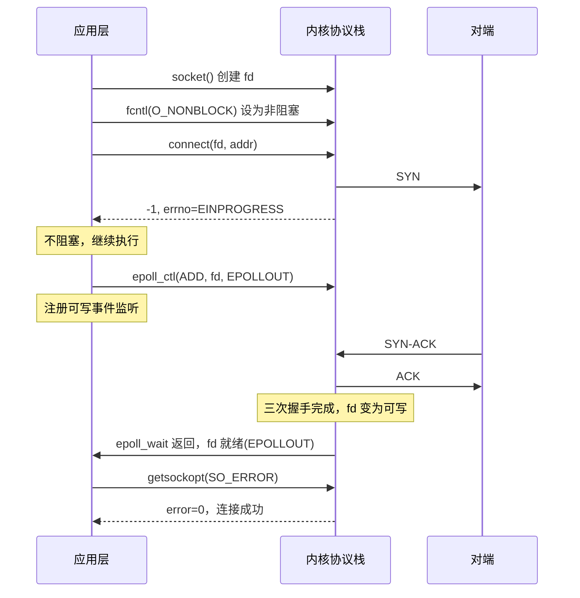

## 一、问题：阻塞 `connect` 为什么不行

`connect` 默认是阻塞的。客户端调用 `connect(fd, addr, len)` 后，内核发起 TCP 三次握手中的第一个 SYN 包，然后**当前线程被挂起**，直到握手完成（收到 SYN-ACK 并发出 ACK）或超时失败。这个过程至少需要一个 RTT，如果对端不可达，可能需要数秒甚至数十秒才返回超时错误。

当需要同时向 100 个目标发起连接时，阻塞 `connect` 只能串行——连完一个再连下一个。100 个连接 × 每个至少 1 RTT = 不可接受的启动延迟。

---

## 二、解决方案：非阻塞 `connect` + I/O 复用

### 2.1 第一步：创建 socket 并设为非阻塞

```c
int fd = socket(AF_INET, SOCK_STREAM, 0);
int flags = fcntl(fd, F_GETFL, 0);
fcntl(fd, F_SETFL, flags | O_NONBLOCK);
```

`O_NONBLOCK` 标志告诉内核：这个 fd 上的所有操作都不要阻塞。如果操作不能立即完成，直接返回 `-1`，并设置 `errno = EAGAIN` 或 `EINPROGRESS`。

### 2.2 第二步：调用 `connect`，预期它会“失败”

```c
struct sockaddr_in addr;
addr.sin_family = AF_INET;
addr.sin_port = htons(80);
inet_pton(AF_INET, "93.184.216.34", &addr.sin_addr);

int ret = connect(fd, (struct sockaddr*)&addr, sizeof(addr));
// ret == -1，errno == EINPROGRESS
```

`connect` 返回 `-1`，`errno` 为 `EINPROGRESS`。这不是错误，而是内核在说：“SYN 包已经发出去了，握手正在进行中，你先去干别的事。”

此时 fd 处于**连接正在建立**的状态。内核在后台完成 TCP 三次握手的剩余步骤。

### 2.3 第三步：将 fd 加入 epoll 的可写事件监听

```c
struct epoll_event ev;
ev.events = EPOLLOUT;  // 监听可写事件！
ev.data.fd = fd;
epoll_ctl(epfd, EPOLL_CTL_ADD, fd, &ev);
```

**关键点**：连接建立完成后，fd 变为**可写**。这是 TCP 协议栈的规定——三次握手完成后，连接就绪，发送缓冲区可用，fd 满足 `EPOLLOUT` 条件。所以非阻塞 `connect` 监听的是**可写事件**，不是可读事件。

### 2.4 第四步：当 fd 变为可写时，检查连接是否真正成功

```c
if (events[i].events & EPOLLOUT) {
    int error = 0;
    socklen_t len = sizeof(error);
    
    // 获取 socket 层面的错误状态
    getsockopt(fd, SOL_SOCKET, SO_ERROR, &error, &len);
    
    if (error == 0) {
        // 连接成功！三次握手完成
        // fd 可以正常读写
    } else {
        // 连接失败
        // error 为具体的 errno（如 ECONNREFUSED、ETIMEDOUT）
        close(fd);
    }
}
```

**为什么需要 `getsockopt(SO_ERROR)`？** 因为 fd 变为可写有两种可能：连接成功（三次握手完成），连接失败（收到 RST 或超时）。两种情况下 fd 都满足 `EPOLLOUT` 条件。`SO_ERROR` 是 socket 层保存的**待处理错误**——连接成功时为 0，失败时为具体错误码。

### 2.5 第五步：恢复阻塞模式或保持非阻塞

```c
// 选项 A：恢复阻塞模式
flags = fcntl(fd, F_GETFL, 0);
fcntl(fd, F_SETFL, flags & ~O_NONBLOCK);

// 选项 B：保持非阻塞，配合 epoll 继续使用
```

恢复阻塞模式适用于传统的“一个连接一个线程”模型。保持非阻塞适用于 epoll 事件驱动模型——这正是你游戏服务器要做的事。

---

## 三、完整代码

```c
int nonblocking_connect(const char* ip, int port, int timeout_ms) {
    // 1. 创建 socket
    int fd = socket(AF_INET, SOCK_STREAM, 0);
    
    // 2. 设为非阻塞
    int flags = fcntl(fd, F_GETFL, 0);
    fcntl(fd, F_SETFL, flags | O_NONBLOCK);
    
    // 3. 发起连接
    struct sockaddr_in addr;
    memset(&addr, 0, sizeof(addr));
    addr.sin_family = AF_INET;
    addr.sin_port = htons(port);
    inet_pton(AF_INET, ip, &addr.sin_addr);
    
    int ret = connect(fd, (struct sockaddr*)&addr, sizeof(addr));
    if (ret == 0) {
        // 连接立即成功（连接 localhost 时可能发生）
        return fd;
    }
    if (errno != EINPROGRESS) {
        // 真正的错误（如目标不可达）
        close(fd);
        return -1;
    }
    
    // 4. 监听可写事件
    struct epoll_event ev;
    ev.events = EPOLLOUT;
    ev.data.fd = fd;
    epoll_ctl(epfd, EPOLL_CTL_ADD, fd, &ev);
    
    // 5. 等待可写或超时
    struct epoll_event events[1];
    int n = epoll_wait(epfd, events, 1, timeout_ms);
    
    if (n == 0) { close(fd); return -1; }  // 超时
    if (n < 0)  { close(fd); return -1; }  // 被信号中断
    
    // 6. 检查连接结果
    int error = 0;
    socklen_t len = sizeof(error);
    getsockopt(fd, SOL_SOCKET, SO_ERROR, &error, &len);
    
    if (error != 0) { close(fd); return -1; }  // 连接失败
    
    // 7. 连接成功
    epoll_ctl(epfd, EPOLL_CTL_DEL, fd, NULL);  // 从 epoll 移除
    
    // 8. 恢复阻塞模式（可选）
    // fcntl(fd, F_SETFL, flags & ~O_NONBLOCK);
    
    return fd;
}
```

---

## 四、时序图



---

## 五、`getsockopt(SO_ERROR)` 的原理

`SO_ERROR` 是 socket 层维护的一个**待处理错误队列**。当异步操作（如非阻塞 `connect`）失败时，内核不直接返回错误（因为 `connect` 已经返回了 `EINPROGRESS`），而是把错误码保存在 socket 的 `SO_ERROR` 字段中。

- 连接成功 → `SO_ERROR = 0`
- 连接被拒绝 → `SO_ERROR = ECONNREFUSED`
- 连接超时 → `SO_ERROR = ETIMEDOUT`
- 网络不可达 → `SO_ERROR = ENETUNREACH`

`getsockopt(fd, SOL_SOCKET, SO_ERROR, &error, &len)` 读取这个字段，读取后内核会将其清零。所以 `SO_ERROR` 只能被读取一次——这和 `select` 的 `fd_set` 是值-结果参数一样，是一次性的。

---

## 六、与 `select`/`poll`/`epoll` 的关联

非阻塞 `connect` 是 I/O 复用机制的自然延伸：

| I/O 复用机制 | 在非阻塞 connect 中的作用 |
|:---|:---|
| `select` | `FD_SET(fd, &write_fds)` → 可写时 `FD_ISSET` 检查 |
| `poll` | `fds[i].events = POLLOUT` → 可写时 `fds[i].revents & POLLOUT` |
| `epoll` | `ev.events = EPOLLOUT` → 就绪时 `events[i].events & EPOLLOUT` |

三种机制都支持监听可写事件，但 `epoll` 的 O(1) 就绪链表在大量并发连接时优势最大——这正是你计划中第 23 份任务要封装 `Epoll` 类的原因。

---

## 七、一句话总结

非阻塞 `connect` 把“等待 TCP 三次握手完成”这个原本阻塞的步骤，拆成了“发起连接 → 注册可写事件 → epoll_wait 等待通知 → getsockopt 确认结果”四个异步阶段。它让单个线程可以同时发起多个连接，不会因为某个对端不可达而阻塞整个启动流程。`EINPROGRESS` 不是错误，是内核承诺“SYN 已经发出”。`EPOLLOUT` 就绪不代表连接成功，必须用 `SO_ERROR` 做最终确认。