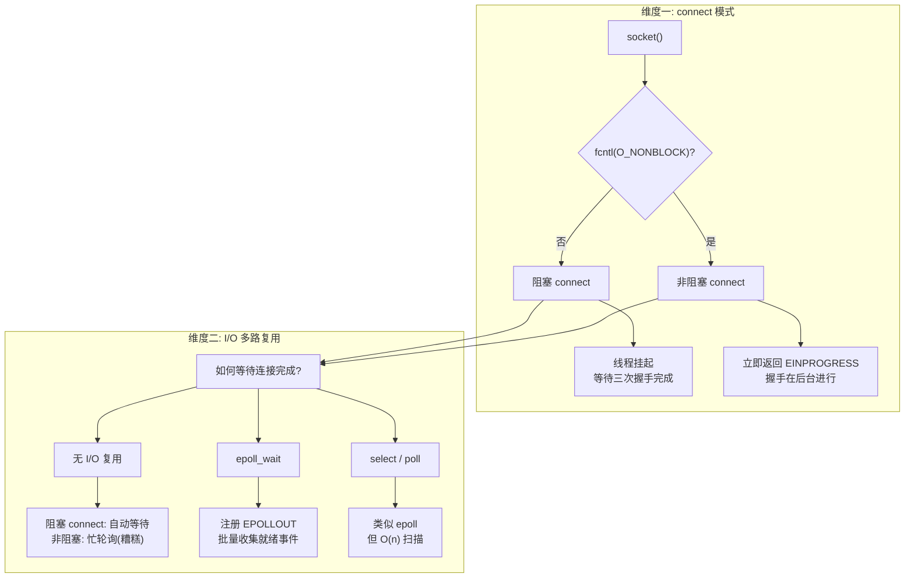
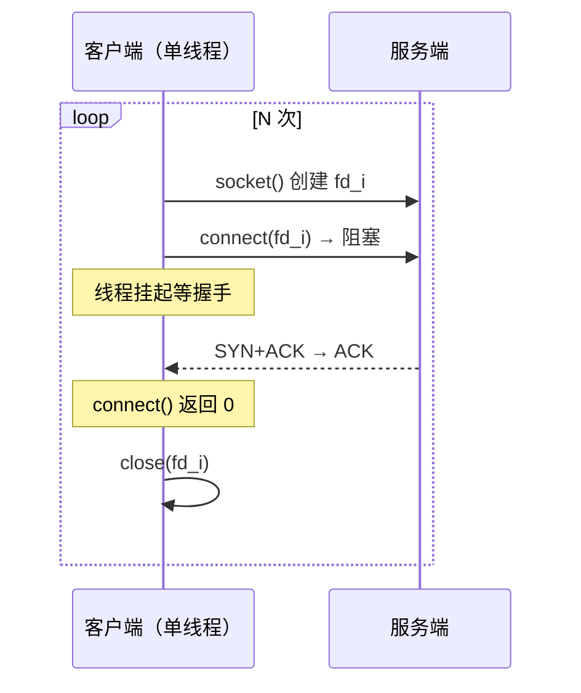
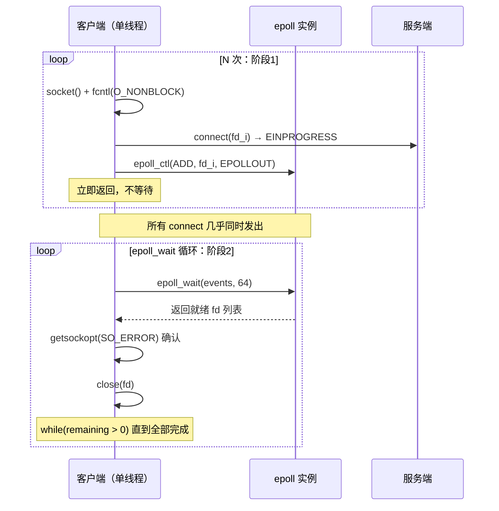
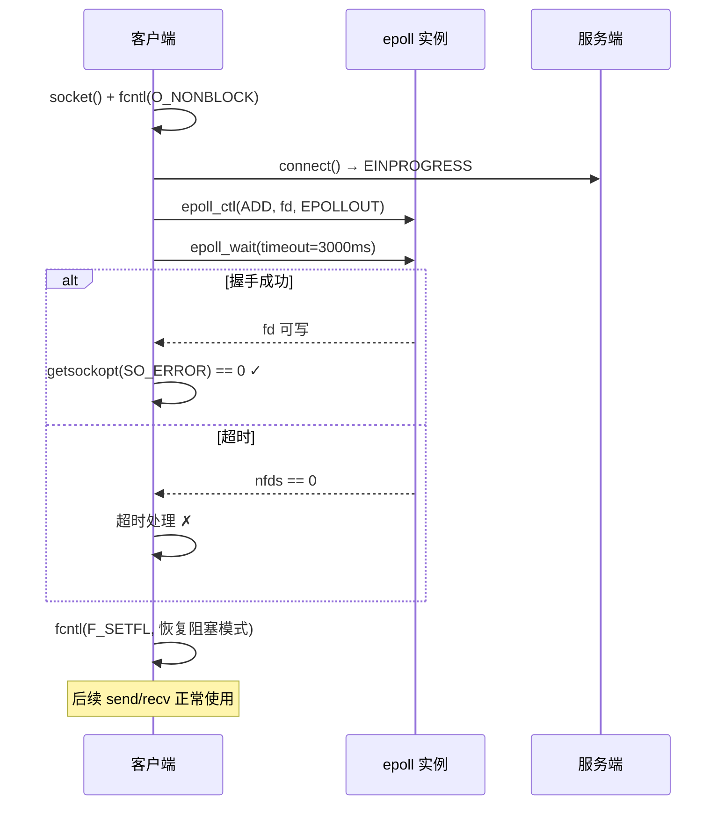
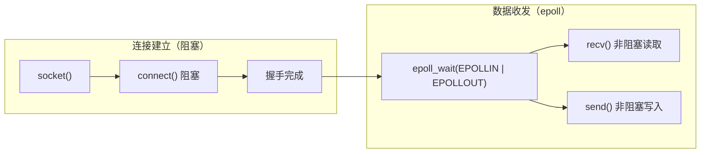
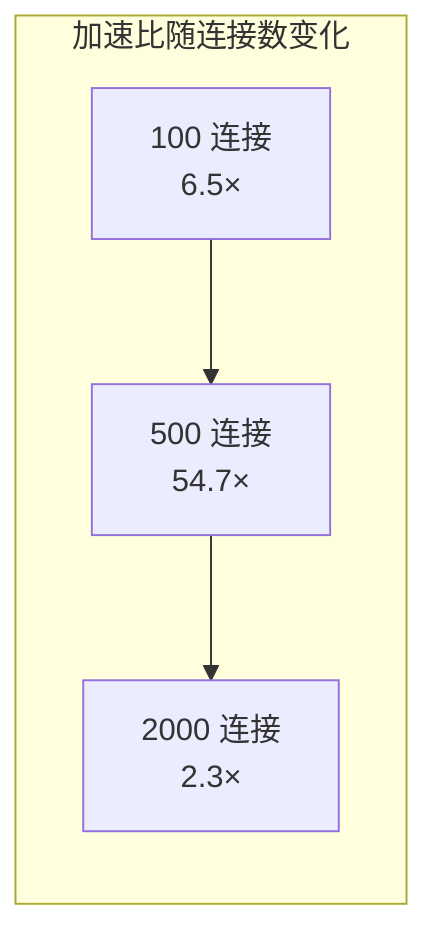
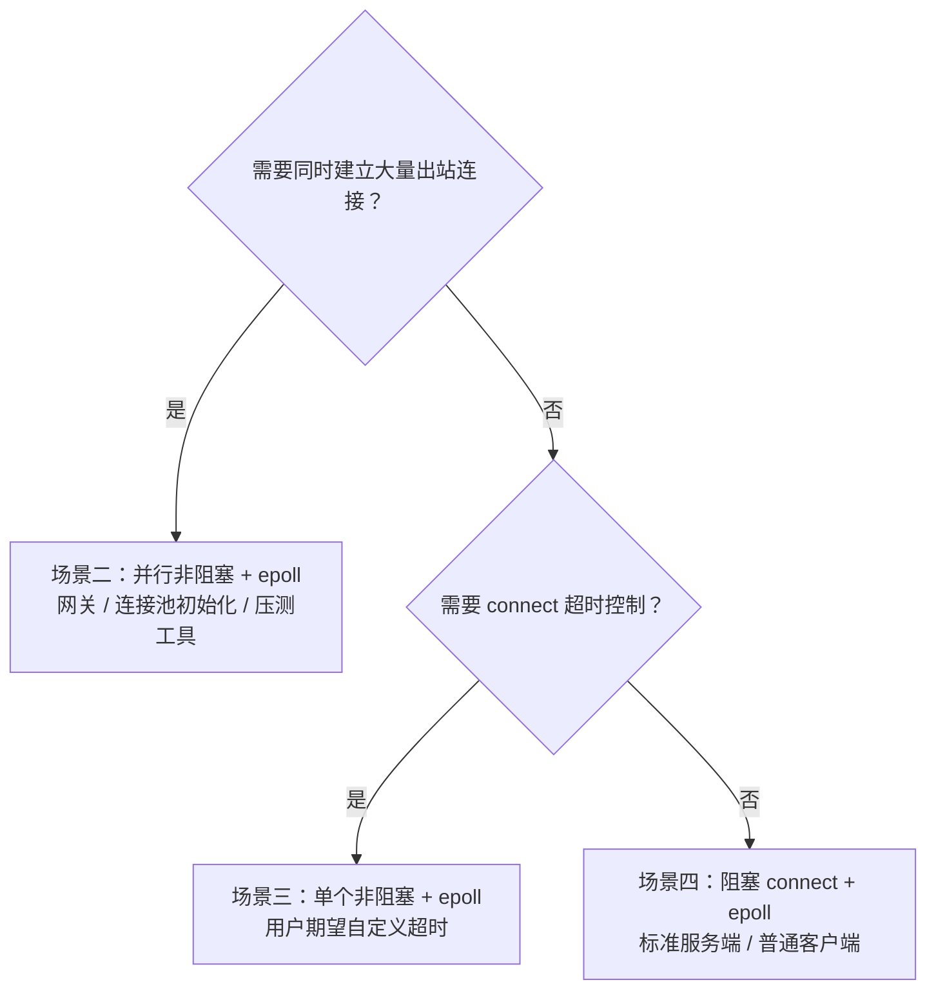

net use Z: \\wsl$\Ubuntu-22.04\root\game-server-engine /persistent:yes
# 非阻塞 connect + epoll 深度分析

## 1. 概述

本文档基于 [[connect-benchmark.cpp]] 和 [[unblocking-connect.cpp]] 的源码与实测数据，分析 TCP 客户端建立连接时的四种策略及其延迟差异。

核心问题：**Connect 是否阻塞 与 是否使用 epoll，是两个正交维度。**

> [!important] 关键结论
> - `connect()` 的阻塞/非阻塞控制的是**握手期间调用线程是否挂起**
> - `epoll` 控制的是**如何等待和收集 I/O 事件**
> - 两者可以自由组合，各有用武之地

## 2. 两个正交维度



> [!note] 维度的独立性
> 游戏服务器的经典模式就是**阻塞 connect + epoll 管理已连接 fd 的读写**——connect 自身是阻塞的，但连接建立后的事件通知用 epoll。
> 这证明两个维度互不绑定。

## 3. 四种场景详解

### 场景一：串行阻塞 connect（基准）



> [!info] 行为
> - 每个 `connect()` 调用阻塞当前线程，直到 TCP 三次握手完成或失败
> - N 个连接严格串行：总耗时 ≈ N × 单次 RTT
> - 单次延迟最低（没有 epoll 调度开销），但总吞吐最差

**对应源码：** [[connect-benchmark.cpp#^blocking-bench|bench_blocking_connect()]]

### 场景二：并行非阻塞 connect + epoll



> [!info] 行为
> - N 个 `connect()` 几乎同时发出，全部返回 `EINPROGRESS`
> - 注册到 epoll 后，`epoll_wait` 循环批量收集完成事件
> - 总耗时 ≈ max(单次 RTT) + epoll 调度开销
> - 单次延迟**看起来**更高（包含了在 epoll 队列中的等待时间），但总耗时碾压阻塞模式

**对应源码：** [[connect-benchmark.cpp#^nonblocking-bench|bench_nonblocking_connect()]]

> [!warning] 为什么单次延迟"变大"了？
> 非阻塞模式下测量的是 `connect()` 发起到 `epoll_wait` 返回的时间。对于第 450 个被收集的连接（假设 500 个连接、events[64]），它的完成事件在内核中排队等待了前 7 轮 `epoll_wait`。所以**单个延迟的上升是批处理效应，不是真实的网络延迟增加**。

### 场景三：单个非阻塞 connect + epoll（超时控制）



> [!info] 行为
> - 只建立一个连接，但可以设置**超时时间**
> - 这是阻塞 connect 做不到的——阻塞模式下超时由系统默认（通常数十秒）
> - 建立后恢复阻塞模式，不影响后续 send/recv 的语义

**对应源码：** [[unblocking-connect.cpp|unblocking_connect.cpp]]

> [!tip] 这是非阻塞 connect 最实用的场景
> 大多数客户端只需要连一个服务器。非阻塞 connect 的核心价值不是并行吞吐，而是**超时控制**——用户等 3 秒比等 75 秒好得多。

### 场景四：阻塞 connect + epoll 仅用于后续 I/O（game_server 模式）



> [!info] 行为
> - connect 本身是**阻塞**的（不使用 `O_NONBLOCK`）
> - 连接建立后，用 epoll 监听已连接 fd 的 `EPOLLIN | EPOLLOUT`
> - 这是 **nginx / Redis / game_server** 的标准模型
> - 优点：connect 阶段简单可靠，读写阶段高性能事件驱动

**对应源码：** [[game_server.hpp|game_server.hpp]] 中的 `EventLoop`

> [!success] 为什么这是最常见的生产模式？
> - 服务端 outbound 连接少（通常只连上游几个服务），阻塞 connect 的开销可忽略
> - 读写路径才是性能瓶颈——epoll 在这里发力
> - 代码更简单：不需要处理 `EINPROGRESS` / `getsockopt(SO_ERROR)` 的分支

## 4. Benchmark 实测数据

### 测试环境

| 项目 | 值 |
|------|-----|
| OS | Linux 6.6 (WSL2) |
| CPU | — |
| 服务端 | [[game_server.hpp|game_server]] (4 workers, epoll 驱动) |
| 客户端 | [[connect-benchmark.cpp|connect_bench]] |
| 网络 | 127.0.0.1 (loopback) |

### 延迟对比表

#### 100 个连接

| 指标 | 阻塞（串行） | 非阻塞 + epoll（并行） |
|------|-------------|---------------------|
| **总耗时** | 26 ms | **4 ms** |
| **加速比** | 1× | **6.5×** |
| 单次 avg | 243 μs | 2419 μs |
| 单次 P50 | 240 μs | 2297 μs |
| 单次 P99 | 550 μs | 3766 μs |

#### 500 个连接

| 指标 | 阻塞（串行） | 非阻塞 + epoll（并行） |
|------|-------------|---------------------|
| **总耗时** | 1148 ms | **21 ms** |
| **加速比** | 1× | **54.7×** |
| 单次 avg | 2277 μs | 10335 μs |
| 单次 P50 | 218 μs | 10173 μs |
| 单次 P99 | 328 μs | 15989 μs |

#### 2000 个连接

| 指标 | 阻塞（串行） | 非阻塞 + epoll（并行） |
|------|-------------|---------------------|
| **总耗时** | 2504 ms | **1089 ms** |
| **加速比** | 1× | **2.3×** |
| 单次 avg | 1232 μs | 177982 μs |
| 单次 P50 | 202 μs | 54831 μs |
| 单次 P99 | 315 μs | 1033361 μs |

### 趋势分析



> [!warning] 2000 连接时加速比下降的原因
> 非阻塞模式在 $N$ 很大时遇到两个瓶颈：
> 1. **epoll 批处理开销**：`events[64]` 需要 $\lceil 2000/64 \rceil = 32$ 轮 `epoll_wait`，后面的连接在队列中等待
> 2. **内核 backlog 限制**：$2000$ 个 SYN 同时到达，超出 listen backlog 的部分被丢弃
>
> 增大 `events[]` 数组和系统 `net.core.somaxconn` 可以缓解。

## 5. 核心源码解析
cmd /c mklink /D "F:\wsl-code" "\\wsl$\Ubuntu-22.04\root\game-server-engine"

### 5.1 非阻塞 connect 的核心流程

从 [[unblocking-connect.cpp|unblocking_connect.cpp]] 提取的关键路径：

```cpp
// 第 1 步：创建 socket + 显式设置非阻塞
int fd = socket(AF_INET, SOCK_STREAM, 0);
int flags = fcntl(fd, F_GETFL, 0);
fcntl(fd, F_SETFL, flags | O_NONBLOCK);  // 推荐：显式 fcntl，语义清晰

// 第 2 步：发起非阻塞 connect
int ret = connect(fd, (sockaddr*)&addr, sizeof(addr));
if (ret == 0) {
    // 意外情况：localhost 有时瞬间完成
}
if (errno != EINPROGRESS) {
    // 真错误：端口不可达等
}
// errno == EINPROGRESS → 握手已发起，后台进行

// 第 3 步：epoll 等待连接完成
int epfd = epoll_create1(EPOLL_CLOEXEC);
epoll_event ev{};
ev.events = EPOLLOUT;  // connect 完成 = 可写
ev.data.fd = fd;
epoll_ctl(epfd, EPOLL_CTL_ADD, fd, &ev);

// 第 4 步：等待事件 + SO_ERROR 最终判决
epoll_event events[1];
int nfds = epoll_wait(epfd, events, 1, timeout_ms);
if (nfds > 0) {
    int error = 0;
    socklen_t len = sizeof(error);
    getsockopt(fd, SOL_SOCKET, SO_ERROR, &error, &len);
    // error == 0  → 握手成功 ✓
    // error != 0  → 失败，具体原因见 errno 值
}
```

> [!warning] SO_ERROR 是不可替代的
> 不能用 `events[i].events & EPOLLERR` 判断连接是否失败：
> - 连接成功：`EPOLLOUT` 触发
> - 连接失败：`EPOLLOUT + EPOLLERR` 同时触发（fd 仍然"可写"以容纳错误码）
>
> 所以 `getsockopt(SO_ERROR)` 是**唯一可靠的最终判决方式**。

### 5.2 并行 epoll 的 while 循环

从 [[connect-benchmark.cpp#^nonblocking-bench|bench_nonblocking_connect()]] 提取：

```cpp
size_t remaining = conns.size();
while (remaining > 0) {
    epoll_event events[64];
    int nfds = epoll_wait(epfd, events, 64, timeout_ms);
    //          ↑ 一次最多返回 64 个就绪 fd

    if (nfds == 0) { /* 超时 */ break; }
    if (nfds < 0 && errno == EINTR) { continue; }

    for (int i = 0; i < nfds; ++i) {
        int fd = events[i].data.fd;
        --remaining;

        int error = 0;
        socklen_t len = sizeof(error);
        getsockopt(fd, SOL_SOCKET, SO_ERROR, &error, &len);
        // 处理结果...
        close(fd);
    }
}
```

> [!question] 为什么需要 while 循环？
> `epoll_wait(epfd, events, 64, timeout_ms)` 一次最多把 64 个就绪事件填入 `events[64]`。
> 如果 500 个连接同时完成，内核把它们都标记为就绪，但你一次只能取 64 个。
> `while (remaining > 0)` 循环确保"取一批 → 处理 → 再取下一批"，直到全部处理完。

### 5.3 阻塞 connect + epoll 读写（game_server 模型）

```
socket() → connect() [阻塞] → 连接建立
    ↓
epoll_ctl(epfd, ADD, fd, EPOLLIN | EPOLLOUT)
    ↓
while (true) {
    epoll_wait(epfd, events, ...)
    for each ready fd {
        recv() / send() 非阻塞 I/O
    }
}
```

connect 是阻塞的，但**绝不意味着后续的 recv/send 也必须阻塞**。epoll 接管的是已连接 fd 的读写事件。

## 6. 关键认知总结

### 6.1 维度对照表

| | 阻塞 connect | 非阻塞 connect |
|---|---|---|
| **无 I/O 复用** | 线程挂起，等握手完成（默认行为） | 需要忙轮询 `getsockopt()`（不可用） |
| **epoll** | connect 时不用 epoll；握手后用 epoll 读写（game_server） | connect 时用 epoll 等 `EPOLLOUT`；读写同样用 epoll |
| **select/poll** | 同上，用 select 替代 epoll 的位置 | 同上，select 替代 epoll |

### 6.2 适用场景决策树



> [!tip] 决策原则
> - **客户端连一个服务器**：用阻塞 connect 就够（或者非阻塞只为了超时）
> - **网关/代理连 N 个后端**：非阻塞 + epoll 并行
> - **服务端**：阻塞 connect（如果有出站） + epoll 管理已连接 fd
> - **压测工具**：非阻塞 + epoll 并行

### 6.3 常见误解澄清

> [!bug] 误解："epoll 只能和非阻塞 socket 搭配"
> **不对。** 阻塞 socket 也可以注册到 epoll。只是阻塞 socket 在 `recv()`/`send()` 时仍可能阻塞线程——epoll 只负责通知"fd 就绪"，不管你怎么读。

> [!bug] 误解："非阻塞 connect 总是比阻塞快"
> **不对。** 单次非阻塞 connect 的延迟**看起来更高**（多了 epoll 调度开销）。非阻塞的优势在于并行消除串行等待——N 个连接的总时间从 $N \times RTT$ 降到约 $1 \times RTT$。

> [!bug] 误解："epoll 的 events 可以无限制返回"
> **不对。** `epoll_wait(epfd, events, 64, timeout)` 单次最多返回 64 个事件。如果有更多就绪 fd，需要 while 循环继续取。这就是 [[#5.2 并行 epoll 的 while 循环|§5.2]] 讨论的问题。


---

> [!quote] 一句话总结
> **Connect 的阻塞性控制线程行为，epoll 控制事件收集方式。** 两个维度正交，选择取决于你的连接数量和超时需求。大多数时候阻塞 connect + epoll 读写就够了；批量连接时非阻塞 + epoll 并行是正确答案。
