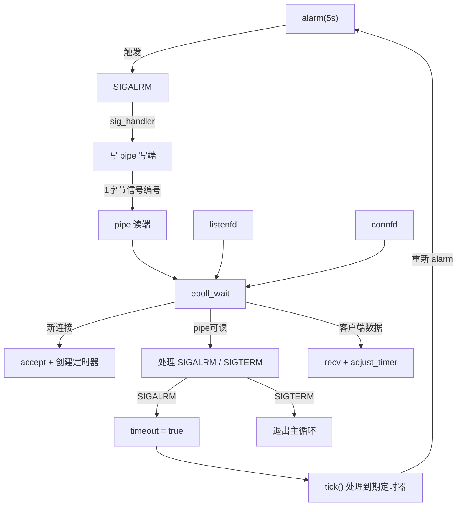

# 基于升序链表的定时器服务器

> [!NOTE]
> 来源：《Linux高性能服务器编程》第11章 — 定时器
> 核心思想：**epoll + SIGALRM + 升序双向链表**，实现非活动连接的自动超时关闭

---

## 整体架构



---

## 核心设计：统一事件源

### 问题

| 机制      | 处理方式                    | 限制                       |
| --------- | --------------------------- | -------------------------- |
| **epoll** | `epoll_wait` 返回后统一处理 | ✅ 安全，可调用任意函数     |
| **信号**  | 异步中断，进入信号处理函数  | ❌ 只能调用异步信号安全函数 |

> [!WARNING]
> 直接在信号处理函数里操作定时器链表，可能与主循环并发访问，产生**竞态条件**。

### 解决方案：信号 → 管道 → epoll

```cpp
// 1. 创建管道，读端加入 epoll
socketpair(PF_UNIX, SOCK_STREAM, 0, pipefd);
addfd(epollfd, pipefd 0]);

// 2. 信号处理函数：只做一件事——把信号编号写入管道
void sig_handler(int sig) {
    int save_errno = errno;
    send(pipefd[1], (char*)&sig, 1, 0);   // 写 1 字节：信号编号
    errno = save_errno;
}
```

**效果**：信号触发后 → 写入管道 → epoll 检测到 `pipefd[0]` 可读 → 主循环读出信号编号 → 在安全时机串行处理，**无需加锁**。

---

## 数据结构

### `client_data` — 每个连接的运行时状态

```cpp
struct client_data {
    sockaddr_in address;     // 客户端地址
    int         sockfd;      // 连接的文件描述符
    char        buf[64];     // 接收缓冲区
    util_timer* timer;       // 关联的定时器指针
};
```

服务器预分配数组 `client_data* users = new client_data[65535]`，**用 fd 值直接索引**（O(1) 访问）。

### `util_timer` — 定时器节点

```cpp
class util_timer {
    time_t       expire;                 // 到期绝对时间（秒）
    void       (*cb_func)(client_data*); // 到期时的回调函数
    client_data* user_data;              // 回调函数的参数
    util_timer*  prev;                   // 前驱指针
    util_timer*  next;                   // 后继指针
};
```

### `sort_timer_lst` — 升序双向链表

```text
head ──→ [T1: 10s] ──→ [T2: 15s] ──→ [T3: 22s] ──→ NULL
NULL ←── [T1]      ←── [T2]      ←── [T3]      ←── tail
```

> [!TIP]
> **为什么用升序？** `tick()` 从 head 开始遍历，遇到第一个未到期的就 `break`，无需遍历整条链表。

---

## 关键操作

### `add_timer` — 插入定时器

| 条件                    | 操作                                                         |
| ----------------------- | ------------------------------------------------------------ |
| 链表为空                | 直接作为 head 和 tail                                        |
| `expire < head->expire` | 插入头部，成为新 head                                        |
| 其他                    | 从头遍历，找到第一个 `expire` 更大的节点，插入其前面；若找不到则插入尾部 |

### `adjust_timer` — 续期（只处理超时延长）

| 条件                        | 操作                                   |
| --------------------------- | -------------------------------------- |
| 新 expire 仍 < next->expire | 位置不变，直接返回                     |
| 是 head                     | 从链表摘下，重新插入 head 之后的子链表 |
| 不是 head                   | 从链表摘下，插入 next 之后的子链表     |

> [!NOTE]
> 只在「收到数据」时续期，超时时间只会变大不会变小，因此只需往尾部移动。

### `del_timer` — 删除定时器

| 节点位置 | 操作                              |
| -------- | --------------------------------- |
| 唯一节点 | `delete`，head = tail = NULL      |
| head     | head = head->next，delete 原 head |
| tail     | tail = tail->prev，delete 原 tail |
| 中间     | 前后节点互连，delete              |

### `tick()` — 处理到期任务

```cpp
void tick() {
    time_t cur = time(NULL);
    util_timer* tmp = head;
    while (tmp) {
        if (cur < tmp->expire) break;     // 升序保证：后面都不用看了
        tmp->cb_func(tmp->user_data);     // 执行回调（关闭连接）
        head = tmp->next;                 // 推进 head
        delete tmp;
        tmp = head;
    }
}
```

---

## 主循环流程

### 初始化

```text
① socket → bind → listen
② epoll_create → addfd(listenfd)
③ socketpair → addfd(pipefd[0])
④ addsig(SIGALRM) + addsig(SIGTERM)
⑤ alarm(TIMESLOT)     // 启动第一次 5 秒定时
⑥ new client_data[65535]
```

### 事件分发

```text
epoll_wait 返回
│
├─ listenfd 可读 ──────────── 新连接
│    accept → addfd → 初始化 users[connfd]
│    → 创建定时器 (expire = now + 15s) → add_timer
│
├─ pipefd[0] 可读 ─────────── 信号
│    recv 读信号编号
│    ├─ SIGALRM → timeout = true
│    └─ SIGTERM → stop_server = true
│
└─ 其他 connfd 可读 ───────── 客户端数据
     recv 读数据
     ├─ ret < 0, errno ≠ EAGAIN → 读错误 → 关闭 + del_timer
     ├─ ret == 0                → 客户端断开 → 关闭 + del_timer
     └─ ret > 0                 → 收到数据 → adjust_timer 续期
```

### 定时任务处理

```cpp
// 所有 I/O 事件处理完之后，才处理定时事件
if (timeout) {
    timer_handler();   // tick() + alarm(5)
    timeout = false;
}
```

> [!IMPORTANT]
> **为什么延迟处理？** I/O 事件优先级高于定时事件。先处理完所有 I/O 再处理超时，避免大量事件时定时器处理阻塞新连接。
>
> **代价**：定时任务不能精确按预期时间执行（可能稍有延迟）。

---

## 超时时间

```cpp
#define TIMESLOT 5                     // alarm 每 5 秒触发一次
timer->expire = cur + 3 * TIMESLOT;    // = now + 15 秒
```

**含义**：连接 15 秒内无数据交互 → 服务器自动关闭。

**为什么 3×TIMESLOT？** 5 秒触发一次 tick()，15 秒窗口给客户端足够的活动时间，同时避免资源长期占用。

---

## 信号处理细节

```cpp
void addsig(int sig) {
    struct sigaction sa;
    memset(&sa, '\0', sizeof(sa));
    sa.sa_handler = sig_handler;   // 设置处理函数
    sa.sa_flags |= SA_RESTART;     // 被中断的系统调用自动重启
    sigfillset(&sa.sa_mask);       // 执行期间屏蔽所有信号
}
```

| 标志         | 作用                                                        |
| ------------ | ----------------------------------------------------------- |
| `SA_RESTART` | `epoll_wait` 被信号中断后自动重新调用，代码只需跳过 `EINTR` |
| `sigfillset` | 信号处理函数执行期间屏蔽所有信号，防止嵌套信号导致混乱      |

---

## ET 模式注意事项

```cpp
event.events = EPOLLIN | EPOLLET;   // ET 模式 + 非阻塞
```

> [!CAUTION]
> 当前代码对 ET 模式处理**不完整**：收到 `EPOLLIN` 后只调用一次 `recv()`，若一次读不完则剩余数据不再触发事件。
>
> 生产环境应在 `recv()` 返回 `EAGAIN` 之前**循环读取**。此处作为教学演示简化处理。

---

## 运行方式

### 编译

```bash
cmake -S /workspace -B /workspace/build
cmake --build /workspace/build --target main_scheduled
cmake --build /workspace/build --target schedule_client
```

### 启动

```bash
# 服务器
/workspace/build/main_scheduled 0.0.0.0 9003

# 客户端（单次模式）
/workspace/build/schedule_client 127.0.0.1 9003

# 客户端（交互模式 — 演示超时断开）
/workspace/build/schedule_client 127.0.0.1 9003 --interactive
```

### 观察超时效果

1. 启动服务器
2. 启动交互模式客户端，发几条消息
3. **停止输入，等待约 15 秒**
4. 服务器打印 `close fd X`，客户端检测到连接关闭后退出

---

## 文件结构

```text
src/study/net/schedule/
├── linked_scheduled.hpp   # 定时器链表 (util_timer + sort_timer_lst)
├── main_scheduled.cpp     # 服务器主程序 (epoll + 信号 + 定时器)
├── schedule_client.cpp    # 配套客户端 (演示超时断开)
└── README.md              # 本文档
```

---

## 常见面试题

### Q1：为什么用绝对时间而不是相对时间存储 expire？
用相对时间每次 `tick()` 都要给所有节点减 5 秒（O(n)）。用绝对时间只需比较 `cur < expire`，遇到未到期的立即 break。

### Q2：为什么不直接在信号处理函数里调用 tick()？
信号处理函数可能中断正在操作链表的主循环，产生竞态条件。通过管道传递信号，让主循环在安全时机串行处理，避免并发问题。

### Q3：1000 个连接同时超时，tick() 会一次性全处理吗？
会。`tick()` 循环遍历直到遇到未到期节点，期间不调用 `epoll_wait`，可能导致新事件处理延迟。生产环境通常限制单次 tick 处理数量。

### Q4：为什么 adjust_timer 只处理超时延长？
本服务器只在「收到数据」时续期，超时时间只会变大。若要支持缩短超时，需补充往链表头部移动的逻辑。
