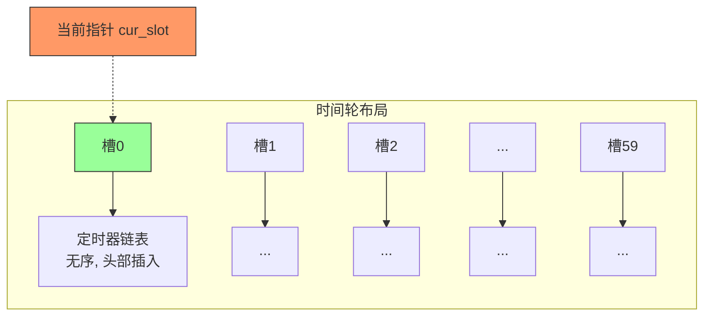
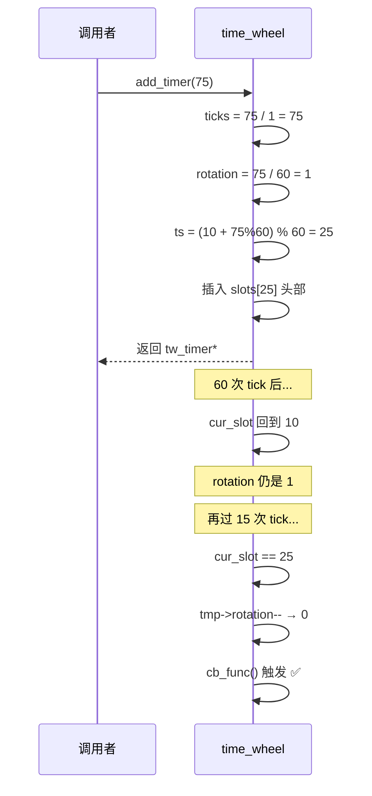
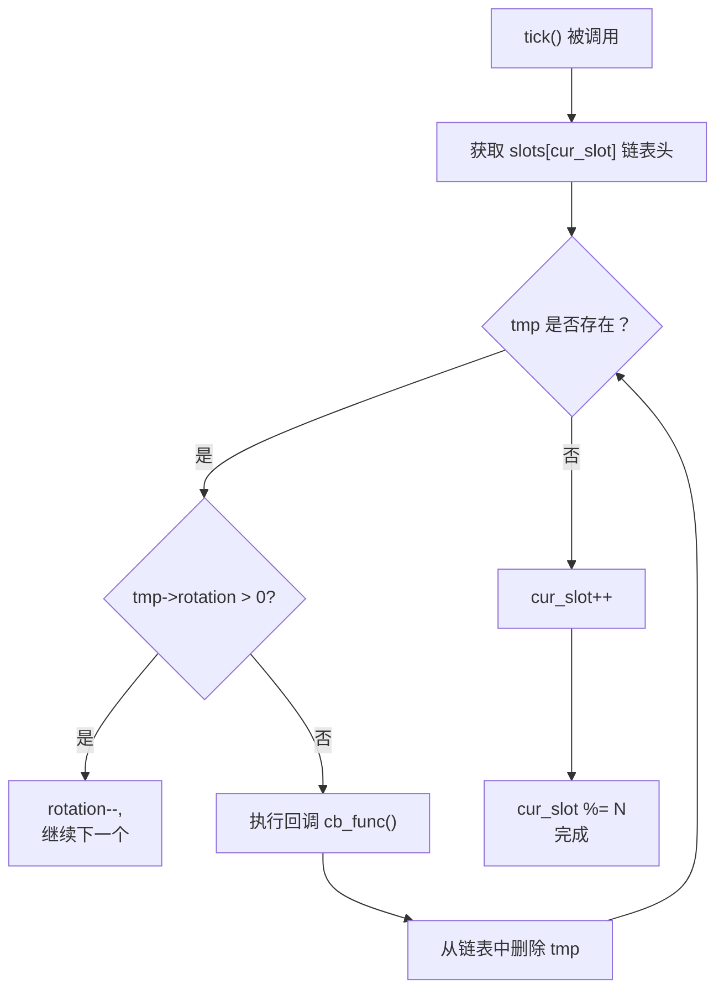
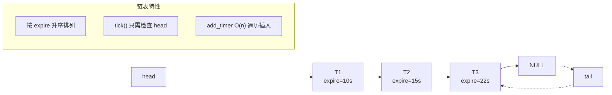
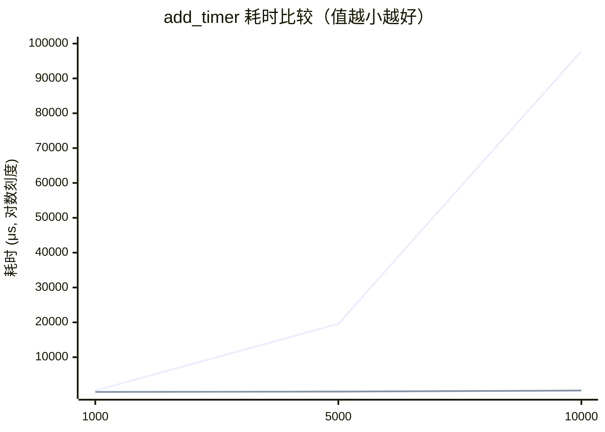

# 定时器实现：时间轮 vs 升序链表

> 基于 `whell_scheduled.hpp` 和 `linked_scheduled.hpp` 的源码领读

---

## 一、时间轮（Time Wheel）源码领读

### 1.1 整体设计

**文件**：`whell_scheduled.hpp`

时间轮的核心思想是**用空间换时间**。它预分配一个固定大小的槽数组（本实现为 60 个槽），每个槽指向一个**无序**的双向链表。新定时器通过 `timeout % N` 哈希到对应槽的链表头部插入（O(1)），每次时钟滴答只需检查当前槽（O(1)）。



```
    槽编号:  0     1     2     3    ...   59
            ┌─────┬─────┬─────┬─────┬─────┬─────┐
    slots:  │ ●──→│ ●──→│     │ ●──→│     │     │
            └─│───└─────└─────└─│───└─────└─────┘
              │                  │
              ▼                  ▼
           ┌─────┐           ┌─────┐
           │ T1  │           │ T5  │
           ├─────┤           ├─────┤
           │ T2  │           │ T6  │
           └─────┘           └─────┘
           
    cur_slot → 0（当前指针指向槽 0）
    SI = 1 秒（每秒转动一个槽）
    N  = 60（转完一圈 = 60 秒）
```

### 1.2 数据结构

#### `tw_timer` —— 定时器节点

```cpp
class tw_timer {
public:
    tw_timer(int rot, int ts)    // rot=圈数, ts=槽位
        : rotation(rot), time_slot(ts), next(NULL), prev(NULL) {}

    int rotation;                // 还需要转多少圈后才触发
    int time_slot;               // 当前挂在哪个槽上
    void (*cb_func)(tw_client_data*);  // 到期回调函数
    tw_client_data* user_data;         // 回调参数
    tw_timer* next;              // 同槽链表前驱
    tw_timer* prev;              // 同槽链表后继
};
```

**`rotation` 是关键**：定时器到期时间 = `(rotation * N + (time_slot - cur_slot)) * SI`。每次 `tick()` 当前槽时，`rotation > 0` 的节点只减少 `rotation`，不触发回调。

#### `tw_client_data` —— 用户数据

```cpp
struct tw_client_data {
    sockaddr_in address;   // 客户端地址
    int sockfd;            // 连接 fd
    char buf[64];          // 接收缓冲区
    tw_timer* timer;       // 关联的定时器
};
```

#### `time_wheel` —— 时间轮本体

```cpp
class time_wheel {
private:
    static const int N = 60;   // 60 个槽
    static const int SI = 1;   // 槽间隔 1 秒
    tw_timer* slots[N];        // 槽数组，每个元素指向链表头
    int cur_slot;              // 当前指针位置
public:
    tw_timer* add_timer(int timeout);  // O(1) 添加
    void del_timer(tw_timer* timer);   // O(1) 删除
    void tick();                        // O(1) 滴答
};
```

### 1.3 `add_timer` —— 添加定时器（O(1)）

```cpp
tw_timer* add_timer(int timeout) {
    // Step 1: 计算 ticks（需要多少个滴答）
    int ticks = (timeout < SI) ? 1 : (timeout / SI);

    // Step 2: 计算圈数和槽位
    int rotation = ticks / N;             // 转多少圈后触发
    int ts = (cur_slot + (ticks % N)) % N; // 落在哪个槽

    // Step 3: 创建节点，头插法放入 slots[ts]
    tw_timer* timer = new tw_timer(rotation, ts);
    if (!slots[ts]) {
        slots[ts] = timer;
    } else {
        timer->next = slots[ts];    // 头插
        slots[ts]->prev = timer;
        slots[ts] = timer;
    }
    return timer;
}
```

**示例**：当前 `cur_slot = 10`，设置 75 秒超时

```text
ticks    = 75                      # 需要 75 次滴答
rotation = 75 / 60 = 1            # 先转 1 整圈（60秒）
ts       = (10 + 75 % 60) % 60    # 再转 15 个槽
         = (10 + 15) % 60 = 25    # 最终挂在槽 25

时间轮运行过程：
  当前: cur_slot=10, rotation=1, 挂在槽25
  经过 50 次 tick: cur_slot=0,  rotation依然为1（还没到槽25）
  经过 55 次 tick: cur_slot=5,  依然是 rotation=1
  经过 60 次 tick: cur_slot=10, 依然是 rotation=1（第一圈结束）
  经过 65 次 tick: cur_slot=15
  经过 70 次 tick: cur_slot=20
  经过 75 次 tick: cur_slot=25 → rotation减为0 → 触发回调 ✅
```



### 1.4 `tick` —— 时钟滴答（O(1)）

```cpp
void tick() {
    tw_timer* tmp = slots[cur_slot];
    while (tmp) {
        if (tmp->rotation > 0) {    // 还没到，圈数减 1
            tmp->rotation--;
            tmp = tmp->next;
        } else {                     // 到期了！
            tmp->cb_func(tmp->user_data);
            // 从链表中摘除并删除
            if (tmp == slots[cur_slot]) {
                slots[cur_slot] = tmp->next;
                delete tmp;
                if (slots[cur_slot]) slots[cur_slot]->prev = NULL;
                tmp = slots[cur_slot];
            } else {
                tmp->prev->next = tmp->next;
                if (tmp->next) tmp->next->prev = tmp->prev;
                tw_timer* tmp2 = tmp->next;
                delete tmp;
                tmp = tmp2;
            }
        }
    }
    cur_slot = (cur_slot + 1) % N;   // 指针前移
}
```



**为什么 tick 只需要看当前槽？**

因为时间轮的槽间隔 `SI = 1秒`，每次 `tick()` 推进一个槽，所以 `cur_slot` 指向的就是「此刻到期的槽」。过去和未来的定时器都不在当前槽，完全不需要检查。

### 1.4.1 问题：回调阻塞 tick

`tick()` 是**同步串行**调用回调的：

```cpp
tmp->cb_func(tmp->user_data);   // ← 回调如果很慢，整个 tick 卡在这里
```

如果回调耗时超过 `SI = 1 秒`，会发生：

```text
时间轴：
  T=0s    alarm(1) → 第 1 次 tick()
            ├── cb_func 耗时 1.5s  ← 😱
  T=1s    SIGALRM 触发 → 信号写入 pipe（但主循环还在 tick() 里）
  T=1.5s  tick() 结束 → cur_slot+1 → alarm(1) 重新定时
  T=2.5s  第 2 次 tick() 开始（晚了 0.5s，漏了一次 tick）
```

**后果**：

- tick 频率变慢 → 所有定时器的到期时间整体偏移
- 漏掉的 tick 导致 `cur_slot` 推进延迟 → 本应到期的定时器晚触发
- 如果每次回调都慢，问题会**持续积累**

### 1.4.2 解决方案

#### 方案一：分离回调到线程池（推荐）

```cpp
void tick() {
    std::vector<tw_timer*> expired;
    while (tmp) {
        if (tmp->rotation == 0) {
            expired.push_back(tmp);     // 只记账，不执行
        } else {
            tmp->rotation--;
            tmp = tmp->next;
        }
    }
    cur_slot = (cur_slot + 1) % N;

    // 回调统一投递到线程池，不阻塞 tick
    for (auto* t : expired) {
        thread_pool.post([=] { t->cb_func(t->user_data); });
    }
}
```

这样 tick 只做「判断 + 摘除」，微秒级完成。回调在另外的线程并发执行，多久都不影响时间轮精度。

#### 方案二：限制单次 tick 处理数量

```cpp
void tick() {
    int processed = 0;
    const int MAX_PER_TICK = 100;
    while (tmp && processed < MAX_PER_TICK) {
        // ... 最多处理 100 个就退出 ...
        processed++;
    }
    // 剩下的等下次 tick
}
```

防止某一槽链表特别长时 tick 卡死。适用于回调很快但数量多的场景。

#### 方案三：先 re-alarm 再 tick

```cpp
void timer_handler() {
    alarm(1);    // 先设定下一次 alarm，再处理当前 tick
    tw.tick();   // 就算 tick 慢了，下一轮 alarm 还是按时触发
}
```

但 `alarm` 是串行的——上一次未触发的 `alarm` 会被下一次覆盖。如果 `tick()` 超过了 1 秒，在它结束之前的 `SIGALRM` 信号虽然被 `sig_handler` 写入了 pipe，但会被 `epoll_wait` 在下一次循环中处理。所以这个方案只是**缓解**，不能彻底解决。

### 1.5 `del_timer` —— 删除定时器（O(1)）

```cpp
void del_timer(tw_timer* timer) {
    int ts = timer->time_slot;
    if (timer == slots[ts]) {
        slots[ts] = slots[ts]->next;  // 删除头节点
        if (slots[ts]) slots[ts]->prev = NULL;
        delete timer;
    } else {
        timer->prev->next = timer->next;  // 非头节点，前后互连
        if (timer->next) timer->next->prev = timer->prev;
        delete timer;
    }
}
```

### 1.6 时间轮 vs 链表的调整（续期）操作

升序链表有专门的 `adjust_timer` 方法。时间轮**没有**——因为用 `del + add` 代替，两者都是 O(1)，组合还是 O(1)。

```cpp
// 时间轮的续期（time_wheel_server.cpp:190-195）
if (timer) {
    tw.del_timer(timer);
    timer = tw.add_timer(15);          // 新建 15 秒定时器
    timer->user_data = &users[sockfd];
    timer->cb_func = cb_func;
    users[sockfd].timer = timer;
}
```

---

## 二、升序链表（Sorted Linked List）源码领读

### 2.1 整体设计

**文件**：`linked_scheduled.hpp`



### 2.2 数据结构对比

| 角色 | 升序链表 | 时间轮 |
| --- | --- | --- |
| 定时器节点 | `util_timer`（expire 为绝对时间） | `tw_timer`（rotation + time_slot） |
| 容器 | `sort_timer_lst`（head + tail） | `time_wheel`（60 个槽数组） |
| 用户数据 | `client_data` | `tw_client_data` |
| 时间表达 | `time_t expire` → 绝对秒数 | `rotation * N + time_slot` → 相对偏移 |

### 2.3 关键操作复杂度

| 操作 | 升序链表 | 时间轮 |
| --- | --- | --- |
| add_timer | O(n) 遍历找插入位置 | O(1) 计算槽位后头插 |
| del_timer | O(1) 已知指针 | O(1) 已知指针 |
| tick | O(k) k=到期数量（只检查 head） | O(k) k=到期数量（只检查当前槽） |
| adjust_timer | O(n) 可能需要移动位置 | 无，用 del+add = O(1) |
| 空间 | O(N) 只存节点 | O(N + 60) 多 60 个槽头指针 |

---

## 三、性能对比

### 3.1 实测数据

在 3 轮取平均的基准测试中：

```text
N = 1000    add_timer: 链表   428.7μs  vs 时间轮   30.3μs  (14x)
N = 5000    add_timer: 链表 19566.7μs  vs 时间轮  126.0μs  (155x)
N = 10000   add_timer: 链表 97852.0μs  vs 时间轮  428.0μs  (229x)

tick 和 del_timer：两者性能相当，均为 O(1)
```



### 3.2 增长趋势分析

```text
升序链表 add_timer 增长曲线：
  N=1000:    428.7μs
  N=5000:  19566.7μs   → 5x N, 45x 耗时  ← O(n²) 特征
  N=10000: 97852.0μs   → 2x N, 5x 耗时    ← 符合 O(n²)

时间轮 add_timer 增长曲线：
  N=1000:     30.3μs
  N=5000:    126.0μs   → 5x N, 4x 耗时    ← 接近 O(1)
  N=10000:   428.0μs   → 2x N, 3x 耗时    ← 接近 O(1)

注：时间轮的微小增长来自 malloc 开销，不是哈希冲突
   （每个 add_timer 都 new 一次 tw_timer）
```

### 3.3 为什么差距这么大？

**升序链表 `add_timer` 的真实复杂度**：

```
每插入一个新定时器，平均需要遍历半个链表
插入第 1 个: 0 次比较
插入第 2 个: 平均 1 次
...
插入第 N 个: 平均 N/2 次
总比较次数 ≈ 1 + 2 + ... + N = O(N²)
```

**时间轮 `add_timer` 的流程**：

```
每次插入都是固定的 3 步：
  ① ticks = 75 / 1 = 75                 → O(1)
  ② rotation = 75 / 60, ts = ... % 60   → O(1)
  ③ slots[ts] 头部插入                    → O(1)
```

---

## 四、如何选择

| 场景 | 推荐方案 | 原因 |
| --- | --- | --- |
| 定时器数量少（< 100） | 升序链表 | 实现简单直观，add_timer 开销可忽略 |
| 高并发服务器（数千连接） | 时间轮 | add_timer O(1)，不会成为瓶颈 |
| 定时器常续期（adjust） | 时间轮 | del+add 都是 O(1) |
| 需要精确到期时间 | 升序链表 | 绝对时间比较，到期立即触发 |
| 定时器超时范围很大（小时级） | 需要更大轮或分层时间轮 | 60 槽时间轮转一圈只有 60s |

### 时间轮的局限性

1. **精度有限**：`SI = 1秒`，无法做到毫秒级超时
2. **时间范围有限**：以 60 槽、1 秒间隔为例，最大超时取决于 `rotation * N`。`rotation` 用 `int` 来算，可以存几十亿——但 `rotation` 太大会浪费 tick 的 O(1) 优势（每次 tick 都要给所有待在当前槽但没到期的节点做 `rotation--`）
3. **槽内链表无序**：同一槽内的定时器到期时间可能相差数十秒，但 `tick()` 无法区分，只能全部遍历
4. **不适合单次大量短超时定时器**：如果大量定时器集中在少数几个槽，这些槽的链表会很长，`tick()` 的 O(1) 退化为 O(k)

---

## 五、代码阅读路线

### 阅读顺序

```text
时间轮实现：          升序链表实现：
─────────────────     ─────────────────
whell_scheduled.hpp    linked_scheduled.hpp
  ├── tw_timer              ├── util_timer
  ├── tw_client_data        ├── client_data
  └── time_wheel            └── sort_timer_lst
      ├── add_timer()           ├── add_timer()
      ├── del_timer()           ├── adjust_timer()
      └── tick()                ├── del_timer()
                                 └── tick()
```

### 配套文件

| 文件 | 作用 |
| --- | --- |
| `whell_scheduled.hpp` | 时间轮实现（纯头文件） |
| `linked_scheduled.hpp` | 升序链表实现（纯头文件） |
| `time_wheel_server.cpp` | 时间轮服务器（epoll + 信号 + 时间轮） |
| `linked_scheduled_server.cpp` | 升序链表服务器（epoll + 信号 + 链表） |
| `benchmark.cpp` | 性能对比基准测试 |

---

## 六、运行方式

### 编译

```bash
cmake -S /workspace -B /workspace/build
cmake --build /workspace/build
```

### 运行基准测试

```bash
/workspace/build/benchmark
```

### 运行服务器

```bash
# 时间轮服务器（端口 9004）
/workspace/build/time_wheel_server 0.0.0.0 9004

# 升序链表服务器（端口 9003）
/workspace/build/linked_scheduled_server 0.0.0.0 9003

# 客户端通用（两种服务器都能连）
/workspace/build/linked_scheduled_client 127.0.0.1 9004
/workspace/build/linked_scheduled_client 127.0.0.1 9004 --interactive
```
