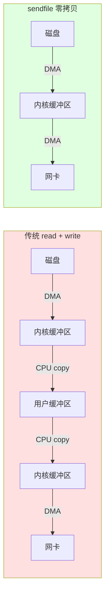

# sendfile 零拷贝文件传输 — 源码分析

## 概述

一个极简的 TCP 文件传输服务器：监听端口 → 接受一个连接 → 用 `sendfile()` 把硬盘文件直接发给客户端 → 退出。

核心价值：**零拷贝**（zero-copy）—— 数据从磁盘到网卡全程在内核空间流动，不经过用户态内存。

---

## 代码总览

```cpp
open(file)  →  fstat() 获取大小
     ↓
bind + listen + accept (等一个客户端)
     ↓
sendfile(connfd, filefd, NULL, stat_buf.st_size)
     ↓
close(connfd) + close(sock)
```

**单连接、一发即退**，不是通用服务器，是 `sendfile` 的**最小可运行演示**。

---

## 分段详解

### 1. 打开文件

```cpp
int filefd = open(file_name, O_RDONLY);
assert(filefd > 0);
struct stat stat_buf;
fstat(filefd, &stat_buf);
```

`fstat` 获取文件大小（字节），后面告诉 `sendfile` 要发多少数据。

### 2. TCP 监听

```cpp
int sock = socket(PF_INET, SOCK_STREAM, 0);
bind(sock, ...);
listen(sock, 5);
int connfd = accept(sock, ...);
```

标准的 TCP 服务端模板，`PF_INET` = IPv4，`SOCK_STREAM` = TCP。

### 3. 零拷贝发送 — 核心

```cpp
sendfile(connfd, filefd, NULL, stat_buf.st_size);
```

| 参数       | 含义                         |
| -------- | -------------------------- |
| `connfd` | **输出**：TCP socket，数据从这里发出去 |
| `filefd` | **输入**：已打开的文件描述符，数据从这里读    |
| `offset` | `NULL` 表示从文件当前位置开始         |
| `count`  | 要发送的字节数（即文件总大小）            |

**注意**：
- `sendfile` 返回实际发送的字节数，可能小于 `count`（TCP 发送缓冲区满），**生产代码需要循环**直到发完或出错
- 本例简化了，一次性发送

---

## 传统方式 vs 零拷贝

### 传统 read + write（数据经用户态）

```
磁盘 ──DMA──→ 内核读缓冲区 ──CPU copy──→ 用户态缓冲区 ──CPU copy──→ 内核写缓冲区 ──DMA──→ 网卡
                ①                         ②                         ③
```

**4 次上下文切换**（2 次 read + 2 次 write 系统调用）
**2 次 DMA 拷贝**（磁盘→内核、内核→网卡）
**2 次 CPU 拷贝**（内核→用户态、用户态→内核）

### sendfile 零拷贝

```
磁盘 ──DMA──→ 内核读缓冲区 ──DMA copy──→ 网卡
                ①
```

**1 次上下文切换**（sendfile 系统调用进入内核，返回时一次）
**2 次 DMA 拷贝**（磁盘→内核、内核→网卡）
**0 次 CPU 拷贝** — 数据从未离开内核空间

### 对比图



---

## sendfile 原型

```cpp
#include <sys/sendfile.h>

ssize_t sendfile(int out_fd, int in_fd, off_t *offset, size_t count);
```

| 返回 | 说明 |
|------|------|
| `> 0` | 实际发送的字节数 |
| `== 0` | 文件已读完或连接已关闭 |
| `== -1` | 出错（`errno` 见下文） |

**常见 errno**：

| errno | 原因 |
|-------|------|
| `EAGAIN` / `EWOULDBLOCK` | 非阻塞 socket 发送缓冲区满，需要重试 |
| `EINVAL` | `out_fd` 不是 socket，或 `in_fd` 不支持 mmap |
| `ENOSYS` | 内核不支持 sendfile（古老 Linux） |
| `EIO` | 读文件出错 |

---

## 限制与注意事项

### 1. 必须循环发送

```cpp
/* 正确的生产代码：不是一次性发完 */
off_t offset = 0;
ssize_t remaining = stat_buf.st_size;
while (remaining > 0) {
    ssize_t n = sendfile(connfd, filefd, &offset, remaining);
    if (n < 0) {
        if (errno == EAGAIN) continue;  /* 非阻塞重试 */
        perror("sendfile");
        break;
    }
    remaining -= n;
    /* offset 自动前移（传 &offset 时内核会更新） */
}
```

`sendfile` 带 `&offset` 和不带的区别：
- `NULL`：从文件当前偏移读，发送完成后偏移**不更新**
- `&offset`：从 `*offset` 开始读，发送完成后内核更新 `*offset`，**支持断点续传**

### 2. in_fd 的限制

- **必须是支持 mmap 的文件**（普通文件、某些设备文件），**不能是 socket 或 pipe**
- 为什么？sendfile 内部用 `mmap` + 检查页缓存来实现零拷贝
- `out_fd` **必须是 socket**（Linux 要求，FreeBSD 允许任意 fd）

### 3. 大文件问题

sendfile 每次调用有数量限制（`0x7ffff000` 约 2GB，取决于实现），超大文件需要分多次。

### 4. 仅适用于"发文件"场景

sendfile 只能**从文件到 socket**。反向不行。如果需要从 socket 读数据写到文件，需要用 `splice()`（另一个零拷贝系统调用）。

---

## 与其他零拷贝 API 对比

| 系统调用 | 方向 | 特点 |
|---------|------|------|
| `sendfile` | 文件 → socket | 最常用，HTTP 静态文件服务器核心 |
| `splice` | fd → fd | 双向通用，但一端必须是 pipe |
| `tee` | pipe → pipe | 数据克隆，不消耗原数据 |
| `copy_file_range` | 文件 → 文件 | 内核内文件拷贝 |

---

## 在真实项目中的应用

Nginx、Lighttpd、Tomcat（通过 Java NIO `FileChannel.transferTo()`）等高性能 Web 服务器都在用 `sendfile` 发送静态文件。

**典型路径**：
```
HTTP 请求 → 解析 URL → 找到文件 → open() → sendfile() → close()
                                ↑
                         零拷贝，不用读进用户态
```

Nginx 配置中的 `sendfile on;` 就是开启这个功能。

---

## 测试方式

### 构建

```bash
cmake --build /workspace/build --target sendfile
```

### 运行

终端 1 — 启动服务器（发送本地文件）：

```bash
/workspace/build/sendfile 0.0.0.0 9999 /etc/passwd
```

终端 2 — 用 curl 接收：

```bash
curl -v http://127.0.0.1:9999
# 或者用 nc
nc 127.0.0.1 9999 > received_file
```

### strace 验证零拷贝

```bash
strace -e sendfile /workspace/build/sendfile 0.0.0.0 9999 /etc/passwd
```

输出类似：
```
sendfile(4, 3, NULL, 1742)              = 1742
```

只有一次系统调用就把文件发完了，对比 `read` + `write` 需要 `2 × (文件大小/缓冲区)` 次。

---

## 总结

```
┌─────────────────────────────────────────────────────────┐
│                    sendfile 一句话                        │
│  "数据从磁盘到网卡，全程在内核空间，用户态只看结果不看过程" │
└─────────────────────────────────────────────────────────┘
```

- **性能优势**：减少 2 次 CPU 拷贝 + 减少 3 次上下文切换
- **代码优势**：一行替代 read+write 循环
- **适用场景**：文件服务器、HTTP 静态资源、日志下载、图片传输
- **不适合**：动态生成的数据（需要先写到文件）、从 socket 读数据
