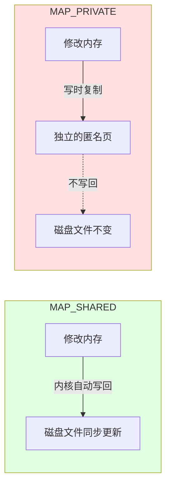
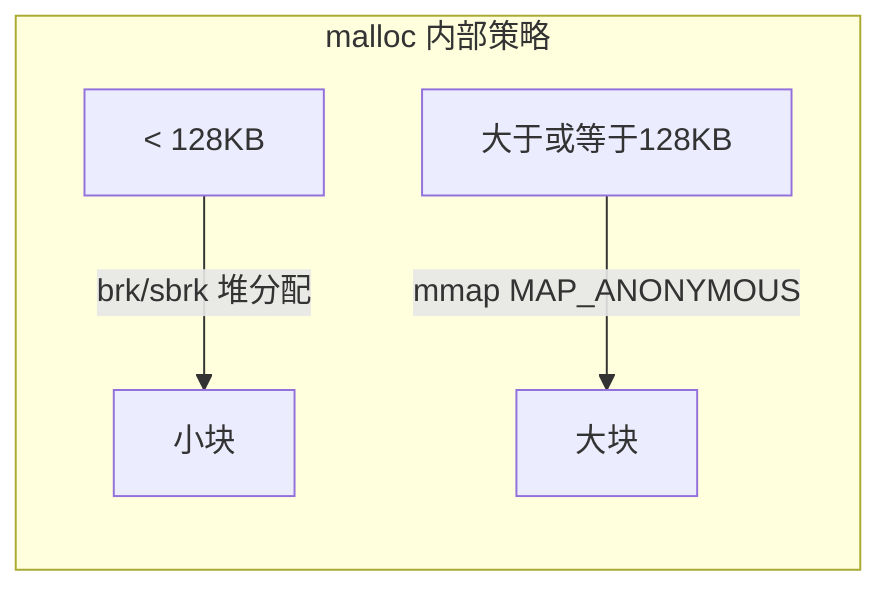
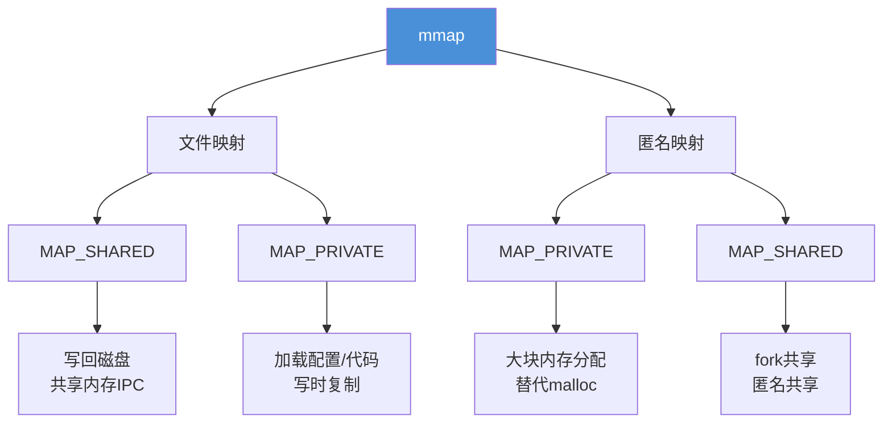

# mmap / munmap 零拷贝内存映射 — 源码分析

## 概述

`mmap`（memory map）是 Linux 提供的**内存映射**机制，将磁盘文件或匿名内存直接映射到进程地址空间。

**核心思想**：让程序员像操作内存数组一样操作文件，数据在缺页时由内核自动按页加载，**无需 read/write 系统调用**。

```
磁盘文件                   进程地址空间
┌──────────┐              ┌──────────────┐
│ 文件数据 │──mmap()──→   │ mapped[0..N] │
│          │  (零拷贝)     │ 像数组一样 []│
└──────────┘              └──────────────┘
```

---

## 4 个示例总览

| 示例  | 功能              | 关键 API                                       |
| --- | --------------- | -------------------------------------------- |
| 1   | 文件映射 + 随机读      | `mmap(fd, PROT_READ, MAP_PRIVATE)`           |
| 2   | MAP_SHARED 写文件  | `mmap(fd, PROT_WRITE, MAP_SHARED)` + `msync` |
| 3   | 匿名映射（替代 malloc） | `mmap(-1, MAP_ANONYMOUS)`                    |
| 4   | read vs mmap 基准 | 10 万次随机访问对比                                  |

---

## 示例 1：文件映射 + 随机读

### 代码

```cpp
// 1. 打开文件
int fd = open(path, O_RDONLY);

// 2. 获取文件大小
struct stat sb;
fstat(fd, &sb);

// 3. 将文件映射到内存
char* mapped = (char*)mmap(
    NULL,           // 内核选择起始地址
    sb.st_size,     // 映射长度 = 文件大小
    PROT_READ,      // 只读
    MAP_PRIVATE,    // 私有映射（写时复制）
    fd,             // 文件描述符
    0               // 从文件头开始
);
close(fd);          // mmap 后可以立即关闭 fd

// 4. 像数组一样读文件
char first  = mapped[0];           // 文件第一个字节
char middle = mapped[sb.st_size/2]; // 文件中部字节

// 5. 解除映射
munmap(mapped, sb.st_size);
```

### 数据流图

```
传统 read()
  磁盘 → [内核缓冲区] → 用户缓冲区 (CPU copy) → 程序使用
        └── read() 系统调用 ──┘

mmap()
  磁盘 → [内核页缓存] ←──── 进程地址空间直接映射
        └── 缺页中断按需加载 ──┘  (零拷贝)
```

### 关键点

- `mmap` 成功后可以立刻 `close(fd)`，映射仍然有效
- 不是一次性读入内存——**缺页时按页加载**（4KB 一页），大文件只读少量数据时尤其高效
- 访问 `mapped[i]` **没有系统调用**，直接走内存总线

---

## 示例 2：MAP_SHARED 写文件

### 代码

```cpp
int fd = open(path, O_RDWR | O_CREAT, 0644);
ftruncate(fd, SIZE);  // 文件必须有实际大小才能映射

char* mapped = (char*)mmap(
    NULL, SIZE,
    PROT_READ | PROT_WRITE,  // 读写权限
    MAP_SHARED,              // ← 关键！写回磁盘
    fd, 0
);
close(fd);

// 通过内存写 = 通过磁盘写
memcpy(mapped, "Hello", 6);        // 修改立即对文件可见
memset(mapped + 100, 0xFF, 50);    // 批量填充
snprintf(mapped + 200, 100, "...");// 格式化写入

// 强制刷盘（类似 fsync）
msync(mapped, SIZE, MS_SYNC);

munmap(mapped, SIZE);
```

### MAP_SHARED vs MAP_PRIVATE



| flag          | 内存修改 → 磁盘    | 典型用途            |
| ------------- | ------------ | --------------- |
| `MAP_SHARED`  | **同步**回文件    | 文件 I/O、共享内存 IPC |
| `MAP_PRIVATE` | 写时复制，**不**回写 | 加载可执行文件、只读配置    |
|               |              |                 |

### msync 说明

```cpp
int msync(void *addr, size_t length, int flags);
```

| flags           | 行为                                |
| --------------- | --------------------------------- |
| `MS_SYNC`       | **阻塞**等待刷盘完成（类似 `fsync`）          |
| `MS_ASYNC`      | **异步**调度写入，立即返回（类似 `dirty` 页后台回写） |
| `MS_INVALIDATE` | 使其他映射的缓存失效                        |

> ⚠️ 不用 `msync` 也可以——内核后台线程（pdflush）会定期刷 dirty 页，但不安全（崩溃丢数据）。

---

## 示例 3：匿名映射（MAP_ANONYMOUS）

### 代码

```cpp
char* huge = (char*)mmap(
    NULL, SIZE,
    PROT_READ | PROT_WRITE,
    MAP_PRIVATE | MAP_ANONYMOUS,  // 匿名，无文件后端
    -1,   // fd 无意义
    0
);
// 使用 ...
munmap(huge, SIZE);
```

### 与 malloc 的关系



你应该见过这个场景——这就是为什么你 `malloc(1GB)` 有时返回的地址和你猜测的不一样（它在单独的映射区，不是在堆上）。

| 特性 | malloc | mmap 匿名 |
|------|--------|-----------|
| 管理方式 | 自动 | 手动 munmap |
| 大块效率 | 低（碎片化） | 高（整页分配） |
| 进程共享 | 不共享 | fork 后父子共享 |
| 初始化 | 不保证 | 内核保证全零 |
| 适用大小 | 通用 | 大块（>128KB） |

---

## 示例 4：性能对比

### 代码逻辑

```
生成 10 万个随机文件偏移位置

mmap 组:
    mapped = mmap(fd)       ← 一次系统调用
    for i in 100000:
        sink += mapped[offsets[i]]   ← 零系统调用！

read 组:
    for i in 100000:
        lseek(fd, offsets[i])        ← 系统调用
        read(fd, &c, 1)              ← 系统调用
```

### 实测结果

```
mmap:  198 μs  (sink=-112)
read:  157125 μs  (sink=-112)

mmap 快 ~790 倍
```

### 为什么 mmap 快这么多？

```
每次 read(fd, buf, 1)  都陷入内核   →   上下文切换  ≈ 100-200ns
                                          ↓
                                    保存/恢复寄存器、栈、信号等
                                          ↓
                                    10 万次 × 2（lseek+read）
                                          ↓
                                    约 800 倍差距的来源
```

mmap 只在首次访问未加载的页时触发缺页中断（一次系统调用即可加载整个页），此后所有访问都是 CPU 直接访存。

### 公平性说明

这个基准是**极端偏向 mmap** 的场景：
- 每次读 1 字节 → read 最差情况（每次都要系统调用）
- 随机访问模式 → mmap 页面缓存优势最大化
- 小文件（全部映射） → mmap 不需要反复映射

如果改成**大块顺序读**（每次 64KB），read 的性能会显著接近 mmap，因为 read 批量拷贝和缺页加载的开销趋于一致。

---

## mmap 核心 API 速查

### mmap 原型

```cpp
#include <sys/mman.h>

void *mmap(void *addr, size_t length, int prot, int flags, int fd, off_t offset);
```

| 参数 | 含义 |
|------|------|
| `addr` | 建议起始地址，`NULL` 让内核选 |
| `length` | 映射字节数 |
| `prot` | 保护位：`PROT_READ`/`PROT_WRITE`/`PROT_EXEC`/`PROT_NONE` |
| `flags` | 映射类型：`MAP_SHARED`/`MAP_PRIVATE`/`MAP_ANONYMOUS`/`MAP_POPULATE` |
| `fd` | 文件描述符（匿名映射传 `-1`） |
| `offset` | 文件偏移量（必须是页对齐的，即 4K 的整数倍） |

**返回值**：映射起始地址，失败返回 `MAP_FAILED`（即 `(void*)-1`）。

### munmap 原型

```cpp
int munmap(void *addr, size_t length);
```

**释放映射区域**，之后访问该地址段产生 `SIGSEGV`（段错误）。

### prot 权限组合

| 值 | 含义 |
|----|------|
| `PROT_NONE` | 不可访问（可用于 guard page） |
| `PROT_READ` | 可读 |
| `PROT_WRITE` | 可写 |
| `PROT_READ \| PROT_WRITE` | 读写 |
| `PROT_READ \| PROT_EXEC` | 读+执行（加载代码段） |

### flags 常用组合

| 组合 | 场景 |
|------|------|
| `MAP_SHARED` | 文件 I/O、共享内存 |
| `MAP_PRIVATE` | 加载配置、代码段 |
| `MAP_PRIVATE \| MAP_ANONYMOUS` | 大块内存分配 |
| `MAP_SHARED \| MAP_ANONYMOUS` | 进程间共享匿名内存（需配合 shm_open） |
| `MAP_PRIVATE \| MAP_POPULATE` | 预加载页（在 mmap 时就触发缺页，而非访问时） |

---

## mmap 与 sendfile 的对比

两个都是零拷贝机制，但适用场景不同：

```
sendfile:  磁盘 → [内核] → 网卡
           流式传输，数据不经过用户态

mmap:      磁盘 → [内核页缓存] → 进程地址空间（直接访问）
           随机访问，数据可以通过用户态读/写
```

| 特性 | sendfile | mmap |
|------|----------|------|
| 方向 | 文件→socket 单向 | 文件↔内存 双向 |
| 随机访问 | ❌ 不支持 | ✅ 支持 |
| 修改文件 | ❌ 只读 | ✅ MAP_SHARED 可写 |
| 适用场景 | HTTP 静态文件下载 | 数据库、配置文件、大块内存 |
| 单次拷贝次数 | 1 次 DMA | 0 次（OS 直接映射） |

---

## 使用建议与注意事项

### ✅ 推荐场景

- **大文件随机访问**（数据库、KV 存储、索引文件）
- **需要频繁读写的配置文件**（映射后直接用指针操作）
- **大块内存分配**（匿名映射替代 malloc）
- **进程间共享内存**（`MAP_SHARED | MAP_ANONYMOUS` + fork）

### ❌ 不推荐场景

- **小文件一次读完**（read 更简单，且系统调用开销可忽略）
- **流式顺序大文件**（sendfile 或 splice 更优）
- **文件大小动态增长**（映射长度固定，扩展不方便）
- **频繁写入的小区域**（页对齐写，`MAP_SHARED` 脏页刷盘有开销）

### ⚠️ 注意事项

1. **页对齐**：文件 offset 必须是页大小（`sysconf(_SC_PAGE_SIZE)` = 4096）的倍数
2. **SIGSEGV**：访问 `munmap` 后的地址产生段错误
3. **文件大小变化**：映射后文件被截断，访问超出部分也产生 `SIGBUS`
4. **MAP_SHARED 的刷盘时机**：不保证立即刷盘，关键数据需要 `msync`
5. **映射数量上限**：受 `vm.max_map_count` 限制（默认 65530，可调 `sysctl -w vm.max_map_count=262144`）

---

## 总结



**一句话总结**：

> mmap 把文件变成内存，让程序员用 `[]` 替代 `read()`。
> 缺点是你得负责 `munmap()`，因为内核不会帮你擦屁股。
