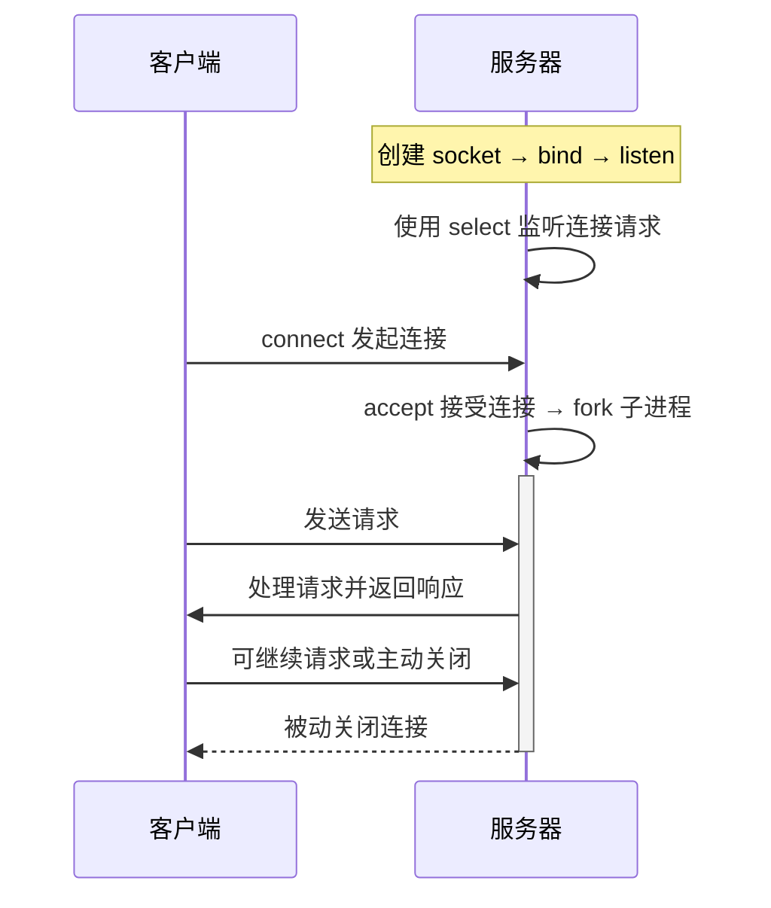
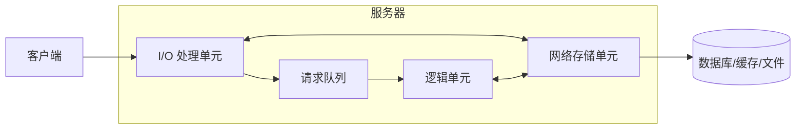
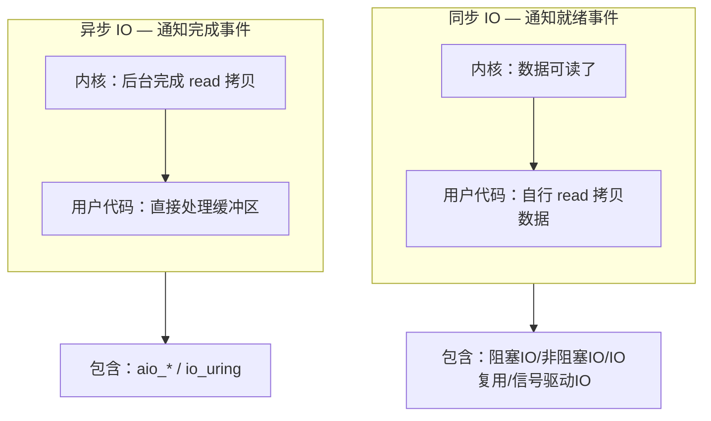
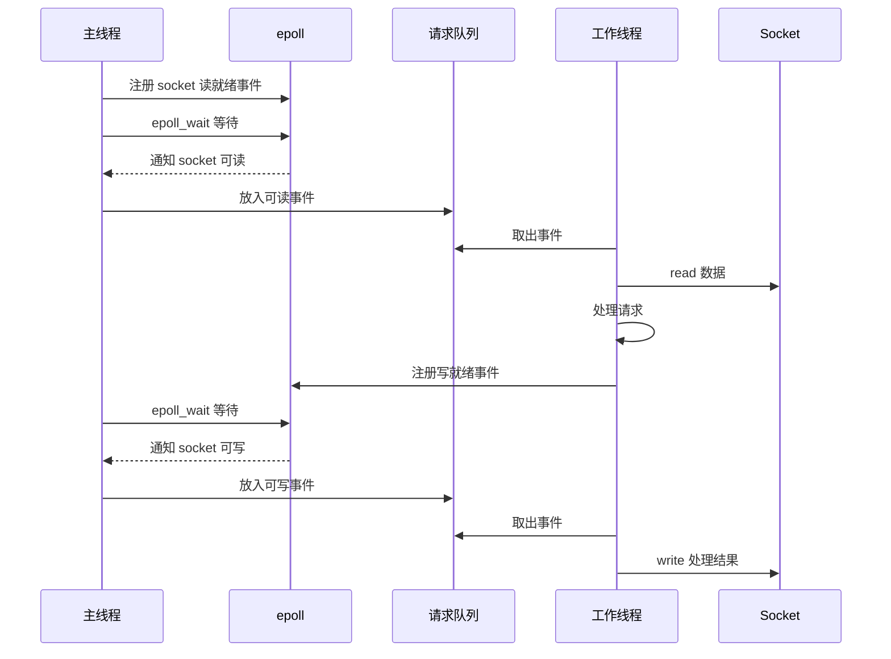
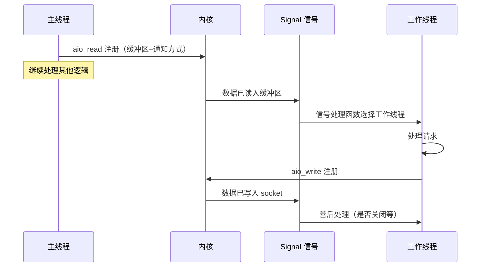
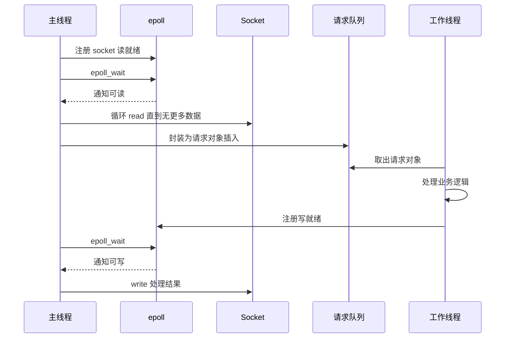
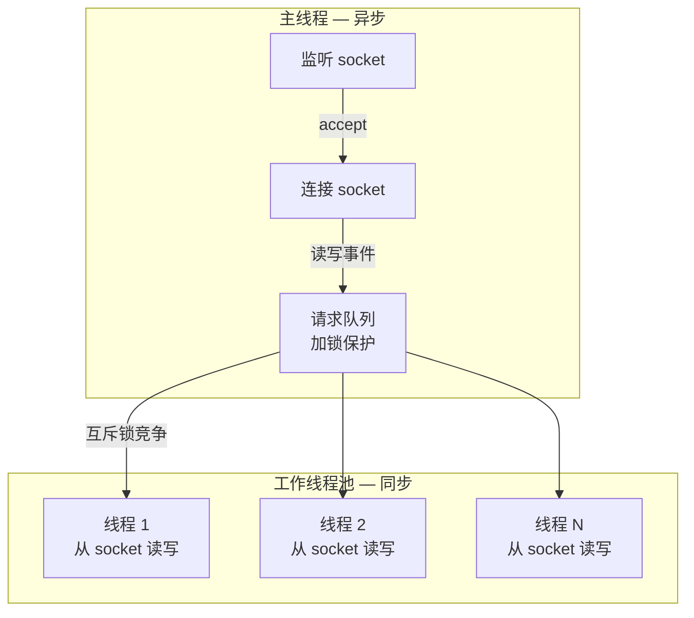
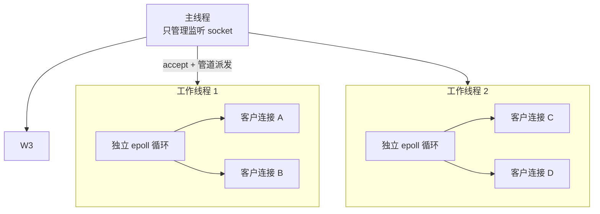
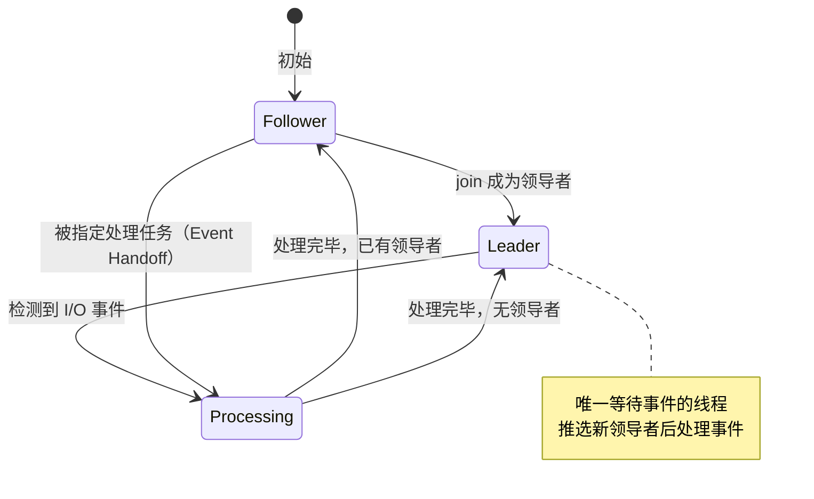
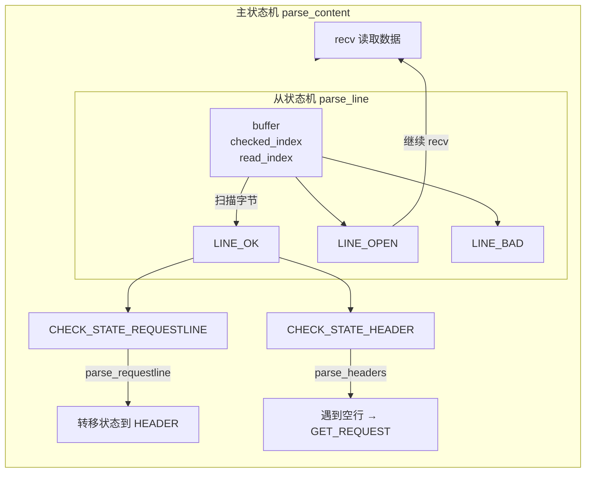

## 第8章　高性能服务器程序框架

### 0 核心定义

服务器解构为三个主要模块：

| 模块 | 职责 | 说明 |
| --- | --- | --- |
| **I/O 处理单元** | 管理客户连接 | 等待并接受新连接、收发数据 |
| **逻辑单元** | 业务处理与计算 | 通常是一个进程或线程 |
| **存储单元** | 数据持久化 | 数据库/缓存/文件，**可选**（ssh/telnet 无需此单元） |

### 1 服务器模型

#### 1.1 C/S 模型（客户端/服务器）



#### 1.2 P2P 模型（点对点）

无中央服务器，每台机器既是客户端又是服务器。实际 P2P 模型通常带一个**发现服务器**提供查找服务。从编程角度可看作 C/S 模型的扩展。

### 2 服务器编程框架



**各模块**：

| 模块 | 关键行为 |
| --- | --- |
| I/O 处理单元 | 等待/接受连接、收发数据。机群中作为接入服务器实现负载均衡 |
| 逻辑单元 | 分析处理客户数据。通常多个逻辑单元实现并行 |
| 请求队列 | 各单元通信抽象。机群中为预建立的静态永久 TCP 连接 |
| 网络存储单元 | 可选，ssh/telnet 不需要 |

### 3 I/O 模型

#### 3.1 阻塞 vs 非阻塞

- **阻塞**：`accept/send/recv/connect` 可能因无法立即完成被挂起
- **非阻塞**：立即返回，事件未发生返回 `-1`，`errno` 为 `EAGAIN`/`EWOULDBLOCK`（`connect` 为 `EINPROGRESS`）
- 非阻塞必须配合 I/O 复用或 SIGIO，否则空轮询浪费 CPU

#### 3.2 POSIX 同步 IO vs 异步 IO



### 4 两种高效的事件处理模式

#### 4.1 Reactor 模式

**核心**：主线程只负责监听事件，通知工作线程；**读写数据由工作线程完成**。



#### 4.2 Proactor 模式

**核心**：所有 I/O 交给内核，工作线程仅负责业务逻辑。



真正让 Proactor 快于 Reactor 的**核心不在于“减少了拷贝的总字节数”**，而在于:
“把拷贝的时间，从占满工作线程 CPU 执行周期的同步阻塞，转移到了内核后台/硬件 DMA 的异步进程中”**。
#### 4.3 模拟 Proactor 模式

**核心**：用同步 IO 模拟。主线程自己把数据读完再交给工作线程。


**细节剖析**：

- **读阶段**：主线程全程阻塞在 `epoll_wait` 和后续的 `read` 上。它确保了**读操作的最大效率**（一口气把 Socket 缓冲区的数据全部读完，避免频繁的 `epoll_wait` 唤醒）。
    
- **任务分发**：主线程读完后，把数据和套接字句柄打包成任务，放入**无锁队列（或互斥锁队列）**。这一步实现了 **IO 与业务逻辑的解耦**。主线程丢下任务立刻回到 `epoll_wait` 继续监听新连接。
    
- **业务计算**：工作线程以消费者身份从队列里取任务，纯粹进行业务计算（比如你在游戏服务器里处理玩家登录、移动等）。
    
- **写回**：图中强调工作线程处理完后去**注册写就绪**，这个步骤在 C++ 工程中极易踩坑（见下文的工程警告）。
    

---

##### 2. 它与“真 Proactor”的本质差异

结合你之前问的“数据拷贝和 DMA”问题，这张图完全暴露了它模拟的本质：

| 对比维度       | 模拟 Proactor                                           | 真正的 Proactor (Windows IOCP / io_uring) |
| ---------- | ----------------------------------------------------- | -------------------------------------- |
| **数据搬运机制** | 主线程**亲自**执行 CPU 参与的 `read` 系统调用将数据从内核拷到用户态。消耗 CPU 时间。 | DMA 直接拷贝到用户态内存，通过异步通知完成。**不占用主线程时间**。  |
| **IO 阻塞性** | 主线程执行 `read` 时是**同步阻塞**（或者说同步且非阻塞，如果是非阻塞 IO）。         | 主线程只需提交 `aio_read` 请求，**无需等待数据拷完**。    |
| **工作线程**   | 工作线程**只负责业务逻辑**，不参与系统调用。                              | 工作线程收到回调后，业务逻辑直接操作已经填满的 DMA 缓存区。       |

---

##### 3. 工程上的权衡（Trade-off）：既然开销大，为什么广泛使用？

如果真 Proactor 更好，为什么很多 C++ 游戏服务器（如很多开源的网游服务器架构）依然在使用这种“模拟 Proactor”？

- **开发成本极低**：写 `epoll` 比写 `io_uring` 或者 IOCP 的异步内存管理要直观得多。调试方便。
    
- **完美契合“计算密集型”**：游戏服务器的业务逻辑（寻路、技能伤害计算、数据库读写）极其消耗 CPU。把业务单独剥离给工作线程池，再配合多核 CPU，主 IO 线程的 `read` 拷贝开销其实被业务的 CPU 消耗给掩盖了（**业务计算多出来的 CPU 用时 >> IO 拷贝的 CPU 用时**）。
    
- **CPU 亲和性**：主 IO 线程可以绑定在 CPU Core 0，工作线程绑定在 Core 1-7，可以有效避免 CPU 缓存颠簸。
    

---

##### 4. ⚠️ 工程高危警告（结合 C++ 服务器开发）

这张图里隐藏着**两个极易导致线上崩溃的坑**：

1. **工作线程注册写就绪（线程安全问题）**：  
    图里面由工作线程执行“注册写就绪”。在 Linux 的 `epoll` 中，`epoll_ctl(EPOLL_CTL_MOD)` **不是线程安全的**。如果不同工作线程同时触发了这个修改，或者主线程正在 `epoll_wait` 时被修改，容易触发 `EPOLLERR` 导致整个连接断开或者 `epoll` 陷入无限循环。
    
    - **工程解法**：工作线程**不应该**直接去调 `epoll_ctl`。正确的做法是，工作线程把“写结果”放进对应 Socket 的 **写缓冲区（Write Buffer）** 后，通过**事件管道（Eventfd）** 触发主线程。主线程被唤醒后，统一去做 `EPOLL_CTL_MOD` 监听写就绪。**（所有权归主线程）**
        
2. **循环 `read` 的粘包陷阱**：  
    图中写着“循环 read 直到无更多数据”。如果你用的是 **ET（边缘触发）** 模式，这没有问题；如果你用的是 **LT（水平触发）** 模式，这会导致 `read` 返回 `EAGAIN` 才停止，如果业务逻辑发来的包非常密集，主线程可能会在这个 Socket 的循环读上耗费太长时间，导致 `epoll_wait` 无法及时处理其他 Socket 的连接，**引发“饿死”现象**。
    

##### 💡 给你的总结建议

在你的**游戏服务器/高性能中间件**的设计中，**模拟 Proactor 是一条非常靠谱的、兼顾开发效率与 CPU 隔离的成熟路线。**  
它真正消耗 CPU 的地方在于**“主线程 `read` 那一刻的内存拷贝”**，但如果你把工作线程的业务计算设计得更重，这点 IO 拷贝的开销往往可以忽略不计。  
如果你的系统是**纯代理转发（不需要解析业务数据）**，你应该果断把这种模拟模式替换为 **`sendfile` / `splice` 零拷贝**；如果业务强依赖解析，那么这套“主线程负责 IO + 线程池负责计算”的模型，就是当下最务实的架构。

#### **三种模式对比**：

| 维度 | Reactor | Proactor | 模拟 Proactor |
| --- | --- | --- | --- |
| 谁读数据 | 工作线程 | 内核（后台） | 主线程 |
| 谁写数据 | 工作线程 | 内核（后台） | 主线程 |
| 基于 IO | 同步 IO | 异步 IO | 同步 IO |
| Linux 典型框架 | libevent, libev | Boost.Asio(IOCP) | Boost.Asio(Linux) |

### 5 两种高效的并发模式

> ⚠️ **并发模式中的同步/异步 ≠ I/O 模型中的同步/异步**。I/O 模型区分谁拷贝数据；并发模型中"同步"=按代码顺序执行，"异步"=由系统事件（信号等）驱动。

#### 5.1 半同步/半异步模式

**变体一：半同步/半反应堆（half-sync/half-reactive）**



⚠️ 缺点：共享请求队列需加锁；每个工作线程同时只能处理一个连接。

**变体二：高效模式（图 8-11）**



#### 5.2 领导者/追随者模式



**组件**：

| 组件 | 职责 |
| --- | --- |
| 句柄集（HandleSet） | 管理 fd，`wait_for_event` 监听 |
| 线程集（ThreadSet） | 管理线程同步与推选新领导者 |
| 事件处理器（EventHandler） | 回调函数，绑定到句柄 |

### 6 有限状态机

逻辑单元内部的高效编程方法：**状态 + 状态转移**。

```cpp
// 带状态转移的 FSM
State cur_State = type_A;
while (cur_State != type_C) {
    Package _pack = getNewPackage();
    switch (cur_State) {
        case type_A:
            process_package_state_A(_pack);
            cur_State = type_B;   // 状态转移
            break;
        case type_B:
            process_package_state_B(_pack);
            cur_State = type_C;
            break;
    }
}
```

#### 主-从状态机（HTTP 请求解析）

**设计动机**：HTTP 无头部长度字段，靠空行（`<CR><LF>`）判断结束。数据可能分段到达，状态机能保证任意字节数到达时正确推进。

**状态定义**：

```cpp
enum CHECK_STATE { CHECK_STATE_REQUESTLINE, CHECK_STATE_HEADER };
enum LINE_STATUS { LINE_OK, LINE_BAD, LINE_OPEN };
enum HTTP_CODE  { NO_REQUEST, GET_REQUEST, BAD_REQUEST,
                  FORBIDDEN_REQUEST, INTERNAL_ERROR, CLOSED_CONNECTION };
```



### 7 提高服务器性能的其他建议

#### 7.1 池

以空间换时间，启动时预先分配，运行时直接获取。

| 池类型 | 作用 |
| --- | --- |
| 内存池 | socket 收发缓存，预分配足够大缓冲区 |
| 进程池 | 避免频繁 fork |
| 线程池 | 避免频繁 pthread_create |
| 连接池 | 数据库等永久连接，预建立一组 |

#### 7.2 数据复制

避免不必要的用户态↔内核态数据复制。典型：FTP 服务器用 `sendfile` 零拷贝直接发送文件，无需读入用户缓冲区。

#### 7.3 上下文切换和锁

- 线程数应 ≤ CPU 核数，否则切换开销吃掉吞吐量
- 锁首选避免（如图 8-11 的高效模式），必须使用时减小粒度（如读写锁）

### 关联笔记

- [[5-2 IO复用相关技术|IO复用核心技术]]
- [[5-2-1 select poll epoll源码分析|select/poll/epoll 源码分析]]
- [[5-4-a sendfile 零拷贝文件传输 — 源码分析|零拷贝：sendfile]]
- [[5-5-a mmap munmap 零拷贝内存映射 — 源码分析|零拷贝：mmap]]
- [[5-3 SIGALRM信号高性能定时器——时间轮|高性能定时器]]

### ⚠️ 踩坑

1. **epoll 不是异步 IO**：`epoll_wait` 阻塞等待，`read` 阻塞拷贝，属于同步 IO。真正的异步需要 `aio_*` 或 `io_uring`
2. **三套"同步/异步"不可混淆**：I/O 模型 ≠ 并发模式 ≠ 编程语言调用
3. **线程数不是越多越好**：超过 CPU 核数，切换开销 > 并行收益
4. **非阻塞 IO 必须配合通知机制**：否则用户态空轮询更浪费 CPU
