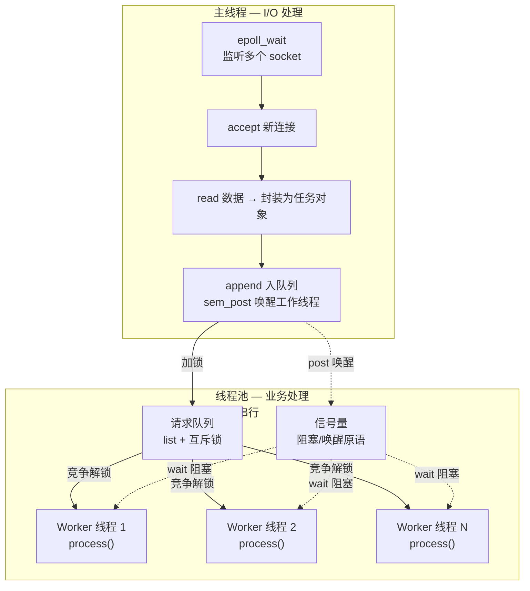
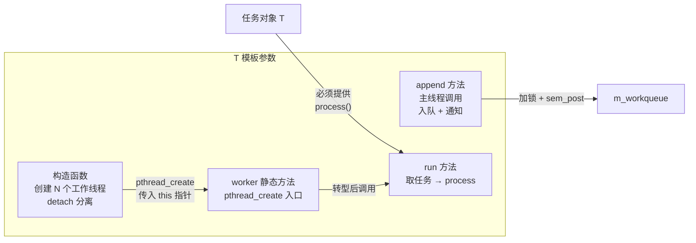
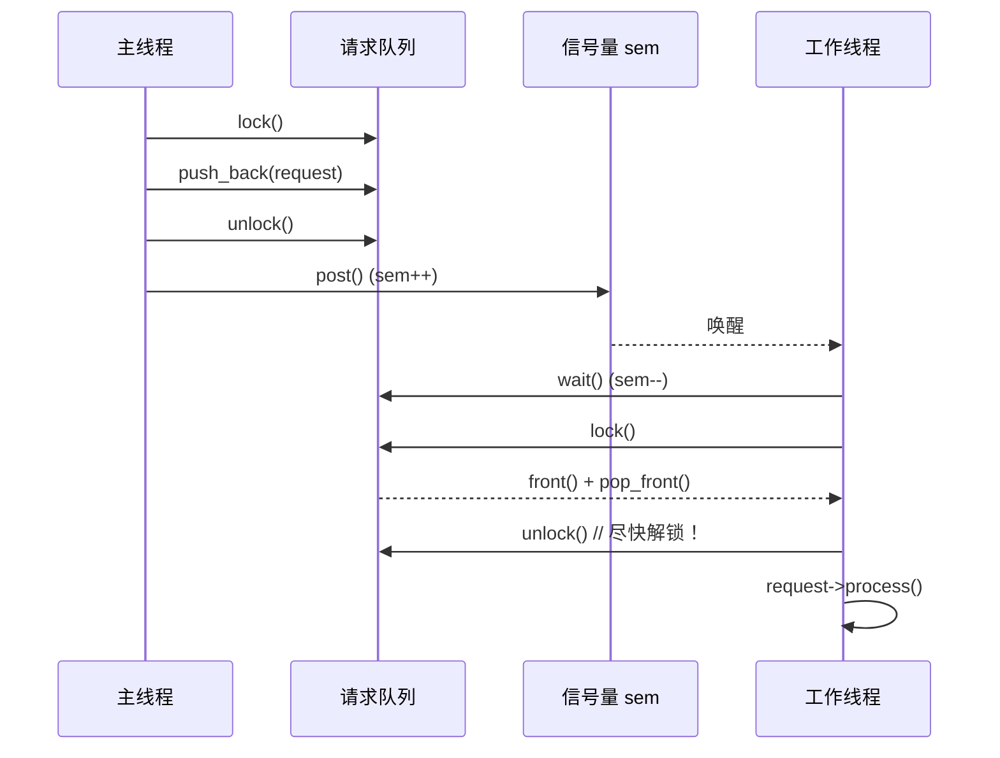
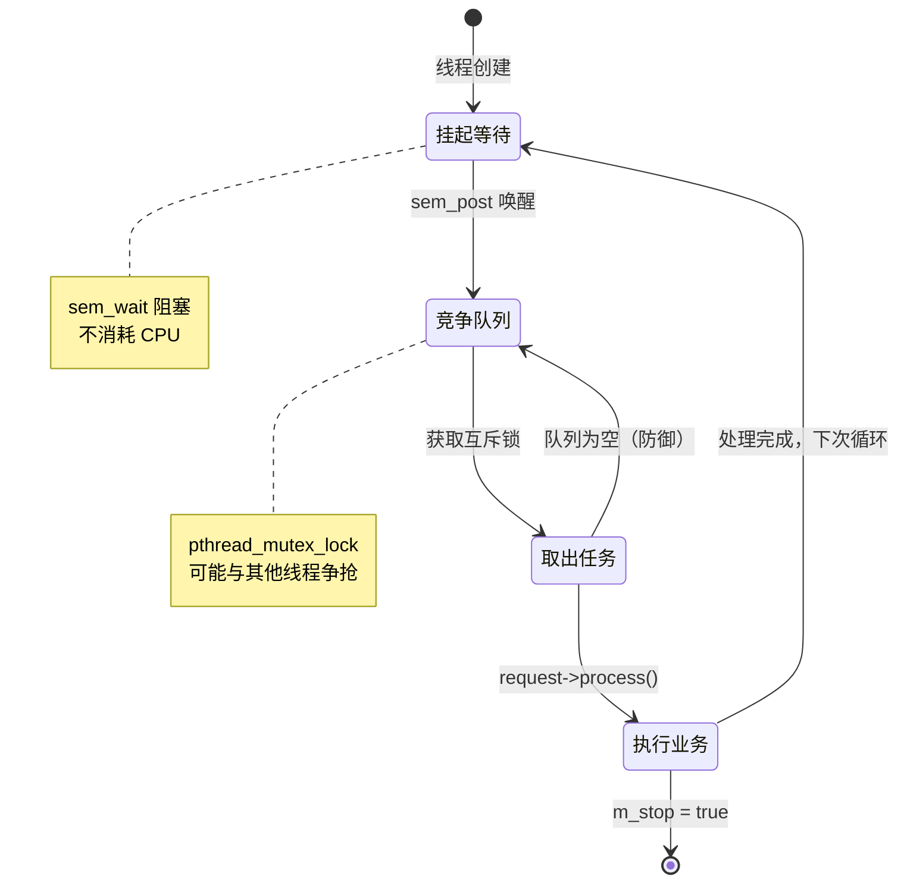

## 6-2 半同步/半反应堆线程池实现

> 对应教材第 15 章 + `game-server-engine` 配套源码 `locker.hpp` / `threadpoll.hpp`

### 0 架构概览



**核心设计**：
- **主线程**（异步）：负责 I/O 事件监听、数据读取、任务封装
- **线程池**（同步）：多个工作线程从队列中竞争获取任务，串行业务处理
- **同步原语**：`sem`（阻塞通知） + `locker`（互斥保护） + `cond`（条件等待）

### 1 locker.hpp — 三大同步原语封装

#### 1.1 信号量类 `sem`

```cpp
class sem {
public:
    sem() {
        if (sem_init(&m_sem, 0, 0) != 0)  // pshared=0(线程内共享), 初始值=0
            throw std::exception();
    }
    ~sem() { sem_destroy(&m_sem); }

    bool wait() { return sem_wait(&m_sem) == 0; }   // P 操作：sem--，为 0 则阻塞
    bool post() { return sem_post(&m_sem) == 0; }    // V 操作：sem++，唤醒等待者
private:
    sem_t m_sem;
};
```

**设计要点**：
- 初始值 **0**：工作线程调用 `wait()` 时若无任务则立即阻塞，不会空转
- 主线程 `append()` 末尾调 `post()`：sem 从 0→1，恰好唤醒一个阻塞的工作线程
- 相比于条件变量，信号量的优势是**无需额外的互斥锁配合**，语义更简洁

#### 1.2 互斥锁类 `locker`

```cpp
class locker {
public:
    locker() {
        if (pthread_mutex_init(&m_mutex, NULL) != 0)
            throw std::exception();
    }
    ~locker() { pthread_mutex_destroy(&m_mutex); }

    bool lock()   { return pthread_mutex_lock(&m_mutex) == 0; }
    bool unlock() { return pthread_mutex_unlock(&m_mutex) == 0; }
private:
    pthread_mutex_t m_mutex;
};
```

**角色**：保护 `m_workqueue`（请求队列）的并发访问。所有对 `push_back` / `front` / `pop_front` 的操作都必须持有此锁。

#### 1.3 条件变量类 `cond`

> 本线程池未使用 `cond`，但作为通用封装提供。后续的 Leader/Follower 模式或更精细的调度需求会用上。

```cpp
class cond {
public:
    cond() {
        if (pthread_mutex_init(&m_mutex, NULL) != 0)
            throw std::exception();
        if (pthread_cond_init(&m_cond, NULL) != 0) {
            pthread_mutex_destroy(&m_mutex);    // 构造失败，立即释放已分配资源
            throw std::exception();
        }
    }
    ~cond() {
        pthread_mutex_destroy(&m_mutex);
        pthread_cond_destroy(&m_cond);
    }

    bool wait() {
        pthread_mutex_lock(&m_mutex);
        int ret = pthread_cond_wait(&m_cond, &m_mutex);  // 原子性：解锁 + 挂起
        pthread_mutex_unlock(&m_mutex);                   // 被唤醒后：重新加锁 + 返回
        return ret == 0;
    }

    bool signal() { return pthread_cond_signal(&m_cond) == 0; }
private:
    pthread_mutex_t m_mutex;
    pthread_cond_t  m_cond;
};
```

#### 1.4 三种同步原语对比

| 维度        | `sem`（信号量）           | `locker`（互斥锁）           | `cond`（条件变量）             |
| --------- | -------------------- | ----------------------- | ------------------------ |
| **核心语义**  | 资源计数 + 阻塞通知          | 互斥访问临界区                 | 条件等待 + 唤醒                |
| **初始状态**  | 计数器 = 0              | 未锁定                     | 无                        |
| **阻塞行为**  | `wait()` 在 sem=0 时阻塞 | `lock()` 若被持有则阻塞        | `wait()` 无条件阻塞，需配合 mutex |
| **唤醒方式**  | `post()` 自增，唤醒一个等待者  | `unlock()` 释放，其他线程可竞争   | `signal()` 唤醒一个等待者       |
| **本工程用途** | 通知工作线程"有新任务"         | 保护 `m_workqueue` 不被并发破坏 | 预留（未使用）                  |
| **可否计数**  | ✅ 可累积（多调几次 post 可积累） | ❌ 不可累积                  | ❌ 不可累积（signal 无唤醒对象则丢失）  |
| **典型场景**  | 生产者-消费者模型            | 临界区访问                   | 复杂条件等待（如读写锁封装）           |

> 三种原语的**内核级深入分析**（futex 用户态/内核态分工、mutex 二值状态机、sem 计数器累积、cond 信号丢失）已移入独立笔记：[[6-2-1 POSIX同步原语深度剖析|POSIX 同步原语深度剖析 — 基于 futex 的内核数据结构]]

### 2 threadpoll.hpp — 线程池完整解析

#### 2.1 类结构总览



#### 2.2 成员变量

```cpp
int m_thread_number;       // 线程数（默认 8）
int m_max_requests;        // 请求队列最大长度（默认 10000）
pthread_t *m_threads;       // 线程 ID 数组，new 分配
std::list<T *> m_workqueue; // 请求队列（STL list，C++ 标准库）
locker m_queuelocker;       // 保护队列的互斥锁
sem m_queuestat;            // 信号量：通知工作线程有任务
bool m_stop;                // 停止标志
```

#### 2.3 构造函数 — 线程池创建

```cpp
threadpool(int thread_number = 8, int max_requests = 10000)
    : m_thread_number(thread_number), m_max_requests(max_requests),
      m_stop(false), m_threads(NULL) {
    // 校验参数
    if ((thread_number <= 0) || (max_requests <= 0))
        throw std::exception();

    m_threads = new pthread_t[m_thread_number];
    if (!m_threads) throw std::exception();

    for (int i = 0; i < thread_number; ++i) {
        // 核心：this 指针传给 worker——唯一能传给 pthread_create 的用户参数
        if (pthread_create(m_threads + i, NULL, worker, this) != 0) {
            delete[] m_threads;
            throw std::exception();
        }
        // detach：线程结束时系统自动回收，无需主线程 pthread_join
        if (pthread_detach(m_threads[i]) != 0) {
            delete[] m_threads;
            throw std::exception();
        }
    }
}
```

**关键设计决策**：

| 决策                          | 为什么                                 |
| --------------------------- | ----------------------------------- |
| `thread_number` 默认 **8**    | 通常 = CPU 核数 × 2，经验值                 |
| `max_requests` 默认 **10000** | 缓冲容量，防止瞬时洪峰时内存爆涨                    |
| `pthread_create` 传 `this`   | 成员函数不能直接传给 C 回调，静态函数 + `this` 是标准解法 |
| `pthread_detach`            | 避免主线程 `join` 阻塞。工作线程的生命周期跟随线程池      |
| 构造函数抛异常                     | C++ 构造无法返回错误码，抛异常是唯一方式。但调用方必须捕获     |

#### 2.4 `append` — 入队 + 通知

```cpp
bool threadpool<T>::append(T *request) {
    m_queuelocker.lock();                     // ① 加锁

    if (m_workqueue.size() > m_max_requests) { // ② 限流保护
        m_queuelocker.unlock();
        return false;                          // 队列满，返回失败
    }

    m_workqueue.push_back(request);           // ③ 插入队尾
    m_queuelocker.unlock();                    // ④ 尽快解锁

    m_queuestat.post();                        // ⑤ 唤醒一个工作线程

    return true;
}
```



**限流的必要性**：
- 若请求产生速率 > 业务处理速率，队列会持续膨胀
- `max_requests = 10000` 是硬上限：超过时 `append` 返回 `false`，主线程需自行处理丢弃/重试
- 没有此限流 → **内存泄漏直到 OOM**

#### 2.5 `worker` — 静态桥接

```cpp
void *threadpool<T>::worker(void *arg) {
    threadpool *pool = (threadpool *)arg;  // 还原 this 指针
    pool->run();                            // 调用动态成员函数
    return pool;
}
```

**为什么必须静态？**
- `pthread_create` 的第三个参数是 `void *(*start_routine)(void *)`——C 函数指针
- C++ 非静态成员函数隐含 `this` 参数，签名不匹配，无法直接转换
- 两层跳转：`pthread_create → worker(静态) → run(动态)`

#### 2.6 `run` — 工作线程主循环

```cpp
void threadpool<T>::run() {
    while (!m_stop) {
        m_queuestat.wait();                   // ① 阻塞等待任务（sem--，为0则挂起）

        m_queuelocker.lock();                  // ② 加锁读队列

        if (m_workqueue.empty()) {             // ③ 防御：防止空唤醒
            m_queuelocker.unlock();
            continue;
        }

        T *request = m_workqueue.front();
        m_workqueue.pop_front();

        m_queuelocker.unlock();                // ④ 尽快解锁！把时间让给其他线程

        if (!request) continue;                // ⑤ 防御空指针

        request->process();                    // ⑥ 核心：执行业务逻辑

        // ⑦ 循环结束，回到 wait()，若无任务则再次挂起
    }
}
```



**关键工程细节**：

| 行 | 代码 | 为什么这么写 |
| --- | --- | --- |
| ① | `m_queuestat.wait()` | 无任务时挂起，**零 CPU 空转** |
| ② | `m_queuelocker.lock()` | 读取队列前必须锁 |
| ③ | `empty()` 检查 | **幽灵唤醒（spurious wakeup）** 保护。POSIX 允许 `pthread_cond_wait` / `sem_wait` 在没有 `post` 时返回 |
| ④ | 取完任务后**立即解锁** | 减少锁持有时间，其他线程可以并发取下一个任务。`process()` 不应在锁内执行 |
| ⑤ | `if (!request)` 防御 | 队列中可能存放空指针 |
| ⑥ | `request->process()` | 模板类要求 T 必须提供 `process()` 接口——**策略模式** |

**为什么不把 process 放在锁里？**
```cpp
// ❌ 错误：长时间持锁
lock();
request = queue.front(); queue.pop_front();
request->process();   // 如果 process 执行了 100ms，其他线程全部阻塞等待！
unlock();

// ✅ 正确：取完即解锁
lock();
request = queue.front(); queue.pop_front();
unlock();              // 立刻释放
request->process();    // 不占用锁，其他线程可并行处理
```

### 3 工程权衡分析

#### 3.1 半同步/半反应堆 vs 高效变体（图 8-11）

| 维度 | 本实现（half-sync/half-reactive） | 高效变体（图 8-11） |
| --- | --- | --- |
| 主线程职责 | epoll + accept + read + append | 仅 accept，socket 通过管道派发给工作线程 |
| 谁读数据 | 主线程（主线程读到 buffer 后封装成任务） | 工作线程（在自己的 epoll 中注册，自己读） |
| 请求队列 | 共享 `std::list` + 互斥锁 | 管道（无需锁） |
| 每个线程可处理的连接数 | 1（取一个任务，process 完了再取下个） | 多个（每个工作线程独立管理多个 socket） |
| 锁竞争 | ⚠️ 主线程 + N 个工作线程争同一把锁 | ❌ 无需锁（各自 epoll 独立） |
| 编程复杂度 | 低 | 高 |
| 适用场景 | 业务耗时短的场景（如协议解析） | 业务耗时长的场景（如文件传输） |

#### 3.2 线程池核心参数的选取

```cpp
threadpool(int thread_number = 8, int max_requests = 10000);
```

| 参数 | 经验值 | 依据 |
| --- | --- | --- |
| `thread_number` | CPU 核数 × 2 | 计算密集型设为核心数，I/O 密集型可 2~4 倍 |
| `max_requests` | 视业务而定 | 需估算：峰值 QPS × 平均响应时间 + 余量 |

### 4 与本库其他笔记的关联

- [[6-1 高性能服务器框架概述|6-1 高性能服务器框架]] — 第 5 节 半同步/半反应堆模式的理论背景
- [[5-2-1 select poll epoll源码分析|select/poll/epoll]] — 主线程使用的 I/O 复用技术
- [[5-1 socket选项]] — socket 底层选项配置
- 这本配套源码的半同步/半反应堆模式是最简实现。更高效的变体见教材第 15 章图 8-11

### ⚠️ 踩坑记录

1. **幽灵唤醒（spurious wakeup）**：`sem_wait` 可能在没有 `post` 时返回。`run()` 中的 `empty()` 检查是必须的，不是多余的防御
2. **锁内不要执行业务逻辑**：`request->process()` 必须在 `unlock()` 之后，否则多线程池退化为串行
3. **模板参数 T 必须提供 `process()`**：编译期无约束，但运行时缺了会链接错误。文档约束是最弱的约束
4. **构造函数抛异常的资源泄漏**：`threadpool` 构造分三步（`new[]` → 循环 `pthread_create` → `pthread_detach`），中间任何一步失败都要 `delete[] m_threads`，否则内存泄漏
5. **`append` 返回 `false` 的处理**：队列满时不会阻塞，主线程收到 `false` 后必须自行决定策略（丢弃/重试/拒绝连接），否则客户端将超时
