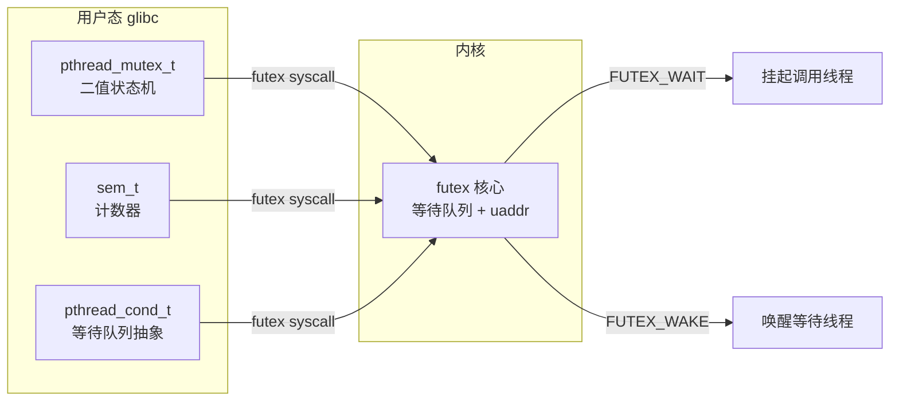
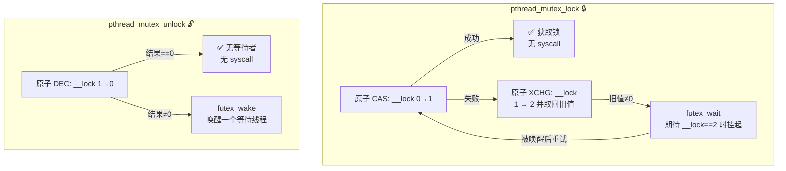
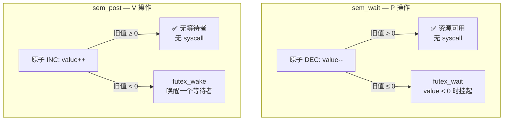
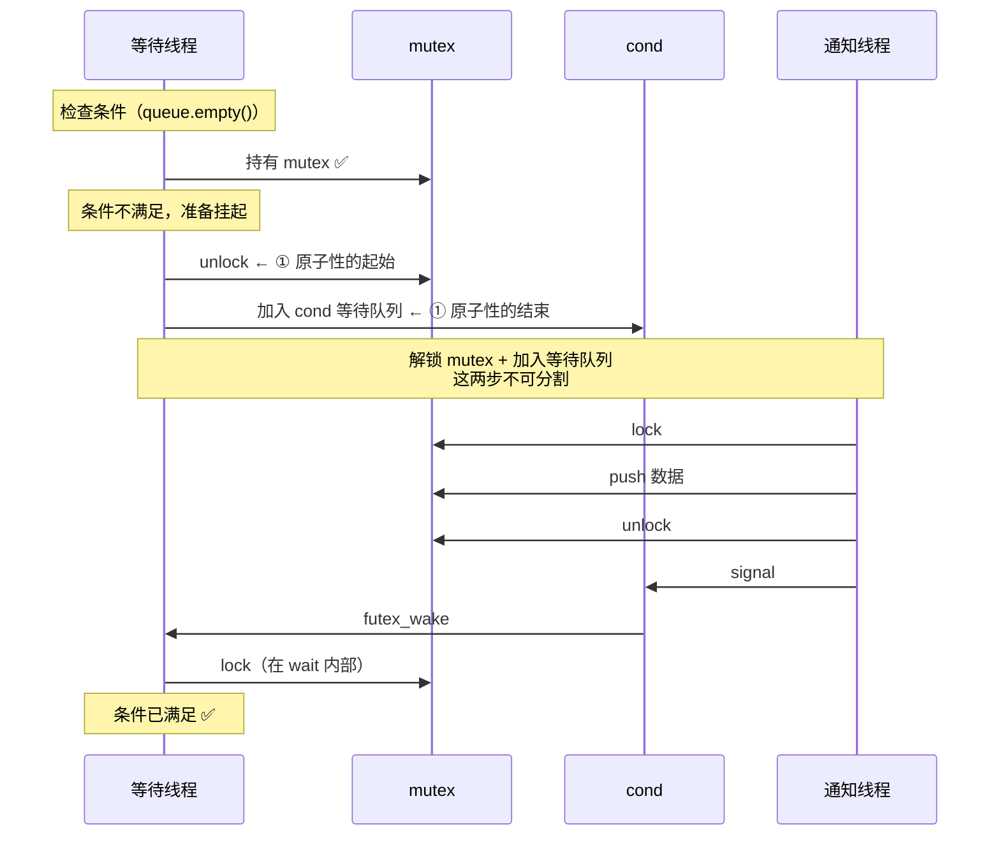
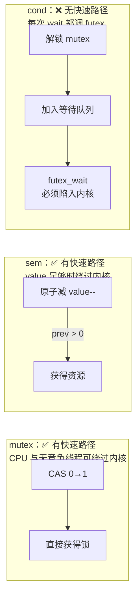

## POSIX 同步原语深度剖析
### 基于 futex 的三种同步原语 — 从内核数据结构出发

> 配套源码：`game-server-engine/src/include/locker.hpp`
> 关联笔记：[[6-2 半同步半反应堆线程池实现|半同步/半反应堆线程池]]

### 0 统一框架：一切同步原语底层都是 futex

Linux 的 NPTL（Native POSIX Thread Library）中，`pthread_mutex_t`、`sem_t`、`pthread_cond_t` 三者最终都基于同一个内核机制——**futex**（Fast Userspace muTEX）。



**futex 的核心设计**：一个 `u32 *uaddr`（用户态地址）对应内核中的一个等待队列。线程 A 挂起在这个地址上，线程 B 通过相同地址唤醒它。

```c
// futex 系统调用的核心接口（简化）
long futex(u32 *uaddr, int op, u32 val, ...);

// 两个核心操作：
futex(uaddr, FUTEX_WAIT, val);
    // 若 *uaddr == val，则当前线程在此地址上挂起
    // 若 *uaddr != val，立即返回（说明条件已被其他线程改变）

futex(uaddr, FUTEX_WAKE, n);
    // 唤醒在 uaddr 上等待的至多 n 个线程
```

**关键洞察**：所有同步原语的区别不在于内核做了什么，而在于 **用户态原子变量的含义** 以及 **快速路径的判断条件**。

### 1 互斥锁（`pthread_mutex_t`）

#### 1.1 内核数据结构

```c
// glibc NPTL 中 pthread_mutex_t 的内部布局（简化）
typedef struct {
    struct __pthread_mutex_s {
        int __lock;        // futex 原子变量 —— 核心状态
        unsigned int __count;    // 递归锁的递归计数
        int __owner;       // 持有锁的线程 ID（LWP）
        int __kind;        // 锁类型：普通 / 递归 / 错误检测
        unsigned int __nusers;   // 竞争的线程数
    } __data;
    // ...
} pthread_mutex_t;
```

**核心变量**：`__lock` 是一个 32 位整型，取值和含义：

| `__lock` 值 | 含义 |
| --- | --- |
| **0** | 未锁定（unlocked） |
| **1** | 已锁定，无等待者（locked, no waiters） |
| **2** | 已锁定，有等待者（locked, waiters pending） |

#### 1.2 快速路径 vs 慢速路径



**加锁伪代码**：

```c
// 对应 glibc nptl/pthread_mutex_lock.c
int pthread_mutex_lock(pthread_mutex_t *mutex) {
    // ① 快速路径：CAS 尝试 0→1（完全用户态，不进入内核）
    if (atomic_compare_exchange(&mutex->__lock, 0, 1) == 0)
        return 0;    // ✅ 零 syscall 获得锁

    // ② 慢速路径：有人持有锁
    return __lll_lock_wait(&mutex->__lock);
}

int __lll_lock_wait(int *futex) {
    // 先标记 "有等待者"（将 1 改为 2）
    int old = atomic_exchange(futex, 2);  // XCHG：返回旧值，设置新值=2
    if (old == 0)
        return 0;     // 恰好解锁了！直接获取

    // ③ 真正的阻塞
    do {
        futex(FUTEX_WAIT, futex, 2);      // 挂起，期望 *futex == 2
        old = atomic_exchange(futex, 2);
    } while (old != 0);                    // 被唤醒后若仍非 0 则继续等

    return 0;
}
```

**解锁伪代码**：

```c
int pthread_mutex_unlock(pthread_mutex_t *mutex) {
    // ① 快速路径：原子减 1（假设 __lock == 1，减后为 0）
    int old = atomic_exchange(futex, 0);  // XCHG：__lock → 0，返回旧值
    if (old == 1)
        return 0;    // ✅ 无等待者，零 syscall

    // ② 有等待者（old == 2），需要唤醒
    futex(FUTEX_WAKE, futex, 1);
    return 0;
}
```

#### 1.3 性能数据

| 场景 | 操作 | syscall? | 延迟（大致） |
| --- | --- | --- | --- |
| 无竞争加锁 | CAS 0→1 | ❌ | ~1 ns |
| 无竞争解锁 | XCHG → 0 | ❌ | ~1 ns |
| 有竞争加锁 | XCHG + FUTEX_WAIT | ✅ | ~50–100 ns（上下文切换） |
| 有竞争解锁 | XCHG + FUTEX_WAKE | ✅ | ~50–100 ns |

#### 1.4 额外特性

| 特性 | 说明 |
| --- | --- |
| **所有权** | mutex 有**所有权**概念——哪个线程加锁，必须在哪个线程解锁。其他线程解锁导致未定义行为 |
| **递归锁** | `PTHREAD_MUTEX_RECURSIVE` 类型：同一线程可多次 lock，`__count` 记录深度 |
| **优先级继承** | `PTHREAD_PRIO_INHERIT`：解决优先级反转，持有低优先级锁时被高优先级线程等待→临时提升优先级 |
| **健壮锁** | `PTHREAD_MUTEX_ROBUST`：持有锁的线程崩溃后，下一个等待者收到 `EOWNERDEAD`，有机会恢复 |
| **死锁检测** | `PTHREAD_MUTEX_ERRORCHECK`：同一线程重复 lock 返回 `EDEADLK` |

---

### 2 信号量（`sem_t`）

#### 2.1 内核数据结构

```c
// glibc NPTL 中 sem_t 的内部布局（简化）
typedef struct {
    struct {
        int value;            // 信号量计数器 —— 核心变量
        pthread_mutex_t lock; // 保护 value 的内锁（多 word 操作需要）
        unsigned int nwaiters;// 等待者计数
    } __data;
} sem_t;
```

**与 mutex 的根本差异**：`value` 是一个**可正可负的计数器**，不是二值状态机。

- `value > 0`：有 `value` 个可用资源
- `value == 0`：无可用资源
- `value < 0`：有 `|value|` 个线程在等待

#### 2.2 快速路径 vs 慢速路径



**`sem_wait` 伪代码**：

```c
int sem_wait(sem_t *sem) {
    while (1) {
        int val = atomic_load(&sem->__data.value);
        // ① 尝试原子减 1（快速路径）
        if (val > 0 && atomic_compare_exchange(&sem->__data.value, val, val - 1)) {
            return 0;    // ✅ 资源可用，零 syscall
        }

        // ② value ≤ 0 或 CAS 失败 → 阻塞
        futex(FUTEX_WAIT, &sem->__data.value, val);
    }
}
```

**`sem_post` 伪代码**：

```c
int sem_post(sem_t *sem) {
    int val = atomic_load(&sem->__data.value);
    // ① 原子加 1
    while (!atomic_compare_exchange(&sem->__data.value, val, val + 1)) {
        val = atomic_load(&sem->__data.value);  // CAS 失败则重试
    }

    // ② 若旧值 < 0，说明有线程在等待，需要唤醒
    if (val < 0)
        futex(FUTEX_WAKE, &sem->__data.value, 1);

    return 0;
}
```

#### 2.3 信号量的"累积"特性

这是信号量与 mutex / cond 的核心区别：

```c
sem_post(&sem);  // value: 0 → 1
sem_post(&sem);  // value: 1 → 2   ← 累积了！
sem_post(&sem);  // value: 2 → 3   ← 即使没有线程 wait

// 三个线程各调用一次 sem_wait，全部立刻成功，无一阻塞
sem_wait(&sem);  // value: 3 → 2   ← 没有 post 信号被丢失
sem_wait(&sem);  // value: 2 → 1
sem_wait(&sem);  // value: 1 → 0
```

- mutex：`unlock` 没有 wait 时只是把锁状态归零，不存在"未来加锁更快"一说
- cond：`signal` 没有 waiter 时信号**永久丢失**
- sem：`post` 没有 waiter 时**计数器累积**，未来的 `wait` 直接走快速路径

#### 2.4 单线程可用性

```c
// mutex — 同一线程重复 lock 会死锁（普通类型）
pthread_mutex_lock(&m);   // ✅
pthread_mutex_lock(&m);   // ❌ 死锁！自己等自己释放

// sem — 同一线程可重复 wait（但 value 要为够高）
sem_post(&s);             // value: 0 → 1
sem_wait(&s);             // value: 1 → 0 ✅
sem_wait(&s);             // value: 0 → -1 ❌ 阻塞，等另一个线程 post
```

**工程含义**：
- `sem` 的资源计数模型适合**生产者-消费者**模式
- `mutex` 的二值所有权模型适合**临界区保护**
- 信号量的累积特性使其能**缓冲**通知，不怕"通知比等待先到"

---

### 3 条件变量（`pthread_cond_t`）

#### 3.1 内核数据结构

```c
// glibc NPTL 中 pthread_cond_t 的内部布局（简化）
typedef struct {
    struct {
        unsigned int __wseq;    // 总唤醒序列号（低 31 位）
        unsigned int __g1_start;// Group1 起始序列号
        // ... 内部通过 futex 地址直接管理等待队列
    } __data;
} pthread_cond_t;
```

**关键洞察**：条件变量**不包含计数器**。`__wseq` 只是一个序列号，用于唤醒仲裁，不是可用资源的计数。

相比之下：
| 原语 | 核心变量语义 | 是否可累积 |
| --- | --- | --- |
| mutex `__lock` | 二值状态机 {0,1,2} | ❌ |
| sem `value` | 可用资源数 | ✅ 可正可负 |
| cond `__wseq` | 唤醒序列号 | ❌ signal 无 waiter 则丢失 |

#### 3.2 为什么 cond 必须配合 mutex？

这是最容易被误解的点。条件变量的核心操作 `pthread_cond_wait` 需要解决一个**原子性问题**：

```c
// ❌ 如果不配合 mutex，条件变量无法正确使用
if (queue.empty())          // ① 检查条件
    cond_wait(&cond);       // ② 等待通知

// 问题：在 ① 和 ② 之间，另一个线程：
//   1. 往 queue 里 push 了数据
//   2. 调了 cond_signal
// → 当前线程的 cond_wait 错过信号，永不醒来！
```

**`pthread_cond_wait` 的原子性保证**：

```c
// 等效伪代码：pthread_cond_wait 内部
int pthread_cond_wait(pthread_cond_t *cond, pthread_mutex_t *mutex) {
    // ① 原子性操作：解锁 mutex + 加入 cond 等待队列
    //   （这两个动作之间不会被 signal 中断）
    mutex_unlock(mutex);
    add_to_wait_queue(cond);

    // ② 挂起（等待 signal/broadcast 唤醒）
    futex(FUTEX_WAIT, &cond->__data.__wseq, current_seq);

    // ③ 被唤醒后：重新获取 mutex（可能在此阻塞）
    mutex_lock(mutex);
}
```



**为什么这个原子性重要？**

如果 `unlock` 和 `join_wait_queue` 不是原子的：

```
时间线：
  W: unlock(mutex)
  S: lock(mutex) → 检查条件 → 发现 queue 为空
  S: 既然 queue 为空，不需要 signal（- 错误！-）
  S: unlock(mutex)
  W: join_wait_queue(cond) → futex_wait → 永远挂起！
```

`pthread_cond_wait` 的原子性保证了 **"条件检查 → 解锁 → 挂起"链中不会被 signal 插入**。

#### 3.3 signal 丢失特性

```c
// cond_signal 在无 waiter 时永久丢失
pthread_cond_signal(&cond);   // 无 waiter → 信号消失
usleep(1000000);
pthread_cond_wait(&cond, &m); // 永远等不到

// 对比 sem_post
sem_post(&s);                 // value: 0 → 1（累积）
usleep(1000000);
sem_wait(&s);                 // value: 1 → 0 ✅ 立刻返回
```

| 场景 | cond | sem |
| --- | --- | --- |
| signal/post 先于 wait | ❌ 信号丢失 | ✅ 计数器累积 |
| 多个 signal/post | 丢失（需计数等待次数） | ✅ 累加 |
| 适用模式 | 条件状态变化通知 | 资源可用性通知 |

**工程含义**：如果使用 cond，必须保证 `signal` **总是在**对应的 `wait` 之后，或在 mutex 保护下的共享状态中进行——这就是为什么正确用法永远是：

```c
// 正确：共享状态决定是否需要 signal
pthread_mutex_lock(&m);
shared_state = NEW_VALUE;           // 先修改共享状态
pthread_mutex_unlock(&m);
pthread_cond_signal(&cond);         // 然后通知

// 等待方：
pthread_mutex_lock(&m);
while (shared_state != TARGET) {     // 在 mutex 内检查
    pthread_cond_wait(&cond, &m);    // 条件不满足才等待
}
pthread_mutex_unlock(&m);
```

### 4 三原语统一对比

#### 4.1 内核视角对比

| 维度 | `pthread_mutex` | `sem_t` | `pthread_cond_t` |
| --- | --- | --- | --- |
| **核心变量** | `__lock`: {0,1,2} 状态机 | `value`: 计数器 [-N, +M] | `__wseq`: 唤醒序列号 |
| **快速路径** | CAS 0→1 | CAS 减后 value > 0 | **无**（每次 wait 都调 futex） |
| **所有权** | ✅ 持有者线程 | ❌ 无所有权 | ❌ 无所有权 |
| **可累积** | ❌ | ✅ 计数累积 | ❌ signal 无 waiter 则丢失 |
| **内核对象** | futex 等待队列 | futex 等待队列 | futex 等待队列 + 序列号 |
| **上下文切换触发** | lock + unlock 的原子操作失败 | wait + post 的原子操作失败 | wait 时**总是触发** |

#### 4.2 快速路径是否存在



**关键结论**：
- `mutex` 和 `sem` 在**无竞争**时都是纯用户态操作，零 syscall
- `cond` 的 `wait` **总是**需要 syscall（因为它必须从运行态→阻塞态，此动作需要内核参与）
- `cond` 的 `signal` 管用但如果有等待者也需要 syscall（`futex_wake`）
- `sem` 的累积特性使其在 `wait` 次数 < `post` 次数的场景下**完全不需要 syscall**

#### 4.3 场景选型建议

| 场景 | 推荐 | 理由 |
| --- | --- | --- |
| 保护临界区（如共享队列访问） | **mutex** | 短时持有，所有权保证，优先级继承防反转 |
| 生产者-消费者通知 | **sem** | 可累积，不怕通知先于消费到达 |
| 共享状态条件等待（如 buffer 从空→非空） | **cond + mutex** | 需要原子性检查条件 + 挂起 |
| 简单的二值资源可用性 | **sem**（初始值=1）或 **mutex** | 看是否需要所有权 |
| 多个等待者向一个生产者汇报 | **cond**（broadcast 可唤醒全部） | cond 支持 `pthread_cond_broadcast` |

#### 4.4 与 `locker.hpp` 源码的对应

```c
// locker.hpp 中的封装与本节的对应关系
class sem    { /* 封装 POSIX 无名信号量 */ };   → 第 2 节
class locker { /* 封装 POSIX 互斥锁 */ };       → 第 1 节
class cond   { /* 封装 POSIX 条件变量 */ };     → 第 3 节
```

> 💡 工程实践中，信号量可替换为条件变量 + 计数器，反之则不行（因为 cond 无累积特性）。这也是为什么本线程池选择 `sem` 而非 `cond` 作为阻塞通知原语——`post` 可在主线程 `append` 之后安全调用，即使工作线程尚未 `wait`。

### 关联笔记

- [[6-2 半同步半反应堆线程池实现|半同步/半反应堆线程池]] — locker.hpp 的工程运用（完整线程池源码分析）
- [[6-1 高性能服务器框架概述|高性能服务器框架]] — 并发模式的理论基础
