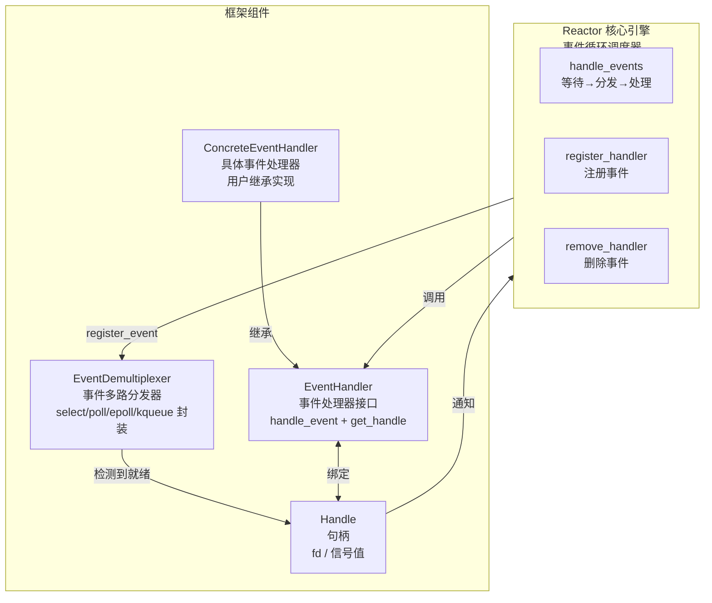
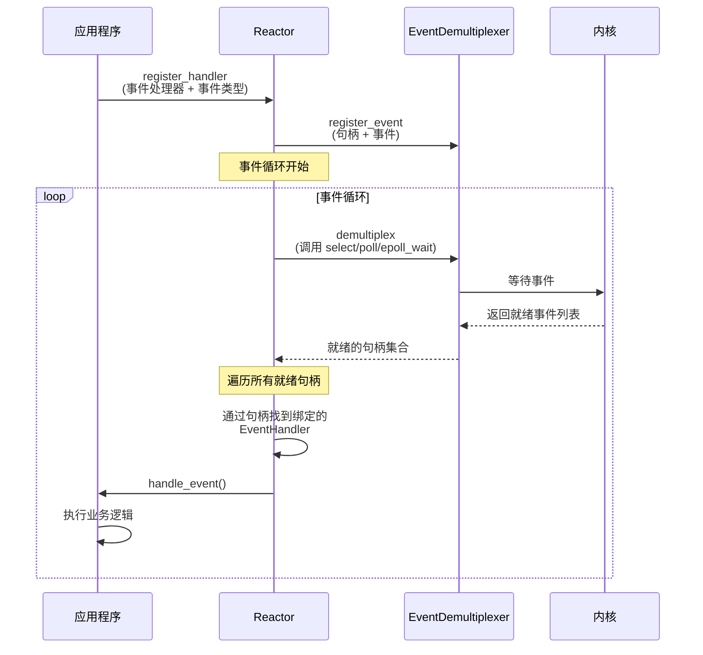
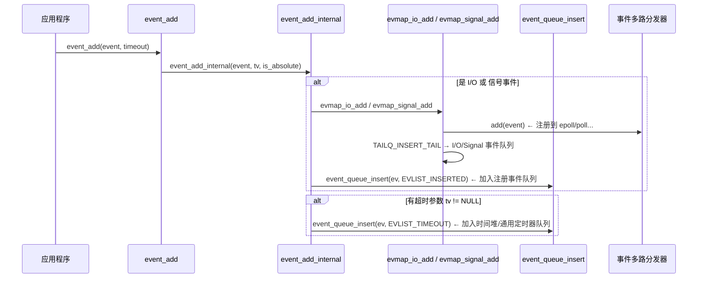
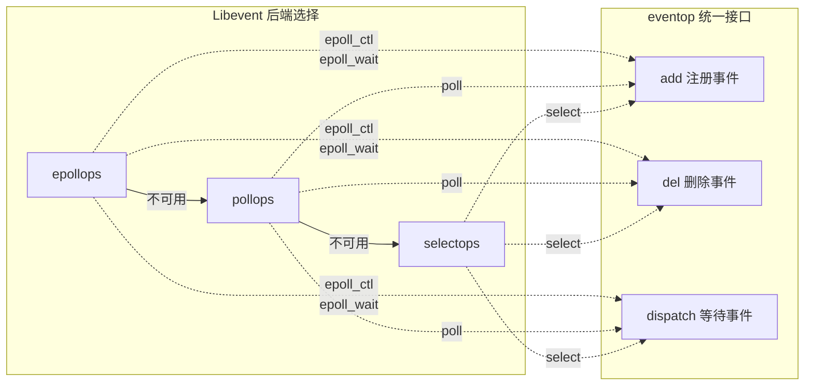
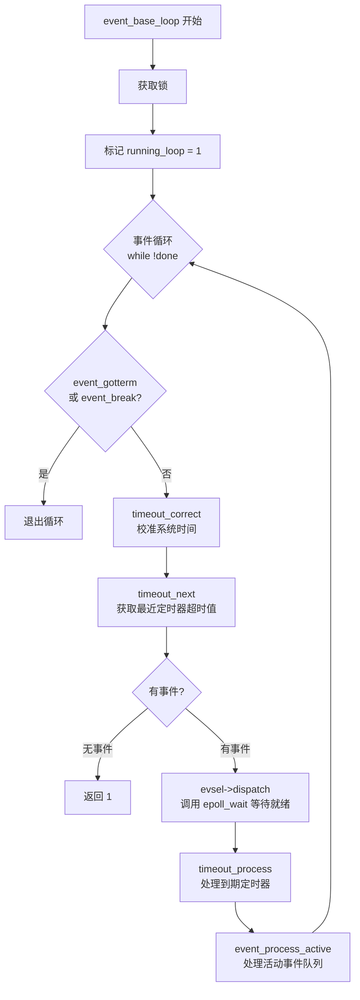
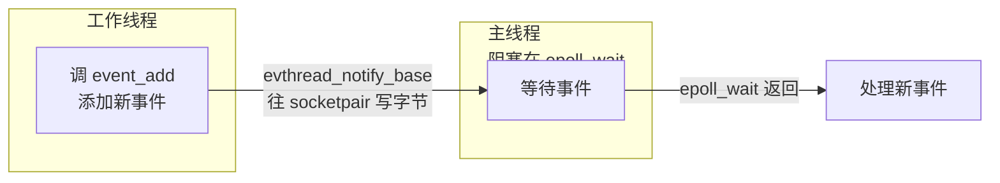

## 第12章　高性能I/O框架库 Libevent

> 💡 **工程权重**：⭐⭐⭐⭐⭐
> Libevent 是 Linux 下最主流的网络 I/O 框架库。memcached、Chromium(Linux) 等著名项目均使用它。

### 0 核心定义：为什么需要 I/O 框架库？

服务器程序必须处理三类事件：**I/O 事件、信号、定时事件**。处理时需解决三个问题：

| 问题         | 说明                                                                |
| ---------- | ----------------------------------------------------------------- |
| **统一事件源**  | I/O、信号、定时器是三种完全不同的机制，需统一处理避免逻辑错误                                  |
| **可移植性**   | Linux = epoll，FreeBSD = kqueue，Solaris = /dev/poll，Windows = IOCP |
| **并发编程支持** | 多线程/多进程环境下避免竞态条件                                                  |

Libevent 解决了以上所有问题，提供了跨平台的**统一事件处理框架**。

---

## 1 I/O 框架库的四大组件



| 组件                                | 职责                                                                                     | 类比          |
| --------------------------------- | -------------------------------------------------------------------------------------- | ----------- |
| **Handle（句柄）**                    | 唯一标识一个事件源。Linux 下 I/O 事件 = fd，信号事件 = 信号值                                               | 每个人有一个身份证号  |
| **EventDemultiplexer（事件多路分发器）**   | 封装 select/poll/epoll/kqueue，提供统一的 `register_event` / `remove_event` / `demultiplex` 接口 | 前台总机接线员     |
| **EventHandler（事件处理器）**           | 虚基类，声明 `handle_event()`、`get_handle()`                                                 | 处理某项业务的员工模板 |
| **ConcreteEventHandler（具体事件处理器）** | 用户继承 EventHandler，实现具体的业务逻辑                                                            | 实际干活的员工     |
| **Reactor**                       | 整个框架的核心引擎，运行事件循环                                                                       | 公司的运营调度     |

**工作时序**：



---

## 2 Libevent 源码分析

### 2.1 一句话示例

```c
#include <sys/signal.h>
#include <event.h>

void signal_cb(int fd, short event, void *argc) {
    struct event_base *base = (event_base *)argc;
    struct timeval delay = {2, 0};
    printf("Caught SIGINT; exiting in 2 seconds...\n");
    event_base_loopexit(base, &delay);
}

void timeout_cb(int fd, short event, void *argc) {
    printf("timeout\n");
}

int main() {
    struct event_base *base = event_init();                      // ① 创建 Reactor

    struct event *signal_event = evsignal_new(base, SIGINT, signal_cb, base);
    event_add(signal_event, NULL);                               // ② 注册信号事件

    struct timeval tv = {1, 0};
    struct event *timeout_event = evtimer_new(base, timeout_cb, NULL);
    event_add(timeout_event, &tv);                               // ③ 注册定时事件

    event_base_dispatch(base);                                   // ④ 进入事件循环

    event_free(timeout_event);
    event_free(signal_event);
    event_base_free(base);
    return 0;
}
```

**核心流程**：
```
① event_init()         → 创建 event_base（Reactor 实例）
② event_new()          → 创建事件处理器（event 对象）
③ event_add()          → 注册到事件多路分发器
④ event_base_dispatch()→ 进入事件循环
⑤ *_free()             → 释放资源
```

### 2.2 事件类型（event 标志位）

```c
#define EV_TIMEOUT  0x01   // 定时事件
#define EV_READ     0x02   // 可读事件
#define EV_WRITE    0x04   // 可写事件
#define EV_SIGNAL   0x08   // 信号事件
#define EV_PERSIST  0x10   // 永久事件：触发后自动重新 event_add
#define EV_ET       0x20   // 边缘触发（需后端支持）
```

**关键设计：EV_PERSIST**
- 普通事件触发后，自动从事件队列中移除
- 带 `EV_PERSIST` 的事件触发后，**自动重新 `event_add`**，永久有效
- 相当于 epoll 的 `EPOLLONESHOT` 的反面

### 2.3 源代码组织结构

```
Libevent 源码目录结构（按功能划分）：
├── include/event2/          # 对外头文件（event.h, http.h, rpc.h 等）
├── compat/sys/queue.h       # 跨平台数据结构（单向/双向/尾队列等）
├── event.c                  # 核心框架（event + event_base 操作）
├── evmap.c                  # 句柄↔事件处理器的映射关系
│
├── epoll.c                  # 后端 I/O 复用实现
├── kqueue.c                 # FreeBSD
├── select.c                 # POSIX select
├── poll.c                   # poll
├── devpoll.c                # Solaris /dev/poll
├── evport.c                 # Solaris event ports
├── win32select.c            # Windows select
│
├── signal.c                 # 信号支持
├── minheap-internal.h       # 时间堆（管理定时器）
├── evthread*.c              # 多线程支持
├── buffer*.c                # 网络 I/O 缓冲区
├── listener.c               # 监听 socket 封装
├── http.c                   # HTTP 协议
├── evdns.c                  # DNS 协议
└── evrpc.c                  # RPC 协议
```

---

### 2.4 `event` 结构体——事件处理器

Libevent 中 `event` 是**事件处理器**（不是事件本身）。它封装了句柄、事件类型、回调函数和状态标志。

```c
struct event {
    TAILQ_ENTRY(event) ev_active_next;       // 活动事件队列指针
    TAILQ_ENTRY(event) ev_next;              // 注册事件队列指针

    union {
        TAILQ_ENTRY(event) ev_next_with_common_timeout;
        int min_heap_idx;                     // 在时间堆中的索引
    } ev_timeout_pos;

    evutil_socket_t ev_fd;                    // 句柄（fd 或信号值）
    struct event_base *ev_base;               // 所属的 Reactor 实例

    union {
        struct {
            TAILQ_ENTRY(event) ev_io_next;    // I/O 事件队列指针
            struct timeval ev_timeout;
        } ev_io;
        struct {
            TAILQ_ENTRY(event) ev_signal_next; // 信号事件队列指针
            short ev_ncalls;                   // 回调函数需执行次数
            short *ev_pncalls;
        } ev_signal;
    } _ev;

    short ev_events;      // 事件类型（EV_READ|EV_WRITE|EV_SIGNAL|...）
    short ev_res;          // 当前激活的事件类型
    short ev_flags;        // 状态标志（EVLIST_* 系列）
    ev_uint8_t ev_pri;     // 优先级（0=最高）
    ev_uint8_t ev_closure; // 回调执行行为

    struct timeval ev_timeout;           // 超时值（仅定时器）
    void (*ev_callback)(evutil_socket_t, short, void *);  // 回调函数
    void *ev_arg;                         // 回调函数参数
};
```

#### `ev_flags` 状态标志

```c
#define EVLIST_TIMEOUT  0x01   // 在定时器队列/时间堆中
#define EVLIST_INSERTED 0x02   // 在注册事件队列中
#define EVLIST_SIGNAL   0x04   // （未使用）
#define EVLIST_ACTIVE   0x08   // 在活动事件队列中
#define EVLIST_INTERNAL 0x10   // 内部使用
#define EVLIST_INIT     0x80   // 已初始化
```

#### 五种事件队列

```mermaid
flowchart LR
    subgraph event_base
        EQ[注册事件队列<br/>eventqueue<br/>TAILQ<br/>含所有已注册事件]
        AQ[活动事件队列数组<br/>activequeues[N]<br/>按优先级 N 个]
        TQ[通用定时器队列<br/>common_timeout_queues]
        TH[时间堆<br/>timeheap<br/>最小堆结构]
    end

    subgraph evmap
        IOQ[I/O 事件队列<br/>evmap_io.events<br/>同 fd 的 event 串在一起]
        SIGQ[信号事件队列<br/>evmap_signal.events<br/>同信号值的 event 串在一起]
    end

    EQ -->|ev_next| event1 & event2 & event3
    AQ -->|ev_active_next| A_event1 & A_event2
    IOQ -->|ev_io_next| IO_event1 & IO_event2
    SIGQ -->|ev_signal_next| S_event1 & S_event2
```

| 队列 | 容器 | 组织方式 |
| --- | --- | --- |
| **注册事件队列** | `eventqueue`（TAILQ） | 所有已注册的 I/O/信号 event 通过 `ev_next` 串联 |
| **活动事件队列** | `activequeues[pri]`（数组） | 按优先级分 N 个队列，已就绪的 event 通过 `ev_active_next` 串联 |
| **I/O 事件队列** | `evmap_io.events`（TAILQ） | 同一 fd 上的所有 event 通过 `ev_io_next` 串联（非注册队列的细分！） |
| **信号事件队列** | `evmap_signal.events`（TAILQ） | 同一信号值的所有 event 通过 `ev_signal_next` 串联 |
| **定时器队列/时间堆** | `common_timeout_queues` + `timeheap` | 通用定时器用链表，普通定时器用最小堆 |

> 💡 **为什么要额外维护 I/O 事件队列和信号事件队列？**当一个 fd 上有事件发生时，可能有多个 event 对象被注册处理该 fd 上的同一种事件。这些队列允许事件多路分发器**快速找到所有相关的 event 对象**，一次性全部激活。

---

### 2.5 `event_add` —— 注册事件处理器



**`event_add_internal` 核心逻辑**：

| 步骤 | 做了什么 | 关键函数 |
| --- | --- | --- |
| ① 定时器预留 | 如果是定时器且未在时间堆中，先 `min_heap_reserve` 预留位置 | `min_heap_reserve` |
| ② 线程安全 | 如果调用者不是主线程，且信号事件正被处理，则等待 | 条件变量 `current_event_cond` |
| ③ 注册 I/O/信号事件 | 调用 `evmap_io_add`/`evmap_signal_add` 加入事件多路分发器 | `evmap_io_add` |
| ④ 插入注册事件队列 | `event_queue_insert(ev, EVLIST_INSERTED)` | `event_queue_insert` |
| ⑤ 处理定时器 | 有 tv 参数时插入时间堆或通用定时器队列 | `event_queue_insert(ev, EVLIST_TIMEOUT)` |
| ⑥ 唤醒主线程 | 如果添加了新事件，需唤醒主线程重新计算 epoll_wait 超时 | `evthread_notify_base` |

---

### 2.6 `evmap_io_add` —— 事件多路分发器注册

```c
int evmap_io_add(struct event_base *base, evutil_socket_t fd, struct event *ev) {
    const struct eventop *evsel = base->evsel;      // 后端 I/O 复用（epoll/poll/...）
    struct event_io_map *io = &base->io;            // fd → evmap_io 映射表

    GET_IO_SLOT_AND_CTOR(ctx, io, fd, ...);         // 获取或创建 fd 对应的 I/O 事件队列

    // 计算新旧事件类型的差异
    if (nread)   old |= EV_READ;
    if (nwrite)  old |= EV_WRITE;
    if (ev->ev_events & EV_READ)  res |= EV_READ;
    if (ev->ev_events & EV_WRITE) res |= EV_WRITE;

    if (res) {
        // 调用后端接口（如 epoll_ctl ADD/MOD）
        evsel->add(base, fd, old, (ev->ev_events & EV_ET) | res, extra);
    }

    // 将此 event 插入 I/O 事件队列（同 fd 的所有 event 串在一起）
    TAILQ_INSERT_TAIL(&ctx->events, ev, ev_io_next);
}
```

**句柄→事件处理器的映射表**：

```
base->io  (event_io_map)
  ├── key = fd 3  →  evmap_io { events: [ev_A, ev_B] }   // fd 3 上有两个 event
  ├── key = fd 7  →  evmap_io { events: [ev_C] }
  └── key = fd 9  →  evmap_io { events: [ev_D, ev_E, ev_F] }
```

在支持哈希表的系统上使用哈希表，否则使用数组（`entries[fd]`）。

---

### 2.7 `eventop` 结构体 —— 后端 I/O 复用抽象

```c
struct eventop {
    const char *name;                        // 后端名称（"epoll"、"poll"、...）
    void *(*init)(struct event_base *);      // 初始化
    int  (*add)(struct event_base *, fd, short old, short events, void *fdinfo);   // 注册事件
    int  (*del)(struct event_base *, fd, short old, short events, void *fdinfo);   // 删除事件
    int  (*dispatch)(struct event_base *, struct timeval *);   // 等待事件
    void (*dealloc)(struct event_base *);    // 释放资源
    int need_reinit;                        // fork 后是否需要重新初始化
    enum event_method_feature features;     // EV_FEATURE_ET / EV_FEATURE_O1 / EV_FEATURE_FDS
    size_t fdinfo_len;                      // 每个 fd 额外信息的大小
};
```

**优先级选择**（Linux 下默认顺序）：

```
1. evportops  (Solaris event ports)
2. kqops      (kqueue)
3. epollops   (epoll)        ← Linux 默认选这个
4. devpollops (/dev/poll)
5. pollops    (poll)
6. selectops  (select)
```

Libevent 遍历 `eventops[]` 数组，按优先级选择第一个可用的后端。



---

### 2.8 `event_base` 结构体 —— Reactor

`event_base` 是 Libevent 的 **Reactor**，是整个框架的核心。

```c
struct event_base {
    const struct eventop *evsel;             // 选中的后端 I/O 复用机制
    void *evbase;                            // 后端私有的数据（如 epoll fd）

    struct event_changelist changelist;      // 事件变化缓冲（优化频繁 epoll_ctl）

    const struct eventop *evsigsel;          // 信号后端处理机制
    struct evsig_info sig;                   // 信号事件数据结构（含 socketpair 管道）

    int event_count;                         // 事件总数
    int event_count_active;                  // 活动事件数
    int event_gotterm;                       // 优雅退出标志
    int event_break;                         // 立即退出标志
    int running_loop;                        // 是否正在运行

    struct event_list *activequeues;         // 活动事件队列数组（按优先级）
    int nactivequeues;                       // 优先级级数

    struct event_io_map io;                  // fd → evmap_io 映射表
    struct event_signal_map sigmap;          // 信号值 → evmap_signal 映射表
    struct event_list eventqueue;            // 注册事件队列
    struct min_heap timeheap;                // 时间堆

    // 多线程支持
    unsigned long th_owner_id;               // 持有 event_base 的线程
    void *th_base_lock;                      // 互斥锁
    struct event *current_event;             // 当前正在执行回调的 event
    void *current_event_cond;                // 条件变量

    // 唤醒机制（socketpair 管道，用于跨线程唤醒主线程）
    evutil_socket_t th_notify_fd[2];
    struct event th_notify;
};
```

---

### 2.9 事件循环 —— `event_base_loop`

这是 Libevent 的"发动机"。



**伪代码 `event_base_loop`**：

```c
int event_base_loop(struct event_base *base, int flags) {
    // ① 获取锁，标记循环已启动
    base->running_loop = 1;

    while (!done) {
        // ② 如果活动事件队列为空，从时间堆获取最近的超时值
        timeout_next(base, &tv_p);

        // ③ 调用后端的 dispatch 方法等待事件
        //    内部调用 epoll_wait / poll / select
        res = evsel->dispatch(base, tv_p);

        // ④ 处理到期的定时事件（时间堆 → 活动事件队列）
        timeout_process(base);

        // ⑤ 处理活动事件队列（按优先级从高到低）
        if (N_ACTIVE_CALLBACKS(base)) {
            event_process_active(base);
        }
    }

    base->running_loop = 0;
    return retval;
}
```

**事件循环的五大步骤**：

| 步骤 | 函数 | 做了什么 |
| --- | --- | --- |
| ① 获取超时 | `timeout_next` | 从时间堆取最小超时值，作为 I/O 复用的等待时间 |
| ② 等待 I/O | `evsel->dispatch` | 调用 epoll_wait/poll/select，把就绪事件插入活动事件队列 |
| ③ 定时器到期 | `timeout_process` | 检查时间堆，到期定时器移至活动事件队列 |
| ④ 处理活动事件 | `event_process_active` | 按优先级从高到低遍历活动事件队列，调用回调函数 |
| ⑤ 回到① | — | 循环继续，除非 `event_gotterm` 或 `event_break` 被设置 |

---

### 2.10 eventop 各后端实现对比

| 后端 | 文件 | init | add/del | dispatch | 特点 |
| --- | --- | --- | --- | --- | --- |
| **epoll** | `epoll.c` | `epoll_create` | `epoll_ctl` | `epoll_wait` | Linux 首选，O(1)，支持 ET |
| **poll** | `poll.c` | — | 操作 `pollfd` 数组 | `poll` | POSIX 标准 |
| **select** | `select.c` | — | 操作 `fd_set` 位图 | `select` | 最广泛支持，FD_SETSIZE 限制 |
| **kqueue** | `kqueue.c` | `kqueue` | `kevent` | `kevent` | FreeBSD 首选 |
| **devpoll** | `devpoll.c` | `/dev/poll` | `write` | `ioctl` | Solaris |
| **evport** | `evport.c` | `port_create` | `port_associate` | `port_get` | Solaris 首选 |

---

## 3 关键设计模式与工程要点

### 3.1 Libevent 中的 C 语言多态

用**函数指针结构体**（`eventop`）实现多态：

```c
// 每种后端实现各自的 eventop 实例
const struct eventop epollops = {
    "epoll",
    epoll_init,     // → epoll_create
    epoll_add,      // → epoll_ctl(ADD)
    epoll_del,      // → epoll_ctl(DEL)
    epoll_dispatch, // → epoll_wait
    epoll_dealloc,  // → close(epfd)
    /* ... */
};
```

`event_base` 通过 `evsel->add()` 调用**当前选中的后端**的注册函数。这是 C 语言实现**接口隔离**的标准手法。

### 3.2 统一事件源的关键：socketpair 管道

```mermaid
sequenceDiagram
    participant Signal as 信号处理函数<br/>（中断上下文）
    participant Pipe as socketpair 管道
    participant Loop as 事件循环<br/>（主线程）

    Signal->>Pipe: write(fd[0], "c", 1)
    Note over Signal: 信号触发，发一个字节<br/>到管道对端
    Pipe->>Loop: epoll 检测到<br/>管道 fd[1] 可读
    Loop->>Loop: 从管道读取数据
    Loop->>Loop: 查找信号值对应的 event
    Loop->>Loop: 执行信号事件回调
```

**为什么信号要这么处理？**
- 信号处理函数运行在中断上下文，能做的工作极少（不能调 `malloc`、不能调 `epoll_ctl`）
- 写入管道一个字符是**异步信号安全**的
- 主线程的 epoll 检测到管道的读端就绪，从正常流程处理信号
- 这就是**统一事件源**的精髓（见第 10 章）

### 3.3 跨线程唤醒



主线程在 `epoll_wait` 中阻塞。当其他线程调 `event_add` 添加新事件时，需要**唤醒主线程**重新计算超时并注册新事件。通过 `socketpair` 写入一个字节来实现跨线程唤醒。

---

## 4 Libevent vs 手写 epoll 对比

| 维度 | 手写 epoll | 使用 Libevent |
| --- | --- | --- |
| **代码量** | 自己维护 epoll fd + 事件表 + 定时器 | 调 5 个 API 即可 |
| **可移植性** | Linux only | Linux/FreeBSD/macOS/Windows |
| **定时器** | 自行实现（时间堆/时间轮） | 内置 `minheap` + 通用定时器 |
| **信号处理** | 自行统一事件源 | 内置 socketpair 统一信号 |
| **多线程** | 自行加锁保护 | 内置锁 + 条件变量 |
| **HTTP/DNS** | 自行实现或另找库 | 内置 `http.c`、`evdns.c` |
| **性能开销** | 零额外开销 | ~5% 函数指针间接调用开销 |
| **调试难度** | 易出错 | 久经考验，极其稳定 |

---

## 5 课外推荐

- Libevent 官方网站：http://libevent.org/
- 深入学习：分析 `event.c` → `evmap.c` → `epoll.c` → `minheap-internal.h`
- 内存池、缓冲区等进阶阅读：`buffer.c`、`evbuffer.c`

### 关联笔记

- [[6-1 高性能服务器框架概述|Reactor/Proactor 事件处理模式]]
- [[5-2-1 select poll epoll源码分析|epoll 底层实现]]
- [[6-2 半同步半反应堆线程池实现|线程池实现]]

### ⚠️ 踩坑记录

1. **`event_base_loop` 不可重入**：一个 `event_base` 只能在一个线程中运行事件循环。调用前检查 `base->running_loop`，若已运行则返回 -1
2. **信号事件的 `ev_ncalls`**：信号事件触发时，回调函数执行次数由 `ev_ncalls` 控制。`event_add_internal` 中如果信号事件已在活动中，会置 `*ev_pncalls = 0` 来干净终止
3. **`EV_PERSIST` 与定时器交互**：永久性事件处理器的超时时间记录在 `ev->ev_io_timeout` 中，`event_add_internal` 中会做特殊处理
4. **`evmap_io_add` 拒绝 ET + 非ET 混合注册**：同一 fd 上不能同时注册边缘触发和非边缘触发的 event，否则返回 -1
5. **跨线程 `event_add` 的性能**：每次添加新事件都通过 socketpair 唤醒主线程，高频添加时开销大——尽量批量添加
