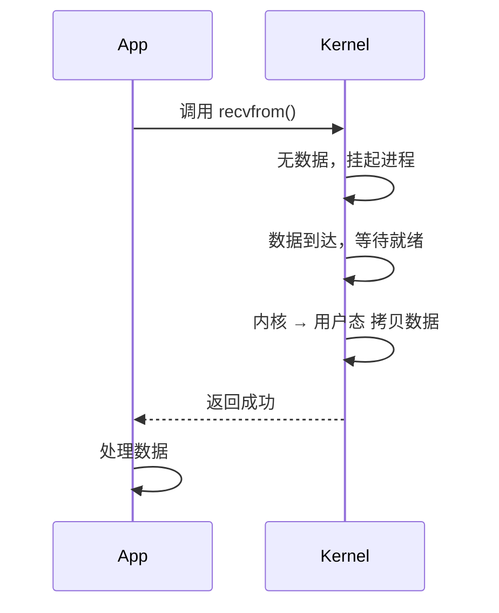
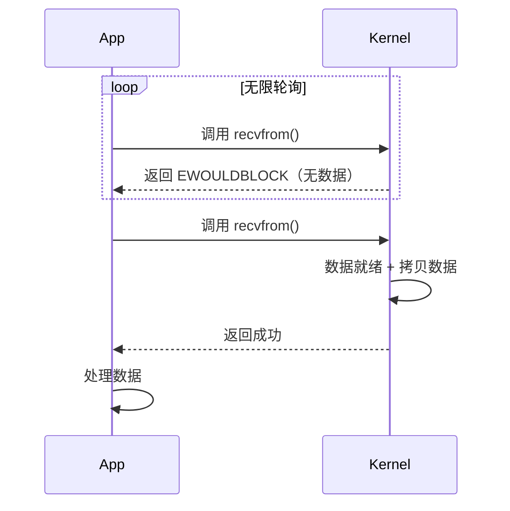
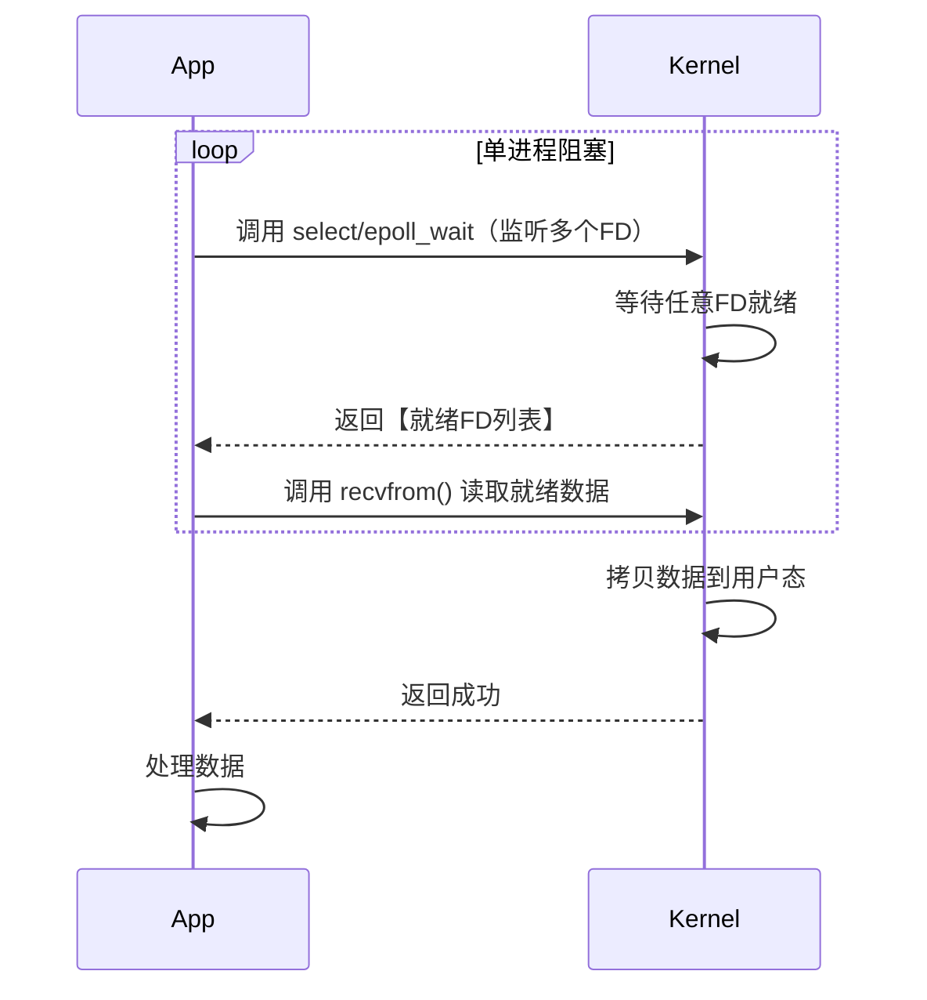
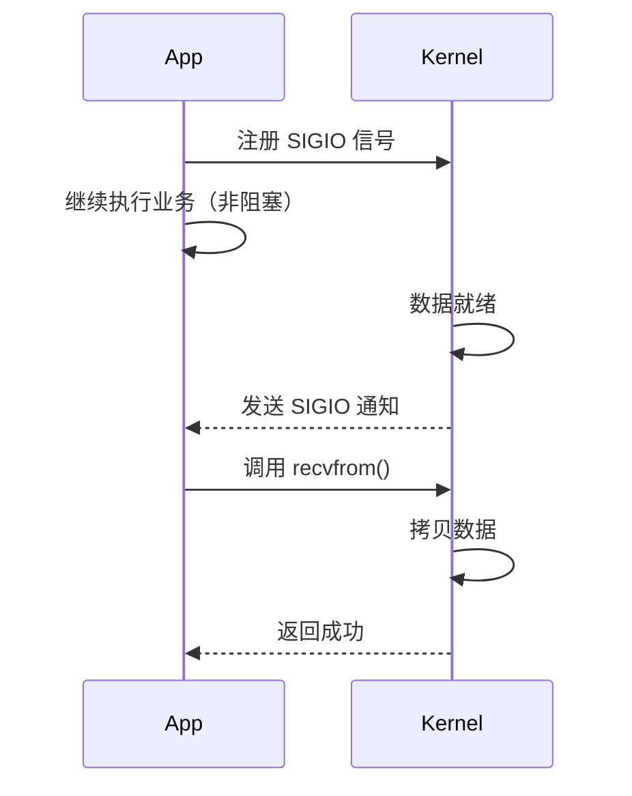
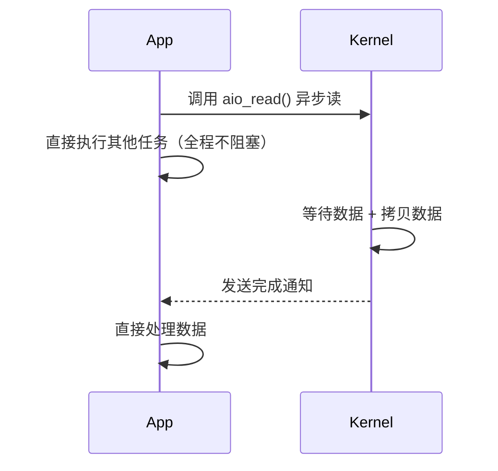

# IO模型核心原理
> 内核视角 | 无晦涩ASCII图 | Mermaid标准时序图 | 打通Java与C++底层
## 一、Netty 为何诞生？
1. **Java 1.4 之前**：JDK 仅提供 **BIO 同步阻塞IO**，一个连接绑定一个线程，高并发场景线程爆炸、性能极差。
2. **Java 1.4 NIO 出现**：封装了 `select/poll`（Linux 后升级为 `epoll`），实现 IO 多路复用，但原生 API 复杂、bug 多、无封装、开发成本极高。
3. **Netty 应运而生**：基于 JDK NIO 深度封装，屏蔽操作系统差异，简化 Reactor 模型开发，成为 Java/高并发网络编程事实标准。
## 二、底层基石：recvfrom 系统调用（所有IO模型的核心）
java 1.4之前 没有高性能IO 所以才有
拆解recvfrom:
`recvfrom` 是 POSIX 定义的**UDP 专用系统调用**，核心目标是：
> 从指定的 UDP socket 接收缓冲区中，读取一个完整的数据报，并返回数据报内容与对端地址。
```
执行阶段:
> 阶段 1：系统调用上下文切换（用户态→内核态）
>> 用户调用recvfrom(..)执行软中断 / 系统调用指令（如 syscall/int 0x80），触发用户态→内核态的上下文切换
>> 内核的系统调用分发器根据 recvfrom 的系统调用号，找到对应的内核处理函数（sys_recvfrom）
>阶段 2：内核安全与参数校验
>阶段 3：等待数据报就绪（核心异步阶段）
>> 内核检查该 socket 的 ** 接收缓冲区（环形队列）** 中，是否存在完整的 UDP 数据报：
	如果数据报已就绪：直接进入下一阶段；
	如果数据报未就绪：根据 socket 的阻塞 / 非阻塞模式，执行不同逻辑：
	阻塞模式（默认）：将当前进程设置为 TASK_INTERRUPTIBLE 状态，从 CPU 运行队列中移除（进程被挂起，让出 CPU），直到数据报到达接收缓冲区，或被信号打断（返回 EINTR 错误）。
	非阻塞模式（O_NONBLOCK）：不挂起进程，直接返回 EWOULDBLOCK 错误，告知用户进程 “数据未就绪，请稍后重试”。
>阶段 4：数据拷贝（内核态→用户态）
>> 内核态的 socket 接收缓冲区，拷贝到用户态进程提供的 buf 缓冲区
>阶段 5：返回用户态
```
✅ **核心判定规则**
- **同步IO**：数据拷贝阶段必须阻塞等待（BIO/NIO/IO多路复用/信号驱动）
- **异步IO**：全程不阻塞，内核完成所有操作后通知（仅 AIO）
---

## 三、5 种 IO 模型详解（Mermaid 时序图）

### 1. BIO 同步阻塞IO（最原始、废弃）

**特点**：调用 `recvfrom` 后全程阻塞，直到数据完成拷贝



---

### 2. 裸非阻塞轮询IO（CPU 空转，几乎不用）

**注意**：≠ Java NIO！只是死循环调用 `recvfrom`，不阻塞但耗 CPU



---

### 3. IO 多路复用（Java NIO / Netty / epoll 核心）

**最主流模型**：阻塞在 `select/epoll_wait`，**自动返回就绪 FD**，单线程管理海量连接



**select/poll**: 

**进程把多个 fd 传给 select/poll，阻塞在 select**

- 核心能力：**1 个进程监听 N 个网络连接**，不用给每个连接开线程
- 阻塞：进程调用后休眠，直到**任意一个 fd 就绪**才唤醒

**侦测多个 fd 是否就绪**

就绪 = 有数据可读 / 可以发送数据 / 连接异常

**顺序扫描 + fd 数量有限**

- 顺序扫描：内核**遍历所有 fd** 找就绪的，连接越多越慢（效率 O (n)）
- 数量限制：select 最多监听 **1024 个** fd；poll 无数量限制，但依然要遍历

**epoll：**

**事件驱动，性能更高**

- 事件驱动：内核**主动通知**哪些 fd 就绪，**不遍历全量**（效率 O (1)）
- 无 fd 数量上限（仅受系统内存限制）

| 对比项       | Selector（底层 select/poll）                      | Selector（底层 epoll）                        |
| --------- | --------------------------------------------- | ----------------------------------------- |
| 系统        | 全系统通用                                         | linux实现                                   |
| 实现原理      | 用户将所有FD 拷贝到内核->内核**遍历全部FD**找就绪->返回就绪 FD，需重新遍历 | FD 注册到内核，事件回调->内核**主动通知就绪 FD**->不遍历、不重复拷贝 |
| **上层模式**  | (Windows/Linux/Mac)阻塞等待 → 返回就绪 FD             | 阻塞等待 → 返回就绪 FD                            |
| **底层查找**  | 遍历**所有 FD**找就绪                                | 只收**就绪 FD 通知**                            |
| **效率**    | O (n)，连接多了巨慢                                  | O (1)，连接多无影响                              |
| **FD 上限** | select 最多 1024                                | 无上限（几万几十万）                                |

------

### 4. 信号驱动IO（Reactor 原型，Linux 工程不用）

**特点**：注册信号，数据就绪内核发通知，**拷贝阶段仍阻塞**



---

### 5. AIO 异步非阻塞IO（真正异步，Linux 不推荐使用）

**唯一全程不阻塞**：内核完成**等待+拷贝**后通知，无任何阻塞阶段



---

**核心差异**：异步 I/O 是唯一**两个阶段（等待数据 + 拷贝数据）进程都不阻塞**的模型，完全由内核主动通知 I/O 操作完成。

**流程特点**：

1. 调用异步读系统调用（如`aio_read`）后，内核立即返回，进程无需等待。
2. 内核独立完成「等待数据 + 拷贝数据」的全部操作，进程全程可执行其他任务。
3. 整个 I/O 操作完成后，内核才通过信号通知进程处理数据。

**工程现状**：Linux 原生异步 I/O 支持不完善，实际高并发场景更多用 epoll（IO 多路复用）配合非阻塞 IO，而非纯 AIO。

## 四、IO 多路复用核心对比

### select / poll / epoll 差异

| 特性      | select        | poll          | epoll（Linux 最优）     |
| :-------- | :------------ | :------------ | :---------------------- |
| FD 上限   | 1024          | 无            | 无（受系统内存限制）    |
| 效率      | O(n) 全量遍历 | O(n) 全量遍历 | O(1) 仅返回就绪 FD      |
| 底层实现  | 数组拷贝      | 链表拷贝      | 内核事件回调 + 共享内存 |
| Java 对应 | JDK 早期 NIO  | JDK 早期 NIO  | JDK Linux 版 Selector   |

### epoll 三大 API（= Netty 核心）

1. `epoll_create()` → 创建 `epfd` = **Netty Selector**
2. `epoll_ctl()` → 增删 FD = **Channel 注册到 Selector**
3. `epoll_wait()` → 阻塞等待 = **Selector.select()**

---

## 五、Netty ↔ Linux C++ 1:1 映射表

| Netty/Java 组件 | Linux C++ 底层 | 核心作用           |
| :-------------- | :------------- | :----------------- |
| Selector        | epfd           | 事件管理器         |
| Channel         | socket FD      | 网络连接           |
| select()        | epoll_wait()   | 获取就绪事件       |
| EventLoop       | 线程 + epfd    | Reactor 事件循环   |
| Boss Group      | 主 Reactor     | 监听连接（accept） |
| Worker Group    | 从 Reactor     | 处理读写           |


1. **高性能网络只用一种**：**IO 多路复用（epoll）+ Reactor 事件驱动**
2. **BIO 淘汰**、**裸非阻塞不用**、**AIO Linux 废弃**
3. **Selector = epfd**，自动返回就绪 FD，O(1) 效率
4. Netty 封装的就是：**epoll IO 多路复用 + 主从 Reactor 模型**

## Java里的多路复用模型

### IO多路复用

I/O多路复用的最大优势是系统开销小，系统不需要创建新的额外进程或者线程，也不需要维护这些进程和线程的运行，降低了系统的维护工作量，节省了系统资源，I/O多路复用的主要应用场景如下:

- 服务器需要同时处理多个处于监听状态或者多个连接状态的套接字;

- 服务器需要同时处理多种网络协议的套接字。

### 多路复用之下selector和epoll对比

#### epoll 三大核心优势

##### FD 数量无上限

select 限制：默认最大 1024 个 FD（由FD_SETSIZE控制，修改内核会影响性能）
epoll 无此限制，上限为系统最大文件句柄数（约 10 万 / 1GB 内存，可通过cat /proc/sys/fs/file-max查看）

##### IO 效率不随 FD 数量线性下降

select/poll：每次调用线性扫描全部 FD 集合，效率 O (n)，大量空闲连接时性能差
epoll：事件驱动 + 回调机制，仅对 “活跃” FD 操作，效率 O (1)，WAN / 大量空闲场景优势显著

##### mmap 加速消息传递

通过内核与用户空间共享同一块内存，减少不必要的内存拷贝，提升通知效率

### epoll API 更简洁

核心操作仅 4 步：
epoll_create()：创建 epoll 描述符
epoll_ctl()：添加 / 修改 / 删除监听事件
epoll_wait()：阻塞等待事件发生
关闭 epoll 描述符

### 其他系统的同类方案

kqueue（FreeBSD）：功能丰富的内核事件队列，支持信号、目录变化等多事件，边缘触发
/dev/poll（Solaris）：早期高性能接口，实现原始，现已被 epoll/kqueue 取代
