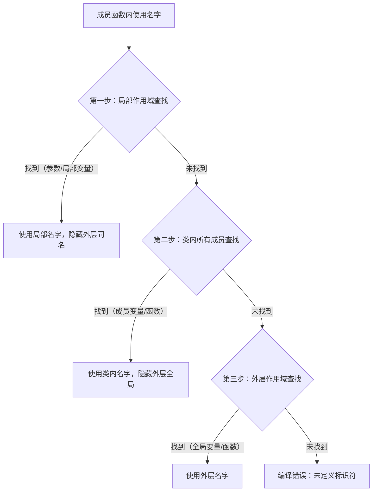

# 混淆点梳理
## 1.const用法
```c++
#include <iostream>
using namespace std;
int main() {
    // ======================
    // 1. 非const → const ✅ 合法（权限收缩）
    // ======================
    int a = 10;
    int& ref1 = a;         // 普通引用
    const int& ref2 = ref1;// 普通引用 绑定到 const引用
    // ref2 只读，安全
    // ======================
    // 2. const → 非const ❌ 非法（权限放大）
    // ======================
    const int b = 20;
    const int& ref3 = b;   // const引用
    // int& ref4 = ref3;    // 编译直接报错！！！
}
```
```
cannot bind non-const lvalue reference of type 'int&' to an lvalue of type 'const int'
```
> 不能把一个 **const 对象** 绑定到 **非 const 引用** 上！
```c++
const int b = 20;
int d = b; // ✅ 拷贝：新对象，独立内存
```
| 操作类型        | 行为       | 非 const → const | const → 非 const | 核心原因                     |
| :-------- | :--------- | :--------------- | :--------------- | :--------------------------- |
| **值拷贝**      | 创建新对象 | ✅ 合法           | ✅ 合法           | 新内存，独立权限             |
| **指针 / 引用** | 指向原对象 | ✅ 合法           | ❌ 非法           | 直接操作原内存，权限不能放大 |
1. **拷贝 = 新对象**：双向随便玩
2. **指针 / 引用 = 指向原对象**：**只能权限收缩（非 const→const），绝对不能放大**
3. 这就是 C++ `const` 安全性的底层保障！
## 可调用函数是什么callable?
 [C++ 可调用对象的统一理论框架.md](C++ 可调用对象的统一理论框架.md)  
[3-e callback_echo_server.md](3-e callback_echo_server.md) 
# 2.1 基本内置类型（对应《C++ Primer》2.1，30-32）
💥 定义
C++内置的基础数据类型，直接映射硬件层的存储单元（🌏），分为整型（含布尔/字符）和浮点型，其大小与硬件架构强相关，是所有上层数据结构的基础。
📋核心语义
1. 整型的大小满足：`char ≤ short ≤ int ≤ long ≤ long long`，具体字节数由编译器和硬件架构决定（如32位系统int为4字节，char为1字节）。
2. 浮点型用于表示小数，精度从float到double逐级提升，占用内存更大。
🎨 设计思想
1. 基本类型与硬件存储单元对齐（🌏），减少CPU访存开销，贴合底层硬件特性。
2. 类型大小的“下限规则”保证代码的可移植性，同时允许不同架构做合理扩展。
📘 书本定义与上下文详解
📘 《C++ Primer》2.1（30页）原文：「C++定义了一套包括算术类型（arithmetic type）和空类型（void）在内的基本数据类型。算术类型包含整型（integral type，包括字符和布尔类型）和浮点型。」
📘 核心类型分类表：
| 类型类别 | 具体类型    | 最小大小      | 硬件底层关联🌏             |
| :------- | :---------- | :------------ | :------------------------ |
| 整型     | bool        | 1字节         | 单比特存储，CPU按字节寻址 |
| 整型     | char        | 1字节         | 对应硬件最小寻址单元      |
| 整型     | w_char_t    | 2字节         | 宽字符                    |
| 整型     | char16_t    | 2字节         | unicon字符                |
| 整型     | char32_t    | 4字节         | unicon字符                |
| 整型     | short       | 2字节         | 对齐CPU 16位寄存器        |
| 整型     | int         | 4字节（通常） | 对齐CPU 32位通用寄存器    |
| 整型     | long        | 4/8字节       | 随架构适配（32/64位）     |
| 整型     | long long   | 8字节         | 对齐64位CPU寄存器         |
| 浮点型   | float       | 4字节         | 硬件浮点单元（FPU）处理   |
| 浮点型   | double      | 8字节         | 更高精度的FPU指令支持     |
| 浮点型   | long double | 8字节         | 更高精度的FPU指令支持     |
# 2.2 声明与初始化（对应《C++ Primer》2.2）
💥 核心：变量=内存命名存储区；声明（告诉编译器类型+名称）≠ 初始化（赋初始值），未初始化有野值风险。
📋 核心规则（记死）
1.  声明格式：`类型名 变量名;`，可直接初始化（`int a = 10;`）
2.  局部变量（栈区）未初始化→野值（栈内存残留数据）；全局变量（数据段）默认初始化0（OS清零BSS段）
3.  变量名：字母/数字/下划线组成，不能以数字开头，区分大小写
🌏 底层联动
- 局部变量存在栈区（CPU栈指针管理），未清理残留数据→野值；全局变量在数据段，OS加载时清零
- 初始化=内存创建时赋初值，赋值=覆盖已有值，二者本质不同
✅ 核心代码验证（极简版）
```cpp
#include <iostream>
using namespace std;
int global_var; // 全局变量，默认0（数据段）
int main() {
    int local_var;  // 局部变量，野值（栈区）
    int init_var = 100; // 初始化变量
    cout << "全局变量: " << global_var << "\n";    // 0
    cout << "未初始化局部变量: " << local_var << "\n"; // 随机值
    cout << "初始化局部变量: " << init_var << "\n";   // 100
    return 0;
}
```
# 2.3 unsigned类型（对应《C++ Primer》2.3）
💥 核心：无符号整型，仅存非负数，运算遵循模2ⁿ规则，溢出不报错，高频陷阱点。
📋 核心规则（记死）
1.  取值范围：`0 ~ 2ⁿ-1`（n为类型比特数），如unsigned int（32位）：0~4294967295
2.  溢出：模2ⁿ取余（如unsigned char 255+1=0），无报错
3.  混合运算：有符号数隐式转为无符号数，易出逻辑错误
🌏 底层联动
- 底层无符号编码，CPU无符号加法指令忽略进位标志位，直接取低n位
- 有符号转无符号：位模式不变（如int -1转unsigned int=4294967295）
❌ 三大陷阱（必避）
1.  溢出陷阱：`unsigned char c=255; c++` → c=0
2.  转换陷阱：`int a=-1; unsigned b=1; a<b` → false（a转无符号为最大值）
3.  循环陷阱：`for(unsigned i=10; i>=0; i--)` → 死循环（i=0-1溢出为最大值）
✅ 核心代码验证（极简版）
```cpp
#include <iostream>
using namespace std;
int main() {
    // 1. 溢出陷阱
    unsigned char uc = 255;
    uc++;
    cout << "溢出结果: " << (int)uc << "\n"; // 0
    // 2. 转换陷阱
    int a = -1;
    unsigned b = 1;
    cout << "a < b? " << boolalpha << (a < b) << "\n"; // false
    return 0;
}
```
# 2.4 指针和const
![[md_pict/image-20260512200507565.png]]
![[md_pict/image-20260512200953105.png]]
**常量指针**：指针本身不能变 → `int *const`
**指向常量的指针**：指向的值不能变 → `const int *` / `int const *`
**双 const 指针**：都不能变 → `const int *const`
```c++
 //常量指针：指针指的地址无法修改，但是对应的地址的值可以修改（也可能对应的值是常量，也就是指向常量的常量指针）
    int i = 42;
    int *const ptr1 = &i;
    //能通过常量指针改对应地址的值
    *ptr1  = 41;
    //常量
    const int ci = 42;
    const int *const cptr = &ci;
    //常量指针改对应地址的值是常量不能修；
    // *cptr  = 1;
    //指向常量的指针，但是它可能自以为是
    const int *ptr2 = &i;
    //无法修改
    // *ptr2 = 1;
    i = 2;
    //语义和ptr2相同
    int const *ptr3 = &i;
    return 0;
```
#### 个人方法
**星号*当隔断，右管地址、左管值；多级从右往左拆，一层一层判const**
- 把 **`*` 当作绝对隔断**
- `*` **右侧** → 修饰**指针本身**（地址能不能改）
- `*` **左侧** → 修饰**指向的值**（值能不能改）
- `const` 在哪边，哪边就**不能改
1. `int *const p`
   - `*` 右有const → **地址不能改**
   - `*` 左无const → **值可以改**
     → 常量指针
2. `const int *p` / `int const *p`
   - `*` 左有const → **值不能改**
   - `*` 右无const → **地址可以改**
     → 指向常量的指针（自以为是）
3. `const int *const p`
   - `*` 左右都有const → **地址、值都不能改**
     → 指向常量的常量指针
- 从**最右侧`*`开始**，往左**逐`*`拆分**
- 每一层只看：当前`*`的**右（地址）**、**左（值）**
- 一层一层判const，逐层锁定权限
**const在*右→指针地址不能改；const在*左→指向值不能改**
---

------

逐句拆解 `int const *const *p`

```cpp
int const *const *p
```

**以 * 为分隔符，从右往左一层一层拆**

- **`*` 右边 = 指针本身（地址）**
- **`*` 左边 = 指向的内容（值）**

```
int const *const   *p
```

- 这一层是 **`*p`**
- `*` 右边：**无 const**
  → **p 本身是普通指针，地址可以改**
- `*` 左边：`int const *const`
  → p 指向的是**另一个指针**

```
int const   *const   ...
```

- 这一层是 **`*const`**
- `*` 右边：**有 const**
  → **这个中间指针是常量指针，地址不能改**
- `*` 左边：`int const`
  → 指向的是 **const int**（值不能改）

1. **p 本身**：可改（普通指针）
2. **p 指向的那个指针**：不可改（const 指针）
3. **最终指向的 int 值**：不可改（const int）

**`int const *const *p`：
p 能换指向，但它指向的指针不能换地址，且最终值只读。**

#### 别名陷阱

二级指针:陷阱示例（typedef 别名导致的 const 误解）

```c++
#include <iostream>
using namespace std;

typedef int* char_t; // 别名：char_t = int*

int main() {
    int i = 2;
    const char_t ptr = &i; // 等价于int *const ptr（常量指针）
    const char_t *ptr1 = &ptr; // ptr1是指向“常量指针”的指针

    cout << **ptr1 << endl; // 输出2
    return 0;
}
```

# 3.1 using 命名空间

### 作用域

3 种核心用法

1. **访问命名空间成员**（最常用）

   ```
   std::cin; // 明确使用 std 命名空间中的 cin
   ```

2. **访问类的静态成员**

   ```
   Math::PI; // 访问 Math 类的静态常量 PI
   ```

3. **访问全局作用域标识符**（局部同名时）

   ```
   ::x; // 强制访问全局变量 x
   ```

- 配合 `using std::cin;` 可省略 `std::`，但仅引入单个名字，更安全。
- 与 `.`/`->` 的区别：`::` 用于**类 / 命名空间**，`.`/`->` 用于**对象实例**。


# 3.2 std::string 使用

#### 初始化

```c++
    string s1("test1");
    string s2(s1);
    string __s32;
    string __s4(7,'c'); //等价于string __s4 = "cccccc";
```

#### 使用

```
os<<s
将s写到输出流os当中，返回os
is>>s
从is中读取字符串赋给s，字符串以空白分隔，返回is
getline(is,s)
从is中读取一行赋给s，返回is
s.empty()
s为空返回true，否则返回false
S.size()
返回 s中字符的个数
s [n]
返回s中第n个字符的引用，位置n从0计起
sl+s2
返回 s1 和 s2 连接后的结果
sl=s2
用s2的副本代替s1中原来的字符
s1==s2
如果s1和s2中所含的字符完全一样，则它们相等：string对象的相
sl!=s2
等性判断对字母的大小写敏感
<. <=.>. >=
利用字符在字典中的顺序进行比较，且对字母的大小写敏感
```

#### 如何捕获键盘以及输出(输入"hello world and me")

```
    string s ;
    cin >> s ; //输入字符串
    cout << s << endl;
> hello

    string s ,s_1;
    cin >> s >> s_1; //输入字符串
    cout << s << s_1 << endl;
> helloworld (丢了两个)
==========================================
//getline 一次能读一行(输入流+string对象,读到换行符为止,注意换行符)

    string line;
    while (getline(cin,line))
        if (!line.empty()) {
            cout << line << endl;
        }
    return 0;
```

#### string的运算

```
比大小 > < >= <= ==
1.如果两个string对象的长度不同，而且较短string对象的每个字符都与较长
string对象对应位置上的字符相同，就说较短string对象小于较长string
对象。
2.如果两个string对象在某些对应的位置上不一致，则string对象比较的结果
其实是string对象中第一对相异字符比较的结果

相加 + 
单纯的拼接
```

#### string头文件函数(只能校验char)

```
isalnum (c)
当c是字母或数字时为真
isalpha (c)
当c是字母时为真
iscntrl(c)
当c是控制字符时为真
isdigit(c)
当c是数字时为真
isgraph (c)
当c不是空格但可打印时为真
islower(c)
当c是小写字母时为真
isprint(c)
当是可打印字符时为真（即是空格或具有可视形式）
ispunct(c)
当c是标点符号时为真（即c不是控制字符、数字、字母、可打印空白中的
一种)
isspace (c)
当○是空白时为真（即。是空格、横向制表符、纵向制表符、回车符、换行
符、进纸符中的一种）
isupper(c)
当c是大写字母时为真
isxdigit(c)
当c是十六进制数字时为真
tolower (c)
如果c是大写字母，输出对应的小写字母；否则原样输出c
toupper (c)
如果c是小写字母，输出对应的大写字母：否则原样输出
```

#### string的for循环

```
for(auto c : string){
//获取每个字符进行处理
}
```

# 3.3 vector容器

本质:一种类的模板(编译器生成类或者函数编写的一份说明)
模板的实例化:编译器根据模板创建类或者函数的过程


大部分类型的对象可以作为其元素(引用不是对象,不能作为其元素)

```
vector<int> int_vec
```

#### 如何初始化(和string很像)

```c++
vector<T> v1  					v1是一个空vector，它潜在的元素是T类型的，执行默认初始化
vector<T> v2 (vl)   			v2中包含有v1所有元素的副本
vector<T> v2 = vl				等价于v2(v1)，v2中包含有v1所有元素的副本
vector<T> v3 (n, val)			v3包含了n个重复的元素，每个元素的值都是val
vector<T> v4(n)					v4包含了n个重复地执行了值初始化的对象
vector<T> v5(a,b,c...)			v5包含了初始值个数的元素，每个元素被赋予相应的初始值
vector<T> v5={a,b,C...)			等价于v5(a,b,c...)
```

- **括号第一个参数 必定是个数**
- **要指定具体数应该使用{}**

#### 动态调节数量

push_back

```
    vector<int> vec_int_push;
    for (int i = 0; i < 100; ++i) {
        vec_int_push.push_back(i);
    }
```

# 3.4 迭代器(iterator)

```c++
    auto begin_s = s1.begin();
    auto end_s = s1.end();

    while (begin_s != end_s) {
        cout << *begin_s << endl;
        begin_s++;
    }
```

### 方法表

```
*iter					返回迭代器iter所指元素的引用
iter->mem				解引用iter并获取该元素的名为mem的成员，等价于(*iter).mem 
++iter 					令iter指示容器中的下一个元素
--iter					令iter指示容器中的上一个元素
iterl == iter2			判断两个迭代器是否相等(不相等)，如果两个迭代器指示的是同一个元素或者它们是同一个容器的尾后迭代器，则相等
iterl != iter2			反之，不相等

```

### 尾后迭代器是什么?

```
end成员则负责返回指向容器(或string对象)“尾元素的下一位置(one past theend)’的迭代器，

也就是说，该迭代器指示的是容器的一个本不存在的“尾后(offtheend)”元素。

这样的迭代器没什么实际含义，仅是个标记而已，表示我们已经处理完了容器中的所有元素。

end成员返回的迭代器常被称作尾后迭代器(off-the-enditerator)或者简称为尾迭代器(end iterator)。

特殊情况下如果容器为空，则begin和end返回的是同一个迭代器。
```

### 迭代器万能遍历写法

```c++
    // 万能写法，vector/list/map 全部通用
    for (auto it = s1.begin(); it != s1.end(); ++it) {
        cout << *it << endl;
    }

//依次输出text的每一行直至遇到第一个空白行为止
    for (auto it = text.cbegin ();it != text.cend () &&!it->empty(); ++it)
        cout << *it << endl;
```

it->empty(); 等于 (*it).empty();

> 为了简化上述表达式，C++语言定义了箭头运算符(->)。
>
> 箭头运算符把解引用和成员访问两个操作结合在一起，也就是说，it->mem和(*it).mem表达的意思相同。

#### 迭代器为什么不能用 < 

```c++
it != s1.end()  // ✅ 万能通用（vector/list/map/set 全支持）
it < s1.end()   // ❌ 只能用 vector/string（链表、红黑树不支持）
数组才连续,链表内存地址不连续
```

### 迭代器的类型

```c++
vector<int>::iterator it;			//it能读写vector<int>的元素
string::iterator it2;				//it2能读写string对象中的字符
vector<int>::const_iterator it3;	// it3只能读元素，不能写元素
string::const_iterator it4;			//it4只能读字符，不能写字符
```

const_iterator和常量指针类似,能读取但不能不能更改对应元素的值

> 如果vector或者string对象是常量则只能用:const_iterator
> 如果是一般类型则可以用const_iterator或者iterator

------

begin和end返回的具体类型由对象是否是常量决定，如果对象是常量，begin和end返回const_iterator;如果对象不是常量，返回iterator:

```c++
vector<int> v;
const vector<int> cv;

auto it2 = v.begin ();// itl 的类型是 vector<int>::iterator
auto it2 = cv.begin();// it2 的类型是 vector<int>::const iterator
```

cbegin():一种只返回const iterator的函数,如果我们只需要读不需要写,尽量用这个

```c++
auto it3 = v.cbegin (); // it3 的类型 vector<int>::const iterator
```

### 迭代器的运算

#### 数组可以运算:

| 运算类型       | 语法格式          | 核心功能                                                  | 关键注意事项                                      |
| -------------- | ----------------- | --------------------------------------------------------- | ------------------------------------------------- |
| 前移算术运算   | `iter + n`        | 迭代器向前移动 n 个元素，返回新迭代器                     | 结果需指向容器内元素 / 尾后位置，不可越界         |
| 后移算术运算   | `iter - n`        | 迭代器向后移动 n 个元素，返回新迭代器                     | 结果需指向容器内元素 / 尾后位置，不可越界         |
| 前移复合赋值   | `iter1 += n`      | iter1 向前移动 n 个元素，结果赋值给自身                   | 同前移运算，需保证不越界                          |
| 后移复合赋值   | `iter1 -= n`      | iter1 向后移动 n 个元素，结果赋值给自身                   | 同后移运算，需保证不越界                          |
| 迭代器距离运算 | `iter1 - iter2`   | 返回两个迭代器之间的元素个数（距离）类型为difference_type | 两个迭代器必须指向**同一个容器**的元素 / 尾后位置 |
| 位置关系比较   | `>` `>=` `<` `<=` | 比较两个迭代器的位置先后，位置更靠前则为小                | 两个迭代器必须指向**同一个容器**的元素 / 尾后位置 |

**difference_type**:要走多少内存位追上左侧的迭代器，其类型是名为 differencetype的带符号整型数。string和vector 都定义了 difference type，因为这个距离可正可负，所以difference_type是带符号类型的。

#### 链表的迭代器如何计算:

| 运算类型 | 语法格式            | 核心功能                       | 关键注意事项                                      |
| -------- | ------------------- | ------------------------------ | ------------------------------------------------- |
| 单步前移 | `++iter` / `iter++` | 迭代器向前移动 **1 个** 元素   | 仅支持单步移动，**不支持 `+n` 批量跳跃**          |
| 单步后移 | `--iter` / `iter--` | 迭代器向后移动 **1 个** 元素   | 仅支持单步移动，**不支持 `-n` 批量跳跃**          |
| 等值判断 | `iter1 == iter2`    | 判断两个迭代器是否指向同一位置 | 必须是同一个容器的迭代器                          |
| 不等判断 | `iter1 != iter2`    | 判断两个迭代器是否指向不同位置 | **链表唯一通用结束条件**（如 `it != list.end()`） |
| 解引用   | `*iter`             | 访问迭代器指向的元素           | 不可解引用 `end()` 迭代器                         |
| 成员访问 | `iter->`            | 访问元素的成员 / 函数          | 等价于 `(*iter).xxx`                              |

##### ❌ 链表迭代器 **完全不支持** 的运算（编译直接报错）

所有数组 /vector 支持的批量运算，链表**全部禁用**：

1. 算术运算：`iter + n` / `iter - n` / `iter += n` / `iter -= n`
2. 距离运算：`iter1 - iter2`
3. 大小比较：`>` / `>=` / `<` / `<=`

------

##### ✅ 链表替代方案（通用标准函数）

如果需要批量移动 / 计算距离，**必须用标准库函数**：

1. 批量移动：`std::advance(iter, n)`
2. 计算距离：`std::distance(iter1, iter2)`

```cpp
#include <iterator>
list<int> l = {1,2,3,4};
auto it = l.begin();
advance(it, 2);   // 移动2步，替代 it+2
distance(l.begin(), it); // 计算距离，替代 it - begin()
```

# 6.1函数基础

### 自动对象（核心底层概念）
#### 1. 定义
普通局部变量、**函数形参**都是**自动对象**
- 分配位置：**栈内存**
- 生命周期：进入`{}`代码块自动创建，离开代码块**自动销毁**
- 本质：函数栈帧的创建与销毁，和Java局部变量逻辑一致

#### 2. 初始化规则（和Java最大区别）
```cpp
int a; // 内置类型局部变量不初始化 → 栈脏值（未定义值）
int b = 10; // 显式初始化
```
✅ Java：局部变量必须初始化，否则编译报错
❌ C++：内置类型局部变量默认不初始化，直接用会读取脏数据

#### 3. 关键：形参为什么是自动对象？
形参=**函数内的局部变量**，实参只是拷贝值给形参
- 函数调用：栈上创建形参变量
- 函数结束：栈帧销毁，形参直接消失
- 对应Java：方法的形参也是栈上局部变量，逻辑完全一致

---

# 6.2 参数传递

### 形参与实参｜值传递｜指针传参（联动Java Map传参）

**所有传参都是值传递**，形参是实参的**拷贝副本（自动对象）**
1. 改**指针/引用指向的内容** → 外部实参同步变化
2. 改**指针/引用变量本身的指向** → 外部实参无变化

####  指针形参示例（对应Java传Map）
```cpp
void reset(int *ip) {
    *ip = 0;  // ✅ 修改指针指向的内存值 → 外部i同步变
    ip = 0;   // ❌ 修改局部指针ip的指向 → 外部无变化
}
```
#### Java 等价示例（完全同逻辑）

```java
void test(Map map) {
    map.put("a",1); // ✅ 改对象内容，外部生效
    map = new HashMap(); // ❌ 改形参指向，外部无效
}
```
#### 通俗理解
实参、形参是**2把独立钥匙**，开同一间房子
- 改房子里的东西 → 两边都能看到
- 换自己手里的钥匙 → 互不影响

------

### 常量引用 `const &` 形参（必记最佳实践）

#### 3个致命问题：不能用普通引用 `T&`
1. **语义误导**：函数不修改实参，用`T&`会让调用者误以为会修改
2. **传参受限**：普通引用不能传字面量、`const`对象、临时对象
3. **调用链连锁报错**：上层函数用`const &`，下层普通引用无法接收

#### 正确用法&对标过往知识点
| 形参写法          | 权限 | 对标知识点                    | 使用场景                     |
| ----------------- | ---- | ----------------------------- | ---------------------------- |
| `string &s`       | 读写 | 普通指针、值传递              | 函数需要修改实参             |
| `const string &s` | 只读 | `const`指针、`const_iterator` | 函数不修改实参（**优先用**） |

✅ **最佳实践**：只要函数不修改实参，一律用`const T&`，和迭代器`cbegin/cend`只读设计完全统一

---

### 数组形参｜本质传指针（联动迭代器首尾指针）
#### 核心底层
数组2个特性：**不能拷贝、自动转指针**
- 数组传参本质：传递**数组首元素的指针**
- 3种写法完全等价：
```cpp
void print(const int*);
void print(const int[]);
void print(const int[10]); // 数字10仅提示，编译器忽略
```
- 致命问题：函数**不知道数组真实长度**，必须额外传递边界信息

#### 3种安全传参方式（优先级+优缺点）
##### 方式1：结尾标记（仅限字符串）
```cpp
void print(const char *cp) {
    while(*cp) cout << *cp++; // 以'\0'为结束标记
}
```
- 优点：不用传长度，字符串场景简洁
- 缺点：int/double数组无法用（0是合法数据，无法区分结束标记）
- 使用场景：仅处理`char[]`字符串

##### 方式2：首尾指针（现代C++首选｜对标迭代器）
```cpp
void print(const int *beg, const int *end) {
    while(beg != end) cout << *beg++;
}
// 调用：print(begin(j), end(j))
```
- 优点：和迭代器遍历逻辑**完全一致**，标准库规范，不易越界
- 缺点：新手理解稍绕
- 使用场景：正式项目、现代C++通用写法

##### 方式3：显式传size（新手最友好｜对标Java.length）
```cpp
void print(const int ia[], size_t size) {
    for(size_t i=0; i!=size; ++i) cout << ia[i];
}
```
- 优点：写法直白，贴近Java习惯，新手易懂
- 缺点：调用者传错size会越界
- 使用场景：日常业务代码、兼容C语言

现代项目：**首尾指针 > 显式传size > 结尾标记**
日常业务：**显式传size > 首尾指针 > 结尾标记**
字符串场景：仅用**结尾标记**

### 可变形参的函数

如果所有的实参类型相同:可以传递initializer_list的标准库类型

# 6.4 函数重载


复习2个核心旧知识点（必须区分）：
| 类型     | 写法         | const 类型     | 含义                           |
| -------- | ------------ | -------------- | ------------------------------ |
| 指针常量 | `T* const p` | **顶层 const** | 限制**指针本身**不可修改       |
| 常量指针 | `const T* p` | **底层 const** | 限制**指针指向的对象**不可修改 |

---

### 一、顶层 const：**不参与函数重载**，声明等价
#### 1. 普通值类型（值传递，形参是自动对象）
```cpp
Record lookup(Phone);
Record lookup(const Phone); // 和上一个完全等价，重复声明
```
- `const Phone` 是**顶层const**：仅限制**函数内部不能修改形参这个局部变量**
- 形参是**值传递（自动对象）**，拷贝实参，外部调用者完全感知不到这个const
- 编译器认为：2个函数是同一个，**无法重载**
- 说白了 等价于 int i 可以等于 const in j,他们可以互相等;

#### 2. 指针类型（指针常量 = 顶层const）

```cpp
Record lookup(Phone*);
Record lookup(Phone* const); // 和上一个完全等价，重复声明
```
- `Phone* const` 是**指针常量（顶层const）**：限制**指针本身**不能修改
- 指针形参也是**值传递**，函数内不能改指针地址，外部调用无区别
- 依旧**无法重载**

> 一句话：**顶层const只约束函数内部，外部调用无差异 → 不能重载**

---

### 二、底层 const：**可以参与函数重载**，是独立函数
底层const约束的是**实参本身**，编译器可以区分，因此可以重载。
#### 1. 引用形参（底层const）
```cpp
Record lookup(Account&);          // 接收普通对象
Record lookup(const Account&);    // 接收const对象（底层const）
```
- `const Account&`：**底层const**，要求传入**const对象**
- 非const实参 → 优先匹配普通引用版本；const实参 → 只能匹配const引用版本

#### 2. 指针形参（常量指针 = 底层const）
```cpp
Record lookup(Account*);          // 接收普通对象指针
Record lookup(const Account*);    // 接收const对象指针（底层const）
```
- `const Account*`：**常量指针（底层const）**，限制指向的对象不可修改
- 和普通指针是**2个独立重载函数**

> 一句话：**底层const约束实参类型，调用时可区分 → 可以重载**


1. **顶层 const（指针常量/普通变量const）**：值传递，仅内部生效 → **不能重载**
2. **底层 const（常量指针/const引用）**：约束实参，外部可区分 → **可以重载**
3. 非const实参优先匹配**非const版本**；const实参只能匹配**底层const版本**

### const_cast
#### 一、核心作用
仅用于**修改引用/指针的 const 属性**，不能改变变量类型

#### 二、两种用法
1. **去 const（只读 → 可修改）**
   必须手动写，**唯一核心用途**
   ```cpp
   const string& s = "abc";
   string& res = const_cast<string&>(s);
   ```

2. **加 const（可修改 → 只读）**
   C++ 会**自动转换**，无需写 `const_cast`

#### 三、关键规则
✅ 非const → const：自动支持
✅ const → 非const：必须用 `const_cast`

#### 四、结合重载示例
```cpp
// 只读版本
const string& func(const string& s);
// 读写版本
string& func(string& s) {
  // 调用只读版本（自动加const）
  auto& r = func(s);
  // 去const，返回可修改引用
  return const_cast<string&>(r);
}
```

# 7.1 类的抽象类型

## 7.1.1 如何优雅的访问成员变量(this指针解析)

将成员函数还原为「显式传递 this 指针」的底层形式，彻底拆解 `this` 指针、const 成员函数的编译逻辑，搭配可运行Demo验证。

---

### 1. 核心前提（教材原文逻辑）
C++ 中，**所有非静态成员函数，编译器都会隐式插入 `this` 指针作为第一个参数**：
1. `this` 是指向**调用该函数的对象**的指针
2. 函数体内直接访问成员变量 → 编译器自动替换为 `this->成员变量`
3. 静态成员函数没有 `this` 指针

以 `Sales_data::isbn()` 为例，教材会将成员函数**重构成带显式 `this` 参数的普通函数**。

#### 1.1 教材风格：原始函数 ↔ 伪代码展开

```cpp
// 1. 我们写的代码（成员函数）
string isbn() const { return bookNo; }

// 2. 编译器重构后的伪代码（教材核心解释）
string isbn(Sales_data *this) {
    return this->bookNo;  // 成员变量自动加 this->
}
```

#### 1.2 完整可运行Demo
```cpp
#include <iostream>
#include <string>
using namespace std;

struct Sales_data {
    string bookNo;   // 书籍ISBN
    int units_sold = 0;

    // 原始成员函数
    string isbn() {
        // 等价于 return this->bookNo;
        return bookNo;
    }
};

int main() {
    Sales_data data{"9780131103627"};
    
    // 调用：data.isbn() → 编译器隐式传 &data 给 this
    cout << "ISBN: " << data.isbn() << endl;

    return 0;
}
```

#### 1.3 教材式总结

- #### 调用 `data.isbn()` → 编译器翻译为 `isbn(&data)`
- `this` 指针默认类型：`Sales_data* const`（**指针地址不可修改，指向的对象可修改**）

---

### 2. 修改变量的成员函数：Combine 展开演示

以汇总交易的 `combine` 函数为例，直观体现 `this` 指针修改对象的逻辑。

#### 2.1 教材风格：原始函数 ↔ 伪代码展开
```cpp
// 1. 我们写的代码
Sales_data& combine(const Sales_data &rhs) {
    units_sold += rhs.units_sold;
    return *this;
}

// 2. 编译器重构后的伪代码
Sales_data& combine(Sales_data *this, const Sales_data &rhs) {
    this->units_sold += rhs.units_sold;
    // 返回当前对象（解引用 	this）
    return *this;
}
```

#### 2.2 完整可运行Demo
```cpp
#include <iostream>
#include <string>
using namespace std;

struct Sales_data {
    string bookNo;
    int units_sold = 0;

    Sales_data& combine(const Sales_data &rhs) {
        units_sold += rhs.units_sold;
        return *this;
    }
};

int main() {
    Sales_data data1{"ISBN-001", 5};
    Sales_data data2{"ISBN-001", 3};

    data1.combine(data2);
    cout << "总销量：" << data1.units_sold << endl;  // 输出 8

    return 0;
}
```

#### 2.3 教材式总结
- `this` 指针指向调用者 `data1`，因此可以直接修改其成员变量
- `return *this`：返回当前对象本身（解引用指针）

---

### 3. const 成员函数：核心重点（教材必考）
**const 成员函数的本质：修改 `this` 指针的类型**
普通 `this`：`T* const`
const 成员函数 `this`：`const T* const`（**指针和指向的对象都不可修改**）

#### 3.1 教材风格：原始函数 ↔ 伪代码展开
```cpp
// 1. 我们写的 const 成员函数
string isbn() const { return bookNo; }

// 2. 编译器重构后的伪代码（关键差异）
string isbn(const Sales_data *this) {
    return this->bookNo;
}
```

#### 3.2 完整可运行Demo（验证const约束）
```cpp
#include <iostream>
#include <string>
using namespace std;

struct Sales_data {
    string bookNo;
    int units_sold = 0;

    // const 成员函数：this 是 const 指针
    string isbn() const {
        // ✅ 只读访问：允许
        return bookNo;
        
        // ❌ 编译报错：const 成员函数不能修改成员变量
        // units_sold = 100;
    }

    // 普通成员函数
    void test() {
        units_sold = 100;  // ✅ 允许修改
    }
};

int main() {
    // const 对象：只能调用 const 成员函数
    const Sales_data data{"ISBN-002"};
    cout << data.isbn() << endl;

    // ❌ 编译报错：const 对象不能调用普通成员函数
    // data.test();

    return 0;
}
```

#### 3.3 教材式核心结论
1. const 成员函数 → `this` 变为 **指向常量对象的常量指针**
2. 约束：**不能修改对象的任何非 mutable 成员**
3. 规则：`const` 对象 → 只能调用 `const` 成员函数

#### 3.4 const衍生处理

`const` 成员函数的本质是修改隐式 `this` 指针的类型，且 `const` 是**成员函数签名的一部分**，声明与定义必须严格匹配：

| 函数类型         | `this` 指针类型  | 核心语义                                             |
| ---------------- | ---------------- | ---------------------------------------------------- |
| 普通成员函数     | `T* const`       | 可修改对象成员，不可修改指针地址                     |
| `const` 成员函数 | `const T* const` | 不可修改对象成员（`mutable` 除外），不可修改指针地址 |

##### 1. 正确写法（教材标准示例）
```cpp
// 类内声明：const 必须写在参数列表之后
class Sales_data {
public:
    double avg_price() const;
private:
    unsigned units_sold = 0;
    double revenue = 0.0;
};

// 类外定义：必须与声明的 const 位置、数量完全一致
double Sales_data::avg_price() const {
    if (units_sold) return revenue / units_sold;
    else return 0;
}
```

##### 2. 错误场景1：声明加 `const`，定义省略
```cpp
// 声明：const 成员函数
class Sales_data {
public:
    double avg_price() const;
};

// 错误：定义省略 const，签名不匹配
double Sales_data::avg_price() {
    // ...
}
```
- **典型报错**：`undefined reference to Sales_data::avg_price() const`
- **根本原因**：编译器认为声明的 `const` 成员函数与定义的普通成员函数是两个不同签名的函数，链接时找不到实现。
- **修正**：定义的参数列表后补全 `const`。

##### 3. 错误场景2：`const` 写在返回值前（修饰返回值，而非成员函数）
```cpp
// 错误：const 修饰返回值，不影响成员函数签名
const double Sales_data::avg_price() {
    // ...
}
```
- **问题本质**：此处 `const` 修饰的是返回值（表示返回 `const double`），不是成员函数本身，编译器不会将其视为 `const` 成员函数，仍会导致与声明不匹配。
- **修正**：将 `const` 移到参数列表之后。

##### 4. 错误场景3：声明无 `const`，定义加了 `const`
```cpp
class Sales_data {
public:
    double avg_price(); // 声明：普通成员函数
};

// 错误：定义加 const，签名不匹配
double Sales_data::avg_price() const {
    // ...
}
```
- **典型报错**：`redefinition of 'avg_price' as different kind of symbol`
- **根本原因**：声明的是普通成员函数（`this` 为 `T* const`），定义的是 `const` 成员函数（`this` 为 `const T* const`），签名不一致。
- **修正**：要么声明也加 `const`，要么定义去掉 `const`。

---

##### 成员函数的核心约束（能做什么/不能做什么）
✅ 允许的操作

1. 读取类内所有成员变量（包括私有成员）
2. 调用其他 `const` 成员函数
3. 返回成员变量的 `const` 引用/拷贝
```cpp
class Sales_data {
public:
    const std::string& isbn() const { // const 成员函数
        return bookNo; // ✅ 读取成员变量
    }
private:
    std::string bookNo;
};
```

❌ 禁止的操作

1. 修改类内非 `mutable` 成员变量
2. 调用非 `const` 成员函数
3. 返回成员变量的非 `const` 引用（会突破 `const` 约束）
```cpp
class Sales_data {
public:
    void bad_func() const {
        units_sold = 100; // ❌ 报错：修改 const 对象的成员
        set_revenue(1000); // ❌ 报错：调用非 const 成员函数
    }
private:
    unsigned units_sold = 0;
    double revenue = 0.0;
    void set_revenue(double rev) { revenue = rev; } // 非 const 成员函数
};
```

---

##### 四、进阶：`const` 与非 `const` 成员函数重载
`const` 可作为成员函数的重载条件，为同一函数提供两个版本，根据调用对象的 `const` 属性自动匹配：
```cpp
class Sales_data {
public:
    // 非 const 版本：返回非 const 引用，允许修改
    std::string& isbn() { return bookNo; }
    // const 版本：返回 const 引用，禁止修改
    const std::string& isbn() const { return bookNo; }
private:
    std::string bookNo;
};

// 调用匹配规则
Sales_data obj;
obj.isbn() = "978-1234"; // ✅ 调用非 const 版本，允许修改

const Sales_data c_obj;
// c_obj.isbn() = "978-5678"; // ❌ 报错：调用 const 版本，返回 const 引用，不可修改
```

##### 底层伪代码差异（呼应之前的 `this` 逻辑）
```cpp
// 非 const 版本：this 为 Sales_data* const
std::string& Sales_data::isbn(Sales_data* const this) {
    return this->bookNo;
}

// const 版本：this 为 const Sales_data* const
const string& Sales_data::isbn(const Sales_data* const this) {
    return this->bookNo;
}
```

---

##### 五、常见错误排查速查表
| 错误场景                                  | 典型报错信息                                                 | 根本原因                                                     | 修正方法                                                  |
| ----------------------------------------- | ------------------------------------------------------------ | ------------------------------------------------------------ | --------------------------------------------------------- |
| 声明 `const`，定义省略                    | `undefined reference to func() const`                        | 签名不匹配，链接器找不到实现                                 | 定义的参数列表后补全 `const`                              |
| `const` 写在返回值前                      | 链接报错/编译不报错但无 `const` 语义                         | 修饰的是返回值，不是成员函数                                 | 将 `const` 移到参数列表后                                 |
| `const` 对象调用非 `const` 成员函数       | `passing const T as this argument discards qualifiers`       | 非 `const` 成员函数的 `this` 无法绑定到 `const T` 对象       | 调用 `const` 成员函数，或去掉对象的 `const`               |
| `const` 成员函数内修改成员变量            | `assignment of member 'x' in read-only object`               | `this` 为 `const T* const`，对象是只读的                     | 1. 去掉函数的 `const` 属性；2. 将成员变量声明为 `mutable` |
| `const` 成员函数返回成员的非 `const` 引用 | `binding reference of type 'T&' to 'const T' discards qualifiers` | 突破了 `const` 对象的只读约束(向外部提供一个修改非const对象的地址/方式) | 将返回值改为 `const T&`                                   |

---

##### 六、补充：`mutable` 关键字（突破 `const` 约束）
若需要在 `const` 成员函数中修改某个成员变量（如调试计数器、缓存状态），可将其声明为 `mutable`：
```cpp
class Sales_data {
public:
    void debug() const {
        call_count++; // ✅ 允许修改 mutable 成员
    }
private:
    mutable int call_count = 0; // mutable 修饰，可在 const 函数中修改
};
```

## 7.1.2 C++ 构造函数规则

1. 名称和**类/结构体名完全一致**，无返回值
2. 作用：创建对象时，**初始化成员变量**
3. 自定义构造函数后，编译器**不再自动生成默认构造函数**

### `Sales_data() = default;`

#### 作用

显式要求编译器**自动生成默认构造函数**（无参构造）

#### 适用场景

自定义了其他构造函数，还想支持**无参创建对象**（如 `Sales_data data;`）

#### 等价效果

编译器自动用**类内初始值**初始化所有成员

```cpp
// 等价手写（推荐用 = default，更简洁高效）
Sales_data() {}
```

---

### `Sales_data(const std::string &s) : bookNo(s) { }`

#### 核心：成员初始化列表（`:` 后的内容）

1. 语法：`构造函数(参数) : 成员名(初始值) { }`
2. 执行时机：**构造函数体执行前**，直接初始化成员
3. 优势：效率更高，支持 `const`/引用成员初始化

#### 代码含义

- 接收字符串参数 `s`
- 用 `s` 初始化成员 `bookNo`
- 其余成员（`units_sold`/`revenue`）自动使用类内初始值

```cpp
#include <iostream>
#include <string>

struct Sales_data {
    // 成员变量 + 类内初始值
    std::string bookNo;
    unsigned units_sold = 0;
    double revenue = 0.0;

    // 核心1：编译器生成默认构造函数
    Sales_data() = default;

    // 核心2：带参构造 + 成员初始化列表
    Sales_data(const std::string &s) : bookNo(s) { }

    // 辅助：完整参数构造
    Sales_data(const std::string &s, unsigned n, double p) 
        : bookNo(s), units_sold(n), revenue(n * p) { }
};

// 测试调用
int main() {
    Sales_data data1;                // 调用 = default 无参构造
    Sales_data data2("C++ Primer");  // 调用初始化列表构造
    return 0;
}
```

### 成员初始化列表 VS 函数体内赋值

| 写法              | 效率 | 适用成员                 |
| ----------------- | ---- | ------------------------ |
| `: bookNo(s)`     | 高   | 所有成员（含const/引用） |
| `{ bookNo = s; }` | 低   | 普通非const成员          |

### `= default` 作用

自定义构造函数后，**保留无参创建对象的能力**

1. `= default`：快速生成无参默认构造函数
2. 成员初始化列表（`:`）：高效初始化成员，C++ 构造函数首选写法
3. 两种语法配合，实现对象的**灵活、高效初始化**

# 7.2 类的访问控制与封装

## struct和class修饰的区别:

| 关键字   | 默认访问权限（第一个访问说明符之前） | 访问说明符之后的成员 | 常见使用场景               |
| -------- | ------------------------------------ | -------------------- | -------------------------- |
| `struct` | `public`                             | 按访问说明符生效     | 纯数据聚合、POD 类型       |
| `class`  | `private`                            | 按访问说明符生效     | 封装数据与方法、面向对象类 |

```c++
// 合法但不推荐：struct 定义 private 为主的类
struct BadStruct {
private:
    string secret_data; // 私有成员
public:
    void set_secret(const string& s) { secret_data = s; }
    string get_secret() const { return secret_data; }
};

// 合法但不推荐：class 定义 public 为主的类
class BadClass {
public:
    string bookNo;
    unsigned units_sold;
};
```

## 友元

> C++ 友元函数 vs 公有接口(Public) 最佳实践解析

### 一、核心前置知识

#### 1. 两个关键概念
1. **`friend` 友元**：**打破封装**，允许外部函数/类直接访问类的**私有(private)成员**，是C++的权限后门；
2. **`public` 公有接口**：**遵守封装**，类主动开放的公共方法，外部只能通过这些接口操作对象，**无法直接访问私有成员**。

#### 2. 核心设计原则（C++ 官方/教材推荐）
> 尽可能使用 **公有接口** 实现功能，仅在**必须直接访问私有成员**时才使用友元；
> 非成员函数 + 公有接口 = 最安全、最简洁、最易维护的方案。

---

### 二、两种方案完整对比
| 方案                       | 实现方式                                         | 优点                                                         | 缺点                                              | 适用场景                               |
| -------------------------- | ------------------------------------------------ | ------------------------------------------------------------ | ------------------------------------------------- | -------------------------------------- |
| 友元函数（教材原始方案）   | 类内声明`friend`，外部函数直接访问私有成员       | 性能略高（直接访问）                                         | 1. 需要重复声明<br>2. 破坏封装<br>3. 代码耦合度高 | 运算符重载、必须直接操作私有成员的场景 |
| 纯公有接口（最佳折中方案） | 外部函数**仅调用public成员方法**，不访问私有成员 | 1. 无友元、无重复声明<br>2. 遵守封装、安全<br>3. 语法对称、易维护<br>4. 无权限风险 | 无明显缺点（标准工程首选）                        | 90%的业务逻辑、工具函数、辅助函数      |

---

### 三、完整可运行代码（无友元 + 纯公有接口）
这是**最终推荐版**：删除所有`friend`，通过`public`成员函数实现`add/read/print`，无重复声明，代码极简。

```cpp
#include <iostream>
#include <string>
#include <cstdlib>
using namespace std;

// ==============================================
// 【教材核心：友元版 → 必须在这里「再一次声明」函数！】
// 第二次声明：全局作用域函数声明（让外部能调用）
// 这就是教材说的：再一次申明！！！
// ==============================================
class Sales_data;  // 类前向声明
Sales_data add(const Sales_data&, const Sales_data&);
istream& read(istream&, Sales_data&);
ostream& print(ostream&, const Sales_data&);

// ==============================================
// 模式切换：1=无友元版  0=友元版（带两次声明）
// ==============================================
#define NO_FRIEND_MODE 0

#if NO_FRIEND_MODE
// ===================== 无友元版（无需两次声明） =====================
class Sales_data {
public:
    Sales_data() = default;
    Sales_data(const string& s) : bookNo(s) {}

    string isbn() const { return bookNo; }
    unsigned get_units_sold() const { return units_sold; }
    double get_revenue() const { return revenue; }
    void set_data(const string& no, unsigned n, double rev) {
        bookNo = no;
        units_sold = n;
        revenue = rev;
    }
    Sales_data& combine(const Sales_data& rhs);

private:
    string bookNo;
    unsigned units_sold = 0;
    double revenue = 0.0;
};

// 普通全局函数，无需friend
Sales_data add(const Sales_data& lhs, const Sales_data& rhs) {
    Sales_data sum = lhs;
    sum.combine(rhs);
    return sum;
}
ostream& print(ostream& os, const Sales_data& item) {
    os << "ISBN: " << item.isbn() << " 销量: " << item.get_units_sold() << " 收入: " << item.get_revenue();
    return os;
}
istream& read(istream& is, Sales_data& item) {
    string no; unsigned n; double price;
    is >> no >> n >> price;
    item.set_data(no, n, price*n);
    return is;
}

#else
// ===================== 友元版（★★★ 两次声明，教材标准！★★★） =====================
class Sales_data {
    // ==============================================
    // 第一次声明：类内 friend 授权（仅给权限）
    // ==============================================
    friend Sales_data add(const Sales_data&, const Sales_data&);
    friend istream& read(istream&, Sales_data&);
    friend ostream& print(ostream&, const Sales_data&);

public:
    Sales_data() = default;
    Sales_data(const string& s) : bookNo(s) {}
    string isbn() const { return bookNo; }
    Sales_data& combine(const Sales_data& rhs);

private:
    string bookNo;
    unsigned units_sold = 0;
    double revenue = 0.0;
};

// 友元函数实现
Sales_data add(const Sales_data& lhs, const Sales_data& rhs) {
    if (lhs.bookNo != rhs.bookNo) { exit(1); }
    Sales_data sum = lhs;
    sum.combine(rhs);
    return sum;
}
ostream& print(ostream& os, const Sales_data& item) {
    os << item.bookNo << item.units_sold << item.revenue;
    return os;
}
istream& read(istream& is, Sales_data& item) {
    double price;
    is >> item.bookNo >> item.units_sold >> price;
    item.revenue = price * item.units_sold;
    return is;
}
#endif

// 共用实现
Sales_data& Sales_data::combine(const Sales_data& rhs) {
    units_sold += rhs.units_sold;
    revenue += rhs.revenue;
    return *this;
}

// 主函数
int main() {
    Sales_data a, b;
    read(cin, a);
    read(cin, b);
#if NO_FRIEND_MODE
    if(a.isbn() == b.isbn()) print(cout, add(a,b)) << endl;
#else
    print(cout, add(a,b)) << endl;
#endif
    return 0;
}
```

---

### 四、深度解析：折中方案的核心逻辑
##### 1. 为什么这个方案**不需要友元**？
- 友元的唯一作用：**直接访问私有成员**；
- 本方案中：`add/read/print` **从不直接访问** `bookNo/units_sold/revenue`；
- 所有操作都通过**公有成员函数**（`combine/set_data/getter`）完成；
- 编译器不需要权限授权，自然**不需要`friend`声明**。

##### 3. 底层调用流程（一目了然）
```
外部函数(add/print/read) 
  ↓ 调用
公有成员方法(isbn/combine/set_data) 
  ↓ 内部访问
私有成员(bookNo/units_sold/revenue)
```

---

### 五、友元 与 Public 的核心关系总结
##### 1. 本质关系

1. **对立关系**：
   - `public`：**封装的守护者**，严格限制外部访问权限；
   - `friend`：**封装的突破者**，主动开放私有成员的访问权限。
2. **互补关系**：
   - 日常功能 → 用`public`；
   - 特殊场景（运算符重载、底层工具）→ 用`friend`。

##### 2. 权限边界（最重要）

| 维度              | 无友元版（推荐）         | 友元版（必须授权）        |
| ----------------- | ------------------------ | ------------------------- |
| 私有成员访问方式  | **间接调用 public 方法** | **直接读写 private 成员** |
| 是否需要 `friend` | ❌ 不需要                 | ✅ **必须加**              |
| 封装性            | ✅ 完美（遵守封装）       | ⚠️ 部分破坏封装            |
| 代码复杂度        | ✅ 低（无重复声明）       | ❌ 高（必须友元声明）      |
| 适用场景          | 99% 日常开发             | 极致封装 / 运算符重载     |

##### 3. 一句话总结
> **公有接口是常态，友元是例外；能用公有接口实现的功能，永远不要用友元。**

---

### 六、最终使用建议
1. **新手/工程开发**：优先使用 **无友元 + 公有接口** 方案；
2. **学习教材**：理解友元的原理，但写代码时用折中方案；
3. **必须用友元的唯一场景**：需要**直接读写私有成员**，且无法通过public接口实现（如流运算符重载）。

# 7.3 类的其他特性

## inline内联怎么用

### 一、极简源码示例（Screen类内联/非内联对比）

#### 1. 头文件 `screen.hpp`
```cpp
#include <string>
using std::string;

class Screen {
public:
    using pos = string::size_type;

    // 情况1：类内写函数体 → 隐式内联（无需inline）
    char get() const { return contents[cursor]; }  // ✅ 推荐写法
    
    // 情况2：类内声明，类外实现（非内联）
    char get(pos ht, pos wd) const;  // 声明
    
    // 情况3：类内声明，类外实现（显式内联）
    Screen& move(pos r, pos c);      // 声明
    void set(char c);                // 声明

private:
    pos cursor = 0;
    pos height = 0, width = 0;
    string contents;
};

// 情况2实现：非内联（不加inline，放.cpp）
// char Screen::get(pos ht, pos wd) const { ... }  // 移至screen.cpp

// 情况3实现：显式内联（必须加inline，放头文件）
inline Screen& Screen::move(pos r, pos c) {
    cursor = r * width + c;
    return *this;
}

inline void Screen::set(char c) {
    contents[cursor] = c;
}
```

#### 2. 源文件 `screen.cpp`
```cpp
#include "screen.hpp"

// 情况2：非内联函数实现（不加inline，放.cpp）
char Screen::get(pos ht, pos wd) const {
    pos row = ht * width;
    return contents[row + wd];
}
```

---

### 二、核心结论对比表（一目了然）

| 场景             | 写法示例                          | 是否需要`inline`     | 实现位置 | 编译器行为                   | 工程建议                     |
| ---------------- | --------------------------------- | -------------------- | -------- | ---------------------------- | ---------------------------- |
| **类内函数体**   | `char get() const { ... }`        | ❌ 不需要（隐式内联） | 头文件   | 自动视为内联，加`inline`冗余 | 推荐：不加`inline`，简洁清晰 |
| **类外非内联**   | 类内声明+`.cpp`实现（无`inline`） | ❌ 不需要             | `.cpp`   | 普通函数，避免重复定义       | 推荐：适合函数体较大场景     |
| **类外显式内联** | 类内声明+头文件`inline`实现       | ✅ 必须在实现处加     | 头文件   | 内联函数，允许多次定义       | 推荐：仅短小高频函数使用     |
| **错误写法**     | 类内声明`inline`+类外无`inline`   | ❌ 声明处`inline`无效 | 任意     | 链接错误（重复定义）         | 禁止：违反ODR规则            |

---

### 三、关键规则速记
1. **类内写函数体 = 隐式内联**，加`inline`是冗余操作，现代编译器会自动处理 
2. **类外实现要内联，必须加`inline`且放头文件**，否则多文件编译会报错 
3. **`inline`是编译器优化建议**，不是强制指令，函数过大/递归会被拒绝内联 
4. **声明与实现分离**是工程标准：声明放头文件，非内联实现放`.cpp`，避免重复定义 

## 内部函数返回*this用法:链式调用、const重载与性能优化

在C++类设计中，成员函数返回`*this`的引用（`Type&`）是**兼顾接口易用性与极致性能**的经典模式，核心优势有两点：
- 支持**链式调用**（如`obj.a().b().c()`），代码更简洁流畅
- 避免对象拷贝，直接操作原对象，零额外开销，符合C++“零成本抽象”的设计哲学

当引入`const`成员函数（如只读的`display`函数）时，会出现新的问题：`const`成员函数中`this`是`const`指针，返回的`*this`也是`const`引用，无法继续链式调用非`const`函数（如`set`）。因此需要通过**基于`const`的重载**解决兼容性问题，同时通过**私有辅助函数**避免重复代码。

---

### 基础回顾：返回`*this`的链式调用
#### 1. 核心模式：返回自身引用
成员函数返回`*this`的引用，确保链式调用始终作用于**同一个对象**，而非临时副本，零拷贝开销。

#### 2. 精简源码示例（基础版）
```cpp
#include <string>
using std::string;

class Screen {
public:
    using pos = string::size_type;

    // 移动光标，返回自身引用（支持链式调用）
    inline Screen& move(pos r, pos c) {
        cursor = r * width + c;
        return *this;
    }

    // 设置当前光标字符，返回自身引用
    inline Screen& set(char ch) {
        contents[cursor] = ch;
        return *this;
    }

    // 重载set：直接设置指定位置字符
    inline Screen& set(pos r, pos col, char ch) {
        contents[r * width + col] = ch;
        return *this;
    }

    // 只读获取当前字符
    char get() const { return contents[cursor]; }

private:
    pos cursor = 0;
    pos height = 0, width = 0;
    string contents;
};

int main() {
    Screen myScreen;
    // ✅ 链式调用：所有操作作用于同一个myScreen对象
    myScreen.move(4, 0).set('#');

    return 0;
}
```

#### 3. 关键对比：返回引用 vs 返回值
| 特性         | 返回引用（`Screen&`）      | 返回值（`Screen`）               |
| ------------ | -------------------------- | -------------------------------- |
| 拷贝开销     | ❌ 无拷贝，直接操作原对象   | ✅ 产生临时对象拷贝，开销高       |
| 链式调用效果 | ✅ 有效，操作同一个对象     | ❌ 无效，操作临时副本             |
| 性能         | 零额外开销，极致性能       | 拷贝开销，性能下降               |
| 适用场景     | 所有需要修改对象的成员函数 | 极少场景（如工厂模式返回新对象） |

---

### 进阶：const成员函数返回`*this`的坑与解决
#### 1. 问题：const成员函数返回`const&`，链式调用中断
当我们需要一个只读的`display`函数打印屏幕内容时，将其声明为`const`成员函数是合理的（不修改对象状态）。但此时：
- `const`成员函数中，`this`是**指向const的指针**，因此`*this`是`const`对象
- 如果返回`*this`，返回类型只能是`const Screen&`（常量引用）
- 后续链式调用非`const`函数（如`set`）会编译报错（无法修改`const`对象）

```cpp
// ❌ 错误：const成员函数返回const&，无法链式调用set
class Screen {
public:
    // const成员函数，返回const引用
    const Screen& display(std::ostream& os) const {
        os << contents;
        return *this; // 这里返回的是const Screen&
    }
};

// 编译错误：display返回const引用，无法调用非const的set
myScreen.move(4,0).set('#').display(cout).set('*'); 
```

#### 2. 解决方案：基于`const`的重载
通过重载`display`函数，分别提供`const`和非`const`版本：
- 非`const`版本：返回`Screen&`，支持后续链式调用非`const`函数
- `const`版本：返回`const Screen&`，兼容`const`对象调用

```cpp
class Screen {
public:
    // 非const版本：返回普通引用，支持链式调用
    Screen& display(std::ostream& os) {
        do_display(os); // 调用私有辅助函数
        return *this;    // 返回非const引用
    }

    // const版本：返回常量引用，兼容const对象
    const Screen& display(std::ostream& os) const {
        do_display(os); // 调用const的do_display
        return *this;   // 返回const引用
    }

private:
    // 私有辅助函数：实际执行打印逻辑，const成员函数
    void do_display(std::ostream& os) const {
        os << contents;
    }
};
```

---

### DRY原则：私有辅助函数`do_display`的设计
#### 1. 为什么需要`do_display`？
为了避免在两个`display`重载函数中重复编写相同的打印逻辑，我们将核心实现抽离为私有辅助函数`do_display`，遵循**DRY（Don't Repeat Yourself）原则**：
- 避免代码重复，后续修改只需维护一处逻辑
- 类内定义的`do_display`隐式为内联函数，无额外运行开销
- 便于添加调试信息，无需修改两个重载版本

#### 2. 关键特性
- `do_display`声明为`const`成员函数，可被`const`和非`const`的`display`调用
- 非`const`的`display`调用`do_display`时，`this`指针会隐式转换为`const Screen*`，安全访问私有成员

---

### 完整整合源码（含所有特性）
```cpp
#include <iostream>
#include <string>
using namespace std;

class Screen {
public:
    using pos = string::size_type;

    // 构造函数
    Screen() = default;
    Screen(pos ht, pos wd, char c) : height(ht), width(wd), contents(ht * wd, c) {}

    // 移动光标，返回自身引用（链式调用）
    inline Screen& move(pos r, pos c) {
        cursor = r * width + c;
        return *this;
    }

    // 设置当前光标字符，返回自身引用
    inline Screen& set(char ch) {
        contents[cursor] = ch;
        return *this;
    }

    // 重载set：直接设置指定位置字符
    inline Screen& set(pos r, pos col, char ch) {
        contents[r * width + col] = ch;
        return *this;
    }

    // 非const版本display：返回普通引用，支持链式调用
    Screen& display(ostream& os) {
        do_display(os);
        return *this;
    }

    // const版本display：返回常量引用，兼容const对象
    const Screen& display(ostream& os) const {
        do_display(os);
        return *this;
    }

private:
    // 私有辅助函数：实际执行打印逻辑，const成员函数
    void do_display(ostream& os) const {
        os << contents;
    }

    pos cursor = 0;
    pos height = 0, width = 0;
    string contents;
};

int main() {
    // 非const对象：可调用所有非const成员函数，支持完整链式调用
    Screen myScreen(5, 3, ' ');
    myScreen.move(4, 0).set('#').display(cout).set('*'); 
    // 流程：move → set → display → set，所有操作作用于同一个对象

    // const对象：只能调用const成员函数
    const Screen blank(5, 3, '#');
    blank.display(cout); // 调用const版本的display

    return 0;
}
```


---

### 关键问题解答：为什么非const成员函数也能访问私有变量？
#### 1. C++成员函数的访问权限规则
C++中，**类的所有成员函数（无论是否为`const`），都有权限访问该类的所有私有成员**，这是语言的基本规则：
- 非`const`成员函数（如`move`、`set`、非`const`版本的`display`）：既可以访问，也可以修改私有成员（如`cursor`、`contents`）
- `const`成员函数（如`const`版本的`display`、`do_display`）：只能读取私有成员，不能修改（除非成员被`mutable`修饰）

#### 2. 为什么非const的`display`能调用私有`do_display`？
- `do_display`是类的私有成员函数，类内的其他成员函数（包括非`const`的`display`）天生有权限调用它，与对象是否为`const`无关
- 非`const`的`display`调用`do_display`时，`this`指针会隐式转换为`const Screen*`，安全地访问`const`的`do_display`，无需额外权限

---

### 核心结论
1.  **返回`*this`的引用**是C++类设计的经典模式，既实现了优雅的链式调用，又避免了不必要的对象拷贝，符合“零成本抽象”的设计理念。
2.  `const`成员函数返回`const&`会中断链式调用，通过**基于`const`的重载**，可以同时兼容`const`和非`const`对象的调用场景。
3.  **私有辅助函数（如`do_display`）**是DRY原则的典型应用，避免代码重复，且类内定义的辅助函数隐式为内联，无额外开销。
4.  类的成员函数天生具有访问私有成员的权限，与对象是否为`const`无关，非`const`成员函数可直接访问并修改私有成员。

## 友元函数探究

**核心结论**：友元类/成员函数友元属于“语法教学场景”，工程中优先用**公有接口替代友元**，避免破坏封装与高耦合。

---

### 核心语法（Screen与Window_mgr示例）
> `Window_mgr`的`clear`函数需修改`Screen`的私有成员`contents`，教材提供两种友元授权方式。

#### 1. 友元类（授权整个Window_mgr）
```cpp
#include <iostream>
#include <vector>
#include <string>
using namespace std;

class Screen {
    friend class Window_mgr; // 🔴 友元类：整个Window_mgr可访问所有私有成员
public:
    using pos = string::size_type;
    Screen(pos h, pos w, char c) : height(h), width(w), contents(h*w, c) {}

private:
    pos cursor = 0;          // 光标位置
    pos height = 0, width = 0; // 屏幕尺寸
    string contents;         // 存储屏幕内容的字符串
};

class Window_mgr {
public:
    using ScreenIndex = vector<Screen>::size_type;
    void clear(ScreenIndex i) {
        if (i < screens.size()) {
            Screen& s = screens[i];
            // ✅ 友元类特权：直接修改Screen私有成员contents
            s.contents = string(s.height * s.width, ' ');
        }
    }
    void addScreen(const Screen& s) { screens.push_back(s); }
private:
    vector<Screen> screens; // 管理多个屏幕
};

// 测试代码
int main() {
    Window_mgr wm;
    wm.addScreen(Screen(5, 5, '#'));
    wm.clear(0); // 清空第0个屏幕
    return 0;
}
```

#### 2. 成员函数作为友元（仅授权clear）

```cpp
#include <iostream>
#include <vector>
#include <string>
using namespace std;

// 🔴 步骤1：前向声明Screen（解决循环依赖）
class Screen;

// 🔴 步骤2：定义Window_mgr，声明clear（不实现）
class Window_mgr {
public:
    using ScreenIndex = vector<Screen>::size_type;
    void clear(ScreenIndex); // 仅声明，不实现
    void addScreen(const Screen& s) { screens.push_back(s); }
private:
    vector<Screen> screens;
};

// 🔴 步骤3：定义Screen，声明Window_mgr::clear为友元
class Screen {
    // 🔴 仅授权Window_mgr的clear函数访问私有成员
    friend void Window_mgr::clear(ScreenIndex);
public:
    using pos = string::size_type;
    Screen(pos h, pos w, char c) : height(h), width(w), contents(h*w, c) {}

private:
    pos cursor = 0;
    pos height = 0, width = 0;
    string contents;
};

// 🔴 步骤4：实现Window_mgr::clear（此时可访问Screen私有成员）
void Window_mgr::clear(ScreenIndex i) {
    if (i < screens.size()) {
        Screen& s = screens[i];
        s.contents = string(s.height * s.width, ' ');
    }
}

// 测试代码
int main() {
    Window_mgr wm;
    wm.addScreen(Screen(5, 5, '#'));
    wm.clear(0);
    return 0;
}
```

---

### 工程痛点对比表
| 写法         | 核心问题                                              | 工程痛点                                                   |
| ------------ | ----------------------------------------------------- | ---------------------------------------------------------- |
| 友元类       | 过度授权：整个`Window_mgr`可访问所有私有成员          | 耦合度极高，`Screen`私有成员修改会影响`Window_mgr`所有函数 |
| 成员函数友元 | 依赖链复杂：必须严格按「前向声明→声明→定义→实现」顺序 | 编译依赖脆弱，文件结构调整易报错，维护成本高               |

---

### 工程推荐替代方案（公有接口解耦）
**不使用友元，给`Screen`提供公有接口**，让`Window_mgr`通过接口操作，符合封装原则。

```cpp
#include <iostream>
#include <vector>
#include <string>
using namespace std;

class Screen {
public:
    using pos = string::size_type;
    Screen(pos h, pos w, char c) : height(h), width(w), contents(h*w, c) {}

    // ✅ 提供公有接口：clear()，不暴露私有成员
    void clear() {
        contents = string(height * width, ' '); // 内部修改私有成员
    }

private:
    pos cursor = 0;
    pos height = 0, width = 0;
    string contents;
};

// Window_mgr无需友元，通过公有接口操作
class Window_mgr {
public:
    using ScreenIndex = vector<Screen>::size_type;
    void clear(ScreenIndex i) {
        if (i < screens.size()) {
            screens[i].clear(); // 调用Screen的公有接口
        }
    }
    void addScreen(const Screen& s) { screens.push_back(s); }
private:
    vector<Screen> screens;
};

// 测试代码
int main() {
    Window_mgr wm;
    wm.addScreen(Screen(5, 5, '#'));
    wm.clear(0);
    return 0;
}
```

| 设计方案     | 封装性         | 耦合度 | 维护成本 | 工程适用性     |
| ------------ | -------------- | ------ | -------- | -------------- |
| 友元类       | 🔴 破坏封装     | 极高   | 高       | 极低（仅教学） |
| 成员函数友元 | 🔴 部分破坏封装 | 中高   | 中高     | 极低（仅教学） |
| 公有接口     | ✅ 完全封装     | 低     | 低       | 极高（推荐）   |

---

教材友元示例是语法演示，工程中优先用**公有接口替代友元**，保持封装性与低耦合，和我们之前讨论的普通友元函数结论一致。

## 成员函数内的名字查找规则

---

### 源码示例（含核心场景）
```cpp
#include <string>
using namespace std;

// 外层作用域：全局变量height（与类成员、参数同名）
int height = 100; 

class Screen {
public:
    typedef string::size_type pos;

    // 成员函数：参数名与类成员、全局变量同名
    void dummy_fcn(pos height) {
        // 场景1：直接使用名字
        cursor = width * height; 

        // 场景2：强制访问类内成员height
        cursor = width * this->height; 
        cursor = width * Screen::height; 

        // 场景3：强制访问外层全局height
        cursor = width * ::height; 
    }

    void setHeight(pos var); // 类内声明，外部定义的成员函数

private:
    pos cursor = 0;
    pos height = 5, width = 10; // 类内成员变量height
};

// 全局函数：声明在setHeight定义之前
Screen::pos verify(Screen::pos val) { return val * 2; }

// 类外定义的成员函数
void Screen::setHeight(pos var) {
    // 场景4：类外函数内的名字查找
    height = verify(var); 
}
```

---

### 代码注释说明
| 代码行                             | 对应作用域         | 说明                                                         |
| ---------------------------------- | ------------------ | ------------------------------------------------------------ |
| `cursor = width * height;`         | 局部作用域（参数） | 优先取函数参数`height`，隐藏类内成员和全局变量               |
| `cursor = width * this->height;`   | 类内作用域         | 通过`this`指针强制访问类内成员`height`                       |
| `cursor = width * Screen::height;` | 类内作用域         | 通过类名`::`强制访问类内成员`height`                         |
| `cursor = width * ::height;`       | 外层全局作用域     | 通过全局作用域解析符`::`强制访问全局变量`height`             |
| `height = verify(var);`            | 类内+外层作用域    | `height`取类内成员；`verify`取全局函数（声明在函数定义之前） |

---

### 名字查找流程图


---

### 核心分析
#### 1. 查找优先级规则
成员函数内的名字查找遵循**由内到外**的优先级：
1.  **局部作用域**（参数、函数内局部变量）优先级最高，会隐藏外层所有同名名字；
2.  其次查找**整个类的所有成员**（不受声明顺序影响，函数体处理时类已完全定义）；
3.  最后查找**外层作用域**（类定义之前的全局作用域，类外定义的函数还会包含函数定义之前的全局声明）。

#### 2. 同名隐藏与强制访问
- 内层作用域的同名名字会自动隐藏外层的同名名字，无需显式`using`；
- 若要访问被隐藏的外层名字，需使用**强制访问方式**：
  - 访问类内成员：`this->成员名` 或 `类名::成员名`；
  - 访问全局名字：`::全局变量名`。

## 构造函数再探

### 类中的 **`const`成员、引用成员、无默认构造的类类型成员**，**只能在构造函数初始化列表中初始化**，不能在构造函数体内赋值。

---

#### 错误示例（构造函数体内赋值，非法）
```cpp
class ConstRef {
public:
    ConstRef(int ii);
private:
    int i;
    const int ci;  // const成员：只能初始化，不能赋值修改
    int &ri;       // 引用成员：创建时必须绑定，之后无法更改绑定
};

// ❌ 错误写法：构造函数体内赋值，而非初始化列表
ConstRef::ConstRef(int ii) {
    i = ii;   // 普通int可赋值（但不是初始化，仅修改值）
    ci = ii;  // 🔴 错误：const成员不能被赋值，只能初始化
    ri = i;   // 🔴 错误：引用未初始化，无法通过赋值完成绑定
}
```

错误原因

- `const int ci`：`const`变量只能在创建时初始化，构造函数体执行时`ci`已创建（内置类型默认未初始化），此时赋值属于修改操作，违反`const`规则。
- `int &ri`：引用必须在创建时绑定到对象，构造函数体执行时`ri`已创建但未绑定，后续赋值仅能修改`ri`指向的变量值，无法更改绑定关系。

---

#### 正确示例（构造函数初始化列表，合法）
```cpp
// ✅ 正确写法：在初始化列表中完成必须初始化成员的绑定
ConstRef::ConstRef(int ii) 
    : i(ii),    // 初始化普通成员int i
      ci(ii),   // 初始化const成员ci，绑定为ii的值（后续不可修改）
      ri(i)    // 初始化引用成员ri，绑定到成员变量i（随i的值变化）
{ 
    // 构造函数体内可空，此时所有成员已完成初始化
}
```

关键说明

1.  初始化列表的执行顺序：与类内成员声明顺序一致（`i` → `ci` → `ri`），而非列表书写顺序，因此`ri(i)`是安全的（`i`已完成初始化）。
2.  引用绑定：`ri(i)`将引用绑定到成员变量`i`，后续`i`的值修改时，`ri`也会同步变化。
3.  `const`成员初始化：`ci(ii)`在创建时就确定了值，后续无法修改，符合`const`的语义约束。

------

### 构造函数成员初始化顺序规则

1.  **初始化顺序由类内成员的声明顺序决定**，与构造函数初始化列表的书写顺序无关。
2.  每个成员在初始化列表中只能出现一次，不能重复初始化。
3.  若成员A的初始化依赖成员B，必须保证**B在类内的声明顺序先于A**，否则会使用未初始化的B的值。

---

#### 错误示例（教材案例）
```cpp
class X {
    int i; // 声明顺序1：先声明i
    int j; // 声明顺序2：后声明j
public:
    // 初始化列表顺序：j(val), i(j)
    X(int val) : j(val), i(j) { } 
};
```

问题解析

- 按类内声明顺序，`i` 会先被初始化，再初始化 `j`。
- 但 `i` 的初始化依赖 `j`，而此时 `j` 还未初始化，是未定义值，导致 `i` 的值异常。
- 编译器通常会对“初始化列表顺序与声明顺序不符”给出警告。

---

#### 正确写法
调整声明顺序，让被依赖的成员先声明：
```cpp
class X {
    int j; // 声明顺序1：先声明j（被依赖项）
    int i; // 声明顺序2：后声明i（依赖项）
public:
    X(int val) : j(val), i(j) { } 
};
```
- `j` 先被初始化，再用已初始化的 `j` 初始化 `i`，逻辑安全。

------


- 初始化列表的顺序仅用于“指定初始化值”，不改变实际执行顺序，不要被列表书写顺序误导。
- 尽量避免成员之间互相初始化，若必须依赖，严格按声明顺序处理依赖关系。
- 非`const`、非引用成员，可优先在构造函数体内赋值，减少初始化列表的依赖复杂度。

### 委托构造函数

>当类有多个构造函数、且初始化逻辑存在大量重复时，委托构造函数是**减少冗余、避免错误、保证初始化安全**的最优解，是 C++11 引入的非常实用的特性。

```c++
// 无委托：重复代码，容易出错
Sales_data(std::string s, unsigned cnt, double price)
    : bookNo(s), units_sold(cnt), revenue(cnt*price) {}
Sales_data() : bookNo(""), units_sold(0), revenue(0) {}
Sales_data(std::string s) : bookNo(s), units_sold(0), revenue(0) {}
Sales_data(std::istream &is) { read(is, *this); }

////////////////////////////////////////////////////////////////
// 教材示例：委托构造
Sales_data(std::string s, unsigned cnt, double price)
    : bookNo(s), units_sold(cnt), revenue(cnt*price) {}
// 其余构造函数全部委托给主构造函数
Sales_data() : Sales_data("", 0, 0) {}
Sales_data(std::string s) : Sales_data(s, 0, 0) {}
Sales_data(std::istream &is) : Sales_data("", 0, 0) { read(is, *this); }
```

### constexpr构造函数

源码:

```cpp
#include <cassert>  // 用于编译期断言static_assert
#include <iostream>

// 🔍 字面值常量类：能在编译期完成初始化和计算的类
// 必须满足：所有成员为字面类型 + 有constexpr构造函数 + 析构函数默认
class Debug {
public:
    // 🎯 constexpr构造函数：编译期初始化入口（C++11规则）
    // 1. 函数体必须为空，仅通过初始化列表初始化成员
    // 2. 所有成员必须用常量表达式初始化
    // 3. 无return语句（构造函数本身无返回值）
    constexpr Debug(bool b = true)
        : hardware_error(b), io_error(b), other_error(b) {}  // 初始化列表

    constexpr Debug(bool hw, bool io, bool other)
        : hardware_error(hw), io_error(io), other_error(other) {}  // 多参数版本

    // 🔧 constexpr成员函数：编译期可调用，返回编译期常量
    // 用于查询状态，不修改对象（C++11要求必须是const成员函数）
    constexpr bool any() const {
        return hardware_error || io_error || other_error;
    }

    // 🚫 普通成员函数：修改对象状态，不能是constexpr
    // 因为constexpr对象是不可修改的常量
    void set_io(bool b) {
        io_error = b;
    }
    void set_hw(bool b) {
        hardware_error = b;
    }

private:
    // 所有成员都是bool类型（内置字面类型）
    bool hardware_error;  // 硬件错误标记
    bool io_error;        // IO错误标记
    bool other_error;     // 其他错误标记
    // static constexpr double：由于它在编译期就确定了值，编译器通常会进行常量折叠。也就是说，
    // 在机器码层面，RTO_MIN 这个变量根本不存在，编译器会直接把 0.2 硬编码到所有使用它的指令中。
    // 它不占用任何数据段内存。
    // static double：它是一个真实的变量，存在于内存的数据段（BSS 段或 Data 段）。
    // 每次程序访问它时，都需要从内存地址加载到 CPU 寄存器，存在内存读取开销。
    static constexpr double RTO_MIN = 0.2;          // ✅ 编译期直接算出 0.2
    static double dynamic_rto = get_current_rto();  // ✅ 运行期调用函数赋值
    static constexpr double RTO_ERROR =
        get_rto();  // ❌ 编译报错！除非 get_rto() 也是 constexpr 函数
};

int main() {
    // ==============================================
    // 1. 编译期创建constexpr对象（核心用法）
    // ==============================================
    // 编译期初始化：值直接烧进二进制，运行时无初始化开销
    constexpr Debug io_sub(false, true, false);  // 仅IO错误开启
    constexpr Debug prod(false);                 // 所有错误关闭

    // 🔍 编译期计算验证：用static_assert强制编译期检查
    // 若条件不成立，直接编译失败，运行时不会执行到这里
    static_assert(io_sub.any() == true, "IO错误标记应开启");
    static_assert(prod.any() == false, "生产环境应无错误标记");

    // ==============================================
    // 2. 编译期优化效果：无用代码直接删除
    // ==============================================
    // 这段代码在编译期就确定为true，直接保留
    if (io_sub.any()) {
        std::cerr << "⚠️  IO子系统错误" << std::endl;
    }

    // 这段代码在编译期就确定为false，编译器会完全删除
    // 运行时不会有任何执行开销
    if (prod.any()) {
        std::cerr << "❌ 生产环境错误" << std::endl;
    }

    // ==============================================
    // 3. 对比：普通对象（运行时初始化）
    // ==============================================
    Debug runtime_debug(true);    // 运行时初始化，有构造函数调用开销
    runtime_debug.set_io(false);  // 可修改（非constexpr对象）

    return 0;
}
```

---

#### 📌 核心原理拆解
1. **`constexpr`构造函数的本质**  
   不是“智能功能”，而是**编译期初始化的入口**，强制对象在编译期完成初始化，运行时零开销。

2. **与普通构造函数的关键区别**  
   | 特性       | `constexpr`构造函数                  | 普通构造函数         |
   | ---------- | ------------------------------------ | -------------------- |
   | 初始化时机 | **编译期**                           | 运行时               |
   | 函数体限制 | 必须为空（仅初始化列表）             | 无限制，可写复杂逻辑 |
   | 适用对象   | `constexpr`对象（不可修改）          | 普通对象（可修改）   |
   | 优化效果   | 可被编译器完全优化（如删除无效分支） | 无编译期优化         |

3. **工程最佳实践**  
   - 只在需要**编译期常量对象**时使用`constexpr`构造函数  
   - 配合`static_assert`做编译期校验，提前暴露错误  
   - 非必要不使用：多写一行显式构造（如`Debug{true}`）更安全，无隐式转换隐隐患

## 静态变量

源码:

```cpp
#include <iostream>
using namespace std;

// 账户类（教材示例）
class Account {
public:
    // 普通成员函数：可以直接访问 静态变量
    void calculate() {
        amount += amount * interestRate;
    }

    // 静态成员函数：专门操作静态变量，无this指针
    static double getRate() {
        return interestRate;
    }
    static void setRate(double newRate) {
        interestRate = newRate;
    }

private:
    // ======================
    // 核心1：静态变量 → 【类内仅声明】
    // 所有对象共享，不属于某个对象
    // ======================
    static double interestRate;

    // 普通成员变量：每个对象独有
    double amount = 0;
};

// ======================
// 核心2：静态变量 → 【类外必须定义】
// 分配内存，必须在类外、函数外
// ======================
double Account::interestRate = 0.05;

int main() {
    // ======================
    // 核心3：访问静态变量/函数
    // 方式1：类名:: （推荐，最清晰）
    // ======================
    cout << "初始利率: " << Account::getRate() << endl;

    // 修改静态变量（全局生效）
    Account::setRate(0.06);

    Account a1, a2;
    // ======================
    // 方式2：对象. （语法允许，不推荐）
    // ======================
    cout << "a1访问利率: " << a1.getRate() << endl;
    cout << "a2访问利率: " << a2.getRate() << endl;

    return 0;
}
```


1. **静态变量声明**
   `static double interestRate;`
   ✅ 类内写 `static`，仅声明，**不分配内存**
   ✅ 属于类，所有对象共享同一份数据存在全局内存中

2. **静态变量定义（最关键）**
   `double Account::interestRate = 0.05;`
   ✅ 必须在**类外、全局作用域**定义
   ✅ 这里才真正分配内存
   ✅ 不能加 `static` 关键字

3. **访问规则**
   ✅ 静态函数只能访问静态变量（无 `this` 指针）
   ✅ 普通函数可以直接访问静态变量
   ✅ 优先用 `类名::静态成员` 访问，无需创建对象

4. **特性**
   ✅ 一改全改：修改静态变量，所有对象看到的值都变
   ✅ 生命周期：程序启动创建，程序结束销毁

```c++
class Bar {
private:
    static Bar mem1;  // ✅ 合法：静态成员可以是不完全类型
    Bar *mem2;        // ✅ 合法：指针可以是不完全类型（指针大小固定）
    Bar mem3;         // ❌ 非法：非静态成员必须是完全类型
};
///////////////////////////////////////////////////

class Screen {
public:
    // ✅ 合法：静态成员作为默认实参
    Screen& clear(char = bkground);
private:
    static const char bkground; // 静态成员
};
```

静态成员不影响对象大小、不依赖`this`指针，因此能突破不完全类型和默认实参的限制；

非静态成员是对象的一部分，决定对象大小、依赖`this`上下文，因此受到更严格的语法约束。


