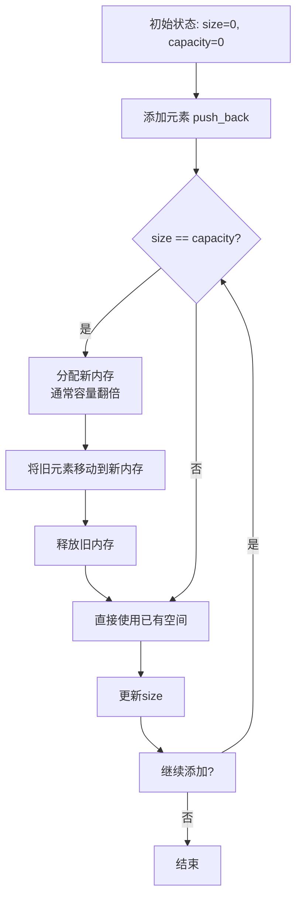
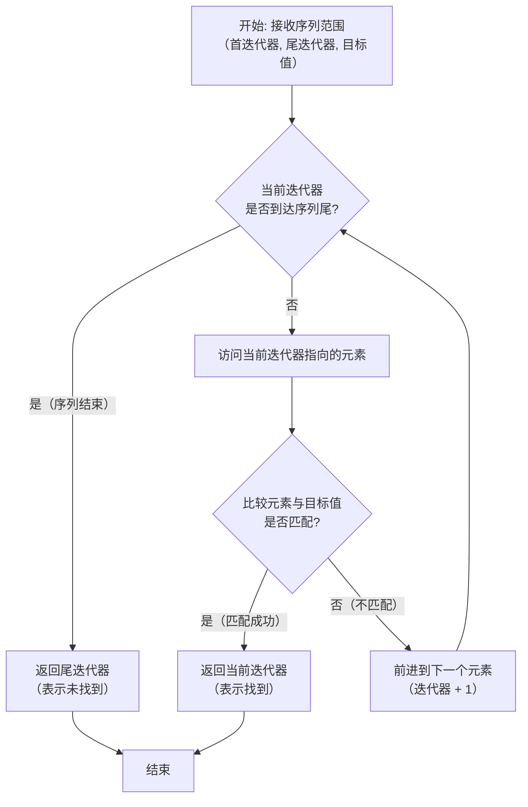
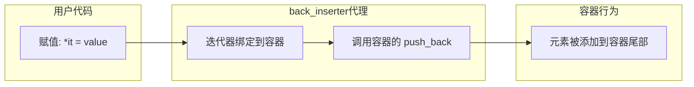
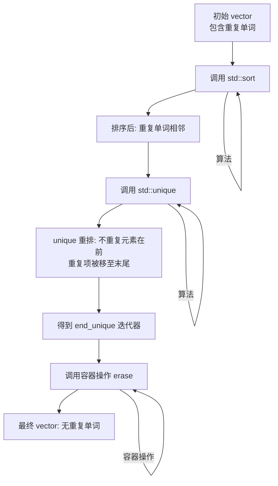
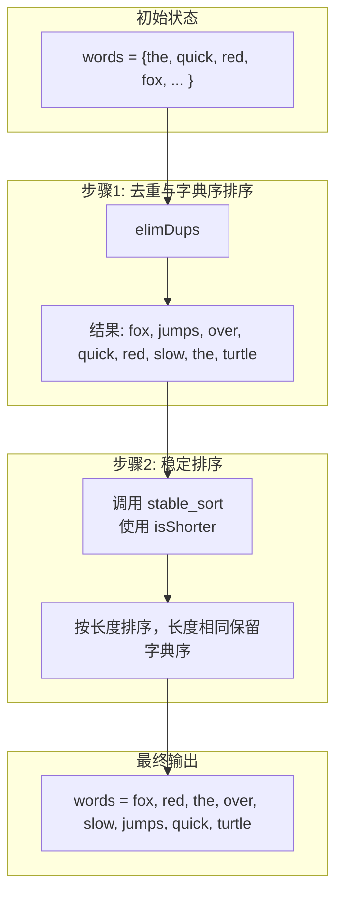
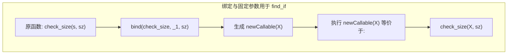
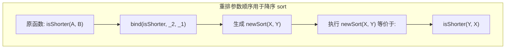
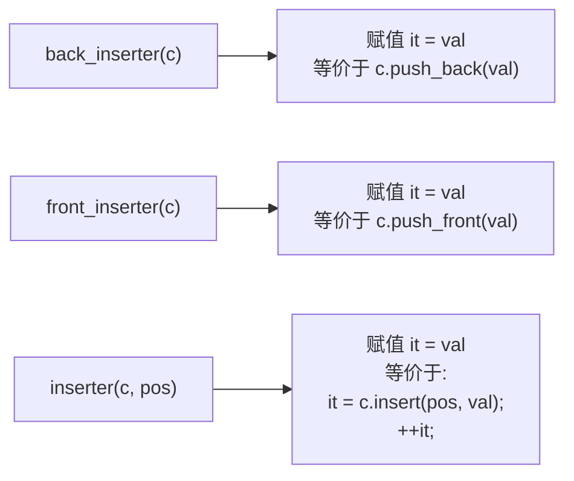
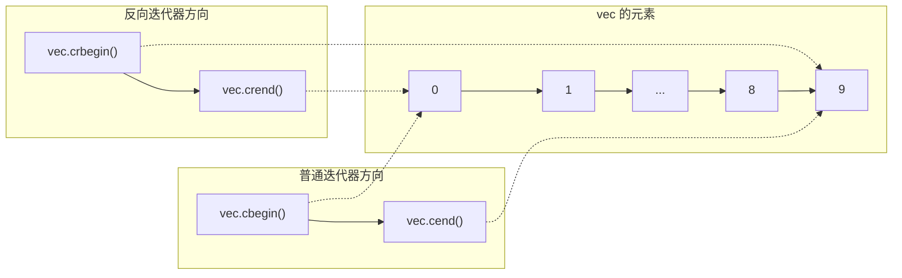
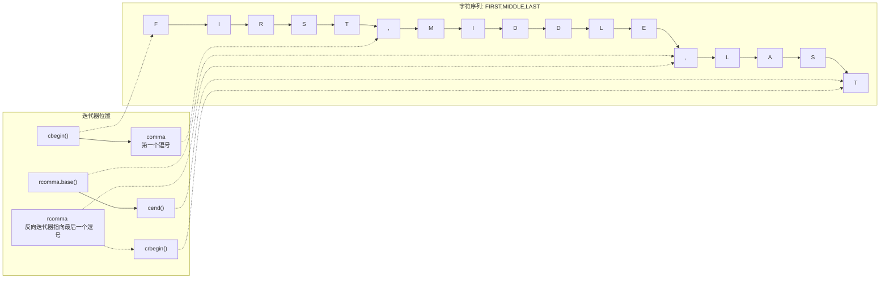

# 8.1 IO类
## 先用csapp视角拆解IO流:
```c++
上层（应用层）
  ↑
【 C++ 流 】     cin、cout、cerr、clog
  ↑（封装）
【 C stdio 】   fopen、fread、fwrite、printf、scanf（自带用户缓冲区）
  ↑（系统调用）
【 Unix 系统IO】read、write、open、close（无用户缓冲，直接访内核）
  ↑（内核态）
【 内核 】      文件描述符表、内核缓冲区、设备驱动
底层（硬件）
```

| C++ 流对象 | 含义          | 绑定 Unix 文件描述符       | C stdio 对应 FILE* | 底层系统调用  | 缓冲特性补充                     |
| ------- | ----------- | ------------------- | ---------------- | ------- | -------------------------- |
| `cin`   | 标准输入流       | `0 (STDIN_FILENO)`  | `stdin`          | `read`  | 行缓冲 / 全缓冲，默认同步 `stdio`     |
| `cout`  | 标准输出流       | `1 (STDOUT_FILENO)` | `stdout`         | `write` | 行缓冲；终端输出遇换行刷新，默认同步 `stdio` |
| `cerr`  | 标准错误输出（无缓冲） | `2 (STDERR_FILENO)` | `stderr`         | `write` | **完全无缓冲**，输出立即刷入 fd        |
| `clog`  | 标准错误输出（带缓冲） | `2 (STDERR_FILENO)` | `stderr`         | `write` | 全缓冲，积累数据后批量输出              |

`cout <<` 就能打印，**因为它默认写 fd=1（控制台）**
CSAPP 核心：**缓冲机制**（`cin/cout` 快 / 慢的根源）
C++ 流 **完全继承 C stdio 的 3 种缓冲策略**：
1. `cout` → **行缓冲（行缓冲）**
- 缓冲区：**用户态内存**（C stdio 自带，不是内核的）
- 刷新规则：**遇到 `\n` / 缓冲区满 / 程序退出 / 手动 `flush`**
- 目的：**攒够一批数据，再调用 1 次 `write` 系统调用**
- 好处：减少用户态↔内核态切换，性能极高
2. `cin` → **行缓冲**
- 输入回车 `\n` 才会把数据从用户缓冲拷贝给程序
- 底层调用 `read` 读 fd=0
3. `cerr` → **无缓冲**
- 不攒数据，**直接调用 `write`**
- 用于紧急错误，实时输出
`cout << "hello\n"` 完整执行流程（CSAPP 内核视角）
```
1. C++ 流 → 转发给 C stdio 的 stdout（fd=1）
2. 数据写入 C stdio 的【用户缓冲区】
3. 遇到 \n → 触发刷新
4. C stdio 调用 Unix 系统调用：write(1, "hello\n", 6)
5. 用户态 → 内核态 切换
6. 内核把数据从用户缓冲 → 拷贝到【内核缓冲区】
7. 内核驱动把数据 → 输出到控制台（硬件）
8. 返回用户态，执行结束
```
## 条件状态
```c++
strm::iostate：strm 是一种 IO 类型，iostate 是一种机器相关的类型，提供了表达条件状态的完整功能
strm::badbit：strm::badbit 用来指出流已崩溃
strm::failbit：strm::failbit 用来指出一个 IO 操作失败了
strm::eofbit：strm::eofbit 用来指出流到达了文件结束
strm::goodbit：strm::goodbit 用来指出流未处于错误状态。此值保证为零
s.eof()：若流 s 的 eofbit 置位，则返回 true
s.fail()：若流 s 的 failbit 或 badbit 置位，则返回 true
s.bad()：若流 s 的 badbit 置位，则返回 true
s.good()：若流 s 处于有效状态，则返回 true
s.clear()：将流 s 中所有条件状态位复位，将流的状态设置为有效。返回 void
s.clear(flags)：根据给定的 flags 标志位，将流 s 中对应条件状态位复位。flags 的类型为 strm::iostate。返回 void
s.setstate(flags)：根据给定的 flags 标志位，将流 s 中对应条件状态位置位。flags 的类型为 strm::iostate。返回 void
s.rdstate()：返回流 s 的当前条件状态，返回值类型为 strm::iostate
```
## 8.1.3 管理输出缓冲
### 一、缓冲底层原理
输出流内置**进程用户态缓冲区**，数据先存入用户缓冲，攒批通过`write`写入内核缓冲区，**减少系统调用、提升IO效率**；
**刷新定义**：用户缓冲区全部数据→内核缓冲区 + 清空当前用户缓冲区；刷新≠直接写入磁盘/屏幕硬件，内核自主调度落地硬件。
### 二、缓冲区5类刷新触发条件
1. **进程正常退出(main return)**：全部输出流自动刷新；**程序异常崩溃，缓冲区不会自动刷新，缓存数据丢失**。
2. **缓冲区填满**：自动刷新腾出空间接收新数据。
3. **手动操纵符强制刷新**：`endl/flush/ends`主动触发刷新。
4. **unitbuf模式**：开启后**每次输出完毕自动刷新**；`cerr`默认开启`unitbuf`（实时输出无缓冲），`cout`默认关闭。
5. **tie跨流绑定刷新**：读取绑定的输入流前，自动刷新绑定的输出流缓冲区。
### 三、3个刷新操纵符区别
| 操纵符  | 字符插入       | 刷新行为         |
| ------- | -------------- | ---------------- |
| `endl`  | 插入换行`\n`   | 插入后强制刷新   |
| `flush` | 无任何字符     | 仅执行缓冲区刷新 |
| `ends`  | 插入空字符`\0` | 插入后强制刷新   |
### 四、unitbuf / nounitbuf 控制缓冲模式
1. `os << unitbuf;`：开启逐写刷新，后续每一次`<<`输出结束立刻自动`flush`，全程无缓存；
2. `os << nounitbuf;`：恢复默认缓冲规则；
3. 固有配置：`cerr`默认`unitbuf`，无换行也即时刷新；`cout`默认行缓冲，遇`\n`/满缓冲才刷新。
### 五、tie() 流关联机制
### 1. 绑定规则
`输入流.tie(输出流指针)`：**执行输入`>>`读取操作前，自动刷新绑定的输出流**；单个流同一时刻只能绑定1个输出流，多个流可绑定同一个输出流。
### 2. 默认配置
`cin.tie(&cout)`，读取`cin`前自动刷新`cout`，保证输入提示正常打印；**cerr实时输出依赖unitbuf，不绑定cout（教材此处描述有误）**。
### 3. API使用
```cpp
auto old = cin.tie(nullptr); // 解绑cin，返回原绑定流
cin.tie(&cerr);              // 绑定cin至cerr
cin.tie(old);                // 恢复原有绑定关系
```
### 六、易错要点
1. `'\n'`仅在行缓冲模式下触发刷新，不属于强制刷新；
2. 只有正常进程退出自动刷缓冲，崩溃/异常终止残留缓存数据；
3. 刷新仅提交至内核缓冲区，无法控制内核写入物理设备。
# 8.2 文件输入输出流
### fstream的特有操作:
```c++
fstream fstrm;	创建一个未绑定的文件流。fstream定义于头文件<fstream>
fstream fstrm(s);	创建文件流并打开名称为s的文件；s可为std::string或 C 风格字符串指针；构造函数为explicit；打开模式随文件流类型默认
fstream fstrm(s, mode);	同上，使用自定义mode打开文件
fstrm.open(s)	打开文件并和流对象绑定；s支持string与 C 字符串，默认打开模式由流类型决定，无返回值
fstrm.close()	关闭当前绑定文件，无返回值
fstrm.is_open()	返回bool，判定关联文件是否处于已打开未关闭状态
```
### 开始使用fstream:
```c++
ifstream in(ifile) //构造一个ifstream并打开给定文件
ofstream out; //输出文件流未关联到任何文件
```
打开文件:
统一规则（教材 open/close 通用约束，两类流完全一致）
1. 无论 if/of，**流已经绑定文件时，直接再次调用 open 必定失败、置 failbit**；更换文件前必须`close()`关闭已有绑定。
```cpp
ifstream in("a.txt");
in.open("b.txt"); // 非法，打开失败，failbit置1
in.close();
in.open("b.txt"); // 合法
```
1. **局部流对象出作用域自动析构、自动 close 文件**（教材循环示例）
```cpp
for(auto p=argv+1;p!=argv+argc;++p){
    ifstream input(*p); // 单次循环局部对象
    if(input) process(input);
}// 每次循环结束input销毁，文件自动关闭，无需手动close
```
1. 打开失败共性：两类流`open`出错都会置`failbit`，`if(流对象)`判空即可校验打开结果。
**自定义打开模式拓展（手动改变 ofstream 行为）**
如需 ofstream**追加写入（不清空原文件）**，手动修改打开标识：
```
ofstream out("log.txt", ios::app); // app：末尾追加，不trunc清空旧内容
```
如需文件同时读写，不混用 if/of，使用`fstream`（默认`ios::in|ios::out`）。
### 文件模式:
| 模式标识 | C++ 标准官方含义                               | 通俗解释                                                | 可适用的流类型                      | 底层核心行为                                                 |
| -------- | ---------------------------------------------- | ------------------------------------------------------- | ----------------------------------- | ------------------------------------------------------------ |
| `in`     | 以**只读**方式打开文件                         | 只能从文件读取数据，无法写入修改                        | `ifstream` / `fstream`              | 对应 POSIX `O_RDONLY` 标记，文件不存在时打开失败             |
| `out`    | 以**只写**方式打开文件                         | 只能向文件写入数据，无法从文件读取                      | `ofstream` / `fstream`              | 对应 POSIX `O_WRONLY` 标记，文件不存在时自动创建             |
| `app`    | 追加模式：**每次写操作前，强制定位到文件末尾** | 所有写入内容都会追加到文件结尾，不会覆盖原有内容        | `ofstream` / `fstream`              | 对应 POSIX `O_APPEND` 标记，必须与`out`配合使用；未显式写`out`时，默认自动开启`out` |
| `ate`    | 打开文件后，**立即一次性定位到文件末尾**       | 仅打开时跳到文件结尾，后续写入 / 读取可自由移动文件指针 | `ifstream` / `ofstream` / `fstream` | 对应 POSIX `O_AT_END` 标记，无强制追加逻辑，仅控制打开时的初始指针位置 |
| `trunc`  | 截断模式：打开文件时**清空原有全部内容**       | 覆盖写入，文件原有数据会被全部删除                      | `ofstream` / `fstream`              | 对应 POSIX `O_TRUNC` 标记，**必须与`out`配合使用**，单独使用无效 |
| `binary` | 二进制 IO 模式：不做文本换行符转换             | 按文件原始字节流读写，无`\n`与系统换行符的自动转换      | `ifstream` / `ofstream` / `fstream` | 关闭文本模式的换行映射，读写结果与文件磁盘字节完全一致       |
> 每个文件流类型都定义了一个默认的文件模式，当我们未指定文件模式时，就使用此默认模式。
>
> 与**ifstream**关联的文件默认以in模式打开;
>
> 与**ofstream**关联的文件默认以out 模式打开;
>
> 与**fstream**关联的文件默认以in和 out 模式打开。
```c++
#include <fstream>
using namespace std;
int main() {
    // 1. out + trunc (默认)：只写+打开清空文件（覆盖写入）
    ofstream f1("test.txt");       // 等价 ios::out | ios::trunc
    f1 << "默认out+trunc：清空旧数据，从头写";
    // 2. app：追加模式 → 每次写强制到末尾，不删旧数据
    ofstream f2("test.txt", ios::app); 
    f2 << "\napp：只追加，绝不覆盖原有内容";
    // 3. ate：打开跳到末尾 → 灵活可移动指针，能覆盖
    fstream f3("test.txt", ios::in | ios::out | ios::ate);
    f3.seekp(0);  // 手动移到开头 → ate支持自由改指针
    f3 << "ate：打开到末尾，可随意覆盖修改";
    // 4. in：只读模式 → 只能读，不能写，文件不存在则打开失败
    ifstream f4("test.txt", ios::in);
    // 5. binary：二进制模式 → 不转换换行符，纯字节读写
    ofstream f5("bin.dat", ios::out | ios::binary);
    f5 << "binary：原始字节流，无格式转换";
    return 0;
}
```
# 8.3 string流
## String流基础
stringstream继承自iostream;除了和它相似的功能外特有的功能有:
```c++
sstream strm;			strm 是一个未绑定的 stringstream 对象。sstream 是头文件sstream中定义的一个类型
sstream strm (s);		strm是一个sstream对象，保存strings的一个拷贝。此构造函数是explicit的(参见7.5.4节，第265页)
strm.str()				返回strm所保存的string的拷贝
strm.str(s)				将 string s拷贝到 strm中。返回void
```
## istringstream的使用
```c++
// 结构体：存储1个人+多个手机号
struct PersonInfo {
    string name;
    vector<string> phones;
};
int main() {
    string line, word;
    vector<PersonInfo> people;
    // 【外层循环1：按换行拆分：一次读取完整一行文本】
    // getline(cin,line)：读到回车(\n)为止，把整行所有字符存入line，丢弃末尾换行
    // 例输入一行：morgan 2015552368 8625550123 → line = "morgan 2015552368 8625550123"
    while (getline(cin, line)) {
        PersonInfo info;
        // 核心：istringstream 将内存字符串line包装成【内存输入流】，用法和cin完全一致
        // record = 一个数据源在内存的istream，不再从键盘读，从字符串line读
        istringstream record(line);
        // >>运算符：自动以【空格/制表符】为分隔，读取第一个连续无空格内容 → 人名
        record >> info.name; // 取出"morgan"存入name，流指针往后移动
        // 【内层循环2：按空格拆分剩余所有电话号码】
        // 循环不断从record流提取被空格隔开的字符串，直到字符串全部读完(触发eof)
        while (record >> word) {
            info.phones.push_back(word); // 逐个存入手机号容器
        }
        people.push_back(info); // 当前人信息存入总数组
    }
    return 0;
}
```
## ostringstream的使用
```c++
// 核心函数：处理用户数据并输出
void processPeople(const vector<Person>& people, ostream& os) {
    for (const auto& entry : people) {  // 遍历每个用户
        ostringstream formatted;  // 缓存：合法格式化号码
        ostringstream badNums;    // 缓存：非法原始号码
        // 遍历当前用户所有手机号，分流缓存
        for (const string& num : entry.numbers) {
            if (!isValidPhone(num)) {
                badNums << " " << num;  // 非法→badNums
            } else {
                formatted << " " << formatPhone(num);  // 合法→formatted
            }
        }
        // 业务规则：有错则整条记录作废（合法数据也不输出）
        if (badNums.str().empty()) {  // 无错误号码
            os << entry.name << ":" << formatted.str() << endl;
        } else {  // 存在错误号码
            cerr << "ERROR: " << entry.name 
                 << " has invalid number(s):" << badNums.str() << endl;
        }
    }
```
| 成员函数             | 功能说明         | 代码示例                        | 注意事项                                     |
| -------------------- | ---------------- | ------------------------------- | -------------------------------------------- |
| `ostringstream oss;` | 创建空内存输出流 | `ostringstream formatted;`      | 每次循环创建新对象，自动释放内存             |
| `oss << 数据`        | 追加写入缓冲区   | `formatted << " " << num;`      | 支持任意类型（字符串、数字等），语法同`cout` |
| `oss.str()`          | 读取缓冲区字符串 | `string res = formatted.str();` | **不会清空缓冲区**，多次调用返回相同内容     |
| `oss.str("")`        | 清空缓冲区       | `badNums.str("");`              | 重置流状态，用于复用对象                     |
| `oss.clear()`        | 清除错误标志     | `oss.clear();`                  | 配合`str("")`使用，恢复流可用性              |
# 9.1 顺序容器概述
## 内存结构:
| 容器           | 底层结构                     | 访问特性                   | 增删性能特点                                                 | 核心限制                                   |
| -------------- | ---------------------------- | -------------------------- | ------------------------------------------------------------ | ------------------------------------------ |
| `vector`       | 连续可变动态数组             | 支持 O (1) 随机访问        | 尾部插入 / 删除极快；**头部 / 中间插入删除慢**（需要批量搬运内存） | 扩容会整体拷贝数据，中间操作开销高         |
| `deque`        | 分段双向数组（分段块链表）   | 支持 O (1) 随机访问        | 头部、尾部插入 / 删除速度都很快；中间操作仍较慢              | 随机访问略慢于 vector，内存不连续          |
| `list`         | 双向链表                     | 仅双向顺序遍历，无随机访问 | 任意位置插入 / 删除 O (1) 快速（找到迭代器后）               | 无法下标随机访问，缓存失效严重，内存碎片化 |
| `forward_list` | 单向链表                     | 仅单向顺序遍历，无随机访问 | 任意位置插入 / 删除 O (1) 快速（找到迭代器后）               | 只能单向遍历，不支持反向迭代，无 size ()   |
| `array`        | 固定长度静态数组             | 支持 O (1) 随机访问        | 不支持动态新增、删除元素                                     | 编译期确定容量，大小固定，无扩容机制       |
| `string`       | 专门存储 char 的 vector 变体 | 支持 O (1) 随机访问        | 尾部插入 / 删除速度快；头部 / 中间操作慢                     | 仅用于字符序列，接口适配字符串操作         |
## 使用场景:
| 选择原则原文                                                 | 核心逻辑                                                     | 典型 C++ 高性能服务器场景                                    |
| ------------------------------------------------------------ | ------------------------------------------------------------ | ------------------------------------------------------------ |
| 除非你有很好的理由选择其他容器，否则应使用 `vector`          | 连续内存、CPU 缓存友好、无指针额外内存开销，综合性能最优     | 网络二进制缓冲区、数据包存储、批量日志、数值计算数组、绝大多数通用存储 |
| 如果你的程序有很多很小的元素，且空间的额外开销很重要，则不要使用 `list` / `forward_list` | 链表每个节点附带指针，小元素场景下指针内存占用远大于数据本身 | 存储大量`int`标记、短字节数据 → 禁用链表，优先`vector`；大结构体才适合链表 |
| 如果程序要求随机访问元素，应使用 `vector` / `deque`          | 链表不支持下标 O (1) 随机读取，只能线性遍历                  | 分片缓存按索引读取、查表、帧数据随机读写、协议数组索引查询   |
| 如果程序要求在容器的中间插入或删除元素，应使用 `list` / `forward_list` | 连续容器中间增删需要批量搬移内存；链表定位迭代器后增删 O (1) | 动态任务调度队列、频繁增删有序事件列表、无需随机访问的长序列 |
| 如果程序需要在头尾位置插入或删除元素，但不会在中间位置进行插入或删除操作，则使用 `deque` | 头尾两端 O (1) 操作，同时保留随机访问能力                    | 网络环形读写缓冲、双端任务队列、**滑动窗口数据缓存**         |
| 仅输入阶段中间插数据，后续需要随机访问                       | 折中方案：输入用`list`，处理完成拷贝至`vector`；或`vector`追加后`sort`排序 | 流式解析日志、动态过滤非法报文，解析完成后需要随机查询报文数据 |
# 9.2 容器库概览
##  C++ 标准容器通用操作汇总
### 一、类型别名
| 类型别名          | 说明                                                  |
| ----------------- | ----------------------------------------------------- |
| `iterator`        | 此容器类型的迭代器类型                                |
| `const_iterator`  | 只读迭代器类型，可读取元素但不可修改元素              |
| `size_type`       | 无符号整数类型，足以保存该容器类型的最大可能容量      |
| `difference_type` | 带符号整数类型，足以保存两个迭代器之间的距离          |
| `value_type`      | 容器存储的元素类型                                    |
| `reference`       | 元素的左值引用类型，等价于 `value_type&`              |
| `const_reference` | 元素的 const 左值引用类型，等价于 `const value_type&` |
它的使用:
| 你写的代码                | 真实推导类型                                 | 对应类型别名     |
| ------------------------- | -------------------------------------------- | ---------------- |
| `auto it = vec.begin();`  | `std::vector<int>::iterator`                 | `iterator`       |
| `auto it = vec.cbegin();` | `std::vector<int>::const_iterator`           | `const_iterator` |
| `auto n = vec.size();`    | `std::vector<int>::size_type`（即 `size_t`） | `size_type`      |
| `auto& val = vec[0];`     | `std::vector<int>::reference`（即 `int&`）   | `reference`      |
### 二、构造函数
| 语法               | 说明                                                         |
| ------------------ | ------------------------------------------------------------ |
| `C c;`             | 默认构造函数，构造空容器（`array` 有特殊初始化规则）         |
| `C c1(c2);`        | 拷贝构造，构造 c2 的副本 c1                                  |
| `C c(b, e);`       | 范围构造，将迭代器 `[b, e)` 区间内的元素拷贝到 c 中（`array` 不支持） |
| `C c{a, b, c...};` | 列表初始化，用初始化列表构造容器                             |
### 三、赋值与 swap
| 语法                | 说明                                                     |
| ------------------- | -------------------------------------------------------- |
| `c1 = c2`           | 将 c1 中的元素替换为 c2 的元素                           |
| `c1 = {a, b, c...}` | 将 c1 中的元素替换为初始化列表中的元素（`array` 不适用） |
| `a.swap(b)`         | 交换容器 a 和 b 中的全部元素                             |
| `swap(a, b)`        | 非成员函数版本，与 `a.swap(b)` 功能完全等价              |
### 四、容量与大小
| 语法           | 说明                                          |
| -------------- | --------------------------------------------- |
| `c.size()`     | 返回容器中元素的数量（`forward_list` 不支持） |
| `c.max_size()` | 返回容器可保存的最大元素数量                  |
| `c.empty()`    | 容器为空返回 `true`，否则返回 `false`         |
### 五、添加 / 删除元素（`array` 不支持）
> 注：不同容器的具体接口参数形式存在差异
| 语法               | 说明                                    |
| ------------------ | --------------------------------------- |
| `c.insert(args)`   | 将 args 指定的元素拷贝插入到容器中      |
| `c.emplace(inits)` | 使用 inits 参数直接在容器中原地构造元素 |
| `c.erase(args)`    | 删除 args 指定位置的元素                |
| `c.clear()`        | 删除容器内所有元素，无返回值            |
### 六、关系运算符
| 运算符               | 说明                                         |
| -------------------- | -------------------------------------------- |
| `==`、`!=`           | 所有标准容器均支持相等 / 不等比较            |
| `<`、`<=`、`>`、`>=` | 有序容器支持大小关系比较；无序关联容器不支持 |
### 七、获取迭代器
| 语法                      | 说明                                                  |
| ------------------------- | ----------------------------------------------------- |
| `c.begin()` / `c.end()`   | 返回指向首元素、尾后位置的普通迭代器                  |
| `c.cbegin()` / `c.cend()` | 返回指向首元素、尾后位置的只读迭代器 `const_iterator` |
### 八 反向容器的额外成员(不支持forward_list)
| 成员标识                   | 功能说明                                                     |
| -------------------------- | ------------------------------------------------------------ |
| `reverse_iterator`         | 可按逆序寻址、修改元素的反向迭代器类型                       |
| `const_reverse_iterator`   | 仅能逆序读取、不可修改元素的只读反向迭代器类型               |
| `c.rbegin()`, `c.rend()`   | `rbegin()`返回指向容器`c`尾元素的反向迭代器；`rend()`返回指向容器`c`首元素前一位置的反向迭代器 |
| `c.crbegin()`, `c.crend()` | 返回`const_reverse_iterator`**类型的只读反向迭代器**         |
## 9.2.5 赋值操作详解
| 语法                        | 功能说明                                                     | 底层原理（精简源码）                                         |
| --------------------------- | ------------------------------------------------------------ | ------------------------------------------------------------ |
| `c1 = c2`                   | 将 c1 元素替换为 c2 元素的深拷贝，二者必须同类型             | 调用拷贝赋值运算符 `operator=`，先析构自身元素再逐个拷贝构造；现代实现常用**拷贝并交换**技法，构造副本后交换内部指针 |
| `c = {a, b, c...}`          | 替换为初始化列表元素的拷贝，`array` 不适用                   | 重载 `operator=(initializer_list<T>)`，清空原容器后插入列表元素；`array` 大小固定不支持整体替换 |
| `c1.swap(c2)``swap(c1, c2)` | 交换两容器全部元素，必须同类型，性能远快于拷贝               | **O (1) 复杂度**，仅交换容器内部的数据指针、size、capacity 等元数据，不拷贝元素；`array` 例外，为逐元素交换 O (n) |
| `seq.assign(b, e)`          | 序列容器专属，替换为迭代器 `[b,e)` 区间元素；迭代器不能指向自身 | 先 `clear()` 销毁所有元素，再遍历迭代器插入新元素；指向自身会导致迭代器失效、数据错乱 |
| `seq.assign(il)`            | 替换为初始化列表 `il` 中的元素                               | 等价于 `assign(il.begin(), il.end())`，逻辑同范围版本        |
| `seq.assign(n, t)`          | 替换为 n 个值为 t 的元素                                     | 先清空容器，再循环构造 n 个 t 元素插入；关联容器和 `array` 不支持 assign |
### array为什么特殊?swap需要o(n)复杂度:
**vector 对象本身不是数组，它是一个「持指针管理堆上数组」的管理器；array 对象本身就是数组，元素直接嵌在对象内部，没有独立的指针层。**
vector 对象在栈上，仅存 3 个指针，真实的元素数组在堆上动态分配。
```
栈内存（vector 对象本身，仅十几个字节）
┌─────────────────────────────┐
│      vector<int> v          │
│  ┌────────────────────────┐ │
│  │ _M_start  (首元素指针)  │─┼──┐
│  ├────────────────────────┤ │  │
│  │ _M_finish (尾后指针)    │─┼──┤
│  ├────────────────────────┤ │  │
│  │ _M_end    (容量尾指针)  │─┼──┤
│  └────────────────────────┘ │  │
└─────────────────────────────┘  │
                                 │
堆内存（真实的元素数组）          │
┌──────┬──────┬──────┬──────┐  ◄─┘
│  1   │  2   │  3   │  空  │
└──────┴──────┴──────┴──────┘
  ^             ^
 start        finish
```
- 迭代器、指针、引用，本质都指向**堆上的元素**，和 vector 对象本身无关。
- swap 两个 vector，只需要交换栈对象里的 3 个指针，O(1) 完成；元素的内存地址完全没变，所以迭代器、指针、引用全部不失效。
**array 没有堆分配，没有指针层，元素直接长在 array 对象内部，对象大小 = 元素大小 × 元素数量。**
```
栈内存（array 对象本身 = 整个数组）
┌───────────────────────────────────┐
│      std::array<int, 3> arr       │
│  ┌────────┬────────┬────────┐    │
│  │ arr[0] │ arr[1] │ arr[2] │    │
│  └────────┴────────┴────────┘    │
└───────────────────────────────────┘
```
- array 没有“指向数组的指针”可以交换，swap 必须**逐个交换每个元素的值**，O(n) 耗时，和元素数量成正比。
- 元素的内存地址全程不变，所以迭代器、指针、引用不会失效；但它们指向的位置里的值已经被交换了。
> vector 是数组，指针指向第一个元素，array 就不是吗？
- **vector**：对象 ≠ 数组。对象只是个管理器，持有指向堆数组的指针。`&v` 是栈上管理器的地址，`&v[0]` 是堆地址，二者完全不同。
- **array**：对象 = 数组。`&arr` 和 `&arr[0]` 是同一个起始地址，它没有额外的指针层，整个对象就是一块连续的元素内存，本质就是给原生 C 数组套了一层 STL 兼容的接口。
## 9.2.7 关系运算符
```c++
int main() {
    vector<int> v1 = { 1, 3, 5, 7, 9, 12 };  // 长度6
    vector<int> v2 = { 1, 3, 9 };            // 长度3
    vector<int> v3 = { 1, 3, 5, 7 };         // 长度4
    vector<int> v4 = { 1, 3, 5, 7, 9, 12 };  // 长度6，与v1完全相同
    // 1. v1 < v2 → true
    // 前两位1、3都相等，第3位v1[2]=5 < v2[2]=9，首个差异点决定结果
    cout << boolalpha << (v1 < v2) << endl;
    // 2. v1 < v3 → false
    // 前4位完全相等，v3更短；前缀规则：短序列更小，因此v3 < v1，v1 < v3不成立
    cout << boolalpha << (v1 < v3) << endl;
    // 3. v1 == v4 → true
    // 长度相同，且每个对应位置的元素都完全相等
    cout << boolalpha << (v1 == v4) << endl;
    // 4. v1 == v2 → false
    // 长度不同，直接判定不相等
    cout << boolalpha << (v1 == v2) << endl;
    return 0;
}
```
# 9.3顺序容器操作
## 9.3.1 添加元素
> **前置说明**：这些操作会改变容器大小；`array` 固定大小，不支持所有以下操作。
> - `forward_list` 有专属版本的 `insert` 和 `emplace`，不支持 `push_back` / `emplace_back`
> - `vector` 和 `string` 不支持 `push_front` / `emplace_front`
| 操作语法                                     | 功能说明                                                     | 返回值                                                      |
| -------------------------------------------- | ------------------------------------------------------------ | ----------------------------------------------------------- |
| `c.push_back(t)`<br>`c.emplace_back(args)`   | 在容器尾部创建一个值为 `t` 或由 `args` 构造的元素            | `void`                                                      |
| `c.push_front(t)`<br>`c.emplace_front(args)` | 在容器头部创建一个值为 `t` 或由 `args` 构造的元素            | `void`                                                      |
| `c.insert(p, t)`<br>`c.emplace(p, args)`     | 在迭代器 `p` 指向的元素之前插入一个值为 `t` 或由 `args` 构造的元素 | 返回指向新添加元素的迭代器                                  |
| `c.insert(p, n, t)`                          | 在迭代器 `p` 指向的元素之前插入 `n` 个值为 `t` 的元素        | 返回指向新添加的第一个元素的迭代器；若 `n` 为 0，则返回 `p` |
| `c.insert(p, b, e)`                          | 将迭代器 `b` 和 `e` 指定区间内的元素，插入到迭代器 `p` 指向的元素之前；`b` 和 `e` 不能指向容器 `c` 自身 | 返回指向新添加的第一个元素的迭代器；若区间为空，则返回 `p`  |
| `c.insert(p, il)`                            | 将花括号包围的初始化列表 `il` 中的值，插入到迭代器 `p` 指向的元素之前 | 返回指向新添加的第一个元素的迭代器；若列表为空，则返回 `p`  |
### 补充：插入操作的迭代器失效规则
向 `vector`、`string` 或 `deque` 插入元素时，会导致指向容器的迭代器、引用和指针失效，具体规则如下：
| 容器                    | 插入位置 | 失效情况                                                     |
| ----------------------- | -------- | ------------------------------------------------------------ |
| `vector` / `string`     | 任意位置 | 触发扩容时：所有迭代器、引用、指针全部失效；<br>未触发扩容时：插入位置及之后的迭代器、引用、指针失效 |
| `deque`                 | 首尾位置 | 迭代器全部失效，指向元素的指针和引用仍有效                   |
| `deque`                 | 中间位置 | 所有迭代器、引用、指针全部失效                               |
| `list` / `forward_list` | 任意位置 | 所有迭代器、引用、指针均保持有效                             |
```c++
    vector<Sales_data> c;
    c.reserve(10); // 预分配空间，排除扩容干扰，专注观察构造行为
    cout << "===== 1. emplace_back 原地构造 =====" << endl;
    // ✅ 直接传入构造函数参数，在容器内存中直接构造对象
    // 只调用 1 次构造函数，无临时对象、无拷贝/移动
    c.emplace_back("978-0590353403", 25, 15.99);
    cout << "\n===== 2. push_back 传临时对象 =====" << endl;
    // ❌ 先在外部构造临时对象，再移动/拷贝到容器中
    // 调用 1次构造 + 1次移动构造 + 1次析构（临时对象）
    c.push_back(Sales_data("978-0590353403", 25, 15.99));
    // push_back 不能直接传构造参数，编译报错
    // c.push_back("978-0590353403", 25, 15.99); 
```
## 9.3.2 访问元素
### 一、访问元素操作汇总表（对应表9.6）
| 操作语法    | 核心功能                                   | 支持的容器                                                   | 空容器/越界行为                         | 时间复杂度 |
| ----------- | ------------------------------------------ | ------------------------------------------------------------ | --------------------------------------- | ---------- |
| `c.front()` | 返回首元素的左值引用                       | 所有顺序容器（`array`/`vector`/`deque`/`list`/`forward_list`/`string`） | 容器为空时行为未定义                    | O(1)       |
| `c.back()`  | 返回尾元素的左值引用                       | 除 `forward_list` 外的所有顺序容器                           | 容器为空时行为未定义                    | O(1)       |
| `c[n]`      | 下标随机访问，返回元素引用，**无边界检查** | 仅随机访问容器：`string` / `vector` / `deque` / `array`      | 下标越界时行为未定义                    | O(1)       |
| `c.at(n)`   | 下标随机访问，返回元素引用，**带边界检查** | 仅随机访问容器：`string` / `vector` / `deque` / `array`      | 下标越界时抛出 `std::out_of_range` 异常 | O(1)       |
---

### 二、使用示例（对应教材代码 + 逐行注释）

```cpp

int main() {
    vector<int> c = {10, 20, 30, 40, 50};

    // 安全前提：访问前必须判空，空容器调用 front/back 属于未定义行为
    if (!c.empty()) {
        // ===== 首元素的两种等价获取方式 =====
        int val1 = *c.begin();   // 方式1：解引用首迭代器
        int val2 = c.front();    // 方式2：调用 front 成员函数
        // 底层完全等价：front() 内部就是 return *begin();

        // ===== 尾元素的两种等价获取方式 =====
        auto last = c.end();     // end() 指向尾后哨兵位置（无真实元素）
        --last;                  // 必须先递减，才能指向最后一个真实元素
        int val3 = *last;        // 方式1：解引用尾前迭代器
        int val4 = c.back();     // 方式2：调用 back 成员函数
        // 底层等价：back() 内部就是 return *(end() - 1);
        // forward_list 是单向迭代器，不支持 -- 运算，因此没有 back()

        cout << "首元素: " << val1 << " 尾元素: " << val4 << endl;
    }

    // ===== 下标访问 vs at 安全访问 =====
    // 1. operator[]：零开销，无边界检查，越界直接触发未定义行为
    cout << "下标2元素: " << c[2] << endl;
    // c[100]; // ❌ 越界，未定义行为，可能崩溃、可能读到脏数据

    // 2. at()：带边界检查，越界抛异常，安全性更高
    try {
        cout << "at(2): " << c.at(2) << endl;
        cout << "at(100): " << c.at(100) << endl; // 越界，抛出 out_of_range
    } catch (const out_of_range& e) {
        cout << "越界异常: " << e.what() << endl;
    }

    return 0;
}
```


---

### 三、核心要点总结
1. **等价关系**：`front() ≡ *begin()`，`back() ≡ *(--end())`，前者是后者的封装语法糖，语义更直观。
2. **性能与安全权衡**：`operator[]` 零运行时开销，适合确定下标合法的场景；`at()` 多一次边界判断，适合下标来自外部输入的场景，以极小性能代价换取安全。
3. **容器能力差异**：只有支持随机访问迭代器的容器才能下标访问；`forward_list` 是单向链表，无法反向遍历，因此不支持 `back()`。
4. **未定义行为红线**：空容器调用 `front()/back()`、下标越界使用 `[]`，均属于未定义行为，并非简单“报错”，可能引发崩溃、数据污染等任意后果。

## 9.3.3 删除元素

> 前置约束：所有操作会改变容器大小，**std::array 不支持**；forward_list 有专属 erase 版本，无 pop_back；vector/string 无 pop_front

| 操作语法        | 功能说明                      | 返回值                                                   | 边界/空容器风险                                |
| --------------- | ----------------------------- | -------------------------------------------------------- | ---------------------------------------------- |
| `c.pop_back()`  | 删除容器末尾单个元素          | `void`                                                   | 容器为空调用，行为未定义                       |
| `c.pop_front()` | 删除容器头部单个元素          | `void`                                                   | 容器为空调用，行为未定义；vector/string 不支持 |
| `c.erase(p)`    | 删除迭代器 `p` 指向的单个元素 | 返回**被删元素后一位**的迭代器；若删尾元素，返回 `end()` | `p` 为尾后迭代器则未定义                       |
| `c.erase(b,e)`  | 删除 `[b,e)` 区间内所有元素   | 返回**最后一个被删元素后一位**的迭代器；区间为空返回 `e` | b、e 必须是容器合法迭代器                      |
| `c.clear()`     | 清空容器全部元素              | `void`                                                   | 空容器调用无副作用，安全                       |

---

### 完整示例代码+逐行注释
```cpp
#include <iostream>
#include <vector>
#include <deque>
using namespace std;

int main() {
    vector<int> vec = {10,20,30,40,50};

    // 1. pop_back() 删除尾部元素
    if (!vec.empty()) { // 删除前必须判空，否则未定义行为
        vec.pop_back(); 
        // vec 现在：{10,20,30,40}
    }

    // vector不支持pop_front，改用deque演示pop_front
    deque<int> dq = {1,2,3,4};
    if (!dq.empty()) {
        dq.pop_front();
        // dq 现在：{2,3,4}
    }

    // 2. erase(p) 删除单个迭代器指向元素
    auto it = vec.begin() + 1; // 指向20
    auto new_it = vec.erase(it); 
    // vec：{10,30,40}
    // new_it 指向被删元素下一位：30
    cout << "erase后迭代器指向：" << *new_it << endl;

    // 3. erase(b,e) 删除区间 [b,e)
    auto start = vec.begin() + 1;
    auto end = vec.end();
    vec.erase(start, end);
    // vec 仅剩 {10}

    // 4. clear() 清空全部元素
    vec.clear();
    cout << "清空后size：" << vec.size() << endl; // 输出0

    return 0;
}
```

---

### 底层逻辑与迭代器失效规则 ⚠️
#### 1. 各容器删除后迭代器/引用/指针失效规则
1. **vector / string**
   - 删除点**之后**的所有迭代器、引用、指针全部失效；删除点之前保持有效
   - 原理：删除后后方元素向前拷贝覆盖，内存地址变更
2. **deque**
   - 删除首尾元素：仅被删元素迭代器失效，其余有效
   - 删除中间任意元素：**全部迭代器、引用、指针失效**
3. **list / forward_list**
   - 仅被删除元素对应的迭代器失效，其余所有迭代器、引用、指针保持有效
   - 原理：链表仅修改节点指针，不移动其他元素内存

#### 2. 重要警告

1. 删除类函数**不会校验参数合法性**，程序员必须自行保证容器非空、迭代器有效；
2. 空容器调用 `pop_back()/pop_front()`、给 `erase` 传入 `end()` 迭代器，均属于**未定义行为**，程序可能崩溃、篡改内存；
3. `erase` 的返回值可用来安全遍历删除，规避迭代器失效问题：
```cpp
// 安全删除所有值为30的元素
auto it = vec.begin();
while (it != vec.end()) {
    if (*it == 30) {
        it = vec.erase(it); // erase返回新迭代器，自动跳过已删除位置
    } else {
        ++it;
    }
}
```

---

### 各函数核心区别总结
1. `pop_front/pop_back`：只删首尾，无返回值，仅适合快速丢弃头尾；
2. `erase(p)`：精准删除单个指定位置元素，返回后续迭代器用于连续遍历；
3. `erase(b,e)`：批量删除一段连续区间，适合过滤大片无效数据；
4. `clear()`：一键清空整个容器，开销稳定，无需循环删除。

## 9.3.4 特殊的 forward_list 操作

#### 一、底层原理：单向链表的核心限制
`forward_list` 是**单向链表**，每个节点仅保存「后继指针」，不存在指向前驱节点的指针：
```
elem1 → elem2 → elem3 → elem4
```
##### 1. 删除节点的逻辑约束
若要删除 `elem3`，必须修改它的前驱 `elem2` 的后继指针，让 `elem2` 直接指向 `elem4`。
- 双向链表 `std::list`：节点自带前驱指针，拿到 `elem3` 迭代器即可反向找到 `elem2`，支持 `erase(it)` 直接删除目标节点。
- 单向链表 `forward_list`：仅持有目标节点迭代器时，**无法反向遍历找到前驱节点**，因此不能设计 `erase(it)`。

##### 2. 统一设计方案
所有增删操作均作用于「迭代器p的下一个元素」：
- `insert_after(p)`：在p的后方插入新节点
- `erase_after(p)`：删除p的后方节点
操作时p本身就是前驱节点，可直接修改p的后继指针，规避单向链表无法反向查找前驱的缺陷。

##### 3. 特殊迭代器 `before_begin()`
单向链表没有头节点，若要在链表**最开头**插入元素，需要一个「首元素之前的虚拟迭代器」：
- `lst.before_begin()`：返回首元素前的off-the-beginning迭代器，仅用于`insert_after`/`erase_after`，**不可解引用**
- `lst.cbefore_begin()`：const版本，返回`const_iterator`

---

#### 二、表9.8 forward_list 专属增删操作（Markdown）
| 操作语法                     | 功能说明                                                     | 边界约束                                     | 返回值                                              |
| ---------------------------- | ------------------------------------------------------------ | -------------------------------------------- | --------------------------------------------------- |
| `lst.before_begin()`         | 返回链表首元素之前的虚拟迭代器，仅用于`_after`系列操作，禁止解引用 | 任何链表均可调用，空链表也有效               | 普通迭代器                                          |
| `lst.cbefore_begin()`        | `before_begin()` 的const只读版本                             | 同上                                         | `const_iterator`                                    |
| `lst.insert_after(p, t)`     | 在迭代器`p`指向元素的后方插入单个值`t`                       | `p`不能是尾后迭代器`end()`，否则未定义行为   | 指向新插入元素的迭代器                              |
| `lst.insert_after(p, n, t)`  | 在`p`后方插入`n`个值为`t`的元素                              | `p`不能是`end()`                             | 指向最后一个插入元素的迭代器；n=0时返回`p`          |
| `lst.insert_after(p, b, e)`  | 将迭代器区间`[b,e)`全部插入`p`后方；`b/e`不能指向当前链表`lst` | `p`不能是`end()`                             | 指向最后一个插入元素的迭代器；区间为空返回`p`       |
| `lst.insert_after(p, il)`    | 将初始化列表`il`全部插入`p`后方                              | `p`不能是`end()`                             | 指向最后一个插入元素的迭代器；列表为空返回`p`       |
| `lst.emplace_after(p, args)` | 在`p`后方原地构造元素，直接转发构造参数`args`                | `p`不能是`end()`                             | 指向新构造元素的迭代器                              |
| `lst.erase_after(p)`         | 删除迭代器`p`指向元素的下一个节点                            | `p`不能指向尾元素、不能是`end()`，否则未定义 | 指向被删元素后一位的迭代器；若删尾元素则返回`end()` |
| `lst.erase_after(b, e)`      | 删除区间：`b`的下一个元素 ~ `e`的前一个元素（不包含e）       | `b/e`为合法迭代器，且b在e前方                | 指向`e`的迭代器                                     |

---

#### 三、代码示例+详细注释
```cpp
#include <forward_list>
#include <iostream>
using namespace std;

int main() {
    forward_list<int> flst = {10,20,30,40};
    // 链表结构：10 → 20 → 30 → 40

    // 1. 头部插入：必须使用 before_begin()
    auto head_p = flst.before_begin();
    flst.insert_after(head_p, 5);
    // 现在：5 → 10 → 20 → 30 → 40

    // 2. 在20后方插入元素
    auto p = flst.begin(); // p 指向10
    ++p; // p 指向20
    flst.insert_after(p, 25);
    // 现在：5 → 10 → 20 → 25 → 30 → 40

    // 3. 删除30（教材示例elem3）
    // 要删30，必须拿到它的前驱25的迭代器，调用erase_after
    auto del_p = flst.begin();
    while (*next(del_p) != 30) ++del_p;
    flst.erase_after(del_p);
    // 删除后：5 → 10 → 20 → 25 → 40

    // 4. 原地构造 emplace_after
    flst.emplace_after(p, 26);

    return 0;
}
```

---

#### 四、关键对比：list vs forward_list
| 容器                    | 节点结构            | 删除接口                                           | 头部插入方式                        |
| ----------------------- | ------------------- | -------------------------------------------------- | ----------------------------------- |
| `std::list` 双向链表    | 节点存前驱+后继指针 | `erase(it)` 直接删除目标迭代器元素                 | `insert(begin(), val)`              |
| `forward_list` 单向链表 | 节点仅存后继指针    | 无`erase(it)`，仅`erase_after(p)`删除p的下一个元素 | `insert_after(before_begin(), val)` |

#### 五、核心注意事项
1. `before_begin()` 仅作为`insert_after/erase_after`的参数，**绝对不能解引用**，解引用属于未定义行为；
2. 所有`_after`系列接口的参数`p`禁止传入`end()`，会触发未定义行为；
3. `erase_after(p)`中，`p`不能是链表最后一个元素（尾节点），尾节点后方无元素可删除；
4. 迭代器失效规则：仅被删除节点对应的迭代器失效，其余迭代器、引用全部保持有效。

## 9.3.6 容器操作可能让迭代器失效

### 📌 核心概念
向容器中添加（`insert`/`push_back`等）或删除（`erase`/`pop_back`等）元素时，容器内部的数据结构和内存布局可能发生变化。这会导致指向这些元素的迭代器、指针或引用**失效**。使用失效的迭代器是严重的运行时错误。

### 📊 一、容器操作导致的迭代器失效规则表

根据你在图1中截取的教材内容，不同类型的容器在不同操作下的失效情况对比如下：

| 容器类型                    | 操作类型     | 迭代器/指针/引用失效的具体情况                               |
| :-------------------------- | :----------- | :----------------------------------------------------------- |
| **`vector` / `string`**     | **添加元素** | 1. **重新分配内存**（`capacity`改变）：**所有**迭代器、指针、引用失效。 <br> 2. **未重新分配内存**：插入位置**之后**的迭代器、指针、引用失效,插入位置之前的有效。 |
| **`deque`**                 | **添加元素** | 1. **非首尾位置**插入：**所有**迭代器、指针、引用失效。 <br> 2. **首或尾**位置插入：**迭代器**失效，但指向已存在元素的**引用/指针****不失效**。 |
| **`list` / `forward_list`** | **添加元素** | **所有**迭代器（包括尾后和首前）、指针、引用**仍然有效**（只有指向被删除元素的迭代器会失效）。 |
| **所有容器**                | **删除元素** | 1. 指向被删除元素的迭代器、指针、引用**必然失效**。 <br> 2. ⚠️ **尾后迭代器（`end()`）总是会失效**。 |
| **`vector` / `string`**     | **删除元素** | 指向**被删元素之后**的所有迭代器、指针、引用失效。           |
| **`deque`**                 | **删除元素** | 1. **非首尾位置**删除：**所有**迭代器、指针、引用失效。 <br> 2. 删除**尾元素**：尾后迭代器失效，但其他不受影响。 <br> 3. 删除**首元素**：首部迭代器失效，但其他不受影响。 |
| **`list` / `forward_list`** | **删除元素** | 仅指向被删除元素的迭代器失效，其余**所有**迭代器（包括尾后和首前）、指针、引用**仍然有效**。 |

> ⚠️ **图1中的警告**：使用失效的迭代器、指针或引用是严重的运行时错误，很可能引起与使用未初始化指针一样的问题。

---

### 💻 二、编写改变容器的循环程序（源码与注释）

根据图2中的代码示例，当你在 `vector` 中执行插入或删除操作时，必须更新迭代器，因为这些操作会使现有迭代器失效。

#### 示例场景：复制奇数元素，删除偶数元素
```cpp
#include <vector>

void modify_vector() {
    std::vector<int> vi = {0, 1, 2, 3, 4, 5, 6, 7, 8, 9};

    // 必须使用 begin() 而不是 cbegin()，因为我们要修改 vi
    auto iter = vi.begin(); 

    while (iter != vi.end()) {
        if (*iter % 2) { 
            // 如果当前是奇数：
            // 1. 复制当前元素
            // 2. insert 会返回指向新插入元素的迭代器
            iter = vi.insert(iter, *iter); 
            
            // 3. 需要将迭代器向前移动两次
            // 一次跳过新插入的元素，一次跳过原来的元素
            iter += 2; 
        } else {
            // 如果当前是偶数：
            // 1. erase 会删除当前元素
            // 2. erase 返回指向被删元素之后元素的迭代器
            // 此时不应该再向前移动迭代器，因为它已经指向了下一个待处理元素
            iter = vi.erase(iter); 
        }
    }
}
```

### 💡 核心原理解析
*   **`insert` 后的处理**：`iter = vi.insert(iter, *iter);` 会将新元素插入在 `iter` 指向的位置**之前**，并**返回指向新元素的迭代器**。此时 `iter` 指向的是新插入的元素。如果你直接 `++iter`，你只会指向原来的元素。所以需要 `iter += 2;` 跳过新元素和原元素。
*   **`erase` 后的处理**：`iter = vi.erase(iter);` 删除当前 `iter` 指向的元素，并**自动返回指向下一个元素的迭代器**。因此，`erase` 之后**不需要**再执行 `++iter`。

---

### 🚨 三、常见陷阱：不要保存 `end()` 返回的迭代器

根据图3和图4的详细解释，**在循环中添加/删除元素时，绝对不能缓存 `end()` 的返回值**。因为操作容器后，`end()` 迭代器会失效。

#### ❌ 灾难示例（错误示范）
```cpp
// !!! 灾难：此循环的行为是未定义的
void buggy_loop() {
    std::vector<int> v = {1, 2, 3};
    auto begin = v.begin();
    
    // 错误：将 end 返回的迭代器保存在局部变量中
    auto end = v.end(); 

    while (begin != end) {
        // 做一些处理
        ++begin; 
        
        // 这里插入元素，会导致容器的内存/结构改变
        // 但我们的 end 仍然指向老的末尾位置
        // 如果新元素的添加导致原 end 位置不再有效，就会造成无限循环或崩溃！
        begin = v.insert(begin, 42); 
        ++begin;
    }
}
```
**后果**：此代码的行为在大多数标准库实现上会导致**无限循环**或**程序崩溃**。因为缓存的 `end` 只是最初容器结尾的那个过期迭代器，插入元素后容器变长了，它永远无法满足 `begin != end` 的条件。

---

### ✅ 四、最佳实践：每次循环更新 `end()`

正确的做法是在循环条件中反复调用 `v.end()`，保证每次判断都获取最新的尾后位置。

#### 💡 正确且安全的写法
```cpp
void safe_loop() {
    std::vector<int> v = {1, 2, 3};
    auto begin = v.begin();

    // ✅ 正确：每次循环都重新计算 v.end()
    while (begin != v.end()) { 
        // 假设我们要在当前处理元素之后插入一个新元素 42
        ++begin; // 先向前移动，指向下一个元素

        // 在下个元素之前插入 42（即原元素的后面）
        begin = v.insert(begin, 42); 

        ++begin; // 再次向前移动，跳过刚刚插入的 42，指向下一个待处理元素
    }
}
```

#### 🌟 关键总结

1.  **在 `vector`、`string`、`deque` 的循环中**，凡是涉及到 `insert`、`erase`、`push_back` 等改变容器长度的操作，**必须重新获取 `end()`**。
2.  **不要缓存 `end()`**：在进入循环前，不要写 `auto end = v.end();` 然后用作判断条件。
3.  **返回即更新**：优先使用 `insert` 和 `erase` 的**返回值**来更新你的迭代器变量，而不是手动递增/递减。

> 💡 **Tip提示（源自图4）**：
> 如果在循环中插入/删除 `deque`、`string` 或 `vector` 中的元素，不要缓存 `end` 返回的迭代器。必须在每次插入操作后重新计算 `end()`。

# 9.4 vector 对象是如何增长的

## 核心知识点

### 1. 核心定义

- **连续存储**：`vector` 将元素连续存储，每个元素紧挨着前一个元素。
- **动态扩容**：当 `vector` 中**没有空间容纳新元素**时，它必须分配新的内存空间，将已有元素从旧位置移动到新位置，然后添加新元素，释放旧空间。
- **避免频繁分配**：如果每次添加一个新元素都重新分配内存，性能会慢到不可接受。因此标准库采用**预留空间**策略：`vector` 和 `string` 通常分配比当前需要**更大的内存空间**作为备用。
- **扩容策略**：`vector` 在每次需要分配新内存时，通常将当前容量**翻倍**（取决于实现），使得 `push_back` 操作的总时间与元素个数成线性关系（**常数分摊时间复杂度**）。

#### 关键成员函数
| 函数                | 作用                                                         |
| ------------------- | ------------------------------------------------------------ |
| `c.capacity()`      | 不重新分配内存的情况下，`c` 最多可以保存多少元素             |
| `c.reserve(n)`      | 分配至少能容纳 `n` 个元素的内存空间（**不改变**容器中元素的数量） |
| `c.shrink_to_fit()` | 请求将 `capacity()` 减少为与 `size()` 相同大小（**不保证一定退回内存**） |

> ⚠️ **注意**：`reserve` 并不改变容器中元素的数量，它仅影响 `vector` 预分配多大的内存空间。若需求大小**小于等于**当前容量，`reserve` **什么也不做**；若需求大于当前容量，`reserve` 至少分配与需求一样大的内存空间（可能更大）。

### 2. 对比表格：size 与 capacity

| 维度           | `size()`                                                     | `capacity()`                                                 |
| -------------- | ------------------------------------------------------------ | ------------------------------------------------------------ |
| **定义**       | 容器中**实际已经保存**的元素数目                             | 在**不分配新内存**的前提下，容器最多能保存的元素数目         |
| **数值关系**   | `size ≤ capacity`                                            | 通常 `capacity ≥ size`                                       |
| **受谁影响**   | `push_back`、`insert`、`erase` 等                            | 标准库实现策略、`reserve`、`shrink_to_fit`                   |
| **内存分配**   | 不触发内存分配                                               | 当 `size == capacity` 且插入新元素时触发重新分配             |
| **迭代器失效** | 改变 `size` 不一定导致迭代器失效（但重新分配会导致全部失效） | 改变 `capacity`（重新分配）会导致**所有**迭代器、指针、引用失效 |

### 3. 图解：vector 扩容与内存分配流程



**扩容示例（标准库典型实现）：**
- 空 `vector`：`size=0, capacity=0`
- 添加 24 个元素后：`size=24, capacity=32`（某些实现）
- 调用 `reserve(50)`：`size=24, capacity=50`（至少 50，可能更大）
- 继续 `push_back` 直到 `size==capacity`（50）：`size=50, capacity=50`
- 再 `push_back` 一个元素：`size=51, capacity=100`（翻倍）

### 4. 源码 + 注释

```cpp
#include <vector>
#include <iostream>

int main() {
    std::vector<int> ivec;
    // size = 0, capacity 依赖于实现（通常为0）

    // 添加24个元素
    for (std::vector<int>::size_type ix = 0; ix != 24; ++ix)
        ivec.push_back(ix);
    // 此时 size = 24, capacity >= 24 (示例输出: capacity = 32)

    // 预分配额外空间：至少容纳50个元素
    ivec.reserve(50);
    // size 仍为 24, capacity 变为 ≥50 (示例输出: capacity = 50)
    // 注意：reserve 不改变元素数量

    // 用光所有预留空间
    while (ivec.size() != ivec.capacity())
        ivec.push_back(0);
    // 此时 size = 50, capacity = 50

    // 再添加一个元素，被迫重新分配内存
    ivec.push_back(42);
    // size = 51, capacity 变为 ≥51 (示例输出: capacity = 100，翻倍)

    // 请求归还多余内存
    ivec.shrink_to_fit();
    // 这只是请求，标准库不保证一定退回内存
    // size 不变，capacity 可能减少至 size 附近

    return 0;
}
```

> 💡 **关键注释**：
> - `reserve(50)` 只影响 `capacity`，不改变 `size`。它**提前分配**内存，避免后续 `push_back` 多次重新分配。
> - `push_back` 导致重新分配时，`capacity` 通常**翻倍**（或遵循特定增长因子），这是为了满足“**n 次 push_back 总时间不超过 n 的常数倍**”的性能保证。
> - `shrink_to_fit` 是 **C++11** 引入的，但标准库**可以忽略此请求**。实际使用时不应依赖它释放内存。

### 5. 补充说明

#### 🛜 底层原理与性能保证
- **摊销常数时间**：`vector` 的扩容策略（如每次容量翻倍）保证了连续执行 `n` 次 `push_back` 的总时间复杂度为 **O(n)**（平均每次 O(1)）。这是因为每次重新分配的成本被均摊到多次插入中。
- **重新分配的条件**：只有当 `size == capacity` 时需要插入新元素，或者调用 `resize/reserve` 时给定的新大小超过当前 `capacity`，`vector` 才可能重新分配。
- **分配策略多样性**：不同标准库实现可能选择不同扩容因子（如 1.5 倍、2 倍）。**唯一强制原则**：*只有迫不得已时才分配新的内存空间*。

#### 🐧 与迭代器失效的关联
- 当 `vector` **重新分配内存**（`capacity` 变化）时，**所有**指向该 `vector` 的迭代器、指针、引用都会失效。
- 仅在 `capacity` 不变的情况下，`insert`/`erase` 等操作可能导致**插入/删除位置之后**的迭代器失效。

#### 🧠 坑点提醒
1. **不要保存 `end()` 迭代器**：任何改变容器大小的操作（包括扩容）都会使 `end()` 迭代器失效。
2. **`reserve` 与 `resize` 的区别**：
   - `reserve(n)`：仅预留空间，**不构造元素**，`size` 不变。
   - `resize(n)`：改变 `size`，若 `n > size` 则添加默认构造的元素，若 `n < size` 则删除尾部元素。
3. **`shrink_to_fit` 的非强制性**：标准库实现可以选择忽略这个请求，因此不要依赖它回收内存。如果需要确保释放内存，可以考虑使用 `std::vector<T>().swap(v)` 这种“交换技巧”。

# 10.1 泛型算法 概述

### 通用函数 find

#### 流程图:



#### 源代码示例:

```c++
#include <iostream>
#include <list>   // 包含 list 容器
#include <string>
#include <algorithm> // 包含 find 算法

int main() {
    // 1. 准备数据：创建一个 string 类型的 list
    std::list<std::string> lst = {"apple", "banana", "orange", "grape"};

    // 2. 定义我们要查找的目标值
    // 对应你截图中的 string val = "a value";
    std::string val = "orange"; 

    // 3. 使用 find 算法进行查找
    // 对应你截图中的 auto result = find(lst.cbegin(), lst.cend(), val);
    // 解释：
    // - lst.cbegin() 和 lst.cend() 定义了整个 list 的查找范围
    // - val 是我们要找的目标
    // - find 会返回一个迭代器，指向找到的第一个等于 val 的元素
    // - 如果没找到，它返回 lst.cend()
    auto result = std::find(lst.cbegin(), lst.cend(), val);

    // 4. 处理结果
    if (result != lst.cend()) {
        // 如果 result 不等于尾迭代器，说明找到了
        std::cout << "找到了: " << *result << std::endl;
    } else {
        std::cout << "没有找到: " << val << std::endl;
    }

    return 0;
}
```

根据你提供的“10.2 初始泛型算法”笔记原文，我已按照你的要求，在保持内容完整性的基础上，进行了以下修改：

1.  **添加了“工程权重 (E.W.)”标记**：为每个核心知识点标记了 1-5 的工程权重。
2.  **增加了“工程启示”模块**：在每个算法后，结合服务器、网络等场景给出了具体的实践建议。
3.  **优化了排版**：使得重点一目了然，便于后续复习。

以下是修改后的完整笔记：

---

# 10.2 初始泛型算法

## 10.2.1 只读算法

### 1. 核心定义

**只读算法**：只会读取其输入范围内的元素，**从不改变元素**。典型的只读算法包括 `find` 和 `count`。
> **工程权重 (E.W.)**：⭐⭐⭐ （重要：在日志分析、配置校验等场景频繁使用）

### 2. `accumulate` 算法

`accumulate` 定义在头文件 `<numeric>` 中。

```cpp
accumulate(begin_iter, end_iter, init_value)
```

- **第三个参数决定了返回值的类型**，也决定了使用哪个加法运算符。
- `accumulate` 将元素类型与初始值的类型进行加法操作，要求两者匹配或可隐式转换。

#### 示例 1：求和
```cpp
// 对 vec 中的元素求和
int sum = accumulate(vec.cbegin(), vec.cend(), 0);
// sum 的类型为 int，vec 中的元素可以是 int, double, long 等
// 只要它们可以加到 int 上
```

#### 示例 2：字符串连接
```cpp
// 将 vector<string> 中所有 string 元素连接起来
string sum = accumulate(v.cbegin(), v.cend(), string(""));
// 第三个参数显式创建 string("")，而非 ""
```

#### ⚠️ 重要陷阱
```cpp
// 错误：const char* 上没有定义 + 运算符
string sum = accumulate(v.cbegin(), v.cend(), "");
```
- **原因**：第三个参数 `""` 的类型是 `const char*`。
- `const char*` 没有定义 `+` 运算符，无法执行连接操作。
- **正确做法**：第三个参数必须显式传递一个 `string` 对象（如 `string("")`）。

#### 💡 工程启示
- **隐藏的 O(N) 开销**：`accumulate` 会遍历整个序列。在实时网络处理（如计算包校验和）时，不要在已满的缓冲区上反复计算。

### 3. 迭代器选择

| 使用场景               | 推荐的迭代器          |
| ---------------------- | --------------------- |
| 只读算法（不修改元素） | `cbegin()` / `cend()` |
| 修改算法（修改元素值） | `begin()` / `end()`   |

> 💡 **注**：如果计划使用算法返回的迭代器来改变元素的值，需使用 `begin()` 和 `end()` 的结果作为参数。

---

## 10.2.2 写容器元素的算法

**写容器元素的算法**：将新值赋予序列中的元素。使用这类算法时，**必须确保序列原大小至少不小于算法要求写入的元素数目**。
> **工程权重 (E.W.)**：⭐⭐⭐⭐ （非常重要：直接关系到网络 Buffer 处理和内存安全）

> ⚠️ **关键原则**：算法**不会执行容器操作**，因此它们自身**不可能改变容器的大小**。

### `fill` 算法

`fill` 接受一对迭代器表示范围，以及一个作为第三参数的值。将该值赋予输入序列中的每个元素。

#### 示例代码
```cpp
// 将每个元素重置为 0
fill(vec.begin(), vec.end(), 0);

// 将容器的前一半（vector 大小的一半）设置为 10
fill(vec.begin(), vec.begin() + vec.size()/2, 10);
```

#### 安全保证
由于 `fill` 向给定输入序列中写入数据，因此只要传递了一个**有效的输入序列**，写入操作就是安全的。

#### 💡 工程启示
- **网络收发包**：在重置 `recv` 缓冲区时，`std::fill` 常用于清空内存。对于大块内存（如 >1MB），`memset` 或 `std::fill` 的编译器优化可能等效，但请注意避免在热点路径频繁 `fill` 整个大数组。

### 迭代器参数

#### 从两个序列中读取元素的算法

一些算法从两个序列中读取元素，这两个序列的元素：
- 可以来自**不同类型的容器**（如 `vector` 和 `list`）
- 元素的**类型也不要求严格匹配**
- 要求两个序列中的元素能够相互比较（如使用 `==` 运算符）

#### 传递第二个序列的方式

| 传递方式                 | 参数形式                      | 要求                                                     |
| ------------------------ | ----------------------------- | -------------------------------------------------------- |
| **方式一**（三个迭代器） | `alg(beg1, end1, beg2)`       | 两个序列；第三个参数表示第二个序列的**首元素**           |
| **方式二**（四个迭代器） | `alg(beg1, end1, beg2, end2)` | 两个序列范围；前两个表示第一个序列，后两个表示第二个序列 |

#### 源码分析

```c++
#include <iostream>
#include <vector>
#include <list>
#include <algorithm> // 包含 equal, lexicographical_compare
#include <string>

int main() {
    // 1. 准备数据：两个序列来自不同容器，元素类型不同（但都可以比较）
    std::vector<std::string> vec = {"apple", "banana", "cherry"}; // 序列 A
    std::list<const char*>   lst = {"apple", "banana", "date"};   // 序列 B

    // -----------------------------------------
    // 方式一：三个迭代器（危险版本）
    // -----------------------------------------
    // 语法：equal(begin1, end1, begin2)
    // 含义：比较 vec 和 lst，但只给了 lst 的起点，没给终点。
    // 算法会假设：lst 中至少有 vec.size() 个元素。
    bool result_3 = std::equal(vec.cbegin(), vec.cend(), lst.cbegin());

    // 结果：这行代码会运行！因为 lst 正好有 3 个元素，和 vec 一样长。
    // 如果 lst 只有 2 个元素（比如 {"apple", "banana"}），程序会崩溃（访问越界）。
    std::cout << "三个迭代器比较结果: " << result_3 << std::endl; 
    // 输出：0 (false)，因为 vec[2]="cherry", lst[2]="date"，不相等。

    // -----------------------------------------
    // 方式二：四个迭代器（安全版本）
    // -----------------------------------------
    // 语法：equal(begin1, end1, begin2, end2)
    // 含义：比较 vec 和 lst 各自的完整范围。
    // 算法会先检查长度，如果不等，直接返回 false，不会越界。
    bool result_4 = std::equal(vec.cbegin(), vec.cend(), lst.cbegin(), lst.cend());

    // 结果：因为两个序列长度相等（都是3），所以结果和上面一样。
    // 但如果 lst 长度只有 2，这个版本会直接返回 false，不会崩溃。
    std::cout << "四个迭代器比较结果: " << result_4 << std::endl;
    // 输出：0 (false)

    // -----------------------------------------
    // 额外示例：lexicographical_compare (字典序比较)
    // -----------------------------------------
    // 这个算法也支持两种传递方式。
    // 这里我们故意让 lst 比 vec 短，演示安全差异。
    std::list<int> short_list = {1, 2}; // 只有 2 个元素
    std::vector<int> long_vec = {1, 2, 3}; // 有 3 个元素

    // ❌ 危险：三个迭代器版本
    // 如果运行这行，程序会 crash，因为 short_list 不够长。
    // auto bad = std::lexicographical_compare(long_vec.begin(), long_vec.end(), short_list.begin());

    // ✅ 安全：四个迭代器版本
    // 即使 short_list 短，也不会越界。算法会比较到两个序列中较短的那个结束。
    auto good = std::lexicographical_compare(long_vec.begin(), long_vec.end(), 
                                             short_list.begin(), short_list.end());
    std::cout << "四个迭代器安全比较结果: " << good << std::endl;
    // 输出：0 (false)，因为 long_vec 的前两个元素和 short_list 相等，但 long_vec 更长，所以 long_vec 不是小于 short_list。

    return 0;
}
```

### C++ 泛型算法：`back_inserter` 插入迭代器

**`back_inserter`** 是定义在 `<iterator>` 头文件中的一个函数。
它是一种**插入迭代器 (insert iterator)**，用于解决**“算法要求目标序列有足够空间”**的问题。

*   **输入**：接受一个指向容器的**引用**。
*   **输出**：返回一个与该容器**绑定**的插入迭代器。
*   **核心机制**：当我们通过这个迭代器进行赋值时，赋值操作会**自动调用容器的 `push_back` 方法**，将新元素添加到容器末尾。

> 💡 **一句话总结**：`back_inserter` 可以让你用泛型算法向空的容器中高效地**追加**元素，而不必手动 `resize`。



#### 源码与注释

##### 基础用法：手动赋值
```cpp
#include <vector>
#include <iterator>

int main() {
    std::vector<int> vec; // 空向量

    // 使用 back_inserter 创建绑定到 vec 的迭代器
    auto it = std::back_inserter(vec); 

    // 通过解引用赋值，实际上触发了 vec.push_back(42)
    *it = 42; 

    // 结果：vec 中现在有一个元素，值为 42
    return 0;
}
```

##### 工程实践：与算法结合
标准库算法（如 `fill_n`, `copy`）要求目标序列有足够的空间。`back_inserter` 可以在算法中作为目标迭代器使用，自动扩展容器。

```cpp
#include <vector>
#include <iterator>
#include <algorithm>

int main() {
    std::vector<int> vec; // 空向量

    // 使用 back_inserter 作为 fill_n 的目标位置
    // 效果：循环 10 次，每次调用 back_inserter 对 vec 进行 push_back(0)
    std::fill_n(std::back_inserter(vec), 10, 0); 

    // 结果：vec 中现在有 10 个元素，均为 0
    return 0;
}
```

#### 4. 补充说明

##### 🚨 为什么需要 `back_inserter`？
在 C++ 中，许多泛型算法（如 `std::copy`、`std::fill_n`）依靠**输入迭代器**和**输出迭代器**工作。
*   **普通输出迭代器**（如 `vec.begin()`）要求目标容器已有足够的空间来容纳新元素，否则会导致**越界崩溃**。
*   `back_inserter` 通过**插入迭代器**解决了这个问题：它将 **“赋值操作”** 转换为 **“向容器追加操作”**，从而动态扩容。

##### ⚙️ 工程权重 (E.W.)：⭐⭐⭐⭐
在**高性能服务器 / 网络编程**中：
*   **情景**：处理动态大小的消息体（如接收一个 ProtoBuf 或 JSON 消息），你需要不断将解码后的片段追加到一个 `std::vector` 或 `std::string` 中。
*   **最佳实践**：使用 `back_inserter` 配合 `std::copy` 或 `std::transform`，可以写出非常清晰、安全和高效的代码，同时避免手动管理内存。

### C++ 泛型算法：拷贝算法

**`copy` 算法**：向目标位置迭代器指向的输出序列中写入数据。

```cpp
// 将输入范围[beg, end) 拷贝到目标序列[dest, ...)
copy(beg, end, dest);
```

- `copy` 接受 **3个迭代器**：前两个表示**输入范围**，第三个表示**目的序列的起始位置**。
- **目标序列必须预先分配足够的空间**，至少要包含与输入序列一样多的元素。

#### 源码示例

```cpp
#include <algorithm>
#include <iostream>

int main() {
    int a1[] = {0, 1, 2, 3, 4, 5, 6, 7, 8, 9};
    // 目标数组 a2 提前分配好相同大小的空间
    int a2[sizeof(a1)/sizeof(*a1)]; 

    // 将 a1 的内容拷贝给 a2
    auto ret = std::copy(std::begin(a1), std::end(a1), a2);

    // ret 指向拷贝到 a2 的尾元素之后的位置
    return 0;
}
```

#### 3. 算法变体：`replace` vs `replace_copy`

许多算法提供“拷贝版本”（后缀 `_copy`）：计算新值，但不改变原序列，而是创建一个新序列保存结果。

| 比较维度             | `replace`                   | `replace_copy`                        |
| :------------------- | :-------------------------- | :------------------------------------ |
| **原序列是否改变？** | ✅ 是，原地替换              | ❌ 否，原序列保持不变                  |
| **目标序列**         | 无需提供                    | 需要提供目标迭代器                    |
| **典型应用场景**     | 直接修改内存数据            | 需要保留原始数据，仅生成修改后的副本  |
| **参数数量**         | 3个（输入范围，旧值，新值） | 4个（输入范围，目标起始，旧值，新值） |

#### 示例对比
```cpp
#include <algorithm>
#include <list>
#include <vector>
#include <iterator>

int main() {
    std::list<int> ilst = {0, 1, 2, 0, 3};
    std::vector<int> ivec; // 目标容器

    // 【原地修改版本】将 ilst 中所有 0 替换为 42
    std::replace(ilst.begin(), ilst.end(), 0, 42);

    // 【拷贝版本】将 ilst 中所有 0 替换为 42，结果存入 ivec
    std::replace_copy(ilst.cbegin(), ilst.cend(), 
                      std::back_inserter(ivec), 0, 42);
    return 0;
}
```

#### 4. 关键补充说明

##### 🛜 `back_inserter` 的魔力
对于 `replace_copy` 等需要目标序列的算法，如果目标容器（如 `vector` 或 `list`）为空或空间不足，直接传递 `dest.begin()` 会报错。
- **使用 `back_inserter(ivec)`**：生成一个插入迭代器，在目标容器末尾自动追加新元素，**无需提前分配空间**。这是处理未知规模数据拷贝的最佳实践。

##### 🐧 `copy` 的返回值
`copy` 等**拷贝算法**返回的是一个迭代器，指向**目的序列中拷贝完成后的尾元素之后**的位置。

##### 🌏 工程权重 (E.W.)：⭐⭐⭐⭐
- **非常重要**：在**服务器开发**中，尤其涉及**网络消息体解析、Buffer内存管理**时，经常需要对数据进行深拷贝。
- **性能考量**：
  - `copy` 算法（在连续内存上）通常经过高度优化，比手动 `for` 循环更高效。
  - 使用 `back_inserter` 的 `replace_copy` 可能会触发容器的多次内存分配，对高频处理路径（如每秒十万次 RPC）可能成为瓶颈。此时建议**用 `reserve` 预分配空间**或**直接使用 `vector::assign`**。

根据图片内容，为您生成一份关于 **10.2.3 重排容器元素的算法** 的精简完整笔记。笔记重点围绕 `sort`、`unique` 和 `erase` 的三步走策略，包含流程图、对比表格和源码详解。

---

## 10.2.3 重排容器元素的算法（`sort` & `unique`）

#### 1. 核心流程与图解

要消除 `vector` 中的重复单词，核心策略是 **“先排序，后去重，最后物理删除”**。



#### 2. 源码 + 注释

下面是经典的 `elimDups` 函数实现，完美展示了算法与容器操作的结合：

```cpp
#include <iostream>
#include <vector>
#include <string>
#include <algorithm> // 包含 sort 和 unique

void elimDups(std::vector<std::string> &words) {
    // 步骤 1: 按字典序排序
    // 作用：将重复单词移到一起。例如 {"red", "fox", "red"} -> {"fox", "red", "red"}
    std::sort(words.begin(), words.end());

    // 步骤 2: 调用 unique 算法
    // 作用：重排容器，将不重复的元素集中到容器前部。
    // 原理：它会“覆盖”相邻的重复项，但不真正删除元素。
    // 返回值：返回一个迭代器，指向“不重复元素范围”末尾的下一个位置。
    auto end_unique = std::unique(words.begin(), words.end());

    // 步骤 3: 使用 vector 的 erase 操作
    // 作用：真正地从容器中删除元素，改变容器 size。
    // 范围：从 end_unique 到 words.end() 之间的元素是刚才 unique 移过去的重复项。
    words.erase(end_unique, words.end());
}
```

#### 3. 算法核心机制对比（`unique` vs `unique` + `erase`）

| 特性                     | `std::unique`                            | `std::unique` + `erase`          |
| :----------------------- | :--------------------------------------- | :------------------------------- |
| **所属范畴**             | 泛型算法                                 | 算法 + 容器成员函数              |
| **是否改变容器大小？**   | ❌ 否。只是原地移动元素。                 | ✅ 是。`erase` 会改变大小。       |
| **是否真正删除重复项？** | ❌ 否。它把重复项移到了末尾，但并未删除。 | ✅ 是。通过 `erase` 物理删除了。  |
| **返回值**               | 指向新的逻辑末尾的迭代器。               | 指向容器最终末尾的迭代器。       |
| **应用场景**             | 仅需去重逻辑，不改变大小。               | 需要物理删除冗余元素，回收内存。 |

#### 4. 具体数据状态变迁（图解）

以初始 `vector<string> words = {"the", "quick", "red", "fox", "jumps", "over", "the", "slow", "red", "turtle"};` 为例：

##### 1. 排序后 (`std::sort`)
```
["fox", "jumps", "over", "quick", "red", "red", "slow", "the", "the", "turtle"]
                                                       ^
                                                (重复项相邻)
```

##### 2. 重排后 (`std::unique`)
```
["fox", "jumps", "over", "quick", "red", "slow", "the", "turtle", "??", "??"]
                                                           ^
                                            end_unique 指向这里
```
> **注意**：`end_unique` 之后的位置 (??) 仍然是 `"red", "the"` 等旧值，但它们在逻辑上已经属于 **“待删除”** 的垃圾数据。

##### 3. 删除后 (`erase`)
```
["fox", "jumps", "over", "quick", "red", "slow", "the", "turtle"]
```
容器大小从 10 变为 8，重复项被彻底移除。

#### 5. 补充说明

##### 🚀 特殊的工程安全性
图片3提到一个重要特性：**即使输入序列中没有任何重复单词，这种 `erase` 调用也是安全的。**
*   **原因**：当没有重复单词时，`std::unique` 返回的迭代器 `end_unique` 将等于 `words.end()`。
*   **结果**：`words.erase(end_unique, words.end())` 实际上变成了 `words.erase(words.end(), words.end())`。
*   **行为**：C++ 标准规定，`erase` 操作处理**空范围**（即 `begin == end`）时是**无操作**的，不会报错或崩溃。

##### 🧠 记忆口诀
**“排序去重三步走：`sort` 找邻居，`unique` 排垃圾，`erase` 真清除。”**

# 10.3 定制操作

为什么要定制算法操作？

- **默认情况**：算法（如 `sort`）默认使用元素类型的 `<` 或 `==` 运算符完成比较。
- **定制场景**：当默认顺序不符合要求，或元素类型未定义 `<` 运算符（如自定义 `Sales_data` 类）时，我们需要重载算法的默认行为。

## 10.3.1 向算法传递函数

### 谓词 (Predicate)

**定义**：一个可调用的表达式，返回值是一个能用做条件的值。

- **一元谓词 (Unary Predicate)**：只接受单一参数。
- **二元谓词 (Binary Predicate)**：接受两个参数。常用于比较两个元素。

---

### 源码 + 注释

**题目场景**：我们希望将单词 `vector` 首先按长度排序，长度相同的保持字典序。

```cpp
#include <iostream>
#include <vector>
#include <string>
#include <algorithm>

// 1. 二元谓词定义：比较两个字符串的长度
// 返回 true 表示 s1 比 s2 短
bool isShorter(const std::string &s1, const std::string &s2) {
    return s1.size() < s2.size();
}

void elimDups(std::vector<std::string> &words) {
    // 步骤 1: 按字典序排序并去重（沿用之前的 elimDups 实现）
    std::sort(words.begin(), words.end());
    auto end_unique = std::unique(words.begin(), words.end());
    words.erase(end_unique, words.end());
}

int main() {
    std::vector<std::string> words = {"the", "quick", "red", "fox", "jumps", "over", "the", "slow", "red", "turtle"};

    // 步骤 2: 调用 elimDups 对单词去重并字典序排序
    elimDups(words);

    // 步骤 3: 按长度重新排序
    // 使用 stable_sort 而非 sort，以保持长度相同单词间的字典序
    // 传入二元谓词 isShorter，将其替代默认的比较操作
    std::stable_sort(words.begin(), words.end(), isShorter);

    // 结果输出
    for (const auto &s : words) 
        std::cout << s << " "; 
    // 输出示例: fox red the over slow jumps quick turtle
    return 0;
}
```

---

### 对比表格：`sort` vs `stable_sort`

| 特性           | `std::sort`                                                 | `std::stable_sort`                                           |
| :------------- | :---------------------------------------------------------- | :----------------------------------------------------------- |
| **排序稳定性** | ❌ **不稳定** (Unstable)：相等元素的相对顺序**不保证**保留。 | ✅ **稳定** (Stable)：相等元素的相对顺序**严格保留**。        |
| **性能**       | 通常**更快**，平均复杂度为 *O(N log N)*。                   | 通常**慢于** `sort` (需额外空间)，复杂度为 *O(N log N)*。    |
| **适用场景**   | 对稳定性无要求的快速排序。                                  | **必须保留相等元素原始顺序**（如先按长度排序，长度相同按字典序）。 |
| **核心逻辑**   | 只保证最终结果有序。                                        | 保证相等元素的原始相对位置。                                 |

> 💡 **在本例中**：`isShorter` 的相等定义是“具有相同长度”。`stable_sort` 确保了长度相同的单词保持它们在去重后的**字典序**（如 `fox` 在 `red` 前面）。

---

### 流程图：数据状态变迁



### 图解解释：
1. **去重后**：单词是字典序排列的 (`fox`, `jumps`, `over`...)
2. **普通 `sort`**：如果只按长度排，`fox`(3), `red`(3), `the`(3) 的顺序会变成随机，或者被定义行为打乱。
3. **`stable_sort`**：它会优先按长度排，但在同长度（如`fox`、`red`、`the`都是3字母）时，会**保持它们原本的字典序** `fox`->`red`->`the` 的相对位置。

---

### 补充说明

#### 🐧 工程权重 (E.W.)：⭐⭐⭐⭐ (非常重要)
- **自定义类型排序**：在服务器开发中（如游戏服务、交易系统），经常需要对自定义结构体（`Player`, `Order`）按成员变量排序。此时 **`operator<` 重载 + `stable_sort`** 是必备技能。

  ```c++
  struct Order {
      int id;
      double price;
  };
  // ✅ 全局函数重载 operator<
  bool operator<(const Order& a, const Order& b) {
      return a.price < b.price; // 按价格升序
  }
  /////////////////////////////////////////////
  struct Player {
      int id;
      int score;
  
      // ✅ 成员函数重载 operator<
      bool operator<(const Player& other) const {
          return score < other.score; // 按分数升序
      }
  };
  //////////////////////////////////////
  int main() {
      std::vector<Order> orders = {{1, 99.9}, {2, 101.0}, {3, 50.0}};
      std::stable_sort(orders.begin(), orders.end());
      // 自动调用全局 operator<
      
      for (auto& o : orders)
          std::cout << o.id << ":" << o.price << " ";
      // 输出: 3:50 1:99.9 2:101
  /////////////////////////////////////////   
      std::vector<Player> players = {{1, 100}, {2, 50}, {3, 80}};
      std::stable_sort(players.begin(), players.end()); 
      // 自动调用 Player::operator<
      
      for (auto& p : players)
          std::cout << p.id << ":" << p.score << " ";
      // 输出: 2:50 3:80 1:100
  }
  ```

- **性能陷阱**：虽然 `stable_sort` 比 `sort` 慢，但它的稳定性在需要维持多级排序（如“按分数排序，同分按ID排序”）时是不可或缺的。
- **谓词要求**：传递的谓词必须在输入序列中所有可能的元素值上定义**一致的序**（即满足严格弱序的要求，否则导致未定义行为/崩溃）。

#### 🚀 记忆口诀
> **“排序去重用 `sort`，按需定制写谓词；同序保留选 `stable`，性能虽减保顺序。”**

## 10.3.2 Lambda 表达式

 [3-e callback_echo_server.md](3-e callback_echo_server.md) 

#### 核心定义

**Lambda 表达式**：一个可调用的代码单元，可以理解为一个**未命名的内联函数**。与普通函数类似，lambda 具有返回类型、参数列表和函数体，但 lambda **可以定义在函数内部**。

#### 为什么需要 Lambda？

算法对谓词有严格的参数数量限制：
- `find_if` 只接受**一元谓词**（接受一个参数）
- `stable_sort` 只接受**二元谓词**（接受两个参数）

当我们需要传递更多参数时（例如在 `words` 中查找长度大于等于 `sz` 的元素，需要同时接受 `string` 和 `sz` 两个参数），普通函数无法直接传递给需要一元谓词的算法，而 **lambda 可以通过捕获列表解决这个问题**。

#### Lambda 语法

```cpp
[capture list] (parameter list) -> return type { function body }
```

- **`capture list` (捕获列表)**：lambda 所在函数中定义的**局部变量**列表（通常为空）。
- **`parameter list` (参数列表)**：与普通函数类似。
- **`return type` (返回类型)**：必须使用**尾置返回**（`-> return type`）来指定。
- **`function body` (函数体)**：与普通函数相同。

**简化规则**：
- 可以忽略参数列表和返回类型，但**必须**包含捕获列表和函数体。
- 如果忽略返回类型，lambda 会根据函数体中的代码推断出返回类型。
- 如果函数体只是一个 `return` 语句，则推断为返回表达式的类型。
- 否则，返回类型为 `void`。

```cpp
auto f = [] { return 42; }; // 忽略参数列表和返回类型
cout << f() << endl;        // 调用 lambda，输出 42
```

#### 向 Lambda 传递参数

与普通函数调用类似，实参用于初始化 lambda 的形参。

```cpp
// 与 isShorter 功能相同的 lambda
stable_sort(words.begin(), words.end(),
    [](const string &a, const string &b) 
    { return a.size() < b.size(); });
```

**注意**：lambda **不能有默认参数**，调用的实参数目永远与形参数目相等。

#### 源码 + 注释

##### 使用 Lambda 解决 `biggies` 问题

我们希望在 `vector<string> words` 中：
1. 按字典序排序并去重 (`elimDups`)
2. 按长度排序（长度相同的按字典序）(`stable_sort`)
3. 查找第一个长度大于等于 `sz` 的元素 (`find_if`)
4. 打印这些元素 (`for_each`)

```cpp
#include <iostream>
#include <vector>
#include <string>
#include <algorithm>

void elimDups(std::vector<std::string> &words) {
    std::sort(words.begin(), words.end());
    auto end_unique = std::unique(words.begin(), words.end());
    words.erase(end_unique, words.end());
}

void biggies(std::vector<std::string> &words, std::vector<std::string>::size_type sz) {
    // 步骤 1: 按字典序排序，删除重复单词
    elimDups(words);

    // 步骤 2: 按长度排序，长度相同的单词维持字典序
    // 使用 lambda 作为二元谓词，比较两个字符串的长度
    std::stable_sort(words.begin(), words.end(),
        [](const std::string &a, const std::string &b) {
            return a.size() < b.size();
        });

    // 步骤 3: 获取一个迭代器，指向第一个满足 size() >= sz 的元素
    // 使用 lambda 作为一元谓词，通过捕获列表 [sz] 获取外部变量
    auto wc = std::find_if(words.begin(), words.end(),
        [sz](const std::string &a) {
            return a.size() >= sz;
        });

    // 步骤 4: 计算满足 size >= sz 的元素数目
    auto count = words.end() - wc;

    // 步骤 5: 打印这些元素
    std::cout << count << " " << (count > 1 ? "words" : "word") 
              << " of length " << sz << " or longer" << std::endl;

    // 步骤 6: 打印长度大于等于 sz 的单词，每个单词后面接一个空格
    // 使用 lambda 作为可调用对象，捕获列表为空，因为 cout 不是局部变量
    std::for_each(wc, words.end(),
        [](const std::string &s) {
            std::cout << s << " ";
        });
    std::cout << std::endl;
}
```

#### 关键点解析

- **`[sz]`**：捕获列表捕获了 `sz` 变量，使得 lambda 的函数体可以访问这个外部变量。
- **`find_if`**：返回一个迭代器，指向第一个满足 lambda 条件的元素。如果不存在这样的元素，则返回 `words.end()`。
- **`for_each`**：接受一个可调用对象，对输入序列中的每个元素调用该对象。

#### 对比表格

| 特性             | 普通函数            | 函数指针      | Lambda 表达式          |
| :--------------- | :------------------ | :------------ | :--------------------- |
| **定义位置**     | 全局/命名空间/类    | 全局/命名空间 | **函数内部**           |
| **捕获外部变量** | 不能（除全局/静态） | 不能          | ✅ 支持（通过捕获列表） |
| **默认参数**     | ✅ 支持              | 不支持        | ❌ 不支持               |
| **内联性**       | 可能（编译器优化）  | 不能          | 通常内联               |
| **重载**         | ✅ 支持              | 不支持        | 不支持                 |
| **类型**         | 独立类型            | 固定类型      | 生成**唯一类型**       |

#### 补充说明

##### 捕获列表的细节

- **空捕获列表 `[]`**：lambda 不能使用它所在函数中的任何局部变量。
- **按值捕获 `[sz]`**：lambda 中保存 `sz` 的**副本**。
- **按引用捕获 `[&sz]`**：lambda 中保存 `sz` 的**引用**（需要确保 lambda 执行时引用的对象仍然存在）。

#### `find_if` 的运作方式

`find_if` 接受两个迭代器（范围）和一个**一元谓词**。它对范围内的每个元素调用谓词，返回第一个使谓词返回 `true` 的元素的迭代器。

```cpp
auto wc = std::find_if(words.begin(), words.end(),
    [sz](const std::string &a) {
        return a.size() >= sz;  // 如果长度 >= sz，则返回 true
    });
```

#### `for_each` 的用法

`for_each` 对范围内的每个元素执行给定的可调用对象。

```cpp
std::for_each(wc, words.end(),
    [](const std::string &s) {
        std::cout << s << " ";
    });
```

**打印 lambda 为什么捕获列表为空？**

因为 `cout` 是定义在头文件 `iostream` 中的**全局对象**，不是 `biggies` 函数中定义的局部变量。lambda 可以**直接使用**当前函数之外的名字（如全局变量、标准库对象），无需捕获。

#### 其他可调用对象

到目前为止，C++ 中可调用对象包括：
1. 函数
2. 函数指针
3. Lambda 表达式（C++11）
4. 重载了函数调用运算符的类（14.8 节）
5. `std::bind` 返回的对象（10.3.4 节）

#### 工程权重

| 知识点              | 工程权重 | 原因                                                         |
| :------------------ | :------- | :----------------------------------------------------------- |
| **Lambda 表达式**   | ⭐⭐⭐⭐⭐    | 现代 C++ 编程的核心，大量用于 STL 算法、并发编程、回调函数中。 |
| **`std::find_if`**  | ⭐⭐⭐⭐     | 用于在服务器日志分析、配置校验、数据筛选等场景中查找满足条件的元素。 |
| **`std::for_each`** | ⭐⭐⭐      | 用于批量操作，但在高性能场景中，手写 `for` 循环可能更高效。  |
| **捕获列表**        | ⭐⭐⭐⭐     | 理解 lambda 如何访问外部变量，对于避免悬空引用问题至关重要。 |

#### 工程建议

1. **默认使用按值捕获 `[=]`**，除非你需要修改外部变量或避免拷贝开销（使用按引用捕获 `[&]`）。
2. **保持 lambda 简洁**：如果 lambda 超过 3-5 行，考虑提取为命名函数以提高可读性。
3. **避免 lambda 中的复杂逻辑**：如果 lambda 过于复杂，它可能不适合作为内联代码，应考虑重构。
4. **`std::for_each` vs 范围 `for` 循环**：在 C++11 之后，范围 `for` 循环通常比 `std::for_each` 更清晰，但 `for_each` 在需要将 lambda 作为参数传递时更有用。
5. **lambda 的内存开销**：lambda 通常会被编译器内联，不会有运行时开销。但使用 `std::function` 包装 lambda 时会引入额外的间接调用开销。

根据你提供的图片（《C++ Primer》10.3.3 Lambda 捕获与返回），为你整理出如下精简完整的技术笔记。

---

## 10.3.3 Lambda 捕获与返回

### 核心定义
当定义一个 Lambda 时，**编译器会生成一个与 Lambda 对应的新的（未命名的）类类型**。
- 当使用 `auto` 定义一个用 Lambda 初始化的变量时，**定义了一个从 Lambda 生成的类型的对象**。
- 默认情况下，**从 Lambda 生成的类都包含一个对应被 Lambda 所捕获的变量的数据成员**。
- 就像普通类的数据成员一样，Lambda 的数据成员也在 **Lambda 对象创建时被初始化**，而非调用时。

### 捕获方式

#### 1. 值捕获
类似参数传递，变量的捕获方式可以是值或引用。
- **语法**：`[v1]`
- **原理**：采用值捕获的前提是变量可以拷贝。被捕获的变量的值是在 **Lambda 创建时拷贝**，而不是调用时拷贝。
- **特点**：由于是在创建时拷贝，因此随后在外部对原变量修改，**不会影响** Lambda 内部已捕获的值。

```cpp
void fcn1() {
    size_t v1 = 42;
    // 将 v1 拷贝到名为 f 的可调用对象中
    auto f = [v1] { return v1; };
    v1 = 0;
    auto j = f(); // j 为 42，f 保存了我们创建它时 v1 的拷贝
}
```

#### 2. 引用捕获
- **语法**：`[&v1]`
- **原理**：定义一个 Lambda 时，对象包含捕获变量的**引用**。当在 Lambda 函数体内使用此变量时，实际上使用的是引用所绑定的对象。
- **特点**：与返回引用的函数类似，**必须确保被引用的对象在 Lambda 执行时是存在的**。
- **经典工程场景**：当对象不支持拷贝时（例如 `std::ostream`），必须使用引用捕获。

```cpp
void biggies(vector<string> &words, vector<string>::size_type sz, 
            ostream &os = cout, char c = ' ') {
    // 必须使用引用捕获 os，因为 ostream 不可拷贝
    for_each(words.begin(), words.end(),
        [&os, c](const string &s) { os << s << c; });
}
```

#### 3. 隐式捕获
为了指示编译器推断捕获列表，可以在捕获列表中写一个 `&` 或 `=`。
- **`[=]`**：隐式捕获列表，采用**值捕获**方式。
- **`[&]`**：隐式捕获列表，采用**引用捕获**方式。

```cpp
// sz 为隐式捕获，值捕获方式
wc = find_if(words.begin(), words.end(),
    [=](const string &s) { return s.size() >= sz; });
```

#### 4. 混合隐式捕获和显式捕获

当混合使用时，捕获列表中的第一个元素必须是一个 `&` 或 `=`，此符号指定了默认捕获方式为引用或值。
- **如果隐式捕获是引用 `[&]`**：显式捕获的命名变量必须采用**值**（不能在其名字前使用 `&`）。
- **如果隐式捕获是值 `[=]`**：显式捕获的命名变量必须采用**引用**（必须在其名字前使用 `&`）。

```cpp
// 隐式值捕获，显式引用捕获 os
for_each(words.begin(), words.end(), 
    [=, &os](const string &s) { os << s << c; });

// 隐式引用捕获，显式值捕获 c
for_each(words.begin(), words.end(), 
    [&, c](const string &s) { os << s << c; });
```

### Lambda 捕获列表（表 10.1）

| 捕获列表形式           | 含义与规则                                                   |
| :--------------------- | :----------------------------------------------------------- |
| `[]`                   | 空捕获列表。Lambda 不能使用所在函数中的变量，除非捕获它们。  |
| `[names]`              | `names` 是逗号分隔的名字列表，默认都是值拷贝。名字前使用 `&` 则采用引用捕获。 |
| `[&]`                  | 隐式引用捕获列表。Lambda 体中使用的所有来自所在函数的实体都采用引用方式。 |
| `[=]`                  | 隐式值捕获列表。Lambda 体将拷贝使用的所有来自所在函数的实体的值。 |
| `[&, identifier_list]` | 默认隐式引用捕获；`identifier_list` 列表中的变量采用值捕获，且名字前**不能使用 `&`**。 |
| `[=, identifier_list]` | 默认隐式值捕获；`identifier_list` 列表中的变量采用引用捕获，且名字前**必须使用 `&`**。 |

### 修改捕获的变量

#### 1. 可变 Lambda (`mutable`)
**默认情况**：对于**值捕获**的变量，Lambda 生成的对象中的成员变量默认是 `const` 的，因此不能改变其值。
**解决办法**：在参数列表首加上关键字 `mutable`。
- 注意：`mutable` 修改的是 Lambda 对象内部**拷贝的值**，外部原变量的值不受影响。

```cpp
void fcn3() {
    size_t v1 = 42;
    auto f = [v1] () mutable { return ++v1; }; // ✅ 允许修改 v1 的拷贝
    v1 = 0;
    auto j = f(); // j 为 43
}
```

#### 2. 引用捕获的修改
对于**引用捕获**的变量，能否修改，**取决于引用指向的是否是一个 `const` 类型**。
- 如果引向的是**非 `const`** 变量，则可以直接通过 Lambda 修改它。

```cpp
void fcn4() {
    size_t v1 = 42;
    auto f2 = [&v1] { return ++v1; }; // ✅ 可以直接修改外部 v1
    v1 = 0;
    auto j = f2(); // j 为 1
}
```

### 指定 Lambda 返回类型

只有一个return语句的lambda不需要显示指定返回类型

```c++
void abs_transform(std::vector<int>& vi) {
    // 输入序列：vi.begin() 到 vi.end()
    // 目的位置：vi.begin()（原地替换）
    std::transform(vi.begin(), vi.end(), vi.begin(),
        [](int i) { return i < 0 ? -i : i; } 
    );
}
```

默认情况下，如果一个 Lambda 体包含 `return` 之外的任何语句，则编译器假定此 Lambda 返回 `void`。被推导为返回 `void` 的 Lambda 不能返回值。

```cpp
// ❌ 错误：编译器无法推断 Lambda 返回类型
transform(vi.begin(), vi.end(), vi.begin(),
    [](int i) { if (i < 0) return -i; else return i; });
// 编译器认为这版返回 void，但实际返回了 int，报错
```

**解决办法**：必须使用**尾置返回类型**（C++11 特性）显式指定。

```cpp
// ✅ 正确：显式指定尾置返回类型 -> int
transform(vi.begin(), vi.end(), vi.begin(),
    [](int i) -> int { if (i < 0) return -i; else return i; });
```

- **可以省略**：因为 Lambda 体内只有**单一**的表达式 `i < 0 ? -i : i`。C++ 编译器能够轻易判断这个表达式求值的最终类型是 `int`。
- **什么时候必须写 `-> int`**：正如你上一张图里提到的，如果 Lambda 体内包含了 `if (...) return ...; else return ...;` 这种**多条语句**的逻辑，编译器会认为返回类型是 `void`。因此，只有使用 `?:` 这种单一表达式，或者写成单个 `return` 语句，才可以省略尾置返回类型。

### 补充说明

#### 🛜 工程权重 (E.W.)：⭐⭐⭐⭐⭐
- **生命周期是核心难点**：在异步回调、网络多线程环境下，**引用捕获 `[&]` 是悬空引用（Dangling Reference）的重灾区**。如果 Lambda 被投递到任务队列中执行，而定义它的函数已经返回，此时引用的栈变量已销毁，执行 Lambda 将直接导致 Segment Fault。
- **最佳实践建议**：
  - 如果必须在 Lambda 中执行异步操作，**优先使用值捕获 `[=]`**，确保数据拥有独立副本。
  - 实在需要引用捕获时，务必使用 `std::shared_ptr` 等智能指针管理对象的生命周期，或者在 Lambda 内显式 `std::move` 转移所有权。
- **`mutable` 的识别**：对于值捕获，`mutable` 不是修改外部原变量，而是修改该闭包对象内部持有的拷贝。这在生成“状态机”闭包时非常有用。
- **编译期推导特性**：复杂的 `if-else` 逻辑会阻断自动返回类型推导，**记得总是使用尾置返回类型 `->`**，这样代码可读性更强，且能避免编译错误。

根据你提供的图片内容（C++ Primer 10.3.4 参数绑定），我为你生成了如下精简但完整的 Markdown 笔记。包含了核心原理、源码注释、绑定重排的流程示意图以及工程陷阱说明。

---

### 10.3.4 参数绑定

#### 核心定义

`std::bind` 定义在头文件 `<functional>` 中，它是一个**通用的函数适配器**。
它接受一个可调用对象，生成一个新的可调用对象来 **“适应”** 原对象的参数列表。

##### **基本形式**：

```cpp
auto newCallable = bind(callable, arg_list);
```
其中，`newCallable` 本身是一个可调用对象，`arg_list` 是一个逗号分隔的参数列表，对应给定的 `callable` 的参数。当我们调用 `newCallable` 时，`newCallable` 会调用 `callable`，并传递给它 `arg_list` 中的参数。

##### 为什么需要它？（解决 `find_if` 的痛点）

函数 `find_if` 要求传入**一元谓词**（只能接受 1 个参数）。
假如我们有一个判断字符串长度的函数 `check_size(const string& s, string::size_type sz)`，它需要 2 个参数。因为 `find_if` 无法直接把 `sz` 传进去，以前用 Lambda 捕获 `sz` 来解决。有了 `bind`，我们可以将 `sz` 参数**固定（绑定）**住，生成一个一元谓词传给 `find_if`。

#### 源码 + 注释

```cpp
#include <functional> // std::bind, std::ref, std::placeholders
#include <vector>
#include <string>
#include <algorithm>

using namespace std::placeholders; // 用于访问 _1, _2...

// 普通函数：比较字符串长度与一个给定大小 sz
bool check_size(const std::string &s, std::string::size_type sz) {
    return s.size() >= sz;
}

void find_words(std::vector<std::string> &words, std::string::size_type sz) {
    // 1. 绑定参数
    // _1 是一个占位符，代表生成的 newCallable 的第一个参数。
    // 6 被固定传递给 check_size 的第二个参数 sz。
    // 因此 newCallable 只接受一个参数，即 check_size 的 s。
    auto check6 = std::bind(check_size, std::placeholders::_1, 6);
    
    // 2. 在 find_if 中使用绑定后的对象
    // 这里的 bind 将 check_size 的第二个参数绑定为 sz
    auto wc = std::find_if(words.begin(), words.end(),
                std::bind(check_size, std::placeholders::_1, sz));
    
    // 3. 使用 bind 重排参数顺序（按降序排序）
    // 默认 isShorter 比较的是 (A, B)。通过占位符交换位置，
    // 使得 isShorter(B, A) 被调用，从而让“较短的排在后面”。
    std::sort(words.begin(), words.end(),
              std::bind(isShorter, std::placeholders::_2, std::placeholders::_1));
              
    // 4. 绑定引用参数 (处理不可拷贝对象，如 ostream)
    std::ostream &os = std::cout;
    char c = ' ';
    // 错误：bind 默认会拷贝其参数，但 ostream 是不可拷贝的！
    // std::for_each(words.begin(), words.end(), std::bind(print, os, _1, ' '));
    
    // ✅ 正确：使用 std::ref 将拷贝改为引用传递
    std::for_each(words.begin(), words.end(),
                  std::bind(print, std::ref(os), std::placeholders::_1, c));
}
```

#### 图解：`bind` 参数映射与重排流程






#### 对比表格：Lambda 捕获 vs `std::bind`

| 特性                 | Lambda 表达式 (C++11)                | `std::bind` (C++11)                               |
| :------------------- | :----------------------------------- | :------------------------------------------------ |
| **本质**             | 生成一个**匿名闭包类**（仿函数）     | 一个**函数适配器**，返回封装对象                  |
| **参数适配**         | 通过 `捕获列表` 保存外部变量         | 通过 `arg_list` 绑定外部参数                      |
| **性能/内联**        | 极易被编译器**内联优化**，零开销抽象 | 绝大多数情况下**无法内联**，有间接调用开销        |
| **参数重排**         | 需要手动写代码交换位置               | 直接调换 `_1, _2` 等占位符即可                    |
| **现代 C++ 倾向**    | **推荐**：现代 C++ 优先使用 Lambda   | **慎用**：主要用于早期 C++ 或特定的泛型元编程场景 |
| **不可拷贝对象传递** | 引用捕获 `[&os]`                     | 必须使用 `std::ref` / `std::cref` 包装            |

#### 补充说明

##### 1. 占位符的命名空间
占位符 `_1, _2, ...` 定义在 `std::placeholders` 命名空间内。为了避免每次写 `std::placeholders::_1` 过于繁琐，通常会在文件开头写上：
```cpp
using namespace std::placeholders;
```
但**工程建议**：在头文件中**严禁**使用 `using namespace std;` 或 `using namespace std::placeholders;`，以免污染全局命名空间导致歧义。在 `.cpp` 源文件或局部作用域（如函数内部）使用是可以接受的。

##### 2. 默认按值拷贝与 `std::ref` / `std::cref`
`std::bind` 有一个非常关键的陷阱：**默认情况下，它会对传递给它的非占位符参数进行值拷贝**（就像 Lambda 的 `[=]`）。

*   **现象**：函数参数若是 `std::ostream&`（不可拷贝），直接传递给 `bind` 会导致编译错误。
*   **解决方案**：`std::ref`（在 `<functional>` 中）返回一个包含给定引用的对象，该对象是可以被拷贝的。底层实现实际上是一个**包装了原生引用的浅拷贝对象**。
*   **引用分类**：
    *   `std::ref(obj)`：返回可拷贝的非 `const` 引用包装。
    *   `std::cref(obj)`：返回可拷贝的 `const` 引用包装。

##### 3. 历史背景（兼容性）
旧版本 C++ 提供了 `bind1st` 和 `bind2nd` 来绑定第一或第二个参数。然而，这两个函数只能固定绑定第一或第二个参数，灵活性极差，在 C++11 标准推出 `std::bind` 之后，**它们已经被正式废弃 (deprecated)**。在现代 C++ 项目中，请只使用 `std::bind`。

##### ⚙️ 工程权重 (E.W.)：⭐⭐⭐
*   **技术债警示**：在 C++14 及更高版本中，由于 Lambda 支持泛型参数（`[](auto&&...)`）且极易内联，**绝大多数的 `std::bind` 用法都可以被 lambda 优雅地替代**。
*   **实际应用**：你能在**现代 C++ 项目**中见到 `std::bind`，往往是在两类地方：**1. 纯 C++11 的老旧代码库**；**2. 配合 `boost::asio` 或底层回调框架实现 `std::function` 接口封装**。
*   **性能建议**：如果你的代码是**高频调用的热点路径**，请尽量避免使用 `std::bind`，优先使用 Lambda 表达式。因为 `std::bind` 通常难以被编译器内联，会引入**多一层间接函数调用**的运行时开销。

根据你提供的《C++ Primer》10.4.1 和 10.4.2 节图片，我为你生成了以下精简而完整的笔记。内容涵盖**插入迭代器**和**流迭代器**的核心定义、操作对照、源码演示以及工程权重分析。

---

# 10.4 再探迭代器

## 核心定义
除了为每个容器定义的标准迭代器之外，标准库在头文件 `<iterator>` 中额外定义了以下特殊迭代器：
1. **插入迭代器（Insert Iterator）**：绑定到容器，用于向容器插入元素。
2. **流迭代器（Stream Iterator）**：绑定到输入/输出流（IO），用于遍历流。
3. **反向迭代器（Reverse Iterator）**：向后而不是向前移动（`forward_list` 除外）。
4. **移动迭代器（Move Iterator）**：用于移动元素而不是拷贝元素（13.6.2 节介绍）。

---

## 10.4.1 插入迭代器

### 核心定义
插入迭代器是一种**迭代器适配器**，它接受一个容器，生成一个迭代器，能实现向给定容器添加元素。当通过插入迭代器赋值时，该迭代器会调用容器操作（如 `push_back`、`insert` 等），在指定位置插入元素。

### 三种插入迭代器对比

| 迭代器类型         | 生成函数            | 底层调用操作        | 插入位置                             | 容器支持要求          |
| :----------------- | :------------------ | :------------------ | :----------------------------------- | :-------------------- |
| **尾插迭代器**     | `back_inserter(c)`  | `c.push_back(t)`    | 容器尾端                             | 必须支持 `push_back`  |
| **头插迭代器**     | `front_inserter(c)` | `c.push_front(t)`   | 容器首端之前                         | 必须支持 `push_front` |
| **普通插入迭代器** | `inserter(c, iter)` | `c.insert(iter, t)` | 给定迭代器 `iter` 指向的元素**之前** | 所有容器              |

### 插入行为逻辑图解


> **特别说明**：`inserter` 在插入后会自动递增迭代器，使其指向插入前原始位置的元素，保证了插入顺序不被打乱。

### 源码 + 注释

```cpp
#include <iostream>
#include <list>
#include <algorithm> // copy

int main() {
    std::list<int> lst = {1, 2, 3, 4};
    std::list<int> lst2, lst3;

    // 1. 使用 front_inserter 拷贝
    // 因为每次都在头部插入，lst2 的结果是倒序的：4 3 2 1
    std::copy(lst.cbegin(), lst.cend(), std::front_inserter(lst2));

    // 2. 使用 inserter 拷贝
    // 在 lst3.begin() 之前插入，插入后迭代器自动后移，所以结果是正序：1 2 3 4
    std::copy(lst.cbegin(), lst.cend(), std::inserter(lst3, lst3.begin()));

    return 0;
}
```

---

## 10.4.2 iostream 迭代器

### 核心定义
虽然 `iostream` 类型不是容器，但标准库为它们定义了迭代器：
- **`istream_iterator`**：读取输入流。
- **`ostream_iterator`**：向输出流写入数据。
这些迭代器将它们对应的流当作一个**特定类型的元素序列**来处理，允许我们使用泛型算法直接操作流对象。

### `istream_iterator` 操作（表 10.3）

| 操作                          | 作用                                                         |
| :---------------------------- | :----------------------------------------------------------- |
| `istream_iterator<T> in(is);` | 从输入流 `is` 读取类型为 `T` 的值                            |
| `istream_iterator<T> end;`    | 读取类型为 `T` 的值的 **尾后迭代器**（EOF/错误状态）         |
| `in1 == in2` / `in1 != in2`   | 比较迭代器。如果都是尾后迭代器，或绑定到相同输入流，则相等。 |
| `*in`                         | 返回从流中读取的当前值                                       |
| `++in` / `in++`               | 使用元素类型定义的 `>>` 运算符从输入流中**读取下一个值**     |
| `in->mem`                     | 与 `(*in).mem` 含义相同                                      |

> **注意**：`istream_iterator` 允许**惰性求值**（Lazy Evaluation）。标准库不保证在创建迭代器时立即读取数据，具体实现可能推迟读取，直到我们**第一次解引用（`*in`）**或**递增（`++in`）**时才真正读取。

### 源码 + 注释

```cpp
#include <iostream>
#include <vector>
#include <iterator>
#include <numeric>

int main() {
    // 1. 从标准输入读取整数存入 vector
    std::istream_iterator<int> in_iter(std::cin); // 绑定到 cin
    std::istream_iterator<int> eof;               // 尾后迭代器
    
    std::vector<int> vec;
    // 采用后置递增：先取当前值，再推进迭代器读取下一个值
    while (in_iter != eof) {
        vec.push_back(*in_iter++); 
    }

    // 2. 使用流迭代器范围直接构造 vector（更简洁）
    std::istream_iterator<int> in_iter2(std::cin);
    // 通过两个迭代器定义范围，直接流式读取数据构造 vec2
    std::vector<int> vec2(in_iter2, eof); 

    // 3. 直接将流迭代器作为算法参数
    // 算法 accumulate 会自动从流迭代器范围读取所有输入并求和
    std::cout << std::accumulate(in_iter2, eof, 0) << std::endl;

    return 0;
}
```

### `ostream_iterator` 操作（表 10.4）

| 操作                              | 作用                                                         |
| :-------------------------------- | :----------------------------------------------------------- |
| `ostream_iterator<T> out(os);`    | 将类型为 `T` 的值写入输出流 `os` 中                          |
| `ostream_iterator<T> out(os, d);` | 将值写入输出流，每个值后面都打印一个**分隔符字符串** `d`     |
| `out = val`                       | 用 `<<` 运算符将 `val` 写入到 `out` 所绑定的 `ostream` 中    |
| `*out` / `++out` / `out++`        | 存在这些操作，但它们**不对 `out` 做任何事情**，每个操作都返回 `out` 本身 |

### 源码 + 注释

```cpp
#include <iostream>
#include <vector>
#include <iterator>
#include <algorithm>

int main() {
    std::vector<int> vec = {1, 2, 3, 4, 5};
    
    // 1. 使用 ostream_iterator 打印元素（末尾加空格）
    std::ostream_iterator<int> out_iter(std::cout, " ");
    
    // 方式 A：典型循环写法（推荐，符合迭代器语义）
    for (auto e : vec) {
        *out_iter++ = e; 
    }
    std::cout << std::endl;

    // 方式 B：忽略 * 和 ++ 的写法（在 ostream 迭代器中它们是空操作）
    // 这里的 `= e` 直接触发了写操作，无需前置 `*` 和后置 `++`
    for (auto e : vec) {
        out_iter = e;
    }
    std::cout << std::endl;

    // 方式 C：直接配合标准库算法 copy 输出（最简洁）
    std::copy(vec.cbegin(), vec.cend(), out_iter);
    std::cout << std::endl;

    return 0;
}
```

### 补充说明

#### 🛜 工程权重（E.W.）：⭐⭐⭐⭐
- **数据流处理**：在生产级的**日志处理、协议解析**（如读取文本配置文件、将结构化数据写入日志管道）中，流迭代器结合 `std::copy`、`std::accumulate` 等算法，可以写出**极其简洁且异常安全**的管道式代码。
- **计算流式数据**：例如在 **TCP 服务器**中，如果接收缓冲区是按行分隔的日志或 CSV 数据，可以直接构造 `istream_iterator<std::string>` 进行无内存拷贝的行切分。
- **性能注意点（惰性求值陷阱）**：`istream_iterator` 的**惰性求值**特性会导致 IO 读取时机不确定。在**高并发 IO 场景**下，如果操作不当（比如多个线程同时读取同一个 `std::cin` 或者管道），也可能引发死锁或数据竞态。工程上通常建议：如需高性能解析，尽量先使用 `std::getline` 读取整块内存，再用内存映射方式解析，而不是直接用流迭代器逐字节解析。
- **自定义类型支持**：只要类型重载了 `>>` 和 `<<` 运算符，就能无缝使用流迭代器（如图片7中的书店类 `Sales_item`）。这体现了 C++ 泛型编程极强的通用性。

根据你提供的《C++ Primer》10.4.3 节图片，为你生成如下完整的精简笔记。包含核心定义、图解、源码注释、偏移陷阱解析以及工程权重说明。

## 10.4.3 反向迭代器

### 核心定义
反向迭代器（Reverse Iterator）就是在容器中**从尾元素向首元素反向移动**的迭代器。
- **递增与递减**：对于反向迭代器，递增（`++it`）的含义颠倒过来了——它会移动到前一个元素；递减（`--it`）会移动到后一个元素。这使得我们能用算法透明地向前或向后处理容器。
- **获取方式**：通过调用 `rbegin()`、`rend()`、`crbegin()`、`crend()` 成员函数获得。除 `forward_list` 外，其他标准容器都支持反向迭代器。

### 图解：普通迭代器与反向迭代器关系（图 10.1）
假设一个 `vector` 包含元素 `0 1 2 3 4 5 6 7 8 9`，四种迭代器的位置关系如下：



### 源码 + 注释

#### 1. 使用反向迭代器逆序打印 `vector`
```cpp
#include <vector>
#include <iostream>

int main() {
    std::vector<int> vec = {0, 1, 2, 3, 4, 5, 6, 7, 8, 9};

    // 从尾元素到首元素方向遍历
    for (auto r_iter = vec.crbegin(); r_iter != vec.crend(); ++r_iter) {
        // 注意：这里的 ++r_iter 实际上是“倒退”到前一个元素
        std::cout << *r_iter << " ";
    }
    // 输出: 9 8 7 6 5 4 3 2 1 0
    return 0;
}
```

#### 2. 利用反向迭代器将 `vector` 降序排序
```cpp
// 将 vector 按“正常顺序”排序，最小值在末尾（逆序）
std::sort(vec.rbegin(), vec.rend()); 
// 此时 vec 为降序排列：9, 8, 7...
```

### 关键陷阱与 `base()` 偏移原理

#### 案例：打印逗号分隔字符串的最后一个单词
假设输入 `line = "FIRST,MIDDLE,LAST"`，我们希望打印最后一个单词 `"LAST"`。

#### ❌ 错误做法（直接打印逆序区间）
```cpp
// 查找最后一个逗号，返回反向迭代器 rcomma
auto rcomma = std::find(line.crbegin(), line.crend(), ',');
// ❌ 错误：反向迭代器会反向打印字符串
std::cout << std::string(line.crbegin(), rcomma) << std::endl;
// 输出：TSAL（逆序）
```

#### ✅ 正确做法：使用 `base()` 转换为普通迭代器
```cpp
auto rcomma = std::find(line.crbegin(), line.crend(), ',');
// ✅ 正确：将反向迭代器 rcomma 转换为普通迭代器 base()
// 打印从普通正向迭代器 rcomma.base() 到 line.cend() 之间的字符
std::cout << std::string(rcomma.base(), line.cend()) << std::endl;
// 输出：LAST
```

### 图解：反向迭代器与 `base()` 的偏移关系（图 10.2）
这里隐藏着一个极易出错的底层逻辑：**反向迭代器与其对应的 `base()` 普通迭代器指向的是相邻且不同的位置，而不是相同的元素。**



**核心技术点（左闭右开区间要求）**：
为了使得 `[line.crbegin(), rcomma)` 和 `[rcomma.base(), line.cend())` 指向**同一个元素范围**，反向迭代器和它的 `base()` 必然指向**相邻位置**（如图中，`rcomma` 指向逗号 `,`，而 `rcomma.base()` 指向逗号后面的 `L`）。这就是 `base()` 会偏移 1 个位置的原因。

### 核心约束
1. 递减运算要求：反向迭代器需要支持 `--` 运算。因此，**不能从流迭代器**（不支持递减）或 **`forward_list`**（单向链表）创建反向迭代器。
2. 范围对称性：当我们用普通迭代器初始化一个反向迭代器时，结果迭代器与原迭代器指向的**不是相同的元素**（会偏移一个位置）。

### 补充说明

#### 🛜 工程权重（E.W.）：⭐⭐⭐⭐
- **协议解析中的应用**：在编写**高性能网络网关、游戏服务器协议解析**时，经常会从数据包（`vector<char>` 或 `string`）的**末尾向前解析附加字段**（如变长数据尾部提取校验和、时间戳）。此时直接使用 `rbegin()` 配合 `find_if` 非常高效。
- **`base()` 工程的坑点**：现代 C++ 工程中，很多新手在调用 `rbegin()` 做 `erase` 时，直接传入 `rcomma` 会引发崩溃，必须使用 `vec.erase(rcomma.base())`。务必牢记：**标准库中的范围 `[begin, end)` 性质决定了反向迭代器和普通迭代器之间永远错开一个位置。**

# 12.1 动态内存与智能指针
为了更容易(同时也更安全)地使用动态内存，新的标准库提供了两种智能指针(smartpointer)类型来管理动态对象。
>**智能指针的行为类似常规指针，重要的区别是它负责自动释放所指向的对象。**

新标准库提供的这两种智能指针的区别在于管理底层指针的方式:
- shared_ptr允许多个指针指向同一个对象
- unique_ptr则“独占”所指向的对象
- 标准库还定义了一个名为weak_ptr的伴随类，它是一种弱引用，指向shared_ptr所管理的对象。
>这三种类型都定义在memory头文件中。

## 12.1.1 shared_ptr 类

### 核心定义
`shared_ptr` 是一种**引用计数智能指针**，多个 `shared_ptr` 可指向同一个对象，当最后一个指向该对象的 `shared_ptr` 被销毁时，对象自动释放。

### 支持操作

| 操作 | 说明 |
| --- | --- |
| `shared_ptr<T> p` | 空智能指针，可指向类型为 `T` 的对象 |
| `make_shared<T>(args)` | 返回一个 shared_ptr，动态分配并构造 `T` 对象（**推荐方式**） |
| `shared_ptr<T> p(q)` | p 是 q 的拷贝；递增 q 中的计数器 |
| `p = q` | p 和 q 都是 shared_ptr，递减 p 原引用、递增 q 引用 |
| `p.use_count()` | 返回与 p 共享对象的智能指针数量（调试用，低性能） |
| `p.unique()` | `use_count() == 1` 时返回 true |
| `p.get()` | 返回 p 中保存的裸指针（**危险**，仅用于兼容裸指针 API） |
| `p.reset()` | 若 p 是唯一指向对象的 shared_ptr，释放对象并置空 |
| `p.reset(q)` | 令 p 指向新对象 q（裸指针），释放原引用 |
| `*p` | 解引用，获得所指向对象的引用 |
| `p->mem` | 等价于 `(*p).mem` |

### 教材标准表格（P438-439）

**表12.1：shared_ptr 和 unique_ptr 都支持的操作**

| 操作 | 说明 |
| --- | --- |
| `shared_ptr<T> sp` / `unique_ptr<T> up` | 空智能指针，可以指向类型为 `T` 的对象 |
| `p` | 将 `p` 用作一个条件判断，若 `p` 指向一个对象，则为 `true` |
| `*p` | 解引用 `p`，获得它指向的对象 |
| `p->mem` | 等价于 `(*p).mem` |
| `p.get()` | 返回 `p` 中保存的指针。**要小心使用**：若智能指针释放了其对象，返回的指针就变成无效了 |
| `swap(p, q)` / `p.swap(q)` | 交换 `p` 和 `q` 中的指针 |

> `p.get()` 返回的裸指针仅用于**需要裸指针的旧接口**，不要用它初始化另一个智能指针，否则会导致 **double free**。

**表12.2：shared_ptr 独有的操作**

| 操作 | 说明 |
| --- | --- |
| `make_shared<T>(args)` | 返回一个 `shared_ptr`，指向一个动态分配的类型为 `T` 的对象。使用 `args` 初始化此对象 |
| `shared_ptr<T> p(q)` | `p` 是 `shared_ptr q` 的拷贝；此操作会**递增** `q` 中的计数器。`q` 中的指针必须能转换为 `T*` |
| `p = q` | `p` 和 `q` 都是 `shared_ptr`，所保存的指针必须能相互转换。此操作会**递减** `p` 的引用计数、**递增** `q` 的引用计数；若 `p` 的引用计数变为 0，将其管理的原内存释放 |
| `p.unique()` | 若 `p.use_count()` 为 1，返回 `true`；否则返回 `false` |
| `p.use_count()` | 返回与 `p` 共享对象的智能指针数量；可能很慢，**主要用于调试** |

> `make_shared` 是**推荐创建方式**：一次分配、异常安全、性能最优。
> `use_count()` 性能较差，生产代码中不应该用于逻辑判断。

### 引用计数原理

```cpp
#include <memory>
#include <iostream>

int main() {
    // 1. make_shared 是最安全的创建方式
    // 在堆上分配一个 int 值为 42，并返回 shared_ptr
    auto p1 = std::make_shared<int>(42);
    // p1 引用计数 = 1

    // 2. 拷贝使引用计数递增
    auto p2 = p1;   // 引用计数 = 2
    auto p3 = p2;   // 引用计数 = 3

    // 3. 离开作用域自动递减
    // p3 销毁 → 引用计数 = 2
    // p2 销毁 → 引用计数 = 1
    // p1 销毁 → 引用计数 = 0 → 自动 delete 对象

    return 0;
}
```

### 引用计数内部机制

```
堆内存（控制块 + 对象）
┌─────────────────────────────┐
│  int value = 42             │  ← 管理的对象
├─────────────────────────────┤
│  reference_count = 3        │  ← 控制块中的引用计数
│  weak_count = 0             │
└─────────────────────────────┘
        ↑      ↑      ↑
       p1     p2     p3       ← 栈上的 shared_ptr 对象
```

- 引用计数是**原子操作**，多线程安全（但所指对象本身非线程安全）
- 拷贝构造 / 拷贝赋值递增计数，析构递减计数
- 计数降为 0 时，`delete` 对象 + 释放控制块

### make_shared 为何是推荐方式？

```cpp
// ✅ 推荐：make_shared 一次分配，异常安全
auto p = std::make_shared<int>(42);

// ❌ 不推荐：先 new 再传 shared_ptr 构造函数
// 若在 new 和构造 shared_ptr 之间抛出异常，内存泄漏
std::shared_ptr<int> p2(new int(42));
```

`make_shared` 将对象和控制块**一次分配在一块连续内存**中，性能更高、异常安全。

### 💡 工程权重：⭐⭐⭐⭐⭐

- **优先使用 `make_shared`**：单次分配、异常安全、更简洁
- **不要混用裸指针和 shared_ptr**：`shared_ptr<int> p(new int(42))` 后不要再拿 `p.get()` 创建另一个 shared_ptr，会导致**双 delete**
- **引用计数的性能成本**：原子操作比裸指针慢。高频热点代码中（如每帧数万次分配的场景），考虑用 `unique_ptr` 或 `new/delete` + 内存池

```cpp
// ⚠️ 危险：两个独立的 shared_ptr 管理同一裸指针 → double free
int* raw = new int(42);
std::shared_ptr<int> p1(raw);
std::shared_ptr<int> p2(raw); // ❌ p1 和 p2 各自引用计数为 1
// 两者析构时都会 delete raw → 未定义行为
```

---

## 12.1.2 直接管理内存

### new 与 delete

C++ 通过 `new` 运算符分配动态内存，`delete` 运算符释放。

```cpp
#include <iostream>

int main() {
    // ========== new 的多种形式 ==========

    // 1. 默认初始化：内置类型未定义值（int = 未定义）
    int* pi = new int;          // *pi 的值未定义

    // 2. 值初始化：加空括号或花括号 → 0 初始化
    int* pi2 = new int();       // *pi2 = 0
    int* pi3 = new int{};       // *pi3 = 0 （C++11 起）
    int* pi4 = new int(42);     // *pi4 = 42

    // 3. 对象初始化
    std::string* ps = new std::string(10, 'x');  // "xxxxxxxxxx"

    // 4. auto 推导（C++11）
    auto p1 = new auto(*pi4);   // p1 类型为 int*，值为 42 的拷贝
    // auto p2 = new auto{pi4}; // ❌ 不能使用花括号列表推导

    // 5. const 对象
    const int* pci = new const int(1024);  // const 动态对象

    // 6. 定位 new（不分配内存，仅构造）
    // 见第 19 章

    // ========== delete ==========
    delete pi;      // 销毁对象 + 释放内存
    delete pi2;     // 注意：delete 后指针变成悬空指针 (dangling pointer)
    pi = nullptr;   // 显式置空，避免误用

    return 0;
}
```

### new/delete 管理的三大陷阱

```cpp
void pitfalls() {
    // 陷阱 1：忘记 delete → 内存泄漏
    int* p = new int(42);
    // 没有 delete p → 内存泄漏

    // 陷阱 2：使用已释放的指针（悬空指针）
    int* q = new int(10);
    delete q;
    *q = 42;  // ❌ 未定义行为：使用已释放内存

    // 陷阱 3：重复 delete
    int* r = new int(20);
    delete r;
    delete r; // ❌ 未定义行为：double free
}
```

### new/delete 执行流程

```
new int(42)：
  1. operator new 分配 sizeof(int) 字节内存（底层调用 malloc）
  2. 在分配的内存上构造 int，值为 42（调用构造函数 / 直接赋值）
  3. 返回指向该内存的指针

delete p：
  1. 调用 p 所指对象的析构函数（内置类型无此步）
  2. operator delete 释放内存（底层调用 free）
```

### 对比：智能指针 vs 直接管理

| 维度 | `shared_ptr` / `unique_ptr` | `new` / `delete` |
| --- | --- | --- |
| 内存释放时机 | 引用归零 / 离开作用域自动释放 | 必须手动 `delete` |
| 异常安全 | ✅ 异常时自动释放 | ❌ 异常时跳过 `delete` |
| 悬空指针风险 | 低（智能指针内部管理） | 高（delete 后需手动置空） |
| 性能开销 | 控制块 + 原子引用计数 | 零额外开销 |
| 适用场景 | 通用动态内存管理 | 内存池、嵌入式、性能极致敏感 |

### 💡 工程权重：⭐⭐⭐⭐

- **新代码优先用智能指针**，仅在以下场景考虑裸指针：
  - 不拥有对象（观察者/非所有者）
  - 性能关键路径中的内存池
  - 与 C 接口交互
- **delete 后立即置空**：`delete p; p = nullptr;` 对悬空指针是最后的防线
- **RAII 是 C++ 的核心哲学**：将动态资源的生命周期绑定到栈对象的构造/析构

---

## 12.1.3 shared_ptr 和 new 的结合使用

### 初始化规则

```cpp
#include <memory>

int main() {
    // ✅ 直接使用构造函数（explicit，不可隐式转换）
    std::shared_ptr<int> p1(new int(42));    // 正确
    // std::shared_ptr<int> p2 = new int(42); // ❌ 错误：不能隐式转换

    // ✅ make_shared（推荐）
    auto p3 = std::make_shared<int>(42);

    // ✅ reset 重新绑定
    p1.reset(new int(100));   // 释放原对象，指向新对象

    return 0;
}
```

### 自定义删除器

```cpp
#include <memory>
#include <iostream>

// 自定义删除器：文件句柄关闭
struct FileCloser {
    void operator()(std::FILE* fp) const {
        if (fp) {
            std::fclose(fp);
            std::cout << "文件已关闭" << std::endl;
        }
    }
};

int main() {
    // 方式 1：函数对象删除器
    std::shared_ptr<std::FILE> fp(fopen("test.txt", "w"), FileCloser());

    // 方式 2：lambda 删除器（更简洁）
    auto file_deleter = [](std::FILE* f) {
        if (f) { std::fclose(f); std::cout << "lambda 关闭文件" << std::endl; }
    };
    std::shared_ptr<std::FILE> fp2(fopen("test2.txt", "w"), file_deleter);

    // ⚠️ 注意：shared_ptr 的删除器类型不是模板参数的一部分
    // 因此不同删除器的 shared_ptr<FILE> 可放入同一容器

    return 0;
}
// fp2 和 fp 析构时自动调用删除器关闭文件
```

### 陷阱：shared_ptr 与裸指针混用

```cpp
void danger() {
    int* raw = new int(42);

    // ⚠️ 错误用法
    std::shared_ptr<int> sp1(raw);  // sp1 开始管理 raw
    std::shared_ptr<int> sp2(raw);  // sp2 也开始管理 raw，但不知道 sp1 的存在
    // sp1 和 sp2 各自引用计数为 1，两者都会 delete raw → double free

    // ✅ 正确：直接从一个 shared_ptr 拷贝
    std::shared_ptr<int> sp3 = std::make_shared<int>(42);
    std::shared_ptr<int> sp4(sp3);  // 引用计数 = 2，安全
}
```

---

## 12.1.4 智能指针和异常

### 异常安全对比

```cpp
#include <memory>
#include <vector>
#include <stdexcept>

void unsafe_manage() {
    // ❌ 裸指针版本：异常时泄漏
    int* p = new int(42);
    std::vector<int> v;
    // 如果下面这行抛出 bad_alloc，p 永远不会被 delete
    v.push_back(100);
    delete p;  // 只有在正常执行时才会到这行
}

void safe_manage() {
    // ✅ shared_ptr 版本：异常时自动释放
    auto p = std::make_shared<int>(42);
    std::vector<int> v;
    v.push_back(100);
    // 如果抛出异常，p 的析构函数会被调用，内存自动释放
}

int main() {
    try {
        safe_manage();   // 安全
        unsafe_manage(); // 内存泄漏
    } catch (...) {
        std::cout << "捕获异常" << std::endl;
    }
    return 0;
}
```

### 使用智能指针管理非内存资源

智能指针的删除器机制使其可管理**任何 RAII 资源**：

```cpp
#include <memory>
#include <mutex>

// 管理 mutex 锁
std::mutex mtx;

void critical_section() {
    mtx.lock();
    // 使用 shared_ptr 的删除器自动解锁
    std::shared_ptr<std::mutex> lock_guard(&mtx, [](std::mutex* m) {
        m->unlock();
        std::cout << "mutex 已解锁" << std::endl;
    });
    // 即使中间抛出异常，lock_guard 析构时也会调用删除器解锁
    // ... 临界区代码 ...
}
```

---

## 12.1.5 unique_ptr

### 核心定义

`unique_ptr` 拥有对象的**独占所有权**：同一时刻只能有一个 `unique_ptr` 指向给定对象。当 `unique_ptr` 被销毁时，它所指向的对象也被销毁。

### 支持操作

| 操作 | 说明 |
| --- | --- |
| `unique_ptr<T> p` | 空 unique_ptr |
| `unique_ptr<T, D> p` | 使用自定义删除器类型 D 的 unique_ptr |
| `p = nullptr` | 释放对象并将 p 置空 |
| `p.release()` | 放弃控制权，返回裸指针；p 被置空（**记得手动 delete**） |
| `p.reset()` | 释放对象，将 p 置空 |
| `p.reset(q)` | 释放原对象，令 p 指向 q（裸指针） |
| `*p` / `p->mem` | 解引用，与 shared_ptr 相同 |

### unique_ptr 的独占特性

```cpp
#include <memory>
#include <iostream>

int main() {
    // 1. 创建 unique_ptr
    auto p = std::make_unique<int>(42);
    // C++11 没有 make_unique，需 C++14

    // 2. 不能拷贝
    // auto q = p; // ❌ 错误：unique_ptr 不能拷贝

    // 3. 可以移动（转移所有权）
    auto q = std::move(p);  // p 现在为空，q 拥有对象
    if (!p) {
        std::cout << "p 已为空" << std::endl;  // 输出此句
    }
    std::cout << "q 指向: " << *q << std::endl;  // 42

    // 4. release：放弃所有权
    int* raw = q.release();  // q 置空，raw 指向原对象
    delete raw;              // 需要手动释放

    // 5. reset：释放旧对象，指向新对象
    auto r = std::make_unique<int>(100);
    r.reset(new int(200));   // 释放原有 int(100)，接管 int(200)

    return 0;
}
```

### 自定义删除器

```cpp
#include <memory>
#include <iostream>

// unique_ptr 的删除器是类型的一部分
// 因此 lambda 删除器必须用 decltype

int main() {
    // lambda 删除器
    auto deleter = [](int* p) {
        std::cout << "自定义删除器释放 int" << std::endl;
        delete p;
    };

    // 删除器类型是 unique_ptr 模板参数的一部分
    std::unique_ptr<int, decltype(deleter)> p(new int(42), deleter);

    // 管理文件指针
    auto file_deleter = [](std::FILE* fp) {
        if (fp) {
            std::fclose(fp);
            std::cout << "文件自动关闭" << std::endl;
        }
    };
    std::unique_ptr<std::FILE, decltype(file_deleter)> 
        fp(fopen("test.txt", "w"), file_deleter);

    return 0;
}
// p 和 fp 析构时自动调用删除器
```

### shared_ptr vs unique_ptr

| 维度 | `shared_ptr` | `unique_ptr` |
| --- | --- | --- |
| 所有权 | 共享所有权，引用计数 | **独占所有权** |
| 拷贝 | ✅ 可拷贝（引用计数递增） | ❌ 不可拷贝，只能移动 |
| 性能开销 | 控制块 + 原子计数 | **零额外开销**（与裸指针同尺寸） |
| 删除器类型 | 非模板参数（运行时多态） | **模板参数**（编译期确定） |
| 适用场景 | 共享对象生命周期 | 专属所有权、工厂函数返回值 |

### 💡 工程权重：⭐⭐⭐⭐⭐

- **unique_ptr 是 C++ 的默认智能指针**，零开销抽象：`sizeof(unique_ptr<T>) == sizeof(T*)`
- **优先使用 `unique_ptr`**，除非你真的需要共享所有权
- **工厂函数应返回 `unique_ptr`**，调用者可按需转为 `shared_ptr`
- 自定义删除器在 `unique_ptr` 中为**类型的一部分**，会增加对象尺寸；`shared_ptr` 则通过虚函数隐藏删除器类型

```cpp
// 工厂模式最佳实践
std::unique_ptr<Base> createDerived() {
    return std::make_unique<Derived>();
    // 调用方：
    // auto p = createDerived();           // unique_ptr
    // std::shared_ptr<Base> sp = std::move(createDerived());  // 或转为 shared_ptr
}
```

---

## 12.1.6 weak_ptr

### 核心定义

`weak_ptr` 是一种**不控制所指向对象生存期**的智能指针，它指向一个 `shared_ptr` 管理的对象。`weak_ptr` 的绑定不会增加引用计数。一旦最后一个 `shared_ptr` 被销毁，对象即被释放，即使仍有 `weak_ptr` 指向该对象。

### 支持操作

| 操作 | 说明 |
| --- | --- |
| `weak_ptr<T> wp` | 空 weak_ptr |
| `weak_ptr<T> wp(sp)` | 指向 shared_ptr sp 管理的对象 |
| `wp = p` | p 可以是 shared_ptr 或 weak_ptr |
| `wp.reset()` | 将 wp 置空 |
| `wp.expired()` | 若 `use_count() == 0`，返回 true |
| `wp.lock()` | 返回一个指向对象的 shared_ptr；若对象已释放，返回空 shared_ptr |
| `wp.use_count()` | 返回共享对象的 shared_ptr 数量 |

```cpp
#include <memory>
#include <iostream>

int main() {
    // 1. 创建 weak_ptr（从 shared_ptr）
    auto sp = std::make_shared<int>(42);
    std::weak_ptr<int> wp(sp);  // 不递增引用计数
    // sp.use_count() 仍为 1

    // 2. 检查对象是否存活
    if (wp.expired()) {
        std::cout << "对象已被释放" << std::endl;
    } else {
        // 3. lock() 获取 shared_ptr
        auto shared = wp.lock();  // 返回 shared_ptr
        if (shared) {
            std::cout << "值: " << *shared << std::endl;  // 42
        }
    }

    // 4. 释放原对象
    sp.reset();  // 对象被释放，wp.expired() = true

    auto tried = wp.lock();
    if (!tried) {
        std::cout << "对象已释放，lock 返回空指针" << std::endl;
    }

    return 0;
}
```

### 典型应用：打破循环引用

```cpp
#include <memory>
#include <iostream>
#include <vector>

// ⚠️ 错误设计：循环引用导致内存泄漏
struct NodeBad {
    std::shared_ptr<NodeBad> next;
    ~NodeBad() { std::cout << "NodeBad 析构" << std::endl; }
};

// ✅ 正确设计：使用 weak_ptr 打破循环
struct NodeGood {
    std::shared_ptr<NodeGood> next;   // 正向链接：shared_ptr
    std::weak_ptr<NodeGood> prev;     // 反向链接：weak_ptr，不增加引用计数

    ~NodeGood() { std::cout << "NodeGood 析构" << std::endl; }

    // 获取前置节点（安全访问）
    std::shared_ptr<NodeGood> getPrev() {
        return prev.lock();  // 返回 shared_ptr，若已释放则为空
    }
};

void bad_cycle() {
    // 循环引用导致内存泄漏
    auto a = std::make_shared<NodeBad>();
    auto b = std::make_shared<NodeBad>();
    a->next = b;
    b->next = a;  // 循环：a 和 b 的引用计数永远为 2
    // 离开作用域后，各自引用计数减 1，但仍有对方持有的引用 → 内存泄漏
}

void good_design() {
    auto a = std::make_shared<NodeGood>();
    auto b = std::make_shared<NodeGood>();
    a->next = b;
    b->prev = a;  // weak_ptr，不增加引用计数
    // 离开作用域后，a 和 b 的引用计数都能降到 0 → 正常析构
}
```

### 典型应用：缓存/观察者

```cpp
#include <memory>
#include <map>
#include <string>
#include <iostream>

// 资源管理器：缓存对象，但不控制其生命周期
class ResourceManager {
    std::map<int, std::weak_ptr<std::string>> cache;
public:
    void cacheResource(int id, const std::shared_ptr<std::string>& res) {
        cache[id] = res;  // weak_ptr 不增加引用计数
    }

    std::shared_ptr<std::string> getResource(int id) {
        auto it = cache.find(id);
        if (it == cache.end()) return nullptr;
        auto sp = it->second.lock();  // 尝试获取 shared_ptr
        if (!sp) {
            cache.erase(it);  // 对象已释放，清理缓存项
        }
        return sp;
    }
};
```

### 💡 工程权重：⭐⭐⭐⭐

- **weak_ptr 用于打破循环引用**：在树/图结构中，子→父链接使用 weak_ptr 是标准模式
- **weak_ptr 用于缓存/观察者**：缓存不延长对象生命周期
- **weak_ptr 在 std::enable_shared_from_this 中**：CRTP 基类内部使用 weak_ptr 实现安全的 `shared_from_this()`

---

# 12.2 动态数组

## 12.2.1 new 和数组

### 核心定义

C++ 标准库提供了 `new[]` 来分配数组，`delete[]` 来释放。但现代 C++ 中**优先使用 `std::vector`** 或 **`std::array`**，仅在特殊场景用 `new[]`。

### 分配与释放

```cpp
#include <iostream>
#include <memory>

int main() {
    // ========== 分配数组 ==========

    // 1. 基本分配：10 个 int，默认初始化（值未定义）
    int* p = new int[10];

    // 2. 值初始化：全部值为 0
    int* p2 = new int[10]();

    // 3. 列表初始化（C++11）
    int* p3 = new int[10]{0, 1, 2, 3, 4};

    // 4. typedef 定义数组类型
    using ArrT = int[10];
    int* p4 = new ArrT;   // 实际分配 int[10]

    // ========== 释放数组 ==========
    delete[] p;   // 必须使用 []，否则未定义行为
    delete[] p2;
    delete[] p3;
    delete[] p4;

    return 0;
}
```

### unique_ptr 管理动态数组（C++11）

```cpp
#include <memory>
#include <iostream>

int main() {
    // ✅ 现代 C++：unique_ptr 管理动态数组
    std::unique_ptr<int[]> up(new int[10]{0, 1, 2, 3, 4, 5, 6, 7, 8, 9});

    // 访问元素：下标运算符（无需解引用）
    for (size_t i = 0; i < 10; ++i) {
        up[i] = i * 2;  // 直接使用 [] 访问
    }

    // unique_ptr<int[]> 会自动调用 delete[]
    // 不需要手动释放

    // ⚠️ 注意：shared_ptr 不支持管理数组
    // std::shared_ptr<int[]> sp(new int[10]); // ❌ 错误
    // shared_ptr 管理数组需要自定义删除器
    std::shared_ptr<int> sp(new int[10], [](int* p) { delete[] p; });

    return 0;
}
```

### new[] 的底层原理

```
new int[10]：
  1. operator new[] 分配 sizeof(int) * 10 字节（底层 malloc）
  2. 对每个元素调用默认构造函数（内置类型无构造，为未定义值）
  3. 返回首元素指针

delete[] p：
  1. 逆序调用每个元素的析构函数（内置类型跳过）
  2. operator delete[] 释放整块内存（底层 free）
```

| 用法                                   | 释放方式          | 适用场景                   |
| ------------------------------------ | ------------- | ---------------------- |
| `int* p = new int[10];`              | `delete[] p;` | 容器的底层内存块（如 vector 的实现） |
| `unique_ptr<int[]> up(new int[10]);` | 自动 `delete[]` | 现代 C++ 管理动态数组          |
| `vector<int> v(10);`                 | 自动释放          | **首选**：最安全、最灵活         |

### 💡 工程权重：⭐⭐⭐

- **`new[]` 仅建议在实现容器时使用**（如自定义 `vector`），日常开发用 `vector`
- **`unique_ptr<T[]>` 是管理动态数组的现代方式**，比 `vector` 轻量（无 resize 开销）
- **`shared_ptr` 管理数组必须提供自定义删除器**（`[]` 的部分还需要注意类型）

---

## 12.2.2 allocator 类

### 核心定义

`allocator` 将**内存分配**与**对象构造**分离，这在需要**按需构造**或**批量预分配+延迟构造**时至关重要。

与 `new[]` 的区别：
- `new[]`：分配内存 + **全部默认构造**（即使你用不上）
- `allocator`：仅分配裸内存，**等你需要时再构造对象**

### allocator 操作

| 操作                     | 说明                                                         |
| ---------------------- | ---------------------------------------------------------- |
| `allocator<T> a`       | 定义一个 allocator 对象，可分配 `T` 类型内存                             |
| `a.allocate(n)`        | 分配一段原始内存，可容纳 n 个类型为 `T` 的对象                                |
| `a.deallocate(p, n)`   | 释放从 p 开始、包含 n 个对象大小的内存；**必须先 destroy 元素**                  |
| `a.construct(p, args)` | 在 p 指向的原始内存中构造一个 `T` 对象（C++17 起已弃用，改用 `std::construct_at`） |
| `a.destroy(p)`         | 调用 p 指向对象的析构函数（C++17 起已弃用）                                 |

### 完整示例

```cpp
#include <memory>
#include <string>
#include <iostream>

int main() {
    // 1. 定义 allocator，可分配 string 对象
    std::allocator<std::string> alloc;

    // 2. allocate：分配原始内存，可容纳 5 个 string（不构造）
    auto p = alloc.allocate(5);   // p 为 string*，指向裸内存块
    auto q = p;                   // q 指向第一个空闲位置

    // 3. construct：在原始内存中按需构造对象
    alloc.construct(q++, "Hello");   // 第 1 个位置构造 "Hello"
    alloc.construct(q++, 10, 'x');   // 第 2 个位置构造 "xxxxxxxxxx"
    alloc.construct(q++, "World");   // 第 3 个位置构造 "World"
    // 还有 2 个位置空闲，尚未构造对象

    // 4. 使用已构造的对象
    for (size_t i = 0; i < 3; ++i) {
        std::cout << p[i] << std::endl;
    }

    // 5. destroy：逆序析构已构造的对象
    while (q != p) {
        alloc.destroy(--q);  // 调用 string 的析构函数
    }

    // 6. deallocate：释放整块内存
    alloc.deallocate(p, 5);

    return 0;
}
// ★ 关键：construct 和 destroy 必须成对，且 deallocate 前必须 destroy 所有元素
```

### allocator 算法（uninitialized_*）

标准库提供了一些算法，可在未初始化内存中批量构造对象：

```cpp
#include <memory>
#include <vector>
#include <iostream>

int main() {
    std::vector<int> src = {1, 2, 3, 4, 5};

    // 1. allocate 原始内存
    std::allocator<int> alloc;
    auto p = alloc.allocate(src.size() * 2);

    // 2. uninitialized_copy：拷贝构造
    // 将 src 的全部元素拷贝构造到 p 开始的原始内存
    auto q = std::uninitialized_copy(src.begin(), src.end(), p);

    // 3. uninitialized_fill_n：填充构造
    // 从 q 开始构造 5 个值为 42 的元素
    std::uninitialized_fill_n(q, 5, 42);

    // 内存布局：p → [1, 2, 3, 4, 5, 42, 42, 42, 42, 42]

    // 4. 验证
    for (size_t i = 0; i < 10; ++i) {
        std::cout << p[i] << " ";
    }
    std::cout << std::endl;

    // 5. 析构 + 释放
    for (auto it = p; it != p + 10; ++it) {
        std::destroy_at(it);  // C++17，等价于 alloc.destroy(it)
    }
    alloc.deallocate(p, 10);

    return 0;
}
```

### allocator 与 new[] 对比

| 维度 | `new[]` | `allocator` |
| --- | --- | --- |
| 分配行为 | 分配 + 构造（所有元素） | **仅分配**，构造延迟 |
| 构造时机 | 分配时全部构造 | 按需 `construct` |
| 性能特征 | 即使元素不用也被构造了 | 零不必要的构造 |
| 析构 | `delete[]` 统一析构+释放 | 手动 `destroy` + `deallocate` |
| 典型场景 | 简单数组、小型容器 | 容器的 reserve / 内存池 |

### 💡 工程权重：⭐⭐⭐⭐

- **标准容器的底层实现**：`std::vector::reserve` 背后就是 `allocator` 的 `allocate` + 延迟构造
- **游戏服务器内存池**：预先 `allocate` 一大块内存，按需 `construct`，避免重复 malloc/free
- **C++17 起 `construct/destroy` 被弃用**：建议使用 `std::construct_at` / `std::destroy_at`（定义在 `<memory>` 中）
- **`uninitialized_*` 算法是手动实现容器的核心工具**：`vector::reserve`、`vector::insert` 的实现都依赖它们

```cpp
// vector::reserve 的简化逻辑
template <typename T>
void SimpleVector<T>::reserve(size_t new_cap) {
    // 1. allocate 新内存
    auto new_data = alloc_.allocate(new_cap);
    // 2. uninitialized_copy 旧元素到新内存
    auto new_end = std::uninitialized_copy(data_, data_ + size_, new_data);
    // 3. destroy 旧元素
    for (auto p = data_; p != data_ + size_; ++p) {
        std::destroy_at(p);
    }
    // 4. deallocate 旧内存
    alloc_.deallocate(data_, capacity_);
    // 5. 更新指针
    data_ = new_data;
    capacity_ = new_cap;
}
```