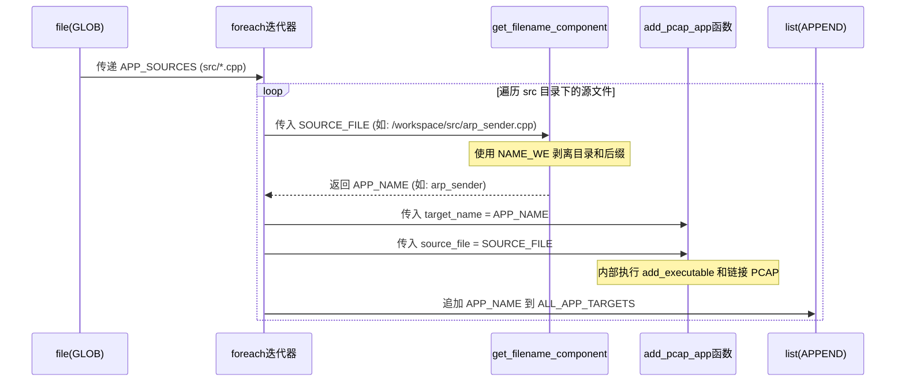
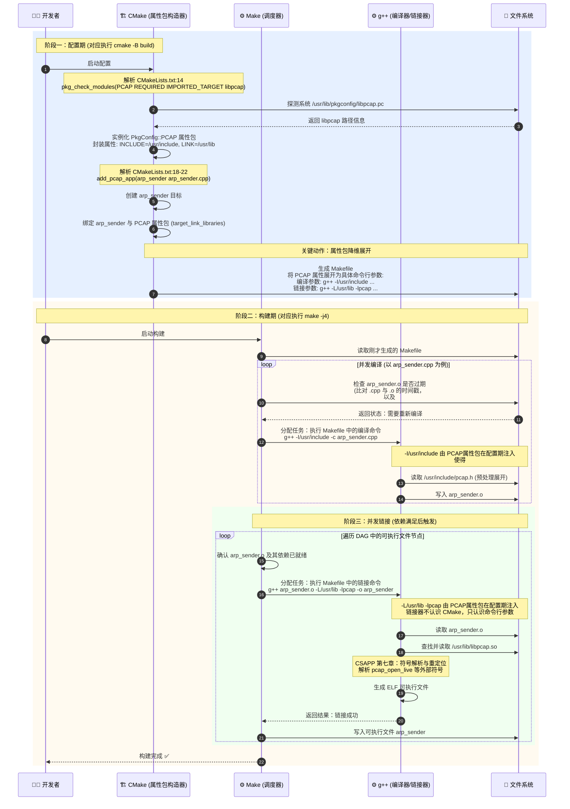

# CMake 与 Clang-Format 第一性原理详解
## 代码语义分析
在 CMake 中，`function(add_pcap_app ...)` 相当于你在定义函数，而 `add_pcap_app(${APP_NAME} ...)` 则是在调用你刚刚定义的这个函数。它不是 CMake 的内置命令，而是你基于内置命令（`add_executable` 等）封装的快捷方式。
下面为你拆解这段代码的**函数语义**与**大写参数的流转过程**：
### 1. 函数语义解析：`add_pcap_app`
```cmake
function(add_pcap_app target_name source_file)
    add_executable(${target_name} ${source_file})
    target_link_libraries(${target_name} PRIVATE PkgConfig::PCAP)
endfunction()
```
- **语义**：这是一个**工厂函数**。它的作用是将“创建可执行文件”和“绑定 libpcap 依赖”这两个强绑定的动作封装在一起，避免每次手动写两行重复代码。
- **参数流转**：当你调用 `add_pcap_app(arp_sender arp_sender.cpp)` 时，`target_name` 接收 `arp_sender`，`source_file` 接收 `arp_sender.cpp`。
### 2. 大写参数的流转链路
这段脚本的核心目的是：**扫描源文件 -> 提取名字 -> 创建目标 -> 收集目标用于安装**。
我们以 `src/arp_sender.cpp` 为例，追踪大写变量的流转：
#### 📍 Step 1: `file(GLOB ...)` — 收集全路径
```cmake
file(GLOB APP_SOURCES "${CMAKE_CURRENT_SOURCE_DIR}/src/*.cpp")
```
- **动作**：`GLOB` 会像 Linux 的 `ls` 命令一样，扫描指定目录下的所有 `.cpp` 文件，并将它们的**绝对路径**存入变量 `APP_SOURCES`。
- **此时 `APP_SOURCES` 的值**：`["/workspace/src/arp_sender.cpp", "/workspace/src/ip_parser.cpp", ...]`
#### 📍 Step 2: `foreach(...)` — 剥离出单个全路径
```cmake
foreach(SOURCE_FILE ${APP_SOURCES})
```
- **动作**：遍历 `APP_SOURCES` 列表，每次循环将其中一个全路径赋值给 `SOURCE_FILE`。
- **此时 `SOURCE_FILE` 的值**：`"/workspace/src/arp_sender.cpp"`
#### 📍 Step 3: `get_filename_component(...)` — 提取纯文件名
```cmake
get_filename_component(APP_NAME ${SOURCE_FILE} NAME_WE)
```
- **动作**：这是关键的**降维打击**。`NAME_WE` (Name Without Extension) 的作用是从完整路径中剥离目录和后缀，只保留文件名主体。
- **此时 `APP_NAME` 的值**：`"arp_sender"` （去掉了 `/workspace/src/` 和 `.cpp`）
#### 📍 Step 4: `add_pcap_app(...)` — 消费参数创建目标
```cmake
add_pcap_app(${APP_NAME} ${SOURCE_FILE})
```
- **动作**：将刚刚提取的纯名字和全路径作为实参，传入你定义的函数。
- **函数内部展开等效于**：
  ```cmake
  add_executable(arp_sender /workspace/src/arp_sender.cpp)
  target_link_libraries(arp_sender PRIVATE PkgConfig::PCAP)
  ```
#### 📍 Step 5: `list(APPEND ...)` — 收集目标名供安装使用
```cmake
list(APPEND ALL_APP_TARGETS ${APP_NAME})
```
- **动作**：将当前的 `APP_NAME`（如 `arp_sender`）追加到全局列表 `ALL_APP_TARGETS` 中。
- **目的**：为了在文件末尾的 `install(TARGETS ${ALL_APP_TARGETS} ...)` 中使用。因为 `install` 命令需要知道所有要安装的可执行文件的名字（即 CMake Target 名），而不是源文件路径。
### 💡 总结：参数流转全景图
通过这种流转，CMake 实现了**路径（用于编译）**与**名称（用于链接和安装）**的完美分离与各取所需。

## Cmake链接全流程时序图详解

---

## 一、 CMakeLists.txt：从文本到构建的映射法则

CMake 绝不是编译器，它是一个**构建脚本生成器**。它的第一性原理是：**将人类可读的依赖与目标声明，转化为底层构建工具（如 Make、Ninja）能理解的 DAG（有向无环图）**。

### 1. 声明边界与元数据
```txt
cmake_minimum_required(VERSION 3.10)
project(game-server-engine)
```
*   **第一性**：告诉 CMake 解释器，解析此文件所需的最低语法版本（防止使用新特性在旧版 CMake 上崩溃），并定义项目的命名空间根。

### 2. 编译器行为约束
```txt
set(CMAKE_CXX_STANDARD 17)
set(CMAKE_CXX_STANDARD_REQUIRED ON)
set(CMAKE_CXX_EXTENSIONS OFF)
```
*   **第一性**：向生成的构建图注入编译器参数。
*   `REQUIRED ON` 等价于 `-std=c++17`，如果编译器不支持则直接中断。
*   `EXTENSIONS OFF` 禁止 GNU 扩展（如 `-std=gnu++17`），保证代码跨平台纯度。

### 3. 依赖发现：PkgConfig 的桥接
```txt
find_package(PkgConfig REQUIRED)
pkg_check_modules(PCAP REQUIRED IMPORTED_TARGET libpcap)
```
*   **第一性**：解决“外部库在哪里”的问题。CMake 自己不懂 `libpcap`，但它懂 PkgConfig。PkgConfig 去系统路径（如 `/usr/lib/pkgconfig/`）查找 `libpcap.pc` 文件，提取出头文件路径（`-I`）和库文件路径（`-L -l`）。
*   **IMPORTED_TARGET**：这是现代 CMake 的灵魂。它将零散的 `-I` 和 `-L` 变量封装成一个虚拟目标 `PkgConfig::PCAP`，实现了依赖的拓扑传递。

### 4. 目标与依赖拓扑
```txt
function(add_pcap_app target_name source_file)
    add_executable(${target_name} ${source_file})
    target_link_libraries(${target_name} PRIVATE PkgConfig::PCAP)
endfunction()
```
*   **第一性**：构建图中的**节点**与**边**。
*   `add_executable` 创建了一个叶子节点（产出物为 ELF 可执行文件）。
*   `target_link_libraries` 建立了一条有向边：`target_name` 依赖 `PkgConfig::PCAP`。`PRIVATE` 意味着这个依赖只对当前目标可见，不会穿透到依赖当前目标的其他目标（这在头文件没有暴露 pcap 符号时是绝对正确的）。

### 5. 批量实例化的逻辑谬误与修正
```txt
file(GLOB APP_SOURCES "${CMAKE_CURRENT_SOURCE_DIR}/src/*.cpp")
foreach(SOURCE_FILE ${APP_SOURCES})
    ...
endforeach()
```
*   **第一性**：`file(GLOB)` 在 **CMake 配置阶段（执行 cmake .. 时）** 读取文件系统快照，生成一个字符串列表。它**不会**在构建阶段（执行 make 时）监听文件的新增。
*   **逻辑缪点**：如果你新增了 `src/new_app.cpp`，不重新运行 `cmake ..`，Make 根本不知道它的存在。这是 CMake 官方强烈反对 GLOB 源文件的原因，但在学习期项目中被广泛容忍。

### 6. 安装：文件系统的投影规则
```txt
install(TARGETS ${ALL_APP_TARGETS} RUNTIME DESTINATION bin)
install(DIRECTORY src/include/ DESTINATION include)
```
*   **第一性**：`install` 本质上是一个**后置的 `cp` 命令生成器**。
*   `RUNTIME DESTINATION bin`：告诉系统，属于 RUNTIME 产出物（即可执行文件）的，拷贝到 `${CMAKE_INSTALL_PREFIX}/bin`。
*   `DIRECTORY src/include/`：注意结尾的 `/`！在 CMake 中，目录名以 `/` 结尾代表**拷贝目录内容**，不以 `/` 结尾代表**拷贝目录本身**。这里将里面的 `.hpp` 拷贝到 `include/`。

> ⚠️ **修复当前代码的逻辑谬误**：
> 你的文件末尾有**两段完全重复**的 `install(DIRECTORY src/include/ ...)`，这会导致安装时执行两次无意义的拷贝，需删除一段。
> 代码位置：[CMakeLists.txt](CMakeLists.txt#L47-L50)

---

## 二、 .clang-format：AST 级别的代码重写引擎

`.clang-format` 不是简单的正则替换，它是基于 Clang 的 **AST（抽象语法树）** 解析器。它的第一性原理是：**在语法树层面理解代码结构，再按照规则重新生成文本**。

### 1. 执行机制：它如何作用？
当你触发格式化时（如 IDE 保存时，或命令行 `clang-format -i src/*.cpp`）：
1.  Clang 启动前端词法/语法分析器，将 C++ 代码解析为 AST。
2.  遍历 AST 节点（如函数定义、循环体），根据 `.clang-format` 中的键值对计算每个 Token 的**缩进层级**和**换行惩罚值**。
3.  按照计算结果重新输出代码文本。

### 2. 你的配置逐行拆解

```yaml
BasedOnStyle: Google
```
*   **继承机制**：类似 Java 的类继承。你继承了 Google 风格的数百个默认值，后续的配置将**覆盖**（Override）这些默认值。

```yaml
IndentWidth: 4
```
*   **覆盖**：Google 默认是 2 空格缩进，你将其修正为更符合 C++ 主流审美的 4 空格。

```yaml
ColumnLimit: 100
```
*   **惩罚机制**：AST 生成器在决定是否换行时，会计算一行代码的长度。如果超过 100 字符，换行的“收益”将大于“惩罚”，引擎会强制在合适的语法节点（如逗号、运算符）处断行。

```yaml
BreakBeforeBraces: Attach
```
*   **大括号粘合**：`Attach` 意味着大括号紧贴上一行（K&R 风格，如 `if (true) {`）。如果是 `Allman` 则会换行（`if (true)\n{`）。

```yaml
AllowShortFunctionsOnASingleLine: Empty
```
*   **AST 节点识别**：只允许**空函数体**单行展示。如 `void foo() {}` 合法，但 `void bar() { return; }` 必须换行。

```yaml
AllowShortIfStatementsOnASingleLine: WithoutElse
```
*   **逻辑分支判断**：允许没有 `else` 分支的短 `if` 写在一行（`if (x) return;`），但如果有 `else`，为了视觉对称性，强制换行。

```yaml
AllowShortLoopsOnASingleLine: true
```
*   允许 `while (true) continue;` 这种单行循环。

```yaml
SortIncludes: true
```
*   **依赖拓扑排序**：对 `#include` 指令按字母顺序排序。这不仅是美观，更降低了合并冲突的概率。

```yaml
AccessModifierOffset: -4
```
*   **缩进微调**：对于 `public:`、`private:` 等访问修饰符，向左偏移 4 格，使其与类声明对齐，而内部的成员变量相对修饰符再缩进 4 格。

```yaml
PointerAlignment: Left
```
*   **语意绑定**：将 `*` 或 `&` 靠左绑定变量名（`int* ptr` 而非 `int *ptr`）。这在 C++ 中更符合类型优先的直觉。

---

## 三、 总结：工程化的闭环

你的项目现在形成了一个完美的闭环：
1.  **CMake** 负责解决**机器层面**的拓扑依赖（谁编译谁，谁链接谁，产物放哪）。
2.  **Clang-Format** 负责解决**人类层面**的认知负载（消除代码风格争议，让 Code Review 聚焦于逻辑）。

只需修复 `CMakeLists.txt` 中重复的 install 语句，你的底层逻辑将毫无缪点。